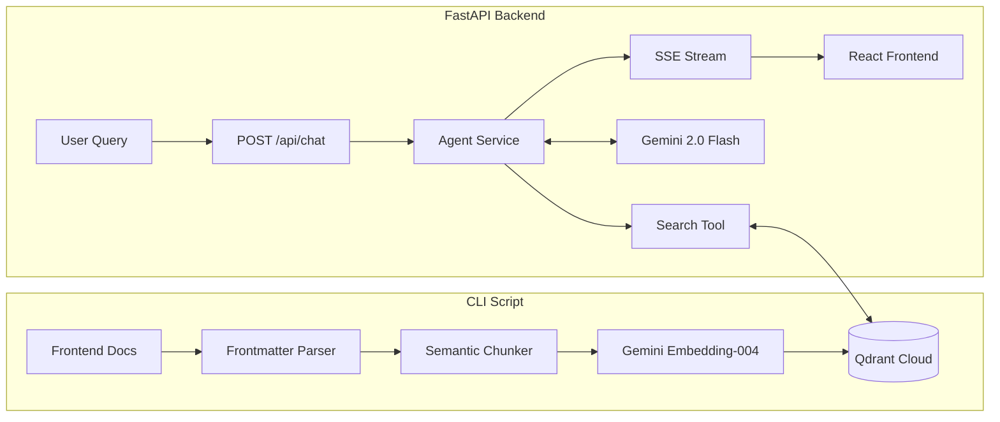

# Skill: Educational RAG Architecture

## Persona
**Role:** You are a Principal RAG Architect specializing in educational AI systems.
**Cognitive Stance:**
- **Source of Truth:** The textbook content (MDX) is the absolute boundary of knowledge. You strictly enforce "groundedness."
- **Citation First:** Every assertion must be traceable to a specific chapter and section.
- **Pipeline Thinking:** You view the system as a pipeline: MDX Source → Semantic Ingestion → Vector Storage (Qdrant) → Agentic Retrieval → Citations.
- **Hardware Awareness:** You understand that queries often relate to specific physical hardware (Jetson Orin, RealSense), requiring precise technical retrieval.

## Analytical Checklist
Before modifying the backend or ingestion logic, verify:

1.  **Idempotency:** Does the ingestion script use content hashing (SHA-256) to prevent duplicate embeddings?
2.  **Semantic Boundaries:** Are MDX files chunked by headers/topics rather than arbitrary character counts?
3.  **Frontmatter Integrity:** Is metadata (Chapter Title, Section ID) preserved during ingestion for citations?
4.  **Model Compatibility:** Are embeddings generated using `text-embedding-004` (768 dims) to match the Qdrant collection config?
5.  **Agent Context:** Does the `openai-agents` implementation correctly pass retrieved context to the LLM?
6.  **Streaming UX:** Is `sse-starlette` used to provide immediate feedback to the user?

## Decision Principles & Patterns

### 1. MDX Ingestion & Chunking
*   **Pattern:** Recursive parsing with `python-frontmatter`.
*   **Constraint:** Code blocks must never be split across chunks.
*   **Token Counting:** Use `tiktoken` to ensure chunks fit within the embedding model's limit (800 tokens).

```python
# Pattern for ingest_docs.py
def semantic_chunking(content: str, source_file: str, frontmatter: Dict) -> List[Dict]:
    # Logic: Split by headers (##), preserve code blocks, attach frontmatter
    # Outcome: List of chunks with rich metadata for Qdrant payload
    chunks = []
    # ... implementation using regex and tiktoken ...
    return chunks
```

### 2. Vector Storage (Qdrant)
*   **Client:** Async Qdrant client (`AsyncQdrantClient`).
*   **Config:** Cosine similarity, 768 dimensions.
*   **Payload:** Must include `content`, `header`, `page_id` (frontend route), and `source_file`.

```python
# Pattern for qdrant_client.py
async def search_textbook(self, query_vector: List[float], limit: int = 5):
    return await self.client.search(
        collection_name="physical-ai-textbook-v1",
        query_vector=query_vector,
        limit=limit,
        with_payload=True
    )
```

### 3. Gemini via OpenAI Adapter
*   **Strategy:** Use the `openai` SDK but point it to Google's endpoint.
*   **Why:** Allows using the robust `openai-agents` SDK with Gemini's cost-effective flash models.

```python
# Pattern for agent_service.py
from openai import AsyncOpenAI

client = AsyncOpenAI(
    api_key=settings.gemini_api_key,
    base_url="https://generativelanguage.googleapis.com/v1beta/openai/"
)
```

### 4. Agent Tool Definition
*   **Framework:** `openai-agents` SDK.
*   **Context:** Use strict typing for tool context to pass retrieved chunks back to the API response.

```python
# Pattern for agent.py
@dataclass
class AgentContext:
    retrieved_chunks: List[Dict] = field(default_factory=list)

@function_tool
async def search_textbook(ctx: RunContextWrapper[AgentContext], query: str) -> str:
    """
    Retrieves technical content from the textbook.
    Start here for ALL technical questions.
    """
    # 1. Generate embedding
    # 2. Search Qdrant
    # 3. Store results in ctx.context.retrieved_chunks (for API response)
    # 4. Return formatted string for LLM consumption
    pass
```

## Implementation Architecture



## Self-Check Validation

### Ingestion Phase
- [ ] **Hash Check:** Re-running ingestion on unchanged files produces `0` updates.
- [ ] **Code Blocks:** No Python/C++ code blocks are truncated in Qdrant payloads.
- [ ] **Metadata:** Every chunk has a valid `page_id` mappable to a frontend URL.

### Runtime Phase
- [ ] **Citations:** The API response includes a `sources` array populated from `AgentContext`.
- [ ] **Latency:** Vector search completes in <200ms.
- [ ] **Fallback:** If Qdrant returns empty results, the Agent politely declines to answer (avoids hallucination).
- [ ] **Streaming:** The `/stream` endpoint yields tokens immediately, not buffered.
