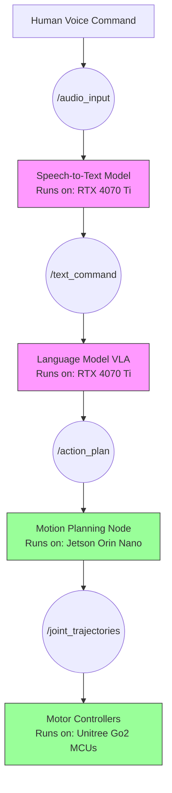

# Digital AI vs Physical AI

## The Brain Location Problem

Let's start with a deceptively simple question: **Where does the AI "live"?**

For ChatGPT, the answer is clear: a server rack in an OpenAI data center. When you type a prompt, your text travels hundreds of miles through fiber optic cables to rows of NVIDIA H100 GPUs, gets tokenized, processed by a transformer model with 1.76 trillion parameters, and returns as text.

**Digital AI lives in the cloud.** Its "body" is the data center. Its "senses" are API requests. Its "actions" are generating text, images, or audio.

Now consider the Tesla Optimus humanoid robot. Its "brain" is split across two locations:
1. **Training Brain**: NVIDIA A100 clusters in Tesla's Palo Alto data center (trains the vision-language-action model)
2. **Inference Brain**: An embedded computer in the robot's torso (runs the model at 30 Hz to control 28 actuators)

**Physical AI lives in the robot.** Its body is actuators and sensors. Its senses are cameras, LiDAR, IMUs. Its actions are joint torques that move limbs.

This distinction isn't academic. It fundamentally changes your engineering constraints.

## The Tale of Two Systems

Let's compare two AI systems performing "similar" tasks:

### Digital AI: GPT-4 Writing a Recipe

```python
import openai

response = openai.ChatCompletion.create(
    model="gpt-4",
    messages=[{"role": "user", "content": "Write a recipe for chocolate chip cookies"}]
)

print(response.choices[0].message.content)
```

**Constraints:**
- **Latency**: 2-5 seconds (acceptable for text generation)
- **Error Handling**: Retry with exponential backoff if API fails
- **Physics**: None. The model doesn't need to know actual oven temperatures.
- **Safety**: Content filters for harmful text

### Physical AI: Robot Baking Cookies

```python
import rclpy
from rclpy.node import Node
from sensor_msgs.msg import Image
from geometry_msgs.msg import Twist

class CookieBakingRobot(Node):
    MAX_GRIPPER_FORCE = 10.0  # Newtons (eggs break at 12N)
    OVEN_SAFE_TEMP = 180.0    # Celsius (model trained at 175-185C)

    def __init__(self):
        super().__init__('cookie_robot')

        # Subscribe to RealSense depth camera
        self.depth_sub = self.create_subscription(
            Image, '/camera/depth/image_raw', self.depth_callback, 10
        )

        # Publish gripper commands to Unitree G1 hand
        self.gripper_pub = self.create_publisher(Twist, '/gripper/cmd', 10)

    async def pick_egg(self, depth_image: Image) -> bool:
        """
        Constraints that don't exist in Digital AI:
        - Depth camera has 2mm error at 1m distance
        - Gripper servo has 50ms latency
        - Egg shell fractures at 12N force
        - If we drop the egg, there's no "undo"
        """
        # ... grip force control code ...
```

**Constraints (Physical AI has ALL of these):**
- **Latency**: 33ms max (30 Hz control loop or robot falls)
- **Error Handling**: Can't "retry" after dropping an egg
- **Physics**: Must model gravity, friction, torque limits
- **Safety**: Emergency stop if gripper force exceeds 10N

:::danger The Irreversibility of Physical Actions
Digital AI can regenerate a bad response. Physical AI cannot unbreak an egg. This is why we obsess over safety constraints (force limits, e-stops, collision detection).
:::

## Key Differences: A Hardware Perspective

| Aspect | Digital AI (GPT-4) | Physical AI (Humanoid Robot) |
|--------|-------------------|------------------------------|
| **Compute Location** | Cloud data center (H100 GPUs) | Edge device (Jetson Orin Nano) |
| **Latency Tolerance** | 2-10 seconds acceptable | &lt;33ms or system fails |
| **Input Modality** | Text, images (static) | Video streams (30 FPS), IMU (100 Hz), joint encoders (1 kHz) |
| **Output Modality** | Text, images, audio | Joint torques, gripper forces, motor velocities |
| **Physics Understanding** | Learned from text (abstract) | Learned from interaction (embodied) |
| **Failure Mode** | Bad text output | Robot falls, breaks object, injures human |
| **Error Recovery** | Regenerate response | May be impossible (broken hardware) |
| **Training Data** | Internet-scale text/images | Human demonstrations (expensive to collect) |
| **Deployment Cost** | $0.03 per 1K tokens | $2,700 robot + $499 Jetson + sensors |

## Understanding Physical Laws Through Embodiment

This is where things get philosophically interesting. **Can an AI truly understand "heavy" without ever lifting something?**

GPT-4 can tell you:
- "A 20kg dumbbell is heavy for most people"
- "Lifting heavy objects can cause back injury"
- "Heavy objects have more gravitational potential energy"

But a humanoid robot **feels** heavy:
- Its joint torque sensors spike when lifting 20kg vs 5kg
- Its balance controller compensates for the shifted center of mass
- Its battery drain increases due to higher motor currents

This embodied learning creates a different kind of intelligence. When Boston Dynamics' Atlas robot navigates a construction site, it's not following a scripted path—it's using its IMU to detect slippery surfaces, its cameras to identify obstacles, and its leg actuators to adjust gait in real-time.

**That's Physical AI.** Intelligence that functions in reality, not just in token space.

## The Compute Spectrum

In practice, most Physical AI systems use **both** Digital and Physical AI:



**Key Insight:**
- **Digital AI (pink boxes)**: Runs on powerful GPUs, handles language/vision understanding
- **Physical AI (green boxes)**: Runs on edge devices, handles real-time control

This is why your workstation has an RTX 4070 Ti (for training VLA models) **and** you deploy to a Jetson Orin Nano (for inference at 30 Hz on the robot).

## Industry Examples

### Digital AI in Production
- **ChatGPT**: Text generation in data centers
- **DALL-E 3**: Image synthesis on cloud GPUs
- **GitHub Copilot**: Code completion (runs in VS Code, calls Azure backend)

### Physical AI in Production
- **Tesla Optimus**: Warehouse automation (Gen 2 can walk at 0.6 m/s)
- **Boston Dynamics Spot**: Industrial inspection (carries 14kg payload)
- **Figure 01**: BMW factory assembly (success rate: 87% on connector insertion)
- **Amazon Proteus**: Autonomous mobile robot (handles 360kg carts)

Notice the trend? **Physical AI success metrics are measured in physical units**: meters per second, kilograms, success rate percentage. Not BLEU scores or perplexity.

## Why This Matters for Your Code

When you write ROS 2 nodes for a humanoid robot, you're straddling both worlds:

**Digital AI Code** (can use `time.sleep()`, doesn't care about latency):
```python
# Image captioning node (NOT real-time critical)
def describe_scene(self, image: Image) -> str:
    response = openai.ChatCompletion.create(...)  # 2-3 second latency OK
    return response.choices[0].message.content
```

**Physical AI Code** (NEVER use blocking calls):
```python
# Balance controller (MUST run at 100 Hz)
class BalanceController(Node):
    def __init__(self):
        super().__init__('balance_controller')
        # WRONG: time.sleep(0.01) would cause robot to fall
        # RIGHT: Use a timer with precise 10ms period
        self.create_timer(0.01, self.control_loop)
```

:::tip Hardware Reality Check
If your ROS 2 node uses `time.sleep()` anywhere in the control loop, it will NOT work on a real robot. The Jetson's OS scheduler will introduce jitter, and your robot will stumble. Use `self.create_timer()` instead.
:::

## Next: From Brain-in-a-Box to Brain-in-a-Body

Now that you understand Digital AI lives in data centers and Physical AI lives in robots, let's explore **why** Physical AI needs a body at all. Can't we just give GPT-4 an API to a robot arm and call it a day?

Spoiler: No. And the reason has to do with something called **embodied intelligence**.

Turn the page.
