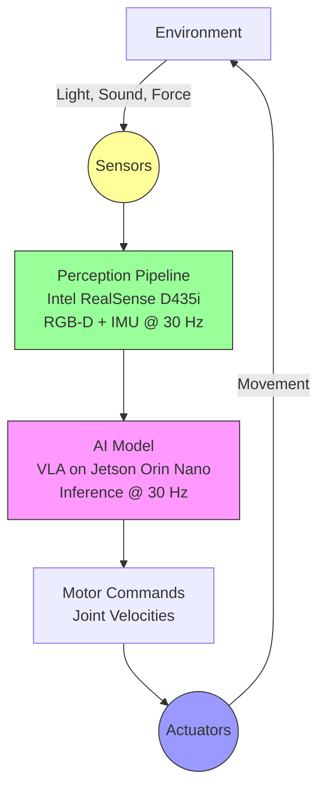

# Brain in a Box vs Brain in a Body

## The Thought Experiment

Imagine you were raised in a sealed room with no windows. Your only interaction with the outside world is through text messages. People describe colors, textures, temperatures, and physical sensations to you in exquisite detail.

After 20 years of reading every book ever written, you know:
- Ice melts at 0°C
- Sandpaper has a grit rating system
- Red is wavelength ~700nm
- Heavy objects require more force to lift

**Question:** Do you truly understand "cold," "rough," "red," or "heavy"?

This is the **brain-in-a-box problem**. It's the situation every Large Language Model finds itself in. GPT-4 has read millions of documents about the physical world, but it has never **touched** anything.

Now imagine we give you a body. You step outside and:
- Touch ice: Your temperature sensors spike down to 0°C
- Grip sandpaper: Your pressure sensors detect high-frequency vibration
- Look at a stop sign: Your RGB camera registers [255, 0, 0] in the red channel
- Lift a dumbbell: Your joint torque sensors max out

**This is embodied intelligence.** Knowledge learned through physical interaction, not abstract symbol manipulation.

## The Sensor-Action Loop

Physical AI systems fundamentally operate on a different architecture than Digital AI. Instead of the text-in/text-out paradigm, they use a continuous **sensorimotor loop**:



**Key Insight:** There's no "final output" like in Digital AI. The loop runs continuously at 30 Hz (or higher for critical systems). The robot is **always** sensing and acting.

### The Hardware Stack for Embodiment

Let's make this concrete. Here's the actual sensor-action loop for a Unitree Go2 quadruped robot running a ROS 2 navigation stack on a Jetson Orin Nano:

#### 1. Sensors (Environment → Data)
```python
# Intel RealSense D435i specifications
CAMERA_FPS = 30  # Hz
DEPTH_RESOLUTION = (640, 480)
RGB_RESOLUTION = (1920, 1080)
DEPTH_RANGE = (0.3, 10.0)  # meters
IMU_FREQUENCY = 200  # Hz (accelerometer + gyroscope)
```

**Physical Meaning:**
- The D435i stereo cameras emit infrared patterns and measure disparity
- Every 33ms, you get a depth map (307,200 depth values)
- The BMI055 IMU measures acceleration in 3 axes at 200 Hz
- **This is raw sensory data**, like your eyes and inner ear

#### 2. Perception (Data → Understanding)
```python
import rclpy
from rclpy.node import Node
from sensor_msgs.msg import Image, Imu
from cv_bridge import CvBridge
import numpy as np

class PerceptionNode(Node):
    """
    Fuses RGB-D and IMU to build a 3D understanding of the environment.
    Runs on: Jetson Orin Nano (1024-core NVIDIA Ampere GPU)
    """
    def __init__(self):
        super().__init__('perception_node')

        self.depth_sub = self.create_subscription(
            Image, '/camera/depth/image_raw', self.depth_callback, 10
        )
        self.imu_sub = self.create_subscription(
            Imu, '/camera/imu', self.imu_callback, 10
        )

        self.bridge = CvBridge()
        self.latest_depth: np.ndarray | None = None
        self.robot_tilt: float = 0.0  # radians

    def depth_callback(self, msg: Image) -> None:
        """
        Process depth frames to detect obstacles.
        Latency budget: &lt;10ms (to stay under 30 Hz loop)
        """
        depth_image = self.bridge.imgmsg_to_cv2(msg, desired_encoding='32FC1')

        # Detect obstacles in 1m x 1m grid in front of robot
        forward_zone = depth_image[240:480, 200:440]  # pixels
        min_distance = np.nanmin(forward_zone)  # meters

        if min_distance < 0.5:  # Obstacle within 50cm
            self.get_logger().warn(f'Obstacle detected at {min_distance:.2f}m')
            # Trigger avoidance behavior

    def imu_callback(self, msg: Imu) -> None:
        """
        Estimate robot tilt from accelerometer.
        Critical for balance on uneven terrain.
        """
        # Extract pitch from linear acceleration
        ax = msg.linear_acceleration.x
        az = msg.linear_acceleration.z
        self.robot_tilt = np.arctan2(ax, az)

        if abs(self.robot_tilt) > 0.3:  # ~17 degrees
            self.get_logger().error('Robot tilting! Emergency stop!')
```

**Physical Meaning:**
- The Jetson processes 307,200 depth values every 33ms
- It's not "understanding" depth abstractly—it's measuring **actual distances in meters**
- The IMU detects tilt by measuring gravity's pull on a micro-electromechanical system (MEMS)

#### 3. Action (Understanding → Movement)
```python
from geometry_msgs.msg import Twist

class MotionController(Node):
    MAX_LINEAR_VEL = 0.5   # m/s (Unitree Go2 spec: 3.5 m/s max, but we're cautious)
    MAX_ANGULAR_VEL = 0.8  # rad/s

    def __init__(self):
        super().__init__('motion_controller')
        self.cmd_pub = self.create_publisher(Twist, '/cmd_vel', 10)

    def move_forward(self, distance: float) -> None:
        """
        Send velocity command to Unitree Go2 motors.
        The robot's internal controllers convert this to joint torques.
        """
        cmd = Twist()
        cmd.linear.x = self.MAX_LINEAR_VEL

        # Publish at 30 Hz (motor controllers expect continuous commands)
        self.cmd_pub.publish(cmd)
```

**Physical Meaning:**
- The `Twist` message becomes 12 joint torque commands (3 per leg × 4 legs)
- Each motor draws 5-15W of power from the 15,000 mAh battery
- If the battery drops below 20%, the robot executes a safe shutdown

:::warning The 30 Hz Tyranny
Why do we keep mentioning 30 Hz? Because the Unitree Go2's motor controllers expect velocity commands **at least every 33ms**. If you miss a deadline, the robot assumes communication failure and **emergency stops**. This is non-negotiable hardware reality.
:::

## Embodied Learning: How a Robot Learns "Heavy"

Let's contrast how Digital AI vs Physical AI would learn the concept of "heavy."

### Digital AI (GPT-4)
**Training Data:** Text from Wikipedia, physics textbooks, Reddit threads
```
Heavy (adjective):
- Of great weight; difficult to lift or move
- Physics: An object with mass m experiences gravitational force F = mg
- Example: "The box was too heavy to carry"
```

**Result:** GPT-4 can define "heavy," use it in sentences, even solve physics problems. But if you ask it "Is a 10kg dumbbell heavy for you?" it can only answer statistically based on training data.

### Physical AI (Humanoid Robot)
**Training Data:** 10,000 human demonstrations of picking up objects

```python
class ObjectManipulation:
    """
    Learned from human teleoperation data:
    - Objects < 5kg: Gripper force 5-10N, lift speed 0.3 m/s
    - Objects 5-15kg: Gripper force 15-25N, lift speed 0.1 m/s
    - Objects > 15kg: Two-handed grip required, slow lift
    """
    def __init__(self):
        self.torque_history = []  # Record joint torques during lifts

    def pick_object(self, estimated_mass: float) -> bool:
        """
        The robot FEELS heavy through:
        1. Joint torque sensors (units: Newton-meters)
        2. Battery current draw (units: Amperes)
        3. IMU detecting center-of-mass shift
        """
        if estimated_mass > 15.0:
            self.get_logger().warn('Object heavy! Engaging two-handed grip')
            required_torque = estimated_mass * 9.81 * 0.3  # Simplified model
            return self.two_hand_lift(required_torque)
```

**Result:** The robot doesn't just "know" heavy—it has a **calibrated internal model** learned from physical interaction. When it lifts 10kg, its joint torques spike to specific values. It "knows" heavy in Newton-meters.

## The Body Shapes the Mind

Here's a profound implication: **The type of body determines what you can learn.**

A quadruped robot (Unitree Go2) develops different intelligence than a humanoid (Unitree G1):

| Capability | Quadruped (Go2) | Humanoid (G1) |
|-----------|-----------------|---------------|
| **Stability** | 4-point contact = inherently stable | 2-point contact = requires active balancing |
| **Speed** | 3.5 m/s max speed | 1.8 m/s max speed |
| **Manipulation** | No hands (limited to pushing) | 5-finger hands (can grasp tools) |
| **Environment** | Optimized for outdoor terrain | Optimized for human-built spaces |
| **Learning From** | Animal locomotion datasets | Human demonstration datasets |

**Why does this matter?** Because humanoid robots can learn from **YouTube videos of humans**. There are billions of hours of humans opening doors, climbing stairs, using tools. This is why companies like 1X Technologies and Figure AI chose the humanoid form factor—it unlocks an enormous training dataset.

A quadruped can't learn from "how to use a screwdriver" videos. Its body is incompatible with the task.

## Sim-to-Real: When the Body Is a Lie

Here's where embodiment gets tricky. In simulation (Gazebo, Isaac Sim), your robot has a "body" but it's **not real**:

```python
# In Gazebo simulation
simulated_mass = 12.5  # kg (perfect knowledge)
friction_coefficient = 0.6  # (perfectly modeled)
gravity = -9.81  # m/s^2 (exact)

# On the real Unitree Go2
actual_mass = 12.5 + random.uniform(-0.3, 0.3)  # Manufacturing tolerance
friction_coefficient = ???  # Depends on floor texture, humidity, wear
gravity = -9.81  # (OK, this one's the same)
```

**The Sim-to-Real Gap:** Your robot learns in a perfect simulated body, then wakes up in a real body with:
- Sensor noise (RealSense depth has ±2mm error)
- Motor backlash (0.1-0.5mm play in joints)
- Battery voltage drop (velocity decreases as battery drains)
- Temperature effects (servos weaken at 70°C)

This is why Chapter 4 of every module is dedicated to Sim-to-Real transfer. **Embodiment is a hardware problem, not just a software problem.**

:::tip The RealSense Reality Check
The Intel RealSense D435i's depth accuracy is ±2mm at 1m distance. That means if your robot is grasping a cup 1 meter away, its understanding of the cup's position has a 2mm error. For precision tasks (threading a needle), this is catastrophic. You need sensor fusion (depth + RGB + tactile sensors).
:::

## From Philosophy to Practice

Embodied intelligence isn't just a cool concept—it changes your engineering approach:

1. **Hardware First:** Choose sensors based on task requirements (do you need sub-millimeter accuracy?)
2. **Latency Obsession:** Your control loop frequency determines what the robot can do (30 Hz = can walk, 100 Hz = can run, 1000 Hz = can do contact-rich manipulation)
3. **Failure Modes:** Physical robots fail in ways Digital AI never does (broken gears, dead batteries, sensor occlusion)

In the next section, we'll zoom out from individual robots to entire **systems** of collaboration: humans, AI agents, and robots working together. This is called the **Partner Economy**.

Ready to think at system scale? Turn the page.
