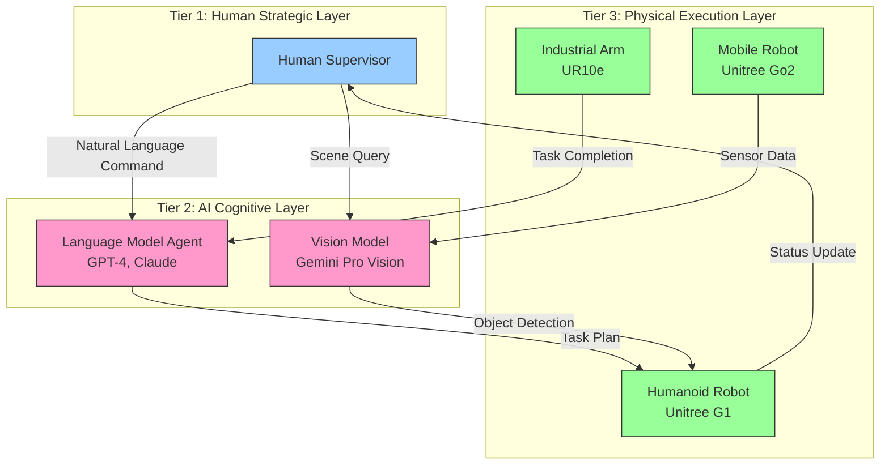

# The Partner Economy: Humans + AI Agents + Robots

## Beyond the Human vs Robot Narrative

The media loves the "robots taking our jobs" story. It's dramatic, polarizing, and fundamentally **wrong**.

The future isn't humans **or** robots. It's humans **and** AI agents **and** robots working as a tiered system, each doing what it does best. NVIDIA CEO Jensen Huang calls this the **Partner Economy**—a term that reframes automation as collaboration, not replacement.

Here's the architecture:



Let's break down each tier with a real-world example: **Amazon warehouse automation**.

## Tier 1: The Human Strategic Layer

**What Humans Do Best:**
- High-level decision-making
- Handling edge cases
- Ethical judgment
- Creative problem-solving

**What Humans Do Poorly:**
- Repetitive tasks for 8 hours straight
- Sub-centimeter precision
- Lifting 20kg objects 500 times per day
- Working in -20°C freezers

### Real Example: Amazon Fulfillment Center

A human supervisor oversees a 500,000 sq ft warehouse with 300 robots. Their role:

```python
# This is NOT code a robot runs—it's the human's mental model
class WarehouseManager:
    def handle_shift(self):
        # Morning briefing
        self.review_overnight_incidents()  # 3 robots failed, 1 human injury

        # Strategic decision (AI can't make this call)
        if self.is_prime_day():
            self.increase_robot_count(from_=200, to=300)
            self.extend_human_shifts(hours=2)

        # Monitor dashboard (AI agents summarize data)
        self.check_kpis()  # Packages/hour, error rate, robot uptime

        # Handle exceptions (robots escalate edge cases)
        for anomaly in self.get_anomalies():
            if anomaly.type == 'unknown_object':
                self.human_inspect(anomaly)  # AI vision model failed
```

**Key Insight:** The human doesn't tell each robot where to go. They set **strategic parameters** (throughput targets, safety zones, priority queues), and the AI + robot layers execute.

## Tier 2: The AI Cognitive Layer

**What AI Agents Do Best:**
- Pattern recognition across massive data
- Natural language understanding
- Vision-language grounding (seeing + describing)
- Generating action plans from goals

**What AI Agents Do Poorly:**
- Anything requiring physical movement
- Real-time control (they have 2-5 second latency)
- Understanding novel physical scenarios (out-of-distribution)

### Real Example: Voice-Commanded Robot Fleet

A warehouse worker says: *"Move the stack of red boxes near dock 7 to cold storage."*

```python
import openai
from typing import List, Dict

class LanguageToActionAgent:
    """
    Runs on: RTX 4070 Ti workstation (NOT on the robot)
    Latency: 2-3 seconds (too slow for real-time control)
    """
    def __init__(self):
        self.client = openai.OpenAI(api_key="...")

    def parse_command(self, voice_input: str) -> Dict[str, any]:
        """
        Use GPT-4 to convert natural language to structured action plan.
        """
        prompt = f"""
        You are a warehouse robot command parser. Convert this human command
        to a structured JSON action plan:

        Command: "{voice_input}"

        Output format:
        {{
            "object": "description of target object",
            "source_location": "where to find it",
            "destination": "where to move it",
            "robot_type": "mobile_robot" or "humanoid" or "industrial_arm"
        }}
        """

        response = self.client.chat.completions.create(
            model="gpt-4",
            messages=[{"role": "user", "content": prompt}]
        )

        # Parse GPT-4's JSON output
        action_plan = json.loads(response.choices[0].message.content)
        return action_plan

    def dispatch_to_robots(self, action_plan: Dict) -> None:
        """
        Send the plan to appropriate robots via ROS 2 topics.
        """
        if action_plan['robot_type'] == 'mobile_robot':
            # Publish to Unitree Go2 fleet
            self.publish_nav_goal(location=action_plan['source_location'])
        elif action_plan['robot_type'] == 'humanoid':
            # Publish to Unitree G1 (for manipulation tasks)
            self.publish_pick_task(object_desc=action_plan['object'])
```

**Key Insight:** The AI agent doesn't directly control motors. It translates human intent into robot-executable commands. Think of it as a "universal translator" between human language and robot protocols.

### Vision-Language Models: The Eyes of the System

AI agents also interpret camera feeds:

```python
from openai import OpenAI
from sensor_msgs.msg import Image
from cv_bridge import CvBridge

class VisionAgent(Node):
    """
    Runs Gemini Pro Vision to answer questions about camera feeds.
    Example: "Are there any obstacles in the robot's path?"
    """
    def __init__(self):
        super().__init__('vision_agent')
        self.client = OpenAI(
            api_key=GEMINI_API_KEY,
            base_url="https://generativelanguage.googleapis.com/v1beta/openai/"
        )
        self.bridge = CvBridge()

        self.camera_sub = self.create_subscription(
            Image, '/camera/rgb/image_raw', self.image_callback, 10
        )

    def image_callback(self, msg: Image) -> None:
        # Convert ROS Image to base64
        cv_image = self.bridge.imgmsg_to_cv2(msg, 'rgb8')
        base64_image = self.encode_image(cv_image)

        # Ask Gemini to describe the scene
        response = self.client.chat.completions.create(
            model="gemini-1.5-flash",
            messages=[{
                "role": "user",
                "content": [
                    {"type": "text", "text": "Describe any obstacles in this image."},
                    {"type": "image_url", "image_url": {"url": f"data:image/jpeg;base64,{base64_image}"}}
                ]
            }]
        )

        description = response.choices[0].message.content
        self.get_logger().info(f'Vision Agent: {description}')
```

**Key Insight:** The vision model runs at **0.3-0.5 Hz** (2-3 seconds per frame). This is why it can't be used for real-time obstacle avoidance (which needs 30 Hz). It's for **high-level scene understanding**, not low-level control.

## Tier 3: The Physical Execution Layer

**What Robots Do Best:**
- Repetitive precision tasks
- Operating in hazardous environments (heat, cold, toxins)
- 24/7 operation (no breaks, no sleep)
- Lifting heavy objects (20-100kg)

**What Robots Do Poorly:**
- Adapting to completely novel scenarios
- Making ethical decisions
- Handling fragile objects without training

### Real Example: Humanoid Robot Executing the Plan

The Unitree G1 receives the command: *"Pick the red boxes near dock 7."*

```python
import rclpy
from rclpy.node import Node
from geometry_msgs.msg import PoseStamped
from std_msgs.msg import String

class HumanoidExecutor(Node):
    """
    Runs on: Jetson Orin Nano (on the Unitree G1's backpack computer)
    Control Loop: 30 Hz (must publish joint commands every 33ms)
    """
    def __init__(self):
        super().__init__('humanoid_executor')

        # Subscribe to high-level commands from AI agent
        self.task_sub = self.create_subscription(
            String, '/ai_agent/task', self.task_callback, 10
        )

        # Publish low-level motor commands
        self.joint_cmd_pub = self.create_publisher(
            JointState, '/unitree_g1/joint_commands', 10
        )

        # Timer for 30 Hz control loop
        self.create_timer(0.033, self.control_loop)  # 33ms = 30 Hz

        self.current_task: str | None = None

    def task_callback(self, msg: String) -> None:
        """
        Receive task from AI agent (e.g., "pick red box at dock 7").
        This runs at ~0.5 Hz (whenever AI agent sends a new task).
        """
        self.current_task = msg.data
        self.get_logger().info(f'New task: {self.current_task}')

    def control_loop(self) -> None:
        """
        CRITICAL: This runs at 30 Hz. If we miss deadlines, robot falls.
        """
        if self.current_task is None:
            return  # Idle state

        # Execute task using motion primitives
        if 'pick' in self.current_task:
            joint_positions = self.compute_grasp_trajectory()
            self.publish_joint_commands(joint_positions)

    def compute_grasp_trajectory(self) -> List[float]:
        """
        Convert high-level task to 23 joint angles (Unitree G1 has 23 DOF).
        This uses inverse kinematics + learned grasping policy.
        """
        # ... complex math happens here ...
        return [0.1, -0.5, 0.3, ...]  # 23 joint angles in radians
```

**Key Insight:** The robot operates at **two time scales**:
1. **Task level** (0.5 Hz): Receive high-level goals from AI agent
2. **Control level** (30 Hz): Execute low-level motor commands

The AI agent doesn't need to know about inverse kinematics or joint torques. The robot doesn't need to understand English. **They operate at different abstraction layers.**

## The Complete System: A Warehouse Pick-and-Place Task

Let's trace a command through all three tiers:

### Step 1: Human Issues Command (Tier 1)
```
Human Supervisor: "Move urgent packages from Zone A to outbound dock."
```

### Step 2: AI Agent Plans Task (Tier 2)
```python
# GPT-4 parses command
action_plan = {
    "priority": "urgent",
    "source": "Zone A",
    "destination": "outbound dock",
    "robot_selection": "assign 5 mobile robots + 2 humanoids"
}

# Gemini Vision identifies packages
vision_response = "Detected 47 packages in Zone A. 12 are marked 'urgent' (red labels)."

# AI agent generates robot assignments
robot_tasks = [
    {"robot_id": "go2_001", "action": "navigate", "waypoints": [...]},
    {"robot_id": "g1_003", "action": "pick", "target_object": "urgent packages"},
]
```

### Step 3: Robots Execute (Tier 3)
```python
# Unitree Go2 mobile robot
go2_001.navigate_to(zone_a)  # 30 Hz control loop

# Unitree G1 humanoid
g1_003.pick_package(object_desc="red label box")  # 30 Hz grasp control
g1_003.place_package(location=outbound_dock)
```

### Step 4: Status Update Back to Human
```python
# AI agent summarizes progress
summary = "Moved 12/12 urgent packages in 8 minutes. No incidents."

# Human supervisor receives dashboard update
dashboard.update(status=summary, completion=100%)
```

## Why This Three-Tier Model Works

| Tier | Speed | Flexibility | Cost per Hour |
|------|-------|-------------|---------------|
| **Human** | Slow (task/hour) | Extremely flexible | $25-50 (warehouse worker) |
| **AI Agent** | Medium (task/minute) | High (can learn new commands) | $0.03 (GPT-4 API calls) |
| **Robot** | Fast (task/second) | Low (needs training per task) | $3-5 (amortized hardware + power) |

**The Strategy:**
- Use humans for 1% of tasks (edge cases, strategy)
- Use AI agents for 9% of tasks (planning, vision, language)
- Use robots for 90% of tasks (repetitive physical work)

:::tip The Economics of Collaboration
A Unitree G1 costs ~$16,000. If it replaces 2 hours of human labor per day (at $30/hour), it pays for itself in 267 days. BUT, it requires human oversight (safety, edge cases) and AI agents for task planning. The ROI comes from **collaboration**, not replacement.
:::

## Real-World Deployments

### Tesla Factory (Fremont, CA)
- **Tier 1:** 50 human supervisors per shift
- **Tier 2:** Tesla's custom VLA model (runs on in-house AI cluster)
- **Tier 3:** 600+ industrial robots + 20 Optimus humanoids (pilot program)
- **Result:** 95% of repetitive tasks automated, human workers focus on quality control

### Amazon Robotics (300+ facilities)
- **Tier 1:** 1 human per 30 robots
- **Tier 2:** Alexa for warehouse voice commands + computer vision for package sorting
- **Tier 3:** 750,000+ mobile robots (Kiva/Proteus/Hercules)
- **Result:** 2.5x increase in packages per hour vs non-automated warehouses

### BMW Factory (Leipzig, Germany)
- **Tier 1:** Human workers on assembly line
- **Tier 2:** None (interestingly, BMW uses minimal AI agents—robots are pre-programmed)
- **Tier 3:** UR10e cobots (collaborative robots) work alongside humans
- **Result:** 85% of welding automated, 0 human injuries from robots (vs 12/year before automation)

## What This Means for Your Learning Path

As you progress through this textbook, you'll work in **Tier 3** (programming robots), but you need to understand Tier 2 (AI agents) to design the right interfaces.

**Your role as a Physical AI engineer:**
1. Build ROS 2 nodes that subscribe to AI agent commands
2. Implement 30 Hz control loops that execute those commands
3. Design sensor fusion pipelines that feed data back to AI agents
4. Deploy this entire stack on a Jetson Orin Nano running on a Unitree robot

You're the bridge between AI (language, vision) and robotics (motors, sensors).

## Next: Why This Matters (and Why Now)

We've covered **what** Physical AI is and **how** it collaborates with humans and AI agents. But why is this technology exploding **right now** in 2024-2025?

The answer involves three converging trends: hardware breakthroughs (Jetson Orin), dataset abundance (YouTube videos of humans), and industry momentum (Tesla, Figure, 1X). Let's explore why this is the decade of humanoid robots.

Turn the page.
