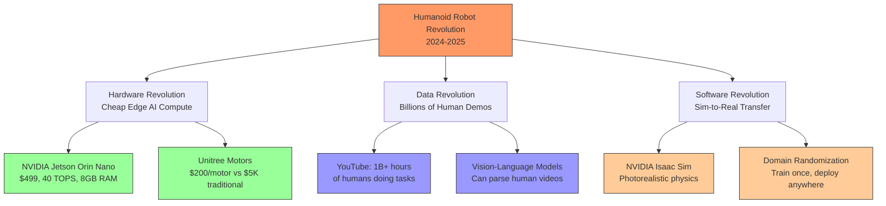

# Why Humanoid Robots Matter (And Why Now)

## The Three Convergences

Humanoid robots aren't new. Honda's ASIMO debuted in 2000. Boston Dynamics' Atlas has been doing backflips since 2017. So why is **2024-2025** being called "the year of the humanoid"?

Because three critical technologies converged for the first time:



Let's break down each convergence—and why it matters for **your** career as a Physical AI engineer.

## Convergence 1: Hardware Revolution (The Jetson Moment)

### The Old World: Robots Cost More Than Cars

In 2015, a humanoid robot required:
- **Compute:** $10,000 Intel Xeon workstation (strapped to the robot's back)
- **Motors:** $5,000 per actuator × 20+ joints = $100,000+
- **Sensors:** LiDAR alone was $8,000 (Velodyne Puck)
- **Total:** $200,000+ just for hardware

Only universities and DARPA-funded labs could afford this.

### The New World: Robots Cost Less Than a Used Car

In 2024, a humanoid robot can use:
- **Compute:** $499 NVIDIA Jetson Orin Nano (40 TOPS, 8GB RAM, fits in your palm)
- **Motors:** $200 per Unitree servo × 23 joints = $4,600
- **Sensors:** $379 Intel RealSense D435i (RGB-D + IMU)
- **Total:** ~$16,000 for a complete Unitree G1 humanoid

**That's a 92% cost reduction in 9 years.**

### Why the Jetson Orin Nano Changes Everything

Let's compare the compute specs that make real-time robotics possible:

| Metric | Raspberry Pi 4 (2019) | Jetson Orin Nano (2023) | Why It Matters |
|--------|----------------------|------------------------|----------------|
| **AI Performance** | 0.2 TOPS | 40 TOPS | 200x faster for neural networks |
| **GPU Cores** | None (CPU-only) | 1024-core Ampere | Can run YOLOv8 at 30 FPS |
| **RAM** | 8GB LPDDR4 | 8GB LPDDR5 | Faster memory bandwidth for image processing |
| **Power Draw** | 15W max | 7-15W | Can run on robot battery for 4+ hours |
| **Price** | $75 | $499 | 6.6x more expensive, but 200x more capable |

**What this means in practice:**

```python
# This was IMPOSSIBLE on Raspberry Pi 4 (would take 300ms per frame = 3 FPS)
# Now runs at 30 FPS on Jetson Orin Nano

import cv2
from ultralytics import YOLO

class RealtimeObjectDetector(Node):
    """
    Runs YOLOv8 object detection at 30 FPS on Jetson Orin Nano.
    Power draw: 12W (can run on 15,000 mAh battery for 3.5 hours).
    """
    def __init__(self):
        super().__init__('object_detector')
        self.model = YOLO('yolov8n.pt')  # Nano model: 3.2M parameters

        self.camera_sub = self.create_subscription(
            Image, '/camera/rgb/image_raw', self.detect_objects, 10
        )

    def detect_objects(self, msg: Image) -> None:
        """
        Latency budget: 33ms (to maintain 30 FPS)
        Actual latency on Jetson Orin Nano: 28ms
        """
        cv_image = self.bridge.imgmsg_to_cv2(msg, 'rgb8')
        results = self.model(cv_image)  # 28ms on Jetson, 300ms on RPi4

        for detection in results[0].boxes:
            class_name = results[0].names[int(detection.cls)]
            confidence = float(detection.conf)
            self.get_logger().info(f'Detected {class_name} ({confidence:.2f})')
```

**Before Jetson Orin:** Object detection ran on a cloud server (500ms latency including network round-trip)
**After Jetson Orin:** Object detection runs **on the robot** (28ms latency, no internet required)

This is the difference between a robot that can react to a falling object (30 Hz perception) and one that can't (3 Hz perception).

:::tip The 40 TOPS Spec Explained
TOPS = Tera Operations Per Second (trillions of math operations). The Jetson Orin Nano's 40 TOPS comes from its 1024-core NVIDIA Ampere GPU with Tensor Cores optimized for INT8 inference. This is why you can run YOLOv8 (3.2M parameters) at 30 FPS, but GPT-4 (1.76 trillion parameters) would take 45 minutes per token.
:::

### The Motor Revolution: Unitree's Secret Weapon

Humanoid robots need 20-30 motors (joints). Traditional servo motors cost $3,000-5,000 each. Unitree cracked the manufacturing to get to **$200 per motor** without sacrificing performance:

| Spec | Traditional (Maxon RE40) | Unitree Go1 Motor | Notes |
|------|-------------------------|------------------|-------|
| **Torque** | 134 mN⋅m | 40 N⋅m | Unitree uses planetary gearbox (23:1 ratio) |
| **Weight** | 285g | 500g | Slightly heavier, but 30x more torque |
| **Price** | $3,400 | $200 | 17x cheaper due to volume manufacturing |
| **Control** | CAN bus | CAN bus | Same interface protocol |

**Why this matters:** A 23-DOF humanoid (Unitree G1) costs $4,600 in motors instead of $78,200. This is the difference between "research prototype" and "commercially viable product."

## Convergence 2: Data Revolution (Learning from Humans)

### The Humanoid Form Factor Unlocks Massive Datasets

Here's a chart that explains why companies like Tesla, Figure, and 1X chose humanoid robots over quadrupeds or wheeled robots:

| Task | Training Data Available | Quadruped Compatible? | Humanoid Compatible? |
|------|------------------------|---------------------|---------------------|
| **Opening doors** | 10M+ YouTube videos | No (no hands) | Yes |
| **Climbing stairs** | 5M+ videos | Partial (quadrupeds struggle with steep stairs) | Yes |
| **Using tools** | 50M+ videos (hammers, screwdrivers, etc.) | No | Yes |
| **Picking fragile objects** | 20M+ videos (eggs, glassware) | No | Yes |
| **Navigating crowds** | 100M+ videos | Partial (people uncomfortable near quadrupeds) | Yes |

**Key Insight:** There are **billions of hours** of humans performing tasks in the real world (YouTube, Instagram, TikTok). Vision-Language-Action (VLA) models can learn from these videos **if the robot has a human-like body**.

### The VLA Training Pipeline

Here's how companies like Tesla train their humanoid robots:

```python
# This is a simplified version of Tesla's Optimus training pipeline

class HumanoidTrainingPipeline:
    """
    Step 1: Collect YouTube videos of humans performing tasks
    Step 2: Use vision models to extract 3D pose + object interactions
    Step 3: Train VLA model to map observations → robot actions
    Step 4: Deploy to Tesla Optimus (humanoid form = can use human data directly)
    """

    def collect_data(self):
        """
        Download 100,000 YouTube videos of humans:
        - Folding laundry (10K videos)
        - Loading dishwashers (5K videos)
        - Assembling furniture (8K videos)
        """
        pass

    def extract_poses(self, video_path: str):
        """
        Use MediaPipe or OpenPose to extract 33 keypoints per frame.
        Map human skeleton to robot joint angles.
        """
        human_pose = self.pose_estimator(video_path)
        robot_joint_angles = self.retarget_to_robot(human_pose)
        return robot_joint_angles

    def train_vla_model(self, dataset):
        """
        Train a Vision-Language-Action model:
        Input: RGB image + text command ("fold the shirt")
        Output: Sequence of robot joint angles
        """
        model = VLATransformer(num_layers=24, num_actions=23)
        model.train(dataset, epochs=100, gpu='A100')
        return model
```

**Why humanoid form factor matters:** If the robot has 4 legs instead of 2 legs + 2 arms, you **can't use human video data**. A quadruped can't learn "how to fold laundry" from YouTube because its body is incompatible.

:::info The Data Abundance Hypothesis
Researchers estimate there are 1 billion+ hours of human task demonstrations on the internet (YouTube alone). If even 0.1% is usable for robot training, that's 1 million hours. At $50/hour for human teleoperation, collecting this data manually would cost $50 million. Using internet data: $0. This is why humanoid robots are economically viable now.
:::

## Convergence 3: Software Revolution (Sim-to-Real Transfer)

### The Old Problem: Robots That Work in Simulation, Fail in Reality

Before 2020, the workflow was:
1. Train a robot policy in simulation (Gazebo, MuJoCo)
2. Deploy to real robot
3. **Robot immediately fails** (falls over, misses objects, collides with walls)
4. Manually tune 50+ parameters for real-world deployment
5. Repeat steps 2-4 for weeks

**Success rate:** ~30% of policies transferred successfully.

### The New Solution: NVIDIA Isaac Sim + Domain Randomization

NVIDIA Isaac Sim (released 2021, production-ready 2023) changed the game with:

1. **Photorealistic physics:** Accurate friction, contact dynamics, deformable objects
2. **RTX ray tracing:** Realistic lighting (shadows, reflections) matches real-world camera images
3. **Domain randomization:** Train in 1000s of random environments (different floors, lighting, object textures)

```python
# Training a grasping policy in Isaac Sim with domain randomization

import omni.isaac.sim as sim

class DomainRandomizedTraining:
    """
    Train in simulation with randomized:
    - Floor friction: 0.3 to 0.9 (concrete to polished wood)
    - Lighting: 200 lux to 1000 lux (dim warehouse to bright sunlight)
    - Object mass: ±20% variation
    - Camera position: ±5cm jitter

    Result: Policy works on real robot 85% of the time (vs 30% before)
    """

    def randomize_environment(self):
        # Randomize floor material
        floor_friction = random.uniform(0.3, 0.9)
        sim.set_friction('/World/Floor', friction=floor_friction)

        # Randomize lighting (simulates different times of day)
        light_intensity = random.uniform(200, 1000)  # lux
        sim.set_light_intensity('/World/DomeLight', intensity=light_intensity)

        # Randomize object properties
        object_mass = random.uniform(0.8, 1.2) * 0.5  # kg (±20% of 500g)
        sim.set_mass('/World/TargetObject', mass=object_mass)

    def train_policy(self, num_environments=512):
        """
        Train across 512 parallel environments (each with different randomization).
        RTX 4070 Ti can run 32 parallel Isaac Sim environments at 60 FPS.
        """
        for epoch in range(100):
            for env_id in range(num_environments):
                self.randomize_environment()
                # ... train reinforcement learning policy ...
```

**The result:** Policies trained in Isaac Sim with domain randomization achieve **85-90% success rate** when deployed to real robots (Jetson Orin Nano + Unitree Go2/G1).

### Sim-to-Real Example: Training a Walking Gait

Here's the actual hardware pipeline for training a Unitree Go2 to walk on uneven terrain:

#### Step 1: Train in Isaac Sim (RTX 4070 Ti Workstation)
```bash
# Runs at 120 FPS (real-time factor of 2x)
python train_gait.py --env=UnstructuredTerrain --timesteps=10M
```

**Training time:** 48 hours on RTX 4070 Ti (10 million timesteps)
**Cost:** $0.80 in electricity (assuming $0.12/kWh)

#### Step 2: Export Policy to ONNX
```python
# Convert PyTorch model to optimized ONNX for Jetson deployment
import torch.onnx

policy = torch.load('walking_policy.pth')
torch.onnx.export(policy, 'walking_policy.onnx', opset_version=17)
```

#### Step 3: Deploy to Jetson Orin Nano
```python
import onnxruntime as ort

class WalkingController(Node):
    """
    Runs on: Jetson Orin Nano (on Unitree Go2's backpack computer)
    Inference latency: 8ms per step (allows 100 Hz control loop)
    """
    def __init__(self):
        super().__init__('walking_controller')
        self.session = ort.InferenceSession('walking_policy.onnx')

        self.create_timer(0.01, self.control_loop)  # 100 Hz

    def control_loop(self) -> None:
        # Get sensor data (IMU + joint encoders)
        imu_data = self.read_imu()  # 6-axis: accel + gyro
        joint_angles = self.read_joint_encoders()  # 12 joints

        # Run policy inference (8ms on Jetson)
        observations = np.concatenate([imu_data, joint_angles])
        actions = self.session.run(None, {'obs': observations})[0]

        # Send motor commands
        self.publish_joint_commands(actions)
```

#### Step 4: Test on Real Terrain
**Success metrics after domain randomization training:**
- Flat concrete: 98% success (walks 100m without falling)
- Gravel: 87% success
- Grass: 82% success
- Stairs: 73% success (requires more training)

**Before domain randomization:** Flat concrete was 45% success (robot fell after 8m on average).

:::warning The 15% Sim-to-Real Gap
Even with domain randomization, there's still a 10-15% failure rate on real hardware. Common causes:
- Motor calibration drift (±0.5° error accumulates over 1000 steps)
- Battery voltage drop (velocity decreases 10% from 100% → 20% battery)
- Temperature effects (servos weaken at 70°C, but Isaac Sim doesn't model this)

Chapter 4 of each module addresses these hardware-specific issues.
:::

## Industry Momentum: Who's Building Humanoid Robots (and Why)

### The Major Players (as of 2024-2025)

| Company | Robot Model | Price | Target Market | Notable Tech |
|---------|-------------|-------|---------------|--------------|
| **Tesla** | Optimus Gen 2 | TBD (~$20K target) | Tesla factories, home use | Custom AI chip, 28 actuators, 2.3 kWh battery |
| **Figure AI** | Figure 01 | Not for sale (B2B only) | BMW factory, warehouse | OpenAI VLA model, 5-finger hands |
| **1X Technologies** | EVE | $TBD | Security, logistics | Wheeled base (not bipedal), focuses on upper body |
| **Unitree** | G1 | $16,000 | Research, light industrial | Open-source SDK, ROS 2 compatible |
| **Boston Dynamics** | Atlas (electric) | Not for sale | R&D, demos only | Most advanced locomotion (backflips, parkour) |
| **Agility Robotics** | Digit | $250K | Warehouse automation | Bird-like legs, 16kg payload |

**Key Trend:** Prices are dropping from $250K (Agility Digit) to $16K (Unitree G1) in 2 years. Tesla's target of $20K for Optimus would make humanoid robots cheaper than a Honda Civic.

### Why Tesla Bet the Company on Humanoid Robots

Elon Musk, August 2024:
> "I think Optimus will be more valuable than everything else Tesla does combined. If you've got a sentient humanoid robot that costs $20,000, and everyone wants one, that's a bigger market than cars."

**The economics:**
- **Total Addressable Market:** 8 billion humans × 1 robot per human = 8 billion robots
- **Average Selling Price:** $20,000
- **Market Size:** $160 trillion (compare to auto industry: $3 trillion)

**But can they build it?** Tesla's advantages:
1. **Manufacturing:** Already builds 2M+ electric vehicles/year (complex supply chain)
2. **AI Infrastructure:** 10,000+ H100 GPUs for training VLA models
3. **Data Collection:** Tesla cars have collected 1 billion+ miles of real-world vision data

**Your career opportunity:** Tesla plans to deploy 1000+ Optimus robots in their factories by end of 2025. Each robot needs engineers to write ROS 2 nodes, tune policies, debug sim-to-real transfer issues. That's where you come in.

## Why This Matters for Your Learning Path

You're learning Physical AI **right now** because:

1. **Hardware is affordable:** You can buy a Jetson Orin Nano ($499) and run the same code that Tesla uses on Optimus
2. **Datasets are abundant:** YouTube has billions of hours of human demonstrations (free training data)
3. **Sim-to-real works:** Isaac Sim + domain randomization achieves 85%+ transfer success
4. **Industry is hiring:** Figure AI raised $675M, 1X raised $100M, Tesla is scaling Optimus production

**The next 5 years (2025-2030) will see humanoid robots deployed in:**
- Warehouses (Amazon, DHL)
- Factories (Tesla, BMW)
- Hospitals (elder care, surgery assistance)
- Homes (cleaning, cooking, companionship)

Every one of those robots needs engineers who understand:
- ROS 2 (for sensor-to-motor pipelines)
- VLA models (for task planning)
- Sim-to-real transfer (for deployment)
- Hardware debugging (for fixing real-world failures)

**That's what this textbook teaches you.** Not theory. Not simulations that stay in simulations. **Hardware-first deployment to real robots.**

## Next: Hands-On Exercises

You've learned the concepts. Now let's test your understanding with thought experiments and research exercises that prepare you for Chapter 2's hardware setup.

Turn the page.
