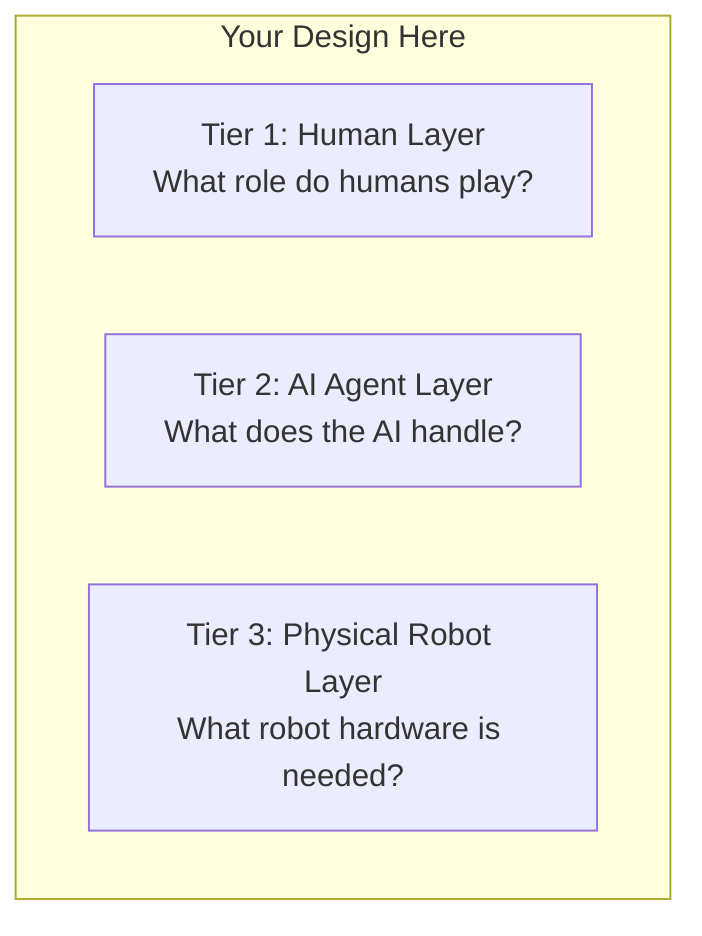

# Chapter 1 Exercises

## Exercise 1: Design a Physical AI System

**Scenario:** A hospital needs a robot to deliver medications from the pharmacy to patient rooms (50 rooms across 3 floors, 24/7 operation).

### Part A: System Architecture Design

Design the **three-tier Partner Economy architecture** for this system:



**Answer the following questions:**

1. **Tier 1 (Human Strategic Layer):**
   - How many human supervisors are needed per shift?
   - What decisions should humans make (vs delegating to AI)?
   - What happens if a robot encounters a locked door?

2. **Tier 2 (AI Cognitive Layer):**
   - Should you use a cloud-based AI (GPT-4) or edge-based AI (on the robot)?
   - What language commands should the AI understand? (Give 3 examples)
   - How does the AI handle emergencies (e.g., patient coded, need medication NOW)?

3. **Tier 3 (Physical Execution Layer):**
   - Quadruped (Unitree Go2) or Humanoid (Unitree G1)? Justify your choice.
   - What sensors are required? (Hint: Think about elevators, crowded hallways, stairs)
   - What's the control loop frequency needed? (Is 30 Hz sufficient, or do you need 100 Hz?)

### Part B: Failure Mode Analysis

For **each tier**, identify one failure mode and how the system recovers:

| Tier | Failure Mode | Recovery Strategy |
|------|--------------|-------------------|
| **Human** | Supervisor falls asleep during night shift | *(Your answer)* |
| **AI Agent** | Language model misinterprets "Room 305" as "Room 035" | *(Your answer)* |
| **Robot** | Jetson Orin Nano overheats (throttles to 50% performance) | *(Your answer)* |

### Part C: Hardware Specification

Specify the **exact hardware** you'd use (reference Chapter 1 examples):

```python
class HospitalDeliveryRobot:
    """
    Fill in the hardware specifications based on your design.
    """
    # Compute platform
    BRAIN = "???"  # Options: Jetson Orin Nano, Jetson AGX Orin, Jetson Orin NX

    # Robot platform
    BASE = "???"   # Options: Unitree Go2, Unitree G1, custom wheeled base

    # Sensors
    CAMERA = "???" # Options: Intel RealSense D435i, ZED 2, OAK-D
    LIDAR = "???"  # Options: RPLIDAR A1, Velodyne Puck Lite, None

    # Motor specs
    NUM_MOTORS = ???  # How many joints/wheels?
    MOTOR_TORQUE = ???  # Newton-meters (for payload capacity)

    # Battery
    BATTERY_CAPACITY = ???  # mAh
    OPERATING_TIME = ???    # hours per charge
```

**Constraints:**
- Budget: $25,000 per robot (hospital approved budget)
- Payload: Must carry 5kg of medication trays
- Speed: Must travel 100 meters in &lt;2 minutes
- Safety: Must detect humans 3 meters ahead and stop within 0.5 meters

:::tip Grading Rubric
- **Tier design:** Is the human/AI/robot division logical? (30%)
- **Hardware specs:** Did you choose appropriate components for the task? (40%)
- **Failure recovery:** Are your recovery strategies realistic? (30%)
:::

---

## Exercise 2: Digital AI vs Physical AI Classification

Classify each scenario as requiring **Digital AI**, **Physical AI**, or **Both**. Justify your answer.

| Scenario | Digital AI | Physical AI | Both | Justification |
|----------|-----------|-------------|------|---------------|
| 1. Translate English medical records to Spanish | [ ] | [ ] | [ ] | *(Your answer)* |
| 2. Perform robotic surgery (da Vinci robot) | [ ] | [ ] | [ ] | *(Your answer)* |
| 3. Generate a 3D model of a protein structure | [ ] | [ ] | [ ] | *(Your answer)* |
| 4. Navigate a warehouse and retrieve a package | [ ] | [ ] | [ ] | *(Your answer)* |
| 5. Diagnose disease from X-ray images | [ ] | [ ] | [ ] | *(Your answer)* |
| 6. Fold laundry in a home environment | [ ] | [ ] | [ ] | *(Your answer)* |
| 7. Play chess at grandmaster level | [ ] | [ ] | [ ] | *(Your answer)* |
| 8. Defuse a bomb (EOD robot) | [ ] | [ ] | [ ] | *(Your answer)* |

**For each "Both" answer, explain:**
- What the Digital AI component does (e.g., image analysis)
- What the Physical AI component does (e.g., motor control)
- Where they interface (e.g., Digital AI sends "grasp at coordinate (x,y,z)" to Physical AI)

---

## Exercise 3: Research Assignment - Compare Humanoid Robots

Research **three different humanoid robots** and fill in the comparison table:

| Specification | Tesla Optimus Gen 2 | Figure 01 | Unitree G1 | Boston Dynamics Atlas (Electric) |
|--------------|---------------------|-----------|------------|----------------------------------|
| **Height** | ??? cm | ??? cm | ??? cm | ??? cm |
| **Weight** | ??? kg | ??? kg | ??? kg | ??? kg |
| **Degrees of Freedom** | ??? | ??? | ??? | ??? |
| **Battery Life** | ??? hours | ??? hours | ??? hours | ??? hours |
| **Walking Speed** | ??? m/s | ??? m/s | ??? m/s | ??? m/s |
| **Payload Capacity** | ??? kg | ??? kg | ??? kg | ??? kg |
| **Onboard Compute** | ??? | ??? | ??? | ??? |
| **Price** | ??? USD | ??? USD | ??? USD | ??? USD |
| **Target Market** | ??? | ??? | ??? | ??? |
| **Open Source SDK?** | Yes / No | Yes / No | Yes / No | Yes / No |

**Sources to use:**
- Company websites (Tesla AI, Figure AI, Unitree Robotics, Boston Dynamics)
- Technical papers (search "Optimus Gen 2 specifications" on arXiv)
- YouTube tech reviews (e.g., Marques Brownlee's Tesla Bot review)

**Analysis questions:**

1. **Which robot is best suited for warehouse automation?** Justify based on speed, payload, and battery life.

2. **Which robot is most accessible for university research?** Consider price, SDK availability, and ROS 2 compatibility.

3. **Which robot has the most advanced locomotion?** Watch demo videos and compare walking gaits, stair climbing, and balance recovery.

4. **If you had $50,000 to equip a robotics lab, which robot(s) would you buy?** You can choose multiple cheaper robots or one expensive robot.

---

## Exercise 4: Sim-to-Real Gap Prediction

You trained a grasping policy in NVIDIA Isaac Sim to pick up coffee mugs. The policy achieves **98% success rate in simulation**.

**Predict what will happen when you deploy to a real Unitree G1 robot** for each scenario:

### Scenario A: Indoor Office Environment
- **Floor:** Smooth tile (similar to simulation)
- **Lighting:** Bright LED (800 lux, same as simulation)
- **Mugs:** Identical to simulation models (same size, weight, texture)

**Predicted success rate on real robot:** ___%

**Justification:** *(Explain what sim-to-real issues might still occur)*

### Scenario B: Coffee Shop Environment
- **Floor:** Rough concrete (NOT in simulation training)
- **Lighting:** Variable (300-1200 lux, windows cause shadows)
- **Mugs:** Different brands, sizes, materials (ceramic, glass, metal)

**Predicted success rate on real robot:** ___%

**Justification:** *(Which specific sim-to-real gaps will cause failures?)*

### Scenario C: Outdoor Patio
- **Floor:** Wooden deck with gaps (NOT in simulation)
- **Lighting:** Direct sunlight (causes camera overexposure)
- **Mugs:** Wind blows light plastic mugs (dynamic environment)
- **Temperature:** 35°C (Jetson Orin Nano throttles at 40°C)

**Predicted success rate on real robot:** ___%

**Justification:** *(Rank the top 3 failure causes by severity)*

:::warning Real-World Answer Key
Industry benchmarks (from Figure AI, Tesla):
- Scenario A: 85-90% (small sensor noise, calibration errors remain)
- Scenario B: 60-75% (lighting + object variation is hard)
- Scenario C: 30-50% (outdoor environments are brutally difficult)

If your predictions are within 10% of these ranges, you understand sim-to-real transfer!
:::

---

## Exercise 5: Code Analysis - Find the Bug

The following ROS 2 node is supposed to make a Unitree Go2 robot navigate to waypoints. **It works perfectly in Gazebo simulation, but the real robot falls over after 3 seconds.**

```python
import rclpy
from rclpy.node import Node
from geometry_msgs.msg import Twist
from nav_msgs.msg import Odometry
import time

class WaypointNavigator(Node):
    def __init__(self):
        super().__init__('waypoint_navigator')

        self.cmd_pub = self.create_publisher(Twist, '/cmd_vel', 10)

        self.odom_sub = self.create_subscription(
            Odometry, '/odom', self.odom_callback, 10
        )

        self.current_x = 0.0
        self.current_y = 0.0
        self.target_x = 5.0  # meters
        self.target_y = 5.0  # meters

    def odom_callback(self, msg: Odometry) -> None:
        self.current_x = msg.pose.pose.position.x
        self.current_y = msg.pose.pose.position.y

        # Calculate distance to target
        distance = ((self.target_x - self.current_x)**2 +
                    (self.target_y - self.current_y)**2)**0.5

        if distance > 0.1:  # Haven't reached target
            cmd = Twist()
            cmd.linear.x = 0.5  # m/s

            self.cmd_pub.publish(cmd)

            # Wait for robot to move before checking again
            time.sleep(0.5)  # <--- BUG: What's wrong with this line?
        else:
            self.get_logger().info('Reached target!')
```

**Questions:**

1. **What's the bug?** (Hint: Re-read the "Brain in a Box vs Brain in a Body" section about `time.sleep()`)

2. **Why does it work in Gazebo but fail on the real robot?**

3. **How would you fix it?** Rewrite the code using proper ROS 2 patterns.

4. **What would happen if the real robot's Jetson Orin Nano was running 10 other nodes simultaneously?**

:::tip Answer Template
```python
class WaypointNavigatorFixed(Node):
    def __init__(self):
        super().__init__('waypoint_navigator_fixed')

        # YOUR FIXED CODE HERE
        # Hint: Use self.create_timer() instead of time.sleep()
```
:::

---

## Exercise 6: Thought Experiment - The Trolley Problem for Robots

A Unitree G1 humanoid robot is delivering medical supplies in a hospital hallway. Suddenly, a patient's IV stand rolls into the hallway, blocking the robot's path. The robot has two options:

**Option A:** Swerve left into a wall (damages $500 of medical supplies, robot undamaged)

**Option B:** Swerve right into a parked wheelchair (no damage to supplies, but wheelchair might get scratched)

**Option C:** Emergency stop (causes 30-second delay, patient waiting for urgent medication)

**Questions:**

1. **As the engineer who programmed the robot's decision logic, which option should the robot choose?** Justify using the Partner Economy framework (which tier should make this decision?).

2. **Should this decision be made by:**
   - The robot's onboard AI (30 Hz control loop, must decide in 33ms)?
   - A cloud-based AI agent (2-second latency, can reason more carefully)?
   - A human supervisor (10-second latency, has ethical judgment)?

3. **How would you implement this in code?** Write pseudocode for the decision logic.

4. **What if the obstacle was a human (doctor walking across hallway)?** Does your decision logic change?

:::info Learning Objective
This exercise has no "right" answer. The goal is to understand that Physical AI systems make **irreversible decisions in the real world**, unlike Digital AI which can always regenerate a response. Your job as an engineer is to design systems that escalate high-stakes decisions to humans when time permits.
:::

---

## Submission Guidelines

**Format:** Submit as a Markdown document or Jupyter Notebook with:
- Clear headings for each exercise
- Code snippets properly formatted (use triple backticks)
- Diagrams as Mermaid syntax or screenshots
- Citations for research sources

**Evaluation Criteria:**
- **Technical accuracy:** Did you reference specific hardware (Jetson, Unitree, RealSense)?
- **Systems thinking:** Did you consider the full stack (sensors → perception → AI → actuators)?
- **Sim-to-real awareness:** Did you identify realistic failure modes?
- **Code quality:** Is your fixed code production-ready (type hints, error handling)?

**Expected time:** 3-4 hours for all exercises (spread over a week)

---

## Next: Chapter Summary

Once you've completed these exercises, proceed to the Chapter 1 Summary to review key concepts before starting Chapter 2: Hardware Setup.

Turn the page.
