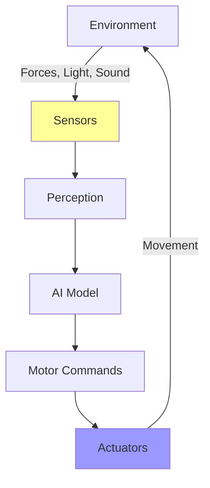
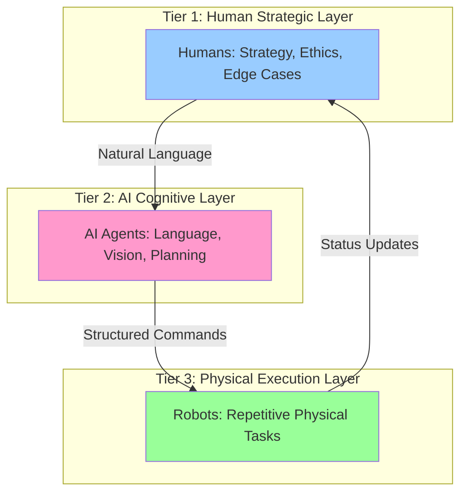

# Chapter 1 Summary: Embodied Intelligence

## The Core Thesis

**Physical AI is fundamentally different from Digital AI—not just in capability, but in architecture, constraints, and failure modes.**

When AI gets a body, it transforms from abstract reasoning (GPT-4 writing text) to **embodied intelligence** (a humanoid robot learning "heavy" by feeling 20kg resistance in its joint torque sensors).

This chapter established the conceptual foundation for everything you'll build in this textbook. Let's review the key concepts.

---

## Key Concept 1: Digital AI vs Physical AI

### Digital AI (Brain in a Box)
- **Lives in:** Data centers (NVIDIA H100 clusters)
- **Senses:** API requests (text, images, audio)
- **Acts:** Generates tokens (text, images, code)
- **Latency tolerance:** 2-10 seconds is acceptable
- **Error recovery:** Regenerate a bad response
- **Example:** ChatGPT translating French to English

### Physical AI (Brain in a Body)
- **Lives in:** Robots (Jetson Orin Nano on Unitree G1's backpack)
- **Senses:** Cameras (30 FPS), IMU (200 Hz), joint encoders (1 kHz)
- **Acts:** Motor commands (30-100 Hz control loop)
- **Latency tolerance:** &lt;33ms or robot falls over
- **Error recovery:** Often impossible (can't un-break an egg)
- **Example:** Tesla Optimus folding laundry

**The Fundamental Difference:**
```python
# Digital AI - Blocking calls are OK
response = openai.ChatCompletion.create(...)  # 2-second latency
time.sleep(1)  # No problem!

# Physical AI - NEVER block the control loop
class BalanceController(Node):
    def __init__(self):
        super().__init__('balance_controller')
        # WRONG: time.sleep(0.01) causes robot to fall
        # RIGHT: self.create_timer(0.01, self.control_loop)
```

---

## Key Concept 2: Embodied Intelligence

Intelligence learned through **physical interaction**, not abstract symbol manipulation.

### How a Robot Learns "Heavy" (vs GPT-4)

| Method | GPT-4 (Digital AI) | Unitree G1 (Physical AI) |
|--------|-------------------|--------------------------|
| **Training Data** | 10M+ Wikipedia articles about weight, physics, gravity | 10,000 human demonstrations of picking objects |
| **Understanding** | Statistical: "heavy objects are difficult to lift" (learned from text) | Embodied: 20kg object → 15 N⋅m joint torque (learned from sensors) |
| **Can Generalize?** | Yes, to novel text descriptions | Limited, needs training on similar objects |
| **Can Adapt to New Physics?** | No (doesn't experience physics) | Yes (sensors detect new forces in real-time) |

**The Sensorimotor Loop:**


This loop runs continuously at 30+ Hz. There's no "final output" like in Digital AI.

---

## Key Concept 3: The Partner Economy

**The future isn't Humans OR Robots—it's Humans AND AI Agents AND Robots.**

### Three-Tier Collaboration Model



**Real-World Example: Amazon Warehouse**
- **Tier 1:** 1 human supervisor per 30 robots (handles exceptions, sets strategy)
- **Tier 2:** Alexa for voice commands + computer vision for package sorting
- **Tier 3:** 750,000 mobile robots (Kiva, Proteus) moving packages
- **Result:** 2.5× increase in packages per hour

**Your Role as a Physical AI Engineer:**
Design the **interfaces** between Tier 2 (AI agents sending `"/cmd_vel"` messages) and Tier 3 (robots executing 30 Hz motor control).

---

## Key Concept 4: Why Humanoid Robots Matter Now

### The Three Convergences (2024-2025)

#### 1. Hardware Revolution
- **Jetson Orin Nano:** $499, 40 TOPS, 8GB RAM (200× faster AI than Raspberry Pi 4)
- **Unitree Motors:** $200/motor (17× cheaper than traditional servos)
- **Intel RealSense D435i:** $379 for RGB-D + IMU (vs $8,000 LiDAR in 2015)
- **Result:** Complete humanoid robot costs $16,000 (Unitree G1) vs $200,000 in 2015

#### 2. Data Revolution
- **YouTube:** 1 billion+ hours of humans performing tasks (free training data)
- **Vision-Language Models:** Can extract 3D poses from human videos
- **Why Humanoid?** Only humanoid robots can learn from human demonstration videos
- **Example:** Tesla trains Optimus on 100,000 YouTube videos of humans folding laundry

#### 3. Software Revolution (Sim-to-Real Transfer)
- **NVIDIA Isaac Sim:** Photorealistic physics + RTX ray tracing
- **Domain Randomization:** Train in 1000s of random environments (friction, lighting, object mass)
- **Transfer Success:** 85-90% policies work on real robots (vs 30% before 2020)
- **Example:** Train walking gait in Isaac Sim (48 hours), deploy to Unitree Go2 (87% success on gravel)

### Industry Momentum

| Company | Robot | Price | Target Market |
|---------|-------|-------|---------------|
| Tesla | Optimus Gen 2 | ~$20K (target) | Factories, homes |
| Figure AI | Figure 01 | B2B only | BMW factory, warehouses |
| Unitree | G1 | $16,000 | Research, light industrial |
| Boston Dynamics | Atlas (electric) | Not for sale | R&D demonstrations |

**Market Size:** 8 billion humans × $20K per robot = **$160 trillion potential market** (Elon Musk's estimate)

---

## Hardware Stack Summary

Throughout this chapter, we referenced specific hardware. Here's the complete stack you'll use in this textbook:

### Compute Platform
```python
WORKSTATION = {
    "GPU": "NVIDIA RTX 4070 Ti (12GB VRAM)",
    "CPU": "AMD Ryzen 9 / Intel i9",
    "RAM": "64GB DDR5",
    "Storage": "2TB NVMe SSD",
    "OS": "Ubuntu 22.04 LTS",
    "Use": "Train VLA models in Isaac Sim"
}

EDGE_DEVICE = {
    "Model": "NVIDIA Jetson Orin Nano",
    "AI Performance": "40 TOPS",
    "GPU": "1024-core Ampere",
    "RAM": "8GB LPDDR5",
    "Power": "7-15W",
    "Price": "$499",
    "Use": "Run ROS 2 nodes on robot (30 Hz inference)"
}
```

### Sensors
```python
RGB_D_CAMERA = {
    "Model": "Intel RealSense D435i",
    "Depth Resolution": "640×480 @ 30 FPS",
    "RGB Resolution": "1920×1080 @ 30 FPS",
    "Depth Accuracy": "±2mm at 1m",
    "IMU": "BMI055 (accel + gyro at 200 Hz)",
    "Price": "$379"
}
```

### Robot Platforms
```python
QUADRUPED = {
    "Model": "Unitree Go2",
    "DOF": "12 (3 per leg × 4 legs)",
    "Speed": "3.5 m/s max",
    "Payload": "5 kg",
    "Battery": "15,000 mAh (2-4 hours)",
    "Price": "$2,700",
    "Use": "Outdoor navigation, rough terrain"
}

HUMANOID = {
    "Model": "Unitree G1",
    "DOF": "23 (legs + arms + hands)",
    "Speed": "1.8 m/s max",
    "Payload": "3 kg (per hand)",
    "Battery": "9,000 mAh (1.5-2.5 hours)",
    "Price": "$16,000",
    "Use": "Manipulation tasks, human environments"
}
```

---

## Critical Lessons for Physical AI Development

### 1. Hardware Defines Your Constraints
- **30 Hz control loop:** Miss a deadline → robot falls
- **Sensor noise:** RealSense has ±2mm error → need sensor fusion
- **Battery life:** Velocity drops 10% from 100% → 20% charge
- **Temperature:** Jetson throttles at 40°C → monitor thermals

### 2. Simulation ≠ Reality (The Sim-to-Real Gap)
Even with domain randomization, expect:
- **10-15% failure rate** on real hardware
- **Calibration drift:** ±0.5° joint error accumulates over time
- **Latency jitter:** OS scheduling adds 5-10ms variance
- **Unmodeled physics:** Sensor occlusion, cable snagging, dust on lenses

### 3. Never Block the Control Loop
```python
# WRONG - Causes robot to fall
def control_loop(self):
    time.sleep(0.01)  # NEVER DO THIS
    self.publish_motor_commands()

# RIGHT - Use ROS 2 timers
def __init__(self):
    self.create_timer(0.01, self.control_loop)
```

### 4. Design for Failure Recovery
- **Graceful degradation:** If camera fails, switch to LiDAR-only navigation
- **Emergency stops:** If IMU detects >20° tilt, cut motor power
- **Human escalation:** If stuck for >30 seconds, alert supervisor

---

## Bridge to Chapter 2: Hardware Setup

You now understand **WHAT** Physical AI is and **WHY** it matters. You know:
- Digital AI lives in data centers; Physical AI lives in robots
- Embodied intelligence comes from physical interaction
- The Partner Economy combines human strategy, AI cognition, and robot execution
- 2024-2025 is the inflection point (affordable hardware, abundant data, working sim-to-real)

**But you haven't written a single line of ROS 2 code yet.**

That changes in Chapter 2. You'll:
1. Install ROS 2 Humble on Ubuntu 22.04
2. Set up your RTX 4070 Ti workstation for Isaac Sim
3. Flash the Jetson Orin Nano with Ubuntu 20.04 + ROS 2
4. Configure the Intel RealSense D435i
5. Write your first ROS 2 node (a "Hello World" that publishes to `/cmd_vel`)

**No more theory. Time to compile code and move motors.**

:::tip Before Chapter 2
Ensure you have:
- [ ] Ubuntu 22.04 installed (dual-boot or dedicated machine)
- [ ] NVIDIA RTX GPU (3060 or better)
- [ ] At least 20GB free disk space
- [ ] Basic Linux CLI skills (`cd`, `ls`, `sudo`)
- [ ] Python 3.11+ installed (`python3 --version`)

If you're on Windows, install WSL2 (Ubuntu 22.04) for early chapters. Hardware deployment (Jetson) requires native Linux.
:::

---

## Chapter 1 Checklist

Before proceeding, verify you can answer these questions:

- [ ] **Explain the difference between Digital AI and Physical AI in one sentence.**
- [ ] **Describe the sensorimotor loop and why it runs at 30+ Hz.**
- [ ] **Name the three tiers of the Partner Economy and give one example task for each.**
- [ ] **Explain why the Jetson Orin Nano enables real-time robotics (vs Raspberry Pi 4).**
- [ ] **Describe one sim-to-real gap and how domain randomization addresses it.**
- [ ] **Justify why humanoid robots can learn from YouTube videos (vs quadrupeds).**
- [ ] **Identify the bug in a ROS 2 node that uses `time.sleep()` in a callback.**

If you can confidently answer all seven, you're ready for Chapter 2.

If not, re-read the relevant sections. **Understanding these concepts is critical** because Chapter 2 moves fast—we assume you know **why** we're setting up hardware, not just **how**.

---

**Next Chapter:** [Chapter 2: Hardware Setup & ROS 2 Installation](../02-chapter-2-hardware-setup/00-intro.mdx)

Let's build.
