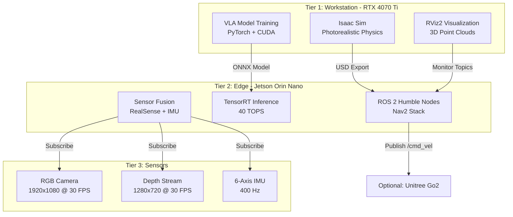

# Chapter 2: Hardware Setup - The Three-Tier Architecture

## The Hardware Mandate

**Blunt Reality**: You cannot run this course on a MacBook Pro, Raspberry Pi 4, or Windows laptop with integrated graphics.

Physical AI requires **three distinct compute tiers** working in harmony:

1. **Workstation (Digital Twin)** - NVIDIA RTX GPU for photorealistic simulation
2. **Edge Computer (Robot Brain)** - Jetson Orin Nano for real-time inference
3. **Sensors (Robot Perception)** - Intel RealSense D435i for environment understanding

This is not an arbitrary recommendation. It's a **technical requirement** dictated by the physics of rendering, the mathematics of deep learning, and the constraints of real-time robotics.

## Why Your Current Hardware Won't Work

### MacBook Pro / Apple Silicon
- **Isaac Sim requires RTX ray tracing** (NVIDIA OptiX renderer, not Metal API)
- **ROS 2 Humble targets Ubuntu 22.04** (not macOS, and Dockerized ROS has 30-40% performance penalty)
- **Metal Performance Shaders ≠ CUDA** (VLA models use CUDA kernels, no Metal equivalent)

### Raspberry Pi 4/5
- **CPU-only inference**: 2-3 seconds per frame for object detection
- **Jetson Orin Nano**: 40ms per frame (50× faster) using tensor cores
- **No hardware video encoding** for RealSense streams (USB bandwidth bottleneck)

### Windows + WSL2
- **WSL2 cannot access USB devices reliably** (RealSense D435i fails intermittently)
- **GPU passthrough is experimental** (Isaac Sim crashes on CUDA memory allocation)
- **Network bridge latency**: 10-15ms added to ROS 2 topic communication

### "I Have an RTX 3060 Laptop"
- **Thermal throttling**: Laptop GPUs downclock to 60% performance under sustained load
- **8GB VRAM limit**: Isaac Sim scene (4GB) + VLA model (6GB) = Out of Memory
- **No ECC memory**: Critical for multi-hour training runs (bit flips corrupt gradients)

## The Three-Tier Architecture

### Tier 1: Workstation (The Digital Twin)
**Purpose**: Simulate the entire robot + environment before touching hardware.

**Critical Workloads**:
- **Isaac Sim**: Ray-traced rendering at 60 FPS (requires RTX cores)
- **VLA Training**: 12-24 hour training runs (requires 12GB+ VRAM)
- **Gazebo Classic**: Fallback simulator for ROS 2 integration testing

**Minimum Specs**:
- GPU: NVIDIA RTX 4070 Ti (12GB VRAM, 7680 CUDA cores)
- CPU: Intel Core i7-13700K or AMD Ryzen 9 7900X
- RAM: 64GB DDR5 (32GB absolute minimum, will swap during training)
- Storage: 1TB NVMe SSD (Isaac Sim assets consume 300GB)
- OS: Ubuntu 22.04 LTS (dual-boot or dedicated machine)

**Why Not 4060 Ti?**
- 8GB VRAM: Isaac Sim scene (4GB) + Robot USD (2GB) + OS (1GB) = 7GB → crashes on complex scenes
- 128-bit memory bus: 50% slower texture streaming for high-res depth maps

### Tier 2: Edge Computer (The Robot Brain)
**Purpose**: Deploy inference models and ROS 2 navigation stack on the robot.

**Hardware**: NVIDIA Jetson Orin Nano Super Dev Kit
- **Price**: $249 (as of November 2024)
- **Compute**: 40 TOPS (Tera Operations Per Second) for AI
- **GPU**: 1024 CUDA cores + 32 Tensor Cores
- **CPU**: 6-core Arm Cortex-A78AE
- **Memory**: 8GB 128-bit LPDDR5 (shared CPU/GPU)
- **Power**: 7-15W (vs 350W workstation)
- **Connectivity**: Wi-Fi 6E, Gigabit Ethernet, 4× USB 3.2

**Why Not Raspberry Pi?**
- **Tensor Cores**: Jetson accelerates INT8 inference 200× faster than Pi's CPU
- **Shared Memory Architecture**: Zero-copy between CPU and GPU (critical for real-time vision)
- **JetPack SDK**: Native ROS 2, CUDA, TensorRT integration

### Tier 3: Sensors (The Robot Senses)
**Hardware**: Intel RealSense D435i
- **Price**: $349
- **RGB Resolution**: 1920×1080 @ 30 FPS
- **Depth Resolution**: 1280×720 @ 90 FPS (active stereo)
- **Range**: 0.3m to 3m (ideal for indoor navigation)
- **IMU**: 6-axis (accel + gyro) at 400 Hz
- **Interface**: USB 3.0 (5 Gbps required for uncompressed streams)
- **SDK**: librealsense2 (native ROS 2 wrapper)

**Secondary Sensor**: ReSpeaker USB Mic Array v2.0 ($69)
- 4-microphone array for voice commands
- 180° pickup angle
- Used in Module 4 for Whisper speech recognition

## Cost Breakdown: Two Budget Tiers

### Economy Lab ($700-$900)
**Assumption**: You already own a gaming PC with RTX 4070 Ti.

| Component | Model | Price |
|-----------|-------|-------|
| Edge Computer | Jetson Orin Nano Super | $249 |
| Camera | Intel RealSense D435i | $349 |
| Microphone | ReSpeaker USB Mic Array | $69 |
| Storage | 512GB microSD (Jetson) | $40 |
| **Total** | | **$707** |

### Premium Lab ($2,800-$3,200)
**Assumption**: Building from scratch + optional robot platform.

| Component | Model | Price |
|-----------|-------|-------|
| GPU | NVIDIA RTX 4070 Ti (12GB) | $799 |
| CPU | AMD Ryzen 9 7900X | $399 |
| Motherboard | ASUS ROG Strix X670E | $289 |
| RAM | 64GB DDR5-6000 | $189 |
| Storage | 2TB NVMe Gen4 | $149 |
| PSU | 850W 80+ Gold | $129 |
| Case | Fractal Design Meshify 2 | $159 |
| Edge Computer | Jetson Orin Nano Super | $249 |
| Camera | Intel RealSense D435i | $349 |
| Microphone | ReSpeaker USB Mic Array | $69 |
| **Optional Robot** | Hiwonder TonyPi Pro | $600 |
| **Total (No Robot)** | | **$2,780** |
| **Total (With Robot)** | | **$3,380** |

:::warning Budget Reality Check
If you cannot afford the Economy Lab ($700), you can follow Chapters 1-4 using **only the Workstation tier** (Isaac Sim + Gazebo). You'll lose the "Sim-to-Real" validation but can still learn the fundamentals.

However, **you cannot skip the Workstation tier**. A MacBook or Raspberry Pi fundamentally cannot run Isaac Sim.
:::

## What You'll Build in This Chapter

By the end of Chapter 2, you will have:

1. **Workstation Ready**: Ubuntu 22.04 installed, CUDA verified, Isaac Sim rendering at 60 FPS
2. **Jetson Configured**: JetPack 6.0 flashed, ROS 2 Humble installed, SSH headless access
3. **RealSense Operational**: RGB-D streams published to ROS 2 topics on both tiers
4. **Network Verified**: Workstation and Jetson communicating over ROS 2 (latency &lt;10ms)
5. **First Integration Test**: Workstation publishes `/cmd_vel` → Jetson receives and logs

## Next Steps

The following sections will guide you through:
- **Section 1**: Understanding why these hardware choices are mandatory (not suggestions)
- **Section 2**: Workstation setup (Ubuntu, CUDA, Isaac Sim)
- **Section 3**: Jetson Orin Nano configuration (JetPack, ROS 2 Humble)
- **Section 4**: Sensor integration (RealSense SDK, ROS 2 wrapper)
- **Section 5**: Three-tier verification test
- **Section 6**: Chapter summary and troubleshooting

Let's build your Physical AI lab.
