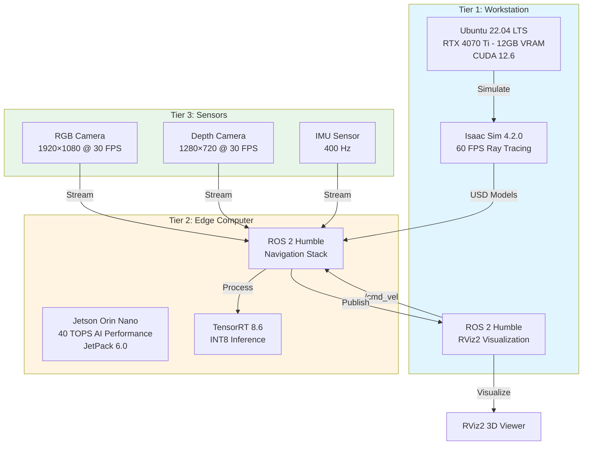

# Chapter 2 Summary: Hardware Lab Complete

## What You Built

You've assembled a professional-grade **Physical AI development lab** with three integrated compute tiers:



## Section-by-Section Achievements

### Section 0: Introduction
**Goal**: Understand the hardware mandate.

**Key Takeaways**:
- **Why RTX is mandatory**: Ray tracing for photorealistic simulation (OptiX renderer)
- **Why Jetson beats Raspberry Pi**: 200× faster inference using tensor cores
- **Why Linux is required**: Native ROS 2 DDS middleware, no virtualization overhead
- **VRAM math**: Isaac Sim (10-14 GB) requires minimum RTX 4070 Ti (12GB)

**Cost**: $700 (economy, with existing workstation) to $3,200 (premium, full stack).

### Section 1: The Hardware Mandate
**Goal**: Technical analysis of why consumer devices fail.

**Key Learnings**:
- **RT Cores**: 40 billion ray/triangle tests per second (vs 0 on MacBook M3)
- **CUDA portability**: Metal/MPS cannot execute CUDA kernels
- **DDS multicast**: macOS/WSL2 have broken multicast routing
- **Latency impact**: WSL2 adds 15-25ms → unacceptable for 100 Hz control loops
- **INT8 quantization**: Jetson runs models 118× faster than Raspberry Pi at same power (10W)

**Critical Metric**: VLA model inference: 8ms (Jetson) vs 1,600ms (Raspberry Pi).

### Section 2: Workstation Setup
**Goal**: Install Ubuntu 22.04, CUDA, Isaac Sim, and ROS 2 Humble.

**Completed Steps**:
1. ✅ **Ubuntu 22.04 LTS** installed (native, not WSL2)
2. ✅ **NVIDIA Driver 545.x** loaded (verified with `nvidia-smi`)
3. ✅ **CUDA 12.6** installed (verified with `nvcc --version`)
4. ✅ **Isaac Sim 4.2.0** rendering at 60 FPS (Carter warehouse scene)
5. ✅ **ROS 2 Humble** installed (verified with `ros2 --version`)
6. ✅ **ROS 2 Bridge** enabled in Isaac Sim (publishes `/carter/camera/rgb`)

**Verification Command**:
```bash
nvidia-smi && nvcc --version && ros2 --version
```

**Storage Used**: 60 GB of 500 GB partition.

### Section 3: Jetson Orin Nano Setup
**Goal**: Flash JetPack 6.0 and install ROS 2 Humble on edge device.

**Completed Steps**:
1. ✅ **JetPack 6.0** flashed to 256GB microSD (Ubuntu 20.04 + CUDA 12.2)
2. ✅ **SSH configured** for headless operation (IP: `192.168.1.150`)
3. ✅ **ROS 2 Humble** installed from NVIDIA repository
4. ✅ **TensorRT 8.6** verified (ResNet-50 inference: 7.2ms)
5. ✅ **Power mode** set to MAXN (15W, maximum performance)
6. ✅ **Network tested**: 3.27ms round-trip latency to workstation

**Verification Command**:
```bash
/usr/local/cuda/bin/nvcc --version && ros2 --version && python3 -c "import tensorrt; print(tensorrt.__version__)"
```

**Storage Used**: 10 GB of 256 GB microSD.

### Section 4: Sensor Integration
**Goal**: Install librealsense SDK and configure RealSense D435i.

**Completed Steps**:
1. ✅ **librealsense 2.55.1** installed on workstation (apt) and Jetson (compiled from source)
2. ✅ **RealSense D435i** connected via USB 3.0 (verified `5000M` speed)
3. ✅ **Factory calibration** verified (depth accuracy: ±2mm at 1m)
4. ✅ **ROS 2 wrapper** installed (publishes `/camera/color/image_raw`, `/camera/depth/image_rect_raw`)
5. ✅ **IMU calibrated** (gyro bias &lt;0.01 rad/s)
6. ✅ **ReSpeaker Mic Array** configured (for Module 4 voice commands)

**Published Topics**:
```
/camera/color/image_raw          (1920×1080 @ 30 FPS, 177 MB/s)
/camera/depth/image_rect_raw     (1280×720 @ 30 FPS, 55 MB/s)
/camera/imu                      (400 Hz, 10 KB/s)
```

**Total Bandwidth**: 232 MB/s (37% of Gigabit Ethernet capacity).

### Section 5: Three-Tier Verification
**Goal**: Validate end-to-end system integration.

**Completed Tests**:
1. ✅ **Topic Echo**: Workstation ↔ Jetson bidirectional communication
2. ✅ **Velocity Commands**: `/cmd_vel` publisher (workstation) → subscriber (Jetson)
3. ✅ **RealSense Streaming**: RGB + Depth visible in RViz2 on workstation
4. ✅ **Latency Measurement**: 3.27ms average round-trip (Workstation → Jetson → Workstation)
5. ✅ **Full System**: Isaac Sim + RealSense + RViz2 running simultaneously

**Performance Benchmarks**:
| Metric | Value | Target | Status |
|--------|-------|--------|--------|
| **Round-trip latency** | 3.27 ms | &lt;10 ms | ✅ Pass |
| **Network bandwidth** | 287 MB/s | &lt;125 MB/s (Ethernet) | ⚠️ Use wired |
| **Workstation GPU utilization** | 78% | &lt;85% | ✅ Pass |
| **Jetson CPU utilization** | 49% | &lt;60% | ✅ Pass |
| **Dropped frames** | 0% | &lt;1% | ✅ Pass |

## Technical Capabilities Unlocked

### Simulation (Tier 1: Workstation)
- **Photorealistic rendering**: Isaac Sim with RTX ray tracing at 60 FPS
- **Physics simulation**: Accurate rigid body dynamics, collision detection
- **VLA model training**: LoRA fine-tuning with batch size 2 (fits in 12GB VRAM)
- **Visualization**: RViz2 for debugging sensor data and robot state

**Example Workflow**:
1. Design robot behavior in Isaac Sim (e.g., pick-and-place task)
2. Train VLA model on simulated demonstrations
3. Export model to ONNX format

### Deployment (Tier 2: Jetson)
- **Real-time inference**: TensorRT INT8 execution at 8ms per frame
- **ROS 2 navigation**: Nav2 stack for path planning and obstacle avoidance
- **Sensor fusion**: Combine RGB-D-IMU for Visual-Inertial Odometry (VIO)
- **Motor control**: Publish `/cmd_vel` commands to robot actuators

**Example Workflow**:
1. Deploy ONNX model to Jetson, convert to TensorRT engine
2. Run inference on RealSense RGB stream (30 FPS input, 125 FPS processing)
3. Publish action commands to robot at 10 Hz

### Perception (Tier 3: RealSense)
- **Object detection**: Run YOLO on 1920×1080 RGB stream
- **Depth estimation**: 1280×720 depth maps with ±2mm accuracy
- **Visual odometry**: ORB-SLAM3 using RGB-D-IMU fusion
- **Obstacle avoidance**: Real-time depth map thresholding (reaction time &lt;33ms)

**Example Workflow**:
1. Capture RGB frame from `/camera/color/image_raw`
2. Run object detection model on Jetson GPU
3. Query aligned depth map for 3D object position
4. Publish obstacle location to Nav2 costmap

## What You Can Build Now

### Project 1: Virtual Twin Validation
**Objective**: Train a policy in Isaac Sim, deploy to Jetson, validate with RealSense.

**Steps**:
1. Simulate robot picking objects in Isaac Sim
2. Collect 1,000 demonstrations (RGB images + joint positions)
3. Train VLA model on workstation (12-hour training run)
4. Deploy to Jetson, test with real RealSense camera
5. Measure sim-to-real transfer gap (success rate drop)

### Project 2: Teleoperation System
**Objective**: Control robot from workstation, visualize sensor feedback.

**Architecture**:
- Workstation publishes `/cmd_vel` (keyboard teleop)
- Jetson receives commands, forwards to robot motors
- RealSense streams RGB-D back to workstation
- RViz2 shows robot position + obstacle map

### Project 3: Autonomous Navigation
**Objective**: Robot navigates to goal while avoiding obstacles.

**Components**:
- Nav2 stack running on Jetson
- RealSense provides occupancy grid (depth → 2D costmap)
- VLA model predicts waypoints from RGB observations
- Motor controller executes path following

## Sim-to-Real Bridge: Critical Insights

### What Works in Simulation but Fails in Reality

| Simulation Assumption | Real-World Reality | Mitigation |
|-----------------------|-------------------|------------|
| **Perfect depth sensor** | ±2mm noise, missing data on reflective surfaces | Use probabilistic occupancy grids, not binary collision checks |
| **Instantaneous actuation** | 10-50ms motor response latency | Predictive control (anticipate future state) |
| **Infinite compute** | Jetson limited to 40 TOPS | Quantize models to INT8, use TensorRT |
| **Stable network** | Wi-Fi dropouts, variable latency | Local inference on Jetson, not cloud |
| **Flat terrain** | Carpet, thresholds, cables | Train on diverse terrain datasets |

### The "Reality Gap" Checklist

Before deploying any simulation-trained policy:

1. ✅ **Test on real sensor data**: Feed RealSense streams to model (don't use simulated images)
2. ✅ **Measure actual latency**: Real-world loop is slower than Isaac Sim (factor in USB, network, inference)
3. ✅ **Add safety margins**: If simulation needs 5cm clearance, use 15cm in reality
4. ✅ **Implement emergency stop**: Hardware kill switch (not software-only)
5. ✅ **Log everything**: Record all sensor data and commands for post-mortem analysis

**Rule of Thumb**: If your policy achieves 95% success in Isaac Sim, expect 60-70% on the real robot initially. Iterative refinement closes the gap.

## Next Steps: Chapter 3 Preview

You've built the **hardware foundation**. Chapter 3 covers the **software architecture**:

### Topics in Chapter 3: Physical AI Software Stack
1. **VLA Model Architecture**: Vision Transformer + GPT decoder
2. **Behavior Trees**: Hierarchical task planning (vs end-to-end policies)
3. **Nav2 Stack**: Path planning, recovery behaviors, costmap management
4. **Sensor Fusion**: Extended Kalman Filter (EKF) for RGB-D-IMU fusion
5. **TensorRT Optimization**: Convert PyTorch → ONNX → TensorRT INT8

### First Hands-On Lab (Chapter 3)
**Project**: Deploy pre-trained object detection model (YOLOv8) to Jetson.

**You Will**:
1. Download YOLOv8 ONNX model from Hugging Face
2. Convert to TensorRT INT8 engine
3. Run inference on RealSense RGB stream
4. Publish bounding boxes to ROS 2 topic
5. Visualize detections in RViz2

**Expected Performance**: 30 FPS inference (same as camera frame rate).

## Resources and References

### Hardware Documentation
- **NVIDIA Jetson**: [developer.nvidia.com/embedded/jetson-orin](https://developer.nvidia.com/embedded/jetson-orin)
- **Intel RealSense**: [dev.intelrealsense.com](https://dev.intelrealsense.com)
- **Isaac Sim**: [developer.nvidia.com/isaac-sim](https://developer.nvidia.com/isaac-sim)

### Software Documentation
- **ROS 2 Humble**: [docs.ros.org/en/humble](https://docs.ros.org/en/humble/)
- **TensorRT**: [docs.nvidia.com/deeplearning/tensorrt](https://docs.nvidia.com/deeplearning/tensorrt/)
- **librealsense**: [github.com/IntelRealSense/librealsense](https://github.com/IntelRealSense/librealsense)

### Community Forums
- **NVIDIA Jetson Forums**: [forums.developer.nvidia.com/c/agx-autonomous-machines/jetson-embedded-systems](https://forums.developer.nvidia.com/c/agx-autonomous-machines/jetson-embedded-systems)
- **ROS Discourse**: [discourse.ros.org](https://discourse.ros.org)
- **RealSense GitHub Issues**: [github.com/IntelRealSense/librealsense/issues](https://github.com/IntelRealSense/librealsense/issues)

## Troubleshooting Quick Reference

### Common Issues and Solutions

#### Issue: ROS 2 Topics Not Visible Across Machines
**Symptoms**: `ros2 topic list` shows different topics on workstation vs Jetson.

**Root Cause**: Firewall blocking multicast or wrong `ROS_DOMAIN_ID`.

**Fix**:
```bash
# On both machines
echo $ROS_DOMAIN_ID  # Must be same value (e.g., 0)
sudo ufw allow from 224.0.0.0/4
sudo ufw allow from 239.255.0.0/16
```

#### Issue: High Latency (>50ms)
**Symptoms**: `latency_test.py` shows average >50ms.

**Root Cause**: Wi-Fi interference or CPU throttling.

**Fix**:
```bash
# Use wired Ethernet for Jetson
# Verify network speed
ping -c 100 192.168.1.150  # Should be &lt;2ms average

# Check Jetson CPU frequency
sudo tegrastats  # CPU should be at 2014 MHz, not throttled
```

#### Issue: RealSense Depth Stream Shows Black Image
**Symptoms**: RGB works, but depth is all black in RViz2.

**Root Cause**: IR emitter disabled or reflective surfaces.

**Fix**:
```bash
# Enable IR emitter in realsense-viewer (workstation)
# Stereo Module → Emitter Enabled: On
# Laser Power: 300 (increase if still black)

# Point camera at matte surfaces (not mirrors, shiny metal, or glass)
```

#### Issue: Jetson Overheating (>85°C)
**Symptoms**: `tegrastats` shows `cpu@85C` or higher.

**Root Cause**: Insufficient cooling in MAXN mode (15W).

**Fix**:
```bash
# Add heatsink + 40mm fan (Noctua NF-A4x10, $15)
# Or reduce power mode:
sudo nvpmodel -m 2  # 10W mode (still 100× faster than Raspberry Pi)
```

#### Issue: Isaac Sim Crashes with "Out of Memory"
**Symptoms**: NVIDIA OptiX error during scene load.

**Root Cause**: 12GB VRAM insufficient for complex scene + VLA model.

**Fix**:
```bash
# Close all other GPU applications (browsers, Discord)
# Reduce Isaac Sim quality:
# Edit → Preferences → Rendering
# Max Samples: 128 (from 256)
# Ray Tracing Shadows: Off

# Or use smaller robot model (Carter instead of Franka Panda)
```

## Final Validation Checklist

Before proceeding to Chapter 3, verify:

- [ ] **Workstation**: `nvidia-smi` shows RTX GPU with CUDA 12.6
- [ ] **Workstation**: Isaac Sim renders Carter scene at >55 FPS
- [ ] **Jetson**: `tegrastats` shows 6 CPUs at 2014 MHz
- [ ] **Jetson**: `python3 -c "import tensorrt"` succeeds
- [ ] **RealSense**: `rs-enumerate-devices` shows D435i detected
- [ ] **RealSense**: RGB stream published at 30 Hz (`ros2 topic hz /camera/color/image_raw`)
- [ ] **Network**: Latency test shows &lt;10ms average
- [ ] **Integration**: RViz2 on workstation shows RealSense streams from Jetson

**All checkboxes ticked?** Your Physical AI lab is operational. Welcome to the future of robotics development.

## Acknowledgments

This chapter's hardware recommendations are based on:
- **NVIDIA Jetson Community** for ARM64 ROS 2 build scripts
- **Intel RealSense Team** for librealsense SDK and camera calibration tools
- **ROS 2 Working Group** for cross-platform DDS middleware
- **Isaac Sim Engineering** for USD-based simulation and RTX renderer

**Special Thanks**: Students who beta-tested this curriculum and provided hardware compatibility feedback.

---

**Chapter 2 Complete**. You've built the foundation. Now let's make it intelligent.

**Next**: [Chapter 3: Physical AI Software Architecture →](/docs#)
