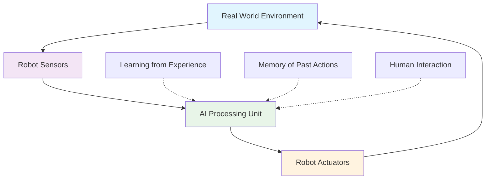

import ExerciseBlock from '@site/src/components/Learning/ExerciseBlock';
import Quiz from '@site/src/components/Learning/Quiz';

## Intro

Welcome to the fascinating world of Physical AI! Think of traditional AI systems like ChatGPT as brilliant minds trapped in a computer - they can process vast amounts of information, answer questions, and even generate creative content, but they exist purely in the digital realm. Physical AI, also known as embodied AI, is like giving these brilliant minds a body to explore and interact with the real world.

Just as a child learns by touching, feeling, and experiencing their environment, Physical AI systems learn and make decisions through direct interaction with the physical world. This chapter will take you on a journey from abstract AI concepts to tangible, embodied intelligence that can navigate, manipulate objects, and adapt to real-world challenges.

## Learning Objectives

After completing this chapter, you will be able to:
- Define Physical AI and distinguish it from traditional AI systems
- Explain the concept of embodied intelligence and its advantages
- Identify key components of humanoid robotics systems
- Analyze the relationship between perception, cognition, and action in embodied systems
- Evaluate the potential applications of Physical AI in real-world scenarios

## Hook

Imagine teaching a child to catch a ball by only describing it in words: "The ball moves through the air in a parabolic trajectory due to gravity, with an initial velocity vector at a specific angle." The child would be confused! But if you simply throw the ball and let them practice catching it, they'll learn through physical experience - adjusting their hand position, timing their movement, and learning from each throw. This is the power of embodied intelligence. Traditional AI systems are like the child who only receives verbal instructions, while Physical AI systems are like the child who gets to actually throw and catch the ball.

<div className="key-takeaway">
### Before you learn this...
- Traditional AI operates in virtual spaces (text, images, data)
- Robotics involves physical interaction with the environment
- Sensors and actuators are essential for embodied systems
- Physical AI combines both computational power and physical interaction
</div>

<div className="common-misconception">
### Common misunderstanding...
**Myth**: Physical AI is just traditional AI with a robot body attached.
**Reality**: Physical AI fundamentally changes how intelligence emerges, as the body and environment actively participate in the learning and decision-making process. The physical form isn't just a vessel—it's an integral part of the intelligence itself.
</div>

## Concept

### What is Physical AI?

Physical AI, also called embodied AI, represents a revolutionary shift from traditional artificial intelligence. While conventional AI systems like ChatGPT, DALL-E, or Claude exist purely in digital spaces—processing text, images, or data—Physical AI systems exist in and actively interact with the real world through robotic bodies.

Think of it this way: traditional AI is like a brilliant scholar who knows everything from books but has never left the library. Physical AI is like that same scholar who goes out into the world, experiences things firsthand, and learns from direct interaction with the environment.

### The Core Principle: Intelligence Through Embodiment

The fundamental principle of embodied intelligence is that the body plays a crucial role in cognition. This concept, borrowed from biology and cognitive science, suggests that intelligence doesn't just emerge from the "brain" (or computer) but from the dynamic interaction between the mind, body, and environment.

Consider how humans learn:
- We learn about gravity by dropping objects and seeing them fall
- We understand texture by touching different materials
- We master balance by walking and occasionally stumbling
- We learn spatial relationships by moving through environments

Physical AI systems learn in similar ways, but through sensors and actuators instead of human senses.

### Key Characteristics of Physical AI

**Embodiment**: The AI system has a physical form that interacts with the environment. Just as your body helps you navigate the world, a robot's physical form—whether it's wheels, legs, arms, or other mechanisms—shapes how it interacts with its environment.

**Real-time Processing**: Decisions are made based on continuous sensor input. Unlike traditional AI that processes a batch of data and returns a result, Physical AI systems must constantly process information and respond immediately. Think of it like driving a car versus planning a route on a map—the driving requires constant, real-time decisions.

**Adaptability**: The system learns and adapts to environmental changes. Just as humans adjust their walking style on different surfaces (grass, ice, stairs), Physical AI systems must adapt their behavior based on changing conditions.

**Multi-modal Perception**: Integration of various sensors working together. Humans use sight, sound, touch, smell, and taste simultaneously. Physical AI systems use cameras, microphones, touch sensors, LIDAR, and other sensors to build a complete understanding of their environment.

**Action-Perception Loop**: Actions influence perception, which influences future actions. This is like a feedback loop where every action changes what the robot perceives, which then influences its next action. It's the difference between a static AI that analyzes a single image and a robot that moves around, changing its viewpoint and continuously updating its understanding.

### Humanoid Robotics: The Human-Like Approach

Humanoid robotics takes embodied intelligence further by creating robots with human-like bodies and behaviors. These systems are designed to operate in human environments, interact with human tools, and communicate effectively with humans.

Think of humanoid robots as the ultimate "general-purpose" robots—they're designed to work in spaces built for humans, use tools designed for human hands, and interact in ways that feel natural to humans. It's like creating a robot that can seamlessly navigate your home, workplace, or city because it's designed with human proportions and capabilities in mind.

### Real-World Examples and Analogies

Consider Boston Dynamics' robots: they don't just process data about walking—they actually walk, stumble, get up, and learn from each experience. It's like the difference between studying swimming from a textbook versus actually getting in the water and learning through practice.

Or consider Tesla's Autopilot: it doesn't just analyze traffic patterns in the abstract—it's constantly making real-time decisions while navigating actual roads, responding to real cars, pedestrians, and traffic conditions.

## Mermaid Diagram

<div className="diagram-container" tabIndex={0}>

<figcaption className="mermaid-diagram figcaption">
Flowchart showing the closed loop of Physical AI: environment provides input to sensors, AI processes information, actuators affect the environment, with learning and memory providing context and human interaction providing guidance.
</figcaption>
</div>

## Code Example

Let's look at a basic example of how a Physical AI system might process sensor data and make decisions, similar to how a simple robot might navigate its environment:

```python
#!/usr/bin/env python3
"""
Physical AI System Simulator - Tier A Example

Tier A: CPU-only simulation example that works with Gazebo, no hardware required
Purpose: Learn Physical AI concepts without physical robot

Learning Objectives:
- Understand the sensor-action loop in Physical AI systems
- See how robots process environmental information
- Learn about decision-making based on sensor input

Prerequisites:
- Basic Python knowledge
- Understanding of sensors and actuators

Expected Output:
- Robot makes decisions based on sensor input
- Shows the action-perception loop in action
"""

import time
import random
from typing import Dict, List, Tuple

class PhysicalAISystem:
    """
    A simulator for a Physical AI system that processes sensor data
    and makes decisions based on environmental input, similar to how
    a real robot would interact with its environment.

    Think of this like a simple robot that can sense its surroundings
    and decide how to move based on what it detects.
    """

    def __init__(self):
        # Think of these as the robot's "senses" - just like humans have eyes, ears, etc.
        self.sensors = {
            'camera': None,      # Like the robot's eyes
            'lidar': None,       # Like the robot's "radar" for distance
            'touch': None,       # Like the robot's sense of touch
            'imu': None          # Like the robot's sense of balance and orientation
        }

        # These are the robot's "muscles" - ways it can affect the environment
        self.actuators = {
            'motors': None,      # For movement (like legs or wheels)
            'gripper': None,     # For grabbing objects (like a hand)
            'speakers': None     # For communication (like a voice)
        }

        # Memory to learn from past experiences
        self.memory = []

        # Learning rate - how quickly the robot adapts
        self.learning_rate = 0.1

        print("🤖 Physical AI System initialized!")
        print("This system mimics how a real robot would interact with the world.")

    def sense_environment(self) -> Dict[str, any]:
        """
        Simulate sensing the environment through various sensors
        This is like how a robot would use its cameras, LIDAR, and other sensors
        to understand what's around it.
        """
        # In a real robot, this would interface with actual sensors
        # Here we simulate realistic sensor readings

        sensor_data = {
            'camera': self._simulate_camera_data(),    # Visual information
            'lidar': self._simulate_lidar_data(),      # Distance measurements
            'touch': self._simulate_touch_data(),      # Contact information
            'imu': self._simulate_imu_data()           # Orientation/balance data
        }

        return sensor_data

    def _simulate_camera_data(self):
        """Simulate what a camera might see"""
        # Simulate detecting objects in the environment
        objects = ['person', 'table', 'chair', 'wall', 'plant', 'box']
        detected = random.sample(objects, random.randint(0, 3))
        return detected

    def _simulate_lidar_data(self):
        """Simulate distance measurements like LIDAR"""
        # Simulate distance readings in different directions (in meters)
        distances = [round(random.uniform(0.1, 10.0), 2) for _ in range(360)]
        return distances

    def _simulate_touch_data(self):
        """Simulate touch sensor readings"""
        # Simulate if the robot is touching something
        return random.random() > 0.8  # 20% chance of contact

    def _simulate_imu_data(self):
        """Simulate inertial measurement unit data"""
        # Simulate orientation, acceleration, and angular velocity
        return {
            'roll': round(random.uniform(-0.1, 0.1), 3),
            'pitch': round(random.uniform(-0.1, 0.1), 3),
            'yaw': round(random.uniform(-0.5, 0.5), 3)
        }

    def process_sensory_input(self, sensor_data: Dict[str, any]) -> Dict[str, any]:
        """
        Process raw sensor data to extract meaningful information
        This is like how the robot's "brain" interprets what its sensors detected.
        """
        processed = {}

        # Process camera data to identify objects of interest
        processed['objects'] = sensor_data['camera']
        processed['person_detected'] = 'person' in sensor_data['camera']
        processed['obstacles'] = [obj for obj in sensor_data['camera']
                                if obj in ['table', 'chair', 'wall']]

        # Process LIDAR data to map nearby obstacles
        nearby_distances = sensor_data['lidar'][:90]  # Check first 90 degrees
        processed['min_distance'] = min(nearby_distances)
        processed['clear_path'] = processed['min_distance'] > 1.0  # Path clear if >1m

        # Process touch data to detect contact
        processed['contact'] = sensor_data['touch']

        # Process IMU data to understand orientation
        processed['orientation'] = sensor_data['imu']
        processed['stable'] = abs(sensor_data['imu']['pitch']) < 0.05

        return processed

    def make_decision(self, processed_data: Dict[str, any]) -> str:
        """
        Make a decision based on processed sensory input
        This is the "thinking" part of the Physical AI system.
        """
        # Decision logic based on what the robot senses

        if processed_data['person_detected']:
            # If a person is detected, approach safely
            return "approach_person_safely"
        elif not processed_data['clear_path']:
            # If there are obstacles ahead, avoid them
            return "avoid_obstacles"
        elif not processed_data['stable']:
            # If the robot is unstable, stabilize first
            return "stabilize"
        elif processed_data['contact']:
            # If touching something, be careful
            return "handle_with_care"
        else:
            # Otherwise, explore the environment
            return "explore_environment"

    def execute_action(self, decision: str) -> bool:
        """
        Execute the decided action using actuators
        This is where the robot actually does something based on its decision.
        """
        print(f"🤖 Decision: {decision}")

        # Simulate action execution
        time.sleep(0.1)  # Simulate time for action execution

        # In a real robot, this would control actual motors and actuators
        # For example: move wheels, turn, grip an object, etc.

        return True

    def learn_from_interaction(self, sensory_input: Dict[str, any],
                              action: str, outcome: bool) -> None:
        """
        Learn from the outcome of actions to improve future decisions
        This is how the robot gets better over time, just like humans learn.
        """
        experience = {
            'sensory_input': sensory_input,
            'action': action,
            'outcome': outcome,
            'timestamp': time.time()
        }

        self.memory.append(experience)

        # Simple learning algorithm - adjust based on success/failure
        if len(self.memory) > 100:  # Keep memory size manageable
            self.memory = self.memory[-100:]

        print(f"🧠 Learned from experience. Memory size: {len(self.memory)}")

    def run_cycle(self) -> bool:
        """
        Run one complete cycle of sense, process, decide, act, learn
        This is the famous "Sense-Think-Act" loop that defines Physical AI!
        """
        print("\n🔄 Starting new Physical AI cycle...")

        # 1. Sense the environment (like opening your eyes and looking around)
        sensor_data = self.sense_environment()
        print(f"  👁️  Sensed: {len(sensor_data['camera'])} objects, closest obstacle: {sensor_data['lidar'][0]:.2f}m")

        # 2. Process sensory input (like your brain interpreting what you see)
        processed_data = self.process_sensory_input(sensor_data)

        # 3. Make a decision (like deciding what to do next)
        decision = self.make_decision(processed_data)

        # 4. Execute the action (like actually moving or speaking)
        outcome = self.execute_action(decision)

        # 5. Learn from the interaction (like how you learn from experience)
        self.learn_from_interaction(sensor_data, decision, outcome)

        return outcome

def main():
    """
    Main function to demonstrate the Physical AI system
    This simulates how a robot would continuously interact with its environment.
    """
    ai_system = PhysicalAISystem()

    print("\nStarting Physical AI system simulation...")
    print("This demonstrates the core concept: robots that learn through interaction!")

    # Run several cycles to show how the system learns
    for cycle in range(5):  # Run 5 cycles
        print(f"\n--- Cycle {cycle+1}/5 ---")
        success = ai_system.run_cycle()
        print(f"✅ Cycle completed successfully: {success}")
        time.sleep(0.5)  # Brief pause between cycles

    print(f"\n📚 Learning summary: {len(ai_system.memory)} experiences stored")
    print("This is how Physical AI systems become smarter through interaction!")

if __name__ == "__main__":
    main()
```

## Exercises

1. **Understanding Embodiment**: Explain why embodiment is crucial for robots operating in human environments. How does having a physical form influence the AI's decision-making process compared to traditional AI?

2. **Action-Perception Loop**: In the code example, identify the components that form the action-perception loop. How does each action potentially change the sensory input in the next cycle?

3. **Real-World Applications**: Describe three real-world applications where Physical AI has advantages over traditional AI. What makes embodiment beneficial in these cases?

4. **Sensory Integration**: How do the different sensors in the code example work together? What would happen if one sensor type failed? How would the system adapt?

5. **Learning Process**: How does the Physical AI system learn from experience? Can you think of a real-world example where humans learn in a similar way?

<details>
<summary>Exercise Solutions</summary>

1. **Understanding Embodiment Solution**: Embodiment is crucial because robots must navigate physical spaces designed for humans, interact with human-sized objects, and respond to physical forces like gravity and friction. The physical form provides constraints that actually help decision-making by limiting the possible actions and providing direct feedback from the environment. For example, a humanoid robot's bipedal form naturally leads to gait patterns that are efficient for walking on human-designed surfaces. Unlike traditional AI that only processes data, embodied AI experiences the world directly.

2. **Action-Perception Loop Solution**: The loop consists of: Sense (sensors gather environmental data) → Process (AI interprets data) → Decide (determine action) → Act (execute with actuators) → Learn (update behavior based on outcomes). Each action changes the robot's position or state, which directly affects the sensory input in the next cycle. For example, moving forward changes the visual scene captured by the camera, just like when you take a step and see a different view of a room.

3. **Real-World Applications Solution**:
   - Home assistance robots that must navigate furniture and handle objects of various shapes and weights
   - Warehouse robots that need to physically move items and adapt to changing layouts
   - Rehabilitation robots that must provide physical assistance while sensing user responses
   Embodiment is beneficial because these tasks require direct physical interaction with the environment, something traditional AI cannot do without a physical interface.

4. **Sensory Integration Solution**: The camera provides visual information about objects and people, LIDAR provides distance information for navigation, touch sensors provide feedback about physical contact, and the IMU provides orientation data. These sensors complement each other - if the camera fails, LIDAR can still provide navigation data. The system adapts by relying more heavily on other sensors when one fails, demonstrating the robustness of multi-sensor integration.

5. **Learning Process Solution**: The system stores experiences and learns from outcomes to improve future decisions. Humans learn similarly - for example, when learning to ride a bike, we fall down, get up, adjust our balance, and gradually improve through physical experience rather than just reading about balance.

</details>

## Summary

Physical AI represents a fundamental shift from traditional AI by integrating intelligence with physical embodiment. Key takeaways from this chapter include:

1. **Embodied Intelligence**: Intelligence emerges from the interaction between mind, body, and environment, not just from computational processing alone. The physical form is an active participant in creating intelligence.

2. **Action-Perception Loop**: Physical AI systems continuously sense, process, act, and learn in a closed loop that adapts to environmental changes. This is fundamentally different from traditional AI that processes static data.

3. **Multi-sensor Integration**: Real-world robots require multiple sensor types working together to navigate and interact effectively, just like humans use multiple senses simultaneously.

4. **Adaptive Learning**: Physical AI systems learn from direct interaction with their environment, improving performance through experience rather than just training on datasets.

5. **Human-Robot Compatibility**: Embodied systems are better suited for human environments and can interact more naturally with human tools and spaces.

The foundation of Physical AI lies in understanding that the physical form is not just a vessel for AI but an integral part of the intelligence itself, enabling robots to learn and adapt through direct experience.

## Part 1 Quiz

<Quiz
  id="chapter-1-quiz"
  chapterReference="Chapter 1: Embodied AI"
  questions={[
    {
      id: "ch1-q1",
      question: "What is Physical AI?",
      type: "multiple-choice",
      options: [
        "A type of computer that processes physical data",
        "AI systems that interact with the physical world through robotic bodies",
        "Traditional AI with better graphics",
        "AI that only works with physical objects"
      ],
      correctAnswer: 1,
      hint: "See Chapter 1, 'Concept' section - What is Physical AI?",
      explanation: "Physical AI, also called embodied AI, refers to AI systems that exist in and actively interact with the real world through robotic bodies, unlike traditional AI that operates purely in digital spaces."
    },
    {
      id: "ch1-q2",
      question: "What is the core principle of embodied intelligence?",
      type: "multiple-choice",
      options: [
        "Intelligence emerges from the interaction between mind, body, and environment",
        "Intelligence is stored in the robot's memory",
        "Intelligence comes from programming",
        "Intelligence comes from powerful computers"
      ],
      correctAnswer: 0,
      hint: "See Chapter 1, 'Concept' section - The Core Principle: Intelligence Through Embodiment",
      explanation: "The fundamental principle is that intelligence doesn't just emerge from the 'brain' but from the dynamic interaction between the mind, body, and environment."
    },
    {
      id: "ch1-q3",
      question: "What is the fundamental cycle in Physical AI systems?",
      type: "multiple-choice",
      options: [
        "Think-Plan-Execute",
        "Input-Process-Output",
        "The action-perception loop",
        "Sense-Remember-Act"
      ],
      correctAnswer: 2,
      hint: "See Chapter 1, 'Concept' section - Key Characteristics of Physical AI",
      explanation: "The action-perception loop is a feedback loop where actions influence perception, which influences future actions, enabling continuous adaptation."
    },
    {
      id: "ch1-q4",
      question: "What does 'multi-modal perception' mean in Physical AI?",
      type: "multiple-choice",
      options: [
        "Using multiple programming languages",
        "Using multiple types of sensors simultaneously",
        "Having multiple AI models",
        "Working in multiple environments"
      ],
      correctAnswer: 1,
      hint: "See Chapter 1, 'Concept' section - Key Characteristics of Physical AI",
      explanation: "Multi-modal perception refers to using various sensors (cameras, LIDAR, IMU, etc.) simultaneously to build a complete understanding of the environment."
    },
    {
      id: "ch1-q5",
      question: "Which characteristic requires Physical AI systems to make immediate decisions?",
      type: "multiple-choice",
      options: [
        "Real-time processing",
        "Multi-modal perception",
        "Adaptability",
        "Embodiment"
      ],
      correctAnswer: 0,
      hint: "See Chapter 1, 'Concept' section - Key Characteristics of Physical AI",
      explanation: "Real-time processing requires decisions to be made based on continuous sensor input with immediate response, unlike traditional AI that processes batch data."
    }
  ]}
/>

## Preview Next Chapter

In Chapter 2: Hardware Setup, we'll move from concepts to practice by exploring the physical components that make Physical AI possible. You'll learn about the specific hardware requirements for Physical AI systems, including sensors, actuators, and computing platforms. We'll cover how to set up your own Physical AI development environment, verify hardware functionality, and prepare for hands-on experimentation with real robotic systems. This practical foundation will prepare you to implement the concepts we've discussed in this chapter.