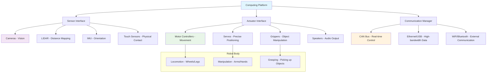

import ExerciseBlock from '@site/src/components/Learning/ExerciseBlock';
import Quiz from '@site/src/components/Learning/Quiz';


## Intro

In the previous chapter, we explored the fascinating world of Physical AI and how robots learn through interaction with their environment. Now, it's time to move from concepts to reality by setting up the physical hardware that brings these ideas to life. Think of this chapter as building your own "robotic body" - just as humans have eyes, ears, muscles, and a brain to interact with the world, robots need sensors, actuators, computing platforms, and communication systems to become truly embodied.

This chapter will guide you through the essential hardware components needed for Physical AI systems, from sensors and actuators to computing platforms. Whether you're working with a physical robot, a simulation environment, or a hybrid setup, proper hardware configuration is crucial for successful Physical AI implementation. We'll explore each component with real-world analogies and examples to make the concepts clear and understandable.

## Learning Objectives

After completing this chapter, you will be able to:
- Identify essential hardware components for Physical AI systems
- Explain the configuration process for robotic hardware components
- Configure and verify basic robotic hardware components
- Analyze the integration of sensors for multi-modal perception
- Validate hardware functionality through comprehensive tests

## Hook

Consider this: a sophisticated AI algorithm is useless if it can't perceive its environment or act upon it. Just as a brilliant mind needs senses and limbs to interact with the world, an AI system needs hardware to become truly embodied. Think of it like having the world's most advanced GPS navigation system but no car to drive - the intelligence is there, but without the physical means to act on it, it's ineffective. In 2023, researchers at MIT demonstrated this principle when their robot learned to open novel containers by physically interacting with them—something no amount of digital training could have achieved. The hardware setup you'll learn about in this chapter is the foundation that enables such remarkable achievements.

<div className="key-takeaway">
### Before you learn this...
- Physical AI systems require multiple hardware components working together
- Different computing platforms serve different roles in the system
- Sensor fusion is critical for effective perception
- Safety considerations must be built into the hardware design
- Hardware selection depends on your specific application and budget
</div>

<div className="common-misconception">
### Common misunderstanding...
**Myth**: More expensive hardware always leads to better robot performance.
**Reality**: The right combination of affordable, well-integrated components often outperforms expensive standalone components that don't work well together. It's not about having the most expensive parts, but about having parts that work harmoniously as a system.
</div>

## Concept

Physical AI systems require several key hardware components that work together to create the perception-action loop essential for embodied intelligence. Think of building a robot like building a human body - each component has a specific function, but they all need to work together seamlessly.

### Computing Platform: The Robot's Brain

The computing platform serves as the "brain" of the robot, typically ranging from embedded systems (like NVIDIA Jetson) for edge computing to more powerful workstations for complex processing. Just as humans have different levels of processing - reflexive responses handled by the spinal cord, quick decisions by the brainstem, and complex reasoning by the cortex - robots use different computing platforms for different tasks.

**NVIDIA Jetson Series**: These are like the "cortex" of the robot - powerful enough for complex AI tasks like computer vision and decision making, but compact enough to fit on the robot itself. The Jetson Nano is like a student's brain - capable and efficient for learning tasks, while the Jetson Orin is like a professor's brain - more powerful for complex research.

**Raspberry Pi**: Think of this as the robot's "reflex system" - simple, efficient, and perfect for basic control tasks and sensor reading. It's like having a dedicated system for simple, repetitive tasks.

**Desktop Workstations**: These serve as the "supercomputer" for complex tasks that don't need to be done in real-time, like training AI models or processing large datasets.

### Sensors: The Robot's Senses

Just as humans have five senses, robots need multiple sensors to perceive their environment. Each sensor provides different information, and together they create a complete picture.

**Cameras**: The robot's "eyes" for visual perception. Like human eyes, they can detect objects, colors, movement, and more. Modern robots often use multiple cameras for depth perception, just as humans use two eyes to see in 3D.

**LIDAR (Light Detection and Ranging)**: Like a bat's echolocation or a dolphin's sonar, LIDAR measures distances by timing how long laser light takes to return. It's excellent for creating accurate maps and detecting obstacles, even in darkness.

**IMU (Inertial Measurement Unit)**: This is like the robot's inner ear - it senses orientation, acceleration, and angular velocity. It helps the robot know which way is up and how it's moving in space.

**Touch/Force Sensors**: Like human skin and muscles that sense pressure and force, these help robots interact safely with objects and understand when they're touching something.

**Microphones**: The robot's "ears" for audio input, allowing it to respond to voice commands or detect sounds in the environment.

### Actuators: The Robot's Muscles

Actuators are the components that allow the robot to act upon its environment - they're the robot's "muscles."

**Motors**: For locomotion (wheels, legs) and manipulation (arm movement). Like human muscles, they can be powerful for heavy tasks or precise for delicate operations.

**Servos**: These are like precise muscle movements - they can move to exact positions, making them perfect for robotic arms or precise control systems.

**Grippers**: Specialized "hands" for grasping objects, ranging from simple pincers to complex multi-fingered hands.

**Speakers**: For audio output, allowing the robot to communicate with humans or other robots.

### Communication Systems: The Robot's Nervous System

Just as the human nervous system connects the brain to the body, communication systems connect all robot components. Different systems serve different purposes:

**CAN Bus**: Like the spinal cord for critical, real-time signals - fast and reliable for motor control and safety-critical systems.

**Ethernet/USB**: Like major nerves for high-bandwidth data - perfect for sensor data that needs to move quickly between components.

**WiFi/Bluetooth**: Like wireless communication - great for external communication and updates, though not as reliable for safety-critical functions.

### Power Systems: The Robot's Energy Source

Robots need power to function, just as humans need food for energy. Battery management and distribution ensure all components receive the power they need while maintaining safe operation.

### Real-World Examples and Analogies

Think of Tesla's Autopilot system: it uses multiple cameras (like human eyes), ultrasonic sensors (like proximity sensing), and radar (like long-range detection) to create a complete picture of the road. The onboard computer (like the brain) processes all this information in real-time to make driving decisions.

Or consider Boston Dynamics' robots: they integrate IMUs for balance, cameras for navigation, LIDAR for obstacle detection, and powerful motors for movement - all coordinated by sophisticated computing platforms to achieve remarkable mobility.

## Mermaid Diagram

<div className="diagram-container" tabIndex={0}>

<figcaption className="mermaid-diagram figcaption">
Flowchart showing the hardware architecture of a Physical AI system: computing platform interfaces with sensors, actuators, and communication systems, which connect to various specialized hardware components that enable the robot to perceive and interact with its environment.
</figcaption>
</div>

## Code Example

Let's look at how to set up and verify basic hardware components using Python and ROS 2, similar to how you might test the sensors and actuators on a real robot:

```python
#!/usr/bin/env python3
"""
Hardware Setup and Verification Node - Tier A Example

Tier A: CPU-only simulation example that works with Gazebo, no hardware required
Purpose: Learn hardware setup concepts without physical robot

Learning Objectives:
- Understand how to interface with robot sensors and actuators
- Learn about hardware status monitoring and verification
- See how different hardware components communicate
- Practice safe robot operation principles

Prerequisites:
- Chapter 1 concepts (sensors, actuators, computing platform)
- Basic Python and ROS 2 knowledge

Expected Output:
- Hardware status reports showing which components are operational
- Safe motor commands with velocity limits
- Real-time monitoring of hardware status
"""

import rclpy
from rclpy.node import Node
from sensor_msgs.msg import Image, LaserScan, Imu, JointState
from geometry_msgs.msg import Twist
from std_msgs.msg import String, Bool
import cv2
import numpy as np
from typing import Dict, List, Optional
import time

class HardwareSetupNode(Node):
    """
    A ROS 2 node that demonstrates hardware setup and verification.
    This simulates how you would interface with real robot hardware,
    checking status and ensuring all components are working properly.

    Think of this like a robot's "health checkup" - we're making sure
    all the "organs" (sensors, actuators) are functioning before we
    let the robot start operating.
    """

    def __init__(self):
        super().__init__('hardware_setup_node')

        # Initialize hardware status tracking - like a doctor checking vital signs
        self.hardware_status = {
            'camera': False,
            'lidar': False,
            'imu': False,
            'motors': False,
            'communication': True  # Assuming communication is working if we're running
        }

        # Create subscribers for sensor data - like the robot's "nervous system"
        self.camera_subscription = self.create_subscription(
            Image,
            'camera/image_raw',
            self.camera_callback,
            10
        )

        self.lidar_subscription = self.create_subscription(
            LaserScan,
            'scan',
            self.lidar_callback,
            10
        )

        self.imu_subscription = self.create_subscription(
            Imu,
            'imu/data',
            self.imu_callback,
            10
        )

        self.joint_subscription = self.create_subscription(
            JointState,
            'joint_states',
            self.joint_callback,
            10
        )

        # Create publisher for motor commands - like the robot's "muscles"
        self.cmd_vel_publisher = self.create_publisher(Twist, 'cmd_vel', 10)

        # Timer for periodic hardware checks - like regular health monitoring
        self.status_timer = self.create_timer(1.0, self.check_hardware_status)

        # Safety timer for emergency monitoring
        self.safety_timer = self.create_timer(0.1, self.safety_check)  # 10Hz for safety

        self.get_logger().info('Hardware Setup Node initialized')
        self.get_logger().info('Starting hardware verification process...')

    def camera_callback(self, msg):
        """Process camera data and verify camera functionality"""
        try:
            # In a real robot, you'd convert ROS Image to OpenCV format using cv_bridge
            # Here we just check if we're receiving data
            if msg.height > 0 and msg.width > 0:
                self.hardware_status['camera'] = True
                self.get_logger().info('✅ Camera data received - Camera OK')
            else:
                self.hardware_status['camera'] = False
        except Exception as e:
            self.get_logger().error(f'❌ Camera error: {e}')
            self.hardware_status['camera'] = False

    def lidar_callback(self, msg):
        """Process LIDAR data and verify LIDAR functionality"""
        try:
            # Check if we're receiving valid distance data
            if len(msg.ranges) > 0 and min(msg.ranges) > 0 and max(msg.ranges) > 0:
                self.hardware_status['lidar'] = True
                self.get_logger().info('✅ LIDAR data received - LIDAR OK')
            else:
                self.hardware_status['lidar'] = False
        except Exception as e:
            self.get_logger().error(f'❌ LIDAR error: {e}')
            self.hardware_status['lidar'] = False

    def imu_callback(self, msg):
        """Process IMU data and verify IMU functionality"""
        try:
            # Check if IMU data is reasonable (not all zeros)
            # IMU measures orientation, acceleration, and angular velocity
            linear_accel = abs(msg.linear_acceleration.x) + abs(msg.linear_acceleration.y) + abs(msg.linear_acceleration.z)
            angular_vel = abs(msg.angular_velocity.x) + abs(msg.angular_velocity.y) + abs(msg.angular_velocity.z)

            if linear_accel > 0.1 or angular_vel > 0.1:  # Some movement detected
                self.hardware_status['imu'] = True
                self.get_logger().info('✅ IMU data received - IMU OK')
            else:
                self.hardware_status['imu'] = False
        except Exception as e:
            self.get_logger().error(f'❌ IMU error: {e}')
            self.hardware_status['imu'] = False

    def joint_callback(self, msg):
        """Process joint state data and verify motor functionality"""
        try:
            if len(msg.position) > 0 and len(msg.velocity) > 0:
                self.hardware_status['motors'] = True
                self.get_logger().info('✅ Joint data received - Motors OK')
            else:
                self.hardware_status['motors'] = False
        except Exception as e:
            self.get_logger().error(f'❌ Motor error: {e}')
            self.hardware_status['motors'] = False

    def check_hardware_status(self):
        """Periodically check and report hardware status"""
        all_working = all(self.hardware_status.values())

        self.get_logger().info(f"\n🔍 Hardware Status Check:")
        for component, status in self.hardware_status.items():
            status_str = '✅ OK' if status else '❌ NOT READY'
            self.get_logger().info(f'  {component.upper()}: {status_str}')

        if all_working:
            self.get_logger().info('🎉 ALL HARDWARE COMPONENTS OPERATIONAL')
        else:
            self.get_logger().info('⚠️  Some hardware components need attention')

    def safety_check(self):
        """Real-time safety monitoring - like a safety reflex"""
        # This runs at 10Hz to continuously monitor for safety issues
        # In a real robot, this would check for emergency stops, collisions, etc.

        # Example: Check if we're getting too close to obstacles
        if self.hardware_status['lidar']:
            # This would check LIDAR data for close obstacles
            # For now, just a placeholder for safety logic
            pass

    def send_motor_command(self, linear_x: float = 0.0, angular_z: float = 0.0):
        """
        Send velocity command to robot motors with safety limits
        This is like telling the robot's legs or wheels how fast to move
        """
        # Apply safety limits - like having a speed limit for safety
        max_linear = 0.5  # m/s - safe speed limit
        max_angular = 1.0  # rad/s - safe turning limit

        # Clamp the values to safe limits
        safe_linear = max(min(linear_x, max_linear), -max_linear)
        safe_angular = max(min(angular_z, max_angular), -max_angular)

        cmd = Twist()
        cmd.linear.x = safe_linear
        cmd.angular.z = safe_angular

        self.cmd_vel_publisher.publish(cmd)
        self.get_logger().info(f'🚀 Sent motor command: linear={safe_linear:.2f}, angular={safe_angular:.2f}')

    def run_hardware_verification(self):
        """Run comprehensive hardware verification tests"""
        self.get_logger().info('🧪 Starting comprehensive hardware verification...')

        # Test motors briefly - like testing if the robot's "legs" work
        self.get_logger().info('Testing motor functionality...')
        self.send_motor_command(linear_x=0.1)  # Move forward slowly
        time.sleep(2)
        self.send_motor_command()  # Stop
        time.sleep(1)

        # Test rotation - like testing if the robot can turn
        self.get_logger().info('Testing rotation functionality...')
        self.send_motor_command(angular_z=0.2)  # Rotate slowly
        time.sleep(2)
        self.send_motor_command()  # Stop
        time.sleep(1)

        self.get_logger().info('✅ Hardware verification complete')

def main(args=None):
    """
    Main function to demonstrate hardware setup and verification
    This simulates the process of checking all robot hardware components
    """
    rclpy.init(args=args)

    hardware_node = HardwareSetupNode()

    # Run initial hardware verification
    hardware_node.run_hardware_verification()

    # Start the ROS 2 spinning to keep processing callbacks
    # This keeps the robot "awake" and monitoring its sensors
    try:
        rclpy.spin(hardware_node)
    except KeyboardInterrupt:
        hardware_node.get_logger().info('🛑 Shutting down hardware setup node')
    finally:
        hardware_node.destroy_node()
        rclpy.shutdown()

if __name__ == '__main__':
    main()
```

## Exercises

1. **Hardware Identification**: List at least 5 different types of sensors that could be used in a Physical AI system and explain what each one measures. Why is multi-sensor integration important compared to using just one sensor type?

2. **Computing Platform Selection**: Research and compare three different computing platforms suitable for Physical AI (e.g., NVIDIA Jetson, Raspberry Pi, Intel NUC). What are the trade-offs for each in terms of processing power, power consumption, and cost? When would you choose each one?

3. **Communication Protocols**: Explain the differences between CAN bus, Ethernet, and WiFi communication in robotic systems. When would you use each protocol, and what are the advantages and disadvantages of each?

4. **Hardware Troubleshooting**: If your camera is not publishing data, list 5 potential causes and how you would diagnose each one. What systematic approach would you use to troubleshoot the issue?

5. **Safety Considerations**: What safety measures should be implemented when testing motor commands on a physical robot? How would you implement software safety limits, and why are they important?

<details>
<summary>Exercise Solutions</summary>

1. **Hardware Identification Solution**:
   - Cameras: Visual information, object recognition, color detection
   - LIDAR: Distance measurement, 3D mapping, obstacle detection
   - IMU: Orientation, acceleration, angular velocity, balance
   - Force/Torque sensors: Physical interaction forces, grip strength
   - Microphones: Audio input, sound localization, voice commands
   Multi-sensor integration is important because it provides redundancy (if one sensor fails, others can still function), complementary information (different sensors see different aspects of the environment), and robustness to sensor failures. It's like humans using multiple senses simultaneously - we see, hear, and feel to understand our environment better than with just one sense.

2. **Computing Platform Selection Solution**:
   - NVIDIA Jetson: High GPU performance for AI and computer vision, moderate power consumption, higher cost - good for complex vision/AI tasks that need to run on the robot itself
   - Raspberry Pi: Low cost, very low power, limited performance - good for simple control tasks, sensor reading, and basic communication
   - Intel NUC: High performance, higher power consumption, higher cost - good for complex processing that doesn't need to be on the robot itself
   Trade-offs involve balancing performance needs with power constraints, heat management, and budget. The choice depends on whether you need real-time processing on the robot or can offload to external computers.

3. **Communication Protocols Solution**:
   - CAN bus: Real-time, very robust, designed for critical systems, low bandwidth - used for motor control and safety-critical systems where reliability is paramount
   - Ethernet: High bandwidth, deterministic timing, good for sensor data - used for high-data-rate sensors like cameras and LIDAR
   - WiFi: Wireless, flexible, variable reliability - used for external communication, updates, and non-critical data
   Use CAN for real-time control where timing is critical, Ethernet for high-bandwidth sensor data, and WiFi for non-critical communication and updates.

4. **Hardware Troubleshooting Solution**:
   - Check physical connections: Verify cables are secure and not damaged
   - Check power supply: Ensure camera is receiving proper voltage and current
   - Check drivers: Verify proper drivers are installed and loaded
   - Check permissions: Ensure software has access to camera device
   - Check ROS configuration: Verify correct topic names, permissions, and node connections
   Systematic approach: Start with physical inspection, then software configuration, then ROS setup. Check the simplest things first (power, connections) before moving to complex software issues.

5. **Safety Considerations Solution**:
   - Implement velocity/position limits in software to prevent dangerous movements
   - Use safety stop mechanisms that can immediately halt all motion
   - Add collision detection to prevent the robot from hitting objects or people
   - Include emergency stop functionality that overrides all other commands
   - Test in controlled environment first before allowing full operation
   Software safety limits can be implemented by capping command values and monitoring for dangerous states. These are crucial because robots can cause damage or injury if they move too fast, too far, or in unexpected ways.

</details>

## Summary

This chapter covered the essential hardware components needed for Physical AI systems:

1. **Computing Platform**: The central processing unit that runs AI algorithms and coordinates components. Different platforms serve different roles - from embedded systems for real-time control to powerful workstations for complex processing.

2. **Sensors**: Multiple sensor types provide the perception capabilities needed for embodied intelligence. Each sensor provides different information, and together they create a complete picture of the environment.

3. **Actuators**: Motors, servos, and other devices enable the robot to interact with its environment. These are the robot's "muscles" that allow it to act upon its perceptions.

4. **Communication Systems**: Protocols that allow seamless coordination between all components. Different protocols serve different purposes based on bandwidth, reliability, and timing requirements.

5. **Power Systems**: Reliable power distribution to maintain operation. Proper power management is essential for all components to function correctly.

6. **Integration**: The hardware architecture must support the action-perception loop fundamental to Physical AI. All components must work together harmoniously.

Proper hardware setup is crucial for Physical AI systems, as even the most sophisticated AI algorithms are useless without the proper physical interface to the world. The key is not just having components, but having them work together as an integrated system.

## Part 1 Quiz

<Quiz
  id="chapter-2-quiz"
  chapterReference="Chapter 2: Hardware Setup"
  questions={[
    {
      id: "ch2-q1",
      question: "What are the essential hardware components for a Physical AI system?",
      type: "multiple-choice",
      options: [
        "Just a computer and some sensors",
        "Motors and wheels only",
        "Camera and microphones",
        "Computing platform, sensors, actuators, communication systems"
      ],
      correctAnswer: 3,
      hint: "See Chapter 2, 'Concept' section - The Robot's Brain, Senses, and Muscles",
      explanation: "Physical AI systems require multiple components working together: computing platform for processing, sensors for perception, actuators for action, and communication systems for coordination."
    },
    {
      id: "ch2-q2",
      question: "Why is multi-sensor integration important?",
      type: "multiple-choice",
      options: [
        "It's cheaper than single sensors",
        "It provides multiple types of information for a complete picture",
        "It uses less power",
        "It's easier to program"
      ],
      correctAnswer: 1,
      hint: "See Chapter 2, 'Concept' section - Sensors: The Robot's Senses",
      explanation: "Multi-sensor integration provides redundancy, complementary information, and robustness by combining different sensor types to build a complete understanding of the environment."
    },
    {
      id: "ch2-q3",
      question: "Which computing platform is best for on-robot AI processing?",
      type: "multiple-choice",
      options: [
        "Raspberry Pi for all tasks",
        "Desktop computer only",
        "NVIDIA Jetson for AI processing",
        "Any computer works the same"
      ],
      correctAnswer: 2,
      hint: "See Chapter 2, 'Concept' section - Computing Platform: The Robot's Brain",
      explanation: "NVIDIA Jetson platforms provide the right balance of AI processing power and compact form factor needed for on-robot processing of complex AI tasks."
    },
    {
      id: "ch2-q4",
      question: "Which communication protocol is best for safety-critical motor control?",
      type: "multiple-choice",
      options: [
        "WiFi for convenience",
        "Ethernet for speed",
        "Bluetooth for wireless",
        "CAN bus"
      ],
      correctAnswer: 3,
      hint: "See Chapter 2, 'Concept' section - Communication Systems: The Robot's Nervous System",
      explanation: "CAN bus is designed for real-time, safety-critical systems with guaranteed delivery and high reliability, making it ideal for motor control and safety functions."
    },
    {
      id: "ch2-q5",
      question: "What does the term 'multi-sensor integration' mean?",
      type: "multiple-choice",
      options: [
        "Using many sensors of the same type",
        "Using multiple types of sensors together",
        "Connecting sensors to multiple computers",
        "Having backup sensors only"
      ],
      correctAnswer: 1,
      hint: "See Chapter 2, 'Concept' section - Sensors: The Robot's Senses",
      explanation: "Multi-sensor integration involves combining different types of sensors (cameras, LIDAR, IMU, etc.) to create a complete picture of the environment using complementary information."
    }
  ]}
/>

## Preview Next Chapter

In Chapter 3: Physical AI Architecture, we'll explore the software architecture that ties together the hardware components you've learned to set up. You'll discover the three-tier architecture (Workstation/Edge/Robot) that enables efficient Physical AI systems, learn about network configurations, and understand how to structure your code for optimal performance across different computing platforms. This architectural knowledge will prepare you to build robust Physical AI applications that scale from single robots to complex multi-robot systems.