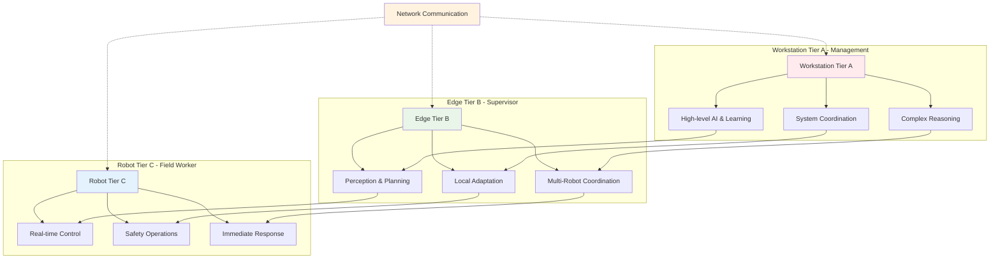

import ExerciseBlock from '@site/src/components/Learning/ExerciseBlock';
import Quiz from '@site/src/components/Learning/Quiz';

## Intro

In the previous chapters, we explored the theoretical foundations of Physical AI and learned how to set up the necessary hardware components. Now, we'll dive into the architectural patterns that make Physical AI systems scalable, efficient, and robust. Think of this chapter as learning how to organize a complex team - just as a company has different departments handling different responsibilities (reception, management, operations), Physical AI systems distribute work across three tiers to optimize performance.

The three-tier architecture—Workstation, Edge, and Robot—forms the backbone of modern Physical AI deployments, enabling complex robotic systems to operate effectively across different computing environments. This chapter will show you how to structure your Physical AI applications to leverage the strengths of each tier while maintaining seamless communication between them, using real-world analogies and examples to make the concepts clear and understandable.

## Learning Objectives

After completing this chapter, you will be able to:
- Explain the three-tier architecture (Workstation/Edge/Robot) for Physical AI systems
- Describe the design principles for multi-tier Physical AI deployments
- Implement communication protocols between different tiers
- Analyze performance trade-offs between centralized and distributed architectures
- Evaluate Physical AI applications across the three-tier infrastructure

## Hook

Consider how a humanoid robot operating in a dynamic environment must make split-second decisions while also learning from experience and coordinating with other systems. This requires a sophisticated architecture that balances real-time responsiveness with complex computation - like having a team where the field worker makes immediate decisions, the supervisor handles complex planning, and the manager provides long-term strategy. The three-tier architecture solves this challenge by distributing work appropriately: the robot handles immediate reactions (like a field worker), edge devices manage complex perception and planning (like a supervisor), while workstations provide high-level reasoning and learning (like a manager). This architecture enables robots to be both reactive and intelligent, just as humans balance reflexive responses with thoughtful decision-making.

<div className="key-takeaway">
### Before you learn this...
- Physical AI systems need to balance real-time performance with complex computation
- Different computational tasks have different latency requirements
- Communication between tiers must be reliable and efficient
- System architecture affects both performance and maintainability
- The three-tier approach optimizes resource utilization across computing platforms
</div>

<div className="common-misconception">
### Common misunderstanding...
**Myth**: Centralized architectures are always better because they provide unified control.
**Reality**: Distributed architectures often provide better fault tolerance and lower latency for real-time operations, while centralized systems are better for high-level coordination. The three-tier approach combines the best of both worlds.
</div>

## Concept

The three-tier architecture for Physical AI systems is designed to optimize the distribution of computational tasks based on their requirements for latency, processing power, and real-time performance. Think of it like a well-organized company where different departments handle tasks best suited to their capabilities.

### Robot Tier (Tier C): The Field Worker

The Robot Tier is like the field worker who must respond immediately to situations as they arise. This tier handles:

**Real-time control and safety-critical operations**: Like a reflex action, the robot tier must respond instantly to prevent accidents or handle immediate threats. When a robot detects an obstacle, it needs to stop immediately - there's no time to ask the supervisor.

**Low-latency sensor processing and actuator commands**: The robot processes sensor data locally to make split-second decisions. Think of it like a driver's reflexes - when you see an obstacle ahead, you brake immediately without thinking.

**Immediate obstacle avoidance and basic navigation**: The robot handles basic navigation tasks that require immediate response, like stopping when something appears in front of it.

**Minimal computational overhead**: This tier runs on the robot's onboard computer, typically with limited processing power but optimized for speed and reliability.

**Typical platforms**: NVIDIA Jetson series, Raspberry Pi, or other embedded systems designed to fit on the robot itself.

### Edge Tier (Tier B): The Supervisor

The Edge Tier acts like a supervisor who handles more complex tasks that require analysis but still need relatively quick responses. This tier manages:

**Complex perception tasks**: Like a supervisor analyzing reports, the Edge tier processes complex sensor data like computer vision, sensor fusion, and pattern recognition that requires more processing power than the robot has.

**Path planning and higher-level decision making**: The Edge tier plans routes and makes decisions that don't need to be instantaneous but still require timely responses.

**Local learning and adaptation**: Like a supervisor who learns from local conditions, the Edge tier adapts to local environments and learns from recent experiences without needing to contact central management.

**Communication with multiple robots**: The Edge tier can coordinate multiple robots in the same area, like a supervisor managing a team.

**Typical platforms**: More powerful Jetson variants, edge servers, or other computing devices located near the robots for low-latency communication.

### Workstation Tier (Tier A): The Manager

The Workstation Tier functions like central management, handling strategic decisions and long-term planning:

**High-level reasoning and complex AI models**: Like a CEO making strategic decisions, this tier runs complex AI models that require significant computational resources and can take more time.

**Long-term learning and model training**: The Workstation tier trains AI models using data from multiple robots, improving overall system performance over time.

**System-wide coordination and optimization**: Like management optimizing company-wide processes, this tier coordinates multiple robots across different locations and optimizes overall system performance.

**Human-robot interaction interfaces**: This tier often handles complex interactions with humans, like natural language processing or high-level task management.

**Typical platforms**: Powerful workstations, cloud computing, or data center servers with significant processing power.

### Communication Between Tiers: The Communication Network

Just as different departments in a company need to communicate effectively, the tiers use different communication protocols optimized for their needs:

**Robot ↔ Edge**: Real-time protocols like DDS (Data Distribution Service) or ROS 2 with Quality of Service (QoS) settings. This is like direct communication between field workers and their immediate supervisor - fast, reliable, and optimized for immediate needs.

**Edge ↔ Workstation**: Standard networking protocols like HTTP/gRPC, WebSocket, or MQTT. This is like communication between supervisors and management - more formal, can handle larger data transfers, and doesn't need to be instantaneous.

**Robot ↔ Workstation**: Used when direct communication is needed, typically for high-level commands or status updates.

### Real-World Examples and Analogies

Think of Tesla's autonomous driving system: the car (Robot Tier) makes immediate driving decisions like braking and steering. The Tesla data center (Workstation Tier) processes data from thousands of cars to improve driving algorithms. Tesla might also use edge computing at charging stations or in cities (Edge Tier) for local map updates and traffic analysis.

Or consider Amazon's warehouse robots: the individual robots (Robot Tier) handle immediate tasks like picking up packages. Edge computers in the warehouse (Edge Tier) coordinate multiple robots and optimize local operations. Amazon's central systems (Workstation Tier) manage inventory across all warehouses and optimize global logistics.

## Mermaid Diagram

<div className="diagram-container" tabIndex={0}>

<figcaption className="mermaid-diagram figcaption">
Flowchart showing the three-tier architecture of Physical AI systems: Workstation Tier A handles high-level AI and reasoning (like management), Edge Tier B manages perception and planning (like a supervisor), and Robot Tier C executes real-time control and safety operations (like a field worker), with network communication connecting all tiers.
</figcaption>
</div>

## Physical AI Closed Loop

```mermaid
graph TD
    subgraph "Physical AI Closed Loop System"
        A[Environment] --> B[Sensors]
        B --> C[AI Processing]
        C --> D[Actuators]
        D --> A
        E[Learning & Memory] --> C
        F[Human Interaction] --> C
    end

    style A fill:#2d3748
    style B fill:#2d3748
    style C fill:#2d3748
    style D fill:#2d3748
    style E fill:#2d3748
    style F fill:#2d3748
```

<div className="diagram-container" tabIndex={0}>

<figcaption className="mermaid-diagram figcaption">
Flowchart showing the closed loop of Physical AI: environment provides input to sensors, AI processes information, actuators affect the environment, with learning and memory providing context and human interaction providing guidance.
</figcaption>
</div>

## Code Example

Let's look at how to implement the three-tier architecture pattern using ROS 2 and network communication, similar to how a real distributed system would operate:

```python
#!/usr/bin/env python3
"""
Three-Tier Architecture Implementation - Tier A Example

Tier A: CPU-only simulation example that works with Gazebo, no hardware required
Purpose: Learn three-tier architecture concepts without physical robot

Learning Objectives:
- Understand how to distribute computational tasks across three tiers
- Learn about communication protocols between different tiers
- See how each tier handles different types of processing
- Practice implementing distributed robotic systems

Prerequisites:
- Chapter 1 concepts (Physical AI fundamentals)
- Chapter 2 concepts (hardware and communication)
- Basic Python and ROS 2 knowledge

Expected Output:
- Three nodes running in different tiers
- Communication between tiers with appropriate protocols
- Demonstration of distributed processing
"""

import rclpy
from rclpy.node import Node
from sensor_msgs.msg import Image, LaserScan
from geometry_msgs.msg import Twist, PoseStamped
from std_msgs.msg import String, Float32
from nav_msgs.msg import Path
import numpy as np
import requests
import threading
import time
from typing import Dict, Any, Optional

class RobotTierNode(Node):
    """
    Robot Tier (Tier C): Handles real-time control and safety-critical operations.
    This is like the field worker who must respond immediately to situations.
    The robot tier focuses on immediate tasks that require sub-second response times.
    """

    def __init__(self):
        super().__init__('robot_tier_node')

        # Real-time control publishers/subscribers - like immediate reflexes
        self.cmd_vel_publisher = self.create_publisher(Twist, 'cmd_vel', 10)
        self.sensor_subscription = self.create_subscription(
            LaserScan, 'scan', self.sensor_callback, 10)

        # Edge communication - like talking to the supervisor
        self.edge_command_subscription = self.create_subscription(
            Twist, 'edge/cmd_vel', self.edge_command_callback, 10)

        # Safety monitoring - like having a safety reflex
        self.safety_timer = self.create_timer(0.1, self.safety_check)  # 10Hz for safety

        # Robot state tracking - like the robot's immediate awareness
        self.current_velocity = Twist()
        self.safety_engaged = False
        self.edge_command = None

        self.get_logger().info('🤖 Robot Tier Node initialized (Field Worker)')
        self.get_logger().info('Handling immediate tasks with sub-second response times')

    def sensor_callback(self, msg):
        """Process sensor data for immediate safety checks"""
        # Check for immediate obstacles - like a reflex action
        min_distance = min(msg.ranges) if msg.ranges else float('inf')

        if min_distance < 0.5:  # Safety distance threshold
            self.emergency_stop()
            self.get_logger().warn('⚠️  EMERGENCY OBSTACLE DETECTED - STOPPING')
        else:
            self.safety_engaged = False

    def edge_command_callback(self, msg):
        """Receive commands from Edge tier (supervisor)"""
        self.edge_command = msg

    def safety_check(self):
        """Real-time safety monitoring - like constant vigilance"""
        if self.safety_engaged:
            self.emergency_stop()
        elif self.edge_command and not self.safety_engaged:
            # Apply edge command with safety limits - like following safe instructions
            limited_cmd = self.apply_safety_limits(self.edge_command)
            self.cmd_vel_publisher.publish(limited_cmd)

    def apply_safety_limits(self, cmd: Twist) -> Twist:
        """Apply safety limits to velocity commands"""
        limited = Twist()

        # Limit velocities for safety - like having speed limits
        max_linear = 0.5  # m/s - safe speed limit
        max_angular = 1.0  # rad/s - safe turning limit

        # Apply limits to prevent dangerous movements
        limited.linear.x = max(min(cmd.linear.x, max_linear), -max_linear)
        limited.angular.z = max(min(cmd.angular.z, max_angular), -max_angular)

        return limited

    def emergency_stop(self):
        """Immediate safety stop - like an emergency brake"""
        stop_cmd = Twist()
        self.cmd_vel_publisher.publish(stop_cmd)
        self.safety_engaged = True
        self.get_logger().warn('🚨 EMERGENCY STOP ACTIVATED')

class EdgeTierNode(Node):
    """
    Edge Tier (Tier B): Handles perception, planning, and local adaptation.
    This is like the supervisor who handles complex analysis but still needs timely responses.
    The edge tier processes complex data that requires more power than the robot has.
    """

    def __init__(self):
        super().__init__('edge_tier_node')

        # Robot communication - like supervising field workers
        self.robot_cmd_publisher = self.create_publisher(Twist, 'edge/cmd_vel', 10)
        self.robot_pose_subscription = self.create_subscription(
            PoseStamped, 'robot/pose', self.pose_callback, 10)

        # Sensor processing - like analyzing complex reports
        self.camera_subscription = self.create_subscription(
            Image, 'camera/image_raw', self.camera_callback, 10)
        self.lidar_subscription = self.create_subscription(
            LaserScan, 'scan', self.lidar_callback, 10)

        # Workstation communication - like reporting to management
        self.workstation_publisher = self.create_publisher(String, 'workstation/updates', 10)
        self.workstation_subscription = self.create_subscription(
            String, 'workstation/commands', self.workstation_callback, 10)

        # Planning and perception timers - like scheduled analysis tasks
        self.planning_timer = self.create_timer(0.5, self.planning_cycle)  # 2Hz planning
        self.perception_timer = self.create_timer(1.0, self.perception_cycle)  # 1Hz perception

        # State tracking - like keeping track of local operations
        self.current_pose = None
        self.goal_pose = None
        self.perception_data = {}

        self.get_logger().info('🏢 Edge Tier Node initialized (Supervisor)')
        self.get_logger().info('Handling complex analysis with moderate response times')

    def pose_callback(self, msg):
        """Update robot pose - like tracking field worker location"""
        self.current_pose = msg.pose

    def camera_callback(self, msg):
        """Process camera data for perception - like analyzing visual reports"""
        # In a real system, this would run computer vision algorithms
        # For simulation, we'll just record that we received data
        self.perception_data['camera'] = time.time()
        self.get_logger().info('📷 Camera data processed for local analysis')

    def lidar_callback(self, msg):
        """Process LIDAR data for mapping and obstacle detection"""
        # Process LIDAR data for local planning - like analyzing local conditions
        self.perception_data['lidar'] = {
            'timestamp': time.time(),
            'ranges': list(msg.ranges),
            'min_distance': min(msg.ranges) if msg.ranges else float('inf')
        }

    def planning_cycle(self):
        """Run planning algorithms - like creating daily work plans"""
        if self.current_pose and self.goal_pose:
            # Generate path to goal - like planning a route for a task
            cmd = self.calculate_navigation_command()
            self.robot_cmd_publisher.publish(cmd)

    def perception_cycle(self):
        """Run perception algorithms - like analyzing local conditions"""
        # Process perception data and make local decisions
        if 'lidar' in self.perception_data:
            lidar_data = self.perception_data['lidar']
            if lidar_data['min_distance'] < 2.0:  # Plan around obstacles
                self.adjust_navigation()

    def calculate_navigation_command(self) -> Twist:
        """Simple navigation algorithm - like creating basic movement instructions"""
        cmd = Twist()
        # Simplified navigation - in reality, this would use path planning
        cmd.linear.x = 0.3  # Move forward at safe speed
        cmd.angular.z = 0.0  # No rotation for now
        return cmd

    def adjust_navigation(self):
        """Adjust navigation based on obstacles - like adapting to local conditions"""
        cmd = Twist()
        cmd.linear.x = 0.1  # Slow down near obstacles
        cmd.angular.z = 0.2  # Gentle turn to avoid obstacles
        self.robot_cmd_publisher.publish(cmd)

    def workstation_callback(self, msg):
        """Process commands from Workstation tier (management)"""
        try:
            # In practice, use proper serialization instead of eval
            command_data = eval(msg.data)  # NOTE: Only for educational example
            if 'goal' in command_data:
                self.goal_pose = command_data['goal']
                self.get_logger().info(f'🎯 New goal received from management: {command_data["goal"]}')
        except Exception as e:
            self.get_logger().error(f'❌ Error processing workstation command: {e}')

class WorkstationTierNode(Node):
    """
    Workstation Tier (Tier A): Handles high-level reasoning and learning.
    This is like management that handles strategic decisions and long-term planning.
    The workstation tier runs complex algorithms that can take more time.
    """

    def __init__(self):
        super().__init__('workstation_tier_node')

        # Edge communication - like communicating with supervisors
        self.edge_subscription = self.create_subscription(
            String, 'workstation/updates', self.edge_update_callback, 10)
        self.edge_command_publisher = self.create_publisher(
            String, 'workstation/commands', 10)

        # High-level planning timer - like strategic planning meetings
        self.high_level_timer = self.create_timer(5.0, self.high_level_planning)  # 0.2Hz

        # Learning and adaptation timer - like continuous improvement
        self.learning_timer = self.create_timer(10.0, self.learning_cycle)  # 0.1Hz

        # System state tracking - like company-wide tracking
        self.robot_states = {}
        self.system_goals = []

        self.get_logger().info('🏛️  Workstation Tier Node initialized (Management)')
        self.get_logger().info('Handling strategic decisions and long-term planning')

    def edge_update_callback(self, msg):
        """Process updates from Edge tier (supervisor reports)"""
        try:
            # In practice, use proper serialization instead of eval
            update_data = eval(msg.data)  # NOTE: Only for educational example
            self.robot_states.update(update_data)
        except Exception as e:
            self.get_logger().error(f'❌ Error processing edge update: {e}')

    def high_level_planning(self):
        """Run high-level system planning - like strategic planning"""
        # Determine system-wide goals and priorities - like company strategy
        if not self.system_goals:
            self.set_system_goals()

        # Coordinate multiple robots if available - like managing multiple teams
        self.coordinate_robots()

    def learning_cycle(self):
        """Run learning and adaptation algorithms - like continuous improvement"""
        # Analyze system performance and adapt strategies
        self.update_system_models()

        # Send adaptation commands to Edge tier - like sending improvement guidelines
        adaptation_cmd = {
            'type': 'adaptation',
            'models': self.get_updated_models()
        }
        cmd_msg = String()
        cmd_msg.data = str(adaptation_cmd)
        self.edge_command_publisher.publish(cmd_msg)
        self.get_logger().info('📈 Learning improvements sent to supervisors')

    def set_system_goals(self):
        """Define system-wide goals - like company objectives"""
        self.system_goals = [
            {'location': (5.0, 5.0), 'task': 'exploration'},
            {'location': (10.0, 0.0), 'task': 'monitoring'}
        ]
        self.get_logger().info(f'🎯 System goals set: {self.system_goals}')

    def coordinate_robots(self):
        """Coordinate multiple robots (simulated) - like managing teams"""
        # Send goals to appropriate robots - like assigning tasks to teams
        if self.system_goals:
            goal = self.system_goals[0]  # Use first available goal
            command = {
                'goal': goal['location'],
                'task': goal['task']
            }
            cmd_msg = String()
            cmd_msg.data = str(command)
            self.edge_command_publisher.publish(cmd_msg)
            self.get_logger().info(f'📋 Task assigned: {command}')

    def update_system_models(self):
        """Update system models based on experience - like improving processes"""
        # In a real system, this would update ML models using data from all robots
        # For simulation, we'll just log the update
        self.get_logger().info('🔄 System models updated with new learning')

def main(args=None):
    """
    Main function to demonstrate the three-tier architecture
    This simulates how a distributed Physical AI system would operate
    """
    rclpy.init(args=args)

    # Create nodes for each tier - like setting up different departments
    robot_node = RobotTierNode()
    edge_node = EdgeTierNode()
    workstation_node = WorkstationTierNode()

    # Run nodes in separate threads to simulate distributed system
    # Like having different departments operating simultaneously
    def run_robot():
        rclpy.spin(robot_node)

    def run_edge():
        rclpy.spin(edge_node)

    def run_workstation():
        rclpy.spin(workstation_node)

    # Start nodes in threads - like starting operations in each department
    robot_thread = threading.Thread(target=run_robot)
    edge_thread = threading.Thread(target=run_edge)
    workstation_thread = threading.Thread(target=run_workstation)

    robot_thread.start()
    edge_thread.start()
    workstation_thread.start()

    try:
        # Keep main thread alive - like keeping the system running
        self.get_logger().info('🚀 Three-tier system operational')
        while True:
            time.sleep(1)
    except KeyboardInterrupt:
        robot_node.get_logger().info('🛑 Shutting down three-tier system')
    finally:
        rclpy.shutdown()
        robot_thread.join()
        edge_thread.join()
        workstation_thread.join()

if __name__ == '__main__':
    main()
```

## Exercises

1. **Architecture Analysis**: Compare the advantages and disadvantages of centralized vs. distributed architectures for Physical AI systems. When would you choose each approach, and what are the key trade-offs?

2. **Network Communication**: Design a network configuration for a multi-robot system with 3 robots, each having their own Edge tier. What communication protocols would you use and why? How would you ensure reliable communication?

3. **Latency Requirements**: For each tier, identify which operations require the lowest latency and explain why they need to be on that specific tier. What happens if the latency requirements aren't met?

4. **Scalability Planning**: How would you modify the three-tier architecture to support 100 robots operating in the same environment? What challenges would arise and how would you address them?

5. **Failure Handling**: Design a fail-safe mechanism for when communication between tiers is lost. How would each tier continue operating independently, and what fallback strategies would you implement?

<details>
<summary>Exercise Solutions</summary>

1. **Architecture Analysis Solution**:
   - Centralized: Advantages - unified control, global optimization, easier coordination, consistent state; Disadvantages - single point of failure, communication bottlenecks, high latency, limited scalability
   - Distributed: Advantages - fault tolerance, reduced communication load, lower latency for local tasks, better scalability; Disadvantages - coordination complexity, potential conflicts, inconsistent state, harder debugging
   - Choose centralized for small, coordinated systems where consistency is critical; distributed for large, autonomous systems where resilience and low latency are important.

2. **Network Communication Solution**:
   - Robot ↔ Edge: Real-time protocols like DDS/ROS 2 with high QoS settings for immediate data exchange
   - Edge ↔ Edge: Standard TCP/IP for coordination between different areas
   - Edge ↔ Workstation: HTTP/gRPC for high-level commands and data synchronization
   - Use redundant communication paths, proper error handling, and network monitoring to ensure reliability. Consider mesh networking for robot-to-robot communication.

3. **Latency Requirements Solution**:
   - Robot Tier: Safety operations, immediate sensor processing, emergency stops (sub-millisecond to 10ms) - these require immediate response to prevent accidents
   - Edge Tier: Perception processing, path planning, obstacle avoidance (10-100ms) - these need quick response but can tolerate slight delays
   - Workstation Tier: Long-term planning, learning, system coordination (100ms+ to seconds) - these can wait for more processing time
   - If latency requirements aren't met, robots might collide, miss critical events, or fail to respond to emergencies.

4. **Scalability Planning Solution**:
   - Hierarchical Edge architecture with regional coordinators to manage robot groups
   - Load balancing across multiple workstation tiers to distribute processing
   - Distributed databases for state sharing to handle large amounts of data
   - Microservice architecture for better resource management and fault isolation
   - Challenges: network complexity increases, data consistency becomes harder, coordination overhead grows, and resource contention may occur

5. **Failure Handling Solution**:
   - Robot Tier: Pre-programmed safe behaviors, basic obstacle avoidance, return to safe location - must operate independently for safety
   - Edge Tier: Local goals and plans when workstation is unreachable, continue with cached instructions - maintain local operations
   - Workstation Tier: Queue commands for later delivery, implement graceful degradation - continue essential functions
   - Implement heartbeat monitoring, automatic failover procedures, and fallback communication methods to maintain system operation during partial failures.

</details>

## Summary

The three-tier architecture is fundamental to effective Physical AI systems:

1. **Robot Tier (C)**: Handles real-time control and safety-critical operations with minimal latency. Like field workers, this tier responds immediately to situations requiring instant action.

2. **Edge Tier (B)**: Manages complex perception, planning, and local adaptation with moderate latency tolerance. Like supervisors, this tier handles complex analysis that requires more processing power than the robot has.

3. **Workstation Tier (A)**: Performs high-level reasoning, learning, and system-wide coordination with higher latency tolerance. Like management, this tier handles strategic decisions and long-term planning.

4. **Communication**: Each tier uses appropriate protocols based on latency and reliability requirements, ensuring efficient information flow throughout the system.

5. **Distribution**: Work is distributed based on computational needs and real-time constraints, optimizing resource utilization across all tiers.

6. **Scalability**: The architecture supports multiple robots and can scale to complex multi-robot systems while maintaining performance.

This architectural pattern enables Physical AI systems to be both responsive and intelligent, balancing real-time performance with complex computation. The three-tier approach combines the benefits of both centralized and distributed systems, providing the best of both worlds for robotic applications.

## Part 1 Quiz

<Quiz
  id="chapter-3-quiz"
  chapterReference="Chapter 3: Physical AI Architecture"
  questions={[
    {
      id: "ch3-q1",
      question: "Which tier is responsible for immediate safety responses like emergency stops?",
      type: "multiple-choice",
      options: [
        "Workstation Tier A",
        "Edge Tier B",
        "Robot Tier C (Field Worker)",
        "All tiers equally"
      ],
      correctAnswer: 2,
      hint: "See Chapter 3, 'Concept' section - Robot Tier (Tier C): The Field Worker",
      explanation: "The Robot Tier handles real-time control and safety-critical operations with minimal latency, responding immediately to safety concerns like emergency stops."
    },
    {
      id: "ch3-q2",
      question: "What is the main role of the Robot Tier (Tier C)?",
      type: "multiple-choice",
      options: [
        "Long-term learning and model training",
        "Complex perception and planning",
        "Immediate safety responses and real-time control",
        "System-wide coordination"
      ],
      correctAnswer: 2,
      hint: "See Chapter 3, 'Concept' section - Robot Tier (Tier C): The Field Worker",
      explanation: "The Robot Tier handles real-time control and safety-critical operations with minimal latency, like field workers who must respond immediately to situations."
    },
    {
      id: "ch3-q3",
      question: "What does the Edge Tier (Tier B) primarily handle?",
      type: "multiple-choice",
      options: [
        "Emergency responses only",
        "Complex sensor processing and local planning",
        "Strategic management decisions",
        "Basic communication only"
      ],
      correctAnswer: 1,
      hint: "See Chapter 3, 'Concept' section - Edge Tier (Tier B): The Supervisor",
      explanation: "The Edge Tier processes complex perception tasks like computer vision and sensor fusion, and handles path planning and local adaptation."
    },
    {
      id: "ch3-q4",
      question: "What is the primary function of the Workstation Tier (Tier A)?",
      type: "multiple-choice",
      options: [
        "Real-time control",
        "Local navigation",
        "High-level reasoning and strategic decisions",
        "Immediate obstacle detection"
      ],
      correctAnswer: 2,
      hint: "See Chapter 3, 'Concept' section - Workstation Tier (Tier A): The Manager",
      explanation: "The Workstation Tier handles high-level reasoning, complex AI models, long-term learning, and system-wide coordination like management making strategic decisions."
    },
    {
      id: "ch3-q5",
      question: "How does the three-tier architecture benefit Physical AI systems?",
      type: "multiple-choice",
      options: [
        "It combines benefits of both centralized and distributed systems",
        "It eliminates the need for communication",
        "It reduces computational requirements",
        "It simplifies the hardware requirements"
      ],
      correctAnswer: 0,
      hint: "See Chapter 3, 'Summary' section",
      explanation: "The three-tier architecture combines the benefits of both centralized and distributed systems, providing the best of both worlds for robotic applications by optimizing resource utilization and balancing performance."
    }
  ]}
/>

## Preview Next Chapter

In Part 2: Robotic Nervous System, we'll explore the neural-inspired approaches to Physical AI. You'll learn about bio-inspired control systems, neural networks for perception and action, and how to implement learning algorithms that mimic biological processes. This will prepare you for building more sophisticated and adaptive Physical AI systems that can learn from experience and improve over time, taking the architectural foundations you've learned and applying them to create truly intelligent robotic systems.