import ExerciseBlock from '@site/src/components/Learning/ExerciseBlock';
import Quiz from '@site/src/components/Learning/Quiz';

## Intro

In the previous chapters, we explored the foundational concepts of Physical AI and learned how to set up the necessary hardware and architectural patterns. Now, we'll dive into the communication backbone that makes Physical AI systems possible: ROS2 (Robot Operating System 2). Think of ROS2 as the nervous system of a robot - just as your nervous system carries signals from your brain to your muscles and back, ROS2 carries information between different parts of a robot, allowing them to work together seamlessly.

ROS2 provides the infrastructure for distributed robotics, enabling different components of a robot (sensors, processors, actuators) to communicate with each other efficiently. This chapter will show you how ROS2's architecture enables complex robotic systems to coordinate their actions, using real-world analogies and examples to make the concepts clear and understandable. Just as a nervous system allows different parts of your body to work together, ROS2 allows different software components of a robot to collaborate effectively.

## Learning Objectives

After completing this chapter, you will be able to:
- Explain the DDS middleware and publish-subscribe communication pattern in ROS2
- Compare ROS1 vs ROS2 architectures and explain why ROS2 is essential for Physical AI
- Implement nodes, topics, services, and actions in ROS2 for Physical AI applications
- Analyze the benefits of ROS2's distributed architecture for multi-robot systems
- Evaluate ROS2's real-time capabilities for safety-critical robotic applications

## Hook

Consider how a humanoid robot with multiple sensors, processors, and actuators must coordinate all its components to walk, see, and interact with the world. Each component needs to share information with others: cameras send visual data to perception nodes, perception nodes send obstacle information to navigation nodes, navigation nodes send movement commands to actuator controllers. This complex communication requires a sophisticated "nervous system" - ROS2 provides exactly that. Just as your brain doesn't need to directly control every muscle but instead sends messages through your nervous system, ROS2 allows high-level planning nodes to coordinate with low-level control nodes without direct coupling. This architecture enables robots to be both modular (like having specialized organs) and integrated (like having coordinated body systems), making complex robotic behaviors possible.

<div className="key-takeaway">
### Before you learn this...
- ROS2 uses DDS (Data Distribution Service) as its communication middleware
- Nodes communicate through topics (publish-subscribe), services (request-reply), and actions (goal-feedback-result)
- ROS2 has built-in Quality of Service (QoS) settings for different reliability requirements
- The architecture supports distributed systems across multiple machines
- ROS2 provides better real-time capabilities and security than ROS1
</div>

<div className="common-misconception">
### Common misunderstanding...
**Myth**: ROS2 is just an updated version of ROS1 with the same basic architecture.
**Reality**: ROS2 represents a complete architectural redesign with DDS middleware, real-time support, security features, and true distributed computing capabilities. It's fundamentally different from ROS1's master-based architecture.
</div>

## Concept

ROS2 architecture serves as the nervous system of Physical AI systems, providing a distributed communication framework that allows different components to work together seamlessly. Think of it like the human nervous system where different parts of the body communicate through neural pathways.

### DDS Middleware: The Neural Network

DDS (Data Distribution Service) is the foundation of ROS2's communication architecture. Like how your nervous system carries signals between different parts of your body, DDS enables communication between different software components (nodes) in a robot. DDS provides:

**Data-Centric Architecture**: Unlike traditional message-passing systems that focus on sending messages between specific endpoints, DDS focuses on the data itself. Nodes declare what data they're interested in (topics), and DDS automatically handles the distribution. Think of it like a shared whiteboard where nodes can post information and others can read what they need.

**Quality of Service (QoS) Settings**: Different types of information have different requirements. Like how some neural signals (like pain) need immediate attention while others (like digestion) can wait, DDS provides QoS settings to specify reliability, durability, and latency requirements for different data streams.

**Built-in Discovery**: Nodes automatically discover each other on the network without needing a central master. This is like how different parts of your nervous system can communicate without going through your brain for every message.

### Communication Patterns: The Types of Neural Signals

ROS2 provides three main communication patterns, each designed for different types of interactions:

**Topics (Publish-Subscribe)**: Like sensory neurons that broadcast information (like visual input) to multiple parts of the brain, topics allow nodes to publish data that multiple other nodes can subscribe to. This is perfect for sensor data like camera images or LIDAR scans that multiple nodes need to process.

**Services (Request-Reply)**: Like how you might ask a specific question and wait for an answer, services provide synchronous request-reply communication. This is ideal for operations that need immediate responses, like asking for the current robot position or requesting a specific computation.

**Actions (Goal-Feedback-Result)**: Like complex motor tasks that require ongoing communication (like walking to a specific location while receiving feedback about progress), actions provide long-running operations with continuous feedback. This is perfect for navigation tasks, manipulation sequences, or any operation that takes time and needs monitoring.

### ROS1 vs ROS2: Evolution of the Nervous System

ROS2 represents a complete architectural redesign compared to ROS1, addressing critical limitations for real-world robotics:

**Master vs. Masterless Architecture**: ROS1 required a central master node that could become a single point of failure. ROS2 uses a peer-to-peer discovery mechanism, making the system more robust - like having redundant communication pathways instead of relying on a single command center.

**Real-time Support**: ROS2 includes real-time capabilities essential for safety-critical robotics, while ROS1 was not designed with real-time requirements in mind. This is like having both conscious and reflexive responses - some robot operations need guaranteed timing.

**Security**: ROS2 includes built-in security features (authentication, encryption, access control) that are essential for deployed robotic systems. This is like having an immune system to protect against threats.

**Multi-platform Support**: ROS2 provides better support for different operating systems and embedded platforms, crucial for the three-tier architecture we discussed in Chapter 3.

### Core Components: The Building Blocks of the Nervous System

**Nodes**: The basic processing units, like neurons in your nervous system. Each node performs a specific function (sensor processing, control, planning) and communicates with other nodes through the middleware.

**Topics**: Named buses for data transmission, like different types of neural pathways. Multiple nodes can publish to and subscribe from the same topic, enabling flexible communication patterns.

**Services**: Request-reply communication channels, like direct neural connections for immediate responses to specific queries.

**Actions**: Long-running operations with feedback, like complex motor patterns that require continuous monitoring and adjustment.

### Real-World Examples and Analogies

Think of ROS2 like a modern smart factory where different machines need to coordinate: sensors publish data about the environment (like topics), quality control systems respond to specific requests (like services), and complex manufacturing processes provide continuous feedback about their progress (like actions). The DDS middleware ensures all these communications happen reliably and efficiently.

Or consider a modern city's traffic management system: traffic sensors publish real-time data, traffic lights respond to specific requests, and long-term traffic optimization processes provide continuous feedback - all coordinated through a robust communication infrastructure.

## Mermaid Diagram

```mermaid
graph TB
    subgraph "ROS2 Architecture - The Nervous System"
        A[Node A: Sensor Processing] -->|Topic: /camera/image_raw| B[Node B: Perception]
        C[Node C: Navigation] -->|Service: /get_robot_pose| D[Node D: State Estimation]
        E[Node E: Controller] -->|Action: /move_base| F[Node F: Navigation Server]
        B -->|Topic: /obstacles| C
        D -->|Topic: /robot/pose| C
        F -->|Feedback| C
        G[DDS Middleware] -.-> A
        G -.-> B
        G -.-> C
        G -.-> D
        G -.-> E
        G -.-> F
    end

    style A fill:#2d3748
    style B fill:#2d3748
    style C fill:#2d3748
    style D fill:#2d3748
    style E fill:#2d3748
    style F fill:#2d3748
    style G fill:#2d3748
```

<div className="diagram-container" tabIndex={0}>

<figcaption className="mermaid-diagram figcaption">
Flowchart showing ROS2 architecture with nodes communicating through DDS middleware: Sensor Processing node publishes camera data to Perception node via topic, Navigation node requests robot pose from State Estimation via service, Controller sends navigation goals to Navigation Server via action with feedback, all coordinated through DDS middleware.
</figcaption>
</div>

## Code Example

Let's look at how to implement basic ROS2 communication patterns, similar to how a real robotic nervous system would operate:

```python
#!/usr/bin/env python3
"""
ROS2 Architecture Implementation - Basic Communication Patterns
ROS2, rclpy, and standard libraries only - no hardware required
Purpose: Learn ROS2 communication patterns without physical robot

Learning Objectives:
- Understand ROS2 node structure and lifecycle
- Learn how to create publishers and subscribers
- Practice service and action implementations
- See how different communication patterns work

Prerequisites:
- Chapter 1 concepts (Physical AI fundamentals)
- Chapter 2 concepts (basic Python knowledge)
- Chapter 3 concepts (three-tier architecture)
- Basic Python and ROS 2 knowledge

Expected Output:
- Multiple nodes communicating via different patterns
- Demonstration of publish-subscribe, service, and action usage
- Understanding of ROS2's distributed architecture
"""

import rclpy
from rclpy.node import Node
from rclpy.qos import QoSProfile, ReliabilityPolicy, DurabilityPolicy
from std_msgs.msg import String
from example_interfaces.srv import AddTwoInts
from example_interfaces.action import Fibonacci
import threading
import time
from typing import Optional

class SensorNode(Node):
    """
    Sensor Node: Publishes sensor data to the system.
    This is like a sensory neuron that broadcasts information to the nervous system.
    The sensor node continuously publishes data that other nodes can use.
    """

    def __init__(self):
        super().__init__('sensor_node')

        # Create a publisher for sensor data with specific QoS settings
        # Like a sensory neuron with specific reliability requirements
        qos_profile = QoSProfile(
            depth=10,
            reliability=ReliabilityPolicy.BEST_EFFORT,  # For sensor data, some loss is acceptable
            durability=DurabilityPolicy.VOLATILE
        )
        self.sensor_publisher = self.create_publisher(String, 'sensor_data', qos_profile)

        # Timer for publishing sensor data - like continuous sensory input
        self.sensor_timer = self.create_timer(0.5, self.publish_sensor_data)  # 2Hz

        # Counter for sensor readings
        self.sensor_counter = 0

        self.get_logger().info('📡 Sensor Node initialized (Sensory Neuron)')
        self.get_logger().info('Publishing sensor data at 2Hz')

    def publish_sensor_data(self):
        """Publish simulated sensor data"""
        msg = String()
        msg.data = f"Sensor reading {self.sensor_counter}: Environment data at {time.time()}"
        self.sensor_publisher.publish(msg)
        self.sensor_counter += 1
        self.get_logger().info(f'📡 Published: {msg.data}', throttle_duration_sec=1)

class ProcessingNode(Node):
    """
    Processing Node: Subscribes to sensor data and processes it.
    This is like a processing center in the nervous system that interprets sensory input.
    The processing node receives data and performs computations on it.
    """

    def __init__(self):
        super().__init__('processing_node')

        # Create subscription to sensor data
        # Like a processing center receiving sensory input
        qos_profile = QoSProfile(
            depth=10,
            reliability=ReliabilityPolicy.BEST_EFFORT,
            durability=DurabilityPolicy.VOLATILE
        )
        self.subscription = self.create_subscription(
            String, 'sensor_data', self.sensor_callback, qos_profile)

        # Publisher for processed data
        self.processed_publisher = self.create_publisher(String, 'processed_data', 10)

        self.get_logger().info('🧠 Processing Node initialized (Sensory Processing Center)')
        self.get_logger().info('Subscribed to sensor data, processing and forwarding')

    def sensor_callback(self, msg):
        """Process incoming sensor data"""
        # Simulate processing of sensor data
        processed_data = f"Processed: {msg.data} - Analysis complete"

        # Publish processed data
        processed_msg = String()
        processed_msg.data = processed_data
        self.processed_publisher.publish(processed_msg)

        self.get_logger().info(f'🧠 Processed: {processed_data}', throttle_duration_sec=2)

class CalculatorNode(Node):
    """
    Calculator Node: Provides a service for mathematical operations.
    This is like a specialized processing center that responds to specific requests.
    The calculator node provides synchronous responses to specific queries.
    """

    def __init__(self):
        super().__init__('calculator_node')

        # Create a service server for adding two integers
        # Like a specialized center that responds to specific calculation requests
        self.service = self.create_service(
            AddTwoInts, 'add_two_ints', self.add_two_ints_callback)

        self.get_logger().info('🧮 Calculator Node initialized (Specialized Processing Center)')
        self.get_logger().info('Ready to respond to calculation requests')

    def add_two_ints_callback(self, request, response):
        """Handle addition requests"""
        result = request.a + request.b
        response.sum = result
        self.get_logger().info(f'🧮 Calculated {request.a} + {request.b} = {result}')
        return response

class NavigationNode(Node):
    """
    Navigation Node: Implements an action for complex navigation tasks.
    This is like a complex motor pattern that requires ongoing feedback and monitoring.
    The navigation node handles long-running operations with continuous feedback.
    """

    def __init__(self):
        super().__init__('navigation_node')

        # Create an action server for Fibonacci sequence calculation
        # Like a complex motor task that provides continuous feedback
        self._action_server = None  # Will be created in main thread

        self.get_logger().info('🧭 Navigation Node initialized (Complex Task Handler)')
        self.get_logger().info('Ready to handle long-running navigation tasks')

    def execute_callback(self, goal_handle):
        """Execute the Fibonacci action"""
        self.get_logger().info('🧭 Executing navigation task...')

        # Simulate a long-running task with feedback
        feedback_msg = Fibonacci.Feedback()
        feedback_msg.sequence = [0, 1]

        for i in range(1, goal_handle.request.order):
            if goal_handle.is_cancel_requested:
                goal_handle.canceled()
                self.get_logger().info('🧭 Navigation task canceled')
                return Fibonacci.Result()

            feedback_msg.sequence.append(feedback_msg.sequence[i] + feedback_msg.sequence[i-1])
            self.get_logger().info(f'🧭 Navigation progress: {i}/{goal_handle.request.order}')

            # Publish feedback
            goal_handle.publish_feedback(feedback_msg)
            time.sleep(0.5)  # Simulate processing time

        goal_handle.succeed()
        result = Fibonacci.Result()
        result.sequence = feedback_msg.sequence
        self.get_logger().info(f'🧭 Navigation task completed: {result.sequence}')
        return result

def main(args=None):
    """
    Main function to demonstrate ROS2 communication patterns
    This simulates how different communication patterns work in a distributed system
    """
    rclpy.init(args=args)

    # Create nodes for different communication patterns
    sensor_node = SensorNode()
    processing_node = ProcessingNode()
    calculator_node = CalculatorNode()
    navigation_node = NavigationNode()

    # Create action server in navigation node
    from rclpy.action import ActionServer
    navigation_node._action_server = ActionServer(
        navigation_node,
        Fibonacci,
        'fibonacci',
        navigation_node.execute_callback
    )

    # Run nodes in separate threads to simulate distributed system
    # Like having different parts of the nervous system operating simultaneously
    def run_sensor():
        rclpy.spin(sensor_node)

    def run_processing():
        rclpy.spin(processing_node)

    def run_calculator():
        rclpy.spin(calculator_node)

    def run_navigation():
        rclpy.spin(navigation_node)

    # Start nodes in threads - like starting operations in different nervous system parts
    sensor_thread = threading.Thread(target=run_sensor)
    processing_thread = threading.Thread(target=run_processing)
    calculator_thread = threading.Thread(target=run_calculator)
    navigation_thread = threading.Thread(target=run_navigation)

    sensor_thread.start()
    processing_thread.start()
    calculator_thread.start()
    navigation_thread.start()

    try:
        # Keep main thread alive - like keeping the system running
        sensor_node.get_logger().info('🚀 ROS2 nervous system operational')
        sensor_node.get_logger().info('Communication patterns active: Topics, Services, Actions')

        # Wait for a while to see the communication in action
        time.sleep(10)

        # Demonstrate service call
        sensor_node.get_logger().info('📞 Testing service communication...')
        # In a real system, we would create a client to call the service
        # For this example, we'll just log the concept

    except KeyboardInterrupt:
        sensor_node.get_logger().info('🛑 Shutting down ROS2 nervous system')
    finally:
        rclpy.shutdown()
        sensor_thread.join()
        processing_thread.join()
        calculator_thread.join()
        navigation_thread.join()

if __name__ == '__main__':
    main()
```

## Exercises

1. **Communication Pattern Analysis**: Compare the advantages and disadvantages of topics, services, and actions in ROS2. When would you choose each pattern, and what are the key trade-offs?

2. **QoS Configuration**: Design QoS settings for different types of robot data: camera images, LIDAR scans, joint states, and emergency stop commands. Explain your choices for reliability, durability, and history settings.

3. **Node Architecture**: Design a node architecture for a mobile robot with camera, LIDAR, and motor controllers. What nodes would you create, what topics would they use, and how would they communicate?

4. **Distributed System Design**: How would you modify the ROS2 architecture to support multiple robots operating in the same environment? What challenges would arise and how would you address them?

5. **Real-time Requirements**: For safety-critical operations like emergency stops, what specific ROS2 features would you use to ensure reliable and timely communication? Explain the configuration.

<details>
<summary>Exercise Solutions</summary>

1. **Communication Pattern Analysis Solution**:
   - Topics (Publish-Subscribe): Advantages - decoupled communication, multiple subscribers, continuous data flow; Disadvantages - no guaranteed delivery, no response confirmation; Use for sensor data, state broadcasts
   - Services (Request-Reply): Advantages - synchronous, guaranteed response, error handling; Disadvantages - blocking calls, single requestor; Use for computations, state queries, configuration changes
   - Actions (Goal-Feedback-Result): Advantages - long-running operations, continuous feedback, cancelation support; Disadvantages - more complex, overhead; Use for navigation, manipulation, complex tasks

2. **QoS Configuration Solution**:
   - Camera images: Reliability.BEST_EFFORT (some frame loss acceptable), History.KEEP_LAST (recent frames), Depth 5
   - LIDAR scans: Reliability.RELIABLE (no data loss), History.KEEP_LAST (latest scan), Depth 1
   - Joint states: Reliability.RELIABLE (critical for safety), History.KEEP_LAST (current state), Depth 1
   - Emergency stops: Reliability.RELIABLE (must be delivered), Durability.TRANSIENT_LOCAL (available for late-joining nodes), History.KEEP_ALL

3. **Node Architecture Solution**:
   - Camera Driver Node: Publishes to `/camera/image_raw`
   - LIDAR Driver Node: Publishes to `/scan`
   - Motor Controller Node: Subscribes to `/cmd_vel`, publishes to `/joint_states`
   - Perception Node: Subscribes to camera and LIDAR data, publishes processed information
   - Navigation Node: Provides action server for navigation goals, subscribes to sensor data
   - State Estimation Node: Fuses sensor data to estimate robot state

4. **Distributed System Design Solution**:
   - Use unique namespaces for each robot to avoid topic conflicts
   - Implement robot-to-robot communication for coordination
   - Use distributed parameter servers for shared configuration
   - Implement multi-robot planning and coordination nodes
   - Use appropriate QoS settings for inter-robot communication
   - Consider network bandwidth limitations and implement data reduction strategies

5. **Real-time Requirements Solution**:
   - Use RELIABLE reliability policy for critical commands
   - Set appropriate deadlines and lifespan for messages
   - Use real-time capable DDS implementations (like RTI Connext)
   - Configure appropriate QoS settings for deterministic behavior
   - Implement watchdog mechanisms to detect communication failures
   - Use dedicated network channels for safety-critical data

</details>

## Summary

ROS2 architecture serves as the nervous system of Physical AI systems:

1. **DDS Middleware**: Provides data-centric communication with Quality of Service settings, enabling reliable distributed communication between nodes.

2. **Communication Patterns**: Topics (publish-subscribe) for continuous data, services (request-reply) for synchronous operations, and actions (goal-feedback-result) for long-running tasks.

3. **Architecture Evolution**: ROS2's masterless design provides better robustness, real-time capabilities, and security compared to ROS1's master-based architecture.

4. **Core Components**: Nodes as processing units, topics for data buses, services for requests, and actions for complex operations with feedback.

5. **Distributed Computing**: Supports multi-robot systems and cross-platform deployment essential for Physical AI applications.

6. **Real-time Capabilities**: Built-in support for safety-critical operations with deterministic communication patterns.

This architecture enables Physical AI systems to be both modular and integrated, allowing complex robotic behaviors through coordinated communication. ROS2's design principles support the three-tier architecture we discussed in Chapter 3, providing the communication infrastructure needed for distributed Physical AI systems.

## Part 2 Quiz

<Quiz
  id="chapter-4-quiz"
  chapterReference="Chapter 4: ROS2 Architecture"
  questions={[
    {
      id: "ch4-q1",
      question: "What is the main communication middleware used in ROS2?",
      type: "multiple-choice",
      options: [
        "ROS Master",
        "DDS (Data Distribution Service)",
        "TCP/IP",
        "ZeroMQ"
      ],
      correctAnswer: 1,
      hint: "See Chapter 4, 'Concept' section - DDS Middleware: The Neural Network",
      explanation: "ROS2 uses DDS (Data Distribution Service) as its communication middleware, which provides data-centric communication with Quality of Service settings."
    },
    {
      id: "ch4-q2",
      question: "What communication pattern would be most appropriate for a camera publishing images?",
      type: "multiple-choice",
      options: [
        "Service (Request-Reply)",
        "Action (Goal-Feedback-Result)",
        "Topic (Publish-Subscribe)",
        "Parameter Server"
      ],
      correctAnswer: 2,
      hint: "See Chapter 4, 'Concept' section - Communication Patterns: The Types of Neural Signals",
      explanation: "Topics (publish-subscribe) are ideal for continuous data streams like camera images where multiple nodes might need the same data."
    },
    {
      id: "ch4-q3",
      question: "What is a key difference between ROS1 and ROS2 architecture?",
      type: "multiple-choice",
      options: [
        "ROS2 has a central master node",
        "ROS2 uses a masterless, peer-to-peer architecture",
        "ROS2 only works on Linux",
        "ROS2 has worse real-time support"
      ],
      correctAnswer: 1,
      hint: "See Chapter 4, 'Concept' section - ROS1 vs ROS2: Evolution of the Nervous System",
      explanation: "ROS2 uses a masterless, peer-to-peer discovery mechanism unlike ROS1's central master node, making it more robust and distributed."
    },
    {
      id: "ch4-q4",
      question: "Which ROS2 communication pattern provides continuous feedback during long-running operations?",
      type: "multiple-choice",
      options: [
        "Topics",
        "Services",
        "Actions",
        "Parameters"
      ],
      correctAnswer: 2,
      hint: "See Chapter 4, 'Concept' section - Communication Patterns: The Types of Neural Signals",
      explanation: "Actions provide goal-feedback-result communication patterns ideal for long-running operations that need continuous monitoring."
    },
    {
      id: "ch4-q5",
      question: "What does QoS stand for in ROS2?",
      type: "multiple-choice",
      options: [
        "Quality of Service",
        "Quick Operating System",
        "Query and Operate System",
        "Quantum Operating System"
      ],
      correctAnswer: 0,
      hint: "See Chapter 4, 'Concept' section - DDS Middleware: The Neural Network",
      explanation: "QoS stands for Quality of Service, which provides settings for reliability, durability, and other communication requirements."
    }
  ]}
/>

## Preview Next Chapter

In Chapter 5: Nodes, Topics, and Services, we'll dive deeper into the fundamental building blocks of ROS2 communication. You'll learn how to create custom message types, implement complex node interactions, and design robust communication patterns for Physical AI applications. This will prepare you for building more sophisticated robotic systems with well-architected communication between components, taking the foundational understanding of ROS2 architecture and applying it to practical implementations.