import ExerciseBlock from '@site/src/components/Learning/ExerciseBlock';
import Quiz from '@site/src/components/Learning/Quiz';

## Intro

In the previous chapter, we explored the overall architecture of ROS2 and learned how it serves as the nervous system for Physical AI systems. Now, we'll dive deeper into the fundamental building blocks that make up this nervous system: nodes, topics, services, and actions. Think of these components as the basic cell types in your nervous system - neurons, synapses, and neural pathways that enable complex behaviors through simple interactions.

Nodes are the basic processing units that perform specific functions, topics allow them to share information continuously, services provide synchronous request-response interactions, and actions handle long-running operations with feedback. This chapter will show you how to create and connect these building blocks effectively, using real-world analogies and examples to make the concepts clear and understandable. Just as biological systems use simple components to create complex behaviors, ROS2 uses these basic building blocks to create sophisticated robotic systems.

## Learning Objectives

After completing this chapter, you will be able to:
- Explain the structure and lifecycle of ROS2 nodes and their role in Physical AI systems
- Describe the publish-subscribe pattern for topics and when to use different QoS profiles
- Implement nodes that communicate via topics, services, and actions for Physical AI applications
- Analyze the trade-offs between different communication patterns in robotic systems
- Evaluate appropriate communication patterns for specific robotic tasks and requirements

## Hook

Consider how a robot's perception system must process camera images, identify objects, and share this information with navigation and manipulation systems. The camera driver node publishes images to a topic, a perception node subscribes to these images and processes them, then publishes object detections to another topic that multiple other nodes can use. When the navigation system needs to know the robot's current position, it makes a service call to the localization system. When the robot needs to navigate to a specific location, it sends an action goal to the navigation system and receives continuous feedback about progress. This complex orchestration happens through the fundamental building blocks of nodes, topics, services, and actions working together like specialized cells in a biological system. Understanding how to properly design and connect these building blocks is essential for creating robust and maintainable robotic systems.

<div className="key-takeaway">
### Before you learn this...
- Nodes are the basic processing units that perform specific functions in ROS2
- Topics use publish-subscribe pattern for continuous data sharing
- Services provide request-response communication for synchronous operations
- Actions handle long-running operations with feedback and goal management
- QoS profiles control reliability, durability, and other communication characteristics
</div>

<div className="common-misconception">
### Common misunderstanding...
**Myth**: All ROS2 communication should use topics because they're the most common pattern.
**Reality**: Different communication patterns (topics, services, actions) are appropriate for different use cases based on timing requirements, data flow, and interaction patterns.
</div>

## Concept

Nodes, topics, services, and actions form the fundamental building blocks of ROS2 communication, each designed for specific interaction patterns in robotic systems. Think of them as specialized components in a biological system where different cell types serve different functions.

### Nodes: The Processing Units

Nodes are the basic processing units in ROS2, similar to neurons in a biological nervous system. Each node performs a specific function and communicates with other nodes through the ROS2 middleware. Key characteristics of nodes include:

**Single Responsibility**: Like specialized cells in your body, each node should have a single, well-defined purpose. A camera driver node only handles camera data, a localization node only handles position estimation, and so on.

**Lifecycle Management**: Nodes have a lifecycle that includes initialization, running, and cleanup phases. During initialization, nodes create publishers, subscribers, services, and actions. During the running phase, they process data and communicate with other nodes. During cleanup, they release resources properly.

**Resource Management**: Nodes manage their own resources including timers, callbacks, and communication endpoints. They must properly initialize and clean up these resources to prevent memory leaks and ensure system stability.

### Topics: Continuous Data Sharing (Publish-Subscribe)

Topics implement the publish-subscribe communication pattern, ideal for continuous data streams where multiple nodes need the same information. This is like sensory neurons that broadcast information to multiple processing centers in your brain.

**Publishers and Subscribers**: Publishers send data to topics, and subscribers receive data from topics. Multiple publishers can send to the same topic (though this is less common), and multiple subscribers can receive from the same topic (very common).

**Asynchronous Communication**: Topic communication is asynchronous - publishers don't wait for responses from subscribers, and subscribers don't need to know who published the data. This enables loose coupling between nodes.

**Message Types**: Each topic has a specific message type that defines the structure of data that can be sent. This ensures type safety and predictable communication between nodes.

**Quality of Service (QoS) Settings**: Topics can have different QoS profiles that control reliability, durability, history, and other characteristics. For example, sensor data might use best-effort reliability while critical safety data might use reliable delivery.

### Services: Synchronous Request-Response

Services provide synchronous request-response communication, ideal for operations that need immediate responses. This is like asking a specific question and waiting for an answer, similar to a direct neural pathway for immediate responses.

**Client-Server Model**: Service clients send requests to service servers, which process the requests and return responses. The client waits for the response before continuing, making this a blocking operation.

**Synchronous Processing**: Service calls are synchronous - the client waits for the server to process the request and return a response. This is appropriate for operations that need guaranteed completion before continuing.

**Error Handling**: Services include built-in error handling mechanisms, allowing servers to return error codes and messages when operations fail.

### Actions: Long-Running Operations with Feedback

Actions handle long-running operations that require ongoing feedback and goal management. This is like complex motor patterns that require continuous monitoring and adjustment, such as walking to a specific location.

**Goal-Feedback-Result Pattern**: Actions follow a three-part pattern: clients send goals to servers, servers provide continuous feedback during execution, and servers return final results when complete.

**Non-blocking Operations**: Unlike services, action clients don't block while waiting for completion. They can continue processing while receiving feedback about the operation's progress.

**Cancelation Support**: Actions support goal cancelation, allowing clients to stop long-running operations if needed.

**Goal Status Tracking**: Actions provide status information about goals, allowing clients to know if goals are pending, executing, succeeded, or failed.

### Communication Pattern Selection: When to Use What

Choosing the right communication pattern is crucial for effective robotic system design:

**Use Topics When**:
- Multiple nodes need the same data (sensor streams, state information)
- Data is continuously generated and consumed
- Asynchronous communication is acceptable
- Loose coupling between nodes is desired

**Use Services When**:
- Synchronous request-response is needed
- Operations are relatively quick (under a few seconds)
- Error handling is important
- One-to-one communication is required

**Use Actions When**:
- Operations take a long time to complete
- Continuous feedback is needed during execution
- Goal cancelation might be required
- The operation has a clear start and end state

### Quality of Service (QoS) Profiles

QoS profiles control the behavior of topic communication, allowing you to specify reliability, durability, and other characteristics based on your application's requirements:

**Reliability**: Controls whether messages are guaranteed to be delivered (RELIABLE) or if some loss is acceptable (BEST_EFFORT). Critical safety data should use RELIABLE, while sensor data might use BEST_EFFORT.

**Durability**: Controls whether late-joining nodes receive previously published messages (TRANSIENT_LOCAL) or only new messages (VOLATILE). Parameter information might use TRANSIENT_LOCAL so new nodes get current settings.

**History**: Controls how many messages are stored for delivery (KEEP_ALL or KEEP_LAST with a specific depth). High-frequency sensor data might use KEEP_LAST with a small depth to limit memory usage.

### Real-World Examples and Analogies

Think of ROS2 communication patterns like different types of communication in a hospital: patient monitors continuously broadcast vital signs (topics), doctors request specific lab results (services), and complex procedures like surgery provide continuous updates to the surgical team (actions). Each pattern serves a specific purpose and is optimized for different types of information flow.

Or consider a modern smart home: sensors continuously publish environmental data (topics), you request specific actions like turning on lights (services), and complex operations like security monitoring provide ongoing status updates (actions).

## Mermaid Diagram

```mermaid
graph TB
    subgraph "ROS2 Building Blocks - Communication Patterns"
        A[Node: Camera Driver] -->|Topic: /camera/image_raw| B[Node: Image Processing]
        A -->|Topic: /camera/image_raw| C[Node: Object Detection]
        D[Node: Navigation Client] -->|Service: /get_path| E[Node: Path Planner]
        F[Node: Motion Client] -->|Action: /move_to_pose| G[Node: Navigation Server]
        E -->|Response| D
        G -->|Feedback/Result| F
        H[QoS Profiles] -.-> A
        H -.-> B
        H -.-> C
    end

    style A fill:#2d3748
    style B fill:#2d3748
    style C fill:#2d3748
    style D fill:#2d3748
    style E fill:#2d3748
    style F fill:#2d3748
    style G fill:#2d3748
    style H fill:#2d3748
```

<div className="diagram-container" tabIndex={0}>

<figcaption className="mermaid-diagram figcaption">
Flowchart showing ROS2 building blocks with different communication patterns: Camera Driver node publishes images to both Image Processing and Object Detection nodes via topics (publish-subscribe), Navigation Client requests path from Path Planner via service (request-response), Motion Client sends navigation goals to Navigation Server via action with feedback, all with QoS profiles controlling communication characteristics.
</figcaption>
</div>

## Code Example

Let's look at how to implement nodes with different communication patterns, similar to how a real robotic system would be structured:

```python
#!/usr/bin/env python3
"""
ROS2 Building Blocks Implementation - Nodes, Topics, Services, Actions
ROS2, rclpy, and standard libraries only - no hardware required
Purpose: Learn ROS2 communication patterns without physical robot

Learning Objectives:
- Understand how to create nodes with different communication patterns
- Learn to implement publishers, subscribers, services, and actions
- Practice proper resource management in ROS2 nodes
- See how QoS profiles affect communication

Prerequisites:
- Chapter 1 concepts (Physical AI fundamentals)
- Chapter 2 concepts (basic Python knowledge)
- Chapter 3 concepts (three-tier architecture)
- Chapter 4 concepts (ROS2 architecture)
- Basic Python and ROS 2 knowledge

Expected Output:
- Multiple nodes demonstrating different communication patterns
- Proper QoS configuration for different use cases
- Understanding of resource management in ROS2
"""

import rclpy
from rclpy.node import Node
from rclpy.qos import QoSProfile, ReliabilityPolicy, DurabilityPolicy, HistoryPolicy
from std_msgs.msg import String, Float32
from sensor_msgs.msg import LaserScan
from geometry_msgs.msg import Twist
from example_interfaces.srv import SetBool
from example_interfaces.action import Fibonacci
from rclpy.action import ActionServer, ActionClient
from rclpy.callback_groups import MutuallyExclusiveCallbackGroup
from rclpy.executors import MultiThreadedExecutor
import threading
import time
import math
from typing import Optional

class SensorNode(Node):
    """
    Sensor Node: Demonstrates topic publishing with different QoS profiles.
    This node simulates various sensor types with appropriate QoS settings.
    """

    def __init__(self):
        super().__init__('sensor_node')

        # Create different publishers for different sensor types with appropriate QoS

        # High-frequency sensor data (camera, IMU) - BEST_EFFORT, KEEP_LAST
        qos_sensor = QoSProfile(
            depth=5,
            reliability=ReliabilityPolicy.BEST_EFFORT,
            durability=DurabilityPolicy.VOLATILE,
            history=HistoryPolicy.KEEP_LAST
        )
        self.camera_publisher = self.create_publisher(String, 'camera/data', qos_sensor)

        # Critical safety data - RELIABLE, KEEP_ALL
        qos_critical = QoSProfile(
            depth=10,
            reliability=ReliabilityPolicy.RELIABLE,
            durability=DurabilityPolicy.VOLATILE,
            history=HistoryPolicy.KEEP_ALL
        )
        self.emergency_publisher = self.create_publisher(String, 'emergency/stop', qos_critical)

        # Environmental data - RELIABLE, KEEP_LAST
        qos_env = QoSProfile(
            depth=10,
            reliability=ReliabilityPolicy.RELIABLE,
            durability=DurabilityPolicy.VOLATILE,
            history=HistoryPolicy.KEEP_LAST
        )
        self.environment_publisher = self.create_publisher(String, 'environment/data', qos_env)

        # Timers for different data types
        self.camera_timer = self.create_timer(0.1, self.publish_camera_data)  # 10Hz
        self.emergency_timer = self.create_timer(1.0, self.publish_emergency_data)  # 1Hz
        self.environment_timer = self.create_timer(2.0, self.publish_environment_data)  # 0.5Hz

        self.get_logger().info('📡 Sensor Node initialized with multiple QoS profiles')
        self.get_logger().info('Publishing camera data at 10Hz, emergency at 1Hz, environment at 0.5Hz')

    def publish_camera_data(self):
        """Publish high-frequency camera simulation data"""
        msg = String()
        msg.data = f"Camera frame {int(time.time() * 10)} - RGB-D data"
        self.camera_publisher.publish(msg)
        self.get_logger().debug(f'📸 Camera: {msg.data}')

    def publish_emergency_data(self):
        """Publish critical safety data"""
        msg = String()
        msg.data = f"Emergency status: OK - {time.time()}"
        self.emergency_publisher.publish(msg)
        self.get_logger().info(f'🚨 Emergency: {msg.data}')

    def publish_environment_data(self):
        """Publish environmental data"""
        msg = String()
        msg.data = f"Environment: Temperature 22°C, Humidity 45% - {time.time()}"
        self.environment_publisher.publish(msg)
        self.get_logger().info(f'🌡️  Environment: {msg.data}')

class ProcessingNode(Node):
    """
    Processing Node: Demonstrates multiple subscribers with appropriate QoS matching publishers.
    This node processes data from multiple sources and demonstrates proper resource management.
    """

    def __init__(self):
        super().__init__('processing_node')

        # Create subscribers that match publisher QoS profiles
        qos_sensor = QoSProfile(
            depth=5,
            reliability=ReliabilityPolicy.BEST_EFFORT,
            durability=DurabilityPolicy.VOLATILE
        )
        self.camera_subscriber = self.create_subscription(
            String, 'camera/data', self.camera_callback, qos_sensor)

        qos_critical = QoSProfile(
            depth=10,
            reliability=ReliabilityPolicy.RELIABLE,
            durability=DurabilityPolicy.VOLATILE
        )
        self.emergency_subscriber = self.create_subscription(
            String, 'emergency/stop', self.emergency_callback, qos_critical)

        self.environment_subscriber = self.create_subscription(
            String, 'environment/data', self.environment_callback, qos_sensor)

        # Publisher for processed data
        self.processed_publisher = self.create_publisher(String, 'processed/data', 10)

        self.get_logger().info('🧠 Processing Node initialized with multiple subscribers')

    def camera_callback(self, msg):
        """Process high-frequency camera data"""
        # Simulate image processing
        processed_msg = String()
        processed_msg.data = f"Processed: {msg.data} - Objects detected"
        self.processed_publisher.publish(processed_msg)
        self.get_logger().debug(f'🧠 Processed camera: {processed_msg.data}')

    def emergency_callback(self, msg):
        """Process critical safety data immediately"""
        self.get_logger().warn(f'🚨 CRITICAL: {msg.data}')
        # In a real system, this might trigger immediate safety responses

    def environment_callback(self, msg):
        """Process environmental data"""
        self.get_logger().info(f'🌡️  Environmental: {msg.data}')

class ServiceNode(Node):
    """
    Service Node: Demonstrates service server implementation.
    This node provides synchronous operations that require immediate responses.
    """

    def __init__(self):
        super().__init__('service_node')

        # Create service servers
        self.get_robot_state_service = self.create_service(
            SetBool, 'get_robot_state', self.get_robot_state_callback)

        self.set_parameter_service = self.create_service(
            SetBool, 'set_robot_mode', self.set_robot_mode_callback)

        self.get_logger().info('⚙️  Service Node initialized with service servers')

    def get_robot_state_callback(self, request, response):
        """Handle robot state requests"""
        # Simulate checking robot state
        response.success = True
        response.message = f"Robot is operational - Mode: {request.data}"
        self.get_logger().info(f'⚙️  Robot state requested: {response.message}')
        return response

    def set_robot_mode_callback(self, request, response):
        """Handle robot mode setting"""
        mode = "ACTIVE" if request.data else "STANDBY"
        response.success = True
        response.message = f"Robot mode set to: {mode}"
        self.get_logger().info(f'⚙️  Robot mode changed: {mode}')
        return response

class ActionNode(Node):
    """
    Action Node: Demonstrates action server implementation.
    This node handles long-running operations with feedback and result reporting.
    """

    def __init__(self):
        super().__init__('action_node')

        # Create action server
        self._action_server = ActionServer(
            self,
            Fibonacci,
            'fibonacci_sequence',
            self.execute_fibonacci_callback
        )

        self.get_logger().info('🧩 Action Node initialized with action server')

    def execute_fibonacci_callback(self, goal_handle):
        """Execute the Fibonacci action with feedback"""
        self.get_logger().info(f'🧩 Executing Fibonacci sequence - order: {goal_handle.request.order}')

        # Initialize feedback and result
        feedback_msg = Fibonacci.Feedback()
        result_msg = Fibonacci.Result()

        # Start with first two numbers
        feedback_msg.sequence = [0, 1]

        # Check if goal is small
        if goal_handle.request.order <= 1:
            if goal_handle.request.order == 0:
                feedback_msg.sequence = [0]
            else:
                feedback_msg.sequence = [0, 1]
            goal_handle.succeed()
            result_msg.sequence = feedback_msg.sequence
            return result_msg

        # Calculate Fibonacci sequence with feedback
        for i in range(1, goal_handle.request.order):
            # Check for cancelation
            if goal_handle.is_cancel_requested:
                goal_handle.canceled()
                result_msg.sequence = feedback_msg.sequence
                self.get_logger().info('🧩 Fibonacci action canceled')
                return result_msg

            # Calculate next number in sequence
            next_num = feedback_msg.sequence[i] + feedback_msg.sequence[i-1]
            feedback_msg.sequence.append(next_num)

            # Publish feedback
            self.get_logger().info(f'🧩 Fibonacci progress: {i}/{goal_handle.request.order}')
            goal_handle.publish_feedback(feedback_msg)

            # Simulate processing time
            time.sleep(0.5)

        # Complete successfully
        goal_handle.succeed()
        result_msg.sequence = feedback_msg.sequence
        self.get_logger().info(f'🧩 Fibonacci completed: {result_msg.sequence}')
        return result_msg

class ClientNode(Node):
    """
    Client Node: Demonstrates service and action clients.
    This node demonstrates how to interact with services and actions as a client.
    """

    def __init__(self):
        super().__init__('client_node')

        # Create service client
        self.robot_state_client = self.create_client(SetBool, 'get_robot_state')

        # Create action client
        self.action_client = ActionClient(self, Fibonacci, 'fibonacci_sequence')

        # Timer to periodically make requests
        self.client_timer = self.create_timer(5.0, self.make_requests)

        # Wait for services and actions to be available
        while not self.robot_state_client.wait_for_service(timeout_sec=1.0):
            self.get_logger().info('🤖 Waiting for robot state service...')

        self.get_logger().info('🤖 Client Node initialized with service and action clients')

    def make_requests(self):
        """Make service and action requests periodically"""
        self.get_logger().info('🤖 Making service request...')

        # Make service request
        request = SetBool.Request()
        request.data = True
        future = self.robot_state_client.call_async(request)
        future.add_done_callback(self.service_response_callback)

        # Make action request
        self.send_action_goal()

    def service_response_callback(self, future):
        """Handle service response"""
        try:
            response = future.result()
            self.get_logger().info(f'🤖 Service response: {response.message}')
        except Exception as e:
            self.get_logger().error(f'🤖 Service call failed: {e}')

    def send_action_goal(self):
        """Send action goal"""
        goal_msg = Fibonacci.Goal()
        goal_msg.order = 5  # Calculate first 5 Fibonacci numbers

        self.get_logger().info('🤖 Sending action goal...')
        self.action_client.wait_for_server()
        send_goal_future = self.action_client.send_goal_async(
            goal_msg,
            feedback_callback=self.action_feedback_callback
        )
        send_goal_future.add_done_callback(self.action_response_callback)

    def action_feedback_callback(self, feedback_msg):
        """Handle action feedback"""
        self.get_logger().info(f'🤖 Action feedback: {feedback_msg.feedback.sequence}')

    def action_response_callback(self, future):
        """Handle action response"""
        goal_handle = future.result()
        if not goal_handle.accepted:
            self.get_logger().info('🤖 Action goal rejected')
            return

        self.get_logger().info('🤖 Action goal accepted, getting result...')
        get_result_future = goal_handle.get_result_async()
        get_result_future.add_done_callback(self.action_result_callback)

    def action_result_callback(self, future):
        """Handle action result"""
        result = future.result().result
        self.get_logger().info(f'🤖 Action result: {result.sequence}')

def main(args=None):
    """
    Main function to demonstrate ROS2 building blocks
    This simulates how different communication patterns work together
    """
    rclpy.init(args=args)

    # Create nodes for different communication patterns
    sensor_node = SensorNode()
    processing_node = ProcessingNode()
    service_node = ServiceNode()
    action_node = ActionNode()
    client_node = ClientNode()

    # Use MultiThreadedExecutor to run all nodes simultaneously
    executor = MultiThreadedExecutor(num_threads=5)
    executor.add_node(sensor_node)
    executor.add_node(processing_node)
    executor.add_node(service_node)
    executor.add_node(action_node)
    executor.add_node(client_node)

    try:
        sensor_node.get_logger().info('🏗️  ROS2 building blocks operational')
        sensor_node.get_logger().info('All communication patterns active: Topics, Services, Actions')

        # Spin the executor
        executor.spin()

    except KeyboardInterrupt:
        sensor_node.get_logger().info('🛑 Shutting down ROS2 building blocks system')
    finally:
        executor.shutdown()
        rclpy.shutdown()

if __name__ == '__main__':
    main()
```

## Exercises

1. **QoS Profile Design**: For a mobile robot with camera, LIDAR, IMU, and emergency stop button, design appropriate QoS profiles for each sensor type. Explain your choices for reliability, durability, and history settings.

2. **Node Architecture Design**: Design a node architecture for a robot that needs to navigate to waypoints while avoiding obstacles. Identify which nodes you would create, what communication patterns they would use, and how they would interact.

3. **Communication Pattern Selection**: For each of the following scenarios, choose the most appropriate communication pattern (topic, service, or action) and explain your reasoning:
   - Requesting the robot's current position
   - Publishing camera images
   - Sending a navigation goal to a specific location
   - Updating robot parameters
   - Broadcasting battery level

4. **Resource Management**: Explain the proper way to manage resources in ROS2 nodes. What should be done during initialization, runtime, and cleanup phases?

5. **Error Handling**: How would you implement error handling for services and actions in a safety-critical robotic system? What strategies would you use?

<details>
<summary>Exercise Solutions</summary>

1. **QoS Profile Design Solution**:
   - Camera: BEST_EFFORT, VOLATILE, KEEP_LAST(depth=5) - some frame loss acceptable for real-time performance
   - LIDAR: RELIABLE, VOLATILE, KEEP_LAST(depth=1) - no data loss for navigation, only latest scan needed
   - IMU: RELIABLE, VOLATILE, KEEP_LAST(depth=10) - critical for control, small buffer for processing
   - Emergency stop: RELIABLE, VOLATILE, KEEP_ALL - must be delivered, all events preserved

2. **Node Architecture Design Solution**:
   - Navigation Node: Action server for navigation goals, subscribes to sensor data
   - Obstacle Detection Node: Subscribes to LIDAR/camera, publishes obstacle information
   - Path Planner Node: Service for path planning, subscribes to map and goal
   - Controller Node: Subscribes to navigation commands, publishes to motors
   - Sensor Drivers: Publish sensor data as topics
   - State Estimation: Subscribes to sensors, publishes robot pose

3. **Communication Pattern Selection Solution**:
   - Requesting robot position: Service (synchronous request-response needed)
   - Publishing camera images: Topic (continuous data stream, multiple subscribers)
   - Navigation goal: Action (long-running operation with feedback)
   - Updating parameters: Service (synchronous confirmation needed)
   - Broadcasting battery: Topic (continuous monitoring, multiple subscribers)

4. **Resource Management Solution**:
   - Initialization: Create publishers, subscribers, services, actions; initialize internal state
   - Runtime: Process callbacks, manage timers, handle data flow
   - Cleanup: Destroy publishers/subscribers properly, release resources, handle shutdown gracefully

5. **Error Handling Solution**:
   - Services: Return error codes/messages, implement timeouts, retry mechanisms
   - Actions: Handle goal cancelation, provide error feedback, implement timeouts
   - General: Use try-catch blocks, log errors appropriately, implement fallback behaviors

</details>

## Summary

ROS2 building blocks provide the fundamental communication patterns for Physical AI systems:

1. **Nodes**: Basic processing units that perform specific functions with proper lifecycle management and resource handling.

2. **Topics**: Publish-subscribe pattern for continuous data sharing with configurable Quality of Service settings.

3. **Services**: Synchronous request-response communication for operations requiring immediate responses.

4. **Actions**: Goal-feedback-result pattern for long-running operations with continuous monitoring.

5. **QoS Profiles**: Configurable communication characteristics including reliability, durability, and history settings.

6. **Pattern Selection**: Each communication pattern is appropriate for specific use cases based on timing, data flow, and interaction requirements.

These building blocks enable the creation of complex robotic systems through simple, well-defined interactions. Proper use of these components with appropriate QoS settings ensures robust, maintainable, and efficient robotic applications that can scale from single robots to multi-robot systems.

## Part 2 Quiz

<Quiz
  id="chapter-5-quiz"
  chapterReference="Chapter 5: Nodes, Topics, Services"
  questions={[
    {
      id: "ch5-q1",
      question: "What is the main purpose of QoS (Quality of Service) profiles in ROS2?",
      type: "multiple-choice",
      options: [
        "To encrypt ROS2 communications",
        "To control communication characteristics like reliability and durability",
        "To limit the number of nodes that can run",
        "To compress message data"
      ],
      correctAnswer: 1,
      hint: "See Chapter 5, 'Concept' section - Quality of Service (QoS) Profiles",
      explanation: "QoS profiles control communication characteristics like reliability, durability, and history settings based on application requirements."
    },
    {
      id: "ch5-q2",
      question: "Which communication pattern is most appropriate for publishing camera images?",
      type: "multiple-choice",
      options: [
        "Service",
        "Action",
        "Topic",
        "Parameter"
      ],
      correctAnswer: 2,
      hint: "See Chapter 5, 'Concept' section - Communication Pattern Selection",
      explanation: "Topics are ideal for continuous data streams like camera images where multiple nodes might need the same data."
    },
    {
      id: "ch5-q3",
      question: "What does the 'RELIABLE' reliability policy guarantee in ROS2?",
      type: "multiple-choice",
      options: [
        "Messages will be delivered in order",
        "Messages will be delivered at least once",
        "Messages will be delivered exactly once",
        "Messages will be delivered at a specific rate"
      ],
      correctAnswer: 1,
      hint: "See Chapter 5, 'Concept' section - Quality of Service (QoS) Profiles",
      explanation: "The RELIABLE policy guarantees that messages will be delivered at least once, though duplicates may occur."
    },
    {
      id: "ch5-q4",
      question: "Which communication pattern is best for a long-running navigation task that provides feedback?",
      type: "multiple-choice",
      options: [
        "Topic",
        "Service",
        "Action",
        "Parameter"
      ],
      correctAnswer: 2,
      hint: "See Chapter 5, 'Concept' section - Communication Pattern Selection",
      explanation: "Actions are designed for long-running operations that require continuous feedback and goal management."
    },
    {
      id: "ch5-q5",
      question: "What is the main difference between services and actions in ROS2?",
      type: "multiple-choice",
      options: [
        "Services are faster than actions",
        "Services are synchronous while actions are asynchronous with feedback",
        "Services can handle multiple requests at once",
        "Actions use less network bandwidth"
      ],
      correctAnswer: 1,
      hint: "See Chapter 5, 'Concept' section - Services vs Actions",
      explanation: "Services are synchronous request-response operations while actions are asynchronous with continuous feedback."
    }
  ]}
/>

## Preview Next Chapter

In Chapter 6: Python rclpy, we'll explore the Python client library for ROS2 in detail. You'll learn how to create sophisticated ROS2 nodes using Python, implement advanced features like parameters and timers, and integrate with real hardware components. This will prepare you for building production-ready robotic applications using the building blocks you've learned about in this chapter, taking your ROS2 skills from theoretical understanding to practical implementation.