import ExerciseBlock from '@site/src/components/Learning/ExerciseBlock';
import Quiz from '@site/src/components/Learning/Quiz';

## Intro

In the previous chapters, we explored the fundamental building blocks of ROS2 and learned how nodes, topics, services, and actions work together to create distributed robotic systems. Now, we'll dive deep into the Python client library (rclpy) that allows you to create these components using Python. Think of rclpy as the Python interpreter for the ROS2 nervous system - it translates your Python code into ROS2 functionality, enabling you to build sophisticated robotic applications using one of the most accessible programming languages.

Python has become the language of choice for many robotics applications due to its simplicity, extensive libraries, and strong community support. This chapter will show you how to harness the power of Python with rclpy to create robust ROS2 nodes, using real-world analogies and examples to make the concepts clear and understandable. Just as Python makes complex tasks accessible to beginners, rclpy makes ROS2 development approachable while maintaining the power needed for advanced robotics applications.

## Learning Objectives

After completing this chapter, you will be able to:
- Explain the structure and lifecycle of ROS2 nodes using Python rclpy
- Describe how to create publishers, subscribers, services, and actions using Python
- Implement complex ROS2 nodes with timers, parameters, and callbacks in Python
- Analyze the performance characteristics of Python-based ROS2 nodes
- Evaluate appropriate use cases for Python vs other languages in ROS2 systems

## Hook

Consider how a robot's perception system needs to process camera images, detect objects, and share this information with navigation and manipulation systems. A Python developer can create a perception node that subscribes to camera data, processes images using OpenCV, and publishes object detections - all with concise, readable Python code. The rclpy library handles the complex ROS2 communication details, allowing the developer to focus on the perception algorithms. This combination of Python's simplicity with ROS2's power enables rapid development and prototyping of sophisticated robotic applications, just as Python has revolutionized data science and machine learning by making complex algorithms accessible.

<div className="key-takeaway">
### Before you learn this...
- rclpy is the Python client library for ROS2 that provides Python bindings to the ROS2 client library
- Python nodes have the same lifecycle and structure as nodes in other languages
- rclpy provides classes for creating publishers, subscribers, services, actions, timers, and parameters
- Python's Global Interpreter Lock (GIL) affects multi-threading performance in ROS2 nodes
- rclpy integrates seamlessly with Python's extensive ecosystem of libraries
</div>

<div className="common-misconception">
### Common misunderstanding...
**Myth**: Python is too slow for real-time robotics applications.
**Reality**: Python is appropriate for many robotics tasks including perception, planning, and high-level control. For real-time critical operations, Python can interface with C++ nodes or use optimized libraries.
</div>

## Concept

Python rclpy provides the Python interface to ROS2, allowing you to create sophisticated robotic applications using Python's simplicity and extensive ecosystem. Think of rclpy as a bridge between Python's accessibility and ROS2's distributed computing power.

### Node Structure in Python

ROS2 nodes in Python follow a specific structure based on the Node class from rclpy. The basic pattern includes:

**Import and Inheritance**: Import rclpy and create a class that inherits from Node. This gives you access to all ROS2 functionality.

**Initialization**: The `__init__` method calls the parent Node constructor with a node name, then creates publishers, subscribers, services, and other ROS2 entities.

**Resource Management**: Properly manage resources by creating and destroying ROS2 entities during node initialization and cleanup.

**Example Structure**:
```python
import rclpy
from rclpy.node import Node

class MyNode(Node):
    def __init__(self):
        super().__init__('my_node_name')
        # Create ROS2 entities here
        # self.publisher = self.create_publisher(...)
        # self.subscriber = self.create_subscription(...)

    # Define callback methods here
    # def callback(self, msg):
    #     # Process message
```

### Publishers and Subscribers in Python

Creating publishers and subscribers in Python is straightforward with rclpy:

**Publishers**: Use `create_publisher()` to create a publisher with a specific message type, topic name, and QoS profile.

**Subscribers**: Use `create_subscription()` to create a subscriber that listens to a topic and calls a callback function when messages arrive.

**Message Handling**: Python's dynamic typing makes message creation and handling intuitive, but you must import the correct message types.

### Services and Actions in Python

**Services**: Create service servers with `create_service()` and service clients with `create_client()`. Service callbacks receive request objects and return response objects.

**Actions**: Use the ActionServer and ActionClient classes for action-based communication. Actions provide goal, feedback, and result functionality for long-running operations.

### Timers and Callbacks

**Timers**: Use `create_timer()` to create periodic callbacks that execute at specified intervals. This is essential for control loops, sensor polling, and periodic tasks.

**Callback Groups**: Use callback groups to control how callbacks are executed, particularly important for multi-threaded nodes.

**Threading**: Understand how Python's Global Interpreter Lock (GIL) affects callback execution and when to use multi-threaded executors.

### Parameters in Python

**Parameter Declaration**: Use `declare_parameter()` to declare parameters with default values and type constraints.

**Parameter Access**: Use `get_parameter()` to access parameter values, which return Parameter objects with value attributes.

**Parameter Callbacks**: Use `add_on_set_parameters_callback()` to respond to parameter changes at runtime.

**Dynamic Reconfiguration**: Parameters enable runtime configuration changes without restarting nodes.

### Performance Considerations

**Python Overhead**: Python has more overhead than C++ but is often sufficient for many robotics tasks.

**Memory Management**: Python's garbage collection can cause timing variations, important for real-time applications.

**Optimization Strategies**: Use NumPy for numerical computations, Cython for performance-critical sections, or interface with C++ nodes for real-time tasks.

### Integration with Python Ecosystem

**Scientific Libraries**: Seamlessly integrate with NumPy, SciPy, OpenCV, and other scientific computing libraries.

**Machine Learning**: Leverage TensorFlow, PyTorch, and scikit-learn for AI and machine learning applications.

**Visualization**: Use Matplotlib, Plotly, or other visualization libraries for data analysis and debugging.

### Real-World Examples and Analogies

Think of rclpy like a universal adapter that allows Python applications to speak the ROS2 protocol. Just as a USB-C adapter allows different devices to connect to the same port, rclpy allows Python applications to participate in the ROS2 ecosystem. A computer vision application can use OpenCV to process images and rclpy to share results with other ROS2 nodes, combining the best of both worlds.

Or consider a data scientist creating a robot perception system: they can use familiar Python libraries for image processing while using rclpy to integrate with the robot's navigation and control systems, without learning a new programming language.

## Mermaid Diagram

```mermaid
graph TB
    subgraph "Python rclpy Architecture"
        A[Python Application] --> B[rclpy Library]
        B --> C[ROS2 Middleware]
        D[OpenCV/NumPy] --> A
        E[Machine Learning Libraries] --> A
        F[ROS2 Nodes in Other Languages] --> C
        C --> G[DDS Communication]
    end

    style A fill:#2d3748
    style B fill:#2d3748
    style C fill:#2d3748
    style D fill:#2d3748
    style E fill:#2d3748
    style F fill:#2d3748
    style G fill:#2d3748
```

<div className="diagram-container" tabIndex={0}>

<figcaption className="mermaid-diagram figcaption">
Flowchart showing Python rclpy architecture: Python Application uses rclpy Library to communicate with ROS2 Middleware, integrating with OpenCV/NumPy and Machine Learning Libraries, connecting to other ROS2 Nodes through DDS Communication.
</figcaption>
</div>

## Code Example

Let's look at how to implement comprehensive ROS2 nodes using Python rclpy, demonstrating all key features:

```python
#!/usr/bin/env python3
"""
Python rclpy Implementation - Comprehensive Node Features
ROS2, rclpy, and standard libraries only - no hardware required
Purpose: Learn Python rclpy features without physical robot

Learning Objectives:
- Understand how to create nodes with publishers, subscribers, services, and actions
- Learn to implement timers, parameters, and callback groups
- Practice proper resource management in Python ROS2 nodes
- See integration with Python ecosystem libraries

Prerequisites:
- Chapter 1 concepts (Physical AI fundamentals)
- Chapter 2 concepts (basic Python knowledge)
- Chapter 3 concepts (three-tier architecture)
- Chapter 4 concepts (ROS2 architecture)
- Chapter 5 concepts (nodes, topics, services)
- Basic Python and ROS 2 knowledge

Expected Output:
- Node demonstrating all rclpy features
- Integration with Python libraries
- Proper parameter and timer usage
"""

import rclpy
from rclpy.node import Node
from rclpy.qos import QoSProfile, ReliabilityPolicy
from rclpy.timer import Timer
from rclpy.parameter import Parameter
from rclpy.executors import MultiThreadedExecutor
from rclpy.callback_groups import MutuallyExclusiveCallbackGroup, ReentrantCallbackGroup

from std_msgs.msg import String, Float32
from sensor_msgs.msg import LaserScan
from geometry_msgs.msg import Twist
from example_interfaces.srv import SetBool
from example_interfaces.action import Fibonacci
from rclpy.action import ActionServer, ActionClient

import threading
import time
import math
import random
from typing import List, Optional, Dict, Any
import json


class AdvancedPythonNode(Node):
    """
    Advanced Python Node: Demonstrates comprehensive rclpy features.
    This node showcases publishers, subscribers, services, actions, timers, and parameters.
    """

    def __init__(self):
        super().__init__('advanced_python_node')

        # Initialize internal state
        self.node_state = {
            'initialized': False,
            'active': False,
            'last_sensor_reading': 0.0,
            'processing_count': 0
        }

        # 1. DEMONSTRATE PARAMETER USAGE
        self.declare_parameters(
            namespace='',
            parameters=[
                ('sensor_frequency', 10),  # Hz
                ('processing_threshold', 1.5),  # threshold value
                ('debug_mode', False),
                ('robot_name', 'default_robot'),
                ('safety_limits.linear_max', 1.0),
                ('safety_limits.angular_max', 1.0),
            ]
        )

        # Access parameters
        self.sensor_frequency = self.get_parameter('sensor_frequency').value
        self.processing_threshold = self.get_parameter('processing_threshold').value
        self.debug_mode = self.get_parameter('debug_mode').value
        self.robot_name = self.get_parameter('robot_name').value
        self.linear_max = self.get_parameter('safety_limits.linear_max').value
        self.angular_max = self.get_parameter('safety_limits.angular_max').value

        self.get_logger().info(f'⚙️  Parameters loaded: {self.robot_name}, freq={self.sensor_frequency}Hz')

        # 2. DEMONSTRATE CALLBACK GROUPS
        # Create different callback groups for different types of callbacks
        self.sensor_callback_group = MutuallyExclusiveCallbackGroup()
        self.service_callback_group = MutuallyExclusiveCallbackGroup()
        self.timer_callback_group = MutuallyExclusiveCallbackGroup()

        # 3. CREATE PUBLISHERS
        qos_profile = QoSProfile(depth=10, reliability=ReliabilityPolicy.RELIABLE)

        self.status_publisher = self.create_publisher(String, 'node/status', qos_profile)
        self.sensor_publisher = self.create_publisher(Float32, 'sensor/processed', qos_profile)
        self.debug_publisher = self.create_publisher(String, 'node/debug', qos_profile)

        # 4. CREATE SUBSCRIBERS
        self.sensor_subscriber = self.create_subscription(
            Float32,
            'sensor/raw',
            self.sensor_callback,
            qos_profile,
            callback_group=self.sensor_callback_group
        )

        # 5. CREATE SERVICES
        self.control_service = self.create_service(
            SetBool,
            'node/control',
            self.control_service_callback,
            callback_group=self.service_callback_group
        )

        self.config_service = self.create_service(
            SetBool,
            'node/configure',
            self.config_service_callback,
            callback_group=self.service_callback_group
        )

        # 6. CREATE ACTION SERVER
        self.action_server = ActionServer(
            self,
            Fibonacci,
            'node/fibonacci_action',
            self.execute_fibonacci_action,
            callback_group=self.service_callback_group
        )

        # 7. CREATE TIMERS
        self.main_timer = self.create_timer(
            1.0 / self.sensor_frequency,  # Calculate period from frequency
            self.main_processing_loop,
            callback_group=self.timer_callback_group
        )

        self.status_timer = self.create_timer(
            2.0,  # Every 2 seconds
            self.publish_status,
            callback_group=self.timer_callback_group
        )

        # 8. PARAMETER CALLBACK - Respond to parameter changes
        self.add_on_set_parameters_callback(self.parameter_callback)

        # Initialize node state
        self.node_state['initialized'] = True
        self.node_state['active'] = True

        self.get_logger().info(f'🐍 Advanced Python Node initialized with rclpy')
        self.get_logger().info(f'Robot: {self.robot_name}, Frequency: {self.sensor_frequency}Hz')
        self.get_logger().info(f'Features: Publishers, Subscribers, Services, Actions, Timers, Parameters')

    def sensor_callback(self, msg: Float32):
        """Process incoming sensor data"""
        self.node_state['last_sensor_reading'] = msg.data
        self.node_state['processing_count'] += 1

        # Simulate processing with Python libraries (like NumPy operations)
        processed_value = self.process_sensor_data(msg.data)

        # Publish processed data
        processed_msg = Float32()
        processed_msg.data = processed_value
        self.sensor_publisher.publish(processed_msg)

        if self.debug_mode:
            debug_msg = String()
            debug_msg.data = f"Processed sensor: {msg.data} -> {processed_value}"
            self.debug_publisher.publish(debug_msg)

        self.get_logger().debug(f'📡 Sensor: {msg.data} -> {processed_value}')

    def process_sensor_data(self, raw_data: float) -> float:
        """Simulate processing with Python libraries"""
        # Example of using Python for numerical processing
        # In real applications, this could use NumPy, OpenCV, etc.
        processed = raw_data * 1.1  # Simple processing

        # Add some random noise to simulate real sensor behavior
        noise = random.uniform(-0.05, 0.05)
        processed += noise

        return processed

    def main_processing_loop(self):
        """Main processing executed at sensor frequency"""
        if not self.node_state['active']:
            return

        # Simulate main processing loop
        current_time = time.time()

        # Example of Python ecosystem integration
        # In real applications, this could process sensor data with NumPy, OpenCV, etc.
        sensor_avg = self.node_state['last_sensor_reading'] * 0.95  # Simulated average

        # Check thresholds and take action
        if sensor_avg > self.processing_threshold:
            self.get_logger().warn(f'⚠️  Threshold exceeded: {sensor_avg} > {self.processing_threshold}')
            # Could trigger safety mechanisms here

        # Publish status updates
        status_msg = String()
        status_msg.data = f"Active - Processed: {self.node_state['processing_count']}, Time: {current_time:.2f}"
        self.status_publisher.publish(status_msg)

        if self.debug_mode and self.node_state['processing_count'] % 10 == 0:
            self.get_logger().info(f'🔄 Processing loop - Count: {self.node_state['processing_count']}')

    def publish_status(self):
        """Publish periodic status updates"""
        status_msg = String()
        status_data = {
            'node_name': self.get_name(),
            'robot_name': self.robot_name,
            'active': self.node_state['active'],
            'sensor_frequency': self.sensor_frequency,
            'processing_count': self.node_state['processing_count'],
            'last_reading': self.node_state['last_sensor_reading'],
            'timestamp': time.time()
        }
        status_msg.data = json.dumps(status_data)
        self.status_publisher.publish(status_msg)

        if self.debug_mode:
            self.get_logger().info(f'📊 Status: {status_data}')

    def control_service_callback(self, request, response):
        """Handle control service requests"""
        if request.data:
            self.node_state['active'] = True
            response.success = True
            response.message = f"Node activated by {self.robot_name}"
            self.get_logger().info(f'✅ Node activated')
        else:
            self.node_state['active'] = False
            response.success = True
            response.message = f"Node deactivated by {self.robot_name}"
            self.get_logger().info(f'🛑 Node deactivated')

        return response

    def config_service_callback(self, request, response):
        """Handle configuration service requests"""
        try:
            # Simulate configuration change
            new_freq = 5 if request.data else self.sensor_frequency
            self.set_parameters([Parameter('sensor_frequency', Parameter.Type.INTEGER, new_freq)])

            response.success = True
            response.message = f"Configuration updated: freq={new_freq}Hz"
            self.get_logger().info(f'⚙️  Configuration: {response.message}")
        except Exception as e:
            response.success = False
            response.message = f"Configuration failed: {str(e)}"
            self.get_logger().error(f'❌ Config error: {e}")

        return response

    def execute_fibonacci_action(self, goal_handle):
        """Execute Fibonacci action with feedback"""
        self.get_logger().info(f'🧩 Executing Fibonacci action - order: {goal_handle.request.order}')

        feedback_msg = Fibonacci.Feedback()
        result_msg = Fibonacci.Result()

        # Initialize sequence
        feedback_msg.sequence = [0, 1] if goal_handle.request.order > 0 else [0]

        # Calculate Fibonacci sequence with feedback
        for i in range(1, goal_handle.request.order):
            if goal_handle.is_cancel_requested:
                goal_handle.canceled()
                result_msg.sequence = feedback_msg.sequence
                self.get_logger().info('🧩 Fibonacci action canceled')
                return result_msg

            next_val = feedback_msg.sequence[i] + feedback_msg.sequence[i-1]
            feedback_msg.sequence.append(next_val)

            # Publish feedback
            self.get_logger().info(f'🧩 Fibonacci progress: {i}/{goal_handle.request.order}')
            goal_handle.publish_feedback(feedback_msg)

            # Simulate processing time
            time.sleep(0.2)

        goal_handle.succeed()
        result_msg.sequence = feedback_msg.sequence
        self.get_logger().info(f'🧩 Fibonacci completed: {result_msg.sequence}')
        return result_msg

    def parameter_callback(self, params):
        """Handle parameter changes"""
        for param in params:
            if param.name == 'sensor_frequency':
                self.sensor_frequency = param.value
                # Adjust timer period to match new frequency
                new_period = 1.0 / self.sensor_frequency
                self.main_timer.timer_period_ns = int(new_period * 1e9)
                self.get_logger().info(f'🔄 Frequency updated: {self.sensor_frequency}Hz (period: {new_period}s)')
            elif param.name == 'processing_threshold':
                self.processing_threshold = param.value
                self.get_logger().info(f'🔄 Threshold updated: {self.processing_threshold}')
            elif param.name == 'debug_mode':
                self.debug_mode = param.value
                status = "enabled" if self.debug_mode else "disabled"
                self.get_logger().info(f'🐛 Debug mode {status}')

        return SetBool.Response(success=True, message="Parameters updated")


class PythonIntegrationNode(Node):
    """
    Python Integration Node: Demonstrates integration with Python ecosystem.
    This node shows how to use Python libraries like NumPy within ROS2 nodes.
    """

    def __init__(self):
        super().__init__('python_integration_node')

        # Publishers and subscribers
        self.data_publisher = self.create_publisher(Float32, 'python/processed_data', 10)
        self.subscriber = self.create_subscription(Float32, 'sensor/raw', self.data_callback, 10)

        # Timer for periodic processing
        self.processing_timer = self.create_timer(0.5, self.periodic_processing)

        self.get_logger().info('🐍 Python Integration Node initialized')
        self.get_logger().info('Demonstrating Python ecosystem integration')

    def data_callback(self, msg: Float32):
        """Process data using Python libraries"""
        try:
            # Example of using Python for data processing
            # In real applications, this could use NumPy, SciPy, OpenCV, etc.
            processed_value = self.numpy_style_processing(msg.data)

            result_msg = Float32()
            result_msg.data = processed_value
            self.data_publisher.publish(result_msg)

            self.get_logger().info(f'🧮 Processed: {msg.data} -> {processed_value}')
        except Exception as e:
            self.get_logger().error(f'❌ Processing error: {e}')

    def numpy_style_processing(self, value: float) -> float:
        """Simulate NumPy-style processing"""
        # In a real application, you would import and use NumPy:
        # import numpy as np
        # arr = np.array([value, value*2, value*3])
        # return float(np.mean(arr))

        # Simulating the processing
        import math
        result = math.sqrt(abs(value)) * 2.0  # Example mathematical operation
        return result

    def periodic_processing(self):
        """Periodic processing using Python libraries"""
        # Example of periodic tasks that might use Python libraries
        # for analysis, logging, or other operations
        self.get_logger().debug('🔄 Periodic processing with Python libraries')


def main(args=None):
    """
    Main function to demonstrate Python rclpy features
    This shows how to create and run Python ROS2 nodes with various features
    """
    rclpy.init(args=args)

    # Create nodes
    advanced_node = AdvancedPythonNode()
    integration_node = PythonIntegrationNode()

    # Use MultiThreadedExecutor to handle multiple nodes and callbacks
    executor = MultiThreadedExecutor(num_threads=4)
    executor.add_node(advanced_node)
    executor.add_node(integration_node)

    try:
        advanced_node.get_logger().info('🐍 Python rclpy demonstration started')
        advanced_node.get_logger().info('Advanced features and Python integration active')

        # Spin the executor
        executor.spin()

    except KeyboardInterrupt:
        advanced_node.get_logger().info('🛑 Shutting down Python rclpy demonstration')
    finally:
        executor.shutdown()
        rclpy.shutdown()


if __name__ == '__main__':
    main()
```

## Exercises

1. **Parameter System**: Create a Python ROS2 node that declares parameters for robot control limits (linear velocity, angular velocity, acceleration). Implement a parameter callback that validates new values are within safe ranges.

2. **Timer Synchronization**: Design a Python node that uses multiple timers running at different frequencies (10Hz, 1Hz, 0.1Hz) to handle different types of processing. How would you ensure they don't interfere with each other?

3. **Callback Groups**: Create a node with multiple subscribers and services that use different callback groups. Explain when you would use MutuallyExclusiveCallbackGroup vs ReentrantCallbackGroup.

4. **Python Integration**: Design a perception node that uses OpenCV (simulated) to process camera images and publishes the results via ROS2 topics. How would you handle the performance considerations?

5. **Error Handling**: Implement proper error handling in Python ROS2 nodes. What strategies would you use for handling exceptions in callbacks, parameter changes, and resource management?

<details>
<summary>Exercise Solutions</summary>

1. **Parameter System Solution**:
   ```python
   # In node __init__:
   self.declare_parameter('limits.linear_max', 1.0)
   self.declare_parameter('limits.angular_max', 1.0)
   self.declare_parameter('limits.acceleration_max', 2.0)

   # Parameter callback:
   def parameter_callback(self, params):
       for param in params:
           if param.name == 'limits.linear_max' and param.value > 5.0:
               return SetParametersResult(successful=False, reason="Linear limit too high")
       return SetParametersResult(successful=True)
   ```

2. **Timer Synchronization Solution**:
   Use different callback groups for timers that might interfere with each other. For high-frequency timers (10Hz), ensure they're lightweight. For low-frequency timers (0.1Hz), more complex processing is acceptable. Use executor threading to handle multiple timers properly.

3. **Callback Groups Solution**:
   - MutuallyExclusiveCallbackGroup: Use when callbacks modify shared resources and need exclusive access
   - ReentrantCallbackGroup: Use when callbacks can run simultaneously without resource conflicts
   - Use MutuallyExclusive for parameter updates, Reentrant for independent sensor processing

4. **Python Integration Solution**:
   Use NumPy for array operations, consider using separate threads for heavy processing, implement proper QoS profiles for image topics, and consider converting to/from ROS2 message types efficiently.

5. **Error Handling Solution**:
   - Wrap callbacks in try-catch blocks
   - Use logging for error reporting
   - Implement graceful degradation
   - Handle parameter validation in callbacks
   - Use proper resource cleanup in finally blocks

</details>

## Summary

Python rclpy provides powerful capabilities for ROS2 development:

1. **Node Structure**: Python nodes follow the same patterns as other languages with proper initialization, resource management, and lifecycle.

2. **Communication**: All ROS2 communication patterns (publishers, subscribers, services, actions) are available in Python.

3. **Parameters**: Dynamic configuration with validation and callback support.

4. **Timers**: Periodic execution for control loops and regular tasks.

5. **Callback Groups**: Control execution of callbacks for thread safety and performance.

6. **Python Integration**: Seamless integration with Python's extensive ecosystem of libraries.

7. **Performance**: While Python has overhead, it's suitable for many robotics tasks and can interface with C++ for performance-critical operations.

Python rclpy enables rapid development and prototyping while maintaining access to ROS2's full capabilities. The combination of Python's simplicity with ROS2's distributed computing power makes it ideal for perception, planning, and high-level control applications in robotics.

## Part 2 Quiz

<Quiz
  id="chapter-6-quiz"
  chapterReference="Chapter 6: Python rclpy"
  questions={[
    {
      id: "ch6-q1",
      question: "What is the primary purpose of callback groups in rclpy?",
      type: "multiple-choice",
      options: [
        "To encrypt ROS2 communications",
        "To control how callbacks are executed for thread safety",
        "To compress message data",
        "To limit the number of topics"
      ],
      correctAnswer: 1,
      hint: "See Chapter 6, 'Concept' section - Callback Groups",
      explanation: "Callback groups control how callbacks are executed, particularly for thread safety and preventing resource conflicts."
    },
    {
      id: "ch6-q2",
      question: "How do you declare parameters in a Python ROS2 node?",
      type: "multiple-choice",
      options: [
        "self.add_parameter()",
        "self.declare_parameter()",
        "self.create_parameter()",
        "self.define_parameter()"
      ],
      correctAnswer: 1,
      hint: "See Chapter 6, 'Concept' section - Parameters in Python",
      explanation: "Parameters are declared using self.declare_parameter() or self.declare_parameters() for multiple parameters."
    },
    {
      id: "ch6-q3",
      question: "What is the Global Interpreter Lock (GIL) in Python?",
      type: "multiple-choice",
      options: [
        "A security feature for ROS2",
        "A Python feature that limits multi-threading performance",
        "A ROS2 communication protocol",
        "A parameter validation system"
      ],
      correctAnswer: 1,
      hint: "See Chapter 6, 'Concept' section - Performance Considerations",
      explanation: "Python's GIL affects multi-threading performance and is important when designing multi-threaded ROS2 nodes."
    },
    {
      id: "ch6-q4",
      question: "Which callback group should you use when callbacks modify shared resources?",
      type: "multiple-choice",
      options: [
        "ReentrantCallbackGroup",
        "MutuallyExclusiveCallbackGroup",
        "SequentialCallbackGroup",
        "ParallelCallbackGroup"
      ],
      correctAnswer: 1,
      hint: "See Chapter 6, 'Concept' section - Callback Groups",
      explanation: "MutuallyExclusiveCallbackGroup ensures callbacks that modify shared resources run exclusively to prevent conflicts."
    },
    {
      id: "ch6-q5",
      question: "What is a key advantage of using Python for ROS2 development?",
      type: "multiple-choice",
      options: [
        "Faster execution than C++",
        "Simpler syntax and extensive ecosystem libraries",
        "Better real-time performance",
        "Lower memory usage"
      ],
      correctAnswer: 1,
      hint: "See Chapter 6, 'Intro' section",
      explanation: "Python offers simpler syntax and extensive ecosystem libraries like NumPy, OpenCV, and machine learning frameworks."
    }
  ]}
/>

## Preview Next Chapter

In Chapter 7: URDF Humanoids, we'll explore the Unified Robot Description Format (URDF) and how to describe humanoid robots with their complex joint structures. You'll learn how to create accurate robot models with proper kinematic chains, inertial properties, and visualization elements. This will prepare you for simulating and controlling complex humanoid robots, bridging the gap between abstract robot concepts and concrete mechanical implementations.