import ExerciseBlock from '@site/src/components/Learning/ExerciseBlock';
import Quiz from '@site/src/components/Learning/Quiz';

## Intro

In the previous chapters, we explored how to create ROS2 nodes using Python and learned about the communication patterns that enable distributed robotic systems. Now, we'll dive into how robots are described in ROS2 using URDF (Unified Robot Description Format). Think of URDF as the DNA of a robot - it contains all the information about the robot's physical structure, from the shape and size of each body part to how they're connected and move together.

URDF is essential for simulating robots, visualizing them in RViz, and planning their movements. This chapter will show you how to create accurate robot descriptions using URDF, with a focus on humanoid robots that have complex joint structures. We'll use real-world analogies and examples to make the concepts clear and understandable, showing you how to describe everything from simple wheeled robots to complex human-like robots with dozens of joints.

## Learning Objectives

After completing this chapter, you will be able to:
- Explain the structure and components of URDF files for humanoid robots
- Describe how links, joints, and materials define robot kinematics
- Implement URDF files for complex humanoid robot models with proper kinematics
- Analyze the relationship between URDF models and robot kinematics
- Evaluate URDF design choices for different humanoid robot configurations

## Hook

Consider how a humanoid robot like Atlas or Pepper needs to be accurately described to a computer system so it can be simulated, visualized, and controlled. The robot's body must be broken down into parts (links) connected by joints that can move in specific ways. Each part needs dimensions, mass, and visual properties. URDF provides this description language, allowing the same robot model to be used for simulation, visualization, and motion planning. Without accurate URDF descriptions, robots would be like creatures without a body plan - unable to interact properly with the physical world or understand their own structure.

<div className="key-takeaway">
### Before you learn this...
- URDF describes robot structure using links (rigid bodies) connected by joints (movable connections)
- Links define physical properties like geometry, mass, and inertia
- Joints define how links move relative to each other with specific degrees of freedom
- URDF files are XML-based and can include visual and collision properties
- Xacro is a macro language that extends URDF with reusable components and calculations
</div>

<div className="common-misconception">
### Common misunderstanding...
**Myth**: URDF is only for visualization and doesn't affect robot behavior.
**Reality**: URDF models directly impact motion planning, collision detection, inverse kinematics, and simulation accuracy.
</div>

## Concept

URDF (Unified Robot Description Format) is the standard way to describe robot models in ROS, particularly important for humanoid robots with complex kinematic structures. Think of URDF as a blueprint that completely defines a robot's physical characteristics and movement capabilities.

### URDF Structure: The Robot's Blueprint

URDF files are XML documents that define a robot's structure using a tree-like hierarchy of links and joints. The structure always starts with a root link and branches out to end effectors.

**Root Link**: Every URDF model has exactly one root link that serves as the base of the kinematic tree. For humanoid robots, this is often the pelvis or base torso.

**Links**: Represent rigid bodies with physical properties. Each link has:
- Visual properties (shape, color, texture for visualization)
- Collision properties (shape for collision detection)
- Inertial properties (mass, center of mass, inertia tensor)

**Joints**: Define how links connect and move relative to each other. Each joint has:
- Type (fixed, revolute, continuous, prismatic, etc.)
- Axis of motion
- Limits (for revolute joints)
- Origin (position and orientation relative to parent link)

### Link Components: The Robot's Body Parts

**Visual Elements**: Define how the link appears in visualization tools like RViz and Gazebo. These can include:
- Geometry (box, cylinder, sphere, or mesh)
- Material properties (color, texture)
- Origin (position and orientation within the link frame)

**Collision Elements**: Define shapes used for collision detection in simulation. These are often simplified versions of visual elements for performance.

**Inertial Elements**: Define the link's physical properties for dynamics simulation:
- Mass: The link's mass in kilograms
- Origin: Center of mass location
- Inertia: 3x3 inertia tensor describing how mass is distributed

### Joint Types: The Robot's Connections

**Fixed Joints**: Connect links rigidly with no movement allowed. Used for attaching sensors or combining parts.

**Revolute Joints**: Allow rotation around a single axis with defined limits. Used for most robot joints like elbows and knees.

**Continuous Joints**: Like revolute joints but with unlimited rotation (no joint limits). Used for wheels or rotating sensors.

**Prismatic Joints**: Allow linear sliding motion along an axis. Less common in humanoid robots.

**Floating Joints**: Allow movement in all 6 degrees of freedom. Rarely used.

### Humanoid Robot Kinematics

Humanoid robots have complex kinematic structures that must be carefully modeled:

**Kinematic Chains**: Series of links connected by joints that form limbs (arms, legs) or spines.

**Degrees of Freedom**: Each joint contributes to the robot's total DOF. Humanoid robots typically have 30+ DOF.

**Forward Kinematics**: Calculating end effector position from joint angles.

**Inverse Kinematics**: Calculating joint angles needed to achieve a desired end effector position.

### URDF Best Practices

**Consistent Naming**: Use clear, consistent names for links and joints to make models readable and maintainable.

**Proper Scaling**: Ensure all dimensions are in meters and masses are realistic for accurate simulation.

**Joint Limits**: Set appropriate limits to prevent self-collision and reflect physical constraints.

**Mass Distribution**: Assign realistic masses and inertias for stable simulation.

### Xacro: URDF's Powerful Extension

Xacro (XML Macros) extends URDF with:
- Reusable macros for repetitive structures
- Mathematical expressions
- Conditional statements
- File inclusion capabilities

This is especially valuable for humanoid robots with many similar joints like fingers or toes.

### Real-World Examples and Analogies

Think of URDF like architectural blueprints for a building. Just as blueprints specify the size, shape, and connection of each structural element, URDF specifies the physical properties and connections of each robot part. A humanoid robot's URDF is like a detailed anatomical diagram showing bones (links) connected by joints (joints) with muscles and sensors attached at specific locations.

Or consider how a 3D model of a car shows wheels connected to the chassis - URDF provides the same structural information but with additional physical properties needed for robotics applications.

## Mermaid Diagram

```mermaid
graph TD
    subgraph "Humanoid Robot URDF Structure"
        A[Root Link: Pelvis] --> B[Joint: Torso]
        A --> C[Joint: Hip Left]
        A --> D[Joint: Hip Right]
        B --> E[Link: Torso]
        C --> F[Link: Left Thigh]
        D --> G[Link: Right Thigh]
        E --> H[Joint: Neck]
        F --> I[Joint: Knee Left]
        G --> J[Joint: Knee Right]
        H --> K[Link: Head]
        I --> L[Link: Left Shin]
        J --> M[Link: Right Shin]
    end

    style A fill:#2d3748
    style B fill:#2d3748
    style C fill:#2d3748
    style D fill:#2d3748
    style E fill:#2d3748
    style F fill:#2d3748
    style G fill:#2d3748
    style H fill:#2d3748
    style I fill:#2d3748
    style J fill:#2d3748
    style K fill:#2d3748
    style L fill:#2d3748
    style M fill:#2d3748
```

<div className="diagram-container" tabIndex={0}>

<figcaption className="mermaid-diagram figcaption">
Flowchart showing humanoid robot URDF structure with Root Link (Pelvis) connected to joints (Torso, Hip Left, Hip Right), forming kinematic chains for the body and legs with proper link and joint relationships.
</figcaption>
</div>

## Code Example

Let's look at how to create URDF files for humanoid robots, starting with a simple example and progressing to a more complex model:

```xml
<?xml version="1.0"?>
<!-- Simple Humanoid Robot URDF Example -->
<!-- This demonstrates basic URDF structure for a humanoid robot -->

<robot name="simple_humanoid" xmlns:xacro="http://www.ros.org/wiki/xacro">

  <!-- MATERIALS -->
  <material name="blue">
    <color rgba="0.0 0.0 1.0 1.0"/>
  </material>
  <material name="red">
    <color rgba="1.0 0.0 0.0 1.0"/>
  </material>
  <material name="white">
    <color rgba="1.0 1.0 1.0 1.0"/>
  </material>
  <material name="black">
    <color rgba="0.0 0.0 0.0 1.0"/>
  </material>

  <!-- ROOT LINK: Pelvis -->
  <link name="base_link">
    <visual>
      <geometry>
        <box size="0.2 0.1 0.15"/>
      </geometry>
      <material name="white"/>
      <origin xyz="0 0 0"/>
    </visual>
    <collision>
      <geometry>
        <box size="0.2 0.1 0.15"/>
      </geometry>
      <origin xyz="0 0 0"/>
    </collision>
    <inertial>
      <mass value="2.0"/>
      <origin xyz="0 0 0"/>
      <inertia ixx="0.01" ixy="0.0" ixz="0.0" iyy="0.01" iyz="0.0" izz="0.01"/>
    </inertial>
  </link>

  <!-- TORSO -->
  <link name="torso">
    <visual>
      <geometry>
        <box size="0.15 0.1 0.3"/>
      </geometry>
      <material name="white"/>
      <origin xyz="0 0 0.2"/>
    </visual>
    <collision>
      <geometry>
        <box size="0.15 0.1 0.3"/>
      </geometry>
      <origin xyz="0 0 0.2"/>
    </collision>
    <inertial>
      <mass value="3.0"/>
      <origin xyz="0 0 0.15"/>
      <inertia ixx="0.02" ixy="0.0" ixz="0.0" iyy="0.02" iyz="0.0" izz="0.01"/>
    </inertial>
  </link>

  <joint name="torso_joint" type="fixed">
    <parent link="base_link"/>
    <child link="torso"/>
    <origin xyz="0 0 0.075"/>
  </joint>

  <!-- HEAD -->
  <link name="head">
    <visual>
      <geometry>
        <sphere radius="0.07"/>
      </geometry>
      <material name="white"/>
      <origin xyz="0 0 0"/>
    </visual>
    <collision>
      <geometry>
        <sphere radius="0.07"/>
      </geometry>
      <origin xyz="0 0 0"/>
    </collision>
    <inertial>
      <mass value="0.8"/>
      <origin xyz="0 0 0"/>
      <inertia ixx="0.001" ixy="0.0" ixz="0.0" iyy="0.001" iyz="0.0" izz="0.001"/>
    </inertial>
  </link>

  <joint name="neck_joint" type="revolute">
    <parent link="torso"/>
    <child link="head"/>
    <origin xyz="0 0 0.3"/>
    <axis xyz="0 1 0"/>
    <limit lower="-0.5" upper="0.5" effort="10.0" velocity="1.0"/>
  </joint>

  <!-- LEFT ARM -->
  <link name="left_shoulder">
    <visual>
      <geometry>
        <box size="0.1 0.08 0.08"/>
      </geometry>
      <material name="white"/>
      <origin xyz="0 0 0"/>
    </visual>
    <collision>
      <geometry>
        <box size="0.1 0.08 0.08"/>
      </geometry>
      <origin xyz="0 0 0"/>
    </collision>
    <inertial>
      <mass value="0.5"/>
      <origin xyz="0 0 0"/>
      <inertia ixx="0.0005" ixy="0.0" ixz="0.0" iyy="0.0005" iyz="0.0" izz="0.0005"/>
    </inertial>
  </link>

  <joint name="left_shoulder_joint" type="revolute">
    <parent link="torso"/>
    <child link="left_shoulder"/>
    <origin xyz="0.075 0.05 0.15"/>
    <axis xyz="0 1 0"/>
    <limit lower="-1.57" upper="1.57" effort="10.0" velocity="1.0"/>
  </joint>

  <link name="left_upper_arm">
    <visual>
      <geometry>
        <cylinder length="0.2" radius="0.04"/>
      </geometry>
      <material name="white"/>
      <origin xyz="0 0 -0.1" rpy="1.57 0 0"/>
    </visual>
    <collision>
      <geometry>
        <cylinder length="0.2" radius="0.04"/>
      </geometry>
      <origin xyz="0 0 -0.1" rpy="1.57 0 0"/>
    </collision>
    <inertial>
      <mass value="0.8"/>
      <origin xyz="0 0 -0.1"/>
      <inertia ixx="0.002" ixy="0.0" ixz="0.0" iyy="0.002" iyz="0.0" izz="0.0005"/>
    </inertial>
  </link>

  <joint name="left_elbow_joint" type="revolute">
    <parent link="left_shoulder"/>
    <child link="left_upper_arm"/>
    <origin xyz="0 0 -0.08"/>
    <axis xyz="0 0 1"/>
    <limit lower="-1.57" upper="1.57" effort="10.0" velocity="1.0"/>
  </joint>

  <link name="left_lower_arm">
    <visual>
      <geometry>
        <cylinder length="0.18" radius="0.035"/>
      </geometry>
      <material name="white"/>
      <origin xyz="0 0 -0.09" rpy="1.57 0 0"/>
    </visual>
    <collision>
      <geometry>
        <cylinder length="0.18" radius="0.035"/>
      </geometry>
      <origin xyz="0 0 -0.09" rpy="1.57 0 0"/>
    </collision>
    <inertial>
      <mass value="0.6"/>
      <origin xyz="0 0 -0.09"/>
      <inertia ixx="0.0015" ixy="0.0" ixz="0.0" iyy="0.0015" iyz="0.0" izz="0.0004"/>
    </inertial>
  </link>

  <joint name="left_wrist_joint" type="revolute">
    <parent link="left_upper_arm"/>
    <child link="left_lower_arm"/>
    <origin xyz="0 0 -0.2"/>
    <axis xyz="0 1 0"/>
    <limit lower="-1.57" upper="1.57" effort="5.0" velocity="1.0"/>
  </joint>

  <!-- RIGHT ARM (symmetric to left) -->
  <link name="right_shoulder">
    <visual>
      <geometry>
        <box size="0.1 0.08 0.08"/>
      </geometry>
      <material name="white"/>
      <origin xyz="0 0 0"/>
    </visual>
    <collision>
      <geometry>
        <box size="0.1 0.08 0.08"/>
      </geometry>
      <origin xyz="0 0 0"/>
    </collision>
    <inertial>
      <mass value="0.5"/>
      <origin xyz="0 0 0"/>
      <inertia ixx="0.0005" ixy="0.0" ixz="0.0" iyy="0.0005" iyz="0.0" izz="0.0005"/>
    </inertial>
  </link>

  <joint name="right_shoulder_joint" type="revolute">
    <parent link="torso"/>
    <child link="right_shoulder"/>
    <origin xyz="0.075 -0.05 0.15"/>
    <axis xyz="0 1 0"/>
    <limit lower="-1.57" upper="1.57" effort="10.0" velocity="1.0"/>
  </joint>

  <link name="right_upper_arm">
    <visual>
      <geometry>
        <cylinder length="0.2" radius="0.04"/>
      </geometry>
      <material name="white"/>
      <origin xyz="0 0 -0.1" rpy="1.57 0 0"/>
    </visual>
    <collision>
      <geometry>
        <cylinder length="0.2" radius="0.04"/>
      </geometry>
      <origin xyz="0 0 -0.1" rpy="1.57 0 0"/>
    </collision>
    <inertial>
      <mass value="0.8"/>
      <origin xyz="0 0 -0.1"/>
      <inertia ixx="0.002" ixy="0.0" ixz="0.0" iyy="0.002" iyz="0.0" izz="0.0005"/>
    </inertial>
  </link>

  <joint name="right_elbow_joint" type="revolute">
    <parent link="right_shoulder"/>
    <child link="right_upper_arm"/>
    <origin xyz="0 0 -0.08"/>
    <axis xyz="0 0 1"/>
    <limit lower="-1.57" upper="1.57" effort="10.0" velocity="1.0"/>
  </joint>

  <link name="right_lower_arm">
    <visual>
      <geometry>
        <cylinder length="0.18" radius="0.035"/>
      </geometry>
      <material name="white"/>
      <origin xyz="0 0 -0.09" rpy="1.57 0 0"/>
    </visual>
    <collision>
      <geometry>
        <cylinder length="0.18" radius="0.035"/>
      </geometry>
      <origin xyz="0 0 -0.09" rpy="1.57 0 0"/>
    </collision>
    <inertial>
      <mass value="0.6"/>
      <origin xyz="0 0 -0.09"/>
      <inertia ixx="0.0015" ixy="0.0" ixz="0.0" iyy="0.0015" iyz="0.0" izz="0.0004"/>
    </inertial>
  </link>

  <joint name="right_wrist_joint" type="revolute">
    <parent link="right_upper_arm"/>
    <child link="right_lower_arm"/>
    <origin xyz="0 0 -0.2"/>
    <axis xyz="0 1 0"/>
    <limit lower="-1.57" upper="1.57" effort="5.0" velocity="1.0"/>
  </joint>

  <!-- LEFT LEG -->
  <link name="left_thigh">
    <visual>
      <geometry>
        <cylinder length="0.3" radius="0.05"/>
      </geometry>
      <material name="white"/>
      <origin xyz="0 0 -0.15" rpy="1.57 0 0"/>
    </visual>
    <collision>
      <geometry>
        <cylinder length="0.3" radius="0.05"/>
      </geometry>
      <origin xyz="0 0 -0.15" rpy="1.57 0 0"/>
    </collision>
    <inertial>
      <mass value="1.2"/>
      <origin xyz="0 0 -0.15"/>
      <inertia ixx="0.004" ixy="0.0" ixz="0.0" iyy="0.004" iyz="0.0" izz="0.001"/>
    </inertial>
  </link>

  <joint name="left_hip_joint" type="revolute">
    <parent link="base_link"/>
    <child link="left_thigh"/>
    <origin xyz="0.05 0.05 -0.075"/>
    <axis xyz="0 0 1"/>
    <limit lower="-0.785" upper="0.785" effort="20.0" velocity="1.0"/>
  </joint>

  <link name="left_shin">
    <visual>
      <geometry>
        <cylinder length="0.3" radius="0.045"/>
      </geometry>
      <material name="white"/>
      <origin xyz="0 0 -0.15" rpy="1.57 0 0"/>
    </visual>
    <collision>
      <geometry>
        <cylinder length="0.3" radius="0.045"/>
      </geometry>
      <origin xyz="0 0 -0.15" rpy="1.57 0 0"/>
    </collision>
    <inertial>
      <mass value="1.0"/>
      <origin xyz="0 0 -0.15"/>
      <inertia ixx="0.003" ixy="0.0" ixz="0.0" iyy="0.003" iyz="0.0" izz="0.0008"/>
    </inertial>
  </link>

  <joint name="left_knee_joint" type="revolute">
    <parent link="left_thigh"/>
    <child link="left_shin"/>
    <origin xyz="0 0 -0.3"/>
    <axis xyz="0 0 1"/>
    <limit lower="0" upper="1.57" effort="20.0" velocity="1.0"/>
  </joint>

  <link name="left_foot">
    <visual>
      <geometry>
        <box size="0.15 0.08 0.06"/>
      </geometry>
      <material name="black"/>
      <origin xyz="0 0 0"/>
    </visual>
    <collision>
      <geometry>
        <box size="0.15 0.08 0.06"/>
      </geometry>
      <origin xyz="0 0 0"/>
    </collision>
    <inertial>
      <mass value="0.5"/>
      <origin xyz="0 0 0"/>
      <inertia ixx="0.0005" ixy="0.0" ixz="0.0" iyy="0.0008" iyz="0.0" izz="0.0005"/>
    </inertial>
  </link>

  <joint name="left_ankle_joint" type="revolute">
    <parent link="left_shin"/>
    <child link="left_foot"/>
    <origin xyz="0 0 -0.3"/>
    <axis xyz="0 1 0"/>
    <limit lower="-0.5" upper="0.5" effort="10.0" velocity="1.0"/>
  </joint>

  <!-- RIGHT LEG (symmetric to left) -->
  <link name="right_thigh">
    <visual>
      <geometry>
        <cylinder length="0.3" radius="0.05"/>
      </geometry>
      <material name="white"/>
      <origin xyz="0 0 -0.15" rpy="1.57 0 0"/>
    </visual>
    <collision>
      <geometry>
        <cylinder length="0.3" radius="0.05"/>
      </geometry>
      <origin xyz="0 0 -0.15" rpy="1.57 0 0"/>
    </collision>
    <inertial>
      <mass value="1.2"/>
      <origin xyz="0 0 -0.15"/>
      <inertia ixx="0.004" ixy="0.0" ixz="0.0" iyy="0.004" iyz="0.0" izz="0.001"/>
    </inertial>
  </link>

  <joint name="right_hip_joint" type="revolute">
    <parent link="base_link"/>
    <child link="right_thigh"/>
    <origin xyz="0.05 -0.05 -0.075"/>
    <axis xyz="0 0 1"/>
    <limit lower="-0.785" upper="0.785" effort="20.0" velocity="1.0"/>
  </joint>

  <link name="right_shin">
    <visual>
      <geometry>
        <cylinder length="0.3" radius="0.045"/>
      </geometry>
      <material name="white"/>
      <origin xyz="0 0 -0.15" rpy="1.57 0 0"/>
    </visual>
    <collision>
      <geometry>
        <cylinder length="0.3" radius="0.045"/>
      </geometry>
      <origin xyz="0 0 -0.15" rpy="1.57 0 0"/>
    </collision>
    <inertial>
      <mass value="1.0"/>
      <origin xyz="0 0 -0.15"/>
      <inertia ixx="0.003" ixy="0.0" ixz="0.0" iyy="0.003" iyz="0.0" izz="0.0008"/>
    </inertial>
  </link>

  <joint name="right_knee_joint" type="revolute">
    <parent link="right_thigh"/>
    <child link="right_shin"/>
    <origin xyz="0 0 -0.3"/>
    <axis xyz="0 0 1"/>
    <limit lower="0" upper="1.57" effort="20.0" velocity="1.0"/>
  </joint>

  <link name="right_foot">
    <visual>
      <geometry>
        <box size="0.15 0.08 0.06"/>
      </geometry>
      <material name="black"/>
      <origin xyz="0 0 0"/>
    </visual>
    <collision>
      <geometry>
        <box size="0.15 0.08 0.06"/>
      </geometry>
      <origin xyz="0 0 0"/>
    </collision>
    <inertial>
      <mass value="0.5"/>
      <origin xyz="0 0 0"/>
      <inertia ixx="0.0005" ixy="0.0" ixz="0.0" iyy="0.0008" iyz="0.0" izz="0.0005"/>
    </inertial>
  </link>

  <joint name="right_ankle_joint" type="revolute">
    <parent link="right_shin"/>
    <child link="right_foot"/>
    <origin xyz="0 0 -0.3"/>
    <axis xyz="0 1 0"/>
    <limit lower="-0.5" upper="0.5" effort="10.0" velocity="1.0"/>
  </joint>

</robot>
```

## Exercises

1. **URDF Structure**: Create a URDF file for a simple wheeled robot with a rectangular body and four wheels. Include proper visual, collision, and inertial properties for each link.

2. **Joint Configuration**: Design the joint limits and types for a 7-DOF robotic arm. Explain why you chose specific joint types and what range of motion each joint should have.

3. **Xacro Implementation**: Convert the simple humanoid URDF above to use Xacro macros for the arms and legs, demonstrating how to reduce code duplication.

4. **Kinematic Analysis**: For the humanoid model, identify the kinematic chains for the left arm and right leg. What are the degrees of freedom for each chain?

5. **Simulation Considerations**: What factors should you consider when designing URDF models for use in physics simulation? How do visual and collision properties differ?

<details>
<summary>Exercise Solutions</summary>

1. **URDF Structure Solution**:
```xml
<robot name="simple_wheeled_robot">
  <link name="base_link">
    <visual>
      <geometry><box size="0.5 0.3 0.1"/></geometry>
    </visual>
    <collision>
      <geometry><box size="0.5 0.3 0.1"/></geometry>
    </collision>
    <inertial>
      <mass value="5.0"/>
      <inertia ixx="0.1" iyy="0.1" izz="0.1" ixy="0" ixz="0" iyz="0"/>
    </inertial>
  </link>

  <link name="wheel_fl">
    <visual>
      <geometry><cylinder radius="0.1" length="0.05"/></geometry>
    </visual>
    <collision>
      <geometry><cylinder radius="0.1" length="0.05"/></geometry>
    </collision>
    <inertial>
      <mass value="0.5"/>
      <inertia ixx="0.001" iyy="0.001" izz="0.002" ixy="0" ixz="0" iyz="0"/>
    </inertial>
  </link>

  <joint name="wheel_fl_joint" type="continuous">
    <parent link="base_link"/>
    <child link="wheel_fl"/>
    <origin xyz="0.15 0.15 0" rpy="-1.57 0 0"/>
    <axis xyz="0 0 1"/>
  </joint>
  <!-- Similar for other 3 wheels -->
</robot>
```

2. **Joint Configuration Solution**:
- Shoulder pan: Revolute, ±90° (Y-axis)
- Shoulder lift: Revolute, -90° to +90° (Z-axis)
- Shoulder roll: Revolute, ±180° (X-axis)
- Elbow: Revolute, 0° to +170° (Z-axis)
- Wrist pitch: Revolute, ±90° (Y-axis)
- Wrist roll: Revolute, ±180° (X-axis)
- Wrist yaw: Revolute, ±90° (Z-axis)

3. **Xacro Implementation Solution**:
```xml
<xacro:macro name="arm" params="side reflect">
  <link name="${side}_shoulder">
    <visual><geometry><box size="0.1 0.08 0.08"/></geometry></visual>
    <inertial>
      <mass value="0.5"/>
      <inertia ixx="0.0005" ixy="0" ixz="0" iyy="0.0005" iyz="0" izz="0.0005"/>
    </inertial>
  </link>
  <!-- Additional arm links and joints -->
</xacro:macro>

<xacro:arm side="left" reflect="1"/>
<xacro:arm side="right" reflect="-1"/>
```

4. **Kinematic Analysis Solution**:
- Left arm chain: base_link → torso → left_shoulder → left_upper_arm → left_lower_arm (3 DOF)
- Right leg chain: base_link → right_thigh → right_shin → right_foot (3 DOF)

5. **Simulation Considerations Solution**:
- Collision geometry should be simpler than visual for performance
- Mass and inertia must be realistic for stable physics
- Joint limits should reflect physical constraints
- Center of mass affects stability
- Use convex shapes for collision meshes

</details>

## Summary

URDF provides the foundation for describing robots in ROS:

1. **Structure**: Links and joints form tree-like kinematic structures starting from a root link.

2. **Components**: Each link has visual, collision, and inertial properties that define its appearance and physics.

3. **Joints**: Define how links connect and move relative to each other with specific types and limits.

4. **Humanoid Kinematics**: Complex joint structures enable human-like movement patterns.

5. **Xacro**: Extends URDF with macros, calculations, and reusability for complex models.

6. **Best Practices**: Proper naming, scaling, joint limits, and mass properties ensure accurate simulation.

URDF models are essential for simulation, visualization, motion planning, and control. Well-designed URDF files enable robots to interact properly with their environment and understand their own structure.

## Part 2 Quiz

<Quiz
  id="chapter-7-quiz"
  chapterReference="Chapter 7: URDF Humanoids"
  questions={[
    {
      id: "ch7-q1",
      question: "What is the primary purpose of URDF in ROS?",
      type: "multiple-choice",
      options: [
        "To control robot motors",
        "To describe robot structure and kinematics",
        "To communicate with sensors",
        "To manage ROS packages"
      ],
      correctAnswer: 1,
      hint: "See Chapter 7, 'Intro' section",
      explanation: "URDF (Unified Robot Description Format) describes robot structure using links and joints to define kinematics."
    },
    {
      id: "ch7-q2",
      question: "Which joint type allows unlimited rotation around an axis?",
      type: "multiple-choice",
      options: [
        "Fixed",
        "Revolute",
        "Continuous",
        "Prismatic"
      ],
      correctAnswer: 2,
      hint: "See Chapter 7, 'Concept' section - Joint Types",
      explanation: "Continuous joints allow unlimited rotation around an axis, typically used for wheels."
    },
    {
      id: "ch7-q3",
      question: "What does the 'inertial' element in a URDF link define?",
      type: "multiple-choice",
      options: [
        "Visual appearance",
        "Collision shape",
        "Physical properties for simulation",
        "Joint limits"
      ],
      correctAnswer: 2,
      hint: "See Chapter 7, 'Concept' section - Link Components",
      explanation: "The inertial element defines mass, center of mass, and inertia tensor for physics simulation."
    },
    {
      id: "ch7-q4",
      question: "How many root links can a valid URDF model have?",
      type: "multiple-choice",
      options: [
        "Zero",
        "One",
        "Two",
        "Multiple"
      ],
      correctAnswer: 1,
      hint: "See Chapter 7, 'Concept' section - URDF Structure",
      explanation: "Every URDF model must have exactly one root link that serves as the base of the kinematic tree."
    },
    {
      id: "ch7-q5",
      question: "What is Xacro in relation to URDF?",
      type: "multiple-choice",
      options: [
        "A simulation tool",
        "A visualization tool",
        "An extension that adds macros and calculations to URDF",
        "A programming language"
      ],
      correctAnswer: 2,
      hint: "See Chapter 7, 'Concept' section - Xacro",
      explanation: "Xacro extends URDF with macros, mathematical expressions, and reusability features."
    }
  ]}
/>

## Preview Next Chapter

In Chapter 8: Launch Parameters, we'll explore how to configure and launch complex ROS2 systems using launch files and parameters. You'll learn how to create sophisticated launch configurations that can start multiple nodes with specific parameters, enabling you to deploy and configure entire robotic systems with a single command. This will prepare you for managing complex multi-node robotic applications in real-world scenarios.