import ExerciseBlock from '@site/src/components/Learning/ExerciseBlock';
import Quiz from '@site/src/components/Learning/Quiz';

## Intro

In the previous chapters, we explored how to create individual ROS2 nodes and describe robots using URDF. Now, we'll learn how to bring multiple nodes together into cohesive systems using launch files and parameters. Think of launch files as the conductor of an orchestra - they coordinate multiple nodes (musicians) to work together harmoniously, each with their specific configuration (sheet music).

Launch files and parameters are essential for deploying real robotic systems because they allow you to start complex multi-node applications with a single command, configure nodes for different environments, and manage system-wide settings. This chapter will show you how to create sophisticated launch configurations using Python launch files and YAML parameter files, with real-world analogies and examples to make the concepts clear and understandable.

## Learning Objectives

After completing this chapter, you will be able to:
- Explain the structure and components of ROS2 launch files
- Describe how to configure nodes with parameters using launch files
- Implement complex launch configurations with multiple nodes and parameter files
- Analyze the benefits of launch files vs manual node launching
- Evaluate appropriate launch strategies for different deployment scenarios

## Hook

Consider how a robot operating in different environments (lab, factory, home) needs to adjust its behavior and configuration accordingly. The same robot might need different sensor processing parameters, navigation settings, or safety limits depending on where it's deployed. Launch files and parameters provide the solution: you can create different launch configurations for each environment, automatically starting the right nodes with the right parameters. This is like having different playlists for different occasions - the same music system (robot) can be configured for different purposes with a single command.

<div className="key-takeaway">
### Before you learn this...
- Launch files use Python code to configure and start multiple ROS2 nodes
- Parameters can be set at launch time, from YAML files, or dynamically
- Launch files support conditional logic, remapping, and complex configurations
- YAML parameter files provide structured configuration for nodes
- Launch files enable reproducible and maintainable system deployments
</div>

<div className="common-misconception">
### Common misunderstanding...
**Myth**: Launch files are just convenience tools and aren't important for production systems.
**Reality**: Launch files are critical for production deployments, enabling consistent, reproducible system configurations across different environments.
</div>

## Concept

Launch files and parameters form the configuration management system of ROS2, allowing you to deploy complex multi-node systems with consistent, reproducible configurations. Think of them as the deployment scripts that transform individual components into integrated systems.

### Launch File Structure: The System Conductor

ROS2 launch files are Python scripts that define how to start and configure a system of nodes. The structure typically includes:

**LaunchDescription**: The main container that holds all launch actions, similar to a master plan for the entire system.

**Node Actions**: Define which nodes to launch, with their executables, package names, and namespaces.

**Parameter Files**: Specify YAML files containing parameter configurations for nodes.

**Remappings**: Define topic remappings to connect nodes properly.

**Conditional Logic**: Support for if/else logic to launch different configurations based on conditions.

### Python Launch Files: The Modern Approach

Python launch files offer several advantages over the older XML approach:

**Flexibility**: Full Python capabilities including loops, conditionals, and complex logic.

**Debugging**: Standard Python debugging tools can be used.

**Readability**: More intuitive than XML for complex configurations.

**Integration**: Easy to integrate with other Python tools and libraries.

**Example Structure**:
```python
from launch import LaunchDescription
from launch_ros.actions import Node
from launch.actions import DeclareLaunchArgument
from launch.substitutions import LaunchConfiguration

def generate_launch_description():
    # Define launch arguments
    # Create node definitions
    # Return LaunchDescription
```

### Parameter Management: Configuration Control

**Launch-Time Parameters**: Parameters specified directly in launch files, useful for values that might change between launches.

**YAML Parameter Files**: Structured configuration files that can be version-controlled and shared between different launch files.

**Node-Specific Parameters**: Parameters organized by node name in YAML files for clear organization.

**Global Parameters**: Parameters that apply to multiple nodes or the entire system.

### Launch Arguments: Dynamic Configuration

**DeclareLaunchArgument**: Defines arguments that can be passed to launch files from the command line.

**LaunchConfiguration**: Substitutions that allow arguments to be used in node definitions.

**Default Values**: Arguments can have default values that are used when not specified.

**Example**:
```python
# Declare argument
sim_mode = LaunchConfiguration('sim_mode', default='false')

# Use in node
Node(
    package='my_package',
    executable='my_node',
    parameters=[{'simulation_mode': sim_mode}]
)
```

### Remapping and Namespacing

**Topic Remapping**: Connect nodes by remapping topic names, allowing flexible system integration.

**Node Namespacing**: Organize nodes into namespaces for multi-robot systems or modular designs.

**Conditional Remapping**: Remappings that change based on launch arguments or conditions.

### Advanced Launch Features

**Event Handlers**: Respond to node lifecycle events (startup, shutdown, failure).

**Timed Actions**: Execute actions after specific delays or at specific times.

**Conditional Launching**: Launch different nodes based on conditions or arguments.

**Composition**: Launch composed nodes (multiple nodes in a single process) for performance.

### Parameter File Structure: YAML Configuration

YAML parameter files provide structured configuration:

**Node-Specific Sections**: Parameters organized by node name for clarity.

**Nested Parameters**: Hierarchical parameter organization for complex configurations.

**Parameter Types**: Support for all ROS2 parameter types (int, float, string, bool, arrays).

**Example Structure**:
```yaml
robot_controller:
  ros__parameters:
    linear_velocity_limit: 1.0
    angular_velocity_limit: 1.0
    safety_timeout: 5.0
```

### Best Practices for Launch Systems

**Modularity**: Break complex systems into smaller, reusable launch files.

**Documentation**: Include comments explaining configuration choices.

**Validation**: Validate parameter values to prevent runtime errors.

**Environment Adaptation**: Use arguments to adapt to different deployment environments.

**Error Handling**: Implement proper error handling for robust system startup.

### Real-World Examples and Analogies

Think of launch files like a recipe that coordinates multiple kitchen appliances (nodes) to prepare a complete meal (robotic system). Just as a recipe specifies which appliances to turn on, when to start them, and what settings to use, launch files coordinate nodes with specific parameters and timing.

Or consider a film production: launch files are like the director's call sheet that tells each department (nodes) when and how to perform their role, with parameters acting like the script that provides specific details for each scene.

## Mermaid Diagram

```mermaid
graph TD
    subgraph "Launch System Architecture"
        A[Launch File] --> B[LaunchDescription]
        B --> C[Node 1: Perception]
        B --> D[Node 2: Navigation]
        B --> E[Node 3: Control]
        C --> F[YAML Parameters 1]
        D --> G[YAML Parameters 2]
        E --> H[YAML Parameters 3]
        I[Launch Arguments] --> A
        J[Parameter Server] --> C
        J --> D
        J --> E
    end

    style A fill:#2d3748
    style B fill:#2d3748
    style C fill:#2d3748
    style D fill:#2d3748
    style E fill:#2d3748
    style F fill:#2d3748
    style G fill:#2d3748
    style H fill:#2d3748
    style I fill:#2d3748
    style J fill:#2d3748
```

<div className="diagram-container" tabIndex={0}>

<figcaption className="mermaid-diagram figcaption">
Flowchart showing launch system architecture with Launch File containing LaunchDescription that starts multiple Nodes (Perception, Navigation, Control), each configured with YAML Parameters, using Launch Arguments and Parameter Server for centralized configuration.
</figcaption>
</div>

## Code Example

Let's look at how to create sophisticated launch configurations with multiple nodes and parameter files:

```python
#!/usr/bin/env python3
"""
ROS2 Launch and Parameters Implementation - Multi-Node System Configuration
ROS2 launch system with Python launch files and YAML parameters
Purpose: Learn launch configuration without physical robot

Learning Objectives:
- Understand how to create Python launch files for multi-node systems
- Learn to configure nodes with YAML parameter files
- Practice parameter management and remapping
- See launch arguments and conditional logic

Prerequisites:
- Chapter 1 concepts (Physical AI fundamentals)
- Chapter 2 concepts (basic Python knowledge)
- Chapter 3 concepts (three-tier architecture)
- Chapter 4 concepts (ROS2 architecture)
- Chapter 5 concepts (nodes, topics, services)
- Chapter 6 concepts (Python rclpy)
- Chapter 7 concepts (URDF models)
- Basic Python and ROS 2 knowledge

Expected Output:
- Launch file that starts multiple coordinated nodes
- Parameter configuration system
- Understanding of system deployment patterns
"""

from launch import LaunchDescription
from launch.actions import (
    DeclareLaunchArgument,
    IncludeLaunchDescription,
    LogInfo,
    RegisterEventHandler,
    TimerAction
)
from launch.conditions import IfCondition, UnlessCondition
from launch.launch_description_sources import PythonLaunchDescriptionSource
from launch.substitutions import LaunchConfiguration, PythonExpression
from launch_ros.actions import Node, ComposableNodeContainer, LoadComposableNodes
from launch_ros.descriptions import ComposableNode
from launch.event_handlers import OnProcessStart, OnProcessExit
import os
from ament_index_python.packages import get_package_share_directory


def generate_launch_description():
    """
    Generate the launch description for a multi-node robot system
    This demonstrates advanced launch configuration patterns
    """

    # Declare launch arguments that can be passed from command line
    # These allow the same launch file to be used for different configurations
    sim_mode_arg = DeclareLaunchArgument(
        'sim_mode',
        default_value='false',
        description='Enable simulation mode with Gazebo'
    )

    robot_name_arg = DeclareLaunchArgument(
        'robot_name',
        default_value='my_robot',
        description='Name of the robot for namespacing'
    )

    config_file_arg = DeclareLaunchArgument(
        'config_file',
        default_value='default_config.yaml',
        description='Path to the configuration YAML file'
    )

    # Get launch configurations (values that will be available at runtime)
    sim_mode = LaunchConfiguration('sim_mode')
    robot_name = LaunchConfiguration('robot_name')
    config_file = LaunchConfiguration('config_file')

    # Example: Create a perception node with parameters
    perception_node = Node(
        package='my_robot_perception',
        executable='perception_node',
        name='perception_node',
        namespace=robot_name,
        parameters=[
            # Load parameters from YAML file
            os.path.join(
                get_package_share_directory('my_robot_perception'),
                'config',
                config_file
            ),
            # Override specific parameters
            {'simulation_mode': sim_mode},
            {'robot_name': robot_name}
        ],
        # Remap topics for proper system integration
        remappings=[
            ('/input_camera', '/camera/image_raw'),
            ('/output_objects', '/detected_objects')
        ],
        # Only run if not in simulation mode
        condition=UnlessCondition(sim_mode),
        # Additional configuration
        output='screen',
        respawn=True,
        respawn_delay=2.0
    )

    # Example: Create a navigation node with different parameters
    navigation_node = Node(
        package='my_robot_navigation',
        executable='navigation_node',
        name='navigation_node',
        namespace=robot_name,
        parameters=[
            os.path.join(
                get_package_share_directory('my_robot_navigation'),
                'config',
                'nav_params.yaml'
            ),
            {'use_sim_time': sim_mode},  # Use sim time in simulation
            {'robot_name': robot_name}
        ],
        remappings=[
            ('/cmd_vel', '/navigation/cmd_vel'),
            ('/map', '/static_map'),
            ('/scan', '/laser_scan')
        ],
        output='screen',
        respawn=True
    )

    # Example: Simulation-specific nodes
    gazebo_simulation = IncludeLaunchDescription(
        PythonLaunchDescriptionSource([
            os.path.join(
                get_package_share_directory('gazebo_ros'),
                'launch',
                'gazebo.launch.py'
            )
        ]),
        condition=IfCondition(sim_mode)
    )

    # Example: Robot state publisher for URDF
    robot_state_publisher = Node(
        package='robot_state_publisher',
        executable='robot_state_publisher',
        name='robot_state_publisher',
        namespace=robot_name,
        parameters=[
            {'use_sim_time': sim_mode},
            {'robot_description':
                # This would typically load from a URDF file
                # For this example, we'll use a placeholder
                '<robot name="placeholder"><link name="base_link"/></robot>'
            }
        ],
        output='screen'
    )

    # Example: Controller manager
    controller_manager = Node(
        package='controller_manager',
        executable='ros2_control_node',
        name='controller_manager',
        namespace=robot_name,
        parameters=[
            os.path.join(
                get_package_share_directory('my_robot_control'),
                'config',
                'controllers.yaml'
            ),
            {'use_sim_time': sim_mode}
        ],
        output='screen'
    )

    # Example: Static transform publisher (for sensor mounting)
    camera_transform = Node(
        package='tf2_ros',
        executable='static_transform_publisher',
        name='camera_transform',
        namespace=robot_name,
        arguments=['0.1', '0.0', '0.2', '0.0', '0.0', '0.0', 'base_link', 'camera_link'],
        condition=UnlessCondition(sim_mode),
        output='screen'
    )

    # Example: Launch a container for composed nodes (for performance)
    perception_container = ComposableNodeContainer(
        name='perception_container',
        namespace=robot_name,
        package='rclcpp_components',
        executable='component_container_mt',  # Multi-threaded container
        composable_node_descriptions=[
            ComposableNode(
                package='my_robot_perception',
                plugin='my_robot_perception::ImageProcessor',
                name='image_processor',
                parameters=[
                    {'simulation_mode': sim_mode},
                    {'robot_name': robot_name}
                ],
                remappings=[
                    ('input', 'camera/image_raw'),
                    ('output', 'processed_image')
                ]
            ),
            ComposableNode(
                package='my_robot_perception',
                plugin='my_robot_perception::ObjectDetector',
                name='object_detector',
                parameters=[
                    {'confidence_threshold': 0.7}
                ],
                remappings=[
                    ('input', 'processed_image'),
                    ('output', 'detected_objects')
                ]
            )
        ],
        output='screen'
    )

    # Example: Event handler for logging when nodes start
    log_on_start = RegisterEventHandler(
        OnProcessStart(
            target_action=perception_node,
            on_start=[
                LogInfo(msg=['Perception node started for robot: ', robot_name])
            ]
        )
    )

    # Example: Launch with a delay for proper initialization order
    delayed_navigation = TimerAction(
        period=5.0,  # Wait 5 seconds before starting
        actions=[navigation_node]
    )

    # Return the complete launch description
    return LaunchDescription([
        # Launch arguments
        sim_mode_arg,
        robot_name_arg,
        config_file_arg,

        # Launch actions
        gazebo_simulation,
        robot_state_publisher,
        controller_manager,
        camera_transform,
        perception_container,
        delayed_navigation,

        # Event handlers
        log_on_start,

        # Log startup message
        LogInfo(msg=['Starting multi-node robot system for: ', robot_name]),
        LogInfo(msg=['Simulation mode: ', sim_mode])
    ])


# Example YAML parameter file content (as a string for documentation)
YAML_CONFIG_EXAMPLE = """
# Example YAML parameter file: config/robot_params.yaml

# Robot controller parameters
robot_controller:
  ros__parameters:
    # Velocity limits
    linear_velocity_limit: 1.0
    angular_velocity_limit: 1.0

    # Acceleration limits
    linear_acceleration_limit: 2.0
    angular_acceleration_limit: 2.0

    # Safety parameters
    collision_threshold: 0.5
    emergency_stop_distance: 0.2

    # Control loop parameters
    control_frequency: 50
    use_sim_time: false

# Perception node parameters
perception_node:
  ros__parameters:
    # Camera parameters
    camera_topic: "/camera/image_raw"
    image_processing_rate: 10.0

    # Detection parameters
    detection_threshold: 0.7
    max_detection_range: 10.0

    # Processing parameters
    enable_visualization: true
    debug_mode: false

# Navigation parameters
navigation_node:
  ros__parameters:
    # Planner parameters
    planner_frequency: 5.0
    max_planning_retries: 5

    # Costmap parameters
    footprint: [0.5, 0.3, 0.5, -0.3, -0.5, -0.3, -0.5, 0.3]
    inflation_radius: 0.55

    # Controller parameters
    controller_frequency: 20.0
    max_linear_speed: 0.5
    max_angular_speed: 1.0

# Sensor parameters
sensor_fusion_node:
  ros__parameters:
    # IMU parameters
    imu_topic: "/imu/data"
    imu_calibration_timeout: 30.0

    # LIDAR parameters
    lidar_topic: "/scan"
    lidar_min_range: 0.1
    lidar_max_range: 30.0
"""

def create_example_launch_script():
    """
    Function to demonstrate how to create a launch script programmatically
    This shows the flexibility of Python launch files
    """
    import textwrap

    launch_script = textwrap.dedent("""
    #!/usr/bin/env python3
    from launch import LaunchDescription
    from launch_ros.actions import Node
    from launch.actions import DeclareLaunchArgument
    from launch.substitutions import LaunchConfiguration
    import os
    from ament_index_python.packages import get_package_share_directory

    def generate_launch_description():
        # Declare arguments
        config_arg = DeclareLaunchArgument(
            'config_path',
            default_value=os.path.join(
                get_package_share_directory('my_robot'),
                'config',
                'default.yaml'
            ),
            description='Path to configuration file'
        )

        config_path = LaunchConfiguration('config_path')

        # Create nodes
        my_node = Node(
            package='my_robot_package',
            executable='my_robot_node',
            parameters=[config_path],
            output='screen'
        )

        return LaunchDescription([
            config_arg,
            my_node
        ])
    """)

    return launch_script


def main():
    """
    Main function to demonstrate launch configuration concepts
    This simulates the launch system behavior
    """
    print("🚀 Launch and Parameters Example")
    print("=" * 40)
    print("This example demonstrates:")
    print("1. Python launch file structure")
    print("2. Parameter management with YAML files")
    print("3. Launch arguments for flexible configuration")
    print("4. Node remapping and namespacing")
    print("5. Conditional launching based on arguments")
    print()
    print("Example YAML parameter file content:")
    print(YAML_CONFIG_EXAMPLE)
    print()
    print("Example launch script:")
    print(create_example_launch_script())


if __name__ == '__main__':
    main()
```

## Exercises

1. **Launch File Structure**: Create a Python launch file that starts three nodes (camera, perception, and navigation) with proper parameter configuration and topic remapping.

2. **Parameter Organization**: Design a YAML parameter file structure for a mobile robot with separate sections for each major subsystem (navigation, perception, control, sensors).

3. **Conditional Launching**: Create a launch file that conditionally launches different nodes based on a "simulation_mode" argument.

4. **Namespacing Strategy**: Design a launch configuration for a multi-robot system with proper namespacing to avoid topic conflicts.

5. **Error Handling**: Implement proper error handling in a launch file, including fallback configurations and graceful degradation.

<details>
<summary>Exercise Solutions</summary>

1. **Launch File Structure Solution**:
```python
from launch import LaunchDescription
from launch_ros.actions import Node
from launch.actions import DeclareLaunchArgument
from launch.substitutions import LaunchConfiguration
import os
from ament_index_python.packages import get_package_share_directory

def generate_launch_description():
    config_file_arg = DeclareLaunchArgument(
        'config_file',
        default_value='robot_config.yaml'
    )
    config_file = LaunchConfiguration('config_file')

    camera_node = Node(
        package='image_publisher',
        executable='image_publisher_node',
        parameters=[config_file],
        remappings=[('image_raw', 'camera/image_raw')]
    )

    perception_node = Node(
        package='object_detection',
        executable='detection_node',
        parameters=[config_file],
        remappings=[('image_input', 'camera/image_raw')]
    )

    navigation_node = Node(
        package='nav2_bringup',
        executable='nav2',
        parameters=[config_file]
    )

    return LaunchDescription([
        config_file_arg,
        camera_node,
        perception_node,
        navigation_node
    ])
```

2. **Parameter Organization Solution**:
```yaml
# Robot configuration file: robot_config.yaml
camera_driver:
  ros__parameters:
    camera_name: "front_camera"
    image_width: 640
    image_height: 480
    frame_rate: 30.0

perception_node:
  ros__parameters:
    detection_model: "yolov5"
    confidence_threshold: 0.7
    max_objects: 10

navigation_node:
  ros__parameters:
    planner_frequency: 5.0
    controller_frequency: 20.0
    recovery_enabled: true

controller_node:
  ros__parameters:
    max_linear_velocity: 1.0
    max_angular_velocity: 1.0
    acceleration_limit: 2.0
```

3. **Conditional Launching Solution**:
```python
from launch import LaunchDescription
from launch.actions import DeclareLaunchArgument
from launch.substitutions import LaunchConfiguration
from launch.conditions import IfCondition, UnlessCondition
from launch_ros.actions import Node

def generate_launch_description():
    sim_mode_arg = DeclareLaunchArgument(
        'sim_mode',
        default_value='false'
    )
    sim_mode = LaunchConfiguration('sim_mode')

    # Real robot nodes
    real_camera = Node(
        package='real_camera_driver',
        executable='driver',
        condition=UnlessCondition(sim_mode)
    )

    # Simulation nodes
    sim_camera = Node(
        package='gazebo_ros',
        executable='camera',
        condition=IfCondition(sim_mode)
    )

    return LaunchDescription([
        sim_mode_arg,
        real_camera,
        sim_camera
    ])
```

4. **Namespacing Strategy Solution**:
```python
from launch import LaunchDescription
from launch_ros.actions import Node

def generate_launch_description():
    # Robot 1 nodes
    robot1_camera = Node(
        package='image_publisher',
        executable='image_publisher_node',
        namespace='robot1',
        name='camera_driver'
    )

    robot1_nav = Node(
        package='nav2_bringup',
        executable='nav2',
        namespace='robot1',
        name='navigator',
        remappings=[
            ('/cmd_vel', '/robot1/cmd_vel'),
            ('/map', '/robot1/map')
        ]
    )

    # Robot 2 nodes
    robot2_camera = Node(
        package='image_publisher',
        executable='image_publisher_node',
        namespace='robot2',
        name='camera_driver'
    )

    robot2_nav = Node(
        package='nav2_bringup',
        executable='nav2',
        namespace='robot2',
        name='navigator',
        remappings=[
            ('/cmd_vel', '/robot2/cmd_vel'),
            ('/map', '/robot2/map')
        ]
    )

    return LaunchDescription([
        robot1_camera,
        robot1_nav,
        robot2_camera,
        robot2_nav
    ])
```

5. **Error Handling Solution**:
```python
from launch import LaunchDescription
from launch.actions import RegisterEventHandler
from launch.event_handlers import OnProcessExit, OnProcessStart
from launch_ros.actions import Node
from launch.actions import LogInfo

def generate_launch_description():
    critical_node = Node(
        package='critical_package',
        executable='critical_node',
        name='critical_node'
    )

    # Log when node starts successfully
    start_handler = RegisterEventHandler(
        OnProcessStart(
            target_action=critical_node,
            on_start=[LogInfo(msg="Critical node started successfully")]
        )
    )

    # Handle node crashes
    crash_handler = RegisterEventHandler(
        OnProcessExit(
            target_action=critical_node,
            on_exit=[LogInfo(msg="Critical node crashed, taking emergency action")]
        )
    )

    return LaunchDescription([
        critical_node,
        start_handler,
        crash_handler
    ])
```

</details>

## Summary

Launch files and parameters provide the configuration management system for ROS2:

1. **Launch Structure**: Python launch files define system-wide configurations using LaunchDescription and Node actions.

2. **Parameter Management**: YAML files and launch-time parameters configure node behavior for different environments.

3. **Flexibility**: Launch arguments allow the same launch file to be used for different configurations.

4. **Remapping**: Topic remapping enables flexible system integration and modular design.

5. **Namespacing**: Proper namespacing prevents conflicts in multi-robot or multi-system deployments.

6. **Best Practices**: Modular design, proper documentation, and error handling ensure robust deployments.

Launch files and parameters are essential for production robotic systems, enabling consistent, reproducible deployments across different environments and use cases.

## Part 2 Quiz

<Quiz
  id="chapter-8-quiz"
  chapterReference="Chapter 8: Launch Parameters"
  questions={[
    {
      id: "ch8-q1",
      question: "What is the primary advantage of Python launch files over XML launch files?",
      type: "multiple-choice",
      options: [
        "They are faster to execute",
        "They offer full Python capabilities including logic and debugging",
        "They use less memory",
        "They are easier to read"
      ],
      correctAnswer: 1,
      hint: "See Chapter 8, 'Concept' section - Python Launch Files",
      explanation: "Python launch files offer full Python capabilities including loops, conditionals, debugging tools, and complex logic."
    },
    {
      id: "ch8-q2",
      question: "How do you declare a launch argument in a Python launch file?",
      type: "multiple-choice",
      options: [
        "LaunchArgument()",
        "DeclareLaunchArgument()",
        "Argument()",
        "LaunchConfig()"
      ],
      correctAnswer: 1,
      hint: "See Chapter 8, 'Code Example' section",
      explanation: "Launch arguments are declared using DeclareLaunchArgument() from launch.actions."
    },
    {
      id: "ch8-q3",
      question: "What is the purpose of remapping in launch files?",
      type: "multiple-choice",
      options: [
        "To encrypt topic communications",
        "To connect nodes by changing topic names",
        "To compress message data",
        "To limit the number of topics"
      ],
      correctAnswer: 1,
      hint: "See Chapter 8, 'Concept' section - Remapping and Namespacing",
      explanation: "Remapping connects nodes by changing topic names, allowing flexible system integration."
    },
    {
      id: "ch8-q4",
      question: "Which condition would you use to launch a node only in simulation mode?",
      type: "multiple-choice",
      options: [
        "UnlessCondition(sim_mode)",
        "IfCondition(sim_mode)",
        "WhenCondition(sim_mode)",
        "OnlyCondition(sim_mode)"
      ],
      correctAnswer: 1,
      hint: "See Chapter 8, 'Code Example' section",
      explanation: "IfCondition(sim_mode) launches a node only when the sim_mode argument is true."
    },
    {
      id: "ch8-q5",
      question: "What is the main benefit of using YAML parameter files?",
      type: "multiple-choice",
      options: [
        "Faster execution",
        "Structured configuration that can be version-controlled",
        "Less memory usage",
        "Simpler syntax"
      ],
      correctAnswer: 1,
      hint: "See Chapter 8, 'Concept' section - Parameter File Structure",
      explanation: "YAML parameter files provide structured configuration that can be version-controlled and shared between launch files."
    }
  ]}
/>

## Preview Next Chapter

In Chapter 9: First ROS2 Package, we'll explore how to create complete ROS2 packages with proper structure, dependencies, and build configurations. You'll learn how to organize your code into reusable packages that can be shared and deployed across different systems. This will prepare you for developing production-ready ROS2 applications that follow best practices for code organization and distribution.