import ExerciseBlock from '@site/src/components/Learning/ExerciseBlock';
import Quiz from '@site/src/components/Learning/Quiz';

## Intro

In the previous chapters, we explored how to create individual nodes, configure them with launch files, and describe robots using URDF. Now, we'll learn how to organize all these components into proper ROS2 packages that can be built, shared, and deployed. Think of a ROS2 package as a complete application bundle that contains everything needed for a specific functionality - like a mobile app that includes all its code, resources, and configuration in a single distributable unit.

ROS2 packages are the fundamental building blocks of the ROS2 ecosystem. They provide a standardized way to organize code, manage dependencies, and share functionality between different projects. This chapter will show you how to create complete ROS2 packages following best practices, with real-world analogies and examples to make the concepts clear and understandable.

## Learning Objectives

After completing this chapter, you will be able to:
- Explain the structure and components of a ROS2 package
- Describe how to create package.xml and setup files for proper dependencies
- Implement a complete ROS2 package with nodes, messages, and launch files
- Analyze the build system and dependency management in ROS2 packages
- Evaluate best practices for organizing and distributing ROS2 packages

## Hook

Consider how a robot's perception system needs to be packaged so that it can be easily installed, configured, and used by other developers. The perception package should include all the necessary nodes, configuration files, launch files, and dependencies in a single, well-organized unit. This is exactly what ROS2 packages provide - a standardized way to bundle related functionality that can be shared, versioned, and maintained independently. Just as you can install mobile apps from an app store, ROS2 packages can be distributed and installed across different robotic systems, making development and deployment much more efficient.

<div className="key-takeaway">
### Before you learn this...
- ROS2 packages organize code into reusable, distributable units
- package.xml defines package metadata, dependencies, and build tools
- setup.py or setup.cfg configures Python packages for installation
- colcon is the build tool that compiles and installs ROS2 packages
- Standard directory structure enables consistent package organization
- Ament is the package management system for ROS2
</div>

<div className="common-misconception">
### Common misunderstanding...
**Myth**: ROS2 packages are just folders with code that don't require special structure.
**Reality**: ROS2 packages have specific requirements for package.xml, directory structure, and build configuration to work properly in the ROS2 ecosystem.
</div>

## Concept

ROS2 packages provide the fundamental unit of organization and distribution in the ROS2 ecosystem. They bundle related functionality into reusable, versioned units that can be shared across projects. Think of packages as the equivalent of software libraries or applications with all necessary metadata and dependencies.

### Package Structure: The Standard Organization

ROS2 packages follow a standardized directory structure:

**package.xml**: The package manifest that defines metadata, dependencies, and build tools. This is the most important file that makes a directory a ROS2 package.

**CMakeLists.txt**: Build configuration for C++ packages, defining how to compile code and link libraries.

**setup.py**: Python package configuration that enables installation and distribution.

**src/**: Source code files for the package (for both C++ and Python).

**launch/**: Launch files that start the package's nodes with proper configuration.

**config/**: Configuration files including YAML parameter files.

**msg/**: Custom message definitions for inter-node communication.

**srv/**: Custom service definitions.

**action/**: Custom action definitions.

**test/**: Unit and integration tests for the package.

**scripts/**: Standalone executable scripts (for Python).

### package.xml: The Package Manifest

The package.xml file is the heart of any ROS2 package, containing:

**Metadata**: Package name, version, description, maintainer, license, and URLs.

**Dependencies**: List of packages required at build time, run time, and test time.

**Export Tags**: Additional information for tools and systems that use the package.

**Build Tool**: Specification of which build tool to use (ament_cmake, ament_python, etc.).

**Example package.xml**:
```xml
<?xml version="1.0"?>
<?xml-model href="http://download.ros.org/schema/package_format3.xsd" schematypens="http://www.w3.org/2001/XMLSchema"?>
<package format="3">
  <name>my_robot_package</name>
  <version>1.0.0</version>
  <description>My robot functionality package</description>
  <maintainer email="developer@example.com">Developer Name</maintainer>
  <license>Apache-2.0</license>

  <depend>rclpy</depend>
  <depend>std_msgs</depend>
  <depend>sensor_msgs</depend>

  <exec_depend>launch</exec_depend>
  <exec_depend>launch_ros</exec_depend>

  <test_depend>ament_copyright</test_depend>
  <test_depend>ament_flake8</test_depend>
  <test_depend>ament_pep257</test_depend>
  <test_depend>python3-pytest</test_depend>

  <export>
    <build_type>ament_python</build_type>
  </export>
</package>
```

### Build System: Colcon and Ament

**Colcon**: The build tool for ROS2 that can handle multiple build systems in a single workspace.

**Ament**: The package management system that provides tools for building, testing, and installing packages.

**Build Process**: Colcon reads package manifests and build files to compile and install packages in the correct order based on dependencies.

### Python Package Configuration

For Python packages, the setup.py file configures:

**Entry Points**: Executable scripts that can be installed system-wide.

**Package Data**: Non-code files that should be included in the installation.

**Dependencies**: Python package dependencies that should be installed.

**Example setup.py**:
```python
from setuptools import setup
import os
from glob import glob

package_name = 'my_robot_package'

setup(
    name=package_name,
    version='1.0.0',
    packages=[package_name],
    data_files=[
        ('share/ament_index/resource_index/packages',
            ['resource/' + package_name]),
        ('share/' + package_name, ['package.xml']),
        # Include launch files
        (os.path.join('share', package_name, 'launch'), glob('launch/*.py')),
        # Include config files
        (os.path.join('share', package_name, 'config'), glob('config/*.yaml')),
    ],
    install_requires=['setuptools'],
    zip_safe=True,
    maintainer='Developer Name',
    maintainer_email='developer@example.com',
    description='My robot functionality package',
    license='Apache-2.0',
    tests_require=['pytest'],
    entry_points={
        'console_scripts': [
            'my_node = my_robot_package.my_node:main',
        ],
    },
)
```

### Custom Message Types

ROS2 allows you to define custom message types in the msg/ directory:

**Message Definition**: Simple text files with field definitions (e.g., `float64 x`, `string name`).

**Build Process**: Messages are automatically compiled to language-specific code during the build process.

**Usage**: Custom messages can be imported and used like standard ROS2 messages.

### Dependency Management

**Build Dependencies**: Required during compilation (e.g., header files, build tools).

**Execution Dependencies**: Required during runtime (e.g., other ROS2 packages, system libraries).

**Test Dependencies**: Required for running tests (e.g., testing frameworks, linters).

### Package Best Practices

**Naming**: Use lowercase, underscore-separated names that clearly describe the package's function.

**Documentation**: Include README files, API documentation, and usage examples.

**Testing**: Include unit tests, integration tests, and continuous integration configurations.

**Versioning**: Use semantic versioning (MAJOR.MINOR.PATCH) to indicate API compatibility.

**Licensing**: Include appropriate license files and copyright notices.

### Real-World Examples and Analogies

Think of ROS2 packages like smartphone apps - each app (package) contains all the code, resources, and metadata needed to perform specific functions. Just as app stores provide a centralized way to distribute and install apps, ROS2 package repositories allow you to share and install robot functionality.

Or consider how a software library is distributed - it includes source code, documentation, examples, and configuration files all organized in a standard way. ROS2 packages follow this same principle but with additional robotics-specific conventions and tools.

## Mermaid Diagram

```mermaid
graph TD
    subgraph "ROS2 Package Structure"
        A[package.xml] --> B[Package Metadata]
        A --> C[Dependencies]
        D[setup.py] --> E[Installation Config]
        D --> F[Entry Points]
        G[CMakeLists.txt] --> H[Build Config]
        G --> I[Compile Rules]
        J[src/] --> K[Source Code]
        L[launch/] --> M[Launch Files]
        N[config/] --> O[Parameter Files]
        P[msg/] --> Q[Custom Messages]
        R[test/] --> S[Unit Tests]
        T[Console Scripts] --> U[Entry Points]
    end

    style A fill:#2d3748
    style B fill:#2d3748
    style C fill:#2d3748
    style D fill:#2d3748
    style E fill:#2d3748
    style F fill:#2d3748
    style G fill:#2d3748
    style H fill:#2d3748
    style I fill:#2d3748
    style J fill:#2d3748
    style K fill:#2d3748
    style L fill:#2d3748
    style M fill:#2d3748
    style N fill:#2d3748
    style O fill:#2d3748
    style P fill:#2d3748
    style Q fill:#2d3748
    style R fill:#2d3748
    style S fill:#2d3748
    style T fill:#2d3748
    style U fill:#2d3748
```

<div className="diagram-container" tabIndex={0}>

<figcaption className="mermaid-diagram figcaption">
Flowchart showing ROS2 package structure with package.xml containing Package Metadata and Dependencies, setup.py with Installation Config and Entry Points, CMakeLists.txt with Build Config and Compile Rules, and various directories for Source Code, Launch Files, Parameter Files, Custom Messages, Unit Tests, and Entry Points.
</figcaption>
</div>

## Code Example

Let's look at a complete ROS2 package example with all necessary components:

### package.xml
```xml
<?xml version="1.0"?>
<?xml-model href="http://download.ros.org/schema/package_format3.xsd" schematypens="http://www.w3.org/2001/XMLSchema"?>
<package format="3">
  <name>my_robot_examples</name>
  <version>1.0.0</version>
  <description>Example ROS2 package for Physical AI textbook</description>
  <maintainer email="author@physical-ai.com">Physical AI Author</maintainer>
  <license>Apache-2.0</license>

  <depend>rclpy</depend>
  <depend>std_msgs</depend>
  <depend>sensor_msgs</depend>
  <depend>geometry_msgs</depend>
  <depend>message_filters</depend>

  <exec_depend>launch</exec_depend>
  <exec_depend>launch_ros</exec_depend>

  <test_depend>ament_copyright</test_depend>
  <test_depend>ament_flake8</test_depend>
  <test_depend>ament_pep257</test_depend>
  <test_depend>python3-pytest</test_depend>

  <export>
    <build_type>ament_python</build_type>
  </export>
</package>
```

### setup.py
```python
from setuptools import setup
import os
from glob import glob

package_name = 'my_robot_examples'

setup(
    name=package_name,
    version='1.0.0',
    packages=[package_name],
    data_files=[
        ('share/ament_index/resource_index/packages',
            ['resource/' + package_name]),
        ('share/' + package_name, ['package.xml']),
        # Include launch files
        (os.path.join('share', package_name, 'launch'), glob('launch/*.py')),
        # Include config files
        (os.path.join('share', package_name, 'config'), glob('config/*.yaml')),
    ],
    install_requires=['setuptools'],
    zip_safe=True,
    maintainer='Physical AI Author',
    maintainer_email='author@physical-ai.com',
    description='Example ROS2 package for Physical AI textbook',
    license='Apache-2.0',
    tests_require=['pytest'],
    entry_points={
        'console_scripts': [
            'simple_talker = my_robot_examples.simple_talker:main',
            'simple_listener = my_robot_examples.simple_listener:main',
            'sensor_processor = my_robot_examples.sensor_processor:main',
            'robot_controller = my_robot_examples.robot_controller:main',
        ],
    },
)
```

### my_robot_examples/__init__.py
```python
"""Example ROS2 package for Physical AI textbook."""
```

### my_robot_examples/simple_talker.py
```python
#!/usr/bin/env python3

"""
Simple talker node that publishes messages to a topic
This demonstrates basic publisher functionality in a package
"""

import rclpy
from rclpy.node import Node
from std_msgs.msg import String


class SimpleTalker(Node):
    """Simple publisher node that sends messages."""

    def __init__(self):
        super().__init__('simple_talker')

        # Create publisher
        self.publisher_ = self.create_publisher(String, 'chatter', 10)

        # Create timer to send messages periodically
        timer_period = 0.5  # seconds
        self.timer = self.create_timer(timer_period, self.timer_callback)

        # Counter for messages
        self.i = 0

        self.get_logger().info('Simple talker node initialized')

    def timer_callback(self):
        """Callback function that publishes messages."""
        msg = String()
        msg.data = f'Hello World: {self.i}'
        self.publisher_.publish(msg)
        self.get_logger().info(f'Publishing: "{msg.data}"')
        self.i += 1


def main(args=None):
    """Main function for the simple talker node."""
    rclpy.init(args=args)

    simple_talker = SimpleTalker()

    try:
        rclpy.spin(simple_talker)
    except KeyboardInterrupt:
        pass
    finally:
        simple_talker.destroy_node()
        rclpy.shutdown()


if __name__ == '__main__':
    main()
```

### my_robot_examples/simple_listener.py
```python
#!/usr/bin/env python3

"""
Simple listener node that subscribes to messages
This demonstrates basic subscriber functionality in a package
"""

import rclpy
from rclpy.node import Node
from std_msgs.msg import String


class SimpleListener(Node):
    """Simple subscriber node that receives messages."""

    def __init__(self):
        super().__init__('simple_listener')

        # Create subscriber
        self.subscription = self.create_subscription(
            String,
            'chatter',
            self.listener_callback,
            10)
        self.subscription  # prevent unused variable warning

        self.get_logger().info('Simple listener node initialized')

    def listener_callback(self, msg):
        """Callback function that receives messages."""
        self.get_logger().info(f'I heard: "{msg.data}"')


def main(args=None):
    """Main function for the simple listener node."""
    rclpy.init(args=args)

    simple_listener = SimpleListener()

    try:
        rclpy.spin(simple_listener)
    except KeyboardInterrupt:
        pass
    finally:
        simple_listener.destroy_node()
        rclpy.shutdown()


if __name__ == '__main__':
    main()
```

### my_robot_examples/sensor_processor.py
```python
#!/usr/bin/env python3

"""
Sensor processing node that demonstrates message filtering
This shows more complex processing within a package
"""

import rclpy
from rclpy.node import Node
from sensor_msgs.msg import LaserScan
from std_msgs.msg import Float32


class SensorProcessor(Node):
    """Node that processes sensor data and publishes processed results."""

    def __init__(self):
        super().__init__('sensor_processor')

        # Create subscriber for laser scan data
        self.subscription = self.create_subscription(
            LaserScan,
            'scan',
            self.scan_callback,
            10)

        # Create publisher for processed data
        self.publisher = self.create_publisher(Float32, 'min_distance', 10)

        # Parameters
        self.declare_parameter('distance_threshold', 1.0)
        self.threshold = self.get_parameter('distance_threshold').value

        self.get_logger().info('Sensor processor node initialized')

    def scan_callback(self, msg):
        """Process laser scan data and publish minimum distance."""
        if len(msg.ranges) > 0:
            # Find minimum distance in scan
            min_distance = min([r for r in msg.ranges if r > 0 and r < float('inf')], default=float('inf'))

            # Publish minimum distance if below threshold (potential obstacle)
            if min_distance < self.threshold:
                distance_msg = Float32()
                distance_msg.data = min_distance
                self.publisher.publish(distance_msg)

                self.get_logger().warn(f'Obstacle detected at {min_distance:.2f}m!')


def main(args=None):
    """Main function for the sensor processor node."""
    rclpy.init(args=args)

    sensor_processor = SensorProcessor()

    try:
        rclpy.spin(sensor_processor)
    except KeyboardInterrupt:
        pass
    finally:
        sensor_processor.destroy_node()
        rclpy.shutdown()


if __name__ == '__main__':
    main()
```

### launch/example_launch.py
```python
"""
Launch file for example nodes
This demonstrates how to create launch files within a package
"""

from launch import LaunchDescription
from launch.actions import DeclareLaunchArgument
from launch.substitutions import LaunchConfiguration
from launch_ros.actions import Node


def generate_launch_description():
    """Generate launch description for example nodes."""

    # Declare launch arguments
    use_sim_time = DeclareLaunchArgument(
        'use_sim_time',
        default_value='false',
        description='Use simulation clock if true'
    )

    # Get launch configurations
    sim_time = LaunchConfiguration('use_sim_time')

    # Create talker node
    talker_node = Node(
        package='my_robot_examples',
        executable='simple_talker',
        name='talker',
        parameters=[
            {'use_sim_time': sim_time}
        ],
        output='screen'
    )

    # Create listener node
    listener_node = Node(
        package='my_robot_examples',
        executable='simple_listener',
        name='listener',
        parameters=[
            {'use_sim_time': sim_time}
        ],
        output='screen'
    )

    # Create sensor processor node
    sensor_node = Node(
        package='my_robot_examples',
        executable='sensor_processor',
        name='sensor_processor',
        parameters=[
            {'use_sim_time': sim_time},
            {'distance_threshold': 2.0}
        ],
        output='screen'
    )

    return LaunchDescription([
        use_sim_time,
        talker_node,
        listener_node,
        sensor_node
    ])
```

### config/default_params.yaml
```yaml
# Default parameters for my_robot_examples package
simple_talker:
  ros__parameters:
    use_sim_time: false

simple_listener:
  ros__parameters:
    use_sim_time: false

sensor_processor:
  ros__parameters:
    use_sim_time: false
    distance_threshold: 1.0
```

## Exercises

1. **Package Structure**: Create a complete ROS2 package with proper directory structure, package.xml, and setup.py for a simple navigation system.

2. **Custom Messages**: Define a custom message type for robot status that includes battery level, current task, and error status, then use it in a node.

3. **Build System**: Explain the colcon build process and how it handles dependencies between packages in a workspace.

4. **Entry Points**: Create a package with multiple executable entry points and demonstrate how to install and run them.

5. **Dependency Management**: Design a package that depends on external libraries (not just ROS2 packages) and explain how to handle these dependencies.

<details>
<summary>Exercise Solutions</summary>

1. **Package Structure Solution**:
```
my_robot_nav/
├── package.xml
├── setup.py
├── CMakeLists.txt (if C++ components)
├── my_robot_nav/
│   ├── __init__.py
│   ├── nav_node.py
│   └── path_planner.py
├── launch/
│   └── navigation_launch.py
├── config/
│   └── nav_params.yaml
├── msg/
│   └── RobotPath.msg
├── srv/
│   └── SetGoal.srv
└── test/
    └── test_nav_node.py
```

package.xml:
```xml
<?xml version="1.0"?>
<?xml-model href="http://download.ros.org/schema/package_format3.xsd" schematypens="http://www.w3.org/2001/XMLSchema"?>
<package format="3">
  <name>my_robot_nav</name>
  <version>1.0.0</version>
  <description>Navigation package for my robot</description>
  <maintainer email="dev@robot.com">Developer</maintainer>
  <license>Apache-2.0</license>

  <depend>rclpy</depend>
  <depend>nav_msgs</depend>
  <depend>geometry_msgs</depend>
  <depend>tf2_ros</depend>

  <exec_depend>launch</exec_depend>
  <exec_depend>launch_ros</exec_depend>

  <test_depend>ament_copyright</test_depend>
  <test_depend>ament_flake8</test_depend>
  <test_depend>python3-pytest</test_depend>

  <export>
    <build_type>ament_python</build_type>
  </export>
</package>
```

2. **Custom Messages Solution**:
msg/RobotStatus.msg:
```
float32 battery_level
string current_task
bool error_status
string error_message
int32 robot_id
```

To use in a node:
```python
from my_robot_package.msg import RobotStatus

# Create and publish custom message
status_msg = RobotStatus()
status_msg.battery_level = 0.85
status_msg.current_task = "navigation"
status_msg.error_status = False
status_msg.error_message = ""
status_msg.robot_id = 1
publisher.publish(status_msg)
```

3. **Build System Solution**:
- `colcon build`: Builds all packages in workspace following dependency order
- `colcon build --packages-select <pkg>`: Builds only specified package
- `colcon build --symlink-install`: Creates symlinks instead of copying files (for development)
- Colcon reads package.xml to determine dependencies and build order
- Build artifacts go to `build/`, install to `install/`, logs to `log/`

4. **Entry Points Solution**:
setup.py entry_points section:
```python
entry_points={
    'console_scripts': [
        'nav_node = my_robot_nav.nav_node:main',
        'path_planner = my_robot_nav.path_planner:main',
        'nav_cli = my_robot_nav.nav_cli:main',
    ],
},
```

Install and run:
```bash
colcon build --packages-select my_robot_nav
source install/setup.bash
ros2 run my_robot_nav nav_node
# or directly:
nav_node  # if in PATH after sourcing setup files
```

5. **Dependency Management Solution**:
For external Python libraries, add to setup.py:
```python
setup(
    # ... other parameters ...
    install_requires=[
        'setuptools',
        'numpy',      # External Python library
        'scipy',      # Another external library
        'opencv-python'  # Computer vision library
    ],
)
```

For system dependencies, document in README:
```markdown
## Dependencies
- Python 3.8+
- OpenCV: `sudo apt install python3-opencv`
- NumPy: `pip3 install numpy`
```

</details>

## Summary

ROS2 packages provide the fundamental organization and distribution system:

1. **Structure**: Standardized directory layout with package.xml, setup files, and organized code.

2. **Metadata**: Package manifest defines dependencies, version, and build tools needed.

3. **Build System**: Colcon and Ament manage dependencies and build processes across workspaces.

4. **Distribution**: Packages can be shared, versioned, and installed across different systems.

5. **Entry Points**: Console scripts enable easy execution of package functionality.

6. **Best Practices**: Proper naming, documentation, testing, and licensing ensure quality packages.

ROS2 packages enable modular, reusable, and maintainable robot software development by providing standardized organization and distribution mechanisms.

## Part 2 Quiz

<Quiz
  id="chapter-9-quiz"
  chapterReference="Chapter 9: First ROS2 Package"
  questions={[
    {
      id: "ch9-q1",
      question: "What is the primary purpose of package.xml in a ROS2 package?",
      type: "multiple-choice",
      options: [
        "To store configuration parameters",
        "To define package metadata, dependencies, and build tools",
        "To contain the main executable code",
        "To store custom message definitions"
      ],
      correctAnswer: 1,
      hint: "See Chapter 9, 'Concept' section - package.xml: The Package Manifest",
      explanation: "package.xml defines package metadata, dependencies, and build tools required for the package."
    },
    {
      id: "ch9-q2",
      question: "Which tool is used to build ROS2 packages?",
      type: "multiple-choice",
      options: [
        "catkin",
        "colcon",
        "cmake",
        "make"
      ],
      correctAnswer: 1,
      hint: "See Chapter 9, 'Concept' section - Build System",
      explanation: "colcon is the build tool for ROS2 that can handle multiple build systems in a single workspace."
    },
    {
      id: "ch9-q3",
      question: "Where should executable Python scripts be registered in a ROS2 package?",
      type: "multiple-choice",
      options: [
        "In package.xml",
        "In CMakeLists.txt",
        "In setup.py console_scripts entry points",
        "In the src/ directory"
      ],
      correctAnswer: 2,
      hint: "See Chapter 9, 'Code Example' section - setup.py",
      explanation: "Executable Python scripts are registered in setup.py under the console_scripts entry points."
    },
    {
      id: "ch9-q4",
      question: "What is the standard directory for custom message definitions?",
      type: "multiple-choice",
      options: [
        "srv/",
        "msg/",
        "action/",
        "messages/"
      ],
      correctAnswer: 1,
      hint: "See Chapter 9, 'Concept' section - Package Structure",
      explanation: "Custom message definitions go in the msg/ directory of a ROS2 package."
    },
    {
      id: "ch9-q5",
      question: "What does the 'ament_python' build type specify in package.xml?",
      type: "multiple-choice",
      options: [
        "The package uses C++ code",
        "The package uses Python code",
        "The package is for simulation only",
        "The package has no dependencies"
      ],
      correctAnswer: 1,
      hint: "See Chapter 9, 'Code Example' section - package.xml export tag",
      explanation: "The 'ament_python' build type specifies that the package uses Python code and should be built with the Python build system."
    }
  ]}
/>

## Preview Next Chapter

In Part 3: Digital Twin, we'll explore physics simulation and digital twin technologies for robotics. You'll learn about Gazebo simulation, URDF integration, sensor simulation, and how to create realistic virtual environments for robot testing and development. This will prepare you for bridging the gap between simulation and real-world robotics applications.