import ExerciseBlock from '@site/src/components/Learning/ExerciseBlock';
import Quiz from '@site/src/components/Learning/Quiz';

## Intro

In the previous parts, we explored the foundations of Physical AI, the nervous system of robots through ROS2, and how to package and deploy robotic systems. Now, we'll dive into the third major component of modern robotics: digital twins and physics simulation. Think of physics simulation as a virtual laboratory where robots can learn, practice, and perfect their skills before attempting them in the real world - like how pilots use flight simulators to practice before flying actual aircraft.

Physics simulation is crucial for robotics because it allows us to test complex behaviors, train AI systems, and validate designs in a safe, controlled, and cost-effective environment. This chapter will introduce you to the fundamental concepts of physics simulation in robotics, explaining how virtual environments can accurately model real-world physics to create effective digital twins for robotic systems.

## Learning Objectives

After completing this chapter, you will be able to:
- Explain the fundamental concepts of physics simulation in robotics
- Describe how physics engines model real-world physics for robotic applications
- Implement basic physics simulation scenarios using available tools
- Analyze the differences between various physics engines and their applications
- Evaluate the sim-to-real gap and strategies to minimize it

## Hook

Consider how a humanoid robot learning to walk must understand the physics of balance, friction, and momentum. Before attempting to walk in the real world where falls could cause damage, the robot can learn to walk in a physics simulation where it can practice millions of steps safely. The simulation models gravity, friction, collisions, and other physical forces with high accuracy, allowing the robot to develop walking controllers that can later be transferred to the real robot. This "digital twin" approach has revolutionized robotics development, enabling complex behaviors to be learned and validated in simulation before real-world deployment.

<div className="key-takeaway">
### Before you learn this...
- Physics simulation models real-world physics using numerical methods and mathematical equations
- Different physics engines (ODE, Bullet, PhysX) have different strengths and applications
- The sim-to-real gap refers to differences between simulation and reality that must be addressed
- Digital twins are virtual replicas of physical systems used for testing and validation
- Simulation is essential for safe, cost-effective robot development and training
</div>

<div className="common-misconception">
### Common misunderstanding...
**Myth**: Physics simulation is just a game engine and isn't accurate enough for real robotics.
**Reality**: Modern physics engines used in robotics are highly accurate mathematical models that can simulate complex physical interactions with precision suitable for robot development.
</div>

## Concept

Physics simulation in robotics involves creating virtual environments that accurately model real-world physics to enable safe testing, training, and validation of robotic systems. Think of it as creating a parallel universe where robots can exist and interact with virtual objects while obeying the same physical laws as the real world.

### Physics Engine Fundamentals

**Mathematical Modeling**: Physics engines use mathematical equations to model physical phenomena like gravity, friction, collisions, and momentum. These equations are solved numerically to simulate how objects move and interact over time.

**Numerical Integration**: The physics engine calculates object positions and velocities by integrating equations of motion over small time steps. Common methods include Euler integration, Runge-Kutta methods, and Verlet integration.

**Collision Detection**: The engine continuously checks for intersections between objects and calculates appropriate responses when collisions occur, considering factors like elasticity, friction, and momentum conservation.

**Rigid Body Dynamics**: Most physics engines model objects as rigid bodies with properties like mass, center of mass, and moment of inertia, allowing for realistic simulation of how objects move and respond to forces.

### Types of Physics Simulation

**Forward Dynamics**: Given forces and torques applied to a system, calculate the resulting motion. This is used for simulating robot movements and interactions.

**Inverse Dynamics**: Given desired motion, calculate the required forces and torques. This is useful for controller design and analysis.

**Kinematic Simulation**: Simulate motion without considering forces, useful for path planning and visualization.

### Physics Engine Comparison

**ODE (Open Dynamics Engine)**:
- Open-source engine designed specifically for robotics simulation
- Good for articulated rigid body simulation
- Used in Gazebo and other robotics simulators
- Strengths: Accurate for robotic applications, well-integrated with ROS

**Bullet Physics**:
- Open-source engine with broader applications (games, VR, robotics)
- Good balance of speed and accuracy
- Used in various simulators and game engines
- Strengths: Fast, stable, good for complex interactions

**PhysX**:
- NVIDIA's proprietary engine optimized for GPU acceleration
- Very high performance with advanced features
- Used in professional simulation and gaming
- Strengths: Excellent performance, advanced features, GPU acceleration

**Mujoco**:
- Commercial engine with high accuracy and stability
- Excellent for complex robotic systems and reinforcement learning
- Strengths: Superior numerical stability, ideal for control research

### Simulation Accuracy Factors

**Time Step**: Smaller time steps provide more accurate simulation but require more computation. The choice affects stability and accuracy of the simulation.

**Solver Parameters**: Different numerical solvers and their parameters affect how accurately forces and constraints are computed.

**Model Complexity**: More detailed models (meshes, materials, contact models) provide better accuracy but require more computational resources.

**Environmental Modeling**: Accurate modeling of surfaces, friction, and environmental conditions affects simulation realism.

### Digital Twin Concept

**Virtual Replica**: A digital twin is a virtual replica of a physical system that mirrors its properties, behaviors, and responses.

**Real-time Synchronization**: Advanced digital twins can synchronize with real systems using sensor data to maintain accurate virtual representations.

**Bidirectional Learning**: Insights from the digital twin can improve the physical system, and data from the physical system can refine the digital twin.

**Applications**: Testing, optimization, predictive maintenance, and training using the digital twin.

### Sim-to-Real Transfer Challenges

**Reality Gap**: Differences between simulation and reality that can cause controllers trained in simulation to fail when deployed on real robots.

**Sources of Gap**: Inaccurate friction models, sensor noise, actuator dynamics, and environmental conditions.

**Domain Randomization**: Technique of randomizing simulation parameters to make learned behaviors more robust to reality differences.

**System Identification**: Process of measuring and modeling real robot dynamics to improve simulation accuracy.

### Real-World Examples and Analogies

Think of physics simulation like a flight simulator for robots. Just as pilots train in flight simulators to learn to fly aircraft safely, robots can train in physics simulators to learn to move and interact with the world. The simulator models all the same physical forces - gravity, aerodynamics, engine responses - so skills learned in simulation transfer to real aircraft.

Or consider how architects use computer models to test building designs under various conditions (wind, earthquakes) before construction. Similarly, roboticists use physics simulation to test robot designs and behaviors under various conditions before building physical prototypes.

## Mermaid Diagram

```mermaid
graph TD
    subgraph "Physics Simulation Architecture"
        A[Real Robot] --> B[Physical World]
        C[Digital Twin] --> D[Virtual World]
        E[Physics Engine] --> D
        F[ODE/Bullet/PhysX] --> E
        G[ROS2 Integration] --> C
        H[Sensor Simulation] --> D
        I[Actuator Simulation] --> D
        J[Controller] --> A
        J --> C
        K[Training/Testing] --> C
        L[Deployment] --> A
    end

    style A fill:#2d3748
    style B fill:#2d3748
    style C fill:#2d3748
    style D fill:#2d3748
    style E fill:#2d3748
    style F fill:#2d3748
    style G fill:#2d3748
    style H fill:#2d3748
    style I fill:#2d3748
    style J fill:#2d3748
    style K fill:#2d3748
    style L fill:#2d3748
```

<div className="diagram-container" tabIndex={0}>

<figcaption className="mermaid-diagram figcaption">
Flowchart showing physics simulation architecture with Real Robot in Physical World and Digital Twin in Virtual World, connected through Physics Engine (ODE/Bullet/PhysX), Sensor Simulation, Actuator Simulation, and ROS2 Integration, enabling Training/Testing in simulation for Deployment on real robot.
</figcaption>
</div>

## Code Example

Let's look at how to create basic physics simulation scenarios using Python and common robotics simulation tools:

```python
#!/usr/bin/env python3
"""
Physics Simulation Introduction - Basic Concepts and Tools
Python and simulation libraries demonstration
Purpose: Learn physics simulation concepts without physical robot

Learning Objectives:
- Understand basic physics simulation principles
- Learn to implement simple rigid body dynamics
- Practice numerical integration methods
- See how simulation connects to real robotics

Prerequisites:
- Chapter 1 concepts (Physical AI fundamentals)
- Chapter 2 concepts (basic Python knowledge)
- Chapter 3 concepts (three-tier architecture)
- Chapter 4 concepts (ROS2 architecture)
- Chapter 5 concepts (nodes, topics, services)
- Chapter 6 concepts (Python rclpy)
- Basic physics and mathematics knowledge

Expected Output:
- Basic physics simulation implementation
- Understanding of numerical integration
- Connection between simulation and reality
"""

import numpy as np
import math
import time
from dataclasses import dataclass
from typing import Tuple, List, Optional
import matplotlib.pyplot as plt


@dataclass
class RigidBodyState:
    """Represents the state of a rigid body in simulation"""
    position: np.ndarray  # [x, y, z]
    velocity: np.ndarray  # [vx, vy, vz]
    orientation: np.ndarray  # [qw, qx, qy, qz] - quaternion
    angular_velocity: np.ndarray  # [wx, wy, wz]


class PhysicsObject:
    """A basic physics object with mass, position, and dynamics"""

    def __init__(self, mass: float, position: np.ndarray, velocity: np.ndarray):
        self.mass = mass
        self.position = np.array(position, dtype=float)
        self.velocity = np.array(velocity, dtype=float)
        self.acceleration = np.zeros(3)
        self.forces = np.zeros(3)

    def add_force(self, force: np.ndarray):
        """Add a force to the object"""
        self.forces += force

    def clear_forces(self):
        """Clear accumulated forces"""
        self.forces = np.zeros(3)

    def update_dynamics(self, dt: float):
        """Update the object's state using Newton's laws"""
        # Calculate acceleration: F = ma => a = F/m
        self.acceleration = self.forces / self.mass

        # Update velocity: v = v0 + a*dt
        self.velocity += self.acceleration * dt

        # Update position: x = x0 + v*dt
        self.position += self.velocity * dt


class PhysicsSimulator:
    """A basic physics simulator implementing rigid body dynamics"""

    def __init__(self, gravity: float = -9.81):
        self.gravity = gravity
        self.objects: List[PhysicsObject] = []
        self.time = 0.0

    def add_object(self, obj: PhysicsObject):
        """Add an object to the simulation"""
        self.objects.append(obj)

    def apply_gravity(self):
        """Apply gravitational force to all objects"""
        for obj in self.objects:
            gravity_force = np.array([0.0, 0.0, self.gravity * obj.mass])
            obj.add_force(gravity_force)

    def simulate_step(self, dt: float):
        """Simulate one time step"""
        # Apply forces (gravity, etc.)
        self.apply_gravity()

        # Update dynamics for each object
        for obj in self.objects:
            obj.update_dynamics(dt)
            obj.clear_forces()  # Clear forces after applying

        self.time += dt

    def run_simulation(self, duration: float, dt: float = 0.01):
        """Run the simulation for a given duration"""
        steps = int(duration / dt)
        trajectory = []

        for _ in range(steps):
            self.simulate_step(dt)
            # Record positions of all objects
            step_data = [(obj.position.copy(), obj.velocity.copy()) for obj in self.objects]
            trajectory.append((self.time, step_data))

        return trajectory


def simulate_free_fall():
    """Simulate a simple free-fall scenario"""
    print("🎯 Free Fall Simulation")
    print("=" * 30)

    # Create simulator
    sim = PhysicsSimulator(gravity=-9.81)  # Standard gravity

    # Create a ball with 1kg mass, starting at (0, 0, 10) with no initial velocity
    ball = PhysicsObject(
        mass=1.0,
        position=np.array([0.0, 0.0, 10.0]),  # 10m high
        velocity=np.array([0.0, 0.0, 0.0])   # No initial velocity
    )

    sim.add_object(ball)

    # Run simulation for 2 seconds
    trajectory = sim.run_simulation(duration=2.0, dt=0.01)

    # Extract the z-position (height) over time
    times = [t[0] for t in trajectory]
    heights = [t[1][0][0][2] for t in trajectory]  # Get z-component of position

    print(f"Initial height: {heights[0]:.2f}m")
    print(f"Final height: {heights[-1]:.2f}m")
    print(f"Time to ground (approx): {times[-1]:.2f}s")

    # Theoretical calculation: h = h0 - 0.5*g*t^2
    theoretical_time = math.sqrt(2 * 10.0 / 9.81)
    print(f"Theoretical time to ground: {theoretical_time:.2f}s")

    return times, heights


def simulate_projectile_motion():
    """Simulate projectile motion"""
    print("\n🎯 Projectile Motion Simulation")
    print("=" * 35)

    sim = PhysicsSimulator(gravity=-9.81)

    # Create a projectile with initial velocity
    projectile = PhysicsObject(
        mass=0.5,
        position=np.array([0.0, 0.0, 0.0]),
        velocity=np.array([10.0, 0.0, 10.0])  # 10 m/s in x, 10 m/s in z (upward)
    )

    sim.add_object(projectile)

    # Run simulation
    trajectory = sim.run_simulation(duration=3.0, dt=0.01)

    # Extract positions
    x_positions = [t[1][0][0][0] for t in trajectory]  # x-component
    z_positions = [t[1][0][0][2] for t in trajectory]  # z-component (height)

    max_height = max(z_positions)
    max_height_idx = z_positions.index(max_height)
    time_at_max = trajectory[max_height_idx][0]

    print(f"Maximum height reached: {max_height:.2f}m")
    print(f"Time to reach max height: {time_at_max:.2f}s")
    print(f"Horizontal distance at max height: {x_positions[max_height_idx]:.2f}m")

    return x_positions, z_positions


def simulate_collision():
    """Simulate a simple collision scenario"""
    print("\n🎯 Collision Simulation")
    print("=" * 25)

    sim = PhysicsSimulator(gravity=0)  # No gravity for this example

    # Create two objects moving toward each other
    obj1 = PhysicsObject(
        mass=1.0,
        position=np.array([-5.0, 0.0, 0.0]),
        velocity=np.array([2.0, 0.0, 0.0])  # Moving right
    )

    obj2 = PhysicsObject(
        mass=1.0,
        position=np.array([5.0, 0.0, 0.0]),
        velocity=np.array([-2.0, 0.0, 0.0])  # Moving left
    )

    sim.add_object(obj1)
    sim.add_object(obj2)

    # Run simulation
    trajectory = sim.run_simulation(duration=5.0, dt=0.01)

    # Extract positions
    obj1_x = [t[1][0][0][0] for t in trajectory]  # x-component of object 1
    obj2_x = [t[1][1][0][0][0] for t in trajectory]  # x-component of object 2

    print(f"Initial distance: {abs(obj1_x[0] - obj2_x[0]):.2f}m")
    print(f"Final distance: {abs(obj1_x[-1] - obj2_x[-1]):.2f}m")

    return obj1_x, obj2_x


def numerical_integration_comparison():
    """Compare different numerical integration methods"""
    print("\n🎯 Numerical Integration Comparison")
    print("=" * 35)

    # Simple harmonic oscillator: d²x/dt² = -k/m * x
    # Analytical solution: x(t) = A * cos(ωt) where ω = sqrt(k/m)

    def simple_harmonic_acceleration(position, k_over_m):
        """Calculate acceleration for harmonic oscillator"""
        return -k_over_m * position

    def analytical_solution(A, omega, t):
        """Analytical solution for harmonic oscillator"""
        return A * math.cos(omega * t)

    # Parameters
    A = 1.0  # Initial amplitude
    k_over_m = 4.0  # Spring constant / mass ratio
    omega = math.sqrt(k_over_m)

    # Initial conditions
    x0 = A
    v0 = 0.0

    # Time parameters
    dt = 0.01
    duration = 5.0
    steps = int(duration / dt)

    # Initialize arrays
    times = [i * dt for i in range(steps)]
    analytical_positions = [analytical_solution(A, omega, t) for t in times]

    # Euler integration
    euler_positions = []
    x_euler, v_euler = x0, v0
    for t in range(steps):
        a = simple_harmonic_acceleration(x_euler, k_over_m)
        v_euler += a * dt
        x_euler += v_euler * dt
        euler_positions.append(x_euler)

    # Semi-implicit Euler (velocity updated first)
    semi_implicit_positions = []
    x_semi, v_semi = x0, v0
    for t in range(steps):
        a = simple_harmonic_acceleration(x_semi, k_over_m)
        v_semi += a * dt  # Update velocity first
        x_semi += v_semi * dt  # Then update position
        semi_implicit_positions.append(x_semi)

    print("Integration methods compared:")
    print(f"  - Euler: Simple but can be unstable")
    print(f"  - Semi-implicit Euler: More stable, better energy conservation")
    print(f"  - Analytical: Exact mathematical solution")

    # Calculate errors at the end
    euler_error = abs(euler_positions[-1] - analytical_positions[-1])
    semi_error = abs(semi_implicit_positions[-1] - analytical_positions[-1])

    print(f"\nError at t={duration}s:")
    print(f"  - Euler: {euler_error:.6f}")
    print(f"  - Semi-implicit: {semi_error:.6f}")

    return times, analytical_positions, euler_positions, semi_implicit_positions


def main():
    """Main function to demonstrate physics simulation concepts"""
    print("🚀 Physics Simulation Introduction")
    print("==================================")
    print("This example demonstrates fundamental physics simulation concepts")
    print("including rigid body dynamics, numerical integration, and simulation accuracy.")
    print()

    # Run different simulation examples
    free_fall_data = simulate_free_fall()
    projectile_data = simulate_projectile_motion()
    collision_data = simulate_collision()
    integration_data = numerical_integration_comparison()

    print("\n✅ Physics Simulation Concepts Demonstrated:")
    print("  - Rigid body dynamics with mass, position, and velocity")
    print("  - Force application and Newton's laws (F = ma)")
    print("  - Numerical integration for solving differential equations")
    print("  - Different simulation scenarios (free fall, projectile, collision)")
    print("  - Comparison of numerical integration methods")
    print()
    print("💡 Key Insights:")
    print("  - Physics simulation requires careful numerical methods")
    print("  - Time step selection affects accuracy and stability")
    print("  - Different scenarios require different modeling approaches")
    print("  - Simulation accuracy depends on model fidelity and numerical methods")


if __name__ == '__main__':
    main()
```

## Exercises

1. **Physics Engine Comparison**: Compare the strengths and weaknesses of ODE, Bullet, and PhysX physics engines for robotics applications. When would you choose each one?

2. **Numerical Integration**: Implement different numerical integration methods (Euler, Runge-Kutta, Verlet) and compare their stability and accuracy for a simple harmonic oscillator.

3. **Sim-to-Real Gap**: Identify three major sources of the sim-to-real gap in robotics and propose strategies to minimize each one.

4. **Digital Twin Design**: Design a digital twin system for a mobile robot that includes sensor simulation, actuator modeling, and environmental modeling.

5. **Simulation Accuracy**: How would you validate that your physics simulation accurately represents the real world? What metrics would you use?

<details>
<summary>Exercise Solutions</summary>

1. **Physics Engine Comparison Solution**:
   - ODE: Best for articulated rigid body simulation, well-integrated with ROS/Gazebo, good for robotics-specific applications
   - Bullet: Good balance of speed and accuracy, broader applications, stable for complex interactions
   - PhysX: High performance with GPU acceleration, advanced features, proprietary with licensing costs
   - Choose ODE for ROS robotics, Bullet for general simulation, PhysX for high-performance commercial applications

2. **Numerical Integration Solution**:
   ```python
   # Euler (simple but unstable):
   # v_new = v_old + a * dt
   # x_new = x_old + v_old * dt

   # Semi-implicit Euler (more stable):
   # v_new = v_old + a * dt  # Update velocity first
   # x_new = x_old + v_new * dt  # Then position

   # Runge-Kutta 4th order (most accurate but computationally expensive):
   # Uses multiple evaluations of derivatives for higher accuracy
   ```

3. **Sim-to-Real Gap Solution**:
   - Friction modeling: Use system identification to measure real friction parameters
   - Actuator dynamics: Model motor response, gear backlash, and control delays
   - Sensor noise: Add realistic noise models based on real sensor measurements
   - Strategies: Domain randomization, system identification, sim-to-real transfer learning

4. **Digital Twin Design Solution**:
   - Sensor simulation: Model noise, latency, and accuracy of real sensors
   - Actuator modeling: Include motor dynamics, friction, and control response
   - Environment: Accurate material properties, lighting, and dynamics
   - Synchronization: Real-time data exchange between real and virtual systems

5. **Simulation Accuracy Solution**:
   - Metrics: Position/velocity tracking error, contact force accuracy, energy conservation
   - Validation: Compare simulation results with real robot experiments
   - Methods: System identification, parameter tuning, cross-validation
   - Tools: Trajectory comparison, error analysis, statistical validation

</details>

## Summary

Physics simulation provides the foundation for digital twins in robotics:

1. **Fundamentals**: Mathematical modeling of physical phenomena using numerical methods and equations.

2. **Engines**: Different physics engines (ODE, Bullet, PhysX) offer various trade-offs in accuracy, speed, and features.

3. **Integration**: Physics simulation connects to real robotics through ROS2 and sensor/actuator modeling.

4. **Accuracy**: Simulation accuracy depends on time steps, solver parameters, and model fidelity.

5. **Digital Twins**: Virtual replicas of physical systems enable safe testing, training, and validation.

6. **Transfer**: Understanding and minimizing the sim-to-real gap is crucial for practical applications.

Physics simulation enables safe, cost-effective robot development by providing virtual environments where complex behaviors can be learned and validated before real-world deployment.

## Part 3 Quiz

<Quiz
  id="chapter-10-quiz"
  chapterReference="Chapter 10: Physics Simulation Intro"
  questions={[
    {
      id: "ch10-q1",
      question: "What is the primary purpose of physics simulation in robotics?",
      type: "multiple-choice",
      options: [
        "To create video games for robots",
        "To provide safe testing and training environments for robots",
        "To replace real robots entirely",
        "To make robots move faster"
      ],
      correctAnswer: 1,
      hint: "See Chapter 10, 'Intro' section",
      explanation: "Physics simulation provides safe, cost-effective environments for testing, training, and validating robotic systems before real-world deployment."
    },
    {
      id: "ch10-q2",
      question: "Which physics engine is specifically designed for robotics simulation?",
      type: "multiple-choice",
      options: [
        "PhysX",
        "Bullet",
        "ODE (Open Dynamics Engine)",
        "Mujoco"
      ],
      correctAnswer: 2,
      hint: "See Chapter 10, 'Concept' section - Physics Engine Comparison",
      explanation: "ODE (Open Dynamics Engine) was specifically designed for robotics simulation and is well-integrated with ROS/Gazebo."
    },
    {
      id: "ch10-q3",
      question: "What does the 'sim-to-real gap' refer to?",
      type: "multiple-choice",
      options: [
        "The difference in speed between simulation and reality",
        "Differences between simulation and reality that affect controller transfer",
        "The time delay between simulation and real-world actions",
        "The cost difference between simulation and real robots"
      ],
      correctAnswer: 1,
      hint: "See Chapter 10, 'Concept' section - Sim-to-Real Transfer Challenges",
      explanation: "The sim-to-real gap refers to differences between simulation and reality that can cause controllers trained in simulation to fail when deployed on real robots."
    },
    {
      id: "ch10-q4",
      question: "What is a digital twin in robotics?",
      type: "multiple-choice",
      options: [
        "A backup robot",
        "A virtual replica of a physical system that mirrors its properties and behaviors",
        "A type of sensor",
        "A programming language"
      ],
      correctAnswer: 1,
      hint: "See Chapter 10, 'Concept' section - Digital Twin Concept",
      explanation: "A digital twin is a virtual replica of a physical system that mirrors its properties, behaviors, and responses."
    },
    {
      id: "ch10-q5",
      question: "Why is numerical integration important in physics simulation?",
      type: "multiple-choice",
      options: [
        "To make the simulation run faster",
        "To solve equations of motion and calculate object states over time",
        "To compress simulation data",
        "To connect to real robots"
      ],
      correctAnswer: 1,
      hint: "See Chapter 10, 'Concept' section - Physics Engine Fundamentals",
      explanation: "Numerical integration is used to solve equations of motion and calculate how object positions and velocities change over time."
    }
  ]}
/>

## Preview Next Chapter

In Chapter 11: Gazebo Setup, we'll dive into the practical aspects of setting up Gazebo simulation environments for robotics. You'll learn how to install Gazebo, create world files, integrate with ROS2, and build realistic simulation environments for robot testing and development. This will prepare you for hands-on simulation work with your robotic systems.