import ExerciseBlock from '@site/src/components/Learning/ExerciseBlock';
import Quiz from '@site/src/components/Learning/Quiz';

## Intro

In the previous chapter, we explored the fundamentals of physics simulation and digital twins for robotics. Now, we'll dive into one of the most popular simulation environments in robotics: Gazebo. Think of Gazebo as the laboratory where roboticists conduct experiments, test algorithms, and validate designs before deploying them on real robots. Gazebo provides realistic physics simulation, sensor simulation, and visualization capabilities that make it an essential tool for modern robotics development.

Gazebo has become the de facto standard for robotics simulation, particularly in the ROS ecosystem. This chapter will guide you through setting up Gazebo, creating simulation worlds, and integrating with ROS2 systems. We'll use real-world analogies and examples to make the concepts clear and understandable, showing you how to create effective simulation environments for your robotic applications.

## Learning Objectives

After completing this chapter, you will be able to:
- Explain the architecture and components of Gazebo simulation
- Describe how to install and configure Gazebo for robotics applications
- Implement Gazebo worlds and integrate with ROS2 systems
- Analyze the Gazebo-ROS2 bridge and its communication patterns
- Evaluate Gazebo's capabilities for different robotics simulation scenarios

## Hook

Consider how NASA tests Mars rovers in simulated Martian environments before sending them to space, or how automotive companies test self-driving cars in virtual cities before real-world deployment. Gazebo provides similar capabilities for robotics research and development - it creates realistic 3D environments where robots can navigate, manipulate objects, and interact with the world safely. The Gazebo-ROS2 bridge allows seamless communication between the simulation and your ROS2 nodes, enabling you to develop and test complete robotic systems in simulation before deploying them on real hardware.

<div className="key-takeaway">
### Before you learn this...
- Gazebo is built on the OGRE graphics engine and ODE physics engine for realistic simulation
- The Gazebo-ROS2 bridge enables bidirectional communication between Gazebo and ROS2
- World files (SDF format) define simulation environments with objects, lighting, and physics properties
- Sensor plugins simulate real sensors like cameras, LIDAR, IMU, and GPS
- Gazebo can simulate complex environments with realistic lighting, textures, and physics
</div>

<div className="common-misconception">
### Common misunderstanding...
**Myth**: Gazebo is just a 3D visualization tool without real physics simulation capabilities.
**Reality**: Gazebo includes sophisticated physics engines (ODE, Bullet, DART) that accurately simulate real-world physics for robotic applications.
</div>

## Concept

Gazebo is a powerful 3D simulation environment that provides realistic physics simulation, high-quality graphics, and sensor simulation for robotics applications. It serves as the bridge between theoretical robot algorithms and real-world deployment by providing a safe, controlled environment for testing and validation.

### Gazebo Architecture: The Simulation Engine

**Gazebo Server**: The core simulation engine that handles physics simulation, rendering, and plugin management. It runs in the background and manages the virtual world.

**Gazebo Client**: The user interface that provides visualization and interaction capabilities. It connects to the server to display the simulation and allow user control.

**Model Database**: A repository of pre-built 3D models for robots, objects, and environments that can be used in simulations.

**Plugin System**: Extensible architecture that allows custom functionality through plugins for sensors, controllers, and other components.

### Installation and Setup

**System Requirements**: Gazebo requires a Linux system (typically Ubuntu) with OpenGL support and adequate GPU resources for realistic rendering.

**Installation Methods**: Can be installed via package manager (apt), from source, or using Docker containers for isolated environments.

**Version Compatibility**: Different Gazebo versions have different ROS2 integration capabilities, with Gazebo Harmonic being the current recommended version for ROS2 Humble.

### World Files: Defining Simulation Environments

**SDF Format**: Simulation Description Format (SDF) is an XML-based format that describes simulation worlds, including models, physics properties, lighting, and environments.

**World Structure**: World files contain models (robots, objects), physics engines, scene properties, and plugin configurations.

**Example World File**:
```xml
<?xml version="1.0" ?>
<sdf version="1.7">
  <world name="default">
    <include>
      <uri>model://sun</uri>
    </include>
    <include>
      <uri>model://ground_plane</uri>
    </include>

    <!-- Add custom models here -->
    <model name="my_robot">
      <!-- Model definition -->
    </model>
  </world>
</sdf>
```

### Sensor Simulation: Virtual Sensors for Realistic Data

**Camera Sensors**: Simulate RGB, depth, and stereo cameras with realistic noise and distortion models.

**LIDAR Sensors**: Simulate 2D and 3D LIDAR with accurate ray tracing and noise characteristics.

**IMU Sensors**: Simulate inertial measurement units with realistic drift and noise patterns.

**GPS Sensors**: Simulate global positioning with realistic accuracy limitations.

**Force/Torque Sensors**: Simulate contact forces and torques for manipulation tasks.

### Gazebo-ROS2 Bridge: Connecting Simulation to Reality

**Bridge Architecture**: The bridge translates between Gazebo's native message types and ROS2 message types, enabling seamless communication.

**Topic Mapping**: Gazebo topics (e.g., `/gazebo/model_name/cmd_vel`) are mapped to ROS2 topics (e.g., `/cmd_vel`).

**Service Integration**: Gazebo services for model spawning, removal, and control are accessible through ROS2 services.

**Parameter Synchronization**: Robot parameters and configurations can be synchronized between Gazebo and ROS2.

### Robot Integration: Bringing URDF Models to Life

**URDF to SDF Conversion**: Gazebo can load URDF models and convert them to SDF for simulation, preserving joint limits and physical properties.

**Gazebo Plugins**: Special plugins can be added to URDF models to enable simulation-specific features like controllers and sensors.

**Controller Integration**: ROS2 controllers can be used to control simulated robots in Gazebo, enabling the same control stack for simulation and reality.

### Physics Configuration: Realistic Physical Interactions

**Physics Engines**: Gazebo supports multiple physics engines (ODE, Bullet, DART) with different characteristics for accuracy and performance.

**Material Properties**: Surface properties like friction, restitution, and contact models affect how objects interact.

**Performance Tuning**: Physics parameters can be adjusted to balance accuracy and simulation speed.

### Real-World Examples and Analogies

Think of Gazebo like a movie studio's virtual set where actors (robots) can perform scenes (tasks) in computer-generated environments (worlds). Just as movie studios use virtual sets to create impossible or dangerous scenes safely, robotics researchers use Gazebo to test impossible or dangerous robot behaviors without risk.

Or consider how pilots use flight simulators with realistic physics and controls to practice flying. Gazebo provides the same realistic experience for robots, with accurate physics, sensors, and environmental conditions that closely match reality.

## Mermaid Diagram

```mermaid
graph TD
    subgraph "Gazebo-ROS2 Integration Architecture"
        A[Gazebo Server] --> B[Physics Engine]
        A --> C[Rendering Engine]
        A --> D[Sensor Simulation]
        E[ROS2 Nodes] --> F[Controller Nodes]
        E --> G[Navigation Nodes]
        E --> H[Perception Nodes]
        I[Gazebo-ROS2 Bridge] --> A
        I --> E
        J[URDF Robot Model] --> A
        K[World File SDF] --> A
        L[Sensor Plugins] --> D
        M[Controller Plugins] --> F
        N[Launch File] --> I
        N --> E
    end

    style A fill:#2d3748
    style B fill:#2d3748
    style C fill:#2d3748
    style D fill:#2d3748
    style E fill:#2d3748
    style F fill:#2d3748
    style G fill:#2d3748
    style H fill:#2d3748
    style I fill:#2d3748
    style J fill:#2d3748
    style K fill:#2d3748
    style L fill:#2d3748
    style M fill:#2d3748
    style N fill:#2d3748
```

<div className="diagram-container" tabIndex={0}>

<figcaption className="mermaid-diagram figcaption">
Flowchart showing Gazebo-ROS2 integration architecture with Gazebo Server containing Physics Engine, Rendering Engine, and Sensor Simulation, connected to ROS2 Nodes (Controller, Navigation, Perception) through Gazebo-ROS2 Bridge, with URDF Robot Model, World File SDF, Sensor Plugins, Controller Plugins, and Launch File for complete simulation system.
</figcaption>
</div>

## Code Example

Let's look at how to set up Gazebo simulation environments and integrate with ROS2:

```python
#!/usr/bin/env python3
"""
Gazebo Setup and Integration Example
Python script demonstrating Gazebo-ROS2 integration
Purpose: Learn Gazebo setup and integration without physical robot

Learning Objectives:
- Understand Gazebo installation and configuration
- Learn to create and load world files
- Practice ROS2 integration with Gazebo
- See sensor and controller integration patterns

Prerequisites:
- Chapter 1 concepts (Physical AI fundamentals)
- Chapter 2 concepts (basic Python knowledge)
- Chapter 4 concepts (ROS2 architecture)
- Chapter 5 concepts (nodes, topics, services)
- Chapter 6 concepts (Python rclpy)
- Chapter 7 concepts (URDF models)
- Chapter 10 concepts (physics simulation)
- Basic Linux/Ubuntu knowledge

Expected Output:
- Understanding of Gazebo setup process
- Knowledge of world file creation
- Gazebo-ROS2 integration patterns
"""

import rclpy
from rclpy.node import Node
from geometry_msgs.msg import Twist, Pose
from nav_msgs.msg import Odometry
from sensor_msgs.msg import LaserScan, Image, Imu
from std_msgs.msg import String
from rclpy.qos import QoSProfile, ReliabilityPolicy
import time
import math
import numpy as np
from typing import List, Optional


class GazeboIntegrationNode(Node):
    """
    Node that demonstrates integration with Gazebo simulation
    This node shows how to interface with simulated sensors and actuators
    """

    def __init__(self):
        super().__init__('gazebo_integration_node')

        # Publisher for robot velocity commands (to Gazebo)
        self.cmd_vel_publisher = self.create_publisher(
            Twist,
            '/cmd_vel',  # This gets mapped to Gazebo's velocity interface
            10
        )

        # Subscribers for simulated sensors from Gazebo
        self.odom_subscription = self.create_subscription(
            Odometry,
            '/odom',  # Odometry from Gazebo
            self.odom_callback,
            10
        )

        self.scan_subscription = self.create_subscription(
            LaserScan,
            '/scan',  # Laser scan from simulated LIDAR
            self.scan_callback,
            10
        )

        self.camera_subscription = self.create_subscription(
            Image,
            '/camera/image_raw',  # Camera image from simulated camera
            self.camera_callback,
            10
        )

        self.imu_subscription = self.create_subscription(
            Imu,
            '/imu/data',  # IMU data from simulated IMU
            self.imu_callback,
            10
        )

        # Timer for sending commands to simulated robot
        self.command_timer = self.create_timer(0.1, self.send_commands)

        # State tracking
        self.current_pose = None
        self.current_twist = None
        self.scan_data = None
        self.camera_data = None
        self.imu_data = None

        self.get_logger().info('🤖 Gazebo Integration Node initialized')
        self.get_logger().info('Connected to simulated sensors and actuators')

    def odom_callback(self, msg: Odometry):
        """Handle odometry data from Gazebo"""
        self.current_pose = msg.pose.pose
        self.current_twist = msg.twist.twist
        self.get_logger().debug(f'📍 Odometry: x={msg.pose.pose.position.x:.2f}, y={msg.pose.pose.position.y:.2f}')

    def scan_callback(self, msg: LaserScan):
        """Handle laser scan data from simulated LIDAR"""
        self.scan_data = msg
        # Find minimum distance in scan
        if len(msg.ranges) > 0:
            min_range = min([r for r in msg.ranges if r > msg.range_min and r < msg.range_max], default=float('inf'))
            if min_range < 1.0:  # Less than 1 meter to obstacle
                self.get_logger().warn(f'⚠️  Obstacle detected at {min_range:.2f}m')

    def camera_callback(self, msg: Image):
        """Handle camera data from simulated camera"""
        # In simulation, we get image data
        # In a real implementation, we would process the image
        self.camera_data = msg
        self.get_logger().debug(f'📷 Camera: {msg.width}x{msg.height} image received')

    def imu_callback(self, msg: Imu):
        """Handle IMU data from simulated IMU"""
        self.imu_data = msg
        self.get_logger().debug(f'⚖️  IMU: Linear acceleration z={msg.linear_acceleration.z:.2f}')

    def send_commands(self):
        """Send velocity commands to simulated robot"""
        cmd = Twist()

        # Simple navigation pattern: move forward with occasional turns
        cmd.linear.x = 0.5  # Move forward at 0.5 m/s
        cmd.angular.z = 0.1 * math.sin(time.time() * 0.5)  # Gentle turning motion

        self.cmd_vel_publisher.publish(cmd)
        self.get_logger().info(f'🚀 Command: linear.x={cmd.linear.x}, angular.z={cmd.angular.z:.3f}')


class GazeboWorldManager(Node):
    """
    Node that demonstrates world management and model spawning
    This shows how to programmatically interact with Gazebo worlds
    """

    def __init__(self):
        super().__init__('gazebo_world_manager')

        # Publishers for Gazebo services
        # Note: In practice, these would be service clients, but we'll simulate the concept
        self.world_control_publisher = self.create_publisher(
            String,
            '/gazebo/world_control',
            10
        )

        # Timer for world management tasks
        self.world_timer = self.create_timer(5.0, self.manage_world)

        self.get_logger().info('🌍 Gazebo World Manager initialized')
        self.get_logger().info('Managing simulation environment')

    def manage_world(self):
        """Perform world management tasks"""
        self.get_logger().info('🔄 Checking world state...')

        # Simulate checking for obstacles or performing maintenance
        # In real Gazebo, this would involve service calls to spawn/remove models
        self.get_logger().info('✅ World state verified, no maintenance needed')


class SimulationController(Node):
    """
    Controller that demonstrates more complex simulation interaction
    This shows how to implement behavior based on simulated sensor data
    """

    def __init__(self):
        super().__init__('simulation_controller')

        # Publishers and subscribers for simulation control
        self.cmd_vel_publisher = self.create_publisher(Twist, '/cmd_vel', 10)
        self.scan_subscription = self.create_subscription(LaserScan, '/scan', self.scan_callback, 10)

        # Timer for control loop
        self.control_timer = self.create_timer(0.05, self.control_loop)  # 20 Hz control

        # Control state
        self.scan_data = None
        self.avoiding_obstacle = False
        self.last_command_time = time.time()

        self.get_logger().info('🎮 Simulation Controller initialized')
        self.get_logger().info('Ready for obstacle avoidance')

    def scan_callback(self, msg: LaserScan):
        """Update scan data"""
        self.scan_data = msg

    def control_loop(self):
        """Main control loop for obstacle avoidance"""
        if self.scan_data is None:
            return

        # Simple obstacle avoidance algorithm
        cmd = Twist()

        if self.scan_data.ranges:
            # Check for obstacles in front (narrow forward sector)
            front_ranges = self.scan_data.ranges[:10] + self.scan_data.ranges[-10:]  # Front sector
            front_ranges = [r for r in front_ranges if r > self.scan_data.range_min and r < self.scan_data.range_max]

            if front_ranges:
                min_front_distance = min(front_ranges)

                if min_front_distance < 0.8:  # Obstacle within 0.8m
                    self.avoiding_obstacle = True
                    # Turn away from obstacle
                    cmd.linear.x = 0.1  # Slow forward motion
                    cmd.angular.z = 0.5 if min_front_distance < 0.5 else 0.3
                    self.get_logger().warn(f'🔄 Avoiding obstacle: {min_front_distance:.2f}m')
                else:
                    self.avoiding_obstacle = False
                    # Normal forward motion
                    cmd.linear.x = 0.5
                    cmd.angular.z = 0.0
            else:
                # No valid front readings, move forward
                cmd.linear.x = 0.3
                cmd.angular.z = 0.0
        else:
            # No scan data, stop
            cmd.linear.x = 0.0
            cmd.angular.z = 0.0

        # Publish command
        self.cmd_vel_publisher.publish(cmd)

        # Log status periodically
        if time.time() - self.last_command_time > 2.0:
            status = "avoiding" if self.avoiding_obstacle else "normal"
            self.get_logger().info(f'🤖 Control: {status}, linear.x={cmd.linear.x}, angular.z={cmd.angular.z}')
            self.last_command_time = time.time()


def create_example_world_file():
    """
    Function to demonstrate world file creation
    This shows the structure of a Gazebo world file
    """
    world_content = '''<?xml version="1.0" ?>
<sdf version="1.7">
  <world name="simple_world">
    <!-- Include standard models -->
    <include>
      <uri>model://sun</uri>
    </include>
    <include>
      <uri>model://ground_plane</uri>
    </include>

    <!-- Define physics properties -->
    <physics type="ode">
      <max_step_size>0.001</max_step_size>
      <real_time_factor>1</real_time_factor>
      <real_time_update_rate>1000</real_time_update_rate>
    </physics>

    <!-- Define scene properties -->
    <scene>
      <ambient>0.4 0.4 0.4 1</ambient>
      <background>0.7 0.7 0.7 1</background>
    </scene>

    <!-- Add a simple box obstacle -->
    <model name="box_obstacle">
      <pose>2 0 0.5 0 0 0</pose>
      <link name="link">
        <collision name="collision">
          <geometry>
            <box>
              <size>1 1 1</size>
            </box>
          </geometry>
        </collision>
        <visual name="visual">
          <geometry>
            <box>
              <size>1 1 1</size>
            </box>
          </geometry>
          <material>
            <ambient>1 0 0 1</ambient>
            <diffuse>1 0 0 1</diffuse>
          </material>
        </visual>
        <inertial>
          <mass>1.0</mass>
          <inertia>
            <ixx>0.166667</ixx>
            <ixy>0</ixy>
            <ixz>0</ixz>
            <iyy>0.166667</iyy>
            <iyz>0</iyz>
            <izz>0.166667</izz>
          </inertia>
        </inertial>
      </link>
    </model>

    <!-- Add a simple room -->
    <model name="room">
      <pose>0 0 2.5 0 0 0</pose>
      <link name="room_link">
        <collision name="room_collision">
          <geometry>
            <box>
              <size>10 10 5</size>
            </box>
          </geometry>
        </collision>
        <visual name="room_visual">
          <geometry>
            <box>
              <size>10 10 5</size>
            </box>
          </geometry>
          <material>
            <ambient>0.8 0.8 0.8 1</ambient>
            <diffuse>0.8 0.8 0.8 1</diffuse>
          </material>
        </visual>
      </link>
    </model>
  </world>
</sdf>'''

    return world_content


def create_example_launch_file():
    """
    Function to demonstrate launch file for Gazebo integration
    This shows how to launch Gazebo with ROS2 integration
    """
    launch_content = '''from launch import LaunchDescription
from launch.actions import DeclareLaunchArgument, IncludeLaunchDescription
from launch.launch_description_sources import PythonLaunchDescriptionSource
from launch.substitutions import LaunchConfiguration, PathJoinSubstitution
from launch_ros.actions import Node
from launch_ros.substitutions import FindPackageShare

def generate_launch_description():
    # Declare launch arguments
    world_arg = DeclareLaunchArgument(
        'world',
        default_value='simple_world.sdf',
        description='Choose one of the world files from `/my_robot_gazebo/worlds`'
    )

    # Launch Gazebo
    gazebo = IncludeLaunchDescription(
        PythonLaunchDescriptionSource([
            PathJoinSubstitution([
                FindPackageShare('gazebo_ros'),
                'launch',
                'gazebo.launch.py'
            ])
        ]),
        launch_arguments={
            'world': PathJoinSubstitution([
                FindPackageShare('my_robot_gazebo'),
                'worlds',
                LaunchConfiguration('world')
            ])
        }.items()
    )

    # Launch robot state publisher
    robot_state_publisher = IncludeLaunchDescription(
        PythonLaunchDescriptionSource([
            PathJoinSubstitution([
                FindPackageShare('my_robot_description'),
                'launch',
                'robot_state_publisher.launch.py'
            ])
        ])
    )

    # Launch controller
    controller_node = Node(
        package='my_robot_control',
        executable='simulation_controller',
        name='simulation_controller',
        output='screen'
    )

    return LaunchDescription([
        world_arg,
        gazebo,
        robot_state_publisher,
        controller_node
    ])
'''

    return launch_content


def main(args=None):
    """
    Main function to demonstrate Gazebo integration concepts
    This simulates the integration between ROS2 and Gazebo
    """
    rclpy.init(args=args)

    # Create nodes
    integration_node = GazeboIntegrationNode()
    world_manager = GazeboWorldManager()
    controller = SimulationController()

    try:
        integration_node.get_logger().info('🌍 Gazebo-ROS2 Integration Demo Started')
        integration_node.get_logger().info('Nodes: Integration, World Manager, Controller')

        # Create example files to show structure
        print("\n📄 Example Gazebo World File Structure:")
        print(create_example_world_file())

        print("\n📄 Example Launch File Structure:")
        print(create_example_launch_file())

        # Run all nodes
        executor = rclpy.executors.MultiThreadedExecutor(num_threads=3)
        executor.add_node(integration_node)
        executor.add_node(world_manager)
        executor.add_node(controller)

        integration_node.get_logger().info('🚀 Starting Gazebo integration demo...')
        executor.spin()

    except KeyboardInterrupt:
        integration_node.get_logger().info('🛑 Shutting down Gazebo integration demo')
    finally:
        executor.shutdown()
        rclpy.shutdown()


if __name__ == '__main__':
    main()
```

## Exercises

1. **Gazebo Installation**: Install Gazebo Harmonic on your system and verify the installation by running the basic demos. Document any issues and their solutions.

2. **World File Creation**: Create a custom world file with multiple obstacles, different lighting conditions, and textured surfaces. Test it in Gazebo.

3. **Sensor Integration**: Implement a node that subscribes to multiple simulated sensors (camera, LIDAR, IMU) and fuses the data for navigation.

4. **Controller Development**: Develop a controller that uses simulated sensor data to navigate a robot through a maze in Gazebo.

5. **Performance Optimization**: Analyze the performance of your Gazebo simulation and identify bottlenecks. How would you optimize the simulation for better real-time performance?

<details>
<summary>Exercise Solutions</summary>

1. **Gazebo Installation Solution**:
```bash
# For Ubuntu 22.04 with ROS2 Humble
sudo apt update
sudo apt install gazebo libgazebo-dev
# Or for more recent versions:
sudo apt install gazebo-ros-plugin libgazebo-dev
# Verify installation:
gazebo --version
# Launch basic demo:
gazebo
```

2. **World File Creation Solution**:
```xml
<?xml version="1.0" ?>
<sdf version="1.7">
  <world name="custom_world">
    <include>
      <uri>model://sun</uri>
    </include>
    <include>
      <uri>model://ground_plane</uri>
    </include>

    <!-- Custom lighting -->
    <light name="custom_light" type="directional">
      <pose>0 0 10 0 0 0</pose>
      <diffuse>0.8 0.8 0.8 1</diffuse>
      <specular>0.2 0.2 0.2 1</specular>
      <attenuation>
        <range>100</range>
        <linear>0.01</linear>
        <quadratic>0.001</quadratic>
      </attenuation>
    </light>

    <!-- Textured obstacle -->
    <model name="textured_box">
      <pose>2 2 0.5 0 0 0</pose>
      <link name="link">
        <visual name="visual">
          <geometry>
            <box><size>1 1 1</size></box>
          </geometry>
          <material>
            <script>
              <uri>file://media/materials/scripts/gazebo.material</uri>
              <name>Gazebo/Blue</name>
            </script>
          </material>
        </visual>
      </link>
    </model>
  </world>
</sdf>
```

3. **Sensor Integration Solution**:
```python
class SensorFusionNode(Node):
    def __init__(self):
        super().__init__('sensor_fusion_node')

        # Multiple sensor subscriptions
        self.camera_sub = self.create_subscription(Image, '/camera/image_raw', self.camera_cb, 10)
        self.scan_sub = self.create_subscription(LaserScan, '/scan', self.scan_cb, 10)
        self.imu_sub = self.create_subscription(Imu, '/imu/data', self.imu_cb, 10)

        # Fused data publisher
        self.fused_pub = self.create_publisher(String, '/fused_data', 10)

        self.camera_data = None
        self.scan_data = None
        self.imu_data = None

    def sensor_fusion_logic(self):
        # Combine sensor data for better environmental understanding
        if self.camera_data and self.scan_data and self.imu_data:
            # Example: detect obstacles using both camera and LIDAR
            fused_info = f"Obstacles: camera={self.has_obstacle_camera()}, lidar={self.has_obstacle_lidar()}"
            msg = String()
            msg.data = fused_info
            self.fused_pub.publish(msg)
```

4. **Controller Development Solution**:
```python
class MazeNavigationController(Node):
    def __init__(self):
        super().__init__('maze_controller')
        self.cmd_pub = self.create_publisher(Twist, '/cmd_vel', 10)
        self.scan_sub = self.create_subscription(LaserScan, '/scan', self.scan_callback, 10)
        self.control_timer = self.create_timer(0.1, self.maze_navigation_logic)

    def maze_navigation_logic(self):
        cmd = Twist()
        if self.scan_data:
            # Wall following algorithm
            left_clear = min(self.scan_data.ranges[70:110]) > 1.0  # Left side
            front_clear = min(self.scan_data.ranges[0:20] + self.scan_data.ranges[-20:]) > 0.8  # Front
            right_clear = min(self.scan_data.ranges[-110:-70]) > 1.0  # Right side

            if front_clear:
                cmd.linear.x = 0.3
                cmd.angular.z = 0.0
            elif right_clear:
                cmd.linear.x = 0.1
                cmd.angular.z = -0.5  # Turn right
            elif left_clear:
                cmd.linear.x = 0.1
                cmd.angular.z = 0.5  # Turn left
            else:
                cmd.linear.x = 0.0
                cmd.angular.z = 1.0  # Turn around
        self.cmd_pub.publish(cmd)
```

5. **Performance Optimization Solution**:
- Reduce physics update rate for less critical simulations
- Use simpler collision geometries (boxes instead of meshes)
- Decrease sensor update rates
- Limit the number of active physics objects
- Use GPU acceleration where possible
- Optimize world file complexity (fewer detailed models)

</details>

## Summary

Gazebo provides comprehensive simulation capabilities for robotics:

1. **Architecture**: Client-server architecture with physics, rendering, and plugin systems.

2. **Installation**: Requires Linux with OpenGL support and proper ROS2 integration.

3. **World Files**: SDF format defines simulation environments with models, physics, and lighting.

4. **Sensors**: Realistic simulation of cameras, LIDAR, IMU, and other sensors.

5. **Integration**: Gazebo-ROS2 bridge enables seamless communication between simulation and ROS2 nodes.

6. **Robot Models**: URDF models can be integrated with Gazebo plugins for simulation-specific features.

Gazebo enables safe, cost-effective robot development by providing realistic simulation environments that closely match real-world conditions.

## Part 3 Quiz

<Quiz
  id="chapter-11-quiz"
  chapterReference="Chapter 11: Gazebo Setup"
  questions={[
    {
      id: "ch11-q1",
      question: "What does SDF stand for in Gazebo?",
      type: "multiple-choice",
      options: [
        "Simulation Development Format",
        "Simulation Description Format",
        "System Definition File",
        "Sensor Data Format"
      ],
      correctAnswer: 1,
      hint: "See Chapter 11, 'Concept' section - World Files",
      explanation: "SDF stands for Simulation Description Format, which is an XML-based format for describing simulation worlds."
    },
    {
      id: "ch11-q2",
      question: "Which component of Gazebo handles physics simulation?",
      type: "multiple-choice",
      options: [
        "Gazebo Client",
        "Gazebo Server",
        "Model Database",
        "Plugin System"
      ],
      correctAnswer: 1,
      hint: "See Chapter 11, 'Concept' section - Gazebo Architecture",
      explanation: "The Gazebo Server is the core simulation engine that handles physics simulation, rendering, and plugin management."
    },
    {
      id: "ch11-q3",
      question: "What is the purpose of the Gazebo-ROS2 bridge?",
      type: "multiple-choice",
      options: [
        "To connect to the internet",
        "To translate between Gazebo and ROS2 message types",
        "To store robot models",
        "To render graphics"
      ],
      correctAnswer: 1,
      hint: "See Chapter 11, 'Concept' section - Gazebo-ROS2 Bridge",
      explanation: "The Gazebo-ROS2 bridge translates between Gazebo's native message types and ROS2 message types for seamless communication."
    },
    {
      id: "ch11-q4",
      question: "Which physics engines are supported by Gazebo?",
      type: "multiple-choice",
      options: [
        "Only ODE",
        "Only Bullet",
        "ODE, Bullet, and DART",
        "Only PhysX"
      ],
      correctAnswer: 2,
      hint: "See Chapter 11, 'Concept' section - Physics Configuration",
      explanation: "Gazebo supports multiple physics engines including ODE, Bullet, and DART with different characteristics for accuracy and performance."
    },
    {
      id: "ch11-q5",
      question: "How are URDF robot models integrated with Gazebo?",
      type: "multiple-choice",
      options: [
        "They cannot be used with Gazebo",
        "They are automatically converted to SDF for simulation",
        "They replace Gazebo models entirely",
        "They only work with cameras"
      ],
      correctAnswer: 1,
      hint: "See Chapter 11, 'Concept' section - Robot Integration",
      explanation: "Gazebo can load URDF models and convert them to SDF for simulation, preserving joint limits and physical properties."
    }
  ]}
/>

## Preview Next Chapter

In Chapter 12: URDF-SDF Formats, we'll explore the relationship between URDF (Unified Robot Description Format) and SDF (Simulation Description Format) in detail. You'll learn how to convert between these formats, optimize models for simulation, and create effective robot descriptions that work well in both real and simulated environments. This will prepare you for creating accurate digital twins of your robotic systems.