import ExerciseBlock from '@site/src/components/Learning/ExerciseBlock';
import Quiz from '@site/src/components/Learning/Quiz';

## Intro

In the previous chapters, we explored physics simulation fundamentals and Gazebo setup for robotics applications. Now, we'll dive deep into the relationship between URDF (Unified Robot Description Format) and SDF (Simulation Description Format) - two critical formats for describing robots in ROS and simulation environments respectively. Think of URDF and SDF as different languages that robots use to describe themselves: URDF is the language for real robots, while SDF is the language for simulated robots.

Understanding how to properly convert between these formats is crucial for creating effective digital twins that can seamlessly transition between simulation and reality. This chapter will show you how to create robot models that work well in both real and simulated environments, with real-world analogies and examples to make the concepts clear and understandable.

## Learning Objectives

After completing this chapter, you will be able to:
- Explain the differences between URDF and SDF robot description formats
- Describe how to convert between URDF and SDF formats for simulation
- Implement robot models with proper URDF-SDF integration for simulation
- Analyze the advantages and limitations of each format for different applications
- Evaluate appropriate format choices for real robot vs simulation use cases

## Hook

Consider how an architect creates both technical blueprints (for construction) and 3D visualizations (for presentation) of the same building. Similarly, roboticists use URDF for real robot control and SDF for simulation - both describe the same robot but with different emphases. A humanoid robot needs precise joint limits and control parameters in URDF for real-world operation, but also needs detailed collision meshes and physics properties in SDF for realistic simulation. Understanding both formats and how to convert between them enables robots to exist seamlessly in both physical and virtual worlds.

<div className="key-takeaway">
### Before you learn this...
- URDF describes robots for ROS with focus on kinematics and joint properties
- SDF describes robots for simulation with focus on physics and rendering
- URDF can be converted to SDF for use in Gazebo simulation
- Xacro macros can simplify both URDF and SDF creation
- Both formats can include sensor and plugin definitions for simulation
</div>

<div className="common-misconception">
### Common misunderstanding...
**Myth**: URDF and SDF are interchangeable formats with identical capabilities.
**Reality**: URDF and SDF have different purposes, features, and capabilities optimized for real robots vs simulation respectively.
</div>

## Concept

URDF and SDF are two distinct but related formats for describing robots, each optimized for different purposes. Understanding their relationship is essential for creating effective digital twins that work well in both real and simulated environments.

### URDF: The Real Robot Format

**Purpose**: URDF (Unified Robot Description Format) is designed for real robot applications, focusing on kinematic structure, joint limits, and physical properties needed for control and navigation.

**Structure**: URDF uses a tree-like structure with links connected by joints, emphasizing the kinematic chain from base to end effectors.

**Key Features**:
- Links with visual, collision, and inertial properties
- Joints with types (fixed, revolute, continuous, prismatic)
- Joint limits and dynamics parameters
- Transmissions for motor control
- Materials and colors for visualization

**Example URDF Structure**:
```xml
<robot name="my_robot">
  <link name="base_link">
    <visual>
      <geometry><box size="0.5 0.5 0.2"/></geometry>
    </visual>
    <collision>
      <geometry><box size="0.5 0.5 0.2"/></geometry>
    </collision>
    <inertial>
      <mass value="1.0"/>
      <inertia ixx="0.1" ixy="0" ixz="0" iyy="0.1" iyz="0" izz="0.1"/>
    </inertial>
  </link>
</robot>
```

### SDF: The Simulation Format

**Purpose**: SDF (Simulation Description Format) is designed for simulation environments, focusing on physics properties, rendering, and simulation-specific features.

**Structure**: SDF can represent more complex scenes with multiple models, worlds, and simulation-specific elements.

**Key Features**:
- Worlds with physics engines and environments
- Models with plugins for sensors and controllers
- Detailed collision properties and surface parameters
- Lighting and rendering properties
- Simulation-specific extensions

**Example SDF Structure**:
```xml
<sdf version="1.7">
  <model name="my_robot">
    <link name="base_link">
      <visual name="visual">
        <geometry><box><size>0.5 0.5 0.2</size></box></geometry>
      </visual>
      <collision name="collision">
        <geometry><box><size>0.5 0.5 0.2</size></box></geometry>
      </collision>
      <inertial>
        <mass>1.0</mass>
        <inertia>
          <ixx>0.1</ixx><ixy>0</ixy><ixz>0</ixz>
          <iyy>0.1</iyy><iyz>0</iyz><izz>0.1</izz>
        </inertia>
      </inertial>
    </link>
  </model>
</sdf>
```

### Conversion Process: URDF to SDF

**Automatic Conversion**: Gazebo can automatically convert URDF to SDF when loading robot models, preserving most properties and adding simulation-specific features.

**Manual Conversion**: Sometimes manual conversion is needed for complex models or custom simulation requirements.

**Conversion Considerations**:
- Joint limits and dynamics are preserved
- Visual and collision properties are maintained
- Simulation-specific plugins may need to be added
- Physics properties may need adjustment for simulation

### Format Comparison: Strengths and Limitations

**URDF Strengths**:
- Simple, well-established format for ROS
- Excellent for kinematic chains and control
- Good integration with ROS tools (RViz, MoveIt, etc.)
- Focused on real robot requirements

**URDF Limitations**:
- Limited simulation features
- No world/environment definition
- Less flexible for complex scenes
- Not designed for advanced rendering

**SDF Strengths**:
- Comprehensive simulation features
- Support for complex scenes and worlds
- Advanced physics and rendering properties
- Extensible with plugins
- Better for multi-robot simulation

**SDF Limitations**:
- More complex than URDF
- Less integration with standard ROS tools
- Overkill for simple robot descriptions
- Primarily simulation-focused

### Xacro Integration: Simplifying Both Formats

**Xacro for URDF**: Xacro macros can simplify complex URDF models with reusable components, mathematical expressions, and conditional logic.

**Xacro for SDF**: Xacro can also be used to generate SDF files, though less commonly used.

**Example Xacro for Robot Arms**:
```xml
<xacro:macro name="robot_arm" params="prefix parent *origin">
  <joint name="${prefix}_shoulder_pan_joint" type="revolute">
    <xacro:insert_block name="origin"/>
    <parent link="${parent}"/>
    <child link="${prefix}_shoulder_pan_link"/>
    <axis xyz="0 0 1"/>
    <limit lower="${-pi}" upper="${pi}" effort="100" velocity="3"/>
  </joint>
  <!-- Additional arm links and joints -->
</xacro:macro>
```

### Simulation-Specific Extensions

**Gazebo Plugins**: SDF supports plugins for sensors, controllers, and custom simulation behaviors that aren't needed in URDF.

**Material Properties**: SDF can include detailed material properties for rendering and physics simulation.

**Surface Properties**: SDF supports surface parameters like friction, restitution, and contact models that are important for realistic simulation.

### Best Practices for Format Selection

**Use URDF When**:
- Describing real robots for ROS applications
- Need simple kinematic models
- Integrating with standard ROS tools
- Focusing on control and navigation

**Use SDF When**:
- Creating complex simulation environments
- Need advanced physics properties
- Working with multiple robots in one scene
- Requiring simulation-specific features

**Hybrid Approach**: Use URDF for robot descriptions and convert to SDF for simulation, adding simulation-specific features as needed.

### Real-World Examples and Analogies

Think of URDF and SDF like different types of maps: URDF is like a street map that shows roads and directions for navigation (real robot), while SDF is like a detailed topographic map that shows elevation, terrain, and environmental features for planning and simulation (simulated robot). Both describe the same geographic area but with different levels of detail and purpose.

Or consider how a car manufacturer creates both technical specifications (URDF) for building the car and detailed computer models (SDF) for crash testing and aerodynamic simulation. The real car needs the technical specs, but the virtual tests need the detailed simulation models.

## Mermaid Diagram

```mermaid
graph TD
    subgraph "URDF-SDF Conversion and Integration"
        A[URDF Robot Model] --> B[Robot Description]
        A --> C[Kinematics & Control]
        D[SDF Simulation Model] --> E[Physics Simulation]
        D --> F[Rendering & Visualization]
        G[URDF to SDF Converter] --> A
        G --> D
        H[Xacro Macros] --> A
        H --> D
        I[Gazebo Simulator] --> D
        J[ROS2 Integration] --> A
        K[Real Robot] --> A
        L[Simulation] --> D
        M[Model Database] --> A
        M --> D
    end

    style A fill:#2d3748
    style B fill:#2d3748
    style C fill:#2d3748
    style D fill:#2d3748
    style E fill:#2d3748
    style F fill:#2d3748
    style G fill:#2d3748
    style H fill:#2d3748
    style I fill:#2d3748
    style J fill:#2d3748
    style K fill:#2d3748
    style L fill:#2d3748
    style M fill:#2d3748
```

<div className="diagram-container" tabIndex={0}>

<figcaption className="mermaid-diagram figcaption">
Flowchart showing URDF-SDF conversion and integration with URDF Robot Model for Robot Description and Kinematics & Control, SDF Simulation Model for Physics Simulation and Rendering & Visualization, connected through URDF to SDF Converter, with Xacro Macros, Gazebo Simulator, ROS2 Integration, Real Robot, Simulation, and Model Database components.
</figcaption>
</div>

## Code Example

Let's look at how to work with both URDF and SDF formats and convert between them:

```python
#!/usr/bin/env python3
"""
URDF-SDF Format Conversion and Integration Example
Python script demonstrating URDF and SDF usage and conversion
Purpose: Learn format conversion without physical robot

Learning Objectives:
- Understand URDF and SDF format differences
- Learn to convert between formats
- Practice working with both formats
- See integration with ROS2 and simulation

Prerequisites:
- Chapter 1 concepts (Physical AI fundamentals)
- Chapter 2 concepts (basic Python knowledge)
- Chapter 4 concepts (ROS2 architecture)
- Chapter 5 concepts (nodes, topics, services)
- Chapter 6 concepts (Python rclpy)
- Chapter 7 concepts (URDF models)
- Chapter 10 concepts (physics simulation)
- Chapter 11 concepts (Gazebo setup)
- Basic XML knowledge

Expected Output:
- Understanding of URDF-SDF differences
- Knowledge of conversion techniques
- Format integration patterns
"""

import xml.etree.ElementTree as ET
from xml.dom import minidom
import math
from typing import Dict, List, Optional, Tuple
import os


class URDFParser:
    """Parser for URDF files with conversion capabilities"""

    def __init__(self, urdf_string: str):
        self.urdf_string = urdf_string
        self.root = ET.fromstring(urdf_string)
        self.robot_name = self.root.get('name')
        self.links = {}
        self.joints = {}
        self.materials = {}

        self._parse_urdf()

    def _parse_urdf(self):
        """Parse URDF elements into internal data structures"""
        # Parse links
        for link_elem in self.root.findall('link'):
            link_name = link_elem.get('name')
            link_data = {
                'visual': self._parse_visual(link_elem),
                'collision': self._parse_collision(link_elem),
                'inertial': self._parse_inertial(link_elem)
            }
            self.links[link_name] = link_data

        # Parse joints
        for joint_elem in self.root.findall('joint'):
            joint_name = joint_elem.get('name')
            joint_data = {
                'type': joint_elem.get('type'),
                'parent': joint_elem.find('parent').get('link'),
                'child': joint_elem.find('child').get('link'),
                'origin': self._parse_origin(joint_elem.find('origin')),
                'axis': self._parse_axis(joint_elem.find('axis')),
                'limit': self._parse_limit(joint_elem.find('limit'))
            }
            self.joints[joint_name] = joint_data

        # Parse materials
        for material_elem in self.root.findall('material'):
            material_name = material_elem.get('name')
            material_data = {
                'color': self._parse_color(material_elem.find('color'))
            }
            self.materials[material_name] = material_data

    def _parse_visual(self, link_elem):
        """Parse visual element from link"""
        visual_elem = link_elem.find('visual')
        if visual_elem is not None:
            geometry_elem = visual_elem.find('geometry')
            if geometry_elem is not None:
                if geometry_elem.find('box') is not None:
                    size = geometry_elem.find('box').get('size')
                    return {'type': 'box', 'size': size}
                elif geometry_elem.find('cylinder') is not None:
                    radius = geometry_elem.find('cylinder').get('radius')
                    length = geometry_elem.find('cylinder').get('length')
                    return {'type': 'cylinder', 'radius': radius, 'length': length}
                elif geometry_elem.find('sphere') is not None:
                    radius = geometry_elem.find('sphere').get('radius')
                    return {'type': 'sphere', 'radius': radius}
        return None

    def _parse_collision(self, link_elem):
        """Parse collision element from link"""
        collision_elem = link_elem.find('collision')
        if collision_elem is not None:
            geometry_elem = collision_elem.find('geometry')
            if geometry_elem is not None:
                if geometry_elem.find('box') is not None:
                    size = geometry_elem.find('box').get('size')
                    return {'type': 'box', 'size': size}
                elif geometry_elem.find('cylinder') is not None:
                    radius = geometry_elem.find('cylinder').get('radius')
                    length = geometry_elem.find('cylinder').get('length')
                    return {'type': 'cylinder', 'radius': radius, 'length': length}
        return None

    def _parse_inertial(self, link_elem):
        """Parse inertial element from link"""
        inertial_elem = link_elem.find('inertial')
        if inertial_elem is not None:
            mass = float(inertial_elem.find('mass').get('value'))
            inertia_elem = inertial_elem.find('inertia')
            inertia = {
                'ixx': float(inertia_elem.get('ixx', 0)),
                'ixy': float(inertia_elem.get('ixy', 0)),
                'ixz': float(inertia_elem.get('ixz', 0)),
                'iyy': float(inertia_elem.get('iyy', 0)),
                'iyz': float(inertia_elem.get('iyz', 0)),
                'izz': float(inertia_elem.get('izz', 0))
            }
            return {'mass': mass, 'inertia': inertia}
        return None

    def _parse_origin(self, origin_elem):
        """Parse origin element"""
        if origin_elem is not None:
            xyz = origin_elem.get('xyz', '0 0 0')
            rpy = origin_elem.get('rpy', '0 0 0')
            return {'xyz': xyz, 'rpy': rpy}
        return {'xyz': '0 0 0', 'rpy': '0 0 0'}

    def _parse_axis(self, axis_elem):
        """Parse axis element"""
        if axis_elem is not None:
            xyz = axis_elem.get('xyz', '1 0 0')
            return {'xyz': xyz}
        return {'xyz': '1 0 0'}

    def _parse_limit(self, limit_elem):
        """Parse limit element"""
        if limit_elem is not None:
            lower = float(limit_elem.get('lower', 0))
            upper = float(limit_elem.get('upper', 0))
            effort = float(limit_elem.get('effort', 0))
            velocity = float(limit_elem.get('velocity', 0))
            return {'lower': lower, 'upper': upper, 'effort': effort, 'velocity': velocity}
        return {'lower': 0, 'upper': 0, 'effort': 0, 'velocity': 0}

    def _parse_color(self, color_elem):
        """Parse color element"""
        if color_elem is not None:
            rgba = color_elem.get('rgba', '1 1 1 1')
            return rgba
        return '1 1 1 1'

    def to_sdf(self) -> str:
        """Convert URDF to SDF format"""
        sdf_content = f'''<?xml version="1.0" ?>
<sdf version="1.7">
  <model name="{self.robot_name}">
'''

        # Add links to SDF
        for link_name, link_data in self.links.items():
            sdf_content += f'    <link name="{link_name}">\n'

            # Add visual
            if link_data['visual']:
                visual = link_data['visual']
                sdf_content += '      <visual name="visual">\n'
                sdf_content += '        <geometry>\n'
                if visual['type'] == 'box':
                    size = visual['size']
                    sdf_content += f'          <box><size>{size}</size></box>\n'
                elif visual['type'] == 'cylinder':
                    radius = visual['radius']
                    length = visual['length']
                    sdf_content += f'          <cylinder><radius>{radius}</radius><length>{length}</length></cylinder>\n'
                elif visual['type'] == 'sphere':
                    radius = visual['radius']
                    sdf_content += f'          <sphere><radius>{radius}</radius></sphere>\n'
                sdf_content += '        </geometry>\n'
                sdf_content += '      </visual>\n'

            # Add collision
            if link_data['collision']:
                collision = link_data['collision']
                sdf_content += '      <collision name="collision">\n'
                sdf_content += '        <geometry>\n'
                if collision['type'] == 'box':
                    size = collision['size']
                    sdf_content += f'          <box><size>{size}</size></box>\n'
                elif collision['type'] == 'cylinder':
                    radius = collision['radius']
                    length = collision['length']
                    sdf_content += f'          <cylinder><radius>{radius}</radius><length>{length}</length></cylinder>\n'
                sdf_content += '        </geometry>\n'
                sdf_content += '      </collision>\n'

            # Add inertial
            if link_data['inertial']:
                inertial = link_data['inertial']
                sdf_content += '      <inertial>\n'
                sdf_content += f'        <mass>{inertial["mass"]}</mass>\n'
                sdf_content += '        <inertia>\n'
                inertia = inertial['inertia']
                sdf_content += f'          <ixx>{inertia["ixx"]}</ixx>\n'
                sdf_content += f'          <ixy>{inertia["ixy"]}</ixy>\n'
                sdf_content += f'          <ixz>{inertia["ixz"]}</ixz>\n'
                sdf_content += f'          <iyy>{inertia["iyy"]}</iyy>\n'
                sdf_content += f'          <iyz>{inertia["iyz"]}</iyz>\n'
                sdf_content += f'          <izz>{inertia["izz"]}</izz>\n'
                sdf_content += '        </inertia>\n'
                sdf_content += '      </inertial>\n'

            sdf_content += '    </link>\n'

        # Add joints to SDF
        for joint_name, joint_data in self.joints.items():
            sdf_content += f'    <joint name="{joint_name}" type="{joint_data["type"]}">\n'
            sdf_content += f'      <parent>{joint_data["parent"]}</parent>\n'
            sdf_content += f'      <child>{joint_data["child"]}</child>\n'

            # Add origin
            origin = joint_data['origin']
            sdf_content += f'      <pose>{origin["xyz"]} {origin["rpy"]}</pose>\n'

            # Add axis if applicable
            if joint_data['axis']:
                axis = joint_data['axis']
                sdf_content += f'      <axis><xyz>{axis["xyz"]}</xyz></axis>\n'

            # Add limits if applicable
            if joint_data['limit']:
                limit = joint_data['limit']
                sdf_content += '      <limit>\n'
                sdf_content += f'        <lower>{limit["lower"]}</lower>\n'
                sdf_content += f'        <upper>{limit["upper"]}</upper>\n'
                sdf_content += f'        <effort>{limit["effort"]}</effort>\n'
                sdf_content += f'        <velocity>{limit["velocity"]}</velocity>\n'
                sdf_content += '      </limit>\n'

            sdf_content += '    </joint>\n'

        sdf_content += '  </model>\n'
        sdf_content += '</sdf>'

        return sdf_content


class SDFParser:
    """Parser for SDF files"""

    def __init__(self, sdf_string: str):
        self.sdf_string = sdf_string
        self.root = ET.fromstring(sdf_string)
        self.models = {}

        self._parse_sdf()

    def _parse_sdf(self):
        """Parse SDF elements into internal data structures"""
        # Parse models
        for model_elem in self.root.findall('.//model'):
            model_name = model_elem.get('name')
            model_data = {
                'links': {},
                'joints': {},
                'plugins': []
            }

            # Parse links in model
            for link_elem in model_elem.findall('link'):
                link_name = link_elem.get('name')
                link_data = {
                    'visual': self._parse_sdf_visual(link_elem),
                    'collision': self._parse_sdf_collision(link_elem),
                    'inertial': self._parse_sdf_inertial(link_elem)
                }
                model_data['links'][link_name] = link_data

            # Parse joints in model
            for joint_elem in model_elem.findall('joint'):
                joint_name = joint_elem.get('name')
                joint_data = {
                    'type': joint_elem.get('type'),
                    'parent': joint_elem.find('parent').text,
                    'child': joint_elem.find('child').text,
                    'pose': joint_elem.find('pose').text if joint_elem.find('pose') is not None else '0 0 0 0 0 0'
                }
                model_data['joints'][joint_name] = joint_data

            # Parse plugins
            for plugin_elem in model_elem.findall('plugin'):
                plugin_data = {
                    'name': plugin_elem.get('name'),
                    'filename': plugin_elem.get('filename'),
                    'content': ET.tostring(plugin_elem, encoding='unicode')
                }
                model_data['plugins'].append(plugin_data)

            self.models[model_name] = model_data

    def _parse_sdf_visual(self, link_elem):
        """Parse visual element from SDF link"""
        visual_elem = link_elem.find('visual')
        if visual_elem is not None:
            geometry_elem = visual_elem.find('geometry')
            if geometry_elem is not None:
                if geometry_elem.find('box') is not None:
                    size_elem = geometry_elem.find('box').find('size')
                    return {'type': 'box', 'size': size_elem.text if size_elem is not None else '1 1 1'}
                elif geometry_elem.find('cylinder') is not None:
                    radius_elem = geometry_elem.find('cylinder').find('radius')
                    length_elem = geometry_elem.find('cylinder').find('length')
                    radius = radius_elem.text if radius_elem is not None else '0.1'
                    length = length_elem.text if length_elem is not None else '0.1'
                    return {'type': 'cylinder', 'radius': radius, 'length': length}
                elif geometry_elem.find('sphere') is not None:
                    radius_elem = geometry_elem.find('sphere').find('radius')
                    radius = radius_elem.text if radius_elem is not None else '0.1'
                    return {'type': 'sphere', 'radius': radius}
        return None

    def _parse_sdf_collision(self, link_elem):
        """Parse collision element from SDF link"""
        collision_elem = link_elem.find('collision')
        if collision_elem is not None:
            geometry_elem = collision_elem.find('geometry')
            if geometry_elem is not None:
                if geometry_elem.find('box') is not None:
                    size_elem = geometry_elem.find('box').find('size')
                    return {'type': 'box', 'size': size_elem.text if size_elem is not None else '1 1 1'}
                elif geometry_elem.find('cylinder') is not None:
                    radius_elem = geometry_elem.find('cylinder').find('radius')
                    length_elem = geometry_elem.find('cylinder').find('length')
                    radius = radius_elem.text if radius_elem is not None else '0.1'
                    length = length_elem.text if length_elem is not None else '0.1'
                    return {'type': 'cylinder', 'radius': radius, 'length': length}
        return None

    def _parse_sdf_inertial(self, link_elem):
        """Parse inertial element from SDF link"""
        inertial_elem = link_elem.find('inertial')
        if inertial_elem is not None:
            mass_elem = inertial_elem.find('mass')
            mass = float(mass_elem.text) if mass_elem is not None else 0.0

            inertia_elem = inertial_elem.find('inertia')
            if inertia_elem is not None:
                ixx = float(inertia_elem.find('ixx').text) if inertia_elem.find('ixx') is not None else 0.0
                ixy = float(inertia_elem.find('ixy').text) if inertia_elem.find('ixy') is not None else 0.0
                ixz = float(inertia_elem.find('ixz').text) if inertia_elem.find('ixz') is not None else 0.0
                iyy = float(inertia_elem.find('iyy').text) if inertia_elem.find('iyy') is not None else 0.0
                iyz = float(inertia_elem.find('iyz').text) if inertia_elem.find('iyz') is not None else 0.0
                izz = float(inertia_elem.find('izz').text) if inertia_elem.find('izz') is not None else 0.0
            else:
                ixx = ixy = ixz = iyy = iyz = izz = 0.0

            return {'mass': mass, 'inertia': {'ixx': ixx, 'ixy': ixy, 'ixz': ixz, 'iyy': iyy, 'iyz': iyz, 'izz': izz}}
        return None

    def to_urdf(self) -> str:
        """Convert SDF to URDF format (simplified)"""
        if not self.models:
            return ""

        # Take the first model
        model_name = list(self.models.keys())[0]
        model_data = self.models[model_name]

        urdf_content = f'<robot name="{model_name}">\n'

        # Add links
        for link_name, link_data in model_data['links'].items():
            urdf_content += f'  <link name="{link_name}">\n'

            # Add visual
            if link_data['visual']:
                visual = link_data['visual']
                urdf_content += '    <visual>\n'
                urdf_content += '      <geometry>\n'
                if visual['type'] == 'box':
                    size = visual['size']
                    urdf_content += f'        <box size="{size}"/>\n'
                elif visual['type'] == 'cylinder':
                    radius = visual['radius']
                    length = visual['length']
                    urdf_content += f'        <cylinder radius="{radius}" length="{length}"/>\n'
                elif visual['type'] == 'sphere':
                    radius = visual['radius']
                    urdf_content += f'        <sphere radius="{radius}"/>\n'
                urdf_content += '      </geometry>\n'
                urdf_content += '    </visual>\n'

            # Add collision
            if link_data['collision']:
                collision = link_data['collision']
                urdf_content += '    <collision>\n'
                urdf_content += '      <geometry>\n'
                if collision['type'] == 'box':
                    size = collision['size']
                    urdf_content += f'        <box size="{size}"/>\n'
                elif collision['type'] == 'cylinder':
                    radius = collision['radius']
                    length = collision['length']
                    urdf_content += f'        <cylinder radius="{radius}" length="{length}"/>\n'
                urdf_content += '      </geometry>\n'
                urdf_content += '    </collision>\n'

            # Add inertial
            if link_data['inertial']:
                inertial = link_data['inertial']
                urdf_content += '    <inertial>\n'
                urdf_content += f'      <mass value="{inertial["mass"]}"/>\n'
                inertia = inertial['inertia']
                urdf_content += f'      <inertia ixx="{inertia["ixx"]}" ixy="{inertia["ixy"]}" ixz="{inertia["ixz"]}" iyy="{inertia["iyy"]}" iyz="{inertia["iyz"]}" izz="{inertia["izz"]}"/>\n'
                urdf_content += '    </inertial>\n'

            urdf_content += '  </link>\n'

        # Add joints
        for joint_name, joint_data in model_data['joints'].items():
            urdf_content += f'  <joint name="{joint_name}" type="revolute">\n'  # Default to revolute
            urdf_content += f'    <parent link="{joint_data["parent"]}"/>\n'
            urdf_content += f'    <child link="{joint_data["child"]}"/>\n'
            # Parse pose to origin
            pose_parts = joint_data['pose'].split()
            if len(pose_parts) >= 3:
                xyz = ' '.join(pose_parts[:3])
                urdf_content += f'    <origin xyz="{xyz}" rpy="0 0 0"/>\n'
            urdf_content += '    <axis xyz="0 0 1"/>\n'  # Default axis
            urdf_content += '    <limit lower="-3.14" upper="3.14" effort="100" velocity="1"/>\n'
            urdf_content += '  </joint>\n'

        urdf_content += '</robot>'

        return urdf_content


def create_example_urdf():
    """Create an example URDF for demonstration"""
    urdf_content = '''<?xml version="1.0"?>
<robot name="simple_robot">
  <material name="blue">
    <color rgba="0 0 1 1"/>
  </material>

  <link name="base_link">
    <visual>
      <geometry>
        <box size="0.5 0.5 0.2"/>
      </geometry>
      <material name="blue"/>
    </visual>
    <collision>
      <geometry>
        <box size="0.5 0.5 0.2"/>
      </geometry>
    </collision>
    <inertial>
      <mass value="1.0"/>
      <inertia ixx="0.1" ixy="0" ixz="0" iyy="0.1" iyz="0" izz="0.1"/>
    </inertial>
  </link>

  <link name="wheel_front_left">
    <visual>
      <geometry>
        <cylinder radius="0.1" length="0.05"/>
      </geometry>
    </visual>
    <collision>
      <geometry>
        <cylinder radius="0.1" length="0.05"/>
      </geometry>
    </collision>
    <inertial>
      <mass value="0.2"/>
      <inertia ixx="0.001" ixy="0" ixz="0" iyy="0.001" iyz="0" izz="0.002"/>
    </inertial>
  </link>

  <joint name="wheel_front_left_joint" type="continuous">
    <parent link="base_link"/>
    <child link="wheel_front_left"/>
    <origin xyz="0.2 0.2 -0.1" rpy="0 0 0"/>
    <axis xyz="0 1 0"/>
  </joint>

  <link name="wheel_front_right">
    <visual>
      <geometry>
        <cylinder radius="0.1" length="0.05"/>
      </geometry>
    </visual>
    <collision>
      <geometry>
        <cylinder radius="0.1" length="0.05"/>
      </geometry>
    </collision>
    <inertial>
      <mass value="0.2"/>
      <inertia ixx="0.001" ixy="0" ixz="0" iyy="0.001" iyz="0" izz="0.002"/>
    </inertial>
  </link>

  <joint name="wheel_front_right_joint" type="continuous">
    <parent link="base_link"/>
    <child link="wheel_front_right"/>
    <origin xyz="0.2 -0.2 -0.1" rpy="0 0 0"/>
    <axis xyz="0 1 0"/>
  </joint>
</robot>'''
    return urdf_content


def create_example_xacro():
    """Create an example Xacro file that can generate both URDF and SDF"""
    xacro_content = '''<?xml version="1.0"?>
<robot xmlns:xacro="http://www.ros.org/wiki/xacro" name="xacro_robot">

  <!-- Robot properties -->
  <xacro:property name="wheel_radius" value="0.1"/>
  <xacro:property name="wheel_width" value="0.05"/>
  <xacro:property name="base_size" value="0.5 0.5 0.2"/>
  <xacro:property name="mass_wheel" value="0.2"/>
  <xacro:property name="mass_base" value="1.0"/>

  <!-- Wheel macro -->
  <xacro:macro name="wheel" params="prefix parent xyz">
    <link name="${prefix}_wheel">
      <visual>
        <geometry>
          <cylinder radius="${wheel_radius}" length="${wheel_width}"/>
        </geometry>
      </visual>
      <collision>
        <geometry>
          <cylinder radius="${wheel_radius}" length="${wheel_width}"/>
        </geometry>
      </collision>
      <inertial>
        <mass value="${mass_wheel}"/>
        <inertia ixx="0.001" ixy="0" ixz="0" iyy="0.001" iyz="0" izz="0.002"/>
      </inertial>
    </link>

    <joint name="${prefix}_wheel_joint" type="continuous">
      <parent link="${parent}"/>
      <child link="${prefix}_wheel"/>
      <origin xyz="${xyz}" rpy="0 0 0"/>
      <axis xyz="0 1 0"/>
    </joint>
  </xacro:macro>

  <!-- Base link -->
  <link name="base_link">
    <visual>
      <geometry>
        <box size="${base_size}"/>
      </geometry>
    </visual>
    <collision>
      <geometry>
        <box size="${base_size}"/>
      </geometry>
    </collision>
    <inertial>
      <mass value="${mass_base}"/>
      <inertia ixx="0.1" ixy="0" ixz="0" iyy="0.1" iyz="0" izz="0.1"/>
    </inertial>
  </link>

  <!-- Wheels -->
  <xacro:wheel prefix="front_left" parent="base_link" xyz="0.2 0.2 -0.1"/>
  <xacro:wheel prefix="front_right" parent="base_link" xyz="0.2 -0.2 -0.1"/>
  <xacro:wheel prefix="rear_left" parent="base_link" xyz="-0.2 0.2 -0.1"/>
  <xacro:wheel prefix="rear_right" parent="base_link" xyz="-0.2 -0.2 -0.1"/>

</robot>'''
    return xacro_content


def demonstrate_conversion():
    """Demonstrate URDF to SDF conversion"""
    print("🔄 URDF to SDF Conversion Demo")
    print("=" * 40)

    # Create example URDF
    urdf_content = create_example_urdf()
    print("Original URDF:")
    print(urdf_content)
    print()

    # Parse URDF and convert to SDF
    urdf_parser = URDFParser(urdf_content)
    sdf_content = urdf_parser.to_sdf()

    print("Converted SDF:")
    print(sdf_content)
    print()

    # Parse SDF and convert back to URDF
    sdf_parser = SDFParser(sdf_content)
    converted_urdf = sdf_parser.to_urdf()

    print("SDF back to URDF (simplified):")
    print(converted_urdf)
    print()

    print("✅ Conversion demonstrated successfully!")
    print("Note: SDF to URDF conversion is simplified and may lose some simulation-specific features.")


def main():
    """Main function to demonstrate URDF-SDF format concepts"""
    print("🔄 URDF-SDF Format Integration Demo")
    print("==================================")
    print("This example demonstrates:")
    print("- URDF and SDF format differences")
    print("- Conversion between formats")
    print("- Xacro macro usage for both formats")
    print()

    # Demonstrate conversion
    demonstrate_conversion()

    # Show example Xacro
    print("\n📄 Example Xacro File:")
    print(create_example_xacro())

    print("\n💡 Key Insights:")
    print("- URDF is optimized for real robot control and navigation")
    print("- SDF is optimized for simulation physics and rendering")
    print("- Xacro can simplify both URDF and SDF creation")
    print("- Conversion preserves essential robot properties")
    print("- Simulation-specific features may need manual addition")


if __name__ == '__main__':
    main()
```

## Exercises

1. **Format Comparison**: Compare the structure and features of URDF and SDF formats. When would you use each format, and what are the trade-offs?

2. **Conversion Implementation**: Implement a more robust URDF to SDF converter that handles complex joints, transmissions, and simulation plugins.

3. **Xacro Optimization**: Create a complex robot model using Xacro that can generate both URDF and SDF with simulation-specific features.

4. **Simulation Features**: Add Gazebo-specific plugins for sensors and controllers to your robot model in SDF format.

5. **Performance Analysis**: Analyze the performance implications of different format choices for complex robots with many links and joints.

<details>
<summary>Exercise Solutions</summary>

1. **Format Comparison Solution**:
   - URDF: Simple, ROS-integrated, good for control/navigation, limited simulation features
   - SDF: Complex, simulation-focused, good for physics/rendering, less ROS integration
   - Use URDF for real robot applications, SDF for simulation
   - Trade-offs: Complexity vs. features, ROS integration vs. simulation capabilities

2. **Conversion Implementation Solution**:
```python
class AdvancedURDFConverter:
    def convert_with_plugins(self, urdf_content):
        # Parse URDF
        urdf_parser = URDFParser(urdf_content)

        # Add simulation-specific plugins
        sdf_content = urdf_parser.to_sdf()

        # Insert Gazebo plugins for sensors/controllers
        sdf_root = ET.fromstring(sdf_content)

        # Add IMU plugin to base link
        for link in sdf_root.findall('.//link'):
            if link.get('name') == 'base_link':
                plugin = ET.SubElement(link, 'plugin')
                plugin.set('name', 'imu_sensor')
                plugin.set('filename', 'libgazebo_ros_imu.so')

                # Add plugin parameters
                topic = ET.SubElement(plugin, 'topic')
                topic.text = '/imu/data'

                update_rate = ET.SubElement(plugin, 'update_rate')
                update_rate.text = '100'

        return ET.tostring(sdf_root, encoding='unicode')
```

3. **Xacro Optimization Solution**:
```xml
<xacro:macro name="sensor_mount" params="prefix parent xyz rpy sensor_type">
  <link name="${prefix}_link">
    <visual>
      <geometry><box size="0.05 0.05 0.05"/></geometry>
    </visual>
    <collision>
      <geometry><box size="0.05 0.05 0.05"/></geometry>
    </collision>
  </link>

  <joint name="${prefix}_joint" type="fixed">
    <parent link="${parent}"/>
    <child link="${prefix}_link"/>
    <origin xyz="${xyz}" rpy="${rpy}"/>
  </joint>

  <!-- Add simulation-specific sensor plugin -->
  <gazebo reference="${prefix}_link">
    <sensor type="${sensor_type}" name="${prefix}_sensor">
      <pose>${xyz} ${rpy}</pose>
      <plugin name="${prefix}_plugin" filename="libgazebo_ros_${sensor_type}.so">
        <topicName>/sensors/${prefix}</topicName>
      </plugin>
    </sensor>
  </gazebo>
</xacro:macro>

<!-- Use the macro -->
<xacro:sensor_mount prefix="camera_front" parent="base_link"
                   xyz="0.3 0 0.1" rpy="0 0 0" sensor_type="camera"/>
```

4. **Simulation Features Solution**:
```xml
<!-- Add to SDF model -->
<plugin name="diff_drive_controller" filename="libgazebo_ros_diff_drive.so">
  <ros>
    <namespace>/robot</namespace>
    <remapping>cmd_vel:=cmd_vel</remapping>
    <remapping>odom:=odom</remapping>
  </ros>
  <left_joint>wheel_front_left_joint</left_joint>
  <right_joint>wheel_front_right_joint</right_joint>
  <wheel_separation>0.4</wheel_separation>
  <wheel_diameter>0.2</wheel_diameter>
  <max_wheel_torque>20</max_wheel_torque>
  <max_wheel_acceleration>1.0</max_wheel_acceleration>
  <publish_odom>true</publish_odom>
  <publish_odom_tf>true</publish_odom_tf>
  <odometry_frame>odom</odometry_frame>
  <robot_base_frame>base_link</robot_base_frame>
</plugin>
```

5. **Performance Analysis Solution**:
- Complex URDF with many joints: Higher parsing time, more memory usage
- SDF with detailed meshes: Higher rendering load, physics computation
- Optimization strategies:
  - Use simpler collision meshes for physics
  - Reduce visual mesh complexity
  - Limit number of active sensors in simulation
  - Use level-of-detail (LOD) models

</details>

## Summary

URDF and SDF formats serve different but complementary purposes in robotics:

1. **URDF**: Optimized for real robot control with focus on kinematics and joint properties.

2. **SDF**: Optimized for simulation with focus on physics and rendering capabilities.

3. **Conversion**: Automatic and manual conversion between formats preserves essential properties.

4. **Xacro**: Macros simplify complex model creation for both formats.

5. **Integration**: Both formats work together to enable seamless sim-to-real transfer.

6. **Best Practices**: Choose appropriate format based on application requirements.

Understanding both formats enables effective digital twin creation with models that work well in both real and simulated environments.

## Part 3 Quiz

<Quiz
  id="chapter-12-quiz"
  chapterReference="Chapter 12: URDF-SDF Formats"
  questions={[
    {
      id: "ch12-q1",
      question: "What does URDF stand for?",
      type: "multiple-choice",
      options: [
        "Unified Robot Development Format",
        "Universal Robot Description Format",
        "Unified Robot Description Format",
        "Universal Robot Development Format"
      ],
      correctAnswer: 2,
      hint: "See Chapter 12, 'Intro' section",
      explanation: "URDF stands for Unified Robot Description Format, which is used for real robot applications."
    },
    {
      id: "ch12-q2",
      question: "What does SDF stand for?",
      type: "multiple-choice",
      options: [
        "Simulation Development Format",
        "System Definition File",
        "Simulation Description Format",
        "Sensor Data Format"
      ],
      correctAnswer: 2,
      hint: "See Chapter 12, 'Concept' section - SDF: The Simulation Format",
      explanation: "SDF stands for Simulation Description Format, which is used for simulation environments."
    },
    {
      id: "ch12-q3",
      question: "Which format is primarily used for real robot control and navigation?",
      type: "multiple-choice",
      options: [
        "SDF",
        "URDF",
        "Both equally",
        "Neither"
      ],
      correctAnswer: 1,
      hint: "See Chapter 12, 'Concept' section - URDF: The Real Robot Format",
      explanation: "URDF is designed for real robot applications, focusing on kinematic structure and control parameters."
    },
    {
      id: "ch12-q4",
      question: "Which format supports complex simulation features like plugins and advanced physics?",
      type: "multiple-choice",
      options: [
        "URDF",
        "SDF",
        "Both equally",
        "Neither"
      ],
      correctAnswer: 1,
      hint: "See Chapter 12, 'Concept' section - SDF: The Simulation Format",
      explanation: "SDF is designed for simulation environments with support for plugins, advanced physics, and rendering."
    },
    {
      id: "ch12-q5",
      question: "What is the purpose of Xacro in the context of URDF and SDF?",
      type: "multiple-choice",
      options: [
        "To convert between formats",
        "To simplify model creation with macros and expressions",
        "To simulate physics",
        "To control robots"
      ],
      correctAnswer: 1,
      hint: "See Chapter 12, 'Concept' section - Xacro Integration",
      explanation: "Xacro provides macros and expressions to simplify complex robot model creation for both URDF and SDF."
    }
  ]}
/>

## Preview Next Chapter

In Chapter 13: Sensor Simulation, we'll explore how to simulate various types of sensors in Gazebo, including cameras, LIDAR, IMU, and GPS. You'll learn how to configure sensor properties, add realistic noise models, and integrate simulated sensors with ROS2 nodes. This will prepare you for creating realistic perception systems in simulation that can be transferred to real robots.