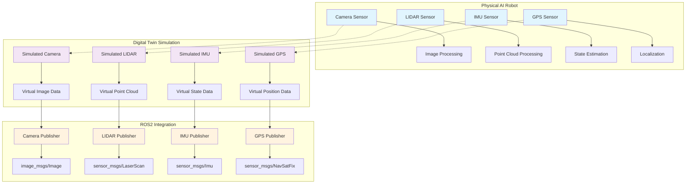

import ExerciseBlock from '@site/src/components/Learning/ExerciseBlock';
import Quiz from '@site/src/components/Learning/Quiz';

# Chapter 13: Sensor Simulation - Digital Senses for Physical AI

## Introduction

In the physical world, robots rely on their sensory systems to perceive and interact with their environment. Just as humans use sight, hearing, touch, and other senses to navigate and understand the world, robots depend on sensors like cameras, LIDAR, IMUs, and GPS to gather information about their surroundings. In simulation environments, these sensors must be accurately modeled to create realistic training and testing conditions for Physical AI systems.

Sensor simulation is the cornerstone of effective digital twin technology. Without realistic sensor data, the gap between simulation and reality becomes insurmountable, limiting the effectiveness of transfer learning and real-world deployment. This chapter explores the principles of sensor simulation, realistic noise modeling, and integration with ROS2 systems.

## Learning Objectives

By the end of this chapter, you will be able to:

1. Understand the fundamental sensor types used in robotics and their simulation requirements
2. Model realistic sensor noise and uncertainty in simulation environments
3. Configure camera, LIDAR, IMU, and GPS sensors in Gazebo with ROS2 integration
4. Implement sensor fusion techniques in simulated environments
5. Evaluate the accuracy and realism of simulated sensor data
6. Bridge the sim-to-real gap through proper sensor calibration and modeling

## Hook: The Digital Senses Challenge

Consider a humanoid robot learning to walk through a forest. Its camera sensors must detect obstacles like fallen logs and low-hanging branches. Its LIDAR system needs to map the three-dimensional space between trees. Its IMU must sense orientation changes as it navigates uneven terrain. And its GPS provides location context for navigation. Now imagine training this robot in simulation - every sensor reading must be as realistic as possible, or the robot will fail when deployed in the real world. The challenge of sensor simulation lies in creating digital senses that behave identically to their physical counterparts, complete with realistic noise, latency, and environmental interactions.

## Concept: Understanding Sensor Simulation Fundamentals

### The Sensory Foundation of Robotics

Robots operate in the physical world through a combination of perception, decision-making, and action. The perception layer is built upon sensor data that provides the robot with information about its internal state and external environment. In simulation, we must recreate these sensing capabilities with sufficient fidelity to support meaningful training and testing.

#### Types of Sensors in Robotics

**Proprioceptive Sensors**: These sensors measure internal robot state, including joint encoders, motor current sensors, and force/torque sensors. They provide information about the robot's configuration and internal forces.

**Exteroceptive Sensors**: These sensors measure the external environment, including cameras, LIDAR, sonar, radar, and GPS. They enable the robot to perceive its surroundings.

**Inertial Sensors**: IMUs (Inertial Measurement Units) combine accelerometers, gyroscopes, and sometimes magnetometers to measure motion, orientation, and gravitational fields.

### Camera Simulation

Camera sensors are among the most computationally intensive to simulate accurately. They must model optical properties, lens distortion, exposure effects, and realistic noise patterns. Modern simulation engines like Gazebo support various camera types:

- **RGB Cameras**: Standard color cameras that capture visual information
- **Depth Cameras**: Provide depth information alongside RGB data
- **Stereo Cameras**: Use two cameras to compute depth through triangulation
- **Fish-eye Cameras**: Wide-angle lenses with significant distortion

Camera simulation must account for:
- Lens distortion coefficients
- Exposure and gain settings
- Noise models (Gaussian, Poisson, thermal)
- Frame rate limitations
- Rolling shutter effects

### LIDAR Simulation

Light Detection and Ranging (LIDAR) sensors emit laser pulses and measure the time-of-flight to determine distances to objects. LIDAR simulation must accurately model:

- Angular resolution and field of view
- Range limitations and accuracy
- Multi-return capabilities for transparent or reflective surfaces
- Scan patterns (horizontal, vertical, solid-state)
- Noise characteristics and false positive rates

### IMU Simulation

Inertial Measurement Units provide crucial data for robot localization and control. IMU simulation must model:

- Accelerometer bias, scale factor, and noise
- Gyroscope bias, scale factor, and drift
- Magnetometer disturbances (if present)
- Temperature effects on sensor performance
- Cross-axis sensitivity and mounting misalignments

### GPS Simulation

Global Positioning System sensors provide absolute position references. GPS simulation includes:

- Position accuracy based on satellite geometry
- Multipath effects in urban environments
- Signal occlusion by buildings or terrain
- Time synchronization with other sensors
- Altitude and velocity measurements

## Mermaid Diagram: Sensor Simulation Architecture



## Code Example: Implementing Sensor Simulation in ROS2/Gazebo

Let's implement a comprehensive sensor simulation setup that demonstrates camera, LIDAR, IMU, and GPS sensors integrated with ROS2:

```xml
<!-- robot_with_sensors.urdf.xacro -->
<?xml version="1.0"?>
<robot xmlns:xacro="http://www.ros.org/wiki/xacro" name="sensor_robot">

  <!-- Base link -->
  <link name="base_link">
    <visual>
      <geometry>
        <box size="0.5 0.3 0.2"/>
      </geometry>
      <material name="blue">
        <color rgba="0 0 1 0.8"/>
      </material>
    </visual>
    <collision>
      <geometry>
        <box size="0.5 0.3 0.2"/>
      </geometry>
    </collision>
    <inertial>
      <mass value="1.0"/>
      <inertia ixx="0.1" ixy="0" ixz="0" iyy="0.1" iyz="0" izz="0.1"/>
    </inertial>
  </link>

  <!-- Camera sensor -->
  <gazebo reference="camera_link">
    <sensor type="camera" name="camera_sensor">
      <update_rate>30</update_rate>
      <camera name="head_camera">
        <horizontal_fov>1.3962634</horizontal_fov> <!-- 80 degrees -->
        <image>
          <width>640</width>
          <height>480</height>
          <format>R8G8B8</format>
        </image>
        <clip>
          <near>0.1</near>
          <far>10.0</far>
        </clip>
        <noise>
          <type>gaussian</type>
          <mean>0.0</mean>
          <stddev>0.007</stddev>
        </noise>
      </camera>
      <plugin name="camera_controller" filename="libgazebo_ros_camera.so">
        <frame_name>camera_optical_frame</frame_name>
        <min_depth>0.1</min_depth>
        <max_depth>10.0</max_depth>
        <update_rate>30</update_rate>
        <hack_baseline>0.07</hack_baseline>
        <distortion_k1>0.0</distortion_k1>
        <distortion_k2>0.0</distortion_k2>
        <distortion_k3>0.0</distortion_k3>
        <distortion_t1>0.0</distortion_t1>
        <distortion_t2>0.0</distortion_t2>
      </plugin>
    </sensor>
  </gazebo>

  <!-- LIDAR sensor -->
  <gazebo reference="lidar_link">
    <sensor type="ray" name="lidar_sensor">
      <pose>0 0 0.1 0 0 0</pose>
      <ray>
        <scan>
          <horizontal>
            <samples>360</samples>
            <resolution>1</resolution>
            <min_angle>-3.14159</min_angle>
            <max_angle>3.14159</max_angle>
          </horizontal>
        </scan>
        <range>
          <min>0.1</min>
          <max>10.0</max>
          <resolution>0.01</resolution>
        </range>
      </ray>
      <plugin name="lidar_controller" filename="libgazebo_ros_laser.so">
        <topic_name>scan</topic_name>
        <frame_name>lidar_link</frame_name>
        <min_range>0.1</min_range>
        <max_range>10.0</max_range>
        <update_rate>10</update_rate>
      </plugin>
    </sensor>
  </gazebo>

  <!-- IMU sensor -->
  <gazebo reference="imu_link">
    <sensor type="imu" name="imu_sensor">
      <always_on>1</always_on>
      <update_rate>100</update_rate>
      <imu>
        <angular_velocity>
          <x>
            <noise type="gaussian">
              <mean>0.0</mean>
              <stddev>2e-4</stddev>
              <bias_mean>0.0000075</bias_mean>
              <bias_stddev>0.0000008</bias_stddev>
            </noise>
          </x>
          <y>
            <noise type="gaussian">
              <mean>0.0</mean>
              <stddev>2e-4</stddev>
              <bias_mean>0.0000075</bias_mean>
              <bias_stddev>0.0000008</bias_stddev>
            </noise>
          </y>
          <z>
            <noise type="gaussian">
              <mean>0.0</mean>
              <stddev>2e-4</stddev>
              <bias_mean>0.0000075</bias_mean>
              <bias_stddev>0.0000008</bias_stddev>
            </noise>
          </z>
        </angular_velocity>
        <linear_acceleration>
          <x>
            <noise type="gaussian">
              <mean>0.0</mean>
              <stddev>1.7e-2</stddev>
              <bias_mean>0.1</bias_mean>
              <bias_stddev>0.001</bias_stddev>
            </noise>
          </x>
          <y>
            <noise type="gaussian">
              <mean>0.0</mean>
              <stddev>1.7e-2</stddev>
              <bias_mean>0.1</bias_mean>
              <bias_stddev>0.001</bias_stddev>
            </noise>
          </y>
          <z>
            <noise type="gaussian">
              <mean>0.0</mean>
              <stddev>1.7e-2</stddev>
              <bias_mean>0.1</bias_mean>
              <bias_stddev>0.001</bias_stddev>
            </noise>
          </z>
        </linear_acceleration>
      </imu>
      <plugin name="imu_controller" filename="libgazebo_ros_imu.so">
        <topicName>imu/data</topicName>
        <serviceName>imu/service</serviceName>
        <gaussianNoise>0.0</gaussianNoise>
        <updateRateHZ>100</updateRateHZ>
        <bodyName>imu_link</bodyName>
        <frameName>imu_link</frameName>
        <initialOrientationAsReference>false</initialOrientationAsReference>
        <xyzOffset>0 0 0</xyzOffset>
        <rpyOffset>0 0 0</rpyOffset>
        <gravityDirZ>0 0 1</gravityDirZ>
      </plugin>
    </sensor>
  </gazebo>

  <!-- GPS sensor -->
  <gazebo reference="gps_link">
    <sensor type="gps" name="gps_sensor">
      <always_on>1</always_on>
      <update_rate>1</update_rate>
      <plugin name="gps_controller" filename="libgazebo_ros_gps.so">
        <topicName>fix</topicName>
        <frameName>gps_link</frameName>
        <updateRate>1</updateRate>
        <velocityTopicName>vel</velocityTopicName>
        <serviceName>gps/set_pose</serviceName>
        <gaussianNoise>0.1</gaussianNoise>
        <velocityGaussianNoise>0.1</velocityGaussianNoise>
      </plugin>
    </sensor>
  </gazebo>

</robot>
```

Now let's create a ROS2 node that processes and fuses sensor data from our simulated sensors:

```python
#!/usr/bin/env python3
"""
Sensor Fusion Node for Processing Simulated Sensor Data
This node subscribes to camera, LIDAR, IMU, and GPS data from simulation,
processes the data, and demonstrates sensor fusion techniques.
"""

import rclpy
from rclpy.node import Node
from sensor_msgs.msg import Image, LaserScan, Imu, NavSatFix
from nav_msgs.msg import Odometry
from geometry_msgs.msg import Pose, Twist, TransformStamped
from cv_bridge import CvBridge
import numpy as np
import cv2
from tf2_ros import TransformBroadcaster
import tf_transformations

class SensorFusionNode(Node):
    def __init__(self):
        super().__init__('sensor_fusion_node')

        # Initialize sensor data storage
        self.camera_data = None
        self.lidar_data = None
        self.imu_data = None
        self.gps_data = None

        # Initialize sensor fusion state
        self.robot_pose = Pose()
        self.robot_twist = Twist()

        # Initialize CV bridge for image processing
        self.cv_bridge = CvBridge()

        # Create subscribers for all sensor types
        self.camera_sub = self.create_subscription(
            Image,
            '/camera/image_raw',
            self.camera_callback,
            10
        )

        self.lidar_sub = self.create_subscription(
            LaserScan,
            '/scan',
            self.lidar_callback,
            10
        )

        self.imu_sub = self.create_subscription(
            Imu,
            '/imu/data',
            self.imu_callback,
            10
        )

        self.gps_sub = self.create_subscription(
            NavSatFix,
            '/fix',
            self.gps_callback,
            10
        )

        # Create publisher for fused state estimate
        self.odom_pub = self.create_publisher(Odometry, '/fused_odom', 10)

        # Create transform broadcaster for visualization
        self.tf_broadcaster = TransformBroadcaster(self)

        # Timer for sensor fusion updates
        self.fusion_timer = self.create_timer(0.05, self.perform_sensor_fusion)

        self.get_logger().info('Sensor Fusion Node initialized')

    def camera_callback(self, msg):
        """Process camera data from simulation"""
        try:
            # Convert ROS Image message to OpenCV format
            cv_image = self.cv_bridge.imgmsg_to_cv2(msg, desired_encoding='bgr8')

            # Perform basic computer vision processing
            gray = cv2.cvtColor(cv_image, cv2.COLOR_BGR2GRAY)

            # Detect edges for obstacle detection
            edges = cv2.Canny(gray, 50, 150)

            # Store processed camera data
            self.camera_data = {
                'image': cv_image,
                'edges': edges,
                'timestamp': msg.header.stamp
            }

        except Exception as e:
            self.get_logger().error(f'Error processing camera data: {str(e)}')

    def lidar_callback(self, msg):
        """Process LIDAR data from simulation"""
        try:
            # Process LIDAR scan data
            ranges = np.array(msg.ranges)

            # Filter out invalid range values (inf, nan)
            valid_ranges = ranges[np.isfinite(ranges)]

            # Calculate distance statistics
            if len(valid_ranges) > 0:
                min_distance = np.min(valid_ranges)
                max_distance = np.max(valid_ranges)

                # Detect obstacles (objects closer than 1 meter)
                obstacles = valid_ranges[valid_ranges < 1.0]
                obstacle_count = len(obstacles)

                self.lidar_data = {
                    'ranges': ranges,
                    'min_distance': min_distance,
                    'max_distance': max_distance,
                    'obstacle_count': obstacle_count,
                    'timestamp': msg.header.stamp
                }

        except Exception as e:
            self.get_logger().error(f'Error processing LIDAR data: {str(e)}')

    def imu_callback(self, msg):
        """Process IMU data from simulation"""
        try:
            # Extract orientation and angular velocity from IMU
            orientation = [
                msg.orientation.x,
                msg.orientation.y,
                msg.orientation.z,
                msg.orientation.w
            ]

            angular_velocity = [
                msg.angular_velocity.x,
                msg.angular_velocity.y,
                msg.angular_velocity.z
            ]

            linear_acceleration = [
                msg.linear_acceleration.x,
                msg.linear_acceleration.y,
                msg.linear_acceleration.z
            ]

            # Store IMU data
            self.imu_data = {
                'orientation': orientation,
                'angular_velocity': angular_velocity,
                'linear_acceleration': linear_acceleration,
                'timestamp': msg.header.stamp
            }

            # Update robot pose based on IMU data
            self.robot_pose.orientation = msg.orientation

        except Exception as e:
            self.get_logger().error(f'Error processing IMU data: {str(e)}')

    def gps_callback(self, msg):
        """Process GPS data from simulation"""
        try:
            # Extract GPS coordinates
            latitude = msg.latitude
            longitude = msg.longitude
            altitude = msg.altitude

            # Store GPS data
            self.gps_data = {
                'latitude': latitude,
                'longitude': longitude,
                'altitude': altitude,
                'position_covariance': msg.position_covariance,
                'timestamp': msg.header.stamp
            }

        except Exception as e:
            self.get_logger().error(f'Error processing GPS data: {str(e)}')

    def perform_sensor_fusion(self):
        """Perform sensor fusion to estimate robot state"""
        try:
            # Check if we have data from all sensors
            if not all([self.imu_data, self.gps_data]):
                return

            # Simple sensor fusion algorithm
            # Combine IMU orientation with GPS position

            # Use IMU for orientation
            self.robot_pose.orientation = self.imu_data['orientation']

            # Use GPS for position (with some smoothing)
            if hasattr(self, 'last_gps_position'):
                # Simple moving average to smooth GPS data
                alpha = 0.1
                self.robot_pose.position.x = (
                    alpha * self.gps_data['latitude'] +
                    (1 - alpha) * self.last_gps_position[0]
                )
                self.robot_pose.position.y = (
                    alpha * self.gps_data['longitude'] +
                    (1 - alpha) * self.last_gps_position[1]
                )
                self.robot_pose.position.z = (
                    alpha * self.gps_data['altitude'] +
                    (1 - alpha) * self.last_gps_position[2]
                )
            else:
                # Initialize with first GPS reading
                self.robot_pose.position.x = self.gps_data['latitude']
                self.robot_pose.position.y = self.gps_data['longitude']
                self.robot_pose.position.z = self.gps_data['altitude']

            self.last_gps_position = [
                self.gps_data['latitude'],
                self.gps_data['longitude'],
                self.gps_data['altitude']
            ]

            # Publish fused odometry
            odom_msg = Odometry()
            odom_msg.header.stamp = self.get_clock().now().to_msg()
            odom_msg.header.frame_id = 'odom'
            odom_msg.child_frame_id = 'base_link'
            odom_msg.pose.pose = self.robot_pose
            odom_msg.twist.twist = self.robot_twist

            # Add covariance based on sensor confidence
            # IMU typically has good orientation accuracy
            # GPS has good position accuracy but with some noise
            covariance = np.zeros(36)
            covariance[0] = 0.1  # x position variance
            covariance[7] = 0.1  # y position variance
            covariance[14] = 0.1  # z position variance
            covariance[21] = 0.01  # x rotation variance
            covariance[28] = 0.01  # y rotation variance
            covariance[35] = 0.01  # z rotation variance
            odom_msg.pose.covariance = covariance.flatten()

            self.odom_pub.publish(odom_msg)

            # Broadcast transform for visualization
            self.broadcast_transform(odom_msg)

            self.get_logger().debug('Published fused odometry')

        except Exception as e:
            self.get_logger().error(f'Error in sensor fusion: {str(e)}')

    def broadcast_transform(self, odom_msg):
        """Broadcast transform for visualization in RViz"""
        t = TransformStamped()
        t.header.stamp = odom_msg.header.stamp
        t.header.frame_id = odom_msg.header.frame_id
        t.child_frame_id = odom_msg.child_frame_id
        t.transform.translation.x = odom_msg.pose.pose.position.x
        t.transform.translation.y = odom_msg.pose.pose.position.y
        t.transform.translation.z = odom_msg.pose.pose.position.z
        t.transform.rotation = odom_msg.pose.pose.orientation

        self.tf_broadcaster.sendTransform(t)

def main(args=None):
    rclpy.init(args=args)
    sensor_fusion_node = SensorFusionNode()

    try:
        rclpy.spin(sensor_fusion_node)
    except KeyboardInterrupt:
        pass
    finally:
        sensor_fusion_node.destroy_node()
        rclpy.shutdown()

if __name__ == '__main__':
    main()
```

And here's a launch file to bring up the complete sensor simulation system:

```xml
<!-- sensor_simulation.launch.py -->
import os
from launch import LaunchDescription
from launch.actions import DeclareLaunchArgument, IncludeLaunchDescription
from launch.substitutions import LaunchConfiguration
from launch.launch_description_sources import PythonLaunchDescriptionSource
from launch_ros.actions import Node
from ament_index_python.packages import get_package_share_directory

def generate_launch_description():
    pkg_gazebo_ros = get_package_share_directory('gazebo_ros')
    pkg_sensor_simulation = get_package_share_directory('sensor_simulation')

    # World file argument
    world = LaunchConfiguration('world')
    world_arg = DeclareLaunchArgument(
        'world',
        default_value=os.path.join(pkg_sensor_simulation, 'worlds', 'simple_room.world'),
        description='SDF world file'
    )

    # Launch Gazebo
    gazebo = IncludeLaunchDescription(
        PythonLaunchDescriptionSource(
            os.path.join(pkg_gazebo_ros, 'launch', 'gazebo.launch.py')
        ),
        launch_arguments={
            'world': world,
            'verbose': 'false',
        }.items()
    )

    # Spawn robot in Gazebo
    spawn_entity = Node(
        package='gazebo_ros',
        executable='spawn_entity.py',
        arguments=[
            '-topic', 'robot_description',
            '-entity', 'sensor_robot',
            '-x', '0.0',
            '-y', '0.0',
            '-z', '0.5'
        ],
        output='screen'
    )

    # Load robot description
    robot_state_publisher = Node(
        package='robot_state_publisher',
        executable='robot_state_publisher',
        name='robot_state_publisher',
        output='both',
        parameters=[{
            'use_sim_time': True,
            'robot_description': '''
                <?xml version="1.0"?>
                <robot xmlns:xacro="http://www.ros.org/wiki/xacro" name="sensor_robot">
                    <!-- Include the sensor robot URDF -->
                    <link name="base_link">
                        <visual>
                            <geometry>
                                <box size="0.5 0.3 0.2"/>
                            </geometry>
                            <material name="blue">
                                <color rgba="0 0 1 0.8"/>
                            </material>
                        </visual>
                        <collision>
                            <geometry>
                                <box size="0.5 0.3 0.2"/>
                            </geometry>
                        </collision>
                        <inertial>
                            <mass value="1.0"/>
                            <inertia ixx="0.1" ixy="0" ixz="0" iyy="0.1" iyz="0" izz="0.1"/>
                        </inertial>
                    </link>

                    <joint name="camera_joint" type="fixed">
                        <parent link="base_link"/>
                        <child link="camera_link"/>
                        <origin xyz="0.2 0 0.1" rpy="0 0 0"/>
                    </joint>

                    <link name="camera_link"/>

                    <joint name="lidar_joint" type="fixed">
                        <parent link="base_link"/>
                        <child link="lidar_link"/>
                        <origin xyz="0.1 0 0.2" rpy="0 0 0"/>
                    </joint>

                    <link name="lidar_link"/>

                    <joint name="imu_joint" type="fixed">
                        <parent link="base_link"/>
                        <child link="imu_link"/>
                        <origin xyz="0 0 0" rpy="0 0 0"/>
                    </joint>

                    <link name="imu_link"/>

                    <joint name="gps_joint" type="fixed">
                        <parent link="base_link"/>
                        <child link="gps_link"/>
                        <origin xyz="0 0 0.3" rpy="0 0 0"/>
                    </joint>

                    <link name="gps_link"/>
                </robot>
            '''
        }]
    )

    # Launch sensor fusion node
    sensor_fusion_node = Node(
        package='sensor_simulation',
        executable='sensor_fusion_node',
        name='sensor_fusion_node',
        output='screen',
        parameters=[
            {'use_sim_time': True}
        ]
    )

    # Launch RViz for visualization
    rviz_config = os.path.join(pkg_sensor_simulation, 'rviz', 'sensor_simulation.rviz')
    rviz = Node(
        package='rviz2',
        executable='rviz2',
        name='rviz2',
        arguments=['-d', rviz_config],
        parameters=[
            {'use_sim_time': True}
        ],
        output='screen'
    )

    return LaunchDescription([
        world_arg,
        gazebo,
        spawn_entity,
        robot_state_publisher,
        sensor_fusion_node,
        rviz
    ])
```

## Exercises

<ExerciseBlock
  content="**Exercise 1: Sensor Noise Analysis**
Analyze the noise characteristics of different simulated sensors by collecting data over time and calculating statistical measures (mean, standard deviation, bias). Compare the simulated noise to real sensor specifications and evaluate the realism of the simulation."
/>

<ExerciseBlock
  content="**Exercise 2: Sensor Fusion Implementation**
Extend the sensor fusion node to implement a more sophisticated fusion algorithm, such as a Kalman filter or particle filter, that combines data from multiple sensors to improve state estimation accuracy."
/>

<ExerciseBlock
  content="**Exercise 3: Environmental Effects Modeling**
Modify the sensor simulation to include environmental effects such as rain, fog, or lighting changes that affect sensor performance. Implement realistic degradation models for different weather conditions."
/>

<ExerciseBlock
  content="**Exercise 4: Multi-Robot Sensor Coordination**
Design and implement a system where multiple robots share sensor data to improve collective perception. Consider challenges like data association, communication delays, and coordinate frame alignment."
/>

## Summary

This chapter explored the critical role of sensor simulation in creating effective digital twins for Physical AI systems. We covered:

- The fundamental types of sensors used in robotics: cameras, LIDAR, IMU, and GPS
- Techniques for modeling realistic sensor noise and uncertainty
- Configuration of sensors in Gazebo with ROS2 integration
- Implementation of sensor fusion algorithms to combine multiple sensor inputs
- Evaluation methods for assessing sensor simulation quality

Accurate sensor simulation is essential for bridging the sim-to-real gap. By carefully modeling sensor characteristics, noise patterns, and environmental effects, we can create digital twins that provide meaningful training and testing environments for Physical AI systems.

## Quiz

<Quiz
  question="Which of the following is NOT a consideration when simulating camera sensors?"
  options={[
    "Lens distortion coefficients",
    "Frame rate limitations",
    "Rolling shutter effects",
    "Magnetic field interference"
  ]}
  answer={3}
  explanation="Magnetic field interference is a concern for magnetometers and IMUs, but not for camera sensors. Cameras are affected by optical properties, exposure settings, and noise patterns."
/>

<Quiz
  question="What is the primary purpose of sensor fusion in robotics?"
  options={[
    "To reduce the computational load on individual sensors",
    "To combine data from multiple sensors to improve state estimation",
    "To eliminate the need for redundant sensors",
    "To increase the sampling rate of individual sensors"
  ]}
  answer={1}
  explanation="Sensor fusion combines data from multiple sensors to improve the accuracy and reliability of state estimation, providing better perception than any single sensor alone."
/>

<Quiz
  question="Which sensor type is most affected by environmental conditions like rain or fog in simulation?"
  options={[
    "IMU sensors",
    "GPS sensors",
    "Camera and LIDAR sensors",
    "All sensors equally"
  ]}
  explanation="Camera and LIDAR sensors are most affected by environmental conditions like rain, fog, dust, or poor lighting, as these conditions can significantly degrade their performance and accuracy."
  answer={2}
/>

## Preview of Next Chapter

In Chapter 14: Unity Visualization, we'll explore how to create immersive 3D visualizations using Unity for enhanced digital twin experiences. We'll learn to integrate Unity with ROS2 for real-time visualization of robot states, sensor data, and simulation environments, providing intuitive interfaces for monitoring and controlling Physical AI systems.