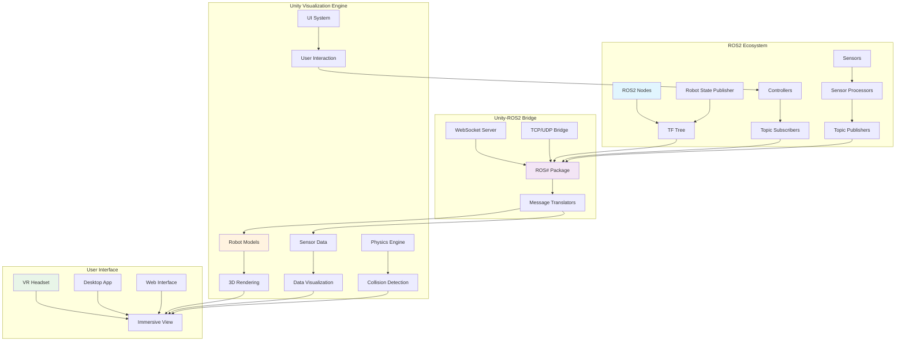

import ExerciseBlock from '@site/src/components/Learning/ExerciseBlock';
import Quiz from '@site/src/components/Learning/Quiz';

# Chapter 14: Unity Visualization - Immersive Digital Twins with Unity 3D

## Introduction

The digital twin concept reaches its full potential when we can visualize complex robotic systems in immersive, interactive 3D environments. Unity, the industry-leading game engine, provides powerful real-time rendering capabilities that can transform raw sensor data and robot states into intuitive, visually rich experiences. Unity visualization bridges the gap between abstract data and human understanding, enabling researchers and engineers to observe, analyze, and interact with their Physical AI systems in ways that traditional 2D interfaces cannot match.

Unity visualization for robotics goes beyond simple 3D rendering - it creates an immersive environment where robot behaviors, sensor data, and environmental interactions can be observed in real-time. This capability is crucial for debugging complex behaviors, validating simulation-to-reality transfer, and providing intuitive interfaces for robot teleoperation and monitoring.

## Learning Objectives

By the end of this chapter, you will be able to:

1. Understand Unity's architecture and its applications in robotics visualization
2. Set up Unity-ROS2 communication using ROS# or similar bridge solutions
3. Create 3D visualizations of robot states, trajectories, and sensor data
4. Implement real-time data streaming between ROS2 and Unity
5. Design intuitive user interfaces for robot monitoring and control in Unity
6. Optimize Unity scenes for real-time robotics visualization
7. Integrate physics simulation and collision detection in Unity for robotics

## Hook: The Immersive Robotics Revolution

Imagine stepping into a virtual environment where you can walk alongside your humanoid robot as it navigates a complex terrain. You can see exactly what its cameras see, observe its decision-making process through highlighted pathways, and watch as its LIDAR points paint a real-time map of the environment. With Unity visualization, this immersive experience becomes reality. Rather than staring at terminal outputs, RViz displays, or 2D plots, researchers can experience their robots' perspectives firsthand, identifying issues that would be invisible in traditional interfaces. This chapter reveals how Unity transforms robotics from abstract data into intuitive, immersive experiences.

## Concept: Unity in Robotics Visualization

### The Power of Immersive Visualization

Unity's real-time rendering capabilities, combined with its flexible scripting environment, make it an ideal platform for robotics visualization. Unlike traditional visualization tools, Unity provides:

- **Photorealistic rendering**: High-quality graphics that closely match real-world appearance
- **Immersive interfaces**: Support for VR/AR headsets for first-person robot experiences
- **Interactive environments**: Real-time manipulation and scenario testing
- **Multi-sensory feedback**: Integration of visual, audio, and haptic feedback
- **Scalable architectures**: Support for complex multi-robot systems and large environments

### Unity-ROS2 Integration Architecture

The integration between Unity and ROS2 typically involves a communication bridge that translates messages between ROS2 topics/services and Unity's internal messaging system. Common approaches include:

**ROS# (ROS Sharp)**: A popular Unity package that provides native ROS connectivity, allowing Unity to act as a ROS node with publishers, subscribers, services, and actions.

**WebSocket/HTTP Bridges**: Lightweight communication protocols that can work across networks and different platforms.

**Custom TCP/UDP Sockets**: Direct socket communication for high-performance, low-latency applications.

**ROS2 Web Bridge**: For web-based Unity applications that need ROS2 connectivity.

### Key Components of Unity Visualization Systems

**Robot Visualization**: 3D models of robots with accurate joint positions, visualized in real-time based on TF transforms and joint states.

**Sensor Visualization**: Real-time rendering of camera feeds, LIDAR point clouds, and other sensor data overlaid on the 3D environment.

**Trajectory Visualization**: Path planning results, robot trajectories, and future predictions displayed as animated curves or points.

**Environment Visualization**: Accurate 3D representations of the robot's operating environment, including obstacles, landmarks, and dynamic objects.

**Control Interfaces**: Intuitive UI elements that allow users to send commands, adjust parameters, and control robot behavior directly from the Unity interface.

### Performance Considerations

Unity visualization systems must balance visual fidelity with real-time performance. Key considerations include:

- **LOD (Level of Detail)**: Using simplified models when robots are far from the camera
- **Occlusion Culling**: Not rendering objects that are not visible to the camera
- **Texture Streaming**: Loading textures as needed rather than keeping all in memory
- **Dynamic Batching**: Combining similar objects for efficient rendering
- **Shader Optimization**: Using efficient shaders that don't consume excessive GPU resources

## Mermaid Diagram: Unity-ROS2 Integration Architecture



## Code Example: Unity-ROS2 Integration

Let's implement a Unity visualization system that connects to ROS2 and displays robot state information in real-time:

First, here's a C# script for Unity that connects to ROS2 and visualizes robot data:

```csharp
// RobotVisualization.cs
using System.Collections;
using System.Collections.Generic;
using UnityEngine;
using ROS2;
using std_msgs;
using sensor_msgs;
using nav_msgs;
using geometry_msgs;

public class RobotVisualization : MonoBehaviour
{
    [Header("ROS Connection Settings")]
    public string rosMasterUri = "http://localhost:11311";
    public string robotNamespace = "/robot1";

    [Header("Robot Visualization")]
    public GameObject robotModel;
    public GameObject cameraFeedDisplay;
    public Material pathMaterial;
    public Material pointCloudMaterial;

    [Header("Sensor Visualization")]
    public LineRenderer pathRenderer;
    public PointCloudRenderer pointCloudRenderer;

    private ROS2Socket rosSocket;
    private List<Vector3> robotPath = new List<Vector3>();
    private List<Vector3> lidarPoints = new List<Vector3>();

    void Start()
    {
        // Initialize ROS2 connection
        ROS2UnitySettings settings = new ROS2UnitySettings();
        settings.DomainId = 0;
        ROS2CS.Init(settings);

        rosSocket = ROS2CS.GetSocket();

        // Subscribe to ROS2 topics
        SubscribeToTopics();

        // Initialize visualization components
        InitializeVisualization();
    }

    void SubscribeToTopics()
    {
        // Subscribe to robot pose (from odometry or localization)
        rosSocket.Subscribe<nav_msgs__Odometry>(robotNamespace + "/odom",
            msg => UpdateRobotPose(msg.pose.pose));

        // Subscribe to joint states
        rosSocket.Subscribe<sensor_msgs__JointState>(robotNamespace + "/joint_states",
            msg => UpdateRobotJoints(msg));

        // Subscribe to camera feed
        rosSocket.Subscribe<sensor_msgs__Image>(robotNamespace + "/camera/image_raw",
            msg => UpdateCameraFeed(msg));

        // Subscribe to LIDAR scan
        rosSocket.Subscribe<sensor_msgs__LaserScan>(robotNamespace + "/scan",
            msg => UpdateLidarData(msg));

        // Subscribe to path planning results
        rosSocket.Subscribe<nav_msgs__Path>(robotNamespace + "/global_plan",
            msg => UpdatePathPlan(msg));
    }

    void UpdateRobotPose(Pose pose)
    {
        // Update robot position and orientation in Unity
        Vector3 unityPosition = RosToUnityPosition(pose.position);
        Quaternion unityRotation = RosToUnityRotation(pose.orientation);

        if (robotModel != null)
        {
            robotModel.transform.position = unityPosition;
            robotModel.transform.rotation = unityRotation;
        }

        // Add to path for visualization
        robotPath.Add(unityPosition);
        UpdatePathVisualization();
    }

    void UpdateRobotJoints(JointState msg)
    {
        // Update joint positions on the robot model
        if (robotModel != null)
        {
            for (int i = 0; i < msg.name.Count; i++)
            {
                string jointName = msg.name[i];
                float jointPosition = (float)msg.position[i];

                Transform jointTransform = robotModel.transform.Find(jointName);
                if (jointTransform != null)
                {
                    // Update joint rotation based on joint position
                    jointTransform.localRotation = Quaternion.Euler(0, jointPosition * Mathf.Rad2Deg, 0);
                }
            }
        }
    }

    void UpdateCameraFeed(Image msg)
    {
        // Convert ROS image to Unity texture and display
        if (cameraFeedDisplay != null)
        {
            // Convert image data to Texture2D
            Texture2D texture = new Texture2D((int)msg.width, (int)msg.height, TextureFormat.RGB24, false);

            // Note: In a real implementation, you'd need to properly convert the ROS image data
            // This is a simplified example
            Color32[] colors = new Color32[msg.data.Count];
            for (int i = 0; i < colors.Length; i += 3)
            {
                if (i + 2 < msg.data.Count)
                {
                    colors[i / 3] = new Color32(
                        msg.data[i],     // R
                        msg.data[i + 1], // G
                        msg.data[i + 2], // B
                        255              // A
                    );
                }
            }

            texture.SetPixels32(colors);
            texture.Apply();

            // Apply to material on camera display object
            cameraFeedDisplay.GetComponent<Renderer>().material.mainTexture = texture;
        }
    }

    void UpdateLidarData(LaserScan msg)
    {
        // Process LIDAR scan data and update point cloud visualization
        lidarPoints.Clear();

        float angle = msg.angle_min;
        for (int i = 0; i < msg.ranges.Count; i++)
        {
            float range = (float)msg.ranges[i];
            if (!float.IsNaN(range) && range < msg.range_max && range > msg.range_min)
            {
                // Calculate 2D point in LIDAR frame
                float x = range * Mathf.Cos(angle);
                float y = range * Mathf.Sin(angle);

                // Convert to Unity coordinate system
                Vector3 point = new Vector3(x, 0, y); // Unity Y is up, ROS Z is up

                // Transform to world coordinates based on robot position
                Vector3 worldPoint = robotModel.transform.TransformPoint(point);
                lidarPoints.Add(worldPoint);
            }

            angle += (float)msg.angle_increment;
        }

        UpdateLidarVisualization();
    }

    void UpdatePathPlan(Path msg)
    {
        // Update planned path visualization
        List<Vector3> pathPoints = new List<Vector3>();

        foreach (var pose in msg.poses)
        {
            Vector3 unityPos = RosToUnityPosition(pose.pose.position);
            pathPoints.Add(unityPos);
        }

        // Update line renderer with path points
        if (pathRenderer != null)
        {
            pathRenderer.positionCount = pathPoints.Count;
            pathRenderer.SetPositions(pathPoints.ToArray());
        }
    }

    void UpdatePathVisualization()
    {
        if (pathRenderer != null && robotPath.Count > 1)
        {
            pathRenderer.positionCount = robotPath.Count;
            pathRenderer.SetPositions(robotPath.ToArray());
        }
    }

    void UpdateLidarVisualization()
    {
        // Update point cloud renderer with current LIDAR data
        if (pointCloudRenderer != null)
        {
            pointCloudRenderer.UpdatePoints(lidarPoints);
        }
    }

    Vector3 RosToUnityPosition(geometry_msgs__Point rosPoint)
    {
        // Convert ROS coordinates (X forward, Y left, Z up) to Unity (X right, Y up, Z forward)
        return new Vector3((float)rosPoint.y, (float)rosPoint.z, (float)rosPoint.x);
    }

    Quaternion RosToUnityRotation(geometry_msgs__Quaternion rosQuat)
    {
        // Convert ROS quaternion to Unity quaternion
        Quaternion q = new Quaternion(
            (float)rosQuat.x,
            (float)rosQuat.y,
            (float)rosQuat.z,
            (float)rosQuat.w
        );

        // Apply coordinate system conversion
        // Unity uses left-handed coordinates, ROS uses right-handed
        return new Quaternion(q.x, q.y, -q.z, q.w);
    }

    void InitializeVisualization()
    {
        if (pathRenderer != null)
        {
            pathRenderer.material = pathMaterial;
            pathRenderer.startWidth = 0.1f;
            pathRenderer.endWidth = 0.1f;
        }
    }

    void OnDestroy()
    {
        if (rosSocket != null)
        {
            rosSocket.Dispose();
        }
        ROS2CS.Shutdown();
    }
}
```

Now let's create a Unity component for rendering point clouds from LIDAR data:

```csharp
// PointCloudRenderer.cs
using System.Collections.Generic;
using UnityEngine;

[RequireComponent(typeof(MeshFilter), typeof(MeshRenderer))]
public class PointCloudRenderer : MonoBehaviour
{
    [Header("Point Cloud Settings")]
    public float pointSize = 0.05f;
    public Color pointColor = Color.red;
    public int maxPoints = 10000;

    private MeshFilter meshFilter;
    private MeshRenderer meshRenderer;
    private List<Vector3> currentPoints = new List<Vector3>();
    private Material pointMaterial;

    void Start()
    {
        meshFilter = GetComponent<MeshFilter>();
        meshRenderer = GetComponent<MeshRenderer>();

        // Create a simple material for points
        pointMaterial = new Material(Shader.Find("Sprites/Default"));
        pointMaterial.color = pointColor;

        meshRenderer.material = pointMaterial;
    }

    public void UpdatePoints(List<Vector3> newPoints)
    {
        currentPoints.Clear();

        // Limit the number of points for performance
        int pointsToAdd = Mathf.Min(newPoints.Count, maxPoints);
        for (int i = 0; i < pointsToAdd; i++)
        {
            currentPoints.Add(newPoints[i]);
        }

        GeneratePointCloudMesh();
    }

    void GeneratePointCloudMesh()
    {
        if (currentPoints.Count == 0)
        {
            meshFilter.mesh = new Mesh();
            return;
        }

        // Create a mesh with vertices at each point position
        Mesh mesh = new Mesh();
        Vector3[] vertices = new Vector3[currentPoints.Count * 4];
        int[] triangles = new int[currentPoints.Count * 6];
        Vector2[] uv = new Vector2[currentPoints.Count * 4];

        for (int i = 0; i < currentPoints.Count; i++)
        {
            Vector3 center = currentPoints[i];

            // Create 4 vertices for a quad (billboard) at each point
            int vertexIndex = i * 4;
            vertices[vertexIndex] = center + new Vector3(-pointSize, -pointSize, 0);
            vertices[vertexIndex + 1] = center + new Vector3(pointSize, -pointSize, 0);
            vertices[vertexIndex + 2] = center + new Vector3(-pointSize, pointSize, 0);
            vertices[vertexIndex + 3] = center + new Vector3(pointSize, pointSize, 0);

            // UV coordinates
            uv[vertexIndex] = new Vector2(0, 0);
            uv[vertexIndex + 1] = new Vector2(1, 0);
            uv[vertexIndex + 2] = new Vector2(0, 1);
            uv[vertexIndex + 3] = new Vector2(1, 1);

            // Triangles (2 triangles per quad)
            int triangleIndex = i * 6;
            triangles[triangleIndex] = vertexIndex;
            triangles[triangleIndex + 1] = vertexIndex + 1;
            triangles[triangleIndex + 2] = vertexIndex + 2;
            triangles[triangleIndex + 3] = vertexIndex + 1;
            triangles[triangleIndex + 4] = vertexIndex + 3;
            triangles[triangleIndex + 5] = vertexIndex + 2;
        }

        mesh.vertices = vertices;
        mesh.triangles = triangles;
        mesh.uv = uv;
        mesh.RecalculateNormals();

        meshFilter.mesh = mesh;
    }
}
```

Now let's create a ROS2 node that publishes robot state data for Unity visualization:

```python
#!/usr/bin/env python3
"""
Unity Visualization Publisher Node
This node publishes robot state data in formats suitable for Unity visualization
"""

import rclpy
from rclpy.node import Node
from sensor_msgs.msg import JointState, Image, LaserScan
from nav_msgs.msg import Odometry, Path
from geometry_msgs.msg import PoseStamped
from std_msgs.msg import Header
import numpy as np
import math
from cv_bridge import CvBridge
import random

class UnityVisualizationPublisher(Node):
    def __init__(self):
        super().__init__('unity_visualization_publisher')

        # Initialize publishers
        self.odom_pub = self.create_publisher(Odometry, '/robot1/odom', 10)
        self.joint_pub = self.create_publisher(JointState, '/robot1/joint_states', 10)
        self.scan_pub = self.create_publisher(LaserScan, '/robot1/scan', 10)
        self.path_pub = self.create_publisher(Path, '/robot1/global_plan', 10)
        self.camera_pub = self.create_publisher(Image, '/robot1/camera/image_raw', 10)

        # Initialize CV bridge for camera simulation
        self.cv_bridge = CvBridge()

        # Robot state variables
        self.robot_x = 0.0
        self.robot_y = 0.0
        self.robot_theta = 0.0
        self.time_step = 0.1  # 10 Hz update rate

        # Create timer for periodic updates
        self.timer = self.create_timer(self.time_step, self.publish_robot_data)

        # Initialize path with some waypoints
        self.generate_path()

        self.get_logger().info('Unity Visualization Publisher initialized')

    def generate_path(self):
        """Generate a sample path for visualization"""
        self.path_points = []
        for i in range(20):
            x = i * 0.5  # Move 0.5m forward each step
            y = math.sin(i * 0.3) * 0.5  # Slight sine wave motion
            self.path_points.append((x, y))

    def publish_robot_data(self):
        """Publish all robot data for Unity visualization"""
        current_time = self.get_clock().now().to_msg()

        # Publish odometry
        self.publish_odometry(current_time)

        # Publish joint states (simulated)
        self.publish_joint_states(current_time)

        # Publish LIDAR scan (simulated environment)
        self.publish_lidar_scan(current_time)

        # Publish path plan
        self.publish_path_plan(current_time)

        # Publish camera image (simulated)
        self.publish_camera_image(current_time)

        # Update robot position for next iteration
        self.update_robot_position()

    def publish_odometry(self, stamp):
        """Publish odometry data"""
        odom_msg = Odometry()
        odom_msg.header.stamp = stamp
        odom_msg.header.frame_id = 'odom'
        odom_msg.child_frame_id = 'base_link'

        # Set position
        odom_msg.pose.pose.position.x = self.robot_x
        odom_msg.pose.pose.position.y = self.robot_y
        odom_msg.pose.pose.position.z = 0.0

        # Set orientation (2D rotation around Z axis)
        from math import sin, cos
        cy = cos(self.robot_theta * 0.5)
        sy = sin(self.robot_theta * 0.5)
        odom_msg.pose.pose.orientation.z = sy
        odom_msg.pose.pose.orientation.w = cy

        # Set velocities (for visualization)
        odom_msg.twist.twist.linear.x = 0.5  # Moving at 0.5 m/s
        odom_msg.twist.twist.angular.z = 0.1  # Turning at 0.1 rad/s

        self.odom_pub.publish(odom_msg)

    def publish_joint_states(self, stamp):
        """Publish joint state data"""
        joint_msg = JointState()
        joint_msg.header.stamp = stamp
        joint_msg.name = ['joint1', 'joint2', 'joint3']
        joint_msg.position = [0.0, 0.5, -0.3]  # Simulated joint positions
        joint_msg.velocity = [0.0, 0.0, 0.0]
        joint_msg.effort = [0.0, 0.0, 0.0]

        # Add some random movement to joints for visualization
        joint_msg.position[0] += 0.1 * math.sin(self.get_clock().now().nanoseconds * 1e-9)
        joint_msg.position[1] += 0.05 * math.cos(self.get_clock().now().nanoseconds * 1e-9 * 2)

        self.joint_pub.publish(joint_msg)

    def publish_lidar_scan(self, stamp):
        """Publish simulated LIDAR scan data"""
        scan_msg = LaserScan()
        scan_msg.header.stamp = stamp
        scan_msg.header.frame_id = 'laser_link'

        # LIDAR parameters
        scan_msg.angle_min = -math.pi
        scan_msg.angle_max = math.pi
        scan_msg.angle_increment = 0.01  # ~0.57 degrees
        scan_msg.time_increment = 0.0
        scan_msg.scan_time = 0.1
        scan_msg.range_min = 0.1
        scan_msg.range_max = 10.0

        # Calculate number of ranges
        num_ranges = int((scan_msg.angle_max - scan_msg.angle_min) / scan_msg.angle_increment) + 1

        # Generate simulated ranges with some obstacles
        ranges = []
        angle = scan_msg.angle_min
        for i in range(num_ranges):
            # Simulate environment with some obstacles
            simulated_range = 5.0  # Default distance

            # Add some obstacles in the environment
            if abs(angle) < 0.5:  # Front of robot
                # Simulate an obstacle ahead
                obstacle_distance = 2.0 + 0.5 * math.sin(angle * 5)
                simulated_range = min(simulated_range, obstacle_distance)

            # Add some noise to make it more realistic
            noise = random.uniform(-0.05, 0.05)
            ranges.append(simulated_range + noise)

            angle += scan_msg.angle_increment

        scan_msg.ranges = ranges
        scan_msg.intensities = [1.0] * len(ranges)  # All intensities same for simplicity

        self.scan_pub.publish(scan_msg)

    def publish_path_plan(self, stamp):
        """Publish path planning results"""
        path_msg = Path()
        path_msg.header.stamp = stamp
        path_msg.header.frame_id = 'odom'

        # Create path poses from our pre-generated points
        for point in self.path_points:
            pose_stamped = PoseStamped()
            pose_stamped.header.stamp = stamp
            pose_stamped.header.frame_id = 'odom'

            pose_stamped.pose.position.x = point[0]
            pose_stamped.pose.position.y = point[1]
            pose_stamped.pose.position.z = 0.0

            # Simple orientation pointing along the path
            if self.path_points.index(point) < len(self.path_points) - 1:
                next_point = self.path_points[self.path_points.index(point) + 1]
                dx = next_point[0] - point[0]
                dy = next_point[1] - point[1]
                yaw = math.atan2(dy, dx)

                from math import sin, cos
                cy = cos(yaw * 0.5)
                sy = sin(yaw * 0.5)
                pose_stamped.pose.orientation.z = sy
                pose_stamped.pose.orientation.w = cy
            else:
                # Use current robot orientation for last point
                cy = cos(self.robot_theta * 0.5)
                sy = sin(self.robot_theta * 0.5)
                pose_stamped.pose.orientation.z = sy
                pose_stamped.pose.orientation.w = cy

            path_msg.poses.append(pose_stamped)

        self.path_pub.publish(path_msg)

    def publish_camera_image(self, stamp):
        """Publish simulated camera image"""
        # Create a simulated image (320x240 RGB)
        import numpy as np
        height, width = 240, 320
        image_array = np.zeros((height, width, 3), dtype=np.uint8)

        # Create a simple simulated environment
        for y in range(height):
            for x in range(width):
                # Create gradient background
                image_array[y, x] = [
                    int(100 + 50 * (x / width)),  # Blue channel
                    int(150 + 50 * (y / height)),  # Green channel
                    int(200)  # Red channel
                ]

                # Add some simulated obstacles
                center_x, center_y = width // 2, height // 2
                distance = math.sqrt((x - center_x)**2 + (y - center_y)**2)
                if distance < 50:  # Circular obstacle
                    image_array[y, x] = [0, 0, 255]  # Red obstacle

        # Convert to ROS Image message
        image_msg = self.cv_bridge.cv2_to_imgmsg(image_array, encoding="rgb8")
        image_msg.header.stamp = stamp
        image_msg.header.frame_id = 'camera_link'

        self.camera_pub.publish(image_msg)

    def update_robot_position(self):
        """Update robot position based on simple motion model"""
        # Simple motion: move forward at constant velocity with slight turning
        linear_velocity = 0.5  # m/s
        angular_velocity = 0.1  # rad/s

        dt = self.time_step

        # Update position using simple kinematic model
        self.robot_x += linear_velocity * math.cos(self.robot_theta) * dt
        self.robot_y += linear_velocity * math.sin(self.robot_theta) * dt
        self.robot_theta += angular_velocity * dt

        # Keep robot in bounds for visualization
        self.robot_x = max(-10, min(10, self.robot_x))
        self.robot_y = max(-10, min(10, self.robot_y))

        # Keep theta in [-pi, pi]
        self.robot_theta = math.atan2(math.sin(self.robot_theta), math.cos(self.robot_theta))

def main(args=None):
    rclpy.init(args=args)
    unity_publisher = UnityVisualizationPublisher()

    try:
        rclpy.spin(unity_publisher)
    except KeyboardInterrupt:
        pass
    finally:
        unity_publisher.destroy_node()
        rclpy.shutdown()

if __name__ == '__main__':
    main()
```

## Exercises

<ExerciseBlock
  content="**Exercise 1: Enhanced Sensor Visualization**
Extend the Unity visualization to include additional sensor types such as IMU, GPS, or force/torque sensors. Create visual indicators that represent the sensor data in an intuitive way."
/>

<ExerciseBlock
  content="**Exercise 2: Multi-Robot Visualization**
Modify the Unity scene to visualize multiple robots simultaneously, each with different colors or identifiers. Implement a system for selecting and focusing on specific robots in the visualization."
/>

<ExerciseBlock
  content="**Exercise 3: VR Integration**
Add VR headset support to the Unity visualization, allowing users to experience the robot's environment from a first-person perspective. Implement teleportation or smooth locomotion for navigation."
/>

<ExerciseBlock
  content="**Exercise 4: Real-time Performance Optimization**
Implement Level of Detail (LOD) systems and occlusion culling to optimize the Unity visualization for large environments with many objects and robots."
/>

## Summary

This chapter explored the powerful capabilities of Unity for creating immersive digital twin visualizations in robotics. We covered:

- Unity's architecture and its advantages for robotics visualization
- Implementation of Unity-ROS2 communication bridges
- Real-time visualization of robot states, sensor data, and trajectories
- Techniques for optimizing Unity scenes for robotics applications
- Integration of multiple sensor types in a unified visualization environment

Unity visualization transforms abstract robot data into intuitive, immersive experiences that enhance understanding, debugging, and interaction with Physical AI systems. By creating photorealistic, interactive environments, Unity enables researchers and engineers to observe robot behaviors from new perspectives and identify issues that would be invisible in traditional interfaces.

## Quiz

<Quiz
  question="What is the primary advantage of Unity visualization over traditional ROS visualization tools like RViz?"
  options={[
    "Lower computational requirements",
    "Better integration with existing ROS packages",
    "Immersive 3D experiences with photorealistic rendering",
    "Simpler setup and configuration"
  ]}
  answer={2}
  explanation="Unity provides immersive 3D experiences with photorealistic rendering, VR/AR support, and interactive environments that go beyond the capabilities of traditional ROS visualization tools like RViz."
/>

<Quiz
  question="Which Unity component is commonly used to establish communication with ROS2?"
  options={[
    "ROS# (ROS Sharp)",
    "Unity Robotics Interface",
    "ROS Bridge",
    "All of the above"
  ]}
  answer={3}
  explanation="All of these are valid approaches for Unity-ROS2 communication: ROS# (ROS Sharp) is a popular Unity package, Unity Robotics Interface provides official support, and ROS Bridge enables communication via websockets."
/>

<Quiz
  question="What coordinate system conversion is typically needed when integrating ROS and Unity?"
  options={[
    "ROS uses right-handed, Unity uses left-handed coordinate systems",
    "ROS uses left-handed, Unity uses right-handed coordinate systems",
    "Both use the same coordinate system",
    "Coordinate system conversion is not necessary"
  ]}
  explanation="ROS uses a right-handed coordinate system (X forward, Y left, Z up) while Unity uses a left-handed coordinate system (X right, Y up, Z forward), requiring conversion between the systems."
  answer={0}
/>

## Preview of Next Chapter

In Chapter 15: Realistic Environments, we'll explore how to create highly realistic simulation environments that accurately model real-world physics, lighting, and environmental conditions. We'll learn to build detailed worlds with realistic materials, weather effects, and dynamic elements that provide the ultimate testing ground for Physical AI systems before real-world deployment.