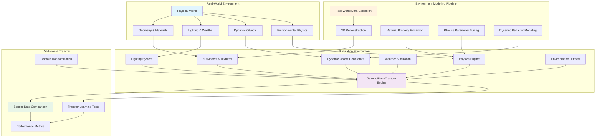

import ExerciseBlock from '@site/src/components/Learning/ExerciseBlock';
import Quiz from '@site/src/components/Learning/Quiz';

# Chapter 15: Realistic Environments - Creating Authentic Simulation Worlds

## Introduction

The ultimate goal of digital twin technology in robotics is to create simulation environments so realistic that skills learned in simulation transfer seamlessly to the real world. This requires more than just accurate robot models and sensor simulation - it demands environments that faithfully reproduce the physical, visual, and behavioral characteristics of real-world scenarios. Realistic environments are the missing piece that bridges the sim-to-real gap, enabling robots to learn and adapt in ways that translate directly to deployment in actual operational environments.

Creating authentic simulation worlds involves modeling not only static geometry but also dynamic environmental factors: lighting conditions that change throughout the day, weather patterns that affect sensor performance, material properties that influence robot interactions, and environmental dynamics that challenge robot perception and control systems. This chapter explores the principles and techniques for building simulation environments that provide the ultimate testing ground for Physical AI systems.

## Learning Objectives

By the end of this chapter, you will be able to:

1. Understand the principles of realistic environment modeling for effective sim-to-real transfer
2. Create detailed 3D environments with accurate physics properties and materials
3. Implement dynamic environmental conditions including weather, lighting, and time-of-day effects
4. Model realistic surface properties and material interactions for robot locomotion
5. Simulate environmental disturbances and challenges that robots encounter in reality
6. Validate environment realism through sensor data comparison and transfer learning experiments
7. Optimize environment complexity for computational efficiency without sacrificing realism

## Hook: The Sim-to-Real Challenge

Consider a delivery robot that has been trained to navigate urban environments in simulation. It performs flawlessly in the virtual world, avoiding obstacles, recognizing traffic patterns, and adapting to pedestrian flows. But when deployed in the real world, it struggles with subtle differences: the way shadows fall under real sunlight, the texture variations in actual pavement, the unpredictable reflections from wet surfaces after rain, and the complex interactions between wind and lightweight obstacles. The sim-to-real gap isn't just about robot models or sensor simulation - it's fundamentally about environment authenticity. This chapter reveals how to create simulation environments that close this gap by accurately reproducing the environmental conditions robots will encounter in the real world.

## Concept: Principles of Realistic Environment Modeling

### The Foundation of Authentic Simulation

Realistic environments must capture not only the geometric appearance of real-world scenes but also their physical properties, dynamic behaviors, and sensory characteristics. This requires a multi-layered approach that addresses:

**Visual Realism**: Accurate representation of colors, textures, lighting, and visual effects that match real-world conditions. This includes proper handling of shadows, reflections, refractions, and atmospheric effects that affect robot perception systems.

**Physical Realism**: Accurate modeling of material properties, friction coefficients, collision responses, and environmental physics that affect robot locomotion, manipulation, and interaction with objects.

**Dynamic Realism**: Simulation of environmental changes over time, including weather patterns, lighting transitions, seasonal variations, and the presence of dynamic obstacles or environmental disturbances.

**Sensory Realism**: Environments that produce realistic sensor data from cameras, LIDAR, and other sensors, matching the statistical properties and noise characteristics of real-world sensor readings.

### Material Properties and Surface Interactions

The surfaces that robots encounter in the real world have diverse properties that significantly impact robot behavior. Realistic environment modeling must account for:

**Friction Properties**: Different materials have varying coefficients of friction that affect robot traction, climbing ability, and stability. A robot designed to operate on both carpet and tile must experience different grip characteristics in simulation.

**Deformation Characteristics**: Soft surfaces like grass, sand, or foam behave differently under robot weight than rigid surfaces. Accurate modeling of surface deformation affects locomotion planning and control.

**Texture and Traction**: Surface textures affect both visual appearance and mechanical interaction. A robot's wheels or feet interact differently with smooth concrete versus rough asphalt, and these differences must be captured in simulation.

**Adherence and Sticking**: Some surfaces may cause objects to stick or adhere differently, affecting manipulation tasks. This is particularly important for robots with specialized gripping mechanisms.

### Environmental Physics Modeling

Realistic environments must accurately model the physical laws that govern environmental interactions:

**Fluid Dynamics**: For robots operating in or near water, accurate modeling of fluid resistance, buoyancy, and wave dynamics is essential. Even air resistance can affect lightweight robots or those with large surface areas.

**Thermal Effects**: Temperature variations affect battery performance, electronic components, and material properties. Thermal modeling becomes important for long-duration missions or robots operating in extreme environments.

**Electromagnetic Interference**: Real environments contain electromagnetic fields from various sources that can affect sensor performance and communication systems.

**Acoustic Properties**: Sound propagation in realistic environments affects acoustic sensors and provides important feedback for robots using audio information.

### Dynamic Environmental Factors

Real-world environments are not static - they change continuously due to various factors:

**Weather Systems**: Rain, snow, fog, and wind affect sensor performance, robot mobility, and environmental conditions. Rain can obscure camera vision, wet surfaces can affect traction, and wind can impact robot stability.

**Time-of-Day Variations**: Lighting conditions change dramatically throughout the day, affecting camera performance, shadow patterns, and visibility. These changes must be accurately modeled for robots that operate across different times.

**Seasonal Changes**: Vegetation growth, leaf fall, snow accumulation, and other seasonal changes alter the environment significantly. Robots designed for year-round operation must be tested under these varying conditions.

**Human and Animal Activity**: Real environments contain dynamic obstacles in the form of people, animals, and other moving objects. These must be modeled with realistic behaviors and patterns.

### Validation of Environment Realism

Creating realistic environments is only valuable if the simulation-to-reality transfer actually works. Validation approaches include:

**Sensor Data Comparison**: Comparing sensor readings from simulation with real-world data to ensure statistical similarity in noise patterns, dynamic ranges, and environmental effects.

**Transfer Learning Experiments**: Training robots in simulation and testing their performance on real robots to measure the actual sim-to-real transfer effectiveness.

**Domain Randomization**: Systematically varying environmental parameters to ensure robots learn robust behaviors that work across a range of conditions.

**A/B Testing**: Comparing robot performance in realistic vs. simplified environments to measure the impact of environmental fidelity on real-world performance.

## Mermaid Diagram: Realistic Environment Architecture



## Code Example: Creating Realistic Environments

Let's implement a system for creating and managing realistic environments with dynamic properties:

First, here's a Python script for generating realistic environment configurations:

```python
#!/usr/bin/env python3
"""
Realistic Environment Generator
This script creates realistic environment configurations with detailed materials,
dynamic properties, and environmental effects for robotics simulation.
"""

import xml.etree.ElementTree as ET
from dataclasses import dataclass
from typing import List, Dict, Tuple
import numpy as np
import math
import random
from datetime import datetime, timedelta

@dataclass
class MaterialProperties:
    """Represents physical properties of a material surface"""
    name: str
    friction_coefficient: float
    restitution: float  # Bounciness (0-1)
    texture_file: str
    color: Tuple[float, float, float]  # RGB values (0-1)
    roughness: float  # 0-1, affects grip and appearance
    thermal_conductivity: float  # W/(m·K)

@dataclass
class EnvironmentalEffect:
    """Represents dynamic environmental conditions"""
    name: str
    intensity_range: Tuple[float, float]
    duration_range: Tuple[float, float]  # seconds
    frequency: float  # events per hour
    sensor_impact: Dict[str, float]  # How it affects different sensors

class RealisticEnvironmentGenerator:
    def __init__(self):
        self.materials = self._initialize_materials()
        self.effects = self._initialize_effects()
        self.weather_patterns = self._initialize_weather_patterns()

    def _initialize_materials(self) -> Dict[str, MaterialProperties]:
        """Initialize common materials with realistic properties"""
        return {
            "concrete": MaterialProperties(
                name="concrete",
                friction_coefficient=0.8,
                restitution=0.1,
                texture_file="textures/concrete.png",
                color=(0.7, 0.7, 0.7),
                roughness=0.3,
                thermal_conductivity=1.4
            ),
            "grass": MaterialProperties(
                name="grass",
                friction_coefficient=0.6,
                restitution=0.05,
                texture_file="textures/grass.png",
                color=(0.2, 0.8, 0.2),
                roughness=0.7,
                thermal_conductivity=0.25
            ),
            "tile": MaterialProperties(
                name="tile",
                friction_coefficient=0.4,
                restitution=0.2,
                texture_file="textures/tile.png",
                color=(0.9, 0.9, 0.9),
                roughness=0.1,
                thermal_conductivity=1.3
            ),
            "carpet": MaterialProperties(
                name="carpet",
                friction_coefficient=0.9,
                restitution=0.02,
                texture_file="textures/carpet.png",
                color=(0.5, 0.3, 0.1),
                roughness=0.8,
                thermal_conductivity=0.15
            ),
            "sand": MaterialProperties(
                name="sand",
                friction_coefficient=0.7,
                restitution=0.01,
                texture_file="textures/sand.png",
                color=(0.8, 0.7, 0.4),
                roughness=0.9,
                thermal_conductivity=0.3
            )
        }

    def _initialize_effects(self) -> Dict[str, EnvironmentalEffect]:
        """Initialize environmental effects"""
        return {
            "rain": EnvironmentalEffect(
                name="rain",
                intensity_range=(0.1, 1.0),  # mm/hour
                duration_range=(600, 3600),  # 10 min to 1 hour
                frequency=0.5,  # 0.5 events per hour (every 2 hours)
                sensor_impact={
                    "camera": 0.3,  # Reduces camera clarity
                    "lidar": 0.1,   # Minor LIDAR interference
                    "gps": 0.05     # Minimal GPS impact
                }
            ),
            "fog": EnvironmentalEffect(
                name="fog",
                intensity_range=(0.01, 0.3),  # Density (0-1)
                duration_range=(1800, 7200),  # 30 min to 2 hours
                frequency=0.25,  # Every 4 hours
                sensor_impact={
                    "camera": 0.6,  # Significant visibility reduction
                    "lidar": 0.4,   # Moderate LIDAR interference
                    "gps": 0.0      # No GPS impact
                }
            ),
            "wind": EnvironmentalEffect(
                name="wind",
                intensity_range=(1.0, 20.0),  # m/s
                duration_range=(300, 1800),   # 5 min to 30 min
                frequency=2.0,  # Every 30 minutes
                sensor_impact={
                    "camera": 0.1,  # Minor dust/particle effects
                    "lidar": 0.05,  # Minimal impact
                    "imu": 0.2      # Affects stability measurements
                }
            )
        }

    def _initialize_weather_patterns(self) -> Dict[str, Dict]:
        """Initialize realistic weather patterns for different locations"""
        return {
            "urban": {
                "temperature_range": (5, 35),  # Celsius
                "humidity_range": (30, 80),    # Percent
                "pressure_range": (980, 1040), # hPa
                "seasonal_variation": {
                    "spring": {"rain_frequency": 0.3, "temp_multiplier": 1.0},
                    "summer": {"rain_frequency": 0.1, "temp_multiplier": 1.2},
                    "fall": {"rain_frequency": 0.4, "temp_multiplier": 0.9},
                    "winter": {"rain_frequency": 0.2, "temp_multiplier": 0.7}
                }
            },
            "desert": {
                "temperature_range": (10, 45),
                "humidity_range": (5, 30),
                "pressure_range": (990, 1030),
                "seasonal_variation": {
                    "spring": {"rain_frequency": 0.05, "temp_multiplier": 1.0},
                    "summer": {"rain_frequency": 0.02, "temp_multiplier": 1.3},
                    "fall": {"rain_frequency": 0.08, "temp_multiplier": 0.9},
                    "winter": {"rain_frequency": 0.1, "temp_multiplier": 0.7}
                }
            },
            "forest": {
                "temperature_range": (0, 30),
                "humidity_range": (60, 95),
                "pressure_range": (985, 1035),
                "seasonal_variation": {
                    "spring": {"rain_frequency": 0.5, "temp_multiplier": 1.0},
                    "summer": {"rain_frequency": 0.2, "temp_multiplier": 1.1},
                    "fall": {"rain_frequency": 0.6, "temp_multiplier": 0.8},
                    "winter": {"rain_frequency": 0.4, "temp_multiplier": 0.6}
                }
            }
        }

    def generate_environment_sdf(self,
                                environment_type: str,
                                size: Tuple[float, float] = (20.0, 20.0),
                                include_dynamic_objects: bool = True) -> str:
        """Generate SDF (Simulation Description Format) for a realistic environment"""

        # Create root SDF element
        sdf = ET.Element("sdf", version="1.7")
        world = ET.SubElement(sdf, "world", name=f"realistic_{environment_type}_world")

        # Add physics engine configuration
        physics = ET.SubElement(world, "physics", type="ode")
        ET.SubElement(physics, "max_step_size").text = "0.001"
        ET.SubElement(physics, "real_time_factor").text = "1"
        ET.SubElement(physics, "real_time_update_rate").text = "1000"

        # Add atmosphere
        atmosphere = ET.SubElement(world, "atmosphere", type="adiabatic")
        ET.SubElement(atmosphere, "temperature").text = "288.15"
        ET.SubElement(atmosphere, "pressure").text = "101325"

        # Add lighting
        self._add_lighting(world)

        # Add ground plane with realistic material
        self._add_ground_plane(world, environment_type, size)

        # Add static obstacles with various materials
        self._add_static_obstacles(world, environment_type, size)

        # Add dynamic objects if requested
        if include_dynamic_objects:
            self._add_dynamic_objects(world, environment_type, size)

        # Add environmental effects
        self._add_environmental_effects(world, environment_type)

        # Convert to string with proper formatting
        return ET.tostring(sdf, encoding='unicode')

    def _add_lighting(self, world):
        """Add realistic lighting configuration"""
        # Sun light (directional)
        sun = ET.SubElement(world, "light", type="directional", name="sun")
        ET.SubElement(sun, "cast_shadows").text = "true"
        ET.SubElement(sun, "pose").text = "0 0 10 0 0 0"

        direction = ET.SubElement(sun, "direction")
        ET.SubElement(direction, "x").text = "-0.3"
        ET.SubElement(direction, "y").text = "0.2"
        ET.SubElement(direction, "z").text = "-0.9"

        diffuse = ET.SubElement(sun, "diffuse")
        ET.SubElement(diffuse, "r").text = "0.8"
        ET.SubElement(diffuse, "g").text = "0.8"
        ET.SubElement(diffuse, "b").text = "0.8"
        ET.SubElement(diffuse, "a").text = "1"

        specular = ET.SubElement(sun, "specular")
        ET.SubElement(specular, "r").text = "0.2"
        ET.SubElement(specular, "g").text = "0.2"
        ET.SubElement(specular, "b").text = "0.2"
        ET.SubElement(specular, "a").text = "1"

    def _add_ground_plane(self, world, environment_type, size):
        """Add ground plane with appropriate material for environment type"""
        # Select appropriate material based on environment type
        material_map = {
            "urban": "concrete",
            "desert": "sand",
            "forest": "grass"
        }
        material_name = material_map.get(environment_type, "grass")
        material = self.materials[material_name]

        # Create ground plane
        ground = ET.SubElement(world, "model", name=f"{environment_type}_ground")
        ET.SubElement(ground, "static").text = "true"

        link = ET.SubElement(ground, "link", name="ground_link")

        # Visual
        visual = ET.SubElement(link, "visual", name="ground_visual")
        ET.SubElement(visual, "cast_shadows").text = "false"

        geometry = ET.SubElement(visual, "geometry")
        plane = ET.SubElement(geometry, "plane")
        size_elem = ET.SubElement(plane, "size")
        ET.SubElement(size_elem, "x").text = str(size[0])
        ET.SubElement(size_elem, "y").text = str(size[1])

        material_elem = ET.SubElement(visual, "material")
        script = ET.SubElement(material_elem, "script")
        ET.SubElement(script, "name").text = material.texture_file

        # Collision
        collision = ET.SubElement(link, "collision", name="ground_collision")
        ET.SubElement(collision, "surface", type="ode")

        collision_geom = ET.SubElement(collision, "geometry")
        collision_plane = ET.SubElement(collision_geom, "plane")
        collision_size = ET.SubElement(collision_plane, "size")
        ET.SubElement(collision_size, "x").text = str(size[0])
        ET.SubElement(collision_size, "y").text = str(size[1])

        # Surface properties
        surface = ET.SubElement(collision, "surface")
        friction = ET.SubElement(surface, "friction")
        ode_friction = ET.SubElement(friction, "ode")
        ET.SubElement(ode_friction, "mu").text = str(material.friction_coefficient)
        ET.SubElement(ode_friction, "mu2").text = str(material.friction_coefficient)

        bounce = ET.SubElement(surface, "bounce")
        ET.SubElement(bounce, "restitution_coefficient").text = str(material.restitution)

        # Position
        ET.SubElement(ground, "pose").text = f"0 0 0 0 0 0"

    def _add_static_obstacles(self, world, environment_type, size):
        """Add static obstacles with various materials"""
        num_obstacles = random.randint(5, 15)

        for i in range(num_obstacles):
            # Random position within environment bounds
            x = random.uniform(-size[0]/2 + 2, size[0]/2 - 2)
            y = random.uniform(-size[1]/2 + 2, size[1]/2 - 2)

            # Random obstacle type and material
            obstacle_types = ["box", "cylinder", "sphere"]
            obstacle_type = random.choice(obstacle_types)

            materials = list(self.materials.keys())
            material_name = random.choice(materials)
            material = self.materials[material_name]

            # Create obstacle model
            obstacle = ET.SubElement(world, "model", name=f"obstacle_{i}")
            ET.SubElement(obstacle, "static").text = "true"

            link = ET.SubElement(obstacle, "link", name=f"obstacle_{i}_link")

            # Visual
            visual = ET.SubElement(link, "visual", name=f"obstacle_{i}_visual")
            visual_geom = ET.SubElement(visual, "geometry")

            if obstacle_type == "box":
                box_geom = ET.SubElement(visual_geom, "box")
                size_elem = ET.SubElement(box_geom, "size")
                ET.SubElement(size_elem, "x").text = "0.5"
                ET.SubElement(size_elem, "y").text = "0.5"
                ET.SubElement(size_elem, "z").text = "1.0"
            elif obstacle_type == "cylinder":
                cyl_geom = ET.SubElement(visual_geom, "cylinder")
                ET.SubElement(cyl_geom, "radius").text = "0.3"
                ET.SubElement(cyl_geom, "length").text = "1.0"
            else:  # sphere
                sph_geom = ET.SubElement(visual_geom, "sphere")
                ET.SubElement(sph_geom, "radius").text = "0.4"

            # Material
            visual_material = ET.SubElement(visual, "material")
            script = ET.SubElement(visual_material, "script")
            ET.SubElement(script, "name").text = material.texture_file

            # Collision
            collision = ET.SubElement(link, "collision", name=f"obstacle_{i}_collision")
            collision_geom = ET.SubElement(collision, "geometry")

            if obstacle_type == "box":
                box_coll = ET.SubElement(collision_geom, "box")
                coll_size = ET.SubElement(box_coll, "size")
                ET.SubElement(coll_size, "x").text = "0.5"
                ET.SubElement(coll_size, "y").text = "0.5"
                ET.SubElement(coll_size, "z").text = "1.0"
            elif obstacle_type == "cylinder":
                cyl_coll = ET.SubElement(collision_geom, "cylinder")
                ET.SubElement(cyl_coll, "radius").text = "0.3"
                ET.SubElement(cyl_coll, "length").text = "1.0"
            else:  # sphere
                sph_coll = ET.SubElement(collision_geom, "sphere")
                ET.SubElement(sph_coll, "radius").text = "0.4"

            # Surface properties
            surface = ET.SubElement(collision, "surface")
            friction = ET.SubElement(surface, "friction")
            ode_friction = ET.SubElement(friction, "ode")
            ET.SubElement(ode_friction, "mu").text = str(material.friction_coefficient)
            ET.SubElement(ode_friction, "mu2").text = str(material.friction_coefficient)

            bounce = ET.SubElement(surface, "bounce")
            ET.SubElement(bounce, "restitution_coefficient").text = str(material.restitution)

            # Position
            ET.SubElement(obstacle, "pose").text = f"{x} {y} 0.5 0 0 0"

    def _add_dynamic_objects(self, world, environment_type, size):
        """Add dynamic objects that can move or change state"""
        # Add a few dynamic objects like moving obstacles or interactive elements
        for i in range(3):
            x = random.uniform(-size[0]/4, size[0]/4)
            y = random.uniform(-size[1]/4, size[1]/4)

            dynamic_obj = ET.SubElement(world, "model", name=f"dynamic_obstacle_{i}")
            ET.SubElement(dynamic_obj, "static").text = "false"

            link = ET.SubElement(dynamic_obj, "link", name=f"dynamic_obstacle_{i}_link")

            # Mass
            inertial = ET.SubElement(link, "inertial")
            ET.SubElement(inertial, "mass").text = "1.0"
            inertia = ET.SubElement(inertial, "inertia")
            ET.SubElement(inertia, "ixx").text = "0.01"
            ET.SubElement(inertia, "ixy").text = "0"
            ET.SubElement(inertia, "ixz").text = "0"
            ET.SubElement(inertia, "iyy").text = "0.01"
            ET.SubElement(inertia, "iyz").text = "0"
            ET.SubElement(inertia, "izz").text = "0.01"

            # Visual
            visual = ET.SubElement(link, "visual", name=f"dynamic_obstacle_{i}_visual")
            geom = ET.SubElement(visual, "geometry")
            box = ET.SubElement(geom, "box")
            size_elem = ET.SubElement(box, "size")
            ET.SubElement(size_elem, "x").text = "0.3"
            ET.SubElement(size_elem, "y").text = "0.3"
            ET.SubElement(size_elem, "z").text = "0.3"

            # Color based on material
            material_elem = ET.SubElement(visual, "material")
            ambient = ET.SubElement(material_elem, "ambient")
            ET.SubElement(ambient, "r").text = "0.8"
            ET.SubElement(ambient, "g").text = "0.4"
            ET.SubElement(ambient, "b").text = "0.1"
            ET.SubElement(ambient, "a").text = "1"

            # Collision
            collision = ET.SubElement(link, "collision", name=f"dynamic_obstacle_{i}_collision")
            coll_geom = ET.SubElement(collision, "geometry")
            coll_box = ET.SubElement(coll_geom, "box")
            coll_size = ET.SubElement(coll_box, "size")
            ET.SubElement(coll_size, "x").text = "0.3"
            ET.SubElement(coll_size, "y").text = "0.3"
            ET.SubElement(coll_size, "z").text = "0.3"

            # Surface properties
            surface = ET.SubElement(collision, "surface")
            friction = ET.SubElement(surface, "friction")
            ode_friction = ET.SubElement(friction, "ode")
            ET.SubElement(ode_friction, "mu").text = "0.5"
            ET.SubElement(ode_friction, "mu2").text = "0.5"

            # Position
            ET.SubElement(dynamic_obj, "pose").text = f"{x} {y} 0.15 0 0 0"

    def _add_environmental_effects(self, world, environment_type):
        """Add plugins for environmental effects"""
        # Add plugin for weather simulation
        weather_plugin = ET.SubElement(world, "plugin",
                                     name="weather_simulation",
                                     filename="libWeatherSimPlugin.so")

        # Add plugin for dynamic lighting
        lighting_plugin = ET.SubElement(world, "plugin",
                                      name="dynamic_lighting",
                                      filename="libDynamicLightingPlugin.so")

        # Add plugin for realistic sensor effects
        sensor_plugin = ET.SubElement(world, "plugin",
                                    name="sensor_environment_effects",
                                    filename="libSensorEnvironmentEffects.so")

    def generate_time_variant_environment(self,
                                        environment_type: str,
                                        start_time: datetime = None,
                                        duration_hours: float = 24.0) -> List[Tuple[datetime, str]]:
        """Generate environment configurations that change over time"""
        if start_time is None:
            start_time = datetime.now()

        environments = []
        current_time = start_time

        # Generate hourly snapshots with varying conditions
        for hour in range(int(duration_hours)):
            # Determine environmental conditions based on time
            hour_of_day = (current_time.hour + hour) % 24

            # Adjust lighting based on time of day
            if 6 <= hour_of_day < 18:
                # Daytime - brighter
                lighting_factor = 1.0
                is_daytime = True
            else:
                # Nighttime - darker
                lighting_factor = 0.3
                is_daytime = False

            # Add random environmental effects
            effects = []
            for effect_name, effect in self.effects.items():
                if random.random() < (effect.frequency / 60):  # Convert to per-minute probability
                    intensity = random.uniform(*effect.intensity_range)
                    effects.append((effect_name, intensity))

            # Generate environment with these conditions
            env_config = self.generate_environment_sdf(environment_type)

            environments.append((current_time, env_config))
            current_time += timedelta(hours=1)

        return environments

def main():
    """Example usage of the realistic environment generator"""
    generator = RealisticEnvironmentGenerator()

    # Generate different types of environments
    environment_types = ["urban", "desert", "forest"]

    for env_type in environment_types:
        print(f"Generating {env_type} environment...")

        # Generate basic environment
        sdf_content = generator.generate_environment_sdf(
            environment_type=env_type,
            size=(30.0, 30.0),
            include_dynamic_objects=True
        )

        # Save to file
        filename = f"{env_type}_environment.sdf"
        with open(filename, 'w') as f:
            f.write(sdf_content)

        print(f"Saved {env_type} environment to {filename}")

    # Generate time-variant environment for urban setting
    print("\nGenerating time-variant urban environment...")
    time_variant_envs = generator.generate_time_variant_environment(
        "urban",
        duration_hours=24.0
    )

    print(f"Generated {len(time_variant_envs)} time-variant environments")

    # Example of material properties for robot design
    print("\nMaterial properties for robot design:")
    for name, material in generator.materials.items():
        print(f"  {name}: friction={material.friction_coefficient}, "
              f"restitution={material.restitution}, "
              f"roughness={material.roughness}")

if __name__ == "__main__":
    main()
```

Now let's create a ROS2 node that manages dynamic environmental conditions:

```python
#!/usr/bin/env python3
"""
Dynamic Environment Manager for ROS2
This node manages dynamic environmental conditions and publishes environmental state
for use in simulation and real-world applications.
"""

import rclpy
from rclpy.node import Node
from std_msgs.msg import Float32, String
from sensor_msgs.msg import Illuminance, Temperature, RelativeHumidity
from geometry_msgs.msg import Vector3
from builtin_interfaces.msg import Time
import random
import math
from datetime import datetime, timedelta
import numpy as np

class DynamicEnvironmentManager(Node):
    def __init__(self):
        super().__init__('dynamic_environment_manager')

        # Environmental state variables
        self.current_temperature = 22.0  # Celsius
        self.current_humidity = 50.0     # Percent
        self.current_pressure = 101325.0 # Pascals
        self.current_wind_speed = 0.0    # m/s
        self.current_wind_direction = 0.0 # radians
        self.current_illuminance = 10000.0 # Lux
        self.current_time = self.get_clock().now()

        # Environmental parameters
        self.location_type = self.declare_parameter(
            'location_type', 'urban'
        ).value
        self.latitude = self.declare_parameter(
            'latitude', 40.7128  # New York City as default
        ).value
        self.longitude = self.declare_parameter(
            'longitude', -74.0060
        ).value

        # Publishers for environmental data
        self.temperature_pub = self.create_publisher(
            Temperature, '/environment/temperature', 10
        )
        self.humidity_pub = self.create_publisher(
            RelativeHumidity, '/environment/humidity', 10
        )
        self.illuminance_pub = self.create_publisher(
            Illuminance, '/environment/illuminance', 10
        )
        self.wind_pub = self.create_publisher(
            Vector3, '/environment/wind', 10
        )
        self.time_pub = self.create_publisher(
            String, '/environment/time', 10
        )

        # Timer for updating environmental conditions
        self.environment_timer = self.create_timer(
            1.0,  # Update every second
            self.update_environmental_conditions
        )

        # Timer for more significant changes
        self.weather_timer = self.create_timer(
            300.0,  # Update weather every 5 minutes
            self.update_weather_conditions
        )

        self.get_logger().info(
            f'Dynamic Environment Manager initialized for {self.location_type} location'
        )

    def update_environmental_conditions(self):
        """Update environmental conditions based on time and location"""
        current_ros_time = self.get_clock().now()

        # Update time-based conditions
        self.update_time_based_conditions(current_ros_time)

        # Add small random variations
        self.add_random_variations()

        # Publish environmental data
        self.publish_environmental_data(current_ros_time)

    def update_time_based_conditions(self, current_time):
        """Update conditions based on time of day and seasonal patterns"""
        # Get seconds since midnight for time-of-day calculation
        seconds_since_midnight = (
            current_time.seconds_nanoseconds()[0] % 86400
        )
        time_of_day_ratio = seconds_since_midnight / 86400.0

        # Calculate solar position for illuminance
        solar_zenith = self.calculate_solar_zenith(time_of_day_ratio)
        self.current_illuminance = self.calculate_illuminance(solar_zenith)

        # Update temperature based on time of day (simplified model)
        base_temp = self.get_base_temperature()
        daily_variation = 5.0 * math.sin(2 * math.pi * time_of_day_ratio - math.pi/2)
        self.current_temperature = base_temp + daily_variation

        # Update humidity (inversely related to temperature typically)
        self.current_humidity = max(20.0, min(90.0,
            70.0 - 0.3 * daily_variation + random.uniform(-5, 5)))

    def calculate_solar_zenith(self, time_of_day_ratio):
        """Calculate solar zenith angle based on time of day"""
        # Simplified solar position calculation
        # 0.0 = solar noon, 0.5 = sunset/sunrise, 0.25/0.75 = 6am/6pm
        solar_hour_angle = 2 * math.pi * (time_of_day_ratio - 0.5)

        # Approximate zenith angle (simplified)
        zenith = abs(solar_hour_angle)  # Simplified model
        return min(zenith, math.pi / 2)  # Cap at 90 degrees

    def calculate_illuminance(self, solar_zenith):
        """Calculate illuminance based on solar position"""
        # Maximum illuminance at solar noon
        max_illuminance = 100000.0  # Lux at direct overhead sun

        # Apply cosine law for angle-dependent reduction
        direct_component = max_illuminance * math.cos(solar_zenith)

        # Add sky diffuse component
        diffuse_component = max_illuminance * 0.1

        # Apply atmospheric attenuation (simplified)
        if solar_zenith > math.pi / 2:
            # Night time
            total_illuminance = 10.0  # Moon/star light
        else:
            total_illuminance = max(10.0, direct_component + diffuse_component)

        # Add some random variation
        variation = random.uniform(0.8, 1.2)
        return total_illuminance * variation

    def get_base_temperature(self):
        """Get base temperature based on location and season"""
        # Simplified seasonal model based on latitude
        # Northern hemisphere: positive latitude
        current_date = datetime.now()
        day_of_year = current_date.timetuple().tm_yday

        # Seasonal temperature variation (simplified)
        seasonal_factor = math.sin(2 * math.pi * day_of_year / 365.25)

        # Base temperatures by location type
        location_temps = {
            'urban': 15.0,
            'desert': 25.0,
            'forest': 12.0,
            'arctic': -10.0,
            'tropical': 28.0
        }

        base_temp = location_temps.get(self.location_type, 15.0)
        seasonal_variation = 10.0 * seasonal_factor  # +/- 10C seasonal variation

        return base_temp + seasonal_variation

    def add_random_variations(self):
        """Add random variations to environmental conditions"""
        # Small random changes to make environment more dynamic
        self.current_temperature += random.uniform(-0.1, 0.1)
        self.current_humidity += random.uniform(-0.5, 0.5)
        self.current_pressure += random.uniform(-10, 10)

        # Wind updates
        self.current_wind_speed += random.uniform(-0.2, 0.2)
        self.current_wind_speed = max(0.0, self.current_wind_speed)  # No negative wind speed
        self.current_wind_direction += random.uniform(-0.1, 0.1)

        # Constrain wind to reasonable values
        self.current_wind_speed = min(self.current_wind_speed, 30.0)  # Max 30 m/s

    def update_weather_conditions(self):
        """Update larger weather patterns"""
        # Simulate weather front passage, storms, etc.
        weather_events = {
            'clear': 0.6,
            'cloudy': 0.25,
            'rain': 0.1,
            'storm': 0.05
        }

        # Determine current weather based on location type
        location_weather = self.adjust_weather_for_location(weather_events)

        # Select weather based on probabilities
        rand_val = random.random()
        cumulative = 0.0
        current_weather = 'clear'

        for weather, prob in location_weather.items():
            cumulative += prob
            if rand_val <= cumulative:
                current_weather = weather
                break

        # Apply weather-specific effects
        self.apply_weather_effects(current_weather)

    def adjust_weather_for_location(self, base_weather):
        """Adjust weather probabilities based on location type"""
        adjustments = {
            'urban': {'rain': 0.15, 'cloudy': 0.3},  # Cities often have more clouds/rain
            'desert': {'rain': 0.02, 'clear': 0.85},  # Deserts are mostly clear
            'forest': {'rain': 0.2, 'cloudy': 0.3},  # Forests often have more rain
            'arctic': {'storm': 0.15, 'cloudy': 0.4},  # Arctic has more storms
            'tropical': {'rain': 0.3, 'storm': 0.1}  # Tropics have more rain/storms
        }

        adjusted = base_weather.copy()
        if self.location_type in adjustments:
            for weather_type, adjustment in adjustments[self.location_type].items():
                if weather_type in adjusted:
                    adjusted[weather_type] = adjustment

        # Normalize probabilities
        total = sum(adjusted.values())
        if total > 0:
            for weather_type in adjusted:
                adjusted[weather_type] /= total

        return adjusted

    def apply_weather_effects(self, weather_type):
        """Apply weather-specific environmental changes"""
        if weather_type == 'rain':
            # Rain reduces illuminance significantly
            self.current_illuminance *= 0.3
            # Rain might cool temperature slightly
            self.current_temperature -= random.uniform(1, 3)
            # Rain increases humidity
            self.current_humidity = min(95.0, self.current_humidity + 10)
            # Rain might increase wind
            self.current_wind_speed += random.uniform(1, 5)

        elif weather_type == 'storm':
            # Storm reduces illuminance dramatically
            self.current_illuminance *= 0.1
            # Storms can have varying temperature effects
            temp_change = random.uniform(-5, 3)
            self.current_temperature += temp_change
            # Storms increase humidity
            self.current_humidity = min(98.0, self.current_humidity + 15)
            # Storms increase wind significantly
            self.current_wind_speed += random.uniform(5, 15)

        elif weather_type == 'cloudy':
            # Clouds reduce illuminance moderately
            self.current_illuminance *= 0.6
            # Clouds can moderate temperature
            self.current_temperature += random.uniform(-1, 1)
            # Clouds increase humidity slightly
            self.current_humidity = min(90.0, self.current_humidity + 5)

        # Constrain values to reasonable ranges
        self.current_temperature = max(-50.0, min(50.0, self.current_temperature))
        self.current_humidity = max(0.0, min(100.0, self.current_humidity))
        self.current_wind_speed = max(0.0, min(50.0, self.current_wind_speed))

    def publish_environmental_data(self, current_time):
        """Publish all environmental data"""
        # Publish temperature
        temp_msg = Temperature()
        temp_msg.header.stamp = current_time.to_msg()
        temp_msg.header.frame_id = 'environment'
        temp_msg.temperature = self.current_temperature
        temp_msg.variance = 0.1  # Small variance in measurement
        self.temperature_pub.publish(temp_msg)

        # Publish humidity
        humidity_msg = RelativeHumidity()
        humidity_msg.header.stamp = current_time.to_msg()
        humidity_msg.header.frame_id = 'environment'
        humidity_msg.relative_humidity = self.current_humidity / 100.0  # Convert to ratio
        humidity_msg.variance = 0.01  # Small variance
        self.humidity_pub.publish(humidity_msg)

        # Publish illuminance
        illum_msg = Illuminance()
        illum_msg.header.stamp = current_time.to_msg()
        illum_msg.header.frame_id = 'environment'
        illum_msg.illuminance = self.current_illuminance
        illum_msg.variance = 100.0  # Variance in illuminance
        self.illuminance_pub.publish(illum_msg)

        # Publish wind vector
        wind_msg = Vector3()
        wind_msg.x = self.current_wind_speed * math.cos(self.current_wind_direction)
        wind_msg.y = self.current_wind_speed * math.sin(self.current_wind_direction)
        wind_msg.z = 0.0  # Simplified 2D wind
        self.wind_pub.publish(wind_msg)

        # Publish time string
        time_str = current_time.to_msg()
        time_msg = String()
        time_msg.data = f"{time_str.sec}.{time_str.nanosec:09d}"
        self.time_pub.publish(time_msg)

        # Log current conditions periodically
        if current_time.seconds_nanoseconds()[0] % 60 == 0:  # Log every minute
            self.get_logger().info(
                f'Environment: T={self.current_temperature:.1f}C, '
                f'H={self.current_humidity:.1f}%, '
                f'I={self.current_illuminance:.0f} lux, '
                f'Wind={self.current_wind_speed:.1f} m/s'
            )

def main(args=None):
    rclpy.init(args=args)
    env_manager = DynamicEnvironmentManager()

    try:
        rclpy.spin(env_manager)
    except KeyboardInterrupt:
        pass
    finally:
        env_manager.destroy_node()
        rclpy.shutdown()

if __name__ == '__main__':
    main()
```

## Exercises

<ExerciseBlock
  content="**Exercise 1: Material Property Calibration**
Create a system to calibrate material properties in simulation by comparing robot behavior on different surfaces in simulation versus reality. Develop metrics to quantify the similarity between simulated and real-world robot interactions."
/>

<ExerciseBlock
  content="**Exercise 2: Dynamic Environment Generation**
Extend the environment generator to create procedurally generated environments based on real-world map data, including realistic terrain features, building layouts, and vegetation patterns."
/>

<ExerciseBlock
  content="**Exercise 3: Sensor Degradation Modeling**
Implement models for how environmental conditions (rain, fog, dust) affect different sensor types. Create realistic noise and degradation patterns that match real-world sensor behavior."
/>

<ExerciseBlock
  content="**Exercise 4: Multi-Modal Environment Validation**
Design experiments to validate environment realism across multiple sensory modalities (vision, LIDAR, audio, tactile) simultaneously, ensuring consistency across all perception channels."
/>

## Summary

This chapter explored the critical importance of creating realistic simulation environments for effective sim-to-real transfer in robotics. We covered:

- The multi-layered approach to environment realism: visual, physical, dynamic, and sensory
- Material properties and surface interactions that affect robot locomotion and manipulation
- Environmental physics modeling including fluid dynamics, thermal effects, and electromagnetic considerations
- Dynamic environmental factors like weather, time-of-day variations, and seasonal changes
- Validation techniques for measuring environment realism and transfer effectiveness

Realistic environments are the foundation of effective digital twin technology in robotics. By accurately modeling the complex interplay of geometry, physics, materials, and environmental dynamics, we can create simulation environments that provide the ultimate testing ground for Physical AI systems before real-world deployment.

## Quiz

<Quiz
  question="What is the primary purpose of domain randomization in realistic environment modeling?"
  options={[
    "To make environments visually more diverse",
    "To ensure robots learn robust behaviors that work across a range of conditions",
    "To reduce computational requirements",
    "To create more entertaining simulation environments"
  ]}
  answer={1}
  explanation="Domain randomization systematically varies environmental parameters to ensure robots learn robust behaviors that work across a range of conditions, improving sim-to-real transfer."
/>

<Quiz
  question="Which environmental factor has the most significant impact on camera sensor performance?"
  options={[
    "Wind speed",
    "Humidity levels",
    "Lighting conditions and weather (rain, fog)",
    "Temperature variations"
  ]}
  answer={2}
  explanation="Lighting conditions and weather (rain, fog) have the most significant impact on camera sensor performance, affecting visibility, contrast, and image clarity."
/>

<Quiz
  question="What does the restitution coefficient represent in material properties?"
  options={[
    "The friction between surfaces",
    "The bounciness or elasticity of collisions (0-1)",
    "The thermal conductivity of the material",
    "The visual texture of the surface"
  ]}
  explanation="The restitution coefficient represents the bounciness or elasticity of collisions, ranging from 0 (no bounce) to 1 (perfectly elastic bounce)."
  answer={1}
/>

## Preview of Next Chapter

In the final chapter of Part III, we'll explore how to validate and optimize the complete digital twin system, including techniques for measuring sim-to-real transfer effectiveness, performance optimization strategies, and best practices for deploying digital twin technology in real-world robotics applications.