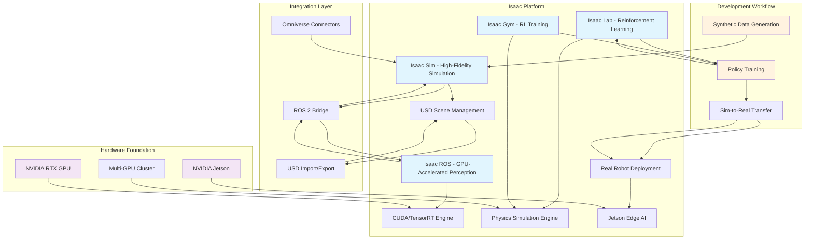

import ExerciseBlock from '@site/src/components/Learning/ExerciseBlock';
import Quiz from '@site/src/components/Learning/Quiz';

# Chapter 16: Isaac Overview - NVIDIA's AI Robotics Platform

## Introduction

NVIDIA Isaac represents a revolutionary approach to robotics development, combining high-fidelity simulation, GPU-accelerated AI, and seamless real-world deployment in a unified platform. Named after the brilliant physicist Isaac Newton, this platform embodies the fusion of physical laws and intelligent algorithms that defines Physical AI. Isaac provides the computational foundation for creating robots that can perceive, reason, and act in complex environments using advanced AI techniques.

The Isaac platform encompasses multiple components: Isaac Sim for high-fidelity simulation, Isaac ROS for GPU-accelerated perception and navigation, Isaac Lab for reinforcement learning, and Isaac Gym for training AI policies. Together, these components form an ecosystem that accelerates the development of intelligent robotic systems from concept to deployment, bridging the gap between simulation and reality through NVIDIA's powerful GPU computing capabilities.

## Learning Objectives

By the end of this chapter, you will be able to:

1. Understand the architecture and components of the NVIDIA Isaac platform
2. Identify the advantages of GPU-accelerated robotics over traditional CPU-based approaches
3. Compare Isaac Sim with other simulation platforms like Gazebo and Unity
4. Recognize the hardware requirements for running Isaac components effectively
5. Explain the role of USD (Universal Scene Description) in Isaac's architecture
6. Evaluate when to use Isaac components for different robotics applications

## Hook: The GPU Revolution in Robotics

Imagine training a humanoid robot to walk using traditional CPU-based simulation. It might take weeks to generate enough training data for a stable walking gait. Now imagine the same task using GPU-accelerated simulation - the same training could be completed in hours or days. This dramatic improvement isn't just about speed; it's about enabling entirely new approaches to robotics that were previously computationally infeasible. NVIDIA Isaac harnesses the parallel processing power of GPUs to accelerate not just simulation, but perception, planning, and learning algorithms that form the AI brain of modern robots. This chapter reveals how Isaac transforms robotics development from a slow, trial-and-error process into a rapid, AI-driven development cycle.

## Concept: Understanding the Isaac Ecosystem

### The Isaac Architecture

The NVIDIA Isaac platform is built around several core components that work together to provide a comprehensive robotics development environment:

**Isaac Sim**: A high-fidelity, photorealistic simulation environment built on NVIDIA Omniverse. It provides accurate physics simulation, realistic sensor models, and seamless integration with USD (Universal Scene Description) for 3D scene representation.

**Isaac ROS**: A collection of GPU-accelerated ROS 2 packages that speed up perception, navigation, and manipulation tasks. These packages leverage CUDA and TensorRT to accelerate computer vision, SLAM, and other computationally intensive algorithms.

**Isaac Lab**: A reinforcement learning framework specifically designed for robotics applications. It provides tools for training complex behaviors using simulation and transferring them to real robots.

**Isaac Gym**: A reinforcement learning environment that enables training of policies for complex robotic tasks using GPU-accelerated physics simulation.

### GPU Acceleration in Robotics

Traditional robotics development has relied heavily on CPU-based processing, which processes tasks sequentially. GPU acceleration changes this paradigm by enabling parallel processing of multiple tasks simultaneously. In robotics, this has several key benefits:

**Sensor Processing**: GPUs can process multiple camera feeds, LIDAR point clouds, and other sensor data in parallel, enabling real-time perception at high frame rates.

**Physics Simulation**: GPU-accelerated physics engines can simulate multiple robots and environments simultaneously, enabling faster training and testing.

**AI Inference**: Deep learning models for perception, planning, and control can run much faster on GPUs, enabling real-time AI decision-making.

**Rendering**: Photorealistic rendering for synthetic data generation and visualization happens much faster on GPUs.

### USD (Universal Scene Description) Integration

USD serves as the backbone of Isaac's scene representation. Developed by Pixar, USD provides a powerful, scalable format for describing 3D scenes with support for:

- **Hierarchical Scene Description**: Complex robot and environment models with nested transforms
- **Animation and Simulation Data**: Time-varying properties for dynamic scenes
- **Material and Appearance**: Photorealistic surface properties and lighting
- **Variant Sets**: Different configurations of the same scene for A/B testing
- **Composition**: Combining multiple scene files into complex environments

USD enables Isaac to seamlessly import, export, and manipulate complex 3D scenes, making it easier to create and modify simulation environments.

### Isaac Sim vs. Traditional Simulators

Isaac Sim differentiates itself from traditional simulators like Gazebo through several key features:

**Photorealistic Rendering**: Real-time ray tracing and global illumination create images that closely match real camera feeds, improving sim-to-real transfer.

**Multi-GPU Support**: Can scale across multiple GPUs for larger, more complex simulations.

**Real-time Collaboration**: Built on Omniverse, enabling multiple users to collaborate on simulation environments in real-time.

**Advanced Physics**: Integration with PhysX for highly accurate physics simulation, including complex contact dynamics and deformable objects.

**Synthetic Data Generation**: Tools for generating large datasets of labeled training data for AI models.

### Isaac ROS: GPU-Accelerated Perception

Isaac ROS packages provide GPU acceleration for common robotics tasks:

**Image Processing**: Accelerated image filtering, feature detection, and transformation operations.

**Point Cloud Processing**: Fast operations on LIDAR and depth sensor data using CUDA.

**SLAM Algorithms**: GPU-accelerated simultaneous localization and mapping for faster mapping and positioning.

**Deep Learning Inference**: Integration with TensorRT for optimized neural network inference on perception tasks.

### Hardware Requirements and Considerations

Isaac components require significant computational resources, particularly for GPU acceleration:

**Minimum Requirements**:
- NVIDIA GPU with CUDA capability 6.0+ (GTX 1060 or better)
- 8GB+ VRAM for basic simulation
- Modern CPU with multiple cores
- 16GB+ system RAM

**Recommended Requirements**:
- RTX 3080/4080 or better for advanced simulation
- 24GB+ VRAM for complex environments
- High-end CPU for physics simulation
- 32GB+ system RAM

**Jetson Platforms**: Isaac packages are optimized for NVIDIA Jetson platforms for edge deployment, enabling transfer from development to embedded systems.

## Mermaid Diagram: Isaac Platform Architecture



## Code Example: Isaac Setup and Basic Usage

Let's explore how to set up Isaac and work with basic components:

### Isaac Sim Installation and Basic Scene

```bash
# Install Isaac Sim prerequisites
# Ensure you have NVIDIA GPU drivers installed (>= 535.x)
# Install CUDA toolkit (>= 11.8)

# Download Isaac Sim from NVIDIA Developer website
# Or install via Omniverse Launcher

# Basic Isaac Sim scene setup using Python API
```

```python
#!/usr/bin/env python3
"""
Basic Isaac Sim Example
This script demonstrates fundamental Isaac Sim concepts and scene setup
"""

import carb
import omni
from omni.isaac.core import World
from omni.isaac.core.utils.stage import add_reference_to_stage
from omni.isaac.core.utils.prims import create_prim
from omni.isaac.core.utils.nucleus import get_assets_root_path
from omni.isaac.core.objects import DynamicCuboid
import numpy as np

# Initialize Isaac Sim
def setup_isaac_scene():
    """Set up a basic Isaac Sim scene with a robot and objects"""

    # Create world instance
    world = World(stage_units_in_meters=1.0)

    # Add ground plane
    world.scene.add_default_ground_plane()

    # Create a simple cube object
    cube = world.scene.add(
        DynamicCuboid(
            prim_path="/World/cube",
            name="cube",
            position=np.array([0.5, 0.5, 0.5]),
            size=np.array([0.1, 0.1, 0.1]),
            color=np.array([0.8, 0.2, 0.1])
        )
    )

    # Add a simple robot (using a pre-built asset)
    # In practice, you would load a URDF or USD robot model
    try:
        # Get assets root path
        assets_root_path = get_assets_root_path()

        if assets_root_path is None:
            carb.log_error("Could not find Isaac Sim assets. Ensure Isaac Sim is properly installed.")
            return None

        # Example: Add a simple robot from assets (replace with actual robot path)
        # robot_path = assets_root_path + "/Isaac/Robots/Franka/franka_alt_fv.usd"
        # add_reference_to_stage(robot_path, "/World/Robot")

        print("Isaac Sim scene initialized successfully")

    except Exception as e:
        carb.log_error(f"Error setting up Isaac scene: {str(e)}")
        return None

    return world

def run_simulation():
    """Run the simulation loop"""
    world = setup_isaac_scene()

    if world is None:
        return

    # Reset the world
    world.reset()

    # Simulation loop
    for i in range(500):  # Run for 500 steps
        # Perform any custom logic here
        world.step(render=True)

        # Print some information periodically
        if i % 100 == 0:
            print(f"Simulation step: {i}")

    # Clean up
    world.clear()

if __name__ == "__main__":
    run_simulation()
```

### Isaac ROS Integration Example

```python
#!/usr/bin/env python3
"""
Isaac ROS Integration Example
This script demonstrates how to use Isaac ROS packages with traditional ROS 2
"""

import rclpy
from rclpy.node import Node
from sensor_msgs.msg import Image, CameraInfo
from geometry_msgs.msg import Twist
from std_msgs.msg import String
import numpy as np
import cv2
from cv_bridge import CvBridge

class IsaacROSExample(Node):
    def __init__(self):
        super().__init__('isaac_ros_example')

        # Initialize CV bridge for image processing
        self.cv_bridge = CvBridge()

        # Subscribe to Isaac Sim camera data
        self.camera_sub = self.create_subscription(
            Image,
            '/isaac_sim/camera/image',
            self.camera_callback,
            10
        )

        # Subscribe to camera info
        self.camera_info_sub = self.create_subscription(
            CameraInfo,
            '/isaac_sim/camera/camera_info',
            self.camera_info_callback,
            10
        )

        # Publisher for robot commands
        self.cmd_vel_pub = self.create_publisher(
            Twist,
            '/robot/cmd_vel',
            10
        )

        # Timer for processing loop
        self.process_timer = self.create_timer(0.1, self.process_callback)

        # State variables
        self.latest_image = None
        self.camera_info = None
        self.frame_count = 0

        self.get_logger().info('Isaac ROS Example Node Started')

    def camera_callback(self, msg):
        """Process camera images from Isaac Sim"""
        try:
            # Convert ROS Image to OpenCV
            cv_image = self.cv_bridge.imgmsg_to_cv2(msg, desired_encoding='bgr8')

            # Store the latest image
            self.latest_image = cv_image

            # Perform basic image processing using GPU acceleration (simulated)
            processed_image = self.process_image_gpu(cv_image)

            # Log processing info
            self.frame_count += 1
            if self.frame_count % 10 == 0:
                self.get_logger().info(f'Processed frame {self.frame_count}')

        except Exception as e:
            self.get_logger().error(f'Error processing camera image: {str(e)}')

    def camera_info_callback(self, msg):
        """Process camera calibration information"""
        self.camera_info = msg
        self.get_logger().info('Received camera info')

    def process_image_gpu(self, image):
        """Simulate GPU-accelerated image processing"""
        # In a real Isaac ROS setup, this would use CUDA/TensorRT
        # For this example, we'll simulate the processing

        # Example: Edge detection (would be accelerated in real implementation)
        gray = cv2.cvtColor(image, cv2.COLOR_BGR2GRAY)
        edges = cv2.Canny(gray, 50, 150)

        # Example: Feature detection (would be accelerated)
        corners = cv2.goodFeaturesToTrack(gray, 25, 0.01, 10)

        if corners is not None:
            corners = np.int0(corners)
            for corner in corners:
                x, y = corner.ravel()
                cv2.circle(image, (x, y), 3, (0, 255, 0), -1)

        return image

    def process_callback(self):
        """Main processing callback"""
        if self.latest_image is not None:
            # Send a simple command to robot
            cmd_msg = Twist()
            cmd_msg.linear.x = 0.5  # Move forward slowly
            cmd_msg.angular.z = 0.1  # Small turn
            self.cmd_vel_pub.publish(cmd_msg)

def main(args=None):
    rclpy.init(args=args)
    isaac_ros_node = IsaacROSExample()

    try:
        rclpy.spin(isaac_ros_node)
    except KeyboardInterrupt:
        pass
    finally:
        isaac_ros_node.destroy_node()
        rclpy.shutdown()

if __name__ == '__main__':
    main()
```

### Isaac Lab Reinforcement Learning Example

```python
#!/usr/bin/env python3
"""
Isaac Lab RL Example
This script demonstrates basic reinforcement learning setup with Isaac Lab
"""

import torch
import numpy as np
from omni.isaac.orbit.envs.base import VecEnv
from omni.isaac.orbit.envs.mdp import observations, rewards, actions
from omni.isaac.orbit.assets import Articulation
from omni.isaac.orbit.utils import configclass
from omni.isaac.orbit_tasks.utils.wrappers.rsl_rl import RslRlOnPolicyRunnerCfg

@configclass
class IsaacRobotEnvCfg:
    """Configuration for the robot environment."""

    def __post_init__(self):
        # Environment settings
        self.env_spacing = 2.5
        self.num_envs = 1024
        self.episode_length = 500

        # Observations
        self.observations = observations.ObservationGroupCfg(
            policy=observations.ObservationCfg(
                enable_corruption=False,
                concatenate_terms=True,
            )
        )

        # Actions
        self.actions = actions.JointPositionActionCfg(
            asset_name="robot",
            joint_names=[".*"],
            scale=0.5,
            use_default_offset=True,
        )

        # Rewards
        self.rewards = rewards.RewardTermCollectionCfg(
            {
                "action_rate": rewards.ActionRateL2EnvCfg(facot=0.001),
                "joint_vel_torques": rewards.JointVelToleranceEnvCfg(
                    asset_name="robot",
                    joint_names=[".*"],
                    threshold=0.5
                ),
            }
        )

class IsaacRLEnv(VecEnv):
    """Simple Isaac RL environment for demonstration."""

    def __init__(self, cfg: IsaacRobotEnvCfg):
        super().__init__()
        self.cfg = cfg

        # Initialize robot
        self.robot = None
        self.robot_data = None

        # RL parameters
        self.action_space = None
        self.observation_space = None

        self.initialize_env()

    def initialize_env(self):
        """Initialize the environment."""
        # In a real Isaac Lab setup, this would connect to the simulation
        print("Initializing Isaac RL Environment")

        # Set up action and observation spaces
        num_actions = 12  # Example: 12 DOF robot
        num_observations = 48  # Example: various sensor readings

        self.action_space = torch.nn.Parameter(torch.zeros(num_actions))
        self.observation_space = torch.nn.Parameter(torch.zeros(num_observations))

        print(f"Action space: {num_actions}, Observation space: {num_observations}")

    def reset(self):
        """Reset the environment."""
        # Reset robot to initial position
        obs = torch.randn(self.observation_space.shape)
        return obs

    def step(self, actions):
        """Execute one step in the environment."""
        # Apply actions to robot
        # In simulation, this would move the robot
        next_obs = torch.randn(self.observation_space.shape)
        reward = torch.tensor(0.1)  # Example reward
        done = torch.tensor(False)
        info = {}

        return next_obs, reward, done, info

def train_rl_agent():
    """Train a simple RL agent using Isaac Lab."""
    cfg = IsaacRobotEnvCfg()

    # Create environment
    env = IsaacRLEnv(cfg)

    # Initialize policy (simplified)
    policy_network = torch.nn.Sequential(
        torch.nn.Linear(env.observation_space.shape[0], 256),
        torch.nn.ReLU(),
        torch.nn.Linear(256, 256),
        torch.nn.ReLU(),
        torch.nn.Linear(256, env.action_space.shape[0])
    )

    # Training loop (simplified)
    optimizer = torch.optim.Adam(policy_network.parameters(), lr=1e-4)

    for episode in range(1000):
        obs = env.reset()
        total_reward = 0

        for step in range(cfg.episode_length):
            # Get action from policy
            action = policy_network(obs)

            # Execute step
            next_obs, reward, done, info = env.step(action)

            # Update observation
            obs = next_obs
            total_reward += reward

            if done:
                break

        # Log progress
        if episode % 100 == 0:
            print(f"Episode {episode}, Average Reward: {total_reward:.2f}")

if __name__ == "__main__":
    train_rl_agent()
```

## Exercises

<ExerciseBlock
  content="**Exercise 1: Isaac Sim Installation**
Install Isaac Sim on your development machine following NVIDIA's official documentation. Document the hardware requirements verification process and any issues encountered during installation. Compare the installation process with Gazebo setup."
/>

<ExerciseBlock
  content="**Exercise 2: USD Scene Creation**
Create a simple 3D scene using USD format that includes a robot model and basic environment objects. Import this scene into Isaac Sim and verify that it renders correctly. Experiment with different lighting conditions and materials."
/>

<ExerciseBlock
  content="**Exercise 3: GPU vs CPU Performance Comparison**
Set up a simple perception task (e.g., image processing or point cloud filtering) using both CPU and GPU implementations. Measure and compare the performance differences. Document the speedup achieved with GPU acceleration."
/>

<ExerciseBlock
  content="**Exercise 4: Isaac ROS Package Integration**
Identify and integrate one Isaac ROS package into a simple ROS 2 workspace. Test the GPU-accelerated functionality and compare it with a traditional CPU-based alternative for the same task."
/>

## Summary

This chapter introduced the NVIDIA Isaac platform, a comprehensive ecosystem for AI-powered robotics development. We covered:

- The core components of Isaac: Isaac Sim, Isaac ROS, Isaac Lab, and Isaac Gym
- The advantages of GPU acceleration in robotics for perception, simulation, and AI inference
- The role of USD in scene representation and asset management
- Hardware requirements and considerations for Isaac deployment
- Integration approaches with ROS 2 and real-world deployment

Isaac represents a significant advancement in robotics development, enabling faster simulation, more sophisticated AI algorithms, and improved sim-to-real transfer through GPU acceleration. By leveraging Isaac's capabilities, developers can create more intelligent and capable robotic systems.

## Quiz

<Quiz
  question="What does USD stand for in the context of Isaac Sim?"
  options={[
    "Universal Scene Description",
    "Unified System Deployment",
    "Universal Sensor Data",
    "User Simulation Design"
  ]}
  answer={0}
  explanation="USD stands for Universal Scene Description, a powerful format developed by Pixar for describing 3D scenes with support for complex hierarchies, animation, and materials."
/>

<Quiz
  question="Which of the following is NOT a core component of the Isaac platform?"
  options={[
    "Isaac Sim",
    "Isaac ROS",
    "Isaac Lab",
    "Isaac Vision"
  ]}
  answer={3}
  explanation="Isaac Vision is not a core component of the Isaac platform. The core components are Isaac Sim, Isaac ROS, Isaac Lab, and Isaac Gym."
/>

<Quiz
  question="What is the primary advantage of GPU acceleration in robotics?"
  options={[
    "Lower hardware costs",
    "Parallel processing of multiple tasks simultaneously",
    "Simpler programming models",
    "Reduced power consumption"
  ]}
  explanation="The primary advantage of GPU acceleration in robotics is the ability to perform parallel processing of multiple tasks simultaneously, which dramatically speeds up computation-intensive operations like perception, simulation, and AI inference."
  answer={1}
/>

## Preview of Next Chapter

In Chapter 17: Isaac Sim, we'll dive deep into Isaac Sim's capabilities, exploring photorealistic rendering, advanced physics simulation, and tools for creating complex robotic environments. We'll learn to build detailed simulation worlds that enable effective sim-to-real transfer for Physical AI systems.