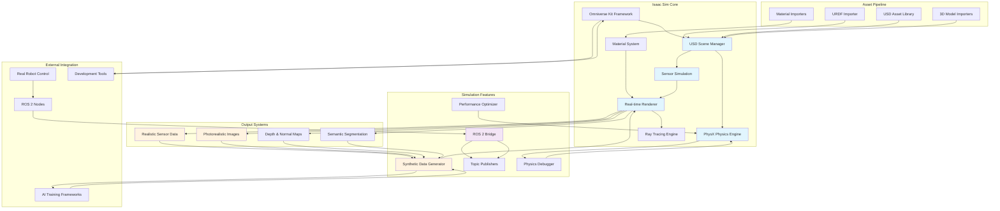

import ExerciseBlock from '@site/src/components/Learning/ExerciseBlock';
import Quiz from '@site/src/components/Learning/Quiz';

# Chapter 17: Isaac Sim - High-Fidelity Physics Simulation

## Introduction

Isaac Sim stands as NVIDIA's flagship simulation environment, combining photorealistic rendering with highly accurate physics simulation to create digital twins that bridge the gap between virtual and real worlds. Built on the Omniverse platform, Isaac Sim leverages USD (Universal Scene Description) for scene representation and PhysX for physics simulation, creating environments where robots can learn, adapt, and be tested under conditions that closely match reality.

The platform's strength lies in its ability to generate synthetic data that is indistinguishable from real sensor data, enabling the training of perception and control algorithms without the need for physical hardware. Isaac Sim's GPU-accelerated rendering and physics engines allow for parallel simulation of multiple environments and robots, dramatically reducing the time required for algorithm development and testing.

## Learning Objectives

By the end of this chapter, you will be able to:

1. Navigate and utilize Isaac Sim's user interface and core features
2. Import and configure robot models from URDF/USD formats
3. Create complex environments with accurate physics properties
4. Configure realistic sensor models including cameras, LIDAR, and IMU
5. Implement advanced rendering techniques for synthetic data generation
6. Debug and optimize simulation performance
7. Establish connections between Isaac Sim and ROS 2 systems

## Hook: The Photorealistic Revolution

Consider a mobile robot learning to navigate cluttered indoor environments. In traditional simulators, the robot might learn to identify objects based on simple geometric shapes and basic textures. But when deployed in the real world, it fails to recognize the same objects under different lighting conditions, with realistic materials, and complex reflections. Isaac Sim changes this paradigm by generating photorealistic images that match real camera feeds pixel-for-pixel. The robot trained in Isaac Sim experiences the same visual challenges it will face in reality: specular reflections on wet floors, shadows cast by overhead lights, and the subtle differences in material appearance under varying illumination. This chapter reveals how Isaac Sim's photorealistic capabilities enable robots to learn in simulation and perform effectively in the real world.

## Concept: Isaac Sim Architecture and Capabilities

### Omniverse Foundation

Isaac Sim is built on NVIDIA's Omniverse platform, which provides several key advantages:

**USD-Based Scene Description**: Universal Scene Description provides a scalable, layered approach to scene representation. This allows for complex robot models, detailed environments, and variant configurations that can be easily modified and shared.

**Real-time Collaboration**: Multiple users can simultaneously work on the same simulation environment, making it ideal for team-based robotics development.

**Extensible Architecture**: Through Omniverse Kit, Isaac Sim can be extended with custom tools, extensions, and workflows tailored to specific robotics applications.

**Asset Management**: Integration with Omniverse Nucleus provides centralized asset management and version control for simulation assets.

### PhysX Physics Engine Integration

Isaac Sim leverages NVIDIA's PhysX engine for accurate physics simulation:

**Multi-Material Contact Models**: Support for complex contact behaviors between different materials, including friction, restitution, and surface properties that affect robot locomotion.

**Deformable Body Simulation**: Ability to simulate soft bodies, cloth, and other deformable objects that robots might encounter.

**Fluid Simulation**: Support for liquid and granular material simulation, important for manipulation tasks.

**Large-Scale Physics**: Optimized for simulating complex environments with many objects and robots.

### Photorealistic Rendering Pipeline

The rendering pipeline in Isaac Sim includes several advanced features:

**Real-time Ray Tracing**: Hardware-accelerated ray tracing for accurate lighting, shadows, and reflections.

**Global Illumination**: Simulation of complex light transport phenomena including indirect lighting and color bleeding.

**Advanced Material Models**: Physically-based rendering (PBR) materials that accurately represent real-world surfaces.

**Sensor Simulation**: Accurate modeling of camera lenses, LIDAR beam patterns, and other sensor characteristics.

### Synthetic Data Generation

Isaac Sim excels at generating labeled training data:

**Semantic Segmentation**: Automatic generation of pixel-perfect segmentation masks.

**Instance Segmentation**: Individual object identification in complex scenes.

**Depth Maps**: Accurate depth information for each pixel.

**Surface Normals**: Per-pixel surface normal vectors for geometric understanding.

**Bounding Boxes**: 2D and 3D bounding box annotations for object detection.

### ROS 2 Integration

Seamless integration with ROS 2 ecosystems:

**Gazebo-ROS Bridge**: Compatibility with existing Gazebo workflows and plugins.

**Isaac ROS Packages**: GPU-accelerated perception and navigation packages that work within the simulation.

**Custom Message Types**: Support for specialized robotics message types beyond standard ROS 2.

### Performance Optimization Features

Isaac Sim includes several performance optimization capabilities:

**Multi-GPU Support**: Distribution of simulation and rendering across multiple GPUs.

**Level of Detail (LOD)**: Automatic simplification of complex models based on distance from camera.

**Occlusion Culling**: Rendering optimization by not rendering objects not visible to cameras.

**Simulation Cloning**: Efficient replication of simulation environments for parallel training.

## Mermaid Diagram: Isaac Sim Architecture



## Code Example: Isaac Sim Scene Creation and Robot Integration

Let's explore how to create complex simulation environments and integrate robots:

### Basic Isaac Sim Scene Setup

```python
#!/usr/bin/env python3
"""
Isaac Sim Scene Creation and Robot Integration
This script demonstrates creating complex simulation environments with robot integration
"""

import carb
import omni
from omni.isaac.core import World
from omni.isaac.core.utils.stage import add_reference_to_stage, get_stage_units
from omni.isaac.core.utils.prims import create_prim, get_prim_at_path
from omni.isaac.core.utils.nucleus import get_assets_root_path
from omni.isaac.core.objects import DynamicCuboid, VisualCuboid
from omni.isaac.core.robots import Robot
from omni.isaac.core.utils.semantics import add_semantic_box
from omni.isaac.sensor import Camera
import numpy as np
import os

class IsaacSimEnvironment:
    def __init__(self):
        self.world = None
        self.robots = []
        self.objects = []
        self.cameras = []

    def setup_world(self):
        """Initialize the Isaac Sim world"""
        self.world = World(stage_units_in_meters=1.0)
        self.world.scene.add_default_ground_plane()
        print("Isaac Sim world initialized")

    def add_robot(self, robot_path, prim_path, position, orientation=None):
        """Add a robot to the simulation"""
        if orientation is None:
            orientation = np.array([1.0, 0.0, 0.0, 0.0])  # No rotation (w, x, y, z)

        # Add robot from USD file
        add_reference_to_stage(
            usd_path=robot_path,
            prim_path=prim_path
        )

        # Create robot object
        robot = Robot(
            prim_path=prim_path,
            name=prim_path.split("/")[-1]
        )

        self.robots.append(robot)
        print(f"Added robot: {prim_path}")

    def create_environment_objects(self):
        """Create a complex environment with various objects"""
        # Create walls
        create_prim(
            prim_path="/World/wall_1",
            prim_type="Capsule",
            position=np.array([5.0, 0.0, 1.0]),
            orientation=np.array([0.707, 0.0, 0.0, 0.707]),  # Rotate 90 degrees around Z
            scale=np.array([1.0, 1.0, 5.0]),
            semantic_label="wall"
        )

        create_prim(
            prim_path="/World/wall_2",
            prim_type="Capsule",
            position=np.array([-5.0, 0.0, 1.0]),
            orientation=np.array([0.707, 0.0, 0.0, 0.707]),
            scale=np.array([1.0, 1.0, 5.0]),
            semantic_label="wall"
        )

        # Create obstacles
        obstacle_positions = [
            [2.0, 2.0, 0.2],
            [-2.0, -2.0, 0.2],
            [0.0, 3.0, 0.2],
            [3.0, 0.0, 0.2]
        ]

        for i, pos in enumerate(obstacle_positions):
            obstacle = self.world.scene.add(
                DynamicCuboid(
                    prim_path=f"/World/obstacle_{i}",
                    name=f"obstacle_{i}",
                    position=np.array(pos),
                    size=np.array([0.4, 0.4, 0.4]),
                    color=np.array([0.5, 0.5, 0.8])
                )
            )
            self.objects.append(obstacle)

        # Create goal marker
        goal = self.world.scene.add(
            VisualCuboid(
                prim_path="/World/goal",
                name="goal",
                position=np.array([4.0, 4.0, 0.1]),
                size=np.array([0.5, 0.5, 0.2]),
                color=np.array([0.0, 1.0, 0.0])
            )
        )
        self.objects.append(goal)

        print("Environment objects created")

    def setup_sensors(self):
        """Setup cameras and other sensors"""
        # Add a camera to the robot
        camera = Camera(
            prim_path="/World/Robot/base_link/camera",
            frequency=30,
            resolution=(640, 480)
        )
        self.cameras.append(camera)

        print("Sensors configured")

    def setup_physics_properties(self):
        """Configure physics properties for realistic simulation"""
        # Set global physics parameters
        self.world.get_physics_context().set_gravity(9.81)
        self.world.get_physics_context().set_fixed_timestep(1.0/60.0)

        print("Physics properties configured")

    def run_simulation(self, steps=1000):
        """Run the simulation loop"""
        self.world.reset()

        for step in range(steps):
            self.world.step(render=True)

            # Print status periodically
            if step % 100 == 0:
                print(f"Simulation step: {step}")

            # Example: Move robots or objects based on some logic
            self.update_robot_positions(step)

    def update_robot_positions(self, step):
        """Update robot positions based on simple logic"""
        # In a real implementation, this would be replaced with actual robot control logic
        pass

def main():
    """Main function to demonstrate Isaac Sim environment creation"""
    env = IsaacSimEnvironment()

    # Initialize the world
    env.setup_world()

    # Try to get assets root path for robot models
    assets_root_path = get_assets_root_path()
    if assets_root_path is None:
        carb.log_error("Could not find Isaac Sim assets. Using placeholder robot.")
        # For this example, we'll use a placeholder - in practice you'd load a real robot
        robot_path = ""  # Placeholder
    else:
        # Example robot path (would need to exist in your Isaac Sim installation)
        # robot_path = assets_root_path + "/Isaac/Robots/Franka/franka_alt_fv.usd"
        robot_path = ""  # Placeholder for this example

    # Add robot (placeholder - would use actual robot USD file)
    if robot_path and os.path.exists(robot_path):
        env.add_robot(
            robot_path=robot_path,
            prim_path="/World/Robot",
            position=np.array([0.0, 0.0, 0.5])
        )
    else:
        print("Using placeholder robot setup - replace with actual robot model")

    # Create environment objects
    env.create_environment_objects()

    # Setup sensors
    env.setup_sensors()

    # Configure physics
    env.setup_physics_properties()

    # Run simulation
    print("Starting simulation...")
    env.run_simulation(steps=500)

    print("Simulation completed")

if __name__ == "__main__":
    main()
```

### Advanced Environment with Lighting and Materials

```python
#!/usr/bin/env python3
"""
Advanced Isaac Sim Environment
This script demonstrates advanced environment creation with lighting and materials
"""

import carb
import omni
from omni.isaac.core import World
from omni.isaac.core.utils.stage import add_reference_to_stage
from omni.isaac.core.utils.prims import create_prim
from omni.isaac.core.utils.lighting import create_dome_light, create_distant_light
from omni.isaac.core.materials import OmniPBR
from omni.isaac.sensor import Camera
from pxr import UsdLux, Sdf, Gf
import numpy as np

class AdvancedIsaacEnvironment:
    def __init__(self):
        self.world = None
        self.materials = {}
        self.lights = []

    def setup_world_with_advanced_features(self):
        """Setup world with advanced lighting and materials"""
        self.world = World(stage_units_in_meters=1.0)

        # Add ground plane with custom material
        self.create_textured_ground()

        # Add advanced lighting
        self.setup_advanced_lighting()

        # Create various material types
        self.create_materials()

        print("Advanced world setup completed")

    def create_textured_ground(self):
        """Create a textured ground plane"""
        # Create ground plane
        create_prim(
            prim_path="/World/ground",
            prim_type="Plane",
            position=np.array([0.0, 0.0, 0.0]),
            scale=np.array([10.0, 10.0, 1.0])
        )

        # Create a material for the ground
        ground_material = OmniPBR(
            prim_path="/World/Looks/ground_material",
            diffuse_color=np.array([0.4, 0.4, 0.4]),
            roughness=0.7,
            metallic=0.0,
            specular_level=0.5
        )

        # Apply material to ground
        from omni.isaac.core.materials import PhysicsMaterial
        physics_material = PhysicsMaterial(
            prim_path="/World/ground_physics_material",
            static_friction=0.5,
            dynamic_friction=0.5,
            restitution=0.1
        )

        print("Textured ground created")

    def setup_advanced_lighting(self):
        """Setup advanced lighting with multiple light sources"""
        # Create dome light for ambient lighting
        create_dome_light(
            prim_path="/World/domeLight",
            color=np.array([0.9, 0.9, 0.9]),
            intensity=300
        )

        # Create distant light for directional lighting
        distant_light = create_distant_light(
            prim_path="/World/distantLight",
            color=np.array([0.95, 0.95, 0.9]),
            intensity=1000,
            direction=np.array([-0.5, -0.5, -1.0])
        )

        # Add point lights for specific illumination
        create_prim(
            prim_path="/World/pointLight1",
            prim_type="SphereLight",
            position=np.array([2.0, 2.0, 3.0]),
            attributes={
                "inputs:intensity": 500,
                "inputs:color": (1.0, 1.0, 1.0),
                "inputs:radius": 0.1
            }
        )

        create_prim(
            prim_path="/World/pointLight2",
            prim_type="SphereLight",
            position=np.array([-2.0, -2.0, 3.0]),
            attributes={
                "inputs:intensity": 500,
                "inputs:color": (0.8, 0.9, 1.0),
                "inputs:radius": 0.1
            }
        )

        print("Advanced lighting setup completed")

    def create_materials(self):
        """Create various materials for different surfaces"""
        # Create different materials for various objects
        self.materials['wood'] = OmniPBR(
            prim_path="/World/Looks/wood_material",
            diffuse_color=np.array([0.8, 0.6, 0.3]),
            roughness=0.4,
            metallic=0.0
        )

        self.materials['metal'] = OmniPBR(
            prim_path="/World/Looks/metal_material",
            diffuse_color=np.array([0.7, 0.7, 0.8]),
            roughness=0.1,
            metallic=0.9
        )

        self.materials['plastic'] = OmniPBR(
            prim_path="/World/Looks/plastic_material",
            diffuse_color=np.array([0.2, 0.8, 0.3]),
            roughness=0.3,
            metallic=0.0
        )

        self.materials['glass'] = OmniPBR(
            prim_path="/World/Looks/glass_material",
            diffuse_color=np.array([0.9, 0.9, 1.0]),
            roughness=0.05,
            metallic=0.0,
            opacity=0.8,
            ior=1.5
        )

        print("Materials created")

    def create_complex_environment(self):
        """Create a complex environment with different objects and materials"""
        # Create objects with different materials
        objects_config = [
            {"name": "wood_box", "position": [2.0, 0.0, 0.5], "material": "wood", "size": [1.0, 1.0, 1.0]},
            {"name": "metal_cylinder", "position": [-2.0, 0.0, 0.7], "material": "metal", "size": [0.5, 0.5, 1.4]},
            {"name": "plastic_sphere", "position": [0.0, 2.0, 0.5], "material": "plastic", "size": [0.6, 0.6, 0.6]},
            {"name": "glass_prism", "position": [0.0, -2.0, 0.8], "material": "glass", "size": [0.8, 0.8, 1.6]}
        ]

        for obj_config in objects_config:
            # Create primitive based on shape
            if 'sphere' in obj_config['name']:
                prim_type = "Sphere"
            elif 'cylinder' in obj_config['name']:
                prim_type = "Cylinder"
            elif 'prism' in obj_config['name']:
                prim_type = "Cone"  # Using cone as approximation
            else:
                prim_type = "Cube"

            create_prim(
                prim_path=f"/World/{obj_config['name']}",
                prim_type=prim_type,
                position=np.array(obj_config['position']),
                scale=np.array(obj_config['size'])
            )

            print(f"Created {obj_config['name']} with {obj_config['material']} material")

    def setup_advanced_sensors(self):
        """Setup advanced sensors with realistic properties"""
        # RGB camera with realistic properties
        rgb_camera = Camera(
            prim_path="/World/advanced_camera",
            frequency=30,
            resolution=(1280, 720),
            position=np.array([0.0, -3.0, 2.0]),
            orientation=np.array([0.707, 0.0, 0.707, 0.0])  # Look towards origin
        )

        # Add distortion parameters to make it more realistic
        from omni.isaac.core.utils.viewports import set_camera_view
        # This would configure camera intrinsics and distortion in a real setup

        print("Advanced sensors configured")

    def run_advanced_simulation(self, steps=500):
        """Run the advanced simulation"""
        self.world.reset()

        for step in range(steps):
            self.world.step(render=True)

            if step % 100 == 0:
                print(f"Advanced simulation step: {step}")

def main():
    """Main function for advanced environment demonstration"""
    env = AdvancedIsaacEnvironment()

    # Setup advanced world
    env.setup_world_with_advanced_features()

    # Create complex environment
    env.create_complex_environment()

    # Setup advanced sensors
    env.setup_advanced_sensors()

    # Run simulation
    print("Starting advanced simulation...")
    env.run_advanced_simulation(steps=300)

    print("Advanced simulation completed")

if __name__ == "__main__":
    main()
```

### Isaac Sim ROS 2 Integration

```python
#!/usr/bin/env python3
"""
Isaac Sim ROS 2 Integration
This script demonstrates how to integrate Isaac Sim with ROS 2 systems
"""

import rclpy
from rclpy.node import Node
from sensor_msgs.msg import Image, LaserScan, Imu, JointState
from geometry_msgs.msg import Twist, PoseStamped
from nav_msgs.msg import Odometry
from std_msgs.msg import String
from tf2_ros import TransformBroadcaster
import numpy as np
import math
from cv_bridge import CvBridge
from omni.isaac.core import World
from omni.isaac.core.robots import Robot
from omni.isaac.core.utils.stage import add_reference_to_stage
from omni.isaac.core.utils.nucleus import get_assets_root_path
from omni.isaac.sensor import Camera, LidarRtx
import carb

class IsaacSimROS2Bridge(Node):
    def __init__(self):
        super().__init__('isaac_sim_ros2_bridge')

        # Initialize ROS 2 publishers
        self.image_pub = self.create_publisher(Image, '/camera/image_raw', 10)
        self.lidar_pub = self.create_publisher(LaserScan, '/scan', 10)
        self.imu_pub = self.create_publisher(Imu, '/imu/data', 10)
        self.joint_pub = self.create_publisher(JointState, '/joint_states', 10)
        self.odom_pub = self.create_publisher(Odometry, '/odom', 10)
        self.cmd_vel_sub = self.create_subscription(
            Twist, '/cmd_vel', self.cmd_vel_callback, 10
        )

        # Initialize CV bridge
        self.cv_bridge = CvBridge()

        # Isaac Sim components
        self.world = None
        self.robot = None
        self.camera = None
        self.lidar = None

        # Robot state
        self.robot_x = 0.0
        self.robot_y = 0.0
        self.robot_theta = 0.0
        self.linear_velocity = 0.0
        self.angular_velocity = 0.0

        # Create timer for publishing sensor data
        self.timer = self.create_timer(0.1, self.publish_sensor_data)

        # Initialize Isaac Sim
        self.initialize_isaac_sim()

        self.get_logger().info('Isaac Sim ROS2 Bridge initialized')

    def initialize_isaac_sim(self):
        """Initialize Isaac Sim components"""
        try:
            # Initialize world
            self.world = World(stage_units_in_meters=1.0)
            self.world.scene.add_default_ground_plane()

            # Get assets root path
            assets_root_path = get_assets_root_path()
            if assets_root_path is None:
                self.get_logger().warn("Could not find Isaac Sim assets")
                return

            # In a real implementation, you would load a robot model
            # For this example, we'll simulate the robot state
            self.get_logger().info("Isaac Sim initialized")

        except Exception as e:
            self.get_logger().error(f"Error initializing Isaac Sim: {str(e)}")

    def cmd_vel_callback(self, msg):
        """Handle velocity commands from ROS 2"""
        self.linear_velocity = msg.linear.x
        self.angular_velocity = msg.angular.z

        # In a real implementation, this would control the robot in Isaac Sim
        self.get_logger().info(f"Received cmd_vel: linear={self.linear_velocity}, angular={self.angular_velocity}")

    def publish_sensor_data(self):
        """Publish sensor data from Isaac Sim"""
        current_time = self.get_clock().now().to_msg()

        # Update robot position based on velocity commands
        self.update_robot_position()

        # Publish odometry
        self.publish_odometry(current_time)

        # Publish joint states (simulated)
        self.publish_joint_states(current_time)

        # Publish IMU data (simulated)
        self.publish_imu_data(current_time)

        # Publish camera image (simulated)
        self.publish_camera_image(current_time)

        # Publish LIDAR scan (simulated)
        self.publish_lidar_scan(current_time)

    def update_robot_position(self):
        """Update robot position based on velocity commands"""
        dt = 0.1  # 10 Hz update rate

        # Simple kinematic model
        self.robot_x += self.linear_velocity * math.cos(self.robot_theta) * dt
        self.robot_y += self.linear_velocity * math.sin(self.robot_theta) * dt
        self.robot_theta += self.angular_velocity * dt

        # Keep robot in bounds
        self.robot_x = max(-10, min(10, self.robot_x))
        self.robot_y = max(-10, min(10, self.robot_y))

    def publish_odometry(self, stamp):
        """Publish odometry data"""
        odom_msg = Odometry()
        odom_msg.header.stamp = stamp
        odom_msg.header.frame_id = 'odom'
        odom_msg.child_frame_id = 'base_link'

        odom_msg.pose.pose.position.x = self.robot_x
        odom_msg.pose.pose.position.y = self.robot_y
        odom_msg.pose.pose.position.z = 0.0

        # Convert angle to quaternion
        from math import sin, cos
        cy = cos(self.robot_theta * 0.5)
        sy = sin(self.robot_theta * 0.5)
        odom_msg.pose.pose.orientation.z = sy
        odom_msg.pose.pose.orientation.w = cy

        odom_msg.twist.twist.linear.x = self.linear_velocity
        odom_msg.twist.twist.angular.z = self.angular_velocity

        self.odom_pub.publish(odom_msg)

    def publish_joint_states(self, stamp):
        """Publish joint state data"""
        joint_msg = JointState()
        joint_msg.header.stamp = stamp
        joint_msg.name = ['joint1', 'joint2', 'joint3']
        joint_msg.position = [0.0, 0.5, -0.3]  # Simulated positions
        joint_msg.velocity = [0.0, 0.0, 0.0]
        joint_msg.effort = [0.0, 0.0, 0.0]

        # Add some movement based on robot motion
        joint_msg.position[0] += 0.1 * math.sin(self.get_clock().now().nanoseconds * 1e-9)

        self.joint_pub.publish(joint_msg)

    def publish_imu_data(self, stamp):
        """Publish IMU data"""
        imu_msg = Imu()
        imu_msg.header.stamp = stamp
        imu_msg.header.frame_id = 'imu_link'

        # Simulated IMU data with some noise
        imu_msg.linear_acceleration.x = 0.1 * math.sin(self.get_clock().now().nanoseconds * 1e-9)
        imu_msg.linear_acceleration.y = 0.05 * math.cos(self.get_clock().now().nanoseconds * 1e-9)
        imu_msg.linear_acceleration.z = 9.81  # Gravity

        imu_msg.angular_velocity.z = self.angular_velocity

        # Orientation from robot heading
        from math import sin, cos
        cy = cos(self.robot_theta * 0.5)
        sy = sin(self.robot_theta * 0.5)
        imu_msg.orientation.z = sy
        imu_msg.orientation.w = cy

        self.imu_pub.publish(imu_msg)

    def publish_camera_image(self, stamp):
        """Publish simulated camera image"""
        # Create a simulated image (320x240 RGB)
        import numpy as np
        height, width = 240, 320
        image_array = np.zeros((height, width, 3), dtype=np.uint8)

        # Create a simple simulated environment
        for y in range(height):
            for x in range(width):
                # Create gradient background
                image_array[y, x] = [
                    int(100 + 50 * (x / width)),  # Blue channel
                    int(150 + 50 * (y / height)),  # Green channel
                    int(200)  # Red channel
                ]

                # Add some simulated obstacles
                center_x, center_y = width // 2, height // 2
                distance = math.sqrt((x - center_x)**2 + (y - center_y)**2)
                if distance < 50:  # Circular obstacle
                    image_array[y, x] = [0, 0, 255]  # Red obstacle

        # Convert to ROS Image message
        image_msg = self.cv_bridge.cv2_to_imgmsg(image_array, encoding="rgb8")
        image_msg.header.stamp = stamp
        image_msg.header.frame_id = 'camera_link'

        self.image_pub.publish(image_msg)

    def publish_lidar_scan(self, stamp):
        """Publish simulated LIDAR scan"""
        scan_msg = LaserScan()
        scan_msg.header.stamp = stamp
        scan_msg.header.frame_id = 'laser_link'

        # LIDAR parameters
        scan_msg.angle_min = -math.pi
        scan_msg.angle_max = math.pi
        scan_msg.angle_increment = 0.01  # ~0.57 degrees
        scan_msg.time_increment = 0.0
        scan_msg.scan_time = 0.1
        scan_msg.range_min = 0.1
        scan_msg.range_max = 10.0

        # Generate simulated ranges
        num_ranges = int((scan_msg.angle_max - scan_msg.angle_min) / scan_msg.angle_increment) + 1
        ranges = []

        for i in range(num_ranges):
            angle = scan_msg.angle_min + i * scan_msg.angle_increment

            # Simulate environment with obstacles
            simulated_range = 5.0  # Default distance

            # Add an obstacle ahead
            if abs(angle) < 0.5:  # Front of robot
                obstacle_distance = 2.0 + 0.5 * math.sin(angle * 5)
                simulated_range = min(simulated_range, obstacle_distance)

            # Add some noise
            noise = np.random.normal(0, 0.02)
            ranges.append(max(scan_msg.range_min, min(scan_msg.range_max, simulated_range + noise)))

        scan_msg.ranges = ranges
        scan_msg.intensities = [1.0] * len(ranges)

        self.lidar_pub.publish(scan_msg)

def main(args=None):
    """Main function to run the Isaac Sim ROS2 bridge"""
    rclpy.init(args=args)
    isaac_bridge = IsaacSimROS2Bridge()

    try:
        rclpy.spin(isaac_bridge)
    except KeyboardInterrupt:
        pass
    finally:
        isaac_bridge.destroy_node()
        rclpy.shutdown()

if __name__ == '__main__':
    main()
```

## Exercises

<ExerciseBlock
  content="**Exercise 1: Environment Creation**
Create a complex indoor environment in Isaac Sim with multiple rooms, furniture, and dynamic objects. Configure different materials for various surfaces and set up realistic lighting conditions. Document the performance impact of different complexity levels."
/>

<ExerciseBlock
  content="**Exercise 2: Robot Integration**
Import a humanoid robot model into Isaac Sim and configure its physical properties, joints, and actuators. Test the robot's basic movements and interactions with the environment. Compare the simulation behavior with expected real-world physics."
/>

<ExerciseBlock
  content="**Exercise 3: Sensor Simulation Accuracy**
Set up camera and LIDAR sensors in Isaac Sim and compare their output with real sensor data from the same environment. Analyze the differences in noise patterns, resolution, and accuracy. Document the sim-to-real gap for different sensor types."
/>

<ExerciseBlock
  content="**Exercise 4: Synthetic Data Generation**
Create a synthetic dataset using Isaac Sim for a computer vision task (e.g., object detection). Generate images with corresponding segmentation masks and 3D bounding boxes. Train a simple neural network on this synthetic data and test its performance on real images."
/>

## Summary

This chapter explored Isaac Sim's capabilities for creating high-fidelity simulation environments. We covered:

- The Omniverse foundation and USD-based scene representation
- Advanced physics simulation with PhysX engine integration
- Photorealistic rendering pipeline and synthetic data generation
- ROS 2 integration for seamless workflow integration
- Performance optimization techniques for large-scale simulation

Isaac Sim represents a significant advancement in robotics simulation, providing photorealistic environments and accurate physics that enable effective sim-to-real transfer. By leveraging Isaac Sim's capabilities, developers can accelerate robot development, reduce hardware testing costs, and improve the robustness of their robotic systems.

## Quiz

<Quiz
  question="What is the primary rendering technology used in Isaac Sim for photorealistic graphics?"
  options={[
    "OpenGL",
    "Vulkan",
    "Real-time ray tracing with hardware acceleration",
    "Software rendering"
  ]}
  answer={2}
  explanation="Isaac Sim uses real-time ray tracing with hardware acceleration, leveraging NVIDIA's RT cores for photorealistic lighting, shadows, and reflections."
/>

<Quiz
  question="Which physics engine does Isaac Sim use for accurate simulation?"
  options={[
    "ODE (Open Dynamics Engine)",
    "Bullet Physics",
    "PhysX",
    "Havok"
  ]}
  answer={2}
  explanation="Isaac Sim uses NVIDIA's PhysX engine for accurate physics simulation, providing advanced contact models and multi-material interactions."
/>

<Quiz
  question="What does USD stand for in the context of Isaac Sim?"
  options={[
    "Universal Simulation Description",
    "Unified Scene Definition",
    "Universal Scene Description",
    "User System Design"
  ]}
  explanation="USD stands for Universal Scene Description, a scalable format developed by Pixar for describing 3D scenes with support for complex hierarchies and materials."
  answer={2}
/>

## Preview of Next Chapter

In Chapter 18: Isaac ROS vSLAM, we'll explore Isaac ROS packages for visual SLAM (Simultaneous Localization and Mapping), including GPU-accelerated perception algorithms, camera integration, and real-time mapping capabilities that enable robots to understand and navigate their environments effectively.