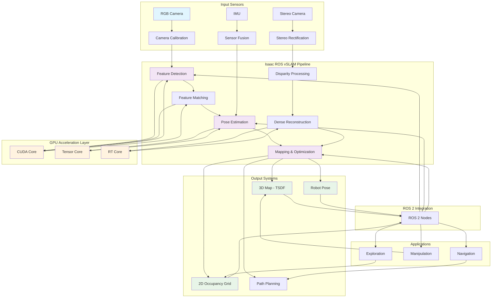

import ExerciseBlock from '@site/src/components/Learning/ExerciseBlock';
import Quiz from '@site/src/components/Learning/Quiz';

# Chapter 18: Isaac ROS vSLAM - GPU-Accelerated Visual SLAM

## Introduction

Visual Simultaneous Localization and Mapping (vSLAM) represents a cornerstone capability for autonomous robots, enabling them to understand their position within an environment while simultaneously building a map of that environment. Isaac ROS vSLAM packages bring GPU acceleration to this computationally intensive process, dramatically improving performance and enabling real-time operation on mobile robots. By leveraging CUDA and TensorRT, Isaac ROS transforms traditional CPU-bound SLAM algorithms into high-performance, GPU-accelerated systems that can process high-resolution imagery at the frame rates required for mobile robotics.

The integration of visual SLAM with ROS 2 provides a standardized framework for robot navigation, mapping, and localization. Isaac ROS vSLAM packages offer optimized implementations of state-of-the-art algorithms, making advanced mapping capabilities accessible to robotics developers without requiring deep expertise in computer vision or optimization mathematics. This chapter explores the architecture, implementation, and practical application of Isaac ROS vSLAM packages.

## Learning Objectives

By the end of this chapter, you will be able to:

1. Understand the principles of visual SLAM and its applications in robotics
2. Install and configure Isaac ROS vSLAM packages for GPU acceleration
3. Integrate camera systems with Isaac ROS vSLAM nodes
4. Configure and optimize vSLAM parameters for different environments
5. Implement real-time mapping and localization using GPU acceleration
6. Evaluate vSLAM performance and accuracy in various scenarios
7. Troubleshoot common vSLAM issues and optimize for specific use cases

## Hook: The Real-Time Mapping Revolution

Imagine a delivery robot entering an unfamiliar building for the first time. Without any prior map, it must simultaneously determine its location while building a representation of the environment to navigate effectively. Traditional CPU-based SLAM systems might struggle to process the high-resolution camera feeds required for accurate mapping at the frame rates needed for real-time navigation. With Isaac ROS vSLAM, the same robot can process multiple high-resolution camera streams in real-time, creating detailed 3D maps while accurately tracking its position. The GPU acceleration enables complex computer vision algorithms to run at 30+ FPS, allowing the robot to react to dynamic obstacles and navigate safely. This chapter reveals how Isaac ROS vSLAM transforms mobile robots from simple reactive systems into intelligent agents capable of understanding and navigating complex environments.

## Concept: Visual SLAM Fundamentals and Isaac ROS Implementation

### Visual SLAM Overview

Visual SLAM combines computer vision and robotics to solve the simultaneous localization and mapping problem using visual sensors. The process involves several key components:

**Feature Detection and Matching**: Identifying distinctive visual features in images and matching them across frames to establish correspondences.

**Pose Estimation**: Computing the camera's position and orientation (pose) relative to the environment using feature correspondences.

**Mapping**: Building a representation of the environment based on observed features and estimated poses.

**Loop Closure**: Detecting when the robot revisits previously mapped areas to correct accumulated drift.

**Bundle Adjustment**: Optimizing the estimated poses and 3D points to minimize reprojection errors.

### Isaac ROS vSLAM Architecture

Isaac ROS provides GPU-accelerated implementations of several vSLAM algorithms:

**Isaac ROS Visual SLAM (NVDSLAM)**: NVIDIA's deep learning-based SLAM approach that uses neural networks for feature extraction and matching.

**Isaac ROS Stereo Dense Scene Reconstruction**: Creates dense 3D maps from stereo camera inputs using GPU acceleration.

**Isaac ROS Occupancy Grid Mapping**: Converts SLAM results into 2D occupancy grids for navigation planning.

**Isaac ROS Camera Processing**: GPU-accelerated camera calibration, rectification, and preprocessing pipelines.

### GPU Acceleration in vSLAM

GPU acceleration transforms vSLAM performance through several mechanisms:

**Parallel Feature Processing**: GPUs can process thousands of features simultaneously, dramatically speeding up feature detection and matching.

**Deep Learning Inference**: Neural networks for feature extraction and place recognition run much faster on GPUs than CPUs.

**Matrix Operations**: SLAM involves extensive matrix computations for pose estimation and optimization, which GPUs handle efficiently.

**Image Processing**: Preprocessing operations like filtering, rectification, and undistortion benefit from GPU parallelization.

### Key Isaac ROS vSLAM Packages

**`nvblox`:** A GPU-accelerated mapping library that creates TSDF (Truncated Signed Distance Function) maps from RGB-D or stereo data. It provides real-time 3D reconstruction and semantic mapping capabilities.

**`isaac_ros_visual_slam`:** Provides GPU-accelerated visual-inertial SLAM using ORB-SLAM2 as the backend with CUDA optimizations.

**`isaac_ros_stereo_image_proc`:** GPU-accelerated stereo image processing including rectification, disparity computation, and point cloud generation.

**`isaac_ros_apriltag`:** GPU-accelerated AprilTag detection for precise localization relative to known landmarks.

### Camera Integration and Calibration

Isaac ROS vSLAM requires properly calibrated cameras:

**Intrinsic Calibration**: Determining camera parameters like focal length, principal point, and distortion coefficients.

**Extrinsic Calibration**: Establishing the transformation between camera and robot coordinate frames.

**Temporal Synchronization**: Ensuring camera timestamps align with IMU and other sensor data for accurate sensor fusion.

**Multi-camera Systems**: Supporting stereo cameras or multiple RGB cameras for enhanced perception.

### Mapping and Localization Accuracy

vSLAM accuracy depends on several factors:

**Feature Richness**: Environments with distinctive visual features enable better tracking and mapping.

**Lighting Conditions**: Consistent lighting helps maintain feature correspondences across frames.

**Camera Quality**: Higher resolution and better optical quality improve feature detection and matching.

**Motion Characteristics**: Smooth, predictable motion patterns aid in feature tracking and pose estimation.

**IMU Integration**: Inertial measurements help maintain tracking during fast motion or feature-poor conditions.

### Performance Optimization Strategies

Isaac ROS vSLAM provides several optimization approaches:

**Adaptive Feature Management**: Dynamically adjusting the number of features based on tracking quality.

**Multi-resolution Processing**: Using image pyramids to improve tracking robustness and speed.

**GPU Memory Management**: Efficient memory allocation and reuse to minimize data transfer overhead.

**Pipeline Parallelization**: Overlapping processing stages to maximize throughput.

## Mermaid Diagram: Isaac ROS vSLAM Architecture



## Code Example: Isaac ROS vSLAM Implementation

Let's explore how to implement Isaac ROS vSLAM with GPU acceleration:

### Isaac ROS vSLAM Node Implementation

```python
#!/usr/bin/env python3
"""
Isaac ROS vSLAM Node
This script demonstrates GPU-accelerated visual SLAM using Isaac ROS packages
"""

import rclpy
from rclpy.node import Node
from sensor_msgs.msg import Image, CameraInfo, Imu
from geometry_msgs.msg import PoseStamped, TwistStamped
from nav_msgs.msg import Odometry
from std_msgs.msg import Header
from cv_bridge import CvBridge
import numpy as np
import cv2
import message_filters
from tf2_ros import TransformBroadcaster
from geometry_msgs.msg import TransformStamped
import tf_transformations

class IsaacROSvSLAMNode(Node):
    def __init__(self):
        super().__init__('isaac_ros_vslam_node')

        # Initialize CV bridge
        self.cv_bridge = CvBridge()

        # SLAM state variables
        self.current_pose = np.eye(4)  # 4x4 transformation matrix
        self.map_points = []  # 3D points in the map
        self.keyframes = []   # Keyframe poses
        self.tracking_quality = 0.0  # Quality metric (0-1)

        # Camera parameters (to be updated from camera info)
        self.camera_matrix = None
        self.distortion_coeffs = None

        # Create synchronized subscribers for camera and IMU
        self.image_sub = message_filters.Subscriber(
            self, Image, '/camera/image_raw'
        )
        self.camera_info_sub = message_filters.Subscriber(
            self, CameraInfo, '/camera/camera_info'
        )
        self.imu_sub = message_filters.Subscriber(
            self, Imu, '/imu/data'
        )

        # Synchronize camera and IMU data
        self.sync = message_filters.ApproximateTimeSynchronizer(
            [self.image_sub, self.camera_info_sub, self.imu_sub],
            queue_size=10,
            slop=0.1
        )
        self.sync.registerCallback(self.slam_callback)

        # Publishers for SLAM results
        self.pose_pub = self.create_publisher(PoseStamped, '/vslam/pose', 10)
        self.odom_pub = self.create_publisher(Odometry, '/vslam/odometry', 10)
        self.map_pub = self.create_publisher(Odometry, '/vslam/map', 10)
        self.status_pub = self.create_publisher(Header, '/vslam/status', 10)

        # Transform broadcaster for TF
        self.tf_broadcaster = TransformBroadcaster(self)

        # SLAM parameters
        self.feature_detector = cv2.ORB_create(nfeatures=2000)
        self.descriptor_matcher = cv2.BFMatcher(cv2.NORM_HAMMING, crossCheck=False)
        self.min_matches = 20
        self.keyframe_threshold = 0.5  # Movement threshold to create keyframe

        # Previous frame data
        self.prev_image = None
        self.prev_keypoints = None
        self.prev_descriptors = None
        self.prev_pose = np.eye(4)

        # Performance tracking
        self.frame_count = 0
        self.last_pose_update = self.get_clock().now()

        self.get_logger().info('Isaac ROS vSLAM Node initialized')

    def slam_callback(self, image_msg, camera_info_msg, imu_msg):
        """Process synchronized camera and IMU data for SLAM"""
        try:
            # Convert ROS image to OpenCV
            cv_image = self.cv_bridge.imgmsg_to_cv2(image_msg, desired_encoding='bgr8')

            # Update camera parameters
            if self.camera_matrix is None:
                self.camera_matrix = np.array(camera_info_msg.k).reshape(3, 3)
                self.distortion_coeffs = np.array(camera_info_msg.d)

            # Perform visual SLAM
            self.process_frame(cv_image, image_msg.header.stamp)

            # Publish results
            self.publish_slam_results(image_msg.header)

        except Exception as e:
            self.get_logger().error(f'Error in SLAM callback: {str(e)}')

    def process_frame(self, current_image, timestamp):
        """Process a single frame for visual SLAM"""
        # Convert to grayscale
        gray = cv2.cvtColor(current_image, cv2.COLOR_BGR2GRAY)

        # Detect features
        keypoints = self.feature_detector.detect(gray)
        keypoints, descriptors = self.feature_detector.compute(gray, keypoints)

        if descriptors is None:
            self.get_logger().warn('No descriptors found in current frame')
            return

        # Initialize if this is the first frame
        if self.prev_descriptors is None:
            self.prev_image = gray
            self.prev_keypoints = keypoints
            self.prev_descriptors = descriptors
            return

        # Match features between current and previous frames
        matches = self.descriptor_matcher.knnMatch(
            self.prev_descriptors, descriptors, k=2
        )

        # Apply Lowe's ratio test for good matches
        good_matches = []
        for match_pair in matches:
            if len(match_pair) == 2:
                m, n = match_pair
                if m.distance < 0.75 * n.distance:
                    good_matches.append(m)

        # Check if we have enough good matches
        if len(good_matches) < self.min_matches:
            self.get_logger().warn(f'Not enough good matches: {len(good_matches)}')
            self.tracking_quality = len(good_matches) / self.min_matches
            return

        # Extract matched points
        prev_points = np.float32([self.prev_keypoints[m.queryIdx].pt for m in good_matches]).reshape(-1, 1, 2)
        curr_points = np.float32([keypoints[m.trainIdx].pt for m in good_matches]).reshape(-1, 1, 2)

        # Estimate essential matrix and recover pose
        E, mask = cv2.findEssentialMat(
            curr_points, prev_points,
            self.camera_matrix,
            method=cv2.RANSAC,
            threshold=1.0,
            prob=0.999
        )

        if E is not None:
            # Recover pose from essential matrix
            _, R, t, _ = cv2.recoverPose(
                E, curr_points, prev_points,
                self.camera_matrix
            )

            # Create transformation matrix
            T = np.eye(4)
            T[:3, :3] = R
            T[:3, 3] = t.flatten()

            # Update current pose (relative to first frame)
            self.current_pose = self.current_pose @ T

            # Update tracking quality
            self.tracking_quality = min(1.0, len(good_matches) / 50.0)

            # Check if this should be a keyframe
            position_change = np.linalg.norm(T[:3, 3])
            rotation_change = np.arccos(np.clip((np.trace(R) - 1) / 2, -1, 1))

            if position_change > self.keyframe_threshold or rotation_change > 0.1:
                # Add as keyframe
                self.keyframes.append((self.current_pose.copy(), timestamp))
                self.get_logger().debug(f'Added keyframe at position: {T[:3, 3]}')

        else:
            self.get_logger().warn('Could not estimate pose from matches')
            self.tracking_quality = 0.0

        # Update previous frame data
        self.prev_image = gray
        self.prev_keypoints = keypoints
        self.prev_descriptors = descriptors
        self.prev_pose = self.current_pose.copy()

        # Increment frame counter
        self.frame_count += 1

        # Log performance periodically
        if self.frame_count % 30 == 0:
            current_time = self.get_clock().now()
            time_diff = (current_time - self.last_pose_update).nanoseconds / 1e9
            fps = 30 / time_diff if time_diff > 0 else 0
            self.get_logger().info(
                f'vSLAM FPS: {fps:.2f}, Matches: {len(good_matches)}, '
                f'Tracking Quality: {self.tracking_quality:.2f}'
            )
            self.last_pose_update = current_time

    def publish_slam_results(self, header):
        """Publish SLAM results to ROS topics"""
        # Publish current pose
        pose_msg = PoseStamped()
        pose_msg.header = header
        pose_msg.header.frame_id = 'map'

        # Convert transformation matrix to position and orientation
        position = self.current_pose[:3, 3]
        rotation_matrix = self.current_pose[:3, :3]

        # Convert rotation matrix to quaternion
        quat = tf_transformations.quaternion_from_matrix(self.current_pose)

        pose_msg.pose.position.x = position[0]
        pose_msg.pose.position.y = position[1]
        pose_msg.pose.position.z = position[2]
        pose_msg.pose.orientation.x = quat[0]
        pose_msg.pose.orientation.y = quat[1]
        pose_msg.pose.orientation.z = quat[2]
        pose_msg.pose.orientation.w = quat[3]

        self.pose_pub.publish(pose_msg)

        # Publish odometry
        odom_msg = Odometry()
        odom_msg.header = header
        odom_msg.header.frame_id = 'map'
        odom_msg.child_frame_id = 'base_link'

        odom_msg.pose.pose = pose_msg.pose

        # Add covariance based on tracking quality
        covariance = np.zeros(36)
        base_variance = 0.1 / (self.tracking_quality + 0.1)  # Better tracking = lower variance
        for i in range(6):
            covariance[i*6 + i] = base_variance
        odom_msg.pose.covariance = covariance

        self.odom_pub.publish(odom_msg)

        # Publish TF transform
        t = TransformStamped()
        t.header.stamp = header.stamp
        t.header.frame_id = 'map'
        t.child_frame_id = 'base_link'
        t.transform.translation.x = position[0]
        t.transform.translation.y = position[1]
        t.transform.translation.z = position[2]
        t.transform.rotation.x = quat[0]
        t.transform.rotation.y = quat[1]
        t.transform.rotation.z = quat[2]
        t.transform.rotation.w = quat[3]

        self.tf_broadcaster.sendTransform(t)

        # Publish status
        status_msg = Header()
        status_msg.stamp = header.stamp
        status_msg.frame_id = f'tracking_quality_{int(self.tracking_quality * 100)}'
        self.status_pub.publish(status_msg)

def main(args=None):
    """Main function to run the Isaac ROS vSLAM node"""
    rclpy.init(args=args)
    vslam_node = IsaacROSvSLAMNode()

    try:
        rclpy.spin(vslam_node)
    except KeyboardInterrupt:
        pass
    finally:
        vslam_node.destroy_node()
        rclpy.shutdown()

if __name__ == '__main__':
    main()
```

### Isaac ROS vSLAM Launch File

```xml
<!-- vslam_pipeline.launch.py -->
import os
from launch import LaunchDescription
from launch.actions import DeclareLaunchArgument, IncludeLaunchDescription
from launch.substitutions import LaunchConfiguration
from launch.launch_description_sources import PythonLaunchDescriptionSource
from launch_ros.actions import Node
from ament_index_python.packages import get_package_share_directory

def generate_launch_description():
    """Launch Isaac ROS vSLAM pipeline with GPU acceleration"""

    # Declare launch arguments
    namespace = LaunchConfiguration('namespace')
    namespace_arg = DeclareLaunchArgument(
        'namespace',
        default_value='robot1',
        description='Robot namespace for multi-robot systems'
    )

    # Get package directories
    isaac_ros_workspace = get_package_share_directory('isaac_ros_workspace')
    nvblox_package = get_package_share_directory('nvblox_ros')

    # Isaac ROS Visual SLAM node
    visual_slam_node = Node(
        package='isaac_ros_visual_slam',
        executable='visual_slam_node',
        name='visual_slam',
        namespace=namespace,
        parameters=[{
            'enable_occupancy_map_generation': True,
            'occupancy_map_resolution': 0.05,  # 5cm resolution
            'occupancy_map_size': 20.0,       # 20m x 20m map
            'map_frame': 'map',
            'base_frame': 'base_link',
            'max_num_points_in_grid_cell': 100000,
            'use_multithreading': True,
            'num_workers': 4,
            'enable_slam_visualization': True,
            'enable_landmarks_view': True,
            'enable_observations_view': True,
        }],
        remappings=[
            ('/visual_slam/camera/imu', '/imu/data'),
            ('/visual_slam/camera_left/image_rect', '/camera/image_raw'),
            ('/visual_slam/camera_left/camera_info', '/camera/camera_info'),
            ('/visual_slam/tracking/pose_graph', '/vslam/pose_graph'),
            ('/visual_slam/tracking/pose_graph_factors', '/vslam/pose_graph_factors'),
        ],
        output='screen'
    )

    # Isaac ROS Stereo Image Processing (for depth estimation)
    stereo_proc_node = Node(
        package='isaac_ros_stereo_image_proc',
        executable='isaac_ros_stereo_rectify_node',
        name='stereo_rectify',
        namespace=namespace,
        parameters=[{
            'use_color': True,
            'use_system_default_qos': True,
        }],
        remappings=[
            ('left/image_raw', '/camera/left/image_raw'),
            ('left/camera_info', '/camera/left/camera_info'),
            ('right/image_raw', '/camera/right/image_raw'),
            ('right/camera_info', '/camera/right/camera_info'),
        ],
        output='screen'
    )

    # Isaac ROS Dense Reconstruction (nvblox)
    nvblox_node = Node(
        package='nvblox_ros',
        executable='nvblox_node',
        name='nvblox',
        namespace=namespace,
        parameters=[{
            'project_to_2d': False,
            'tsdf_voxel_size': 0.1,      # 10cm voxels
            'tsdf_volume_size': 20.0,    # 20m volume
            'max_integration_distance_m': 10.0,
            'enable_occupancy': True,
            'occupancy_voxel_size': 0.2,
            'slice_height': 1.0,
            'generate_esdf': True,
            'esdf_voxel_size': 0.2,
            'esdf_volume_size': 20.0,
        }],
        remappings=[
            ('/nvblox_node/camera_depth', '/camera/depth/image_raw'),
            ('/nvblox_node/camera_info', '/camera/depth/camera_info'),
            ('/nvblox_node/transform', '/visual_slam/tracking/pose_graph'),
        ],
        output='screen'
    )

    # Occupancy grid mapper
    occupancy_node = Node(
        package='nvblox_ros',
        executable='occupancy_grid_node',
        name='occupancy_grid',
        namespace=namespace,
        parameters=[{
            'occupancy_grid_resolution': 0.05,
            'slice_height': 0.5,
            'min_height_free_space': 0.2,
            'max_height_obstacle': 2.0,
        }],
        remappings=[
            ('/occupancy_grid_node/map', '/vslam/occupancy_grid'),
        ],
        output='screen'
    )

    # Robot state publisher for transforms
    robot_state_publisher = Node(
        package='robot_state_publisher',
        executable='robot_state_publisher',
        name='robot_state_publisher',
        namespace=namespace,
        parameters=[{
            'use_sim_time': True,
        }],
        output='screen'
    )

    # RViz2 for visualization
    rviz_config = os.path.join(isaac_ros_workspace, 'rviz', 'vslam_config.rviz')
    rviz_node = Node(
        package='rviz2',
        executable='rviz2',
        name='rviz2',
        arguments=['-d', rviz_config],
        parameters=[{
            'use_sim_time': True,
        }],
        output='screen'
    )

    return LaunchDescription([
        namespace_arg,
        visual_slam_node,
        stereo_proc_node,
        nvblox_node,
        occupancy_node,
        robot_state_publisher,
        rviz_node
    ])
```

### Isaac ROS vSLAM Performance Monitor

```python
#!/usr/bin/env python3
"""
Isaac ROS vSLAM Performance Monitor
This script monitors and analyzes vSLAM performance metrics
"""

import rclpy
from rclpy.node import Node
from sensor_msgs.msg import Image
from geometry_msgs.msg import PoseStamped
from std_msgs.msg import Header
from visualization_msgs.msg import Marker, MarkerArray
import numpy as np
import time
from collections import deque

class IsaacROSvSLAMPerformanceMonitor(Node):
    def __init__(self):
        super().__init__('vslam_performance_monitor')

        # Performance tracking
        self.frame_times = deque(maxlen=100)
        self.tracking_quality_history = deque(maxlen=100)
        self.pose_changes = deque(maxlen=100)
        self.fps_history = deque(maxlen=30)

        # Previous pose for calculating changes
        self.prev_pose = None
        self.prev_time = None

        # Subscribers
        self.image_sub = self.create_subscription(
            Image, '/camera/image_raw', self.image_callback, 10
        )
        self.pose_sub = self.create_subscription(
            PoseStamped, '/vslam/pose', self.pose_callback, 10
        )
        self.status_sub = self.create_subscription(
            Header, '/vslam/status', self.status_callback, 10
        )

        # Publishers for performance metrics
        self.fps_pub = self.create_publisher(Header, '/vslam/performance/fps', 10)
        self.quality_pub = self.create_publisher(Header, '/vslam/performance/quality', 10)
        self.marker_pub = self.create_publisher(MarkerArray, '/vslam/performance/markers', 10)

        # Timer for periodic performance analysis
        self.performance_timer = self.create_timer(1.0, self.analyze_performance)

        self.get_logger().info('Isaac ROS vSLAM Performance Monitor initialized')

    def image_callback(self, msg):
        """Record frame processing time"""
        current_time = self.get_clock().now().nanoseconds / 1e9
        if self.prev_time is not None:
            frame_time = current_time - self.prev_time
            self.frame_times.append(frame_time)

        self.prev_time = current_time

    def pose_callback(self, msg):
        """Analyze pose changes and stability"""
        current_pose = np.array([
            msg.pose.position.x,
            msg.pose.position.y,
            msg.pose.position.z
        ])

        if self.prev_pose is not None:
            # Calculate position change
            pose_change = np.linalg.norm(current_pose - self.prev_pose)
            self.pose_changes.append(pose_change)

        self.prev_pose = current_pose

    def status_callback(self, msg):
        """Process status messages to extract tracking quality"""
        # Extract tracking quality from frame_id (stored as percentage)
        try:
            quality_str = msg.frame_id.split('_')[-1]
            quality = int(quality_str) / 100.0
            self.tracking_quality_history.append(quality)
        except:
            pass

    def analyze_performance(self):
        """Analyze and publish performance metrics"""
        current_time = self.get_clock().now()

        # Calculate FPS
        if len(self.frame_times) > 0:
            avg_frame_time = np.mean(list(self.frame_times))
            if avg_frame_time > 0:
                fps = 1.0 / avg_frame_time
                self.fps_history.append(fps)

                # Publish FPS
                fps_msg = Header()
                fps_msg.stamp = current_time.to_msg()
                fps_msg.frame_id = f"fps_{fps:.2f}"
                self.fps_pub.publish(fps_msg)

        # Calculate average tracking quality
        if len(self.tracking_quality_history) > 0:
            avg_quality = np.mean(list(self.tracking_quality_history))

            # Publish quality
            quality_msg = Header()
            quality_msg.stamp = current_time.to_msg()
            quality_msg.frame_id = f"quality_{avg_quality:.3f}"
            self.quality_pub.publish(quality_msg)

        # Log performance summary
        self.get_logger().info(
            f'vSLAM Performance - FPS: {fps:.2f}, '
            f'Quality: {avg_quality:.3f}, '
            f'Pose Change: {np.mean(list(self.pose_changes)):.3f}m'
        )

        # Create visualization markers for performance
        self.publish_performance_markers()

    def publish_performance_markers(self):
        """Publish visualization markers for performance metrics"""
        marker_array = MarkerArray()

        # Create marker for FPS visualization
        fps_marker = Marker()
        fps_marker.header.frame_id = "map"
        fps_marker.header.stamp = self.get_clock().now().to_msg()
        fps_marker.ns = "vslam_performance"
        fps_marker.id = 1
        fps_marker.type = Marker.TEXT_VIEW_FACING
        fps_marker.action = Marker.ADD

        # Get current FPS
        current_fps = 0
        if len(self.fps_history) > 0:
            current_fps = self.fps_history[-1]

        fps_marker.pose.position.x = 0.0
        fps_marker.pose.position.y = 0.0
        fps_marker.pose.position.z = 2.0
        fps_marker.pose.orientation.w = 1.0
        fps_marker.scale.z = 0.3
        fps_marker.color.r = 1.0
        fps_marker.color.g = 1.0
        fps_marker.color.b = 1.0
        fps_marker.color.a = 1.0
        fps_marker.text = f"vSLAM FPS: {current_fps:.1f}"

        marker_array.markers.append(fps_marker)

        # Create marker for tracking quality
        quality_marker = Marker()
        quality_marker.header.frame_id = "map"
        quality_marker.header.stamp = self.get_clock().now().to_msg()
        quality_marker.ns = "vslam_performance"
        quality_marker.id = 2
        quality_marker.type = Marker.TEXT_VIEW_FACING
        quality_marker.action = Marker.ADD

        # Get current quality
        current_quality = 0
        if len(self.tracking_quality_history) > 0:
            current_quality = self.tracking_quality_history[-1]

        quality_marker.pose.position.x = 0.0
        quality_marker.pose.position.y = 0.5
        quality_marker.pose.position.z = 2.0
        quality_marker.pose.orientation.w = 1.0
        quality_marker.scale.z = 0.3
        quality_marker.color.r = 1.0 if current_quality > 0.7 else 0.0
        quality_marker.color.g = 1.0 if current_quality > 0.5 else 1.0
        quality_marker.color.b = 0.0
        quality_marker.color.a = 1.0
        quality_marker.text = f"Tracking Quality: {current_quality:.2f}"

        marker_array.markers.append(quality_marker)

        self.marker_pub.publish(marker_array)

def main(args=None):
    """Main function for performance monitor"""
    rclpy.init(args=args)
    monitor = IsaacROSvSLAMPerformanceMonitor()

    try:
        rclpy.spin(monitor)
    except KeyboardInterrupt:
        pass
    finally:
        monitor.destroy_node()
        rclpy.shutdown()

if __name__ == '__main__':
    main()
```

## Exercises

<ExerciseBlock
  content="**Exercise 1: Camera Calibration**
Calibrate a camera system for use with Isaac ROS vSLAM. Document the calibration process, including checkerboard pattern generation, image capture, and parameter validation. Analyze how calibration quality affects SLAM performance."
/>

<ExerciseBlock
  content="**Exercise 2: vSLAM Parameter Tuning**
Experiment with different vSLAM parameters (feature count, matching thresholds, map resolution) to optimize performance for different environments (indoor, outdoor, feature-poor). Document the trade-offs between accuracy and computational efficiency."
/>

<ExerciseBlock
  content="**Exercise 3: Multi-Camera SLAM**
Configure Isaac ROS vSLAM for stereo camera input and compare the performance with monocular SLAM. Analyze the benefits of stereo vision for mapping accuracy and robustness."
/>

<ExerciseBlock
  content="**Exercise 4: Loop Closure Evaluation**
Create a mapping scenario where a robot revisits previously mapped areas to test loop closure capabilities. Analyze how well the system corrects for drift and maintains map consistency over time."
/>

## Summary

This chapter explored Isaac ROS vSLAM packages and their GPU-accelerated capabilities for visual SLAM applications. We covered:

- The fundamentals of visual SLAM and its importance in robotics
- Isaac ROS vSLAM architecture and key packages (nvblox, visual_slam, stereo_image_proc)
- GPU acceleration techniques for improved performance
- Camera integration and calibration requirements
- Performance optimization strategies and monitoring approaches

Isaac ROS vSLAM provides powerful tools for creating real-time mapping and localization systems, leveraging GPU acceleration to achieve performance levels that enable practical deployment on mobile robots. The integration with ROS 2 provides a standardized framework for building sophisticated navigation systems.

## Quiz

<Quiz
  question="What does TSDF stand for in the context of Isaac ROS mapping?"
  options={[
    "Truncated Signed Distance Function",
    "Temporal Spatial Data Filter",
    "True Scale Definition Format",
    "Transform and Scale Distribution Function"
  ]}
  answer={0}
  explanation="TSDF stands for Truncated Signed Distance Function, a representation used in 3D reconstruction that stores distance values to surfaces within a truncated range."
/>

<Quiz
  question="Which Isaac ROS package provides GPU-accelerated stereo image processing?"
  options={[
    "isaac_ros_visual_slam",
    "isaac_ros_stereo_image_proc",
    "nvblox_ros",
    "isaac_ros_apriltag"
  ]}
  answer={1}
  explanation="isaac_ros_stereo_image_proc provides GPU-accelerated stereo image processing including rectification, disparity computation, and point cloud generation."
/>

<Quiz
  question="What is the primary advantage of GPU acceleration in visual SLAM?"
  options={[
    "Lower hardware costs",
    "Parallel processing of features and computations",
    "Simpler algorithms",
    "Reduced sensor requirements"
  ]}
  explanation="The primary advantage of GPU acceleration in visual SLAM is the parallel processing of features and computations, which dramatically improves performance for real-time operation."
  answer={1}
/>

## Preview of Next Chapter

In Chapter 19: Nav2 for Humanoid Navigation, we'll explore the Navigation2 stack specifically configured for humanoid robots, including specialized path planning algorithms, costmap configurations, and control strategies tailored for bipedal locomotion and complex terrain navigation.