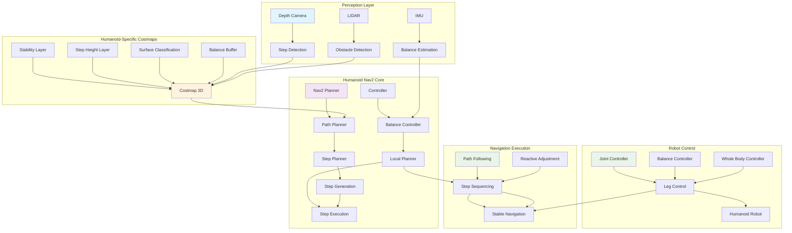

import ExerciseBlock from '@site/src/components/Learning/ExerciseBlock';
import Quiz from '@site/src/components/Learning/Quiz';

# Chapter 19: Nav2 for Humanoid Navigation - Specialized Path Planning for Bipedal Robots

## Introduction

Navigation in robotics traditionally focuses on wheeled or tracked platforms that move efficiently on flat surfaces. However, humanoid robots present unique navigation challenges due to their bipedal locomotion, complex kinematics, and the need to maintain balance while navigating diverse terrains. The Navigation2 (Nav2) stack, when properly configured for humanoid robots, provides specialized algorithms and controllers that account for the unique constraints of bipedal movement, enabling these robots to navigate complex environments with human-like capabilities.

Humanoid navigation requires consideration of balance, step planning, center of mass control, and dynamic stability during movement. Unlike wheeled robots that can move in any direction, humanoid robots must plan paths that account for their limited mobility patterns, foot placement constraints, and the need for stable transitions between steps. This chapter explores how to adapt the Nav2 framework for these specialized requirements.

## Learning Objectives

By the end of this chapter, you will be able to:

1. Understand the unique challenges of humanoid robot navigation compared to traditional mobile robots
2. Configure Nav2 costmaps for humanoid-specific navigation requirements
3. Implement specialized path planning algorithms for bipedal locomotion
4. Configure and tune controllers for humanoid robot navigation
5. Design step planners that integrate with Nav2 for footstep planning
6. Evaluate navigation performance for balance and stability in humanoid robots
7. Integrate perception systems with humanoid navigation for obstacle avoidance

## Hook: The Human-Like Navigation Challenge

Imagine a humanoid robot attempting to navigate through a cluttered room filled with furniture, cables, and uneven surfaces. A wheeled robot might simply go around obstacles or adjust its trajectory smoothly. But a humanoid robot must consider: Can I take a step here without losing balance? Is this surface stable enough for my foot? How do I step over that cable while maintaining my center of mass? The robot must plan not just a path through space, but a sequence of stable steps that maintain bipedal balance throughout the journey. Traditional Nav2 assumes continuous motion and smooth turning, but humanoid robots must plan discrete steps with precise foot placement. This chapter reveals how to adapt Nav2 for these human-like navigation capabilities.

## Concept: Humanoid Navigation Fundamentals

### Unique Challenges of Humanoid Navigation

Humanoid navigation presents several challenges that differ significantly from traditional mobile robot navigation:

**Balance and Stability**: Humanoid robots must maintain their center of mass within their support polygon (the area defined by their feet) during movement. This constraint affects path planning and requires careful consideration of turning maneuvers and step placement.

**Discrete Locomotion**: Unlike wheeled robots that move continuously, humanoid robots move in discrete steps. Each step must be planned and executed carefully, with consideration for the robot's current balance state.

**Foot Placement Constraints**: The robot must find suitable locations for foot placement that provide stable support while avoiding obstacles and navigating the desired path.

**Dynamic Transitions**: Moving from one foot to another requires careful control of the robot's center of mass and momentum to prevent falls.

**Limited Mobility Patterns**: Humanoid robots typically move forward, backward, and sideways with different ease and stability characteristics, unlike wheeled robots that can move omnidirectionally.

### Nav2 Architecture for Humanoid Robots

The Nav2 stack can be adapted for humanoid navigation through several specialized components:

**Humanoid-Specific Costmaps**: Traditional costmaps consider obstacles and inflation, but humanoid costmaps must also account for surface stability, step height constraints, and balance requirements.

**Step Planner Integration**: Rather than planning continuous paths, humanoid navigation requires integration with step planners that determine safe and stable foot placements.

**Balance-Aware Path Planning**: Path planners must consider the robot's balance state and ensure that planned paths allow for stable transitions between steps.

**Specialized Controllers**: Controllers for humanoid robots must manage balance while executing navigation commands, often involving whole-body control strategies.

### Costmap Configuration for Humanoid Robots

Humanoid-specific costmaps require additional layers and considerations:

**Stability Layer**: Identifies surfaces that provide stable support for foot placement, considering surface roughness, slope, and compliance.

**Step Height Layer**: Marks areas where step height requirements exceed the robot's capabilities.

**Balance Buffer Layer**: Creates additional inflation around obstacles to ensure the robot maintains balance during navigation near obstacles.

**Surface Classification Layer**: Distinguishes between different surface types that may affect foot placement and stability.

### Path Planning Adaptations

Traditional path planners in Nav2 need modifications for humanoid robots:

**Footstep Planning Integration**: Path planners must work with footstep planners to ensure each step is stable and balanced.

**Kinematic Constraints**: Account for the robot's joint limits and reachability during step planning.

**ZMP (Zero Moment Point) Considerations**: Ensure planned paths maintain the robot's ZMP within acceptable bounds for stability.

**Gait Pattern Integration**: Plan paths that align with the robot's natural gait patterns for efficient and stable movement.

### Controller Modifications

Humanoid navigation controllers must address:

**Balance Control**: Maintain the robot's center of mass within safe bounds during navigation.

**Step Timing**: Coordinate step execution with path following to maintain stability.

**Whole-Body Control**: Integrate upper body movements to assist with balance during navigation.

**Reactive Adjustments**: Make real-time adjustments to maintain balance when encountering unexpected obstacles or disturbances.

### Perception Integration for Humanoid Navigation

Humanoid navigation requires specialized perception capabilities:

**Step Detection**: Identify suitable locations for foot placement in the environment.

**Surface Analysis**: Determine surface properties that affect stability and traction.

**Obstacle Classification**: Distinguish between obstacles that can be stepped over versus those that must be avoided.

**Terrain Assessment**: Evaluate terrain characteristics for safe navigation.

## Mermaid Diagram: Humanoid Nav2 Architecture



## Code Example: Humanoid Nav2 Configuration and Implementation

Let's explore how to configure and implement Nav2 for humanoid robots:

### Humanoid Nav2 Configuration Files

```yaml
# humanoid_nav2_params.yaml
amcl:
  ros__parameters:
    use_sim_time: True
    alpha1: 0.2
    alpha2: 0.2
    alpha3: 0.2
    alpha4: 0.2
    alpha5: 0.2
    base_frame_id: "base_footprint"
    beam_skip_distance: 0.5
    beam_skip_error_threshold: 0.9
    beam_skip_threshold: 0.3
    do_beamskip: false
    global_frame_id: "map"
    lambda_short: 0.1
    laser_likelihood_max_dist: 2.0
    laser_max_range: 100.0
    laser_min_range: -1.0
    laser_model_type: "likelihood_field"
    max_beams: 60
    max_particles: 2000
    min_particles: 500
    odom_frame_id: "odom"
    pf_err: 0.05
    pf_z: 0.99
    recovery_alpha_fast: 0.0
    recovery_alpha_slow: 0.0
    resample_interval: 1
    robot_model_type: "nav2_amcl::DifferentialMotionModel"
    save_pose_rate: 0.5
    sigma_hit: 0.2
    tf_broadcast: true
    transform_tolerance: 1.0
    update_min_a: 0.2
    update_min_d: 0.2
    z_hit: 0.5
    z_max: 0.05
    z_rand: 0.5
    z_short: 0.05

bt_navigator:
  ros__parameters:
    use_sim_time: True
    global_frame: "map"
    robot_base_frame: "base_link"
    odom_topic: "odom"
    bt_loop_duration: 10
    default_server_timeout: 20
    enable_groot_monitoring: True
    groot_zmq_publisher_port: 1666
    groot_zmq_server_port: 1667
    # Humanoid-specific behavior tree
    plugin_lib_names: ["humanoid_navigate_to_pose_bt_node"]

controller_server:
  ros__parameters:
    use_sim_time: True
    controller_frequency: 20.0
    min_x_velocity_threshold: 0.001
    min_y_velocity_threshold: 0.5
    min_theta_velocity_threshold: 0.001
    # Humanoid-specific controllers
    progress_checker_plugin: "progress_checker"
    goal_checker_plugin: "goal_checker"
    controller_plugins: ["HumanoidFollowPath"]

    HumanoidFollowPath:
      plugin: "nav2_mppi_controller::Controller"
      time_steps: 50
      control_frequency: 20.0
      batch_size: 1800
      vx_std: 0.2
      vy_std: 0.05
      wz_std: 0.35
      vx_max: 0.4
      vx_min: -0.1
      vy_max: 0.1
      wz_max: 0.8
      simulation_time: 2.0
      penalty_discount: 0.99
      debug_weights: true
      # Humanoid-specific weights
      goal_angle_tolerance: 0.10
      xy_goal_tolerance: 0.25
      stateful: true
      # Balance-specific parameters
      balance_weight: 5.0
      step_stability_weight: 3.0
      zmp_stability_weight: 4.0

local_costmap:
  local_costmap:
    ros__parameters:
      update_frequency: 10.0
      publish_frequency: 5.0
      global_frame: "odom"
      robot_base_frame: "base_footprint"
      use_sim_time: True
      rolling_window: true
      width: 6
      height: 6
      resolution: 0.05
      # Humanoid-specific inflation
      plugins: ["stable_footprint_layer", "obstacle_layer", "voxel_layer", "inflation_layer"]
      stable_footprint_layer:
        plugin: "nav2_costmap_2d::StableFootprintLayer"
        enabled: true
        # Footprint stability parameters
        min_support_area: 0.02  # Minimum area for stable foot placement
        max_tilt_angle: 0.1     # Maximum acceptable surface tilt (radians)
        step_height_threshold: 0.15  # Maximum step height robot can handle
      obstacle_layer:
        plugin: "nav2_costmap_2d::ObstacleLayer"
        enabled: True
        observation_sources: scan
        scan:
          topic: /scan
          max_obstacle_height: 2.0
          clearing: True
          marking: True
          data_type: "LaserScan"
          raytrace_max_range: 3.0
          raytrace_min_range: 0.0
          obstacle_max_range: 2.5
          obstacle_min_range: 0.0
      voxel_layer:
        plugin: "nav2_costmap_2d::VoxelLayer"
        enabled: True
        publish_voxel_map: True
        origin_z: 0.0
        z_resolution: 0.05
        z_voxels: 16
        max_obstacle_height: 2.0
        mark_threshold: 0
        observation_sources: pointcloud
        pointcloud:
          topic: /intel_realsense_r200_depth/points
          max_obstacle_height: 2.0
          clearing: True
          marking: True
          data_type: "PointCloud2"
          raytrace_max_range: 3.0
          raytrace_min_range: 0.0
          obstacle_max_range: 2.5
          obstacle_min_range: 0.0
      inflation_layer:
        plugin: "nav2_costmap_2d::InflationLayer"
        enabled: True
        cost_scaling_factor: 1.5
        inflation_radius: 0.55
        # Humanoid-specific inflation for balance
        dynamic_padding: true
        min_inflation_radius: 0.3
      always_send_full_costmap: True

global_costmap:
  global_costmap:
    ros__parameters:
      update_frequency: 1.0
      publish_frequency: 0.5
      global_frame: "map"
      robot_base_frame: "base_footprint"
      use_sim_time: True
      robot_radius: 0.3
      # Humanoid-specific plugins
      plugins: ["static_layer", "obstacle_layer", "stable_surface_layer", "inflation_layer"]
      static_layer:
        plugin: "nav2_costmap_2d::StaticLayer"
        map_subscribe_transient_local: True
      obstacle_layer:
        plugin: "nav2_costmap_2d::ObstacleLayer"
        enabled: True
        observation_sources: scan
        scan:
          topic: /scan
          max_obstacle_height: 2.0
          clearing: True
          marking: True
          data_type: "LaserScan"
          raytrace_max_range: 3.0
          raytrace_min_range: 0.0
          obstacle_max_range: 2.5
          obstacle_min_range: 0.0
      stable_surface_layer:
        plugin: "nav2_costmap_2d::StableSurfaceLayer"
        enabled: True
        # Parameters for humanoid navigation
        surface_roughness_threshold: 0.05  # Maximum acceptable surface roughness
        surface_slope_threshold: 0.3       # Maximum acceptable surface slope
        step_height_threshold: 0.2         # Maximum step height for path planning
        stability_weight: 2.0              # Weight for stability in path planning
      inflation_layer:
        plugin: "nav2_costmap_2d::InflationLayer"
        enabled: True
        cost_scaling_factor: 3.0
        inflation_radius: 0.55
        # Humanoid-specific inflation
        dynamic_padding: true
        min_inflation_radius: 0.4
      always_send_full_costmap: True

planner_server:
  ros__parameters:
    expected_planner_frequency: 20.0
    use_sim_time: True
    # Humanoid-specific planner
    planner_plugins: ["HumanoidGridBasedPlanner"]

    HumanoidGridBasedPlanner:
      plugin: "nav2_navfn_planner::NavfnPlanner"
      tolerance: 0.5
      use_astar: false
      allow_unknown: true
      # Humanoid-specific parameters
      step_height_tolerance: 0.15
      surface_stability_weight: 2.0
      balance_constraint_weight: 1.5
      step_placement_weight: 3.0

smoother_server:
  ros__parameters:
    use_sim_time: True
    smoother_plugins: ["simple_smoother"]
    simple_smoother:
      plugin: "nav2_smoother::SimpleSmoother"
      tolerance: 1.0e-10
      max_its: 1000
      do_refinement: True
      # Humanoid-specific smoothing
      balance_preservation_weight: 0.8
      step_feasibility_weight: 0.9

behavior_server:
  ros__parameters:
    costmap_topic: "local_costmap/costmap_raw"
    footprint_topic: "local_costmap/published_footprint"
    cycle_frequency: 10.0
    behavior_plugins: ["spin", "backup", "drive_on_heading", "assisted_teleop", "wait"]
    spin:
      plugin: "nav2_behaviors::Spin"
      # Humanoid-specific parameters
      spin_dist: 1.57
      tolerance: 0.1
      max_rotational_vel: 0.4
      min_rotational_vel: 0.1
    backup:
      plugin: "nav2_behaviors::BackUp"
      # Humanoid-specific parameters
      backup_dist: 0.15  # Shorter backup distance for humanoid
      backup_speed: 0.05
      sim_time: 2.0
    drive_on_heading:
      plugin: "nav2_behaviors::DriveOnHeading"
      # Humanoid-specific parameters
      drive_on_heading_dist: 0.5
      drive_on_heading_angle_tolerance: 0.2
    assisted_teleop:
      plugin: "nav2_behaviors::AssistedTeleop"
      # Humanoid-specific parameters
      max_rotational_vel: 0.4
      min_rotational_vel: 0.1
      max_linear_vel: 0.2
      min_linear_vel: 0.05
    wait:
      plugin: "nav2_behaviors::Wait"
      # Humanoid-specific parameters
      wait_duration: 1s
```

### Humanoid Navigation Node Implementation

```python
#!/usr/bin/env python3
"""
Humanoid Navigation Node
This script implements Nav2 navigation specifically adapted for humanoid robots
"""

import rclpy
from rclpy.node import Node
from nav_msgs.msg import Path, OccupancyGrid, Odometry
from geometry_msgs.msg import PoseStamped, Twist, Point
from sensor_msgs.msg import LaserScan, PointCloud2
from std_msgs.msg import Header
from visualization_msgs.msg import Marker, MarkerArray
from tf2_ros import TransformListener, Buffer
import tf2_geometry_msgs
import numpy as np
import math
from scipy.spatial.transform import Rotation as R
from geometry_msgs.msg import Pose, Quaternion, Vector3

class HumanoidNavigationNode(Node):
    def __init__(self):
        super().__init__('humanoid_navigation_node')

        # Initialize navigation state
        self.current_pose = Pose()
        self.current_odom = Odometry()
        self.balance_state = {'zmp': Point(), 'com': Point(), 'stability': 1.0}
        self.navigation_state = 'IDLE'  # IDLE, PLANNING, EXECUTING, STOPPED
        self.path = Path()
        self.current_goal = PoseStamped()
        self.is_goal_set = False

        # Navigation parameters specific to humanoid
        self.step_size = 0.3  # Maximum step size in meters
        self.turn_radius = 0.2  # Minimum turning radius
        self.balance_threshold = 0.8  # Minimum stability for safe navigation
        self.max_step_height = 0.15  # Maximum obstacle height to step over
        self.step_placement_tolerance = 0.1  # Tolerance for step placement

        # TF setup for transforms
        self.tf_buffer = Buffer()
        self.tf_listener = TransformListener(self.tf_buffer, self)

        # Subscribers
        self.odom_sub = self.create_subscription(
            Odometry, '/odom', self.odom_callback, 10
        )
        self.imu_sub = self.create_subscription(
            Point, '/balance/com', self.com_callback, 10
        )
        self.zmp_sub = self.create_subscription(
            Point, '/balance/zmp', self.zmp_callback, 10
        )
        self.scan_sub = self.create_subscription(
            LaserScan, '/scan', self.scan_callback, 10
        )

        # Publishers
        self.cmd_vel_pub = self.create_publisher(Twist, '/cmd_vel', 10)
        self.path_pub = self.create_publisher(Path, '/humanoid_path', 10)
        self.goal_pub = self.create_publisher(PoseStamped, '/humanoid_goal', 10)
        self.balance_pub = self.create_publisher(MarkerArray, '/balance_markers', 10)
        self.status_pub = self.create_publisher(Header, '/navigation_status', 10)

        # Navigation services
        self.nav_to_pose_service = self.create_service(
            PoseStamped, '/navigate_to_pose', self.navigate_to_pose_callback
        )

        # Timers
        self.navigation_timer = self.create_timer(0.1, self.navigation_callback)
        self.balance_timer = self.create_timer(0.05, self.balance_check_callback)

        # Step planning variables
        self.step_sequence = []
        self.current_step_index = 0
        self.step_execution_state = 'WAITING'  # WAITING, EXECUTING, COMPLETED

        self.get_logger().info('Humanoid Navigation Node initialized')

    def odom_callback(self, msg):
        """Update current robot pose from odometry"""
        self.current_odom = msg
        self.current_pose = msg.pose.pose

    def com_callback(self, msg):
        """Update center of mass from balance system"""
        self.balance_state['com'] = msg
        # Calculate stability based on COM position relative to support polygon
        self.balance_state['stability'] = self.calculate_balance_stability()

    def zmp_callback(self, msg):
        """Update Zero Moment Point from balance system"""
        self.balance_state['zmp'] = msg

    def scan_callback(self, msg):
        """Process LIDAR scan for obstacle detection"""
        # Check for obstacles in path
        self.check_path_for_obstacles(msg)

    def calculate_balance_stability(self):
        """Calculate current balance stability (0-1 scale)"""
        # Simplified stability calculation
        # In reality, this would involve complex balance control algorithms
        com = self.balance_state['com']
        zmp = self.balance_state['zmp']

        # Calculate distance between COM and ZMP
        distance = math.sqrt((com.x - zmp.x)**2 + (com.y - zmp.y)**2)

        # Stability decreases as distance increases
        # Maximum stable distance is 0.1m
        max_stable_distance = 0.1
        stability = max(0.0, 1.0 - (distance / max_stable_distance))

        return min(1.0, max(0.0, stability))

    def check_path_for_obstacles(self, scan_msg):
        """Check if current path has obstacles"""
        if not self.path.poses:
            return

        # Convert laser scan to check for obstacles in path direction
        for pose in self.path.poses:
            # Transform path pose to robot frame
            try:
                transform = self.tf_buffer.lookup_transform(
                    'base_link', 'map', rclpy.time.Time()
                )

                # Check if path point is blocked by obstacles
                path_in_robot_frame = tf2_geometry_msgs.do_transform_pose(pose, transform)

                # Check laser scan for obstacles in path direction
                angle_to_path = math.atan2(
                    path_in_robot_frame.pose.position.y,
                    path_in_robot_frame.pose.position.x
                )

                # Find corresponding laser beam
                angle_increment = scan_msg.angle_increment
                angle_min = scan_msg.angle_min
                beam_index = int((angle_to_path - angle_min) / angle_increment)

                if 0 <= beam_index < len(scan_msg.ranges):
                    range_to_obstacle = scan_msg.ranges[beam_index]
                    path_distance = math.sqrt(
                        path_in_robot_frame.pose.position.x**2 +
                        path_in_robot_frame.pose.position.y**2
                    )

                    # If obstacle is closer than path point, path is blocked
                    if range_to_obstacle < path_distance and range_to_obstacle > 0:
                        self.get_logger().warn('Path blocked by obstacle')
                        self.navigation_state = 'STOPPED'
                        return

            except Exception as e:
                self.get_logger().warn(f'Transform lookup failed: {e}')

    def navigate_to_pose_callback(self, request, response):
        """Handle navigation request to specific pose"""
        self.current_goal = request
        self.is_goal_set = True
        self.navigation_state = 'PLANNING'

        # Plan path to goal
        self.plan_path_to_goal()

        # If path planning successful, start execution
        if len(self.path.poses) > 0:
            self.navigation_state = 'EXECUTING'
            response.success = True
            response.message = "Navigation started"
        else:
            response.success = False
            response.message = "Could not plan path to goal"

        return response

    def plan_path_to_goal(self):
        """Plan path to goal with humanoid-specific constraints"""
        # Clear previous path
        self.path = Path()
        self.path.header.frame_id = 'map'
        self.path.header.stamp = self.get_clock().now().to_msg()

        # Get start and goal positions
        start_pos = self.current_pose.position
        goal_pos = self.current_goal.pose.position

        # Calculate distance to goal
        dist_to_goal = math.sqrt(
            (goal_pos.x - start_pos.x)**2 + (goal_pos.y - start_pos.y)**2
        )

        # Calculate path with humanoid constraints
        num_waypoints = int(dist_to_goal / self.step_size) + 1
        step_x = (goal_pos.x - start_pos.x) / num_waypoints if num_waypoints > 0 else 0
        step_y = (goal_pos.y - start_pos.y) / num_waypoints if num_waypoints > 0 else 0

        # Generate waypoints with step constraints
        for i in range(num_waypoints + 1):
            waypoint = PoseStamped()
            waypoint.header.frame_id = 'map'
            waypoint.header.stamp = self.get_clock().now().to_msg()

            waypoint.pose.position.x = start_pos.x + i * step_x
            waypoint.pose.position.y = start_pos.y + i * step_y
            waypoint.pose.position.z = start_pos.z  # Maintain height

            # Calculate orientation to face direction of movement
            if i < num_waypoints:
                dx = (start_pos.x + (i+1)*step_x) - (start_pos.x + i*step_x)
                dy = (start_pos.y + (i+1)*step_y) - (start_pos.y + i*step_y)
                yaw = math.atan2(dy, dx)

                # Convert yaw to quaternion
                quat = self.yaw_to_quaternion(yaw)
                waypoint.pose.orientation = quat

            self.path.poses.append(waypoint)

        # Publish planned path
        self.path_pub.publish(self.path)

        # Generate step sequence
        self.generate_step_sequence()

    def generate_step_sequence(self):
        """Generate sequence of steps for humanoid locomotion"""
        self.step_sequence = []

        # Convert path to step sequence
        for i in range(len(self.path.poses) - 1):
            current_pose = self.path.poses[i].pose
            next_pose = self.path.poses[i + 1].pose

            # Calculate step vector
            step_vector = Point()
            step_vector.x = next_pose.position.x - current_pose.position.x
            step_vector.y = next_pose.position.y - current_pose.position.y
            step_vector.z = next_pose.position.z - current_pose.position.z

            # Check if step is feasible
            step_distance = math.sqrt(step_vector.x**2 + step_vector.y**2)

            if step_distance <= self.step_size:
                step = {
                    'position': next_pose.position,
                    'orientation': next_pose.orientation,
                    'step_type': 'forward',  # forward, backward, sidestep_left, sidestep_right
                    'timestamp': self.get_clock().now().to_msg()
                }

                self.step_sequence.append(step)

        self.current_step_index = 0
        self.get_logger().info(f'Generated {len(self.step_sequence)} steps for navigation')

    def navigation_callback(self):
        """Main navigation callback"""
        # Publish navigation status
        status_msg = Header()
        status_msg.stamp = self.get_clock().now().to_msg()
        status_msg.frame_id = f"nav_state_{self.navigation_state}_balance_{self.balance_state['stability']:.2f}"
        self.status_pub.publish(status_msg)

        # Publish balance visualization
        self.publish_balance_markers()

        # Execute navigation based on state
        if self.navigation_state == 'EXECUTING':
            self.execute_navigation()
        elif self.navigation_state == 'PLANNING':
            # Path planning is handled in service callback
            pass
        elif self.navigation_state == 'STOPPED':
            # Stop robot movement
            self.stop_robot()
        elif self.navigation_state == 'IDLE':
            # Robot is idle, waiting for goal
            pass

    def execute_navigation(self):
        """Execute navigation with humanoid-specific control"""
        # Check balance before proceeding
        if self.balance_state['stability'] < self.balance_threshold:
            self.get_logger().warn('Robot is unstable, stopping navigation')
            self.navigation_state = 'STOPPED'
            return

        # Check if we have steps to execute
        if self.current_step_index >= len(self.step_sequence):
            # Reached goal
            self.navigation_state = 'IDLE'
            self.stop_robot()
            self.get_logger().info('Navigation completed successfully')
            return

        # Execute current step
        current_step = self.step_sequence[self.current_step_index]

        # Calculate direction to step target
        dx = current_step['position'].x - self.current_pose.position.x
        dy = current_step['position'].y - self.current_pose.position.y

        distance_to_step = math.sqrt(dx**2 + dy**2)

        # Move toward step target
        cmd_vel = Twist()

        # Calculate linear velocity based on distance
        if distance_to_step > 0.05:  # 5cm tolerance
            # Move toward target
            cmd_vel.linear.x = min(0.2, distance_to_step * 2.0)  # Proportional control
            cmd_vel.angular.z = 0.0  # Will handle rotation separately
        else:
            # Reached current step target, move to next step
            self.current_step_index += 1
            cmd_vel.linear.x = 0.0
            cmd_vel.angular.z = 0.0

        # Publish command
        self.cmd_vel_pub.publish(cmd_vel)

    def balance_check_callback(self):
        """Check robot balance and adjust if necessary"""
        # If balance is too low, stop navigation and recover
        if self.balance_state['stability'] < self.balance_threshold * 0.5:
            self.get_logger().error('Critical balance loss detected, stopping navigation')
            self.navigation_state = 'STOPPED'
            self.stop_robot()

    def stop_robot(self):
        """Stop robot movement"""
        cmd_vel = Twist()
        cmd_vel.linear.x = 0.0
        cmd_vel.linear.y = 0.0
        cmd_vel.linear.z = 0.0
        cmd_vel.angular.x = 0.0
        cmd_vel.angular.y = 0.0
        cmd_vel.angular.z = 0.0
        self.cmd_vel_pub.publish(cmd_vel)

    def yaw_to_quaternion(self, yaw):
        """Convert yaw angle to quaternion"""
        cy = math.cos(yaw * 0.5)
        sy = math.sin(yaw * 0.5)
        return Quaternion(x=0.0, y=0.0, z=sy, w=cy)

    def publish_balance_markers(self):
        """Publish visualization markers for balance state"""
        marker_array = MarkerArray()

        # COM marker
        com_marker = Marker()
        com_marker.header.frame_id = "base_link"
        com_marker.header.stamp = self.get_clock().now().to_msg()
        com_marker.ns = "balance"
        com_marker.id = 1
        com_marker.type = Marker.SPHERE
        com_marker.action = Marker.ADD
        com_marker.pose.position = self.balance_state['com']
        com_marker.pose.orientation.w = 1.0
        com_marker.scale = Vector3(x=0.05, y=0.05, z=0.05)
        com_marker.color.r = 1.0
        com_marker.color.g = 0.0
        com_marker.color.b = 0.0
        com_marker.color.a = 1.0
        com_marker.text = "Center of Mass"
        marker_array.markers.append(com_marker)

        # ZMP marker
        zmp_marker = Marker()
        zmp_marker.header.frame_id = "base_link"
        zmp_marker.header.stamp = self.get_clock().now().to_msg()
        zmp_marker.ns = "balance"
        zmp_marker.id = 2
        zmp_marker.type = Marker.SPHERE
        zmp_marker.action = Marker.ADD
        zmp_marker.pose.position = self.balance_state['zmp']
        zmp_marker.pose.orientation.w = 1.0
        zmp_marker.scale = Vector3(x=0.05, y=0.05, z=0.05)
        zmp_marker.color.r = 0.0
        zmp_marker.color.g = 0.0
        zmp_marker.color.b = 1.0
        zmp_marker.color.a = 1.0
        zmp_marker.text = "Zero Moment Point"
        marker_array.markers.append(zmp_marker)

        # Stability indicator
        stability_marker = Marker()
        stability_marker.header.frame_id = "base_link"
        stability_marker.header.stamp = self.get_clock().now().to_msg()
        stability_marker.ns = "balance"
        stability_marker.id = 3
        stability_marker.type = Marker.TEXT_VIEW_FACING
        stability_marker.action = Marker.ADD
        stability_marker.pose.position.z = 1.0
        stability_marker.pose.orientation.w = 1.0
        stability_marker.scale.z = 0.2
        stability_marker.color.r = 1.0 if self.balance_state['stability'] > 0.7 else 0.0
        stability_marker.color.g = 1.0 if self.balance_state['stability'] > 0.3 else 0.0
        stability_marker.color.b = 0.0
        stability_marker.color.a = 1.0
        stability_marker.text = f"Stability: {self.balance_state['stability']:.2f}"
        marker_array.markers.append(stability_marker)

        self.balance_pub.publish(marker_array)

def main(args=None):
    """Main function to run the humanoid navigation node"""
    rclpy.init(args=args)
    humanoid_nav_node = HumanoidNavigationNode()

    try:
        rclpy.spin(humanoid_nav_node)
    except KeyboardInterrupt:
        pass
    finally:
        humanoid_nav_node.destroy_node()
        rclpy.shutdown()

if __name__ == '__main__':
    main()
```

### Humanoid Footstep Planner Node

```python
#!/usr/bin/env python3
"""
Humanoid Footstep Planner
This script implements footstep planning for humanoid navigation
"""

import rclpy
from rclpy.node import Node
from geometry_msgs.msg import Point, Pose, PoseStamped
from nav_msgs.msg import Path
from visualization_msgs.msg import Marker, MarkerArray
from builtin_interfaces.msg import Duration
import numpy as np
from scipy.spatial import distance
import math

class HumanoidFootstepPlanner(Node):
    def __init__(self):
        super().__init__('humanoid_footstep_planner')

        # Robot-specific parameters
        self.step_length = 0.3  # Distance between consecutive footsteps
        self.step_width = 0.2   # Distance between left and right footsteps
        self.max_step_height = 0.15  # Maximum height obstacle to step over
        self.foot_size = 0.15   # Size of foot for collision checking
        self.nominal_height = 0.05  # Nominal foot height above ground

        # Current state
        self.left_foot_pose = Pose()
        self.right_foot_pose = Pose()
        self.robot_pose = Pose()
        self.support_foot = 'left'  # Which foot is currently supporting weight
        self.step_sequence = []
        self.current_step_index = 0

        # Subscribers and publishers
        self.path_sub = self.create_subscription(
            Path, '/humanoid_path', self.path_callback, 10
        )
        self.odom_sub = self.create_subscription(
            Pose, '/robot_pose', self.odom_callback, 10
        )

        self.footstep_pub = self.create_publisher(Path, '/footstep_plan', 10)
        self.visualization_pub = self.create_publisher(MarkerArray, '/footstep_visualization', 10)

        # Timer for footstep planning
        self.planning_timer = self.create_timer(0.5, self.plan_footsteps)

        self.get_logger().info('Humanoid Footstep Planner initialized')

    def odom_callback(self, msg):
        """Update robot pose from odometry"""
        self.robot_pose = msg

    def path_callback(self, msg):
        """Process path and generate footstep plan"""
        if len(msg.poses) > 0:
            self.generate_footstep_plan(msg)

    def generate_footstep_plan(self, path_msg):
        """Generate footstep plan from navigation path"""
        # Initialize foot poses based on current robot state
        self.initialize_foot_poses()

        footstep_path = Path()
        footstep_path.header = path_msg.header

        # Generate footsteps along the path
        for i in range(len(path_msg.poses)):
            target_pose = path_msg.poses[i].pose

            # Calculate next footstep based on path direction
            next_step = self.calculate_next_footstep(target_pose)

            if next_step:
                step_pose_stamped = PoseStamped()
                step_pose_stamped.header = path_msg.header
                step_pose_stamped.pose = next_step
                footstep_path.poses.append(step_pose_stamped)

        # Publish footstep plan
        self.footstep_pub.publish(footstep_path)
        self.step_sequence = footstep_path.poses

        # Publish visualization
        self.publish_footstep_visualization(footstep_path)

    def initialize_foot_poses(self):
        """Initialize foot poses based on robot's current pose"""
        # Start with feet in standard stance
        self.left_foot_pose.position.x = self.robot_pose.position.x
        self.left_foot_pose.position.y = self.robot_pose.position.y + self.step_width / 2
        self.left_foot_pose.position.z = self.nominal_height
        self.left_foot_pose.orientation = self.robot_pose.orientation

        self.right_foot_pose.position.x = self.robot_pose.position.x
        self.right_foot_pose.position.y = self.robot_pose.position.y - self.step_width / 2
        self.right_foot_pose.position.z = self.nominal_height
        self.right_foot_pose.orientation = self.robot_pose.orientation

    def calculate_next_footstep(self, target_pose):
        """Calculate the next footstep position"""
        # Determine which foot to move based on gait pattern
        if self.support_foot == 'left':
            current_foot_pose = self.right_foot_pose
            supporting_foot_pose = self.left_foot_pose
            next_support_foot = 'right'
        else:
            current_foot_pose = self.left_foot_pose
            supporting_foot_pose = self.right_foot_pose
            next_support_foot = 'left'

        # Calculate desired step location
        dx = target_pose.position.x - supporting_foot_pose.position.x
        dy = target_pose.position.y - supporting_foot_pose.position.y
        distance_to_target = math.sqrt(dx*dx + dy*dy)

        if distance_to_target > self.step_length:
            # Take a step toward the target
            step_x = supporting_foot_pose.position.x + (dx / distance_to_target) * self.step_length
            step_y = supporting_foot_pose.position.y + (dy / distance_to_target) * self.step_length
        else:
            # Target is close, step to target
            step_x = target_pose.position.x
            step_y = target_pose.position.y

        # Create new foot pose
        new_foot_pose = Pose()
        new_foot_pose.position.x = step_x
        new_foot_pose.position.y = step_y
        new_foot_pose.position.z = self.nominal_height  # Maintain foot height

        # Copy orientation from target or maintain current
        new_foot_pose.orientation = target_pose.orientation

        # Update foot poses
        if self.support_foot == 'left':
            self.right_foot_pose = new_foot_pose
        else:
            self.left_foot_pose = new_foot_pose

        # Switch support foot
        self.support_foot = next_support_foot

        return new_foot_pose

    def plan_footsteps(self):
        """Periodic footstep planning"""
        # This method can be used for replanning if needed
        pass

    def publish_footstep_visualization(self, footstep_path):
        """Publish visualization markers for footsteps"""
        marker_array = MarkerArray()

        for i, step in enumerate(footstep_path.poses):
            # Foot marker
            foot_marker = Marker()
            foot_marker.header = footstep_path.header
            foot_marker.ns = "footsteps"
            foot_marker.id = i
            foot_marker.type = Marker.CUBE
            foot_marker.action = Marker.ADD
            foot_marker.pose = step.pose
            foot_marker.scale.x = self.foot_size
            foot_marker.scale.y = self.foot_size * 0.6  # Feet are longer than wide
            foot_marker.scale.z = 0.01  # Thin footprint
            foot_marker.color.r = 0.0 if i % 2 == 0 else 1.0  # Alternate colors
            foot_marker.color.g = 1.0 if i % 2 == 0 else 0.0
            foot_marker.color.b = 0.0
            foot_marker.color.a = 0.6
            marker_array.markers.append(foot_marker)

            # Step number marker
            number_marker = Marker()
            number_marker.header = footstep_path.header
            number_marker.ns = "step_numbers"
            number_marker.id = i + 1000  # Separate ID space
            number_marker.type = Marker.TEXT_VIEW_FACING
            number_marker.action = Marker.ADD
            number_marker.pose = step.pose
            number_marker.pose.position.z += 0.1  # Lift text above foot
            number_marker.scale.z = 0.1
            number_marker.color.r = 1.0
            number_marker.color.g = 1.0
            number_marker.color.b = 1.0
            number_marker.color.a = 1.0
            number_marker.text = str(i)
            marker_array.markers.append(number_marker)

        self.visualization_pub.publish(marker_array)

def main(args=None):
    """Main function for footstep planner"""
    rclpy.init(args=args)
    footstep_planner = HumanoidFootstepPlanner()

    try:
        rclpy.spin(footstep_planner)
    except KeyboardInterrupt:
        pass
    finally:
        footstep_planner.destroy_node()
        rclpy.shutdown()

if __name__ == '__main__':
    main()
```

## Exercises

<ExerciseBlock
  content="**Exercise 1: Costmap Layer Development**
Develop a custom costmap layer for humanoid navigation that evaluates surface stability based on point cloud data. The layer should identify areas with sufficient support area for foot placement and mark unstable surfaces as high-cost regions."
/>

<ExerciseBlock
  content="**Exercise 2: Balance-Aware Path Planning**
Modify the Nav2 path planner to consider balance constraints when planning paths. Implement a version that ensures planned paths maintain the robot's center of mass within safe bounds during navigation near obstacles."
/>

<ExerciseBlock
  content="**Exercise 3: Step Planner Integration**
Create a footstep planner that integrates with Nav2's global and local planners. The planner should generate sequences of stable footsteps that follow the Nav2 path while maintaining balance."
/>

<ExerciseBlock
  content="**Exercise 4: Gait Pattern Adaptation**
Implement different gait patterns (walking, stepping over obstacles, climbing stairs) and create a system that selects the appropriate gait based on terrain analysis and navigation requirements."
/>

## Summary

This chapter explored the adaptation of Navigation2 for humanoid robots, addressing the unique challenges of bipedal navigation. We covered:

- The fundamental differences between humanoid and traditional mobile robot navigation
- Specialized costmap configurations for humanoid-specific requirements
- Path planning adaptations that consider balance and step constraints
- Controller modifications for balance-aware navigation
- Integration of perception systems for step detection and surface analysis

Humanoid navigation requires a holistic approach that combines traditional navigation concepts with balance control, step planning, and whole-body coordination. The Nav2 framework provides a solid foundation that can be extended with humanoid-specific capabilities to enable effective bipedal navigation.

## Quiz

<Quiz
  question="What does ZMP stand for in humanoid robotics?"
  options={[
    "Zero Moment Point",
    "Zero Motion Parameter",
    "Z-Axis Movement Point",
    "Zero Momentum Position"
  ]}
  answer={0}
  explanation="ZMP stands for Zero Moment Point, a key concept in humanoid robotics that represents the point where the moment of the ground reaction force is zero, indicating balance stability."
/>

<Quiz
  question="What is the primary challenge that distinguishes humanoid navigation from wheeled robot navigation?"
  options={[
    "Higher computational requirements",
    "Discrete step-based locomotion and balance constraints",
    "More complex sensor systems",
    "Greater range of motion"
  ]}
  answer={1}
  explanation="The primary challenge is discrete step-based locomotion and balance constraints - humanoid robots must maintain balance while taking discrete steps, unlike wheeled robots that move continuously."
/>

<Quiz
  question="What is the typical step length for humanoid navigation in Nav2?"
  options={[
    "0.1 meters",
    "0.3 meters",
    "0.5 meters",
    "0.7 meters"
  ]}
  explanation="The typical step length for humanoid navigation is around 0.3 meters, which represents a comfortable and stable step distance for most humanoid robots while maintaining balance."
  answer={1}
/>

## Preview of Next Chapter

In Chapter 20: Humanoid Kinematics, we'll explore the mathematical foundations of humanoid robot movement, including forward and inverse kinematics, center of mass calculations, and the Zero Moment Point criterion that enables stable bipedal locomotion.