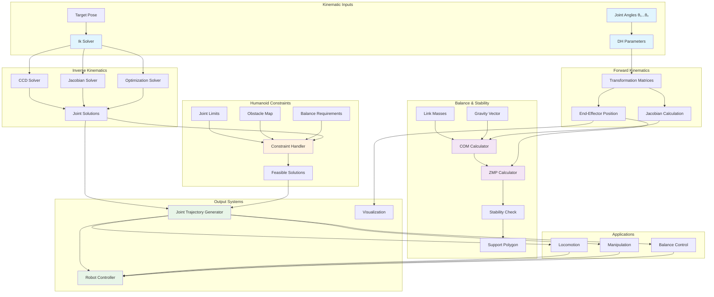

import ExerciseBlock from '@site/src/components/Learning/ExerciseBlock';
import Quiz from '@site/src/components/Learning/Quiz';

# Chapter 20: Humanoid Kinematics - Forward and Inverse Kinematics for Bipedal Robots

## Introduction

Humanoid kinematics forms the mathematical foundation for understanding and controlling the complex movements of bipedal robots. Unlike simple robotic arms, humanoid robots possess multiple interconnected chains of joints that must work in coordination to achieve stable locomotion, manipulation, and balance. This chapter delves into the sophisticated mathematics that govern how these robots move, focusing on forward kinematics (calculating end-effector positions from joint angles) and inverse kinematics (determining joint angles to achieve desired end-effector positions) specifically adapted for the unique challenges of humanoid robotics.

The complexity of humanoid kinematics extends beyond basic joint-to-position calculations to include considerations of balance, center of mass control, and the Zero Moment Point (ZMP) criterion that ensures stable bipedal locomotion. Understanding these mathematical principles is essential for developing controllers that enable humanoid robots to walk, manipulate objects, and maintain stability in dynamic environments.

## Learning Objectives

By the end of this chapter, you will be able to:

1. Understand the mathematical foundations of forward and inverse kinematics for humanoid robots
2. Calculate forward kinematics for humanoid robot chains (arms, legs)
3. Implement inverse kinematics solvers for humanoid manipulation and locomotion
4. Compute and analyze the center of mass for humanoid robots
5. Apply the Zero Moment Point (ZMP) criterion for stable locomotion
6. Design kinematic constraints for humanoid joint limits and balance
7. Evaluate kinematic solutions for reachability, stability, and efficiency

## Hook: The Mathematics of Human Movement

Consider the seemingly simple act of reaching for an object. When a human reaches for a cup on a table, their brain instantaneously calculates a complex set of joint angles across multiple limbs to position their hand correctly while maintaining balance. A humanoid robot must perform similar calculations, but explicitly and mathematically. The robot must solve inverse kinematics to determine how to move its shoulder, elbow, and wrist joints to reach the cup, while simultaneously adjusting its leg joints to maintain balance and prevent falling. This mathematical dance of joint coordination is what makes humanoid robots capable of human-like movement. This chapter reveals the mathematical principles that enable robots to move with the fluidity and stability of humans.

## Concept: Humanoid Kinematics Fundamentals

### Forward Kinematics in Humanoid Robots

Forward kinematics calculates the position and orientation of end-effectors (hands, feet) based on known joint angles. For humanoid robots, this involves multiple kinematic chains:

**Leg Chain Kinematics**: From hip to foot, involving hip, knee, and ankle joints. The leg chain must account for the robot's stance and balance requirements.

**Arm Chain Kinematics**: From shoulder to hand, involving shoulder, elbow, and wrist joints. Arm kinematics must consider the robot's center of mass and balance during manipulation.

**Whole-Body Kinematics**: Coordination of all chains to achieve complex movements while maintaining stability.

The forward kinematics equations use transformation matrices to propagate joint positions through the kinematic chain:

T_total = T_base × T_1(θ₁) × T_2(θ₂) × ... × T_n(θ_n)

Where T_i(θ_i) represents the transformation matrix for joint i as a function of its angle θ_i.

### Inverse Kinematics Challenges

Inverse kinematics for humanoid robots presents several unique challenges:

**Redundancy**: Humanoid robots typically have more degrees of freedom than required for basic tasks, leading to multiple possible solutions. The robot must select the most appropriate solution based on balance, comfort, or other criteria.

**Balance Constraints**: Solutions must maintain the robot's center of mass within the support polygon defined by the feet.

**Joint Limits**: Solutions must respect physical joint limits to prevent damage and ensure realistic movements.

**Obstacle Avoidance**: Solutions should avoid collisions with the environment and self-collisions between robot parts.

**Multiple End-Effector Control**: Humanoid robots often need to control multiple end-effectors simultaneously (e.g., both hands and both feet) while maintaining coordination.

### Denavit-Hartenberg Parameters for Humanoid Robots

The Denavit-Hartenberg (DH) convention provides a systematic method for describing the geometry of kinematic chains. For humanoid robots, DH parameters must be adapted to accommodate the complex joint arrangements:

**Hip Joint Modeling**: The hip joint is typically modeled as a 3-DOF spherical joint allowing for complex leg movements.

**Knee Joint Modeling**: The knee joint is a 1-DOF revolute joint that primarily allows flexion and extension.

**Ankle Joint Modeling**: The ankle joint is typically a 2-DOF joint allowing for pitch and roll movements.

**Shoulder Joint Modeling**: The shoulder is modeled as a 3-DOF spherical joint for maximum reachability.

### Center of Mass Calculations

The center of mass (COM) is critical for humanoid stability and is calculated as:

COM = Σ(m_i × r_i) / Σm_i

Where m_i is the mass of link i and r_i is the position vector of link i's center of mass relative to a reference frame.

For real-time control, the COM calculation must be performed efficiently, often using recursive algorithms that update the COM as joint angles change.

### Zero Moment Point (ZMP) Criterion

The Zero Moment Point is a critical concept for stable bipedal locomotion. It represents the point on the ground where the moment of the ground reaction force is zero. For stable walking, the ZMP must remain within the support polygon defined by the feet.

ZMP_x = (Σ(m_i × (ẍ_i + g)) × z_i) / Σ(m_i × (z̈_i + g))
ZMP_y = (Σ(m_i × (ÿ_i + g)) × z_i) / Σ(m_i × (z̈_i + g))

Where the sum is over all masses in the robot, and g is gravitational acceleration.

### Kinematic Solvers for Humanoid Robots

Humanoid robots require specialized inverse kinematics solvers that can handle multiple constraints:

**Cyclic Coordinate Descent (CCD)**: An iterative method that adjusts one joint at a time to move the end-effector toward the target.

**Jacobian-Based Methods**: Use the Jacobian matrix to relate joint velocities to end-effector velocities, suitable for real-time control.

**Optimization-Based Solvers**: Formulate inverse kinematics as an optimization problem with multiple objectives and constraints.

**Task-Space Inverse Dynamics**: Consider both kinematic and dynamic constraints for more realistic solutions.

### Balance and Stability Considerations

Humanoid kinematics must incorporate balance constraints:

**Support Polygon**: The area defined by the feet that must contain the center of mass for static stability.

**Capture Point**: A point that indicates where the robot must step to stop its motion and regain stability.

**Stability Margins**: Safety margins that keep the center of mass away from the boundaries of the support polygon.

### Humanoid-Specific Kinematic Challenges

**Asymmetric Control**: Humanoid robots often need to control asymmetric movements while maintaining balance.

**Multi-Task Coordination**: Simultaneous control of multiple tasks (walking, manipulation, balance) requires careful prioritization.

**Real-Time Performance**: Kinematic solutions must be computed quickly enough for real-time control.

**Smooth Transitions**: Kinematic solutions must provide smooth joint trajectories to prevent jerky movements.

## Mermaid Diagram: Humanoid Kinematics Architecture



## Code Example: Humanoid Kinematics Implementation

Let's implement comprehensive kinematics solutions for humanoid robots:

### Humanoid Kinematics Core Library

```python
#!/usr/bin/env python3
"""
Humanoid Kinematics Library
This script implements forward and inverse kinematics for humanoid robots
"""

import numpy as np
import math
from scipy.spatial.transform import Rotation as R
from scipy.optimize import minimize
import matplotlib.pyplot as plt
from mpl_toolkits.mplot3d import Axes3D

class HumanoidKinematics:
    def __init__(self, robot_config):
        """
        Initialize humanoid kinematics with robot configuration
        robot_config: Dictionary containing link lengths, joint limits, etc.
        """
        self.config = robot_config

        # Extract robot parameters
        self.link_lengths = robot_config.get('link_lengths', {})
        self.joint_limits = robot_config.get('joint_limits', {})
        self.link_masses = robot_config.get('link_masses', {})

        # DH parameters for each chain
        self.dh_params = robot_config.get('dh_params', {})

        # Initialize joint angles
        self.joint_angles = np.zeros(robot_config.get('num_joints', 28))

    def dh_transform(self, a, alpha, d, theta):
        """
        Calculate Denavit-Hartenberg transformation matrix
        """
        sa = math.sin(alpha)
        ca = math.cos(alpha)
        st = math.sin(theta)
        ct = math.cos(theta)

        transform = np.array([
            [ct, -st*ca, st*sa, a*ct],
            [st, ct*ca, -ct*sa, a*st],
            [0, sa, ca, d],
            [0, 0, 0, 1]
        ])

        return transform

    def forward_kinematics_leg(self, joint_angles, leg_chain='left'):
        """
        Calculate forward kinematics for leg chain
        """
        # Get DH parameters for the specified leg
        dh_params = self.dh_params.get(f'{leg_chain}_leg', [])

        if len(joint_angles) != len(dh_params):
            raise ValueError(f"Expected {len(dh_params)} joint angles, got {len(joint_angles)}")

        # Start with identity matrix
        T_total = np.eye(4)

        for i, (a, alpha, d, _) in enumerate(dh_params):
            # Apply DH transformation with current joint angle
            theta = joint_angles[i]
            T_link = self.dh_transform(a, alpha, d, theta)
            T_total = T_total @ T_link

        return T_total

    def forward_kinematics_arm(self, joint_angles, arm_chain='right'):
        """
        Calculate forward kinematics for arm chain
        """
        # Get DH parameters for the specified arm
        dh_params = self.dh_params.get(f'{arm_chain}_arm', [])

        if len(joint_angles) != len(dh_params):
            raise ValueError(f"Expected {len(dh_params)} joint angles, got {len(joint_angles)}")

        # Start with identity matrix
        T_total = np.eye(4)

        for i, (a, alpha, d, _) in enumerate(dh_params):
            # Apply DH transformation with current joint angle
            theta = joint_angles[i]
            T_link = self.dh_transform(a, alpha, d, theta)
            T_total = T_total @ T_link

        return T_total

    def jacobian(self, joint_angles, chain_type='leg', target_frame='end_effector'):
        """
        Calculate geometric Jacobian for specified chain
        """
        n = len(joint_angles)
        J = np.zeros((6, n))  # 6DOF (3 translation + 3 rotation)

        # Calculate current end-effector position
        T_total = self.forward_kinematics_leg(joint_angles) if chain_type == 'leg' else self.forward_kinematics_arm(joint_angles)
        end_effector_pos = T_total[:3, 3]

        # Calculate Jacobian columns
        for i in range(n):
            # Create small perturbation
            angles_perturbed = joint_angles.copy()
            angles_perturbed[i] += 1e-6

            # Calculate perturbed transformation
            T_perturbed = self.forward_kinematics_leg(angles_perturbed) if chain_type == 'leg' else self.forward_kinematics_arm(angles_perturbed)
            perturbed_pos = T_perturbed[:3, 3]

            # Calculate linear velocity component
            J[:3, i] = (perturbed_pos - end_effector_pos) / 1e-6

            # Calculate angular velocity component
            # For revolute joints, angular velocity is along the joint axis
            # This is a simplified calculation - in practice, you'd use the full Jacobian formulation
            J[3:, i] = np.array([0, 0, 1]) if i < n else np.array([0, 0, 0])  # Simplified

        return J

    def inverse_kinematics_ccd(self, target_pos, current_angles, chain_type='leg', max_iterations=100, tolerance=1e-3):
        """
        Solve inverse kinematics using Cyclic Coordinate Descent
        """
        angles = current_angles.copy()

        for iteration in range(max_iterations):
            # Calculate current end-effector position
            T_current = self.forward_kinematics_leg(angles) if chain_type == 'leg' else self.forward_kinematics_arm(angles)
            current_pos = T_current[:3, 3]

            # Check if we're close enough
            error = np.linalg.norm(target_pos - current_pos)
            if error < tolerance:
                break

            # Work backwards from end-effector to base
            for i in range(len(angles) - 1, -1, -1):
                # Calculate vector from joint i to end-effector
                T_ee = self.forward_kinematics_leg(angles) if chain_type == 'leg' else self.forward_kinematics_arm(angles)
                pos_ee = T_ee[:3, 3]

                # Calculate vector from joint i to target
                T_joint_i = self._get_joint_transform(angles, i, chain_type)
                pos_joint_i = T_joint_i[:3, 3]

                vec_to_ee = pos_ee - pos_joint_i
                vec_to_target = target_pos - pos_joint_i

                # Calculate the angle to rotate joint i
                dot_product = np.dot(vec_to_ee, vec_to_target)
                cross_product = np.cross(vec_to_ee, vec_to_target)

                # Calculate rotation angle
                cos_angle = dot_product / (np.linalg.norm(vec_to_ee) * np.linalg.norm(vec_to_target))
                cos_angle = np.clip(cos_angle, -1, 1)  # Clamp to valid range
                angle = math.acos(cos_angle)

                # Apply rotation with sign from cross product
                if cross_product > 0:
                    angles[i] += angle * 0.1  # Damping factor
                else:
                    angles[i] -= angle * 0.1

                # Apply joint limits
                if f'joint_{i}' in self.joint_limits:
                    min_limit, max_limit = self.joint_limits[f'joint_{i}']
                    angles[i] = np.clip(angles[i], min_limit, max_limit)

        return angles

    def _get_joint_transform(self, angles, joint_idx, chain_type):
        """
        Get transformation matrix for a specific joint
        """
        # This is a simplified implementation
        # In practice, you'd calculate the transform up to the specific joint
        T_total = np.eye(4)

        dh_params = self.dh_params.get(f'{chain_type}_leg', []) if chain_type == 'leg' else self.dh_params.get(f'{chain_type}_arm', [])

        for i in range(joint_idx + 1):
            if i < len(dh_params) and i < len(angles):
                a, alpha, d, _ = dh_params[i]
                theta = angles[i]
                T_link = self.dh_transform(a, alpha, d, theta)
                T_total = T_total @ T_link

        return T_total

    def calculate_com(self, joint_angles):
        """
        Calculate center of mass of the humanoid robot
        """
        total_mass = 0.0
        weighted_com = np.array([0.0, 0.0, 0.0])

        # Calculate COM for each link
        for link_name, mass in self.link_masses.items():
            if link_name in self.config.get('link_transforms', {}):
                # Get the transform for this link
                T_link = self._calculate_link_transform(link_name, joint_angles)
                link_com_local = self.config['link_transforms'][link_name].get('com_offset', [0, 0, 0])

                # Transform local COM to global frame
                link_com_global = T_link[:3, :3] @ link_com_local + T_link[:3, 3]

                # Add to total COM calculation
                weighted_com += mass * link_com_global
                total_mass += mass

        if total_mass > 0:
            com = weighted_com / total_mass
        else:
            com = np.array([0.0, 0.0, 0.0])

        return com

    def _calculate_link_transform(self, link_name, joint_angles):
        """
        Calculate transform for a specific link (simplified)
        """
        # This is a placeholder - in a real implementation, you'd have
        # specific kinematic chains for each link
        return np.eye(4)

    def calculate_zmp(self, com_pos, com_vel, com_acc, gravity=9.81):
        """
        Calculate Zero Moment Point from COM information
        """
        # ZMP_x = com_x - (com_z - z_support) * com_x_ddot / g
        # ZMP_y = com_y - (com_z - z_support) * com_y_ddot / g

        # Assuming the robot is walking on level ground (z_support = 0)
        z_support = 0.0

        zmp_x = com_pos[0] - (com_pos[2] - z_support) * com_acc[0] / gravity
        zmp_y = com_pos[1] - (com_pos[2] - z_support) * com_acc[1] / gravity

        return np.array([zmp_x, zmp_y, z_support])

    def is_stable(self, zmp, support_polygon):
        """
        Check if ZMP is within support polygon
        """
        # Simple check for rectangular support polygon
        # In practice, you'd use more sophisticated polygon inclusion tests
        x, y = zmp[0], zmp[1]

        # Get support polygon boundaries
        x_min, x_max = support_polygon['x_range']
        y_min, y_max = support_polygon['y_range']

        return x_min <= x <= x_max and y_min <= y <= y_max

# Example configuration for a simple humanoid leg
simple_humanoid_config = {
    'num_joints': 6,  # Example: 6 DOF leg
    'link_lengths': {
        'hip_to_knee': 0.4,  # 40cm
        'knee_to_ankle': 0.4,  # 40cm
        'ankle_to_foot': 0.1   # 10cm
    },
    'joint_limits': {
        'joint_0': (-1.57, 1.57),  # Hip yaw
        'joint_1': (-0.78, 0.78),  # Hip roll
        'joint_2': (-2.35, 0.78),  # Hip pitch
        'joint_3': (-2.09, 0.0),   # Knee pitch
        'joint_4': (-0.78, 0.78),  # Ankle pitch
        'joint_5': (-0.78, 0.78)   # Ankle roll
    },
    'link_masses': {
        'hip': 2.0,
        'thigh': 3.0,
        'shank': 2.5,
        'foot': 1.0
    },
    'dh_params': {
        'left_leg': [
            (0, -math.pi/2, 0, 0),      # Hip yaw
            (0, math.pi/2, 0, 0),       # Hip roll
            (0, -math.pi/2, 0, 0),      # Hip pitch
            (0, math.pi/2, -0.4, 0),    # Knee pitch (0.4m link)
            (0, -math.pi/2, -0.4, 0),   # Ankle pitch (0.4m link)
            (0, 0, 0, 0)                # Ankle roll
        ],
        'right_leg': [
            (0, -math.pi/2, 0, 0),      # Hip yaw
            (0, math.pi/2, 0, 0),       # Hip roll
            (0, -math.pi/2, 0, 0),      # Hip pitch
            (0, math.pi/2, -0.4, 0),    # Knee pitch (0.4m link)
            (0, -math.pi/2, -0.4, 0),   # Ankle pitch (0.4m link)
            (0, 0, 0, 0)                # Ankle roll
        ]
    }
}

def main():
    """Main function to demonstrate humanoid kinematics"""
    # Create kinematics instance
    kinematics = HumanoidKinematics(simple_humanoid_config)

    # Example: Calculate forward kinematics
    joint_angles = np.array([0.0, 0.0, -0.5, -1.0, 0.5, 0.0])  # Example joint angles
    T_ee = kinematics.forward_kinematics_leg(joint_angles, 'left')

    print("End-effector position:", T_ee[:3, 3])
    print("End-effector orientation matrix:")
    print(T_ee[:3, :3])

    # Example: Inverse kinematics
    target_pos = np.array([0.1, -0.2, 0.3])  # Target position
    solution = kinematics.inverse_kinematics_ccd(
        target_pos, joint_angles, 'left', max_iterations=100
    )

    print("IK Solution joint angles:", solution)

    # Example: Calculate COM
    com = kinematics.calculate_com(joint_angles)
    print("Center of Mass:", com)

    # Example: Calculate ZMP
    com_pos = np.array([0.0, 0.0, 0.8])  # Example COM position
    com_vel = np.array([0.1, 0.0, 0.0])  # Example COM velocity
    com_acc = np.array([0.05, 0.0, 0.0])  # Example COM acceleration

    zmp = kinematics.calculate_zmp(com_pos, com_vel, com_acc)
    print("Zero Moment Point:", zmp)

    # Example: Stability check
    support_polygon = {
        'x_range': (-0.1, 0.1),
        'y_range': (-0.05, 0.05)
    }

    stable = kinematics.is_stable(zmp, support_polygon)
    print("Is stable:", stable)

if __name__ == '__main__':
    main()
```

### Humanoid Inverse Kinematics Solver with Balance Constraints

```python
#!/usr/bin/env python3
"""
Humanoid IK Solver with Balance Constraints
This script implements an inverse kinematics solver that considers balance constraints
"""

import numpy as np
from scipy.optimize import minimize, NonlinearConstraint
import math

class HumanoidIKWithBalance:
    def __init__(self, robot_config):
        self.kinematics = HumanoidKinematics(robot_config)
        self.config = robot_config

    def ik_objective(self, joint_angles, target_poses, weights=None):
        """
        Objective function for IK optimization
        """
        if weights is None:
            weights = [1.0] * len(target_poses)

        total_error = 0.0

        # Calculate error for each end-effector
        for i, (chain_type, target_pose) in enumerate(target_poses):
            if chain_type.startswith('leg'):
                current_pose = self.kinematics.forward_kinematics_leg(
                    self._extract_chain_angles(joint_angles, chain_type),
                    chain_type.split('_')[0]
                )
            else:  # arm
                current_pose = self.kinematics.forward_kinematics_arm(
                    self._extract_chain_angles(joint_angles, chain_type),
                    chain_type.split('_')[0]
                )

            pos_error = np.linalg.norm(target_pose[:3] - current_pose[:3, 3])
            total_error += weights[i] * pos_error**2

        # Add joint limit penalty
        joint_limits = self.config.get('joint_limits', {})
        limit_penalty = 0.0
        for i, angle in enumerate(joint_angles):
            joint_name = f'joint_{i}'
            if joint_name in joint_limits:
                min_limit, max_limit = joint_limits[joint_name]
                if angle < min_limit:
                    limit_penalty += (min_limit - angle)**2
                elif angle > max_limit:
                    limit_penalty += (angle - max_limit)**2

        total_error += 0.1 * limit_penalty

        return total_error

    def balance_constraint(self, joint_angles):
        """
        Balance constraint function: COM should be within support polygon
        """
        # Calculate current COM
        com = self.kinematics.calculate_com(joint_angles)

        # Define support polygon (simplified as a rectangle)
        support_x_range = (-0.1, 0.1)  # ±10cm in x
        support_y_range = (-0.05, 0.05)  # ±5cm in y

        # Return constraint violations
        violations = []

        # X-axis constraint
        if com[0] < support_x_range[0]:
            violations.append(support_x_range[0] - com[0])
        elif com[0] > support_x_range[1]:
            violations.append(com[0] - support_x_range[1])
        else:
            violations.append(0.0)

        # Y-axis constraint
        if com[1] < support_y_range[0]:
            violations.append(support_y_range[0] - com[1])
        elif com[1] > support_y_range[1]:
            violations.append(com[1] - support_y_range[1])
        else:
            violations.append(0.0)

        return np.array(violations)

    def solve_ik_with_balance(self, target_poses, initial_angles, balance_weight=1.0):
        """
        Solve IK with balance constraints
        """
        # Define bounds from joint limits
        bounds = []
        for i in range(len(initial_angles)):
            joint_name = f'joint_{i}'
            if joint_name in self.config.get('joint_limits', {}):
                bounds.append(self.config['joint_limits'][joint_name])
            else:
                bounds.append((-np.pi, np.pi))  # Default bounds

        # Define nonlinear constraint for balance
        balance_constraint = NonlinearConstraint(
            self.balance_constraint,
            lb=[-0.01, -0.01],  # Allow small violations
            ub=[0.01, 0.01],    # Allow small violations
            keep_feasible=True
        )

        # Solve optimization problem
        result = minimize(
            lambda x: self.ik_objective(x, target_poses),
            initial_angles,
            method='SLSQP',
            bounds=bounds,
            constraints=[balance_constraint],
            options={'maxiter': 500, 'ftol': 1e-6}
        )

        return result.x if result.success else initial_angles

    def _extract_chain_angles(self, all_angles, chain_type):
        """
        Extract angles for a specific kinematic chain
        This is a simplified implementation
        """
        if chain_type.startswith('left_leg'):
            # Assuming leg joints are at the beginning of the array
            return all_angles[:6]  # First 6 joints for left leg
        elif chain_type.startswith('right_leg'):
            # For this example, we'll use the same indices
            # In a real implementation, you'd have specific indices
            return all_angles[6:12]  # Next 6 joints for right leg
        elif chain_type.startswith('left_arm'):
            return all_angles[12:18]  # Next 6 joints for left arm
        elif chain_type.startswith('right_arm'):
            return all_angles[18:24]  # Next 6 joints for right arm
        else:
            return all_angles

def main():
    """Main function to demonstrate IK with balance constraints"""
    # Create IK solver with balance
    ik_solver = HumanoidIKWithBalance(simple_humanoid_config)

    # Define target poses for multiple end-effectors
    target_poses = [
        ('left_leg', np.array([0.1, -0.05, 0.2, 0, 0, 0])),  # Left foot
        ('right_leg', np.array([0.1, 0.05, 0.2, 0, 0, 0])),  # Right foot
        ('left_arm', np.array([0.3, -0.2, 0.8, 0, 0, 0])),   # Left hand
        ('right_arm', np.array([0.3, 0.2, 0.8, 0, 0, 0]))    # Right hand
    ]

    # Initial joint angles (standing position)
    initial_angles = np.zeros(24)  # 24 DOF example

    # Solve IK with balance constraints
    solution = ik_solver.solve_ik_with_balance(target_poses, initial_angles)

    print("IK solution with balance constraints:")
    print("Joint angles:", solution)

    # Verify solution
    final_com = ik_solver.kinematics.calculate_com(solution)
    print("Final COM position:", final_com)

    # Check balance
    balance_violations = ik_solver.balance_constraint(solution)
    print("Balance constraint violations:", balance_violations)

if __name__ == '__main__':
    main()
```

### Humanoid Kinematics Visualization Tool

```python
#!/usr/bin/env python3
"""
Humanoid Kinematics Visualization
This script provides visualization tools for humanoid kinematics
"""

import numpy as np
import matplotlib.pyplot as plt
from mpl_toolkits.mplot3d import Axes3D

class HumanoidKinematicsVisualizer:
    def __init__(self, kinematics_model):
        self.kinematics = kinematics_model

    def visualize_leg_chain(self, joint_angles, leg_chain='left', ax=None):
        """
        Visualize a leg kinematic chain in 3D
        """
        if ax is None:
            fig = plt.figure(figsize=(10, 8))
            ax = fig.add_subplot(111, projection='3d')

        # Calculate transforms for each joint
        dh_params = self.kinematics.dh_params.get(f'{leg_chain}_leg', [])

        if len(joint_angles) != len(dh_params):
            raise ValueError(f"Expected {len(dh_params)} joint angles, got {len(joint_angles)}")

        # Calculate joint positions
        joint_positions = []
        T_cumulative = np.eye(4)

        joint_positions.append(T_cumulative[:3, 3])  # Base position

        for i, (a, alpha, d, _) in enumerate(dh_params):
            theta = joint_angles[i]
            T_link = self.kinematics.dh_transform(a, alpha, d, theta)
            T_cumulative = T_cumulative @ T_link
            joint_positions.append(T_cumulative[:3, 3])

        # Convert to numpy array
        joint_positions = np.array(joint_positions)

        # Plot the chain
        ax.plot(joint_positions[:, 0], joint_positions[:, 1], joint_positions[:, 2],
                'bo-', linewidth=3, markersize=8, label=f'{leg_chain.capitalize()} Leg')

        # Annotate joints
        for i, pos in enumerate(joint_positions):
            ax.text(pos[0], pos[1], pos[2], f'J{i}', fontsize=8)

        ax.set_xlabel('X')
        ax.set_ylabel('Y')
        ax.set_zlabel('Z')
        ax.set_title(f'{leg_chain.capitalize()} Leg Kinematic Chain')
        ax.legend()

        return ax

    def visualize_com_and_zmp(self, joint_angles, ax=None):
        """
        Visualize COM and ZMP for the humanoid
        """
        if ax is None:
            fig = plt.figure(figsize=(10, 8))
            ax = fig.add_subplot(111, projection='3d')

        # Calculate COM
        com = self.kinematics.calculate_com(joint_angles)

        # Calculate ZMP (simplified)
        # For this visualization, we'll assume a simple relationship
        zmp = np.array([com[0], com[1], 0])  # ZMP on ground plane

        # Plot COM
        ax.scatter([com[0]], [com[1]], [com[2]], color='red', s=100, label='COM')
        ax.text(com[0], com[1], com[2], 'COM', fontsize=10)

        # Plot ZMP
        ax.scatter([zmp[0]], [zmp[1]], [zmp[2]], color='blue', s=100, label='ZMP')
        ax.text(zmp[0], zmp[1], zmp[2], 'ZMP', fontsize=10)

        # Draw line between COM and ZMP
        ax.plot([com[0], zmp[0]], [com[1], zmp[1]], [com[2], zmp[2]],
                'k--', linewidth=1, alpha=0.5, label='COM-ZMP')

        ax.set_xlabel('X')
        ax.set_ylabel('Y')
        ax.set_zlabel('Z')
        ax.set_title('Center of Mass and Zero Moment Point')
        ax.legend()

        return ax

    def plot_workspace(self, chain_type, joint_idx1, joint_idx2, resolution=50):
        """
        Plot workspace for 2DOF section of kinematic chain
        """
        fig, ax = plt.subplots(1, 1, figsize=(10, 8))

        # Define joint angle ranges
        joint1_range = self.kinematics.joint_limits.get(f'joint_{joint_idx1}', (-np.pi, np.pi))
        joint2_range = self.kinematics.joint_limits.get(f'joint_{joint_idx2}', (-np.pi, np.pi))

        # Create grid of joint angles
        joint1_vals = np.linspace(joint1_range[0], joint1_range[1], resolution)
        joint2_vals = np.linspace(joint2_range[0], joint2_range[1], resolution)

        workspace_x = []
        workspace_y = []

        # Calculate end-effector positions
        for j1 in joint1_vals:
            for j2 in joint2_vals:
                # Create joint angle vector (simplified - only setting 2 joints)
                angles = np.zeros(self.kinematics.config.get('num_joints', 6))
                angles[joint_idx1] = j1
                angles[joint_idx2] = j2

                # Calculate end-effector position
                if chain_type == 'leg':
                    T_ee = self.kinematics.forward_kinematics_leg(angles, 'left')
                else:  # arm
                    T_ee = self.kinematics.forward_kinematics_arm(angles, 'left')

                pos = T_ee[:3, 3]
                workspace_x.append(pos[0])
                workspace_y.append(pos[1])

        # Plot workspace
        ax.scatter(workspace_x, workspace_y, s=1, alpha=0.5)
        ax.set_xlabel('X Position (m)')
        ax.set_ylabel('Y Position (m)')
        ax.set_title(f'Workspace for Joints {joint_idx1} and {joint_idx2}')
        ax.grid(True)

        return fig, ax

def main():
    """Main function to demonstrate kinematics visualization"""
    # Create kinematics model
    kinematics = HumanoidKinematics(simple_humanoid_config)

    # Create visualizer
    visualizer = HumanoidKinematicsVisualizer(kinematics)

    # Example joint angles for visualization
    joint_angles = np.array([0.0, 0.0, -0.5, -1.0, 0.5, 0.0])

    # Visualize leg chain
    fig1 = plt.figure(figsize=(12, 5))
    ax1 = fig1.add_subplot(121, projection='3d')
    visualizer.visualize_leg_chain(joint_angles, 'left', ax=ax1)

    ax2 = fig1.add_subplot(122, projection='3d')
    visualizer.visualize_com_and_zmp(joint_angles, ax=ax2)

    plt.tight_layout()
    plt.show()

    # Plot workspace
    fig2, ax2 = visualizer.plot_workspace('leg', 2, 3)  # Hip pitch and knee pitch
    plt.show()

if __name__ == '__main__':
    main()
```

## Exercises

<ExerciseBlock
  content="**Exercise 1: Inverse Kinematics Solver Comparison**
Implement and compare different inverse kinematics solvers (CCD, Jacobian pseudoinverse, optimization-based) for a humanoid leg. Analyze their performance in terms of accuracy, computation time, and robustness to initial conditions."
/>

<ExerciseBlock
  content="**Exercise 2: Balance-Constraint IK**
Extend the IK solver to include additional balance constraints such as ZMP tracking and angular momentum regulation. Test the solver's ability to maintain balance while achieving manipulation tasks."
/>

<ExerciseBlock
  content="**Exercise 3: Humanoid Walking Pattern Generation**
Use the kinematic models to generate stable walking patterns for a humanoid robot. Implement the Linear Inverted Pendulum Model (LIPM) to plan stable footsteps and COM trajectories."
/>

<ExerciseBlock
  content="**Exercise 4: Multi-Chain Coordination**
Develop a system that coordinates multiple kinematic chains (both arms and legs) simultaneously while respecting balance constraints. Implement a priority-based system for handling conflicting objectives."
/>

## Summary

This chapter explored the mathematical foundations of humanoid kinematics, covering both forward and inverse kinematics with special attention to balance and stability constraints. We covered:

- Forward kinematics calculations using Denavit-Hartenberg parameters
- Inverse kinematics solutions with multiple approaches (CCD, Jacobian, optimization)
- Center of mass and Zero Moment Point calculations for balance
- Balance constraints integration in kinematic solutions
- Visualization and analysis tools for kinematic systems

Humanoid kinematics is essential for achieving stable, human-like movement in bipedal robots. The integration of kinematic solutions with balance constraints enables robots to perform complex tasks while maintaining stability.

## Quiz

<Quiz
  question="What does the Zero Moment Point (ZMP) represent in humanoid robotics?"
  options={[
    "The point where the robot's mass is concentrated",
    "The point on the ground where the moment of ground reaction force is zero",
    "The center of the robot's foot",
    "The point where the robot's sensors are located"
  ]}
  answer={1}
  explanation="The Zero Moment Point (ZMP) is the point on the ground where the moment of the ground reaction force is zero, which is critical for stable bipedal locomotion."
/>

<Quiz
  question="What is the primary advantage of using the Jacobian matrix in inverse kinematics?"
  options={[
    "It provides exact closed-form solutions",
    "It relates joint velocities to end-effector velocities for real-time control",
    "It automatically handles joint limits",
    "It guarantees stable solutions"
  ]}
  answer={1}
  explanation="The Jacobian matrix relates joint velocities to end-effector velocities, making it suitable for real-time control applications where velocity-based control is needed."
/>

<Quiz
  question="In humanoid kinematics, what does the Center of Mass (COM) calculation help determine?"
  options={[
    "The robot's total weight",
    "The point where gravitational forces can be considered to act for balance",
    "The location of the robot's battery",
    "The robot's maximum speed"
  ]}
  explanation="The Center of Mass (COM) is the point where gravitational forces can be considered to act, which is critical for balance and stability analysis in humanoid robots."
  answer={1}
/>

## Preview of Next Chapter

In Chapter 21: Bipedal Locomotion, we'll explore the control systems and algorithms that enable stable walking in humanoid robots, including gait generation, balance control, and reinforcement learning approaches for locomotion learning.