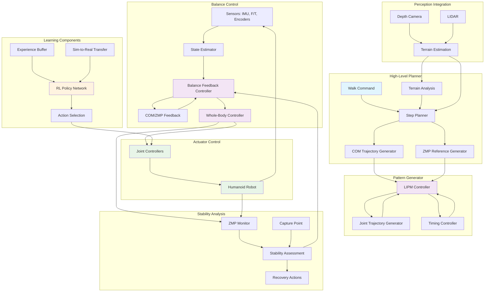

import ExerciseBlock from '@site/src/components/Learning/ExerciseBlock';
import Quiz from '@site/src/components/Learning/Quiz';

# Chapter 21: Bipedal Locomotion - Control Systems for Stable Walking

## Introduction

Bipedal locomotion represents one of the most challenging problems in robotics, requiring sophisticated control systems that can maintain balance while generating stable walking patterns. Unlike wheeled or tracked vehicles, humanoid robots must dynamically adjust their center of mass, coordinate multiple joints in precise timing, and adapt to changing terrain conditions while maintaining stability. This chapter explores the complex control systems that enable humanoid robots to walk with human-like stability and adaptability, covering both classical control approaches and modern machine learning techniques.

The challenge of bipedal locomotion lies in the inherent instability of the system - a humanoid robot is essentially an inverted pendulum that must actively maintain balance through continuous control adjustments. Successful walking requires coordination of leg movements, balance control, and environmental adaptation, all while respecting the complex kinematic and dynamic constraints of the robot's structure.

## Learning Objectives

By the end of this chapter, you will be able to:

1. Understand the fundamental principles of bipedal locomotion and gait patterns
2. Implement classical control approaches for balance and walking
3. Apply the Linear Inverted Pendulum Model (LIPM) for walking pattern generation
4. Design feedback control systems for balance maintenance
5. Implement reinforcement learning approaches for locomotion learning
6. Evaluate walking stability and adapt to terrain variations
7. Integrate perception systems with locomotion control for obstacle avoidance

## Hook: The Inverted Pendulum Challenge

Imagine balancing a pencil on its tip on your finger - this is essentially what a humanoid robot does when it stands upright. Now imagine walking forward while keeping the pencil balanced, adjusting your finger position continuously to maintain stability. This is the fundamental challenge of bipedal locomotion: the robot must constantly make micro-adjustments to its joint positions and center of mass to prevent falling. Unlike humans who have evolved over millions of years to walk efficiently, robots must achieve this through carefully designed control systems and algorithms. This chapter reveals the sophisticated control strategies that enable robots to achieve stable, adaptive walking.

## Concept: Bipedal Locomotion Fundamentals

### Gait Cycles and Walking Phases

Humanoid walking consists of repetitive gait cycles, each with distinct phases:

**Single Support Phase**: When only one foot is in contact with the ground. During this phase, the robot must maintain balance with a narrow support base.

**Double Support Phase**: When both feet are in contact with the ground. This provides maximum stability but limits forward progression.

**Swing Phase**: When one foot is moving forward to take the next step. The robot must control the swing leg trajectory while maintaining balance on the stance leg.

**Contact Phase**: When the swing foot makes contact with the ground and transitions to become the new stance foot.

### Center of Mass and Zero Moment Point Control

The center of mass (COM) and Zero Moment Point (ZMP) are fundamental to stable walking:

**Center of Mass (COM)**: The point where the robot's mass can be considered concentrated. For stable walking, the COM must remain within the support polygon defined by the feet.

**Zero Moment Point (ZMP)**: The point on the ground where the moment of the ground reaction force is zero. For stable walking, the ZMP must remain within the support polygon.

**Capture Point**: A point that indicates where the robot must step to stop its motion and regain stability.

### Linear Inverted Pendulum Model (LIPM)

The Linear Inverted Pendulum Model is a simplified representation of bipedal walking:

```
ẍ = g/h * (x - zmp)
```

Where:
- x is the center of mass position
- zmp is the zero moment point
- h is the height of the center of mass
- g is gravitational acceleration

This model allows for analytical solutions to walking pattern generation and is widely used in humanoid robotics.

### Walking Pattern Generation

Generating stable walking patterns involves:

**Footstep Planning**: Determining where to place the feet to maintain balance and achieve forward progression.

**COM Trajectory Generation**: Planning the center of mass path that ensures stability throughout the gait cycle.

**ZMP Trajectory Planning**: Creating a ZMP reference that the control system should track for stable walking.

**Timing Control**: Coordinating the timing of steps to match the natural dynamics of the system.

### Balance Control Strategies

Several approaches to balance control exist:

**Feedback Control**: Using sensor measurements to continuously adjust joint positions and maintain balance.

**Feedforward Control**: Pre-planning movements based on known dynamics and desired trajectories.

**Impedance Control**: Controlling the robot's mechanical impedance to achieve desired dynamic behavior.

**Whole-Body Control**: Coordinating all joints simultaneously to achieve balance and task objectives.

### Classical Control Approaches

**PID Control**: Proportional-Integral-Derivative controllers for joint position and balance control.

**LQR Control**: Linear Quadratic Regulator for optimal control of the linearized system dynamics.

**MPC Control**: Model Predictive Control for handling constraints and optimizing future behavior.

### Reinforcement Learning for Locomotion

Modern approaches use machine learning:

**Deep RL**: Using neural networks to learn locomotion policies directly from experience.

**Domain Randomization**: Training in varied simulated environments to improve real-world transfer.

**Curriculum Learning**: Gradually increasing task difficulty during training.

### Terrain Adaptation

Robots must adapt to various terrain conditions:

**Flat Ground Walking**: The simplest case with consistent support.

**Uneven Terrain**: Requires adaptive foot placement and balance adjustments.

**Sloped Surfaces**: Needs adjustment of balance control parameters.

**Obstacle Negotiation**: Requires stepping over or around obstacles.

## Mermaid Diagram: Bipedal Locomotion Architecture



## Code Example: Bipedal Locomotion Control System

Let's implement a comprehensive bipedal locomotion system:

### LIPM-based Walking Pattern Generator

```python
#!/usr/bin/env python3
"""
LIPM-based Walking Pattern Generator
This script implements walking pattern generation using the Linear Inverted Pendulum Model
"""

import numpy as np
import math
from scipy.integrate import odeint
from scipy.optimize import minimize
import matplotlib.pyplot as plt

class LIPMWalkingPatternGenerator:
    def __init__(self, com_height=0.8, gravity=9.81, dt=0.01):
        """
        Initialize LIPM walking pattern generator
        com_height: Height of center of mass above ground
        gravity: Gravitational acceleration
        dt: Time step for integration
        """
        self.com_height = com_height
        self.gravity = gravity
        self.dt = dt
        self.omega = math.sqrt(gravity / com_height)

        # Walking parameters
        self.step_length = 0.3  # Distance between consecutive footsteps
        self.step_width = 0.2   # Distance between left and right footsteps
        self.step_height = 0.05 # Maximum height of swing foot
        self.double_support_time = 0.1  # Duration of double support phase
        self.single_support_time = 0.6  # Duration of single support phase

    def lipm_dynamics(self, state, t, zmp_x, zmp_y):
        """
        LIPM dynamics: ẍ = ω²(x - zmp_x), ÿ = ω²(y - zmp_y)
        state = [x, ẋ, y, ẏ]
        """
        x, x_dot, y, y_dot = state
        x_ddot = self.omega**2 * (x - zmp_x)
        y_ddot = self.omega**2 * (y - zmp_y)
        return [x_dot, x_ddot, y_dot, y_ddot]

    def integrate_lipm(self, initial_state, zmp_trajectory, duration):
        """
        Integrate LIPM dynamics for given ZMP trajectory
        """
        t = np.arange(0, duration, self.dt)
        states = []
        current_state = initial_state.copy()

        for i in range(len(t)):
            zmp_x = zmp_trajectory[0][min(i, len(zmp_trajectory[0])-1)]
            zmp_y = zmp_trajectory[1][min(i, len(zmp_trajectory[1])-1)]

            # Integrate one step using Euler method
            derivatives = self.lipm_dynamics(current_state, t[i], zmp_x, zmp_y)
            next_state = current_state + np.array(derivatives) * self.dt
            states.append(next_state.copy())
            current_state = next_state

        return np.array(states), t

    def generate_footsteps(self, walk_distance, step_count=None):
        """
        Generate footsteps for walking forward
        """
        if step_count is None:
            step_count = int(walk_distance / self.step_length)

        footsteps = []
        current_x = 0.0
        current_y = 0.0

        for i in range(step_count):
            # Alternate between left and right foot
            foot_side = 'left' if i % 2 == 0 else 'right'

            # Calculate foot position
            if foot_side == 'left':
                foot_y = self.step_width / 2
            else:
                foot_y = -self.step_width / 2

            foot_x = current_x + self.step_length

            footsteps.append({
                'position': np.array([foot_x, foot_y, 0.0]),
                'side': foot_side,
                'timing': (i + 1) * (self.single_support_time + self.double_support_time)
            })

            current_x = foot_x

        return footsteps

    def generate_zmp_trajectory(self, footsteps, start_time=0.0):
        """
        Generate ZMP trajectory based on footsteps
        """
        total_duration = len(footsteps) * (self.single_support_time + self.double_support_time)
        t = np.arange(start_time, start_time + total_duration, self.dt)

        zmp_x = np.zeros_like(t)
        zmp_y = np.zeros_like(t)

        for i, step in enumerate(footsteps):
            # Calculate timing for this step
            step_start_time = i * (self.single_support_time + self.double_support_time)
            single_support_start = step_start_time + self.double_support_time
            single_support_end = single_support_start + self.single_support_time

            # Find indices for this step's timing
            start_idx = int(step_start_time / self.dt)
            single_support_start_idx = int(single_support_start / self.dt)
            single_support_end_idx = int(single_support_end / self.dt)
            end_idx = int((step_start_time + self.single_support_time + self.double_support_time) / self.dt)

            if end_idx >= len(t):
                end_idx = len(t) - 1

            # During double support, ZMP transitions between feet
            if start_idx < single_support_start_idx:
                for j in range(start_idx, min(single_support_start_idx, len(t))):
                    # Linear interpolation between previous foot position and current support foot
                    progress = min(1.0, max(0.0, (t[j] - step_start_time) / self.double_support_time))
                    prev_y = 0.0 if i == 0 else (self.step_width / 2 if (i-1) % 2 == 0 else -self.step_width / 2)
                    current_y = self.step_width / 2 if i % 2 == 0 else -self.step_width / 2
                    zmp_y[j] = prev_y + progress * (current_y - prev_y)
                    zmp_x[j] = step['position'][0] - (1 - progress) * self.step_length / 2

            # During single support, ZMP is at the support foot
            if single_support_start_idx < single_support_end_idx:
                support_y = self.step_width / 2 if i % 2 == 0 else -self.step_width / 2  # Current support foot
                for j in range(single_support_start_idx, min(single_support_end_idx, len(t))):
                    zmp_x[j] = step['position'][0]
                    zmp_y[j] = support_y

        return zmp_x, zmp_y, t

    def generate_com_trajectory(self, footsteps):
        """
        Generate COM trajectory following the ZMP plan
        """
        # Generate ZMP trajectory
        zmp_x, zmp_y, t = self.generate_zmp_trajectory(footsteps)

        # Integrate LIPM to get COM trajectory
        initial_state = np.array([0.0, 0.0, 0.0, 0.0])  # [x, ẋ, y, ẏ]
        com_states, _ = self.integrate_lipm(initial_state, [zmp_x, zmp_y], t[-1])

        # Extract COM positions and velocities
        com_trajectory = {
            'time': t,
            'x': com_states[:, 0],
            'y': com_states[:, 2],
            'z': np.full_like(t, self.com_height),  # Constant height
            'x_dot': com_states[:, 1],
            'y_dot': com_states[:, 3]
        }

        return com_trajectory, zmp_x, zmp_y

    def generate_swing_foot_trajectory(self, start_pos, end_pos, height, duration):
        """
        Generate trajectory for swing foot using 5th order polynomial
        """
        t = np.arange(0, duration, self.dt)

        # 5th order polynomial for smooth trajectory
        # θ = 0 at t=0, θ = 1 at t=duration
        # Also zero velocity and acceleration at start/end
        theta = (t / duration)
        s = 10*theta**3 - 15*theta**4 + 6*theta**5  # Smooth interpolation function

        # X and Y trajectories (cubic for smoothness)
        x_traj = start_pos[0] + s * (end_pos[0] - start_pos[0])
        y_traj = start_pos[1] + s * (end_pos[1] - start_pos[1])

        # Z trajectory (5th order for smooth liftoff and landing)
        z_lift = start_pos[2] + height
        z_traj = (start_pos[2] +
                 s * 3 * (z_lift - start_pos[2]) * theta**2 -
                 s**3 * 2 * (z_lift - start_pos[2]))

        # Add intermediate point to ensure proper height
        for i in range(len(t)):
            local_theta = t[i] / duration
            if local_theta <= 0.5:
                # Rising phase
                s_i = 10*local_theta**3 - 15*local_theta**4 + 6*local_theta**5
                z_traj[i] = start_pos[2] + s_i * height * 2 * local_theta
            else:
                # Falling phase
                local_theta2 = (local_theta - 0.5) * 2  # Remap to [0,1]
                s_i = 10*local_theta2**3 - 15*local_theta2**4 + 6*local_theta2**5
                z_traj[i] = start_pos[2] + height * (1 - s_i * local_theta2)

        return np.column_stack([x_traj, y_traj, z_traj]), t

# Example usage
def main():
    """Main function to demonstrate LIPM walking pattern generation"""
    # Create pattern generator
    pattern_gen = LIPMWalkingPatternGenerator(com_height=0.8)

    # Generate footsteps for walking forward 1 meter
    footsteps = pattern_gen.generate_footsteps(walk_distance=1.0)
    print(f"Generated {len(footsteps)} footsteps")

    # Print footsteps
    for i, step in enumerate(footsteps):
        print(f"Step {i+1}: {step['side']} foot at {step['position'][:2]}")

    # Generate COM trajectory
    com_trajectory, zmp_x, zmp_y = pattern_gen.generate_com_trajectory(footsteps)

    print(f"Generated COM trajectory with {len(com_trajectory['time'])} points")
    print(f"Final COM position: ({com_trajectory['x'][-1]:.3f}, {com_trajectory['y'][-1]:.3f})")

if __name__ == '__main__':
    main()
```

### Balance Controller Implementation

```python
#!/usr/bin/env python3
"""
Balance Controller for Humanoid Robots
This script implements feedback balance control for humanoid robots
"""

import numpy as np
import math
from scipy.linalg import solve_continuous_are
from scipy import signal

class BalanceController:
    def __init__(self, robot_mass=75.0, com_height=0.8, gravity=9.81):
        """
        Initialize balance controller
        robot_mass: Total mass of the robot
        com_height: Height of center of mass
        gravity: Gravitational acceleration
        """
        self.mass = robot_mass
        self.height = com_height
        self.gravity = gravity

        # Control parameters
        self.kp_com = np.array([10.0, 10.0])  # Position gains [x, y]
        self.kd_com = np.array([2.0, 2.0])    # Velocity gains [x, y]
        self.kp_zmp = np.array([50.0, 50.0])  # ZMP tracking gains
        self.ki_zmp = np.array([10.0, 10.0])  # ZMP integral gains

        # Integral terms for ZMP tracking
        self.zmp_integral = np.array([0.0, 0.0])
        self.max_integral = np.array([0.1, 0.1])  # Limit integral windup

        # Previous values for derivative calculation
        self.prev_com_pos = np.array([0.0, 0.0])
        self.prev_time = 0.0

        # LQR controller design matrices (simplified)
        self.setup_lqr_controller()

    def setup_lqr_controller(self):
        """
        Set up LQR controller for inverted pendulum model
        """
        # State: [x, ẋ, y, ẏ] where x,y are COM positions
        # Input: [zmp_x, zmp_y] - desired ZMP positions

        # System matrices for inverted pendulum
        # ẍ = g/h * (x - zmp_x)
        # ÿ = g/h * (y - zmp_y)
        A = np.array([
            [0, 1, 0, 0],
            [self.gravity/self.height, 0, 0, 0],
            [0, 0, 0, 1],
            [0, 0, self.gravity/self.height, 0]
        ])

        B = np.array([
            [0, 0],
            [-self.gravity/self.height, 0],
            [0, 0],
            [0, -self.gravity/self.height]
        ])

        # State cost matrix (Q)
        Q = np.diag([10, 1, 10, 1])  # penalize COM position and velocity

        # Input cost matrix (R)
        R = np.diag([1, 1])  # penalize ZMP deviation

        # Solve algebraic Riccati equation for LQR
        try:
            P = solve_continuous_are(A, B, Q, R)
            K = np.linalg.inv(R) @ B.T @ P  # Feedback gain matrix
            self.lqr_gain = K
        except:
            # Fallback to simple gains if LQR fails
            self.lqr_gain = np.array([[0, 2.0, 0, 0], [0, 0, 0, 2.0]])

    def compute_balance_control(self, current_com, desired_com, current_com_vel,
                              current_zmp, desired_zmp, dt):
        """
        Compute balance control commands
        """
        # Calculate position and velocity errors
        pos_error = desired_com - current_com
        vel_error = np.zeros(2)  # This would come from state estimation in practice

        # PID control for COM position tracking
        proportional_term = self.kp_com * pos_error
        derivative_term = self.kd_com * (current_com_vel if current_com_vel is not None else np.zeros(2))

        # ZMP error for feedback control
        zmp_error = desired_zmp - current_zmp

        # Update integral term (with anti-windup)
        self.zmp_integral += zmp_error * dt
        self.zmp_integral = np.clip(self.zmp_integral, -self.max_integral, self.max_integral)

        # ZMP feedback control
        zmp_feedback = (self.kp_zmp * zmp_error +
                       self.ki_zmp * self.zmp_integral)

        # Combine all control terms
        control_output = proportional_term + derivative_term + zmp_feedback

        # Apply LQR control as well (using simplified version)
        state = np.concatenate([current_com, current_com_vel if current_com_vel is not None else np.zeros(2)])
        lqr_control = self.lqr_gain @ np.concatenate([desired_zmp, np.zeros(2)])  # Simplified

        # Final control command
        final_control = control_output + lqr_control[:2]  # Only take x,y components

        return final_control, pos_error, zmp_error

    def compute_joint_torques(self, com_control, current_joint_pos, current_joint_vel,
                             support_foot='left'):
        """
        Convert COM control to joint torques using whole-body control
        This is a simplified implementation - in practice, you'd use full WBC
        """
        # For simplicity, return a proportional control for leg joints
        # In reality, this would involve complex inverse dynamics and whole-body optimization

        # Define target joint positions based on COM control
        # This is highly simplified - real implementation would use inverse kinematics
        # and dynamics with full robot model

        # Return example torques (in practice, these would be computed using
        # inverse dynamics, Jacobian methods, or whole-body optimization)
        num_leg_joints = 6  # Example: 6 DOF per leg
        joint_torques = np.zeros(num_leg_joints * 2)  # Both legs

        # Apply simplified control - in reality, use full dynamics model
        # This is just an example structure
        for i in range(num_leg_joints):
            # Example: proportional control for each joint
            joint_torques[i] = com_control[0] * 0.5  # Simplified mapping
            joint_torques[i + num_leg_joints] = com_control[1] * 0.5

        return joint_torques

class WalkingController:
    def __init__(self, pattern_generator, balance_controller):
        """
        Initialize walking controller combining pattern generation and balance control
        """
        self.pattern_gen = pattern_generator
        self.balance_ctrl = balance_controller
        self.current_step = 0
        self.is_walking = False
        self.walk_start_time = 0.0

    def start_walking(self, walk_distance, step_count=None):
        """
        Start walking with specified distance
        """
        self.footsteps = self.pattern_gen.generate_footsteps(walk_distance, step_count)
        self.com_trajectory, self.zmp_x_ref, self.zmp_y_ref = self.pattern_gen.generate_com_trajectory(self.footsteps)
        self.current_step = 0
        self.is_walking = True
        self.walk_start_time = 0.0  # This would be actual time in real implementation
        self.current_time = 0.0

        print(f"Started walking: {len(self.footsteps)} steps for {walk_distance}m")

    def update_walking(self, current_com, current_zmp, current_time):
        """
        Update walking control at each control cycle
        """
        if not self.is_walking:
            return np.zeros(12), {}  # Return zero torques if not walking

        # Get desired COM and ZMP for current time
        time_idx = min(int((current_time - self.walk_start_time) / self.pattern_gen.dt),
                      len(self.com_trajectory['time']) - 1)

        if time_idx >= len(self.com_trajectory['time']):
            # Walking completed
            self.is_walking = False
            return np.zeros(12), {'status': 'completed'}

        desired_com = np.array([self.com_trajectory['x'][time_idx],
                               self.com_trajectory['y'][time_idx]])
        desired_zmp = np.array([self.zmp_x_ref[time_idx], self.zmp_y_ref[time_idx]])

        # Calculate COM velocity (approximate)
        dt = 0.01  # Approximate time step if not provided
        if hasattr(self, 'prev_com'):
            current_com_vel = (current_com - self.prev_com) / dt
        else:
            current_com_vel = np.array([0.0, 0.0])
        self.prev_com = current_com.copy()

        # Compute balance control
        com_control, pos_error, zmp_error = self.balance_ctrl.compute_balance_control(
            current_com, desired_com, current_com_vel,
            current_zmp, desired_zmp, dt
        )

        # Convert to joint torques
        joint_torques = self.balance_ctrl.compute_joint_torques(
            com_control, np.zeros(12), np.zeros(12)  # Simplified joint states
        )

        # Pack results
        control_info = {
            'desired_com': desired_com,
            'desired_zmp': desired_zmp,
            'pos_error': pos_error,
            'zmp_error': zmp_error,
            'status': 'walking'
        }

        return joint_torques, control_info

def main():
    """Main function to demonstrate walking controller"""
    # Create pattern generator and balance controller
    pattern_gen = LIPMWalkingPatternGenerator(com_height=0.8)
    balance_ctrl = BalanceController(robot_mass=75.0, com_height=0.8)

    # Create walking controller
    walking_ctrl = WalkingController(pattern_gen, balance_ctrl)

    # Start walking
    walking_ctrl.start_walking(walk_distance=1.0)

    # Simulate walking control loop
    simulation_time = 0.0
    dt = 0.01
    current_com = np.array([0.0, 0.0])  # Starting COM position
    current_zmp = np.array([0.0, 0.0])  # Starting ZMP

    print("Starting walking simulation...")

    for step in range(1000):  # Simulate 10 seconds at 100Hz
        simulation_time += dt

        # In real implementation, get actual COM and ZMP from sensors
        # For simulation, we'll use the desired trajectory with some noise
        time_idx = min(int(simulation_time / dt), len(pattern_gen.generate_zmp_trajectory([], start_time=0.0)[2]) - 1)

        # Simulate actual COM with some deviation from desired
        if time_idx < len(walking_ctrl.com_trajectory['x']):
            desired_x = walking_ctrl.com_trajectory['x'][time_idx]
            desired_y = walking_ctrl.com_trajectory['y'][time_idx]
            current_com = np.array([desired_x + np.random.normal(0, 0.01),
                                   desired_y + np.random.normal(0, 0.01)])
            current_zmp = np.array([walking_ctrl.zmp_x_ref[time_idx] + np.random.normal(0, 0.005),
                                   walking_ctrl.zmp_y_ref[time_idx] + np.random.normal(0, 0.005)])

        # Update walking controller
        joint_torques, control_info = walking_ctrl.update_walking(
            current_com, current_zmp, simulation_time
        )

        if control_info['status'] == 'completed':
            print(f"Walking completed at time {simulation_time:.2f}s")
            break

        # Print progress periodically
        if step % 100 == 0:
            print(f"Time: {simulation_time:.2f}s, COM: ({current_com[0]:.3f}, {current_com[1]:.3f}), "
                  f"Error: ({control_info['pos_error'][0]:.3f}, {control_info['pos_error'][1]:.3f})")

    print("Walking simulation completed")

if __name__ == '__main__':
    main()
```

### Reinforcement Learning for Locomotion

```python
#!/usr/bin/env python3
"""
Reinforcement Learning for Humanoid Locomotion
This script implements a simple RL approach for learning walking policies
"""

import numpy as np
import torch
import torch.nn as nn
import torch.optim as optim
from torch.distributions import Normal
import random
import math

class LocomotionPolicyNetwork(nn.Module):
    def __init__(self, state_dim, action_dim, hidden_dim=256):
        """
        Neural network for locomotion policy
        state_dim: Dimension of the state vector
        action_dim: Dimension of the action vector (joint torques/positions)
        hidden_dim: Size of hidden layers
        """
        super(LocomotionPolicyNetwork, self).__init__()

        self.network = nn.Sequential(
            nn.Linear(state_dim, hidden_dim),
            nn.ReLU(),
            nn.Linear(hidden_dim, hidden_dim),
            nn.ReLU(),
            nn.Linear(hidden_dim, hidden_dim),
            nn.ReLU(),
            nn.Linear(hidden_dim, action_dim)
        )

        # Output layer for action standard deviation (for exploration)
        self.log_std = nn.Parameter(torch.zeros(action_dim))

    def forward(self, state):
        action_mean = self.network(state)
        action_std = torch.exp(self.log_std)
        return action_mean, action_std

    def get_action(self, state):
        """
        Sample action from the policy distribution
        """
        action_mean, action_std = self.forward(state)
        dist = Normal(action_mean, action_std)
        action = dist.rsample()
        log_prob = dist.log_prob(action).sum(dim=-1)
        return action, log_prob

class LocomotionEnvironment:
    def __init__(self, dt=0.01):
        """
        Simplified humanoid environment for RL training
        """
        self.dt = dt
        self.reset()

    def reset(self):
        """
        Reset environment to initial state
        """
        self.time = 0.0
        self.com_pos = np.array([0.0, 0.0, 0.8])  # [x, y, z]
        self.com_vel = np.array([0.0, 0.0, 0.0])
        self.body_orientation = np.array([0.0, 0.0, 0.0, 1.0])  # [x, y, z, w] quaternion
        self.joint_angles = np.zeros(28)  # Example: 28 DOF humanoid
        self.joint_velocities = np.zeros(28)

        self.walk_target = 2.0  # Target distance to walk
        self.current_progress = 0.0

        return self.get_state()

    def get_state(self):
        """
        Get current state vector for the policy
        """
        # State includes: COM pos/vel, body orientation, joint angles/velocities
        state = np.concatenate([
            self.com_pos,           # 3: COM position
            self.com_vel,           # 3: COM velocity
            self.body_orientation,  # 4: Body orientation
            self.joint_angles,      # 28: Joint angles (example)
            self.joint_velocities   # 28: Joint velocities
        ])
        return torch.FloatTensor(state)

    def step(self, action):
        """
        Execute action and return (next_state, reward, done, info)
        """
        # Apply action (simplified dynamics update)
        # In reality, this would involve complex physics simulation
        action = torch.clamp(action, -1.0, 1.0).numpy()  # Clamp action

        # Simplified dynamics update
        self.com_vel[0] += action[0] * 0.1  # X velocity affected by action
        self.com_vel[1] += action[1] * 0.05  # Y velocity affected by action
        self.com_pos += self.com_vel * self.dt

        # Update joint angles based on action
        self.joint_angles += action[:len(self.joint_angles)] * self.dt * 5.0

        # Keep joints within reasonable limits
        self.joint_angles = np.clip(self.joint_angles, -2.0, 2.0)

        # Update velocities
        self.joint_velocities = (action[:len(self.joint_velocities)] - self.joint_velocities) * 0.1

        # Calculate reward
        reward = self.calculate_reward()

        # Check termination conditions
        done = self.check_termination()

        # Update time
        self.time += self.dt

        # Update progress
        self.current_progress = self.com_pos[0]

        next_state = self.get_state()
        info = {'progress': self.current_progress, 'time': self.time}

        return next_state, reward, done, info

    def calculate_reward(self):
        """
        Calculate reward based on current state
        """
        reward = 0.0

        # Reward for forward progress
        reward += self.com_vel[0] * 10.0  # Reward for moving forward

        # Penalty for falling (if COM height drops too much)
        if self.com_pos[2] < 0.4:  # Robot is considered fallen
            reward -= 100.0

        # Reward for maintaining upright posture
        # Simplified: reward for keeping z-orientation near 1.0
        upright_reward = max(0, self.body_orientation[3]) * 5.0
        reward += upright_reward

        # Penalty for excessive joint velocities
        joint_vel_penalty = -np.sum(np.abs(self.joint_velocities)) * 0.01
        reward += joint_vel_penalty

        # Small penalty for each time step to encourage efficiency
        reward -= 0.01

        return reward

    def check_termination(self):
        """
        Check if episode should terminate
        """
        # Terminate if fallen
        if self.com_pos[2] < 0.4:
            return True

        # Terminate if reached target distance
        if self.current_progress >= self.walk_target:
            return True

        # Terminate if time limit exceeded
        if self.time > 10.0:  # 10 seconds maximum
            return True

        return False

class PPOTrainer:
    def __init__(self, policy_network, learning_rate=3e-4, clip_epsilon=0.2):
        """
        PPO (Proximal Policy Optimization) trainer
        """
        self.policy = policy_network
        self.optimizer = optim.Adam(policy.parameters(), lr=learning_rate)
        self.clip_epsilon = clip_epsilon
        self.mse_loss = nn.MSELoss()

    def compute_returns(self, rewards, dones, gamma=0.99):
        """
        Compute discounted returns
        """
        returns = []
        R = 0
        for i in reversed(range(len(rewards))):
            R = rewards[i] + gamma * R * (1 - dones[i])
            returns.insert(0, R)
        return torch.tensor(returns, dtype=torch.float32)

    def update_policy(self, states, actions, old_log_probs, returns, advantages):
        """
        Update policy using PPO objective
        """
        # Convert to tensors
        states = torch.stack(states)
        actions = torch.stack(actions)
        old_log_probs = torch.stack(old_log_probs)
        returns = torch.stack(returns)
        advantages = torch.stack(advantages)

        # Get new action probabilities
        new_action_means, new_action_stds = self.policy(states)

        # Create distribution and compute new log probabilities
        dist = Normal(new_action_means, new_action_stds)
        new_log_probs = dist.log_prob(actions).sum(dim=-1)

        # Compute ratio
        ratio = torch.exp(new_log_probs - old_log_probs)

        # Compute PPO surrogate objectives
        surr1 = ratio * advantages
        surr2 = torch.clamp(ratio, 1 - self.clip_epsilon, 1 + self.clip_epsilon) * advantages

        # Compute policy loss
        policy_loss = -torch.min(surr1, surr2).mean()

        # Compute value loss (if using value function)
        # For simplicity, we'll just use the return as the target
        # In practice, you'd have a separate value network

        # Update policy
        self.optimizer.zero_grad()
        policy_loss.backward()
        # Gradient clipping
        torch.nn.utils.clip_grad_norm_(self.policy.parameters(), 0.5)
        self.optimizer.step()

        return policy_loss.item()

def train_locomotion_policy():
    """
    Train locomotion policy using PPO
    """
    # Environment and policy setup
    env = LocomotionEnvironment(dt=0.01)
    state_dim = 86  # 3+3+4+28+28+20 (simplified) - adjust based on actual state
    action_dim = 28  # Joint torques or positions

    policy = LocomotionPolicyNetwork(state_dim, action_dim)
    trainer = PPOTrainer(policy)

    # Training parameters
    num_episodes = 1000
    max_steps_per_episode = 1000  # 10 seconds at 100Hz

    # Training loop
    for episode in range(num_episodes):
        state = env.reset()
        episode_states = []
        episode_actions = []
        episode_log_probs = []
        episode_rewards = []
        episode_dones = []

        # Collect trajectory
        for step in range(max_steps_per_episode):
            # Get action from policy
            action, log_prob = policy.get_action(state)

            # Take action in environment
            next_state, reward, done, info = env.step(action)

            # Store experience
            episode_states.append(state)
            episode_actions.append(action)
            episode_log_probs.append(log_prob)
            episode_rewards.append(torch.tensor(reward, dtype=torch.float32))
            episode_dones.append(torch.tensor(done, dtype=torch.float32))

            state = next_state

            if done:
                break

        # Compute returns and advantages (simplified)
        returns = trainer.compute_returns(episode_rewards, episode_dones)
        # For simplicity, using returns as advantages (in practice, use value function)
        advantages = returns - returns.mean()

        # Update policy
        if len(episode_states) > 0:
            loss = trainer.update_policy(
                episode_states, episode_actions, episode_log_probs, returns, advantages
            )

        # Print progress
        if episode % 100 == 0:
            avg_reward = sum(episode_rewards).item() / len(episode_rewards) if episode_rewards else 0
            print(f"Episode {episode}, Average Reward: {avg_reward:.2f}, Loss: {loss:.4f}")

    print("Training completed!")
    return policy

def main():
    """Main function to demonstrate RL for locomotion"""
    print("Starting RL locomotion training...")

    # Train the policy
    trained_policy = train_locomotion_policy()

    # Test the trained policy
    print("\nTesting trained policy...")
    env = LocomotionEnvironment()
    state = env.reset()

    total_reward = 0
    steps = 0

    for step in range(500):  # Test for 5 seconds
        with torch.no_grad():
            action, _ = trained_policy.get_action(state)

        state, reward, done, info = env.step(action)
        total_reward += reward
        steps += 1

        if done:
            print(f"Episode finished after {steps} steps. Final position: {env.com_pos[:2]}")
            break

    print(f"Test completed. Total reward: {total_reward:.2f}, Final position: {env.com_pos[:2]}")

if __name__ == '__main__':
    main()
```

## Exercises

<ExerciseBlock
  content="**Exercise 1: LIPM Walking Pattern Generation**
Implement and tune the LIPM-based walking pattern generator with different walking speeds and step heights. Analyze how changing parameters affects the stability and smoothness of the generated trajectories."
/>

<ExerciseBlock
  content="**Exercise 2: Balance Controller Tuning**
Tune the PID and LQR balance controllers for different robot configurations and walking conditions. Compare the performance of different control strategies in terms of stability and energy efficiency."
/>

<ExerciseBlock
  content="**Exercise 3: Terrain Adaptation**
Extend the walking controller to adapt to uneven terrain by incorporating height sensing and adjusting foot placement and COM trajectories accordingly."
/>

<ExerciseBlock
  content="**Exercise 4: Reinforcement Learning Policy**
Implement a more sophisticated RL approach using domain randomization to improve sim-to-real transfer. Train the policy in simulated environments with varying conditions and test on a real robot."
/>

## Summary

This chapter explored the complex control systems required for bipedal locomotion in humanoid robots. We covered:

- The fundamentals of gait cycles and walking phases
- Linear Inverted Pendulum Model (LIPM) for walking pattern generation
- Balance control strategies including feedback and optimal control
- Reinforcement learning approaches for locomotion learning
- Integration of perception and control for adaptive walking

Bipedal locomotion remains one of the most challenging problems in robotics, requiring sophisticated control algorithms that can maintain stability while generating natural walking patterns. The combination of classical control approaches with modern machine learning techniques shows promise for achieving human-like walking capabilities.

## Quiz

<Quiz
  question="What does ZMP stand for in the context of bipedal locomotion?"
  options={[
    "Zero Moment Point",
    "Zero Motion Parameter",
    "Z-Axis Movement Point",
    "Zero Momentum Position"
  ]}
  answer={0}
  explanation="ZMP stands for Zero Moment Point, which is the point on the ground where the moment of the ground reaction force is zero, critical for stable walking."
/>

<Quiz
  question="In the Linear Inverted Pendulum Model (LIPM), what is the relationship between COM acceleration and ZMP?"
  options={[
    "ẍ = g/h * (zmp - x)",
    "ẍ = g/h * (x - zmp)",
    "ẍ = h/g * (x - zmp)",
    "ẍ = g*h * (x - zmp)"
  ]}
  answer={1}
  explanation="In LIPM, the relationship is ẍ = g/h * (x - zmp), where x is COM position, zmp is Zero Moment Point, h is COM height, and g is gravity."
/>

<Quiz
  question="What is the primary purpose of the Capture Point in bipedal locomotion?"
  options={[
    "To determine the robot's walking speed",
    "To indicate where the robot must step to stop its motion and regain stability",
    "To calculate the robot's center of mass",
    "To measure the robot's joint angles"
  ]}
  explanation="The Capture Point indicates where the robot must step to stop its motion and regain stability, which is critical for balance recovery."
  answer={1}
/>

## Preview of Next Chapter

In Chapter 22: Manipulation and Grasping, we'll explore the control systems and algorithms for robotic manipulation, including grasp planning, force control, and visual servoing techniques that enable humanoid robots to interact with objects in their environment.