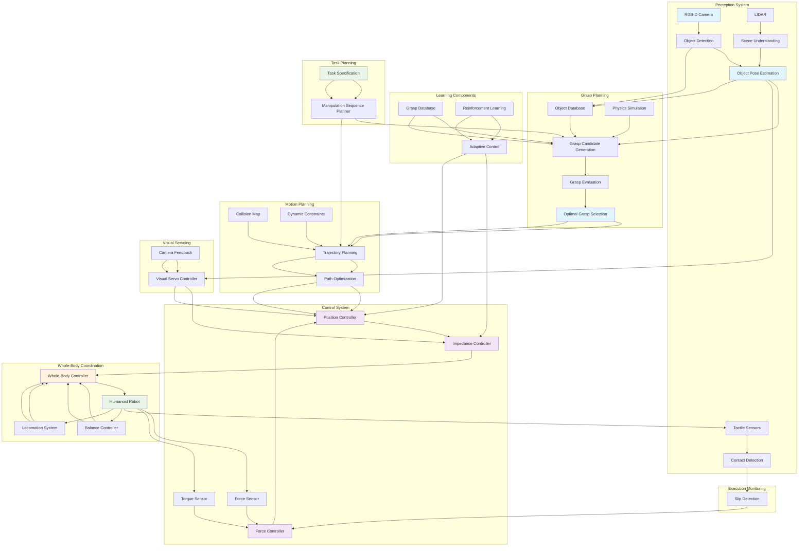

import ExerciseBlock from '@site/src/components/Learning/ExerciseBlock';
import Quiz from '@site/src/components/Learning/Quiz';

# Chapter 22: Manipulation and Grasping - Robotic Interaction with Objects

## Introduction

Robotic manipulation represents the ability of robots to interact with and control objects in their environment, a fundamental capability for humanoid robots to perform human-like tasks. Unlike simple pick-and-place operations, sophisticated manipulation requires understanding object properties, planning stable grasps, controlling contact forces, and coordinating multiple degrees of freedom to achieve complex manipulation tasks. This chapter explores the complex systems that enable humanoid robots to perceive, grasp, manipulate, and interact with objects in their environment with human-like dexterity.

The challenge of robotic manipulation lies in the integration of perception, planning, and control systems that must work together seamlessly. Robots must identify objects, determine appropriate grasp points, plan trajectories that avoid collisions, execute precise movements, and adapt to unexpected situations during manipulation. The complexity increases significantly for humanoid robots, which must coordinate manipulation with balance and locomotion while dealing with redundant kinematic chains.

## Learning Objectives

By the end of this chapter, you will be able to:

1. Understand the fundamentals of robotic grasping and manipulation
2. Implement grasp planning algorithms for various object types
3. Design force and impedance control systems for manipulation
4. Apply visual servoing techniques for precise manipulation
5. Integrate manipulation with whole-body control for humanoid robots
6. Plan and execute complex manipulation sequences
7. Handle uncertainty and adapt to unexpected situations during manipulation

## Hook: The Dexterity Challenge

Watch a human expertly handle a delicate object like a wine glass - they effortlessly adjust their grip strength, adapt to the object's shape, and maintain perfect control even when the object's weight shifts. Now imagine programming a robot to perform the same task. The robot must perceive the glass's shape and position, determine optimal contact points, calculate the precise forces needed to grasp without breaking or dropping, and coordinate its entire body to maintain balance while manipulating. This level of dexterity requires sophisticated integration of perception, planning, and control systems. This chapter reveals how robots achieve human-like manipulation capabilities.

## Concept: Manipulation and Grasping Fundamentals

### Grasp Types and Categories

Robotic grasping can be categorized into several types:

**Power Grasps**: Designed for stability and load capacity, typically using the fingertips and palm to wrap around an object. These grasps provide maximum stability for heavy objects.

**Precision Grasps**: Use fingertips to achieve fine control and dexterity, suitable for delicate objects and precise positioning tasks.

**Pinch Grasps**: Use thumb and one or more fingers for precise manipulation of small objects.

**Cylindrical Grasps**: Wrap fingers around cylindrical objects for secure holding.

**Spherical Grasps**: Adapt to spherical objects using multiple contact points.

### Grasp Stability and Force Closure

**Force Closure**: A grasp achieves force closure when it can resist any external wrench (force and torque) applied to the object through frictional contacts alone.

**Form Closure**: A grasp achieves form closure when the object is completely immobilized by the contact geometry, regardless of friction.

**Grasp Quality Metrics**: Various metrics evaluate grasp stability, including:
- Minimum wrench resistance
- Volume of the grasp wrench space
- Grasp isotropy (uniform resistance in all directions)

### Contact Mechanics and Friction

Understanding contact mechanics is crucial for stable grasping:

**Friction Cones**: Represent the range of forces that can be applied at a contact point without causing slip.

**Point Contacts vs. Surface Contacts**: Point contacts provide precise positioning but less stability; surface contacts provide more stability but less precision.

**Soft Contacts**: Deformable fingertips can increase contact area and improve grasp stability.

### Manipulation Planning

Manipulation planning involves multiple components:

**Grasp Planning**: Determining optimal grasp points and hand configurations based on object geometry and task requirements.

**Trajectory Planning**: Planning collision-free paths for the manipulator to approach, grasp, and manipulate objects.

**Regrasp Planning**: Planning sequences of grasps to reposition objects when a single grasp is insufficient.

**Whole-Body Manipulation Planning**: Coordinating arm, torso, and leg movements for complex manipulation tasks.

### Force Control and Impedance Control

**Impedance Control**: Controls the robot's mechanical impedance (stiffness, damping, inertia) to achieve desired interaction behavior.

**Admittance Control**: Controls the robot's motion in response to applied forces.

**Hybrid Force/Position Control**: Simultaneously controls forces in some directions and positions in others.

**Compliance Control**: Allows controlled flexibility for safe interaction with the environment.

### Visual Servoing

Visual servoing uses visual feedback to control manipulation:

**Image-Based Visual Servoing (IBVS)**: Controls image features directly to achieve desired visual goals.

**Position-Based Visual Servoing (PBVS)**: Uses 3D pose estimates to control the end-effector position.

**Feature-Based Visual Servoing**: Tracks specific image features for precise manipulation.

### Multi-Fingered Hand Control

**Underactuated Hands**: Hands with fewer actuators than degrees of freedom, relying on mechanical design for adaptive grasping.

**Fully Actuated Hands**: Each joint controlled independently for maximum dexterity.

**Synergies**: Coordinated patterns of finger movement that simplify hand control.

### Object Properties and Affordances

**Object Recognition**: Identifying object types, poses, and properties from sensor data.

**Affordance Learning**: Understanding how objects can be used based on their properties and geometric features.

**Material Properties**: Understanding surface properties, weight, and fragility for appropriate manipulation strategies.

## Mermaid Diagram: Manipulation and Grasping Architecture



## Code Example: Manipulation and Grasping Implementation

Let's implement comprehensive manipulation and grasping systems:

### Grasp Planning and Evaluation System

```python
#!/usr/bin/env python3
"""
Grasp Planning and Evaluation System
This script implements grasp planning algorithms for robotic manipulation
"""

import numpy as np
import math
from scipy.spatial import ConvexHull, distance
from scipy.spatial.transform import Rotation as R
import open3d as o3d
from typing import List, Tuple, Optional

class GraspPose:
    """Represents a potential grasp pose with approach direction, grasp width, and quality"""
    def __init__(self, position: np.ndarray, orientation: np.ndarray,
                 grasp_width: float, quality: float, contact_points: List[np.ndarray]):
        self.position = position  # 3D position [x, y, z]
        self.orientation = orientation  # 4D quaternion [x, y, z, w]
        self.grasp_width = grasp_width  # Distance between fingers
        self.quality = quality  # Grasp quality metric (0-1)
        self.contact_points = contact_points  # Contact points on object surface

class GraspPlanner:
    def __init__(self, finger_length=0.08, max_grasp_width=0.12,
                 min_grasp_width=0.01, friction_coeff=0.8):
        """
        Initialize grasp planner
        finger_length: Length of robot fingers
        max_grasp_width: Maximum distance between fingers
        min_grasp_width: Minimum distance between fingers
        friction_coeff: Friction coefficient for contact modeling
        """
        self.finger_length = finger_length
        self.max_grasp_width = max_grasp_width
        self.min_grasp_width = min_grasp_width
        self.friction_coeff = friction_coeff

    def generate_antipodal_grasps(self, point_cloud: np.ndarray,
                                 num_candidates: int = 100) -> List[GraspPose]:
        """
        Generate antipodal grasp candidates from point cloud
        Antipodal grasps have contact normals pointing toward each other
        """
        grasps = []

        # Convert to Open3D point cloud for normal estimation
        pcd = o3d.geometry.PointCloud()
        pcd.points = o3d.utility.Vector3dVector(point_cloud)

        # Estimate normals
        pcd.estimate_normals(search_param=o3d.geometry.KDTreeSearchParamKNN(knn=30))
        normals = np.asarray(pcd.normals)

        # Generate grasp candidates
        for _ in range(num_candidates):
            # Sample two random points from the point cloud
            idx1, idx2 = np.random.choice(len(point_cloud), 2, replace=False)
            p1, p2 = point_cloud[idx1], point_cloud[idx2]
            n1, n2 = normals[idx1], normals[idx2]

            # Calculate grasp width
            grasp_width = np.linalg.norm(p1 - p2)
            if grasp_width < self.min_grasp_width or grasp_width > self.max_grasp_width:
                continue

            # Check if normals are roughly antipodal (pointing toward each other)
            direction = p2 - p1
            direction = direction / np.linalg.norm(direction)

            # Check if normals are pointing toward each other (antipodal condition)
            dot1 = np.dot(n1, direction)
            dot2 = np.dot(n2, -direction)  # n2 should point opposite to direction

            if dot1 > 0.5 and dot2 > 0.5:  # Both normals point toward each other
                # Calculate grasp pose
                grasp_center = (p1 + p2) / 2
                grasp_approach = np.cross(n1, n2)  # Perpendicular to both normals
                if np.linalg.norm(grasp_approach) < 0.1:
                    # If normals are parallel, use a different approach
                    grasp_approach = n1
                grasp_approach = grasp_approach / np.linalg.norm(grasp_approach)

                # Calculate orientation quaternion
                # We want the grasp to be oriented such that the fingers approach each other
                z_axis = direction  # Grasp direction
                y_axis = grasp_approach  # Approach direction
                x_axis = np.cross(y_axis, z_axis)
                x_axis = x_axis / np.linalg.norm(x_axis)
                y_axis = np.cross(z_axis, x_axis)  # Recalculate to ensure orthogonality

                rotation_matrix = np.array([x_axis, y_axis, z_axis]).T
                orientation = R.from_matrix(rotation_matrix).as_quat()

                # Calculate grasp quality
                quality = self.evaluate_grasp_quality(p1, p2, n1, n2, grasp_width)

                grasp = GraspPose(
                    position=grasp_center,
                    orientation=orientation,
                    grasp_width=grasp_width,
                    quality=quality,
                    contact_points=[p1, p2]
                )

                grasps.append(grasp)

        # Sort grasps by quality
        grasps.sort(key=lambda g: g.quality, reverse=True)
        return grasps

    def evaluate_grasp_quality(self, p1: np.ndarray, p2: np.ndarray,
                             n1: np.ndarray, n2: np.ndarray,
                             grasp_width: float) -> float:
        """
        Evaluate grasp quality based on geometric and force closure properties
        """
        # Distance-based quality (prefer moderate distances)
        dist_quality = 1.0 - abs(grasp_width - self.max_grasp_width/2) / (self.max_grasp_width/2)
        dist_quality = max(0.0, min(1.0, dist_quality))

        # Normal alignment quality (how well normals align with grasp direction)
        grasp_direction = (p2 - p1) / grasp_width
        normal_alignment1 = abs(np.dot(n1, grasp_direction))
        normal_alignment2 = abs(np.dot(n2, -grasp_direction))
        normal_quality = (normal_alignment1 + normal_alignment2) / 2

        # Friction cone quality
        # For 3D friction cones, we consider the angle between normal and tangential force
        friction_quality = min(1.0, 0.5 + 0.5 * self.friction_coeff)

        # Combine quality metrics
        quality = (0.4 * dist_quality + 0.4 * normal_quality + 0.2 * friction_quality)
        return quality

    def filter_grasps_by_accessibility(self, grasps: List[GraspPose],
                                     object_bbox: np.ndarray,
                                     robot_workspace: np.ndarray) -> List[GraspPose]:
        """
        Filter grasps based on robot accessibility and collision avoidance
        """
        accessible_grasps = []

        for grasp in grasps:
            # Check if grasp position is within robot workspace
            if (robot_workspace[0, 0] <= grasp.position[0] <= robot_workspace[0, 1] and
                robot_workspace[1, 0] <= grasp.position[1] <= robot_workspace[1, 1] and
                robot_workspace[2, 0] <= grasp.position[2] <= robot_workspace[2, 1]):

                # Check if grasp approach direction is not blocked by object
                # Calculate approach position (a bit away from object)
                rotation = R.from_quat(grasp.orientation)
                approach_direction = rotation.apply(np.array([0, 1, 0]))  # Y-axis is approach
                approach_pos = grasp.position + approach_direction * 0.05  # 5cm approach distance

                # Simple check: approach position should not be inside object bounding box
                if not (object_bbox[0, 0] <= approach_pos[0] <= object_bbox[0, 1] and
                        object_bbox[1, 0] <= approach_pos[1] <= object_bbox[1, 1] and
                        object_bbox[2, 0] <= approach_pos[2] <= object_bbox[2, 1]):
                    accessible_grasps.append(grasp)

        return accessible_grasps

    def plan_grasp_sequence(self, object_point_cloud: np.ndarray,
                           target_pose: np.ndarray,
                           num_candidates: int = 50) -> List[GraspPose]:
        """
        Plan a sequence of grasps to manipulate an object to a target pose
        """
        # Generate initial grasp candidates
        all_grasps = self.generate_antipodal_grasps(object_point_cloud, num_candidates)

        # Filter by accessibility
        object_bbox = np.array([
            [np.min(object_point_cloud[:, 0]), np.max(object_point_cloud[:, 0])],
            [np.min(object_point_cloud[:, 1]), np.max(object_point_cloud[:, 1])],
            [np.min(object_point_cloud[:, 2]), np.max(object_point_cloud[:, 2])]
        ])

        robot_workspace = np.array([
            [-0.5, 0.5],  # x range
            [-0.3, 0.3],  # y range
            [0.1, 1.0]    # z range
        ])

        accessible_grasps = self.filter_grasps_by_accessibility(all_grasps, object_bbox, robot_workspace)

        # Return top grasps
        return accessible_grasps[:10]  # Return top 10 grasps

class GraspController:
    def __init__(self, max_force=50.0, max_torque=5.0, kp_pos=100.0, kp_ori=50.0):
        """
        Initialize grasp controller
        max_force: Maximum force allowed during grasping
        max_torque: Maximum torque allowed during grasping
        kp_pos: Position control stiffness
        kp_ori: Orientation control stiffness
        """
        self.max_force = max_force
        self.max_torque = max_torque
        self.kp_pos = kp_pos
        self.kp_ori = kp_ori

        # Grasp state
        self.is_grasping = False
        self.grasp_force = 0.0
        self.slip_detected = False

    def execute_grasp(self, target_grasp: GraspPose, current_pose: np.ndarray,
                     object_mass: float = 0.5) -> Tuple[np.ndarray, float, bool]:
        """
        Execute a grasp motion
        Returns: (joint_commands, grasp_force, success)
        """
        # Calculate desired end-effector pose
        desired_pos = target_grasp.position
        desired_ori = target_grasp.orientation

        # Calculate position and orientation errors
        pos_error = desired_pos - current_pose[:3]
        current_ori = current_pose[3:]  # Assuming quaternion format [x, y, z, w]

        # Calculate orientation error (simplified)
        ori_error = self.quaternion_error(desired_ori, current_ori)

        # Calculate control commands
        pos_control = self.kp_pos * pos_error
        ori_control = self.kp_ori * ori_error

        # Combine position and orientation control
        control_command = np.concatenate([pos_control, ori_control[:3]])  # Only use xyz from orientation error

        # Calculate grasp force based on object weight
        grasp_force = min(self.max_force, object_mass * 9.81 * 2.0)  # 2x safety factor

        # Check for grasp success (simplified)
        success = (np.linalg.norm(pos_error) < 0.005 and  # Position within 5mm
                  np.linalg.norm(ori_error) < 0.1 and      # Orientation within 0.1 rad
                  target_grasp.quality > 0.5)              # Grasp quality is good

        return control_command, grasp_force, success

    def quaternion_error(self, q1: np.ndarray, q2: np.ndarray) -> np.ndarray:
        """
        Calculate orientation error between two quaternions
        """
        # Convert quaternion difference to angle-axis representation
        q_diff = self.quaternion_multiply(q1, self.quaternion_inverse(q2))

        # Extract rotation vector from quaternion
        if q_diff[3] > 0:  # w component
            q_diff = q_diff
        else:
            q_diff = -q_diff  # Ensure shortest rotation

        # Convert to rotation vector (axis-angle scaled by angle)
        if q_diff[3] > 0.999999:  # Near identity rotation
            return np.zeros(3)
        else:
            angle = 2 * np.arccos(np.clip(q_diff[3], -1, 1))
            s = np.sin(angle / 2)
            if s < 1e-6:  # Near zero rotation
                return np.zeros(3)
            axis = q_diff[:3] / s
            return axis * angle

    def quaternion_multiply(self, q1: np.ndarray, q2: np.ndarray) -> np.ndarray:
        """
        Multiply two quaternions
        """
        w1, x1, y1, z1 = q1
        w2, x2, y2, z2 = q2

        w = w1 * w2 - x1 * x2 - y1 * y2 - z1 * z2
        x = w1 * x2 + x1 * w2 + y1 * z2 - z1 * y2
        y = w1 * y2 - x1 * z2 + y1 * w2 + z1 * x2
        z = w1 * z2 + x1 * y2 - y1 * x2 + z1 * w2

        return np.array([x, y, z, w])

    def quaternion_inverse(self, q: np.ndarray) -> np.ndarray:
        """
        Calculate inverse of quaternion
        """
        q_inv = np.array([-q[0], -q[1], -q[2], q[3]])
        norm_sq = np.sum(q**2)
        if norm_sq > 0:
            q_inv = q_inv / norm_sq
        return q_inv

def main():
    """Main function to demonstrate grasp planning"""
    # Create grasp planner
    planner = GraspPlanner()

    # Simulate a point cloud of a simple object (e.g., a bottle)
    np.random.seed(42)  # For reproducible results
    theta = np.linspace(0, 2*np.pi, 20)
    height = np.linspace(0, 0.2, 10)
    theta_mesh, height_mesh = np.meshgrid(theta, height)

    # Create cylindrical object point cloud
    radius = 0.025
    x = radius * np.cos(theta_mesh).flatten()
    y = radius * np.sin(theta_mesh).flatten()
    z = height_mesh.flatten()
    object_points = np.column_stack([x, y, z])

    # Add some noise to make it more realistic
    object_points += np.random.normal(0, 0.001, object_points.shape)

    # Plan grasps
    grasps = planner.plan_grasp_sequence(object_points, np.eye(4))

    print(f"Generated {len(grasps)} potential grasps")

    if grasps:
        best_grasp = grasps[0]
        print(f"Best grasp - Position: {best_grasp.position}")
        print(f"Quality: {best_grasp.quality:.3f}")
        print(f"Grasp width: {best_grasp.grasp_width:.3f}m")

        # Test grasp execution
        controller = GraspController()
        current_pose = np.array([best_grasp.position[0], best_grasp.position[1],
                                best_grasp.position[2] - 0.02, 0, 0, 0, 1])  # Slightly above grasp point

        commands, force, success = controller.execute_grasp(best_grasp, current_pose)
        print(f"Grasp execution - Success: {success}, Force: {force:.2f}N")

if __name__ == '__main__':
    main()
```

### Force Control and Impedance Control System

```python
#!/usr/bin/env python3
"""
Force Control and Impedance Control System
This script implements force and impedance control for robotic manipulation
"""

import numpy as np
import math
from scipy import signal
from scipy.linalg import solve_continuous_are

class ImpedanceController:
    def __init__(self, mass=1.0, damping=5.0, stiffness=100.0, dt=0.001):
        """
        Initialize impedance controller
        mass: Apparent mass of the system
        damping: Damping coefficient
        stiffness: Stiffness coefficient
        dt: Control loop time step
        """
        self.mass = mass
        self.damping = damping
        self.stiffness = stiffness
        self.dt = dt

        # Impedance parameters
        self.M_d = np.eye(3) * mass      # Desired mass matrix
        self.D_d = np.eye(3) * damping  # Desired damping matrix
        self.K_d = np.eye(3) * stiffness # Desired stiffness matrix

        # State variables
        self.position = np.zeros(3)
        self.velocity = np.zeros(3)
        self.desired_position = np.zeros(3)
        self.desired_velocity = np.zeros(3)
        self.desired_acceleration = np.zeros(3)

        # Force filtering
        self.force_buffer = []
        self.max_buffer_size = 10

    def update(self, current_position: np.ndarray, external_force: np.ndarray,
               desired_trajectory: dict) -> np.ndarray:
        """
        Update impedance controller
        Returns: desired acceleration
        """
        self.position = current_position
        self.desired_position = desired_trajectory['position']
        self.desired_velocity = desired_trajectory['velocity']
        self.desired_acceleration = desired_trajectory['acceleration']

        # Calculate position and velocity errors
        pos_error = self.desired_position - self.position
        vel_error = self.desired_velocity - self.velocity

        # Add external force to buffer for filtering
        self.force_buffer.append(external_force)
        if len(self.force_buffer) > self.max_buffer_size:
            self.force_buffer.pop(0)

        # Filter external force
        filtered_force = np.mean(self.force_buffer, axis=0) if self.force_buffer else np.zeros(3)

        # Calculate impedance control law
        # M_d * (xdd_d - xdd) + D_d * (xd_d - xd) + K_d * (x_d - x) = F_ext
        # Therefore: xdd = xdd_d + M_d^(-1) * (F_ext - D_d * (xd_d - xd) - K_d * (x_d - x))
        acceleration_correction = np.linalg.solve(self.M_d,
            filtered_force - self.D_d @ vel_error - self.K_d @ pos_error)

        desired_acceleration = self.desired_acceleration + acceleration_correction

        # Update velocity using numerical integration
        self.velocity += desired_acceleration * self.dt

        return desired_acceleration

class ForceController:
    def __init__(self, kp_force=100.0, ki_force=10.0, kd_force=10.0, dt=0.001):
        """
        Initialize force controller
        kp_force: Proportional gain for force control
        ki_force: Integral gain for force control
        kd_force: Derivative gain for force control
        dt: Control loop time step
        """
        self.kp = kp_force
        self.ki = ki_force
        self.kd = kd_force
        self.dt = dt

        # Force control state
        self.force_error_integral = np.zeros(6)  # 3 forces + 3 torques
        self.prev_force_error = np.zeros(6)
        self.max_integral = 10.0  # Limit integral windup

        # Force/torque sensor bias
        self.sensor_bias = np.zeros(6)

    def update(self, measured_force_torque: np.ndarray,
               desired_force_torque: np.ndarray) -> np.ndarray:
        """
        Update force controller
        Returns: force control output
        """
        # Remove sensor bias
        corrected_force = measured_force_torque - self.sensor_bias

        # Calculate force error
        force_error = desired_force_torque - corrected_force

        # Calculate derivative of force error
        force_error_derivative = (force_error - self.prev_force_error) / self.dt

        # Update integral (with anti-windup)
        self.force_error_integral += force_error * self.dt
        self.force_error_integral = np.clip(self.force_error_integral,
                                          -self.max_integral, self.max_integral)

        # Calculate control output
        force_control = (self.kp * force_error +
                        self.ki * self.force_error_integral +
                        self.kd * force_error_derivative)

        self.prev_force_error = force_error.copy()

        return force_control

class HybridForcePositionController:
    def __init__(self, impedance_controller: ImpedanceController,
                 force_controller: ForceController):
        """
        Initialize hybrid force/position controller
        Controls position in unconstrained directions and force in constrained directions
        """
        self.impedance_ctrl = impedance_controller
        self.force_ctrl = force_controller

    def update(self, current_pose: np.ndarray, measured_wrench: np.ndarray,
               task_definition: dict) -> dict:
        """
        Update hybrid controller based on task definition
        task_definition: Dictionary specifying which directions to control position vs force
        Example: {'position_axes': [True, True, False], 'force_axes': [False, False, True]}
        """
        position_control = task_definition.get('position_axes', [True, True, True])
        force_control = task_definition.get('force_axes', [False, False, False])
        desired_pos = task_definition.get('desired_position', np.zeros(3))
        desired_force = task_definition.get('desired_force', np.zeros(6))

        result = {
            'position_command': current_pose[:3].copy(),
            'orientation_command': current_pose[3:].copy(),
            'force_command': np.zeros(6),
            'wrench_command': np.zeros(6)
        }

        # Calculate position trajectory for controlled directions
        pos_trajectory = {
            'position': desired_pos,
            'velocity': np.zeros(3),
            'acceleration': np.zeros(3)
        }

        # Apply impedance control for position-controlled directions
        if any(position_control):
            pos_acceleration = self.impedance_ctrl.update(
                current_pose[:3], measured_wrench[:3], pos_trajectory
            )
            # Update position command based on acceleration
            result['position_command'] = current_pose[:3] + pos_acceleration * self.impedance_ctrl.dt**2

        # Apply force control for force-controlled directions
        if any(force_control):
            force_output = self.force_ctrl.update(measured_wrench, desired_force)
            result['force_command'] = force_output
            result['wrench_command'] = desired_force + force_output

        return result

class TactileSensorProcessor:
    def __init__(self, num_taxels=192):
        """
        Process tactile sensor data for slip detection and contact analysis
        num_taxels: Number of tactile sensing elements
        """
        self.num_taxels = num_taxels
        self.slip_threshold = 0.1
        self.contact_threshold = 0.01

        # Slip detection state
        self.prev_tactile_data = np.zeros(num_taxels)
        self.slip_history = []
        self.max_slip_history = 10

    def process_tactile_data(self, current_data: np.ndarray) -> dict:
        """
        Process tactile sensor data to detect contact and slip
        """
        # Detect contact
        contact_mask = current_data > self.contact_threshold
        contact_points = np.where(contact_mask)[0]

        # Detect slip based on changes in tactile readings
        change_magnitude = np.abs(current_data - self.prev_tactile_data)
        slip_detected = np.any(change_magnitude > self.slip_threshold)

        # Update slip history
        self.slip_history.append(slip_detected)
        if len(self.slip_history) > self.max_slip_history:
            self.slip_history.pop(0)

        # Calculate slip probability (simple moving average)
        slip_probability = np.mean(self.slip_history) if self.slip_history else 0.0

        # Update previous data
        self.prev_tactile_data = current_data.copy()

        return {
            'contact_points': contact_points,
            'contact_area': len(contact_points),
            'slip_detected': slip_detected,
            'slip_probability': slip_probability,
            'pressure_distribution': current_data
        }

def main():
    """Main function to demonstrate force and impedance control"""
    # Create controllers
    impedance_ctrl = ImpedanceController(mass=0.5, damping=2.0, stiffness=50.0)
    force_ctrl = ForceController(kp_force=50.0, ki_force=5.0, kd_force=5.0)
    hybrid_ctrl = HybridForcePositionController(impedance_ctrl, force_ctrl)
    tactile_processor = TactileSensorProcessor()

    # Simulate a manipulation task
    current_pose = np.array([0.3, 0.0, 0.2, 0, 0, 0, 1])  # position + orientation
    measured_wrench = np.array([0.1, 0.0, -2.0, 0.0, 0.0, 0.0])  # force + torque

    # Define task: position control in x,y and force control in z
    task_definition = {
        'position_axes': [True, True, False],  # Control x,y position
        'force_axes': [False, False, True],   # Control z force
        'desired_position': np.array([0.35, 0.0, 0.2]),  # Desired position
        'desired_force': np.array([0.0, 0.0, -5.0, 0.0, 0.0, 0.0])  # Desired force in z
    }

    # Update hybrid controller
    control_result = hybrid_ctrl.update(current_pose, measured_wrench, task_definition)

    print("Hybrid Force/Position Control Results:")
    print(f"Position command: {control_result['position_command']}")
    print(f"Force command: {control_result['force_command']}")
    print(f"Wrench command: {control_result['wrench_command']}")

    # Simulate tactile sensor data
    np.random.seed(42)
    tactile_data = np.random.uniform(0, 1, 192) * 0.5  # Simulated tactile readings
    tactile_result = tactile_processor.process_tactile_data(tactile_data)

    print(f"\nTactile Processing Results:")
    print(f"Contact points: {len(tactile_result['contact_points'])}")
    print(f"Slip detected: {tactile_result['slip_detected']}")
    print(f"Slip probability: {tactile_result['slip_probability']:.3f}")

if __name__ == '__main__':
    main()
```

### Visual Servoing and Object Manipulation

```python
#!/usr/bin/env python3
"""
Visual Servoing and Object Manipulation System
This script implements visual servoing for precise manipulation
"""

import numpy as np
import cv2
from scipy.spatial.transform import Rotation as R
import math

class ImageFeature:
    """Represents an image feature with position and properties"""
    def __init__(self, u: float, v: float, feature_type: str = 'point'):
        self.u = u  # Image x coordinate
        self.v = v  # Image y coordinate
        self.type = feature_type  # 'point', 'line', 'edge', etc.

class CameraModel:
    """Simple camera model for projection and unprojection"""
    def __init__(self, fx: float, fy: float, cx: float, cy: float, width: int, height: int):
        self.fx = fx
        self.fy = fy
        self.cx = cx
        self.cy = cy
        self.width = width
        self.height = height

        # Camera intrinsic matrix
        self.K = np.array([[fx, 0, cx],
                          [0, fy, cy],
                          [0, 0, 1]])

    def project_point(self, point_3d: np.ndarray) -> np.ndarray:
        """Project 3D point to 2D image coordinates"""
        if point_3d.shape[0] == 3:
            point_3d = np.append(point_3d, 1)  # Add homogeneous coordinate

        point_2d = self.K @ point_3d[:3]
        point_2d = point_2d / point_2d[2]  # Normalize by z
        return point_2d[:2]

    def unproject_point(self, u: float, v: float, depth: float) -> np.ndarray:
        """Unproject 2D image coordinates to 3D"""
        x = (u - self.cx) * depth / self.fx
        y = (v - self.cy) * depth / self.fy
        return np.array([x, y, depth])

class ImageJacobian:
    """Compute image Jacobian for visual servoing"""
    @staticmethod
    def compute_interaction_matrix(feature_2d: np.ndarray, depth: float):
        """
        Compute image Jacobian (interaction matrix) for a point feature
        feature_2d: [u, v] image coordinates
        depth: depth of the feature point
        """
        u, v = feature_2d
        z = depth

        # Interaction matrix for a point feature
        # Relates image velocity to camera velocity
        L = np.zeros((2, 6))
        L[0, 0] = -1.0 / z  # dx/du
        L[0, 1] = 0.0       # dy/du
        L[0, 2] = u / z     # dz/du
        L[0, 3] = u * v / z  # wx/du
        L[0, 4] = -(1 + (u**2) / z**2)  # wy/du
        L[0, 5] = v / z     # wz/du

        L[1, 0] = 0.0       # dx/dv
        L[1, 1] = -1.0 / z  # dy/dv
        L[1, 2] = v / z     # dz/dv
        L[1, 3] = 1 + (v**2) / z**2  # wx/dv
        L[1, 4] = -u * v / z**2  # wy/dv
        L[1, 5] = -u / z    # wz/dv

        return L

class VisualServoController:
    def __init__(self, camera: CameraModel, kp: float = 2.0, max_vel: float = 0.1):
        """
        Initialize visual servo controller
        camera: Camera model
        kp: Proportional gain for visual servoing
        max_vel: Maximum camera velocity limit
        """
        self.camera = camera
        self.kp = kp
        self.max_vel = max_vel
        self.feature_threshold = 2.0  # pixels

    def compute_image_error(self, current_features: list, desired_features: list):
        """Compute error between current and desired image features"""
        if len(current_features) != len(desired_features):
            raise ValueError("Number of current and desired features must match")

        error = np.zeros(2 * len(current_features))
        for i, (curr, desired) in enumerate(zip(current_features, desired_features)):
            error[2*i] = desired.u - curr.u  # u error
            error[2*i + 1] = desired.v - curr.v  # v error

        return error

    def compute_camera_velocity(self, current_features: list, desired_features: list,
                               current_depths: list):
        """Compute camera velocity to minimize image error"""
        # Compute image error
        error = self.compute_image_error(current_features, desired_features)

        # Build interaction matrix
        L_total = []
        for i, (curr_feature, depth) in enumerate(zip(current_features, current_depths)):
            L_i = ImageJacobian.compute_interaction_matrix(
                np.array([curr_feature.u, curr_feature.v]), depth
            )
            L_total.append(L_i)

        L = np.vstack(L_total)  # Stack interaction matrices

        # Compute camera velocity using pseudoinverse
        # v_c = -kp * L^+ * error
        L_pinv = np.linalg.pinv(L)
        camera_velocity = -self.kp * L_pinv @ error

        # Limit velocity
        speed = np.linalg.norm(camera_velocity)
        if speed > self.max_vel:
            camera_velocity = camera_velocity * self.max_vel / speed

        return camera_velocity, error

    def is_converged(self, current_features: list, desired_features: list,
                     tolerance: float = 5.0):
        """Check if visual servoing has converged"""
        error = self.compute_image_error(current_features, desired_features)
        max_error = np.max(np.abs(error))
        return max_error < tolerance

class ObjectTracker:
    def __init__(self, feature_detector='sift'):
        """
        Initialize object tracker
        feature_detector: 'sift', 'orb', or 'akaze'
        """
        self.feature_detector = feature_detector
        if feature_detector == 'sift':
            self.detector = cv2.SIFT_create()
        elif feature_detector == 'orb':
            self.detector = cv2.ORB_create(nfeatures=500)
        elif feature_detector == 'akaze':
            self.detector = cv2.AKAZE_create()
        else:
            raise ValueError(f"Unsupported feature detector: {feature_detector}")

        # Feature matching
        self.matcher = cv2.BFMatcher()

        # Tracking state
        self.reference_keypoints = None
        self.reference_descriptors = None
        self.object_pose = None

    def set_reference_object(self, reference_image: np.ndarray):
        """Set the reference object image for tracking"""
        gray = cv2.cvtColor(reference_image, cv2.COLOR_BGR2GRAY) if len(reference_image.shape) == 3 else reference_image
        self.reference_keypoints, self.reference_descriptors = self.detector.detectAndCompute(gray, None)

    def track_object(self, current_image: np.ndarray) -> Tuple[list, list, bool]:
        """
        Track object in current image
        Returns: (tracked_features, depths, tracking_success)
        """
        gray = cv2.cvtColor(current_image, cv2.COLOR_BGR2GRAY) if len(current_image.shape) == 3 else current_image
        current_keypoints, current_descriptors = self.detector.detectAndCompute(gray, None)

        if current_descriptors is None or self.reference_descriptors is None:
            return [], [], False

        # Match features
        matches = self.matcher.knnMatch(self.reference_descriptors, current_descriptors, k=2)

        # Apply Lowe's ratio test
        good_matches = []
        for match_pair in matches:
            if len(match_pair) == 2:
                m, n = match_pair
                if m.distance < 0.75 * n.distance:
                    good_matches.append(m)

        if len(good_matches) < 10:  # Not enough matches
            return [], [], False

        # Extract matched points
        ref_pts = np.float32([self.reference_keypoints[m.queryIdx].pt for m in good_matches]).reshape(-1, 1, 2)
        curr_pts = np.float32([current_keypoints[m.trainIdx].pt for m in good_matches]).reshape(-1, 1, 2)

        # Convert to ImageFeature objects
        features = [ImageFeature(pt[0, 0], pt[0, 1]) for pt in curr_pts]

        # For simplicity, assume all features have the same depth (would use stereo/depth in practice)
        depths = [0.5] * len(features)  # Assume 0.5m depth

        return features, depths, True

def main():
    """Main function to demonstrate visual servoing"""
    # Create camera model
    camera = CameraModel(fx=525, fy=525, cx=320, cy=240, width=640, height=480)
    visual_servo = VisualServoController(camera, kp=1.5, max_vel=0.05)

    # Simulate features (in practice, these would come from object tracking)
    current_features = [
        ImageFeature(300, 200),
        ImageFeature(350, 220),
        ImageFeature(320, 250)
    ]
    desired_features = [
        ImageFeature(310, 210),
        ImageFeature(360, 230),
        ImageFeature(330, 260)
    ]
    depths = [0.5, 0.5, 0.5]  # Simulated depths

    # Compute camera velocity to reach desired features
    camera_vel, error = visual_servo.compute_camera_velocity(
        current_features, desired_features, depths
    )

    print("Visual Servoing Results:")
    print(f"Camera velocity command: {camera_vel}")
    print(f"Image error: {error}")
    print(f"Max error: {np.max(np.abs(error)):.2f} pixels")

    # Check convergence
    converged = visual_servo.is_converged(current_features, desired_features)
    print(f"Converged: {converged}")

    # Demonstrate object tracking (with simulated image)
    print("\nObject Tracking Simulation:")
    # Create a simulated reference image with some features
    ref_img = np.zeros((480, 640, 3), dtype=np.uint8)
    cv2.circle(ref_img, (320, 240), 50, (255, 255, 255), -1)  # White circle
    cv2.rectangle(ref_img, (250, 180), (390, 300), (255, 0, 0), 2)  # Blue rectangle

    tracker = ObjectTracker(feature_detector='orb')
    tracker.set_reference_object(ref_img)

    # Simulate tracking in current image (slightly shifted)
    curr_img = np.zeros((480, 640, 3), dtype=np.uint8)
    cv2.circle(curr_img, (325, 245), 50, (255, 255, 255), -1)  # Shifted circle
    cv2.rectangle(curr_img, (255, 185), (395, 305), (255, 0, 0), 2)  # Shifted rectangle

    tracked_features, tracked_depths, tracking_success = tracker.track_object(curr_img)
    print(f"Tracking successful: {tracking_success}")
    print(f"Tracked features: {len(tracked_features)}")

if __name__ == '__main__':
    main()
```

## Exercises

<ExerciseBlock
  content="**Exercise 1: Grasp Planning Algorithm**
Implement and compare different grasp planning algorithms (antipodal, geometric, learning-based) on various object shapes. Evaluate the success rate and computation time of each approach."
/>

<ExerciseBlock
  content="**Exercise 2: Force Control Tuning**
Tune the impedance and force control parameters for different manipulation tasks (delicate object handling, rigid contact, sliding motions). Analyze how parameter changes affect stability and performance."
/>

<ExerciseBlock
  content="**Exercise 3: Visual Servoing Integration**
Integrate visual servoing with force control to perform precision manipulation tasks like inserting a peg into a hole. Implement both position-based and image-based approaches."
/>

<ExerciseBlock
  content="**Exercise 4: Whole-Body Manipulation**
Extend the manipulation system to coordinate arm movements with torso and leg movements for large-scale manipulation tasks while maintaining balance."
/>

## Summary

This chapter explored the complex systems required for robotic manipulation and grasping. We covered:

- Grasp planning algorithms including antipodal grasps and quality evaluation
- Force and impedance control for safe and stable manipulation
- Visual servoing techniques for precise positioning
- Integration of perception, planning, and control for manipulation tasks
- Tactile sensing and slip detection for robust grasping

Robotic manipulation remains a challenging problem requiring sophisticated integration of multiple systems. The combination of precise control, adaptive grasping, and intelligent planning enables humanoid robots to perform complex manipulation tasks with increasing dexterity.

## Quiz

<Quiz
  question="What is the difference between force closure and form closure in robotic grasping?"
  options={[
    "Force closure uses friction, form closure does not",
    "Form closure requires friction, force closure does not",
    "Force closure resists external wrenches through friction, form closure through geometry",
    "There is no difference between them"
  ]}
  answer={2}
  explanation="Force closure resists external wrenches through frictional contacts, while form closure immobilizes the object through geometric constraints regardless of friction."
/>

<Quiz
  question="In visual servoing, what does the image Jacobian (interaction matrix) relate?"
  options={[
    "Image coordinates to 3D world coordinates",
    "Camera velocity to image feature velocity",
    "Motor commands to joint angles",
    "Force measurements to joint torques"
  ]}
  answer={1}
  explanation="The image Jacobian (interaction matrix) relates camera velocity to image feature velocity, describing how camera motion affects the movement of features in the image plane."
/>

<Quiz
  question="What is the primary advantage of impedance control in robotic manipulation?"
  options={[
    "Higher accuracy than position control",
    "Better handling of environment contacts and interactions",
    "Faster response than force control",
    "Lower computational requirements"
  ]}
  explanation="Impedance control provides better handling of environment contacts and interactions by controlling the robot's mechanical impedance, allowing for safe and stable interaction with the environment."
  answer={1}
/>

## Preview of Next Chapter

In Chapter 23: Sim-to-Real Transfer, we'll explore techniques for bridging the reality gap between simulation and real-world deployment, including domain randomization, system identification, and deployment strategies that ensure robots trained in simulation can operate effectively in the real world.