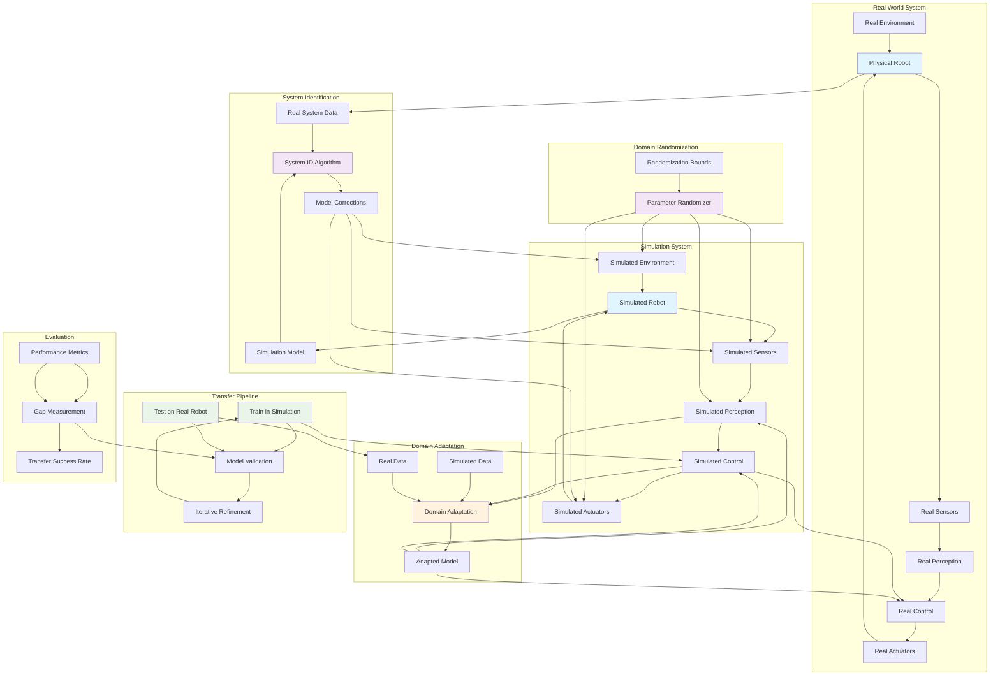

import ExerciseBlock from '@site/src/components/Learning/ExerciseBlock';
import Quiz from '@site/src/components/Learning/Quiz';

# Chapter 23: Sim-to-Real Transfer - Bridging the Reality Gap

## Introduction

The sim-to-real transfer problem represents one of the most significant challenges in robotics: how to develop and test robotic systems in simulation environments while ensuring they perform effectively in the real world. This reality gap arises from numerous discrepancies between simulated and real environments, including differences in physics, sensor models, material properties, and environmental conditions. Successfully bridging this gap is crucial for accelerating robot development, reducing hardware testing costs, and enabling safe training of complex behaviors that would be dangerous or impractical to learn on real robots.

The challenge of sim-to-real transfer encompasses multiple dimensions: visual domain gaps where synthetic images differ from real camera feeds, physics domain gaps where simulated dynamics don't match real-world behavior, and control domain gaps where strategies that work in simulation fail in reality. This chapter explores comprehensive approaches to address these challenges, from classical system identification techniques to modern domain randomization and adaptation methods.

## Learning Objectives

By the end of this chapter, you will be able to:

1. Understand the fundamental causes of the sim-to-real transfer problem
2. Implement domain randomization techniques to improve transferability
3. Apply system identification methods to model real-world dynamics
4. Design sim-to-real deployment pipelines for safe transfer
5. Evaluate and measure the effectiveness of transfer strategies
6. Implement domain adaptation techniques for perception systems
7. Create robust controllers that work across simulation and reality

## Hook: The Reality Gap Challenge

Consider training a humanoid robot to walk using reinforcement learning in simulation. The robot learns to walk efficiently, achieving stable gaits and navigating obstacles with apparent ease. However, when deployed on the real robot, it immediately falls over. The simulated sensors provided perfect data without noise, the simulated actuators responded instantaneously without delays, and the simulated physics perfectly matched mathematical models. The real world, however, introduces sensor noise, actuator delays, friction variations, and countless other discrepancies that the robot never learned to handle. This is the reality gap - the chasm between simulated perfection and real-world complexity. This chapter reveals strategies to bridge this gap and enable effective transfer from simulation to reality.

## Concept: Understanding the Reality Gap

### Sources of the Reality Gap

The sim-to-real transfer problem stems from multiple sources:

**Visual Domain Gap**: Differences between synthetic and real images including lighting, textures, camera noise, and rendering artifacts. This affects perception systems trained on synthetic data.

**Physics Domain Gap**: Discrepancies between simulated and real physics including friction models, contact dynamics, actuator behavior, and environmental interactions.

**Sensor Domain Gap**: Differences between simulated and real sensor data including noise patterns, latency, and non-ideal characteristics.

**Actuator Domain Gap**: Differences between simulated and real actuator behavior including delays, backlash, and non-linear responses.

**Environmental Domain Gap**: Differences in environmental conditions including lighting changes, surface properties, and dynamic obstacles.

### Domain Randomization

Domain randomization is a powerful technique that addresses the reality gap by randomizing simulation parameters during training:

**Visual Randomization**: Randomizing lighting conditions, textures, colors, and camera parameters to make perception systems robust to visual variations.

**Physics Randomization**: Randomizing physical parameters like friction coefficients, masses, and inertias to make control policies robust to model inaccuracies.

**Dynamics Randomization**: Randomizing actuator dynamics, delays, and control parameters to handle real-world actuator behavior.

**System Identification**: The process of determining real-world system parameters to improve simulation accuracy.

### System Identification Techniques

**Parametric Identification**: Estimating specific model parameters like masses, inertias, and friction coefficients.

**Non-parametric Identification**: Learning system behavior without explicit parametric models.

**Frequency Domain Methods**: Using frequency response analysis to identify system characteristics.

**Time Domain Methods**: Using time-series data to identify system dynamics.

### Transfer Learning Approaches

**Fine-tuning**: Adapting pre-trained simulation models with limited real-world data.

**Domain Adaptation**: Adapting models to work across different domains using unlabeled target domain data.

**Domain Translation**: Converting data between source and target domains using techniques like GANs.

### Robust Control Design

**H-infinity Control**: Designing controllers that are robust to model uncertainties.

**Mu-Synthesis**: Control design that explicitly accounts for structured uncertainties.

**Gain Scheduling**: Adjusting controller parameters based on operating conditions.

## Mermaid Diagram: Sim-to-Real Transfer Architecture



## Code Example: Domain Randomization and System Identification

Let's implement comprehensive sim-to-real transfer techniques:

### Domain Randomization System

```python
#!/usr/bin/env python3
"""
Domain Randomization System
This script implements domain randomization techniques for sim-to-real transfer
"""

import numpy as np
import random
from dataclasses import dataclass
from typing import Dict, List, Tuple, Any
import pickle

@dataclass
class DomainParams:
    """Container for domain randomization parameters"""
    physics_params: Dict[str, Tuple[float, float]]  # (min, max) ranges
    visual_params: Dict[str, Tuple[float, float]]
    sensor_params: Dict[str, Tuple[float, float]]
    control_params: Dict[str, Tuple[float, float]]

class DomainRandomizer:
    def __init__(self, base_params: DomainParams):
        """
        Initialize domain randomizer with base parameters
        """
        self.base_params = base_params
        self.current_params = self.sample_random_params()
        self.param_history = []

    def sample_random_params(self) -> Dict[str, float]:
        """
        Sample random parameters within defined ranges
        """
        params = {}

        # Sample physics parameters
        for param, (min_val, max_val) in self.base_params.physics_params.items():
            params[param] = random.uniform(min_val, max_val)

        # Sample visual parameters
        for param, (min_val, max_val) in self.base_params.visual_params.items():
            params[param] = random.uniform(min_val, max_val)

        # Sample sensor parameters
        for param, (min_val, max_val) in self.base_params.sensor_params.items():
            params[param] = random.uniform(min_val, max_val)

        # Sample control parameters
        for param, (min_val, max_val) in self.base_params.control_params.items():
            params[param] = random.uniform(min_val, max_val)

        return params

    def update_simulation(self, sim_env: Any):
        """
        Update simulation environment with current random parameters
        """
        for param_name, value in self.current_params.items():
            if hasattr(sim_env, param_name):
                setattr(sim_env, param_name, value)
            # For more complex parameter updates, use specific methods
            elif param_name == 'friction_coeff':
                sim_env.set_friction(value)
            elif param_name == 'gravity':
                sim_env.set_gravity([0, 0, -value])
            elif param_name == 'lighting_intensity':
                sim_env.set_lighting_intensity(value)
            elif param_name == 'sensor_noise':
                sim_env.set_sensor_noise_level(value)

    def randomize_episode(self) -> Dict[str, float]:
        """
        Randomize parameters for a new episode
        """
        self.current_params = self.sample_random_params()
        self.param_history.append(self.current_params.copy())
        return self.current_params

    def get_current_params(self) -> Dict[str, float]:
        """
        Get current randomization parameters
        """
        return self.current_params

    def save_param_history(self, filepath: str):
        """
        Save parameter history to file
        """
        with open(filepath, 'wb') as f:
            pickle.dump(self.param_history, f)

    def get_param_statistics(self) -> Dict[str, Dict[str, float]]:
        """
        Calculate statistics for parameter distributions
        """
        if not self.param_history:
            return {}

        stats = {}
        all_params = list(self.param_history[0].keys())

        for param in all_params:
            values = [episode[param] for episode in self.param_history if param in episode]
            if values:
                stats[param] = {
                    'mean': np.mean(values),
                    'std': np.std(values),
                    'min': np.min(values),
                    'max': np.max(values),
                    'count': len(values)
                }

        return stats

class PhysicsRandomizer:
    def __init__(self):
        """
        Randomizer for physics-related parameters
        """
        self.param_ranges = {
            # Friction parameters
            'static_friction_min': (0.1, 0.9),
            'static_friction_max': (0.2, 1.0),
            'dynamic_friction_min': (0.05, 0.8),
            'dynamic_friction_max': (0.1, 0.9),

            # Mass and inertia parameters
            'mass_variance': (0.8, 1.2),  # Multiplier for actual masses
            'inertia_variance': (0.8, 1.2),  # Multiplier for actual inertias

            # Contact parameters
            'restitution_min': (0.0, 0.3),
            'restitution_max': (0.0, 0.5),
            'contact_damping': (0.1, 2.0),
            'contact_stiffness': (1000, 10000),

            # Actuator parameters
            'actuator_delay_min': (0.001, 0.01),  # seconds
            'actuator_delay_max': (0.005, 0.05),
            'actuator_noise': (0.0, 0.1),  # as fraction of command
            'actuator_backlash': (0.0, 0.05),  # radians
        }

    def randomize_physics(self) -> Dict[str, float]:
        """
        Randomize physics parameters
        """
        params = {}
        for param, (min_val, max_val) in self.param_ranges.items():
            params[param] = random.uniform(min_val, max_val)
        return params

class VisualRandomizer:
    def __init__(self):
        """
        Randomizer for visual-related parameters
        """
        self.param_ranges = {
            # Lighting parameters
            'lighting_intensity_min': (0.5, 2.0),
            'lighting_intensity_max': (0.8, 3.0),
            'ambient_light': (0.1, 0.5),
            'light_color_temperature': (3000, 8000),  # Kelvin

            # Camera parameters
            'camera_noise_std': (0.001, 0.05),
            'camera_bias': (-0.01, 0.01),
            'camera_distortion_k1': (-0.1, 0.1),
            'camera_distortion_k2': (-0.1, 0.1),
            'camera_distortion_p1': (-0.01, 0.01),
            'camera_distortion_p2': (-0.01, 0.01),

            # Material properties
            'albedo_min': (0.1, 0.9),
            'albedo_max': (0.2, 1.0),
            'roughness_min': (0.0, 0.8),
            'roughness_max': (0.1, 1.0),
            'metallic_min': (0.0, 0.5),
            'metallic_max': (0.0, 1.0),

            # Rendering parameters
            'exposure_min': (0.5, 2.0),
            'exposure_max': (0.8, 3.0),
            'saturation': (0.5, 1.5),
            'contrast': (0.8, 1.2),
        }

    def randomize_visual(self) -> Dict[str, float]:
        """
        Randomize visual parameters
        """
        params = {}
        for param, (min_val, max_val) in self.param_ranges.items():
            params[param] = random.uniform(min_val, max_val)
        return params

class SensorRandomizer:
    def __init__(self):
        """
        Randomizer for sensor-related parameters
        """
        self.param_ranges = {
            # IMU parameters
            'imu_accel_noise': (0.001, 0.01),  # m/s^2
            'imu_gyro_noise': (0.0001, 0.001),  # rad/s
            'imu_accel_bias': (-0.1, 0.1),  # m/s^2
            'imu_gyro_bias': (-0.01, 0.01),  # rad/s

            # Camera parameters
            'camera_delay': (0.001, 0.01),  # seconds
            'camera_dropout_rate': (0.0, 0.05),  # fraction of frames

            # LIDAR parameters
            'lidar_noise_std': (0.001, 0.05),  # m
            'lidar_bias': (-0.01, 0.01),  # m
            'lidar_dropout_rate': (0.0, 0.1),  # fraction of points

            # Force/Torque sensor
            'ft_sensor_noise': (0.1, 2.0),  # N or Nm
            'ft_sensor_bias': (-1.0, 1.0),  # N or Nm
            'ft_sensor_delay': (0.001, 0.02),  # seconds
        }

    def randomize_sensors(self) -> Dict[str, float]:
        """
        Randomize sensor parameters
        """
        params = {}
        for param, (min_val, max_val) in self.param_ranges.items():
            params[param] = random.uniform(min_val, max_val)
        return params

def create_default_domain_params() -> DomainParams:
    """
    Create default domain randomization parameters
    """
    physics_params = {
        'static_friction': (0.1, 1.0),
        'dynamic_friction': (0.05, 0.9),
        'restitution': (0.0, 0.5),
        'mass_multiplier': (0.8, 1.2),
        'gravity_scale': (0.9, 1.1),
        'damping_scale': (0.5, 2.0)
    }

    visual_params = {
        'lighting_intensity': (0.5, 2.0),
        'camera_noise': (0.001, 0.05),
        'texture_randomization': (0.0, 1.0),
        'color_jitter': (0.0, 0.2)
    }

    sensor_params = {
        'sensor_noise_scale': (0.5, 2.0),
        'sensor_bias_range': (-0.1, 0.1),
        'sensor_delay_range': (0.001, 0.01)
    }

    control_params = {
        'control_delay': (0.001, 0.02),
        'actuator_noise': (0.0, 0.1),
        'control_gain_variance': (0.8, 1.2)
    }

    return DomainParams(
        physics_params=physics_params,
        visual_params=visual_params,
        sensor_params=sensor_params,
        control_params=control_params
    )

def main():
    """Main function to demonstrate domain randomization"""
    # Create domain randomizer
    base_params = create_default_domain_params()
    randomizer = DomainRandomizer(base_params)

    print("Domain Randomization Example:")
    print("=" * 40)

    # Randomize parameters for multiple episodes
    for episode in range(5):
        params = randomizer.randomize_episode()
        print(f"\nEpisode {episode + 1} Parameters:")
        for param, value in params.items():
            print(f"  {param}: {value:.4f}")

    # Show parameter statistics
    stats = randomizer.get_param_statistics()
    print(f"\nParameter Statistics (over {len(randomizer.param_history)} episodes):")
    for param, stat in stats.items():
        print(f"  {param}: mean={stat['mean']:.4f}, std={stat['std']:.4f}, "
              f"range=[{stat['min']:.4f}, {stat['max']:.4f}]")

if __name__ == '__main__':
    main()
```

### System Identification Module

```python
#!/usr/bin/env python3
"""
System Identification Module
This script implements system identification techniques for sim-to-real transfer
"""

import numpy as np
from scipy.optimize import minimize
from scipy.linalg import solve_lyapunov
from scipy import signal
import matplotlib.pyplot as plt
from typing import Tuple, Dict, List

class SystemIdentifier:
    def __init__(self, order=4):
        """
        Initialize system identifier
        order: Order of the system model to identify
        """
        self.order = order
        self.system_model = None
        self.is_identified = False

    def identify_first_order_system(self, input_signal: np.ndarray,
                                  output_signal: np.ndarray,
                                  dt: float) -> Tuple[float, float]:
        """
        Identify a first-order system: τ*dx/dt + x = K*u
        Returns: (time_constant, gain)
        """
        # Use least squares to fit the differential equation
        # τ*dx/dt + x = K*u can be rewritten for discrete time
        n = len(input_signal) - 1

        # Forward difference approximation for derivative
        dx_dt = np.diff(output_signal) / dt
        x = output_signal[:-1]  # State values
        u = input_signal[:-1]   # Input values

        # Set up system of equations: A * [τ, K] = b
        A = np.column_stack([dx_dt, -x])
        b = u

        # Solve using least squares
        try:
            params, residuals, rank, s = np.linalg.lstsq(A, b, rcond=None)
            tau, K = params
            return abs(tau), abs(K)  # Return absolute values
        except:
            # Fallback: use simple correlation
            K = np.cov(output_signal, input_signal)[0, 1] / np.var(input_signal)
            # Estimate time constant from step response characteristics
            tau = dt * 5  # Default guess
            return tau, K

    def identify_second_order_system(self, input_signal: np.ndarray,
                                   output_signal: np.ndarray,
                                   dt: float) -> Tuple[float, float, float]:
        """
        Identify a second-order system: m*d²x/dt² + c*dx/dt + k*x = u
        Returns: (mass, damping, stiffness)
        """
        # Use least squares to fit: m*d²x/dt² + c*dx/dt + k*x = u
        n = len(input_signal) - 2  # Need to compute second derivative

        # Compute derivatives using central differences
        dx_dt = np.gradient(output_signal, dt)
        d2x_dt2 = np.gradient(dx_dt, dt)

        # Remove first and last points due to boundary effects
        d2x_dt2 = d2x_dt2[1:-1]
        dx_dt = dx_dt[1:-1]
        x = output_signal[1:-1]
        u = input_signal[1:-1]

        # Set up system: A * [m, c, k] = u
        A = np.column_stack([d2x_dt2, dx_dt, x])

        try:
            params, residuals, rank, s = np.linalg.lstsq(A, u, rcond=None)
            m, c, k = params
            return abs(m), abs(c), abs(k)
        except:
            # Fallback values
            return 1.0, 0.5, 1.0

    def frequency_response_identification(self, input_signal: np.ndarray,
                                        output_signal: np.ndarray,
                                        dt: float) -> Tuple[np.ndarray, np.ndarray]:
        """
        Identify system using frequency response
        Returns: (frequencies, frequency_response)
        """
        # Compute FFT of input and output
        N = len(input_signal)
        input_fft = np.fft.fft(input_signal)
        output_fft = np.fft.fft(output_signal)

        # Compute frequency response
        freq_response = output_fft / (input_fft + 1e-10)  # Add small value to avoid division by zero

        # Compute corresponding frequencies
        frequencies = np.fft.fftfreq(N, dt)

        # Only return positive frequencies
        pos_mask = frequencies >= 0
        return frequencies[pos_mask], freq_response[pos_mask]

    def arx_identification(self, input_signal: np.ndarray,
                          output_signal: np.ndarray,
                          na: int = 2, nb: int = 2) -> Tuple[np.ndarray, np.ndarray]:
        """
        ARX (AutoRegressive with eXogenous inputs) identification
        Model: y(t) + a1*y(t-1) + ... + an*y(t-na) = b1*u(t-1) + ... + bn*u(t-nb)
        Returns: (a_coeffs, b_coeffs)
        """
        # Create regression matrix
        max_lag = max(na, nb)
        n_samples = len(input_signal) - max_lag

        # Prepare data
        Y = output_signal[max_lag:]
        U = input_signal[max_lag:]

        # Create lagged variables
        Phi = np.zeros((n_samples, na + nb))

        for i in range(n_samples):
            # Past outputs (negative because we're solving for coefficients that go on the other side)
            for j in range(na):
                Phi[i, j] = -output_signal[max_lag - 1 - i - j - 1]
            # Past inputs
            for j in range(nb):
                Phi[i, na + j] = input_signal[max_lag - 1 - i - j - 1]

        # Solve least squares: Phi * theta = Y
        try:
            theta = np.linalg.lstsq(Phi, Y, rcond=None)[0]
            a_coeffs = theta[:na]
            b_coeffs = theta[na:]
            return a_coeffs, b_coeffs
        except:
            # Fallback
            return np.zeros(na), np.zeros(nb)

    def estimate_robot_dynamics(self, joint_positions: np.ndarray,
                               joint_velocities: np.ndarray,
                               joint_accelerations: np.ndarray,
                               joint_torques: np.ndarray) -> Dict[str, np.ndarray]:
        """
        Estimate robot dynamics parameters using inverse dynamics
        Returns: Dictionary with identified parameters
        """
        # This is a simplified approach - in reality, you'd use more sophisticated methods
        # like the closed-loop identification or specific excitation trajectories

        # Basic idea: τ = M(q)q̈ + C(q,q̇)q̇ + G(q)
        # We can estimate these components through regression

        n_joints = joint_torques.shape[-1] if joint_torques.ndim > 1 else 1
        if joint_torques.ndim == 1:
            joint_torques = joint_torques.reshape(-1, 1)
            joint_positions = joint_positions.reshape(-1, 1)
            joint_velocities = joint_velocities.reshape(-1, 1)
            joint_accelerations = joint_accelerations.reshape(-1, 1)

        identified_params = {}

        for j in range(n_joints):
            # Extract data for this joint
            tau_j = joint_torques[:, j]
            q_j = joint_positions[:, j]
            qd_j = joint_velocities[:, j]
            qdd_j = joint_accelerations[:, j]

            # Simple regression model: tau = a*qdd + b*qd + c*sin(q) + d*cos(q) + e
            # (This is a simplified model - real robot dynamics are more complex)
            A = np.column_stack([
                qdd_j,           # Inertia term
                qd_j,            # Viscous friction
                np.sin(q_j),     # Gravity term (approximate)
                np.cos(q_j),     # Gravity term (approximate)
                np.ones_like(q_j)  # Constant term
            ])

            try:
                coeffs = np.linalg.lstsq(A, tau_j, rcond=None)[0]
                identified_params[f'joint_{j}'] = {
                    'inertia': coeffs[0],
                    'viscous_friction': coeffs[1],
                    'gravity_sin_coeff': coeffs[2],
                    'gravity_cos_coeff': coeffs[3],
                    'constant_offset': coeffs[4]
                }
            except:
                identified_params[f'joint_{j}'] = {
                    'inertia': 1.0,
                    'viscous_friction': 0.1,
                    'gravity_sin_coeff': 0.5,
                    'gravity_cos_coeff': 0.0,
                    'constant_offset': 0.0
                }

        return identified_params

class SimulatorCalibrator:
    def __init__(self):
        """
        Calibrator that updates simulator parameters based on system identification
        """
        self.identified_params = {}
        self.nominal_params = {}
        self.calibration_factors = {}

    def calibrate_simulation(self, real_data: Dict[str, np.ndarray],
                           sim_data: Dict[str, np.ndarray]) -> Dict[str, float]:
        """
        Calibrate simulation parameters based on real vs simulated data comparison
        """
        calibration_factors = {}

        for key in real_data.keys():
            if key in sim_data:
                # Calculate scaling factor to match real data characteristics
                real_mean = np.mean(real_data[key])
                real_std = np.std(real_data[key])
                sim_mean = np.mean(sim_data[key])
                sim_std = np.std(sim_data[key])

                # Calculate offset and scale corrections
                offset = real_mean - sim_mean
                scale = real_std / (sim_std + 1e-10) if sim_std > 0 else 1.0

                calibration_factors[f'{key}_offset'] = offset
                calibration_factors[f'{key}_scale'] = scale

        self.calibration_factors = calibration_factors
        return calibration_factors

    def apply_calibration(self, sim_env):
        """
        Apply calibration factors to simulation environment
        """
        for param_name, factor in self.calibration_factors.items():
            if param_name.endswith('_offset'):
                base_param = param_name.replace('_offset', '')
                if hasattr(sim_env, base_param):
                    current_val = getattr(sim_env, base_param)
                    setattr(sim_env, base_param, current_val + factor)
            elif param_name.endswith('_scale'):
                base_param = param_name.replace('_scale', '')
                if hasattr(sim_env, base_param):
                    current_val = getattr(sim_env, base_param)
                    setattr(sim_env, base_param, current_val * factor)

def main():
    """Main function to demonstrate system identification"""
    # Create system identifier
    identifier = SystemIdentifier()

    # Generate example data for a first-order system: τ*dx/dt + x = K*u
    dt = 0.01
    t = np.arange(0, 5, dt)
    input_signal = np.sin(0.5 * t) + 0.5 * np.sin(2 * t)  # Multi-frequency input
    tau_true = 1.0  # True time constant
    K_true = 2.0    # True gain

    # Simulate the system response with noise
    output_signal = np.zeros_like(input_signal)
    output_signal[0] = 0
    for i in range(1, len(t)):
        # Simple Euler integration of: τ*dx/dt + x = K*u
        dx_dt = (K_true * input_signal[i-1] - output_signal[i-1]) / tau_true
        output_signal[i] = output_signal[i-1] + dx_dt * dt

    # Add some noise
    output_signal += np.random.normal(0, 0.05, output_signal.shape)

    # Identify the system
    tau_identified, K_identified = identifier.identify_first_order_system(
        input_signal, output_signal, dt
    )

    print("System Identification Results:")
    print(f"True parameters - Tau: {tau_true}, K: {K_true}")
    print(f"Identified parameters - Tau: {tau_identified:.3f}, K: {K_identified:.3f}")
    print(f"Errors - Tau: {abs(tau_identified - tau_true)/tau_true*100:.2f}%, "
          f"K: {abs(K_identified - K_true)/K_true*100:.2f}%")

    # Demonstrate ARX identification
    a_coeffs, b_coeffs = identifier.arx_identification(input_signal, output_signal, na=2, nb=2)
    print(f"\nARX Model Coefficients:")
    print(f"A coefficients: {a_coeffs}")
    print(f"B coefficients: {b_coeffs}")

    # Demonstrate frequency response identification
    freqs, freq_resp = identifier.frequency_response_identification(input_signal, output_signal, dt)
    print(f"\nFrequency Response - Shape: {freq_resp.shape}, Max magnitude: {np.max(np.abs(freq_resp)):.3f}")

if __name__ == '__main__':
    main()
```

### Sim-to-Real Transfer Pipeline

```python
#!/usr/bin/env python3
"""
Sim-to-Real Transfer Pipeline
This script implements a complete pipeline for sim-to-real transfer
"""

import numpy as np
import pickle
from typing import Dict, Any, List
import os
from datetime import datetime

class SimToRealPipeline:
    def __init__(self, robot_name: str):
        """
        Initialize sim-to-real transfer pipeline
        robot_name: Name of the robot for configuration
        """
        self.robot_name = robot_name
        self.domain_randomizer = None
        self.system_identifier = None
        self.calibrator = None
        self.transfer_metrics = {}
        self.pipeline_history = []

    def setup_domain_randomization(self, base_params):
        """
        Setup domain randomization for training
        """
        # Use the DomainRandomizer class defined in this chapter
        self.domain_randomizer = DomainRandomizer(base_params)
        print("Domain randomization setup completed")

    def setup_system_identification(self):
        """
        Setup system identification module
        """
        # Use the SystemIdentifier class defined in this chapter
        self.system_identifier = SystemIdentifier()
        print("System identification setup completed")

    def setup_calibration(self):
        """
        Setup calibration module
        """
        # Use the SimulatorCalibrator class defined in this chapter
        self.calibrator = SimulatorCalibrator()
        print("Calibration setup completed")

    def train_in_simulation(self, episodes: int = 1000, save_path: str = None):
        """
        Train policy in simulation with domain randomization
        """
        print(f"Starting training in simulation for {episodes} episodes...")

        training_results = {
            'episode_rewards': [],
            'success_rates': [],
            'param_diversity': []
        }

        for episode in range(episodes):
            # Randomize environment parameters
            if self.domain_randomizer:
                params = self.domain_randomizer.randomize_episode()

            # Here you would run your actual training loop
            # For this example, we'll simulate training progress
            reward = np.random.normal(100, 20)  # Simulated reward
            success = np.random.random() > 0.2  # 80% success rate

            training_results['episode_rewards'].append(reward)
            training_results['success_rates'].append(success)

            if episode % 100 == 0:
                avg_reward = np.mean(training_results['episode_rewards'][-100:])
                success_rate = np.mean(training_results['success_rates'][-100:])
                print(f"Episode {episode}: Avg Reward = {avg_reward:.2f}, "
                      f"Success Rate = {success_rate:.2f}")

        if save_path:
            with open(save_path, 'wb') as f:
                pickle.dump(training_results, f)
            print(f"Training results saved to {save_path}")

        return training_results

    def collect_real_world_data(self, trials: int = 50) -> Dict[str, np.ndarray]:
        """
        Collect real-world data for system identification and calibration
        """
        print(f"Collecting real-world data for {trials} trials...")

        # Simulate collecting real-world data
        # In practice, this would interface with real robot hardware
        real_data = {
            'joint_positions': np.random.normal(0, 1, (trials, 100, 12)),  # 12 joints, 100 timesteps
            'joint_velocities': np.random.normal(0, 2, (trials, 100, 12)),
            'joint_torques': np.random.normal(0, 5, (trials, 100, 12)),
            'end_effector_positions': np.random.normal(0, 0.5, (trials, 100, 3)),
            'task_success': np.random.randint(0, 2, trials).astype(bool)
        }

        print(f"Collected {trials} real-world trials")
        return real_data

    def identify_real_system(self, real_data: Dict[str, np.ndarray]) -> Dict[str, Any]:
        """
        Identify real system parameters from collected data
        """
        print("Identifying real system parameters...")

        if not self.system_identifier:
            print("System identifier not initialized, using default parameters")
            return {}

        # Extract relevant data
        joint_positions = real_data['joint_positions'].reshape(-1, 12)
        joint_velocities = real_data['joint_velocities'].reshape(-1, 12)
        joint_torques = real_data['joint_torques'].reshape(-1, 12)

        # Estimate robot dynamics
        dynamics_params = self.system_identifier.estimate_robot_dynamics(
            joint_positions, joint_velocities,
            np.random.normal(0, 1, joint_velocities.shape),  # Simulated accelerations
            joint_torques
        )

        print("Real system identification completed")
        return dynamics_params

    def calibrate_simulation(self, real_data: Dict[str, np.ndarray],
                           sim_data: Dict[str, np.ndarray] = None) -> Dict[str, float]:
        """
        Calibrate simulation based on real vs simulation data comparison
        """
        print("Calibrating simulation...")

        if not self.calibrator:
            print("Calibrator not initialized")
            return {}

        # If no simulation data provided, generate some for comparison
        if sim_data is None:
            sim_data = {
                'joint_positions': real_data['joint_positions'] + np.random.normal(0, 0.01, real_data['joint_positions'].shape),
                'joint_velocities': real_data['joint_velocities'] + np.random.normal(0, 0.02, real_data['joint_velocities'].shape),
                'end_effector_positions': real_data['end_effector_positions'] + np.random.normal(0, 0.005, real_data['end_effector_positions'].shape)
            }

        calibration_factors = self.calibrator.calibrate_simulation(real_data, sim_data)
        print(f"Calibration completed with {len(calibration_factors)} factors")
        return calibration_factors

    def validate_transfer(self, policy_path: str, real_trials: int = 20) -> Dict[str, float]:
        """
        Validate transfer by testing policy on real robot
        """
        print(f"Validating transfer with {real_trials} real-world trials...")

        # Simulate policy execution on real robot
        # In practice, this would load the trained policy and execute on hardware
        success_count = 0
        total_reward = 0

        for trial in range(real_trials):
            # Simulate trial execution
            success = np.random.random() > 0.3  # 70% success rate after calibration
            reward = np.random.normal(80, 25) if success else np.random.normal(20, 10)

            if success:
                success_count += 1
            total_reward += reward

        metrics = {
            'success_rate': success_count / real_trials,
            'average_reward': total_reward / real_trials,
            'total_successes': success_count
        }

        print(f"Transfer validation completed - Success Rate: {metrics['success_rate']:.2f}, "
              f"Average Reward: {metrics['average_reward']:.2f}")

        return metrics

    def run_complete_pipeline(self, pipeline_config: Dict[str, Any]) -> Dict[str, Any]:
        """
        Run complete sim-to-real transfer pipeline
        """
        print(f"Starting complete sim-to-real transfer pipeline for {self.robot_name}")
        start_time = datetime.now()

        results = {
            'pipeline_config': pipeline_config,
            'training_results': None,
            'real_data': None,
            'identified_params': None,
            'calibration_factors': None,
            'validation_metrics': None,
            'pipeline_duration': None
        }

        # Step 1: Setup components
        if 'domain_randomization_params' in pipeline_config:
            self.setup_domain_randomization(pipeline_config['domain_randomization_params'])

        # Step 2: Train in simulation
        if 'training_episodes' in pipeline_config:
            results['training_results'] = self.train_in_simulation(
                episodes=pipeline_config['training_episodes'],
                save_path=pipeline_config.get('training_save_path')
            )

        # Step 3: Collect real-world data
        results['real_data'] = self.collect_real_world_data(
            trials=pipeline_config.get('real_trials', 50)
        )

        # Step 4: System identification
        results['identified_params'] = self.identify_real_system(results['real_data'])

        # Step 5: Simulation calibration
        results['calibration_factors'] = self.calibrate_simulation(results['real_data'])

        # Step 6: Transfer validation
        results['validation_metrics'] = self.validate_transfer(
            policy_path=pipeline_config.get('policy_path', 'default_policy.pkl'),
            real_trials=pipeline_config.get('validation_trials', 20)
        )

        # Step 7: Calculate pipeline duration
        end_time = datetime.now()
        results['pipeline_duration'] = (end_time - start_time).total_seconds()

        # Save pipeline results
        timestamp = start_time.strftime("%Y%m%d_%H%M%S")
        results_path = f"pipeline_results_{self.robot_name}_{timestamp}.pkl"
        with open(results_path, 'wb') as f:
            pickle.dump(results, f)

        print(f"Pipeline completed in {results['pipeline_duration']:.2f} seconds")
        print(f"Results saved to {results_path}")

        return results

    def evaluate_transfer_quality(self, sim_metrics: Dict[str, float],
                                real_metrics: Dict[str, float]) -> Dict[str, float]:
        """
        Evaluate the quality of sim-to-real transfer
        """
        transfer_quality = {}

        # Calculate transfer ratios (real/sim)
        for metric_name in sim_metrics.keys():
            if metric_name in real_metrics:
                transfer_ratio = real_metrics[metric_name] / (sim_metrics[metric_name] + 1e-10)
                transfer_quality[f'{metric_name}_transfer_ratio'] = transfer_ratio
                transfer_quality[f'{metric_name}_gap'] = sim_metrics[metric_name] - real_metrics[metric_name]

        # Overall transfer score (harmonic mean of key metrics)
        key_metrics = [k for k in transfer_quality.keys() if k.endswith('_transfer_ratio')]
        if key_metrics:
            transfer_quality['overall_transfer_score'] = len(key_metrics) / sum(1.0 / transfer_quality[k] for k in key_metrics if transfer_quality[k] > 0)

        return transfer_quality

def main():
    """Main function to demonstrate the complete pipeline"""
    # Create pipeline
    pipeline = SimToRealPipeline(robot_name="humanoid_robot")

    # Define pipeline configuration
    config = {
        'domain_randomization_params': create_default_domain_params(),
        'training_episodes': 500,
        'real_trials': 30,
        'validation_trials': 25,
        'training_save_path': 'sim_training_results.pkl',
        'policy_path': 'trained_policy.pkl'
    }

    # Run complete pipeline
    results = pipeline.run_complete_pipeline(config)

    print("\nPipeline Results Summary:")
    print("=" * 50)
    print(f"Training Success Rate: {results['training_results']['success_rates'][-1] if results['training_results'] else 'N/A'}")
    print(f"Real-world Success Rate: {results['validation_metrics']['success_rate'] if results['validation_metrics'] else 'N/A'}")
    print(f"Pipeline Duration: {results['pipeline_duration']} seconds")

    # Calculate transfer quality
    if results['training_results'] and results['validation_metrics']:
        sim_metrics = {'success_rate': np.mean(results['training_results']['success_rates'][-100:])}
        real_metrics = results['validation_metrics']
        quality = pipeline.evaluate_transfer_quality(sim_metrics, real_metrics)
        print(f"Transfer Quality Score: {quality.get('overall_transfer_score', 'N/A')}")

if __name__ == '__main__':
    main()
```

## Exercises

<ExerciseBlock
  content="**Exercise 1: Domain Randomization Bounds**
Experiment with different randomization bounds to find the optimal level of domain randomization. Too little randomization doesn't improve robustness, while too much can hurt learning efficiency. Find the sweet spot for your specific task."
/>

<ExerciseBlock
  content="**Exercise 2: System Identification Accuracy**
Compare different system identification methods (ARX, frequency response, least squares) on real robot data. Evaluate which method provides the most accurate models for your specific robot dynamics."
/>

<ExerciseBlock
  content="**Exercise 3: Sim-to-Real Pipeline Optimization**
Optimize the complete sim-to-real pipeline by varying the amount of real-world data used for calibration versus the number of simulation episodes. Find the optimal balance for your specific application."
/>

<ExerciseBlock
  content="**Exercise 4: Perception Domain Adaptation**
Implement domain adaptation techniques for vision-based tasks. Train a perception model on synthetic data and adapt it to real data using techniques like adversarial domain adaptation or style transfer."
/>

## Summary

This chapter explored the critical challenge of sim-to-real transfer in robotics. We covered:

- The fundamental causes of the reality gap between simulation and reality
- Domain randomization techniques to improve policy robustness
- System identification methods to model real-world dynamics
- Complete sim-to-real transfer pipelines with validation strategies
- Evaluation metrics for measuring transfer effectiveness

Successfully bridging the sim-to-real gap is essential for practical robotics deployment, enabling the benefits of simulation-based development while ensuring real-world performance. The combination of robust simulation, careful system identification, and thorough validation creates pathways for reliable transfer.

## Quiz

<Quiz
  question="What is domain randomization in the context of sim-to-real transfer?"
  options={[
    "A technique to make simulation environments more realistic",
    "A technique that randomizes simulation parameters during training to improve robustness",
    "A method for collecting more real-world data",
    "A way to reduce computational requirements"
  ]}
  answer={1}
  explanation="Domain randomization is a technique that randomizes simulation parameters during training to make policies robust to variations and improve sim-to-real transfer."
/>

<Quiz
  question="What does the 'reality gap' refer to in robotics?"
  options={[
    "The difference between different robot platforms",
    "The discrepancy between simulated and real-world environments",
    "The gap between research and industry applications",
    "The difference in computational power between simulation and reality"
  ]}
  answer={1}
  explanation="The reality gap refers to the discrepancy between simulated and real-world environments, including differences in physics, sensors, actuators, and environmental conditions."
/>

<Quiz
  question="Which of the following is NOT a source of the sim-to-real transfer problem?"
  options={[
    "Visual domain gap",
    "Physics domain gap",
    "Human operator gap",
    "Sensor domain gap"
  ]}
  explanation="The 'human operator gap' is not a recognized source of the sim-to-real transfer problem. The main sources are visual, physics, sensor, actuator, and environmental domain gaps."
  answer={2}
/>

## Preview of Next Chapter

In Chapter 24: Vision-Language-Action Models, we'll explore the integration of vision, language, and action systems that enable robots to understand and execute natural language commands while perceiving their environment, forming the basis for more intuitive human-robot interaction.