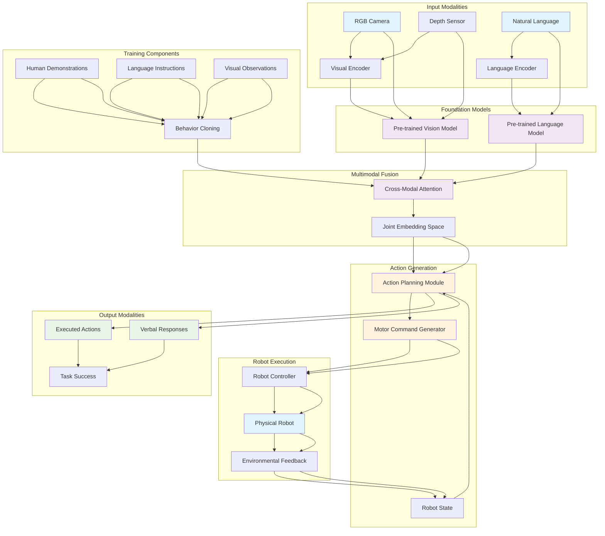

import ExerciseBlock from '@site/src/components/Learning/ExerciseBlock';
import Quiz from '@site/src/components/Learning/Quiz';

# Chapter 24: VLA Intro - Vision-Language-Action Models for Robotics

## Introduction

Vision-Language-Action (VLA) models represent a paradigm shift in robotics, integrating perception, language understanding, and action execution into unified neural architectures. Unlike traditional approaches that treat these components separately, VLA models learn joint representations that enable robots to perceive their environment, understand natural language commands, and execute appropriate actions in a cohesive manner. This integration allows for more natural human-robot interaction and enables robots to perform complex tasks that require understanding both visual context and linguistic instructions.

The emergence of large foundation models in computer vision and natural language processing has enabled the development of sophisticated VLA systems. These models can process visual inputs, interpret human language, and generate appropriate motor commands through end-to-end learning, creating more intuitive and capable robotic systems. This chapter explores the foundations of VLA models and their application to robotics.

## Learning Objectives

By the end of this chapter, you will be able to:

1. Understand the architecture and components of Vision-Language-Action models
2. Explain the benefits of joint vision-language-action learning for robotics
3. Identify key challenges in VLA model development and deployment
4. Compare different VLA model architectures and approaches
5. Evaluate VLA models for robotic task performance
6. Understand the role of foundation models in VLA development
7. Recognize the potential applications of VLA systems in real-world robotics

## Hook: The Natural Interaction Revolution

Imagine walking into a room and simply saying to a robot, "Please bring me the red cup from the table near the window, but wait - actually, bring the blue one instead." A traditional robot might struggle with this request, requiring precise programming for each possible command and object combination. But a Vision-Language-Action enabled robot can understand your natural language, perceive the environment to identify both cups, and execute the appropriate action based on your changing instructions. This seamless integration of seeing, understanding, and acting represents a revolution in human-robot interaction. This chapter reveals how VLA models make such natural interactions possible.

## Concept: Understanding VLA Models

### The VLA Framework

Vision-Language-Action models integrate three critical components:

**Vision Processing**: Understanding visual inputs from cameras, depth sensors, and other visual modalities to perceive the environment, identify objects, and understand spatial relationships.

**Language Understanding**: Processing natural language commands, questions, and contextual information to extract semantic meaning and task requirements.

**Action Generation**: Mapping the combined visual and linguistic understanding to appropriate motor commands and behaviors that achieve the desired outcome.

### Joint Embedding Spaces

VLA models operate by creating joint embedding spaces where visual, linguistic, and action representations exist in a unified framework:

**Multimodal Embeddings**: Visual and linguistic inputs are encoded into shared embedding spaces that capture semantic relationships between concepts.

**Cross-Modal Attention**: Attention mechanisms allow the model to focus on relevant visual features when processing language, and vice versa.

**Action Representations**: Motor commands and behaviors are represented in the same semantic space as visual and linguistic concepts.

### Foundation Model Integration

Modern VLA systems leverage large foundation models:

**Vision Encoders**: Pre-trained models like CLIP, DINO, or ConvNeXt that provide rich visual representations.

**Language Encoders**: Models like GPT, BERT, or T5 that provide sophisticated language understanding capabilities.

**Robot-Specific Adaptation**: Fine-tuning or adaptation techniques that specialize foundation models for robotic tasks.

### Key Architectural Approaches

**End-to-End Learning**: Training the entire VLA system jointly to optimize the complete perception-language-action pipeline.

**Modular Integration**: Combining pre-trained vision and language models with specialized action modules.

**Transformer-Based Architectures**: Using transformer networks to handle the sequential nature of both language and action planning.

**Diffusion Models**: Leveraging generative models for action planning and trajectory generation.

### Training Paradigms

**Behavior Cloning**: Learning from human demonstrations that include visual, linguistic, and action components.

**Reinforcement Learning**: Training through environmental feedback to optimize task performance.

**Language-Guided Learning**: Using natural language as a form of supervision for learning visual-action mappings.

**Multimodal Pre-training**: Pre-training on large datasets that include vision, language, and action components.

### Challenges in VLA Development

**Embodiment Problem**: Bridging the gap between abstract language/vision concepts and physical robot capabilities.

**Real-Time Performance**: Achieving low-latency processing for interactive robotic applications.

**Generalization**: Creating models that can handle novel objects, environments, and tasks not seen during training.

**Safety and Robustness**: Ensuring VLA systems behave safely when faced with ambiguous or incorrect inputs.

**Scalability**: Developing efficient training and inference methods for complex VLA models.

### Evaluation Metrics

**Task Success Rate**: Percentage of tasks completed successfully as measured by human evaluation or objective criteria.

**Language Understanding Accuracy**: How well the system interprets and follows natural language commands.

**Visual Grounding Quality**: Accuracy of object detection, localization, and scene understanding.

**Action Execution Precision**: How precisely the robot executes the intended actions.

**Human-Robot Interaction Quality**: Subjective measures of naturalness and effectiveness of interaction.

## Mermaid Diagram: VLA Model Architecture



## Code Example: VLA Model Implementation

Let's explore how to implement a basic VLA model architecture:

### Basic VLA Model Architecture

```python
#!/usr/bin/env python3
"""
Basic VLA Model Implementation
This script demonstrates a simple Vision-Language-Action model architecture
"""

import torch
import torch.nn as nn
import torch.nn.functional as F
from transformers import CLIPVisionModel, CLIPTextModel, CLIPTokenizer
import numpy as np
from typing import Dict, List, Tuple, Optional

class VisionEncoder(nn.Module):
    """Vision encoder using a pre-trained model"""
    def __init__(self, model_name="openai/clip-vit-base-patch32"):
        super().__init__()
        self.clip_vision = CLIPVisionModel.from_pretrained(model_name)

        # Additional processing layers
        self.visual_projection = nn.Linear(self.clip_vision.config.hidden_size, 512)
        self.spatial_attention = nn.MultiheadAttention(embed_dim=512, num_heads=8)

    def forward(self, images: torch.Tensor) -> torch.Tensor:
        """
        Encode visual inputs
        images: [batch_size, channels, height, width]
        """
        # Process through CLIP vision encoder
        outputs = self.clip_vision(pixel_values=images)
        visual_features = outputs.last_hidden_state  # [batch_size, num_patches, hidden_size]

        # Project to common embedding space
        projected_features = self.visual_projection(visual_features)  # [batch_size, num_patches, 512]

        # Apply spatial attention
        attended_features, _ = self.spatial_attention(
            projected_features, projected_features, projected_features
        )

        # Global average pooling to get single representation
        pooled_features = attended_features.mean(dim=1)  # [batch_size, 512]

        return pooled_features

class LanguageEncoder(nn.Module):
    """Language encoder using a pre-trained model"""
    def __init__(self, model_name="openai/clip-vit-base-patch32"):
        super().__init__()
        self.clip_text = CLIPTextModel.from_pretrained(model_name)
        self.tokenizer = CLIPTokenizer.from_pretrained(model_name)

        # Projection to common space
        self.text_projection = nn.Linear(self.clip_text.config.hidden_size, 512)

    def forward(self, texts: List[str]) -> torch.Tensor:
        """
        Encode text inputs
        texts: List of text strings
        """
        # Tokenize texts
        inputs = self.tokenizer(
            texts,
            padding=True,
            truncation=True,
            return_tensors="pt",
            max_length=77
        )

        # Process through CLIP text encoder
        outputs = self.clip_text(input_ids=inputs.input_ids)
        text_features = outputs.last_hidden_state[:, 0, :]  # Use [CLS] token

        # Project to common embedding space
        projected_features = self.text_projection(text_features)

        return projected_features

class ActionHead(nn.Module):
    """Action generation head for producing robot commands"""
    def __init__(self, feature_dim: int = 512, action_dim: int = 7):
        """
        feature_dim: Dimension of input features
        action_dim: Dimension of action space (e.g., 7 for 7-DOF arm)
        """
        super().__init__()
        self.action_dim = action_dim

        # Multi-layer perceptron for action generation
        self.mlp = nn.Sequential(
            nn.Linear(feature_dim, 1024),
            nn.ReLU(),
            nn.Dropout(0.1),
            nn.Linear(1024, 512),
            nn.ReLU(),
            nn.Dropout(0.1),
            nn.Linear(512, 256),
            nn.ReLU(),
            nn.Linear(256, action_dim)
        )

        # Optional: separate heads for different action types
        self.position_head = nn.Linear(256, 3)  # x, y, z position
        self.orientation_head = nn.Linear(256, 4)  # quaternion orientation
        self.gripper_head = nn.Linear(256, 1)  # gripper command

    def forward(self, features: torch.Tensor) -> Dict[str, torch.Tensor]:
        """
        Generate actions from features
        """
        # Process through shared layers
        shared_features = self.mlp[:-1](features)  # All layers except last

        # Generate different action components
        actions = {
            'joint_commands': self.mlp[-1](shared_features),  # Direct joint commands
            'position': self.position_head(shared_features),
            'orientation': self.orientation_head(shared_features),
            'gripper': torch.sigmoid(self.gripper_head(shared_features))  # Sigmoid for gripper
        }

        return actions

class CrossModalAttention(nn.Module):
    """Cross-modal attention between vision and language features"""
    def __init__(self, feature_dim: int = 512, num_heads: int = 8):
        super().__init__()
        self.feature_dim = feature_dim
        self.num_heads = num_heads
        self.head_dim = feature_dim // num_heads

        # Linear projections for Q, K, V
        self.q_proj = nn.Linear(feature_dim, feature_dim)
        self.k_proj = nn.Linear(feature_dim, feature_dim)
        self.v_proj = nn.Linear(feature_dim, feature_dim)

        # Output projection
        self.out_proj = nn.Linear(feature_dim, feature_dim)

    def forward(self, vision_features: torch.Tensor,
                language_features: torch.Tensor) -> torch.Tensor:
        """
        Apply cross-modal attention
        vision_features: [batch_size, feature_dim]
        language_features: [batch_size, feature_dim]
        """
        batch_size = vision_features.size(0)

        # Project features
        Q = self.q_proj(vision_features).view(batch_size, self.num_heads, self.head_dim)
        K = self.k_proj(language_features).view(batch_size, self.num_heads, self.head_dim)
        V = self.v_proj(language_features).view(batch_size, self.num_heads, self.head_dim)

        # Compute attention scores
        attention_scores = torch.matmul(Q, K.transpose(-2, -1)) / (self.head_dim ** 0.5)
        attention_weights = F.softmax(attention_scores, dim=-1)

        # Apply attention to values
        attended_features = torch.matmul(attention_weights, V)
        attended_features = attended_features.view(batch_size, self.feature_dim)

        # Output projection
        output = self.out_proj(attended_features)

        return output

class VLAModel(nn.Module):
    """Complete Vision-Language-Action model"""
    def __init__(self, action_dim: int = 7):
        super().__init__()

        self.vision_encoder = VisionEncoder()
        self.language_encoder = LanguageEncoder()
        self.cross_attention = CrossModalAttention()
        self.action_head = ActionHead(action_dim=action_dim)

        # Learnable fusion parameters
        self.vision_weight = nn.Parameter(torch.tensor(0.5))
        self.language_weight = nn.Parameter(torch.tensor(0.5))

    def forward(self, images: torch.Tensor, texts: List[str]) -> Dict[str, torch.Tensor]:
        """
        Forward pass through complete VLA model
        """
        # Encode vision and language separately
        vision_features = self.vision_encoder(images)
        language_features = self.language_encoder(texts)

        # Apply cross-modal attention
        attended_features = self.cross_attention(vision_features, language_features)

        # Combine with original features using learnable weights
        combined_features = (torch.sigmoid(self.vision_weight) * vision_features +
                           torch.sigmoid(self.language_weight) * language_features +
                           attended_features)

        # Generate actions
        actions = self.action_head(combined_features)

        return actions

    def encode_state(self, image: torch.Tensor, text: str) -> torch.Tensor:
        """
        Encode a single state (image + text) to action space
        """
        vision_features = self.vision_encoder(image.unsqueeze(0))
        language_features = self.language_encoder([text])

        # Combine features
        combined = (0.5 * vision_features + 0.5 * language_features)

        return combined

def main():
    """Main function to demonstrate VLA model"""
    # Initialize model
    model = VLAModel(action_dim=7)  # 7-DOF robot arm

    # Create dummy inputs
    batch_size = 2
    images = torch.randn(batch_size, 3, 224, 224)  # RGB images
    texts = ["Pick up the red cup", "Move to the left"]

    # Forward pass
    actions = model(images, texts)

    print("VLA Model Output:")
    print(f"Joint commands shape: {actions['joint_commands'].shape}")
    print(f"Position commands shape: {actions['position'].shape}")
    print(f"Orientation commands shape: {actions['orientation'].shape}")
    print(f"Gripper commands shape: {actions['gripper'].shape}")

    print(f"\nExample joint commands: {actions['joint_commands'][0].detach().numpy()}")
    print(f"Example position: {actions['position'][0].detach().numpy()}")
    print(f"Example gripper: {actions['gripper'][0].detach().numpy()}")

if __name__ == '__main__':
    main()
```

### VLA Training and Data Pipeline

```python
#!/usr/bin/env python3
"""
VLA Training and Data Pipeline
This script demonstrates how to train a VLA model with multimodal data
"""

import torch
import torch.nn as nn
import torch.optim as optim
from torch.utils.data import Dataset, DataLoader
import numpy as np
from typing import Dict, List, Tuple
import random

class VLADataset(Dataset):
    """Dataset class for Vision-Language-Action data"""
    def __init__(self, demonstrations: List[Dict]):
        """
        demonstrations: List of dicts with keys:
            - 'image': visual observation
            - 'instruction': natural language instruction
            - 'action': robot action
            - 'robot_state': current robot state
        """
        self.demonstrations = demonstrations

    def __len__(self):
        return len(self.demonstrations)

    def __getitem__(self, idx: int) -> Dict:
        demo = self.demonstrations[idx]

        return {
            'image': demo['image'],
            'instruction': demo['instruction'],
            'action': demo['action'],
            'robot_state': demo['robot_state']
        }

class VLAReinforcer:
    """Reinforcement learning component for VLA training"""
    def __init__(self, model: nn.Module, learning_rate: float = 1e-4):
        self.model = model
        self.optimizer = optim.Adam(model.parameters(), lr=learning_rate)
        self.criterion = nn.MSELoss()

    def compute_reward(self, predicted_action: torch.Tensor,
                      true_action: torch.Tensor,
                      task_success: bool) -> torch.Tensor:
        """
        Compute reward based on action similarity and task success
        """
        # Action similarity reward
        action_reward = -torch.mean((predicted_action - true_action) ** 2)

        # Task success bonus
        success_bonus = torch.tensor(1.0 if task_success else 0.0, device=predicted_action.device)

        # Combined reward
        total_reward = action_reward + 2.0 * success_bonus  # Weight success more heavily

        return total_reward

    def train_step(self, batch: Dict, language_instructions: List[str]) -> Dict:
        """
        Perform a single training step
        """
        self.model.train()

        # Extract batch data
        images = batch['image']
        true_actions = batch['action']
        robot_states = batch['robot_state']

        # Forward pass
        predicted_actions = self.model(images, language_instructions)

        # Use joint commands for loss calculation
        predicted_joint_commands = predicted_actions['joint_commands']

        # Compute loss
        action_loss = self.criterion(predicted_joint_commands, true_actions)

        # Compute additional losses if available
        total_loss = action_loss

        # Backpropagate
        self.optimizer.zero_grad()
        total_loss.backward()
        self.optimizer.step()

        return {
            'loss': total_loss.item(),
            'action_loss': action_loss.item()
        }

    def finetune_with_language(self, dataset: VLADataset,
                              num_epochs: int = 10,
                              batch_size: int = 4):
        """
        Fine-tune VLA model with language-guided learning
        """
        dataloader = DataLoader(dataset, batch_size=batch_size, shuffle=True)

        for epoch in range(num_epochs):
            epoch_loss = 0.0
            num_batches = 0

            for batch in dataloader:
                # Extract language instructions from batch
                language_instructions = [demo['instruction'] for demo in batch]

                # Perform training step
                losses = self.train_step(batch, language_instructions)

                epoch_loss += losses['loss']
                num_batches += 1

                if num_batches % 10 == 0:
                    print(f"Epoch {epoch+1}, Batch {num_batches}, Loss: {losses['loss']:.4f}")

            avg_loss = epoch_loss / num_batches
            print(f"Epoch {epoch+1} completed, Average Loss: {avg_loss:.4f}")

class VLAInstructor:
    """Component for handling natural language instructions in VLA context"""
    def __init__(self):
        # Define common action primitives and their linguistic variations
        self.action_primitives = {
            'pick': ['pick', 'grasp', 'grab', 'take', 'lift'],
            'place': ['place', 'put', 'set', 'drop', 'release'],
            'move': ['move', 'go', 'navigate', 'approach', 'reach'],
            'push': ['push', 'press', 'apply force'],
            'pull': ['pull', 'drag', 'tug'],
            'rotate': ['rotate', 'turn', 'spin', 'twist'],
            'open': ['open', 'uncover', 'reveal'],
            'close': ['close', 'shut', 'cover']
        }

        # Object categories
        self.object_categories = [
            'cup', 'bottle', 'box', 'ball', 'book', 'phone', 'toy',
            'utensil', 'container', 'furniture', 'tool', 'device'
        ]

    def parse_instruction(self, instruction: str) -> Dict:
        """
        Parse natural language instruction into action components
        """
        instruction_lower = instruction.lower()

        # Identify action primitive
        action_primitive = None
        for primitive, variations in self.action_primitives.items():
            if any(variation in instruction_lower for variation in variations):
                action_primitive = primitive
                break

        # Identify object
        object_name = None
        for obj in self.object_categories:
            if obj in instruction_lower:
                object_name = obj
                break

        # Identify spatial relationships
        spatial_indicators = ['left', 'right', 'front', 'back', 'near', 'on', 'under', 'above']
        spatial_info = [word for word in instruction_lower.split() if word in spatial_indicators]

        return {
            'action_primitive': action_primitive,
            'object': object_name,
            'spatial_info': spatial_info,
            'original_instruction': instruction
        }

    def generate_training_pairs(self, raw_instructions: List[str]) -> List[Tuple[str, Dict]]:
        """
        Generate training pairs from raw instructions
        """
        pairs = []
        for instruction in raw_instructions:
            parsed = self.parse_instruction(instruction)
            pairs.append((instruction, parsed))

        return pairs

def create_sample_demonstrations(num_samples: int = 100) -> List[Dict]:
    """
    Create sample demonstrations for training
    """
    demonstrations = []

    for i in range(num_samples):
        # Generate random demonstration
        demo = {
            'image': torch.randn(3, 224, 224),  # Simulated image
            'instruction': random.choice([
                "Pick up the red cup",
                "Move the box to the left",
                "Place the book on the table",
                "Grasp the blue bottle",
                "Navigate to the kitchen counter"
            ]),
            'action': torch.randn(7),  # Simulated 7-DOF action
            'robot_state': torch.randn(14)  # Simulated robot state (joint pos + vel)
        }
        demonstrations.append(demo)

    return demonstrations

def main():
    """Main function to demonstrate VLA training pipeline"""
    print("Setting up VLA Training Pipeline...")

    # Initialize components
    model = VLAModel(action_dim=7)
    reinforcer = VLAReinforcer(model)
    instructor = VLAInstructor()

    # Create sample demonstrations
    demonstrations = create_sample_demonstrations(num_samples=50)
    dataset = VLADataset(demonstrations)

    print(f"Created dataset with {len(dataset)} demonstrations")

    # Parse some sample instructions
    sample_instructions = [
        "Pick up the red cup and place it on the table",
        "Move the robot arm to the left and grasp the object",
        "Navigate to the blue box and open it carefully"
    ]

    for instruction in sample_instructions:
        parsed = instructor.parse_instruction(instruction)
        print(f"Instruction: '{instruction}'")
        print(f"  Parsed: {parsed}")
        print()

    # Train the model (simulated)
    print("Starting training simulation...")
    # For this example, we'll just run a few steps to demonstrate the pipeline
    sample_batch = {
        'image': torch.randn(4, 3, 224, 224),
        'action': torch.randn(4, 7),
        'robot_state': torch.randn(4, 14)
    }

    language_instr = ["Pick up object", "Move left", "Grasp firmly", "Navigate"]

    for step in range(5):  # Simulate 5 training steps
        losses = reinforcer.train_step(sample_batch, language_instr)
        print(f"Training Step {step+1}: Loss = {losses['loss']:.4f}")

    print("VLA Training Pipeline demonstration completed!")

if __name__ == '__main__':
    main()
```

### VLA Integration with Robot Systems

```python
#!/usr/bin/env python3
"""
VLA Integration with Robot Systems
This script demonstrates how to integrate VLA models with actual robot systems
"""

import torch
import numpy as np
import time
from typing import Dict, Any, Optional
import rospy
from sensor_msgs.msg import Image, JointState
from geometry_msgs.msg import PoseStamped
from std_msgs.msg import String
from cv_bridge import CvBridge
import threading

class VLAController:
    """Controller that integrates VLA model with robot hardware"""
    def __init__(self, vla_model_path: Optional[str] = None):
        # Initialize VLA model
        self.model = VLAModel(action_dim=7)  # Assuming 7-DOF robot arm

        if vla_model_path:
            # Load pre-trained model
            self.model.load_state_dict(torch.load(vla_model_path))

        self.model.eval()

        # ROS interface
        self.cv_bridge = CvBridge()

        # Robot state
        self.current_image = None
        self.current_joint_states = None
        self.pending_instruction = None

        # Publishers and subscribers
        self.joint_command_pub = rospy.Publisher('/joint_commands', JointState, queue_size=10)
        self.instruction_sub = rospy.Subscriber('/vla_instructions', String, self.instruction_callback)
        self.image_sub = rospy.Subscriber('/camera/image_raw', Image, self.image_callback)
        self.joint_sub = rospy.Subscriber('/joint_states', JointState, self.joint_callback)

        # Control parameters
        self.control_freq = 10  # Hz
        self.max_action_steps = 100  # Maximum steps per action

    def instruction_callback(self, msg: String):
        """Handle incoming natural language instructions"""
        self.pending_instruction = msg.data
        rospy.loginfo(f"Received VLA instruction: {msg.data}")

    def image_callback(self, msg: Image):
        """Handle incoming camera images"""
        try:
            cv_image = self.cv_bridge.imgmsg_to_cv2(msg, desired_encoding='rgb8')
            # Convert to tensor and normalize
            self.current_image = torch.from_numpy(cv_image).float().permute(2, 0, 1).unsqueeze(0) / 255.0
        except Exception as e:
            rospy.logerr(f"Error processing image: {e}")

    def joint_callback(self, msg: JointState):
        """Handle incoming joint states"""
        self.current_joint_states = msg

    def execute_instruction(self, instruction: str) -> bool:
        """Execute a natural language instruction using VLA"""
        if self.current_image is None:
            rospy.logwarn("No current image available for VLA execution")
            return False

        try:
            # Process with VLA model
            with torch.no_grad():
                actions = self.model(self.current_image, [instruction])

            # Extract joint commands
            joint_commands = actions['joint_commands'][0].cpu().numpy()

            # Execute action sequence
            success = self.execute_action_sequence(joint_commands)

            return success

        except Exception as e:
            rospy.logerr(f"Error executing VLA instruction: {e}")
            return False

    def execute_action_sequence(self, target_joints: np.ndarray) -> bool:
        """Execute a sequence of joint commands"""
        if self.current_joint_states is None:
            return False

        # Get current joint positions
        current_pos = np.array(self.current_joint_states.position)

        # Calculate trajectory
        num_steps = self.max_action_steps
        joint_trajectory = np.linspace(current_pos, target_joints, num_steps)

        # Execute trajectory
        rate = rospy.Rate(self.control_freq)
        for step in range(num_steps):
            # Create joint command message
            cmd_msg = JointState()
            cmd_msg.position = joint_trajectory[step].tolist()
            cmd_msg.velocity = [0.0] * len(cmd_msg.position)  # Zero velocity
            cmd_msg.effort = [0.0] * len(cmd_msg.position)   # Zero effort

            # Publish command
            self.joint_command_pub.publish(cmd_msg)

            rate.sleep()

        return True

    def run(self):
        """Main execution loop"""
        rate = rospy.Rate(self.control_freq)

        while not rospy.is_shutdown():
            # Check for pending instructions
            if self.pending_instruction:
                instruction = self.pending_instruction
                self.pending_instruction = None

                rospy.loginfo(f"Executing VLA instruction: {instruction}")
                success = self.execute_instruction(instruction)

                if success:
                    rospy.loginfo("VLA instruction executed successfully")
                else:
                    rospy.logerr("VLA instruction execution failed")

            rate.sleep()

class VLAInteractionManager:
    """Manager for handling VLA-based human-robot interaction"""
    def __init__(self):
        self.conversation_history = []
        self.current_task = None
        self.task_context = {}

    def process_human_input(self, user_input: str) -> str:
        """Process human input and generate appropriate response"""
        # Add to conversation history
        self.conversation_history.append(('human', user_input))

        # Parse the input
        parsed = self.parse_user_request(user_input)

        # Generate response based on context
        response = self.generate_response(parsed)

        # Add to conversation history
        self.conversation_history.append(('robot', response))

        return response

    def parse_user_request(self, user_input: str) -> Dict:
        """Parse user request into structured format"""
        # This would typically use a more sophisticated NLP model
        # For now, using simple keyword matching

        request_type = 'command' if any(word in user_input.lower()
                                      for word in ['pick', 'move', 'place', 'grasp', 'go']) else 'query'

        return {
            'type': request_type,
            'text': user_input,
            'entities': self.extract_entities(user_input),
            'intent': self.classify_intent(user_input)
        }

    def extract_entities(self, text: str) -> List[str]:
        """Extract entities (objects, locations, etc.) from text"""
        # Simple keyword-based extraction
        objects = ['cup', 'bottle', 'box', 'book', 'phone', 'table', 'chair', 'counter']
        locations = ['left', 'right', 'front', 'back', 'center', 'kitchen', 'desk', 'shelf']

        found_entities = []
        text_lower = text.lower()

        for obj in objects:
            if obj in text_lower:
                found_entities.append(obj)

        for loc in locations:
            if loc in text_lower:
                found_entities.append(loc)

        return found_entities

    def classify_intent(self, text: str) -> str:
        """Classify the intent of the user request"""
        text_lower = text.lower()

        if any(word in text_lower for word in ['pick', 'grasp', 'grab', 'take']):
            return 'grasp_object'
        elif any(word in text_lower for word in ['move', 'go', 'navigate', 'approach']):
            return 'navigate'
        elif any(word in text_lower for word in ['place', 'put', 'set', 'drop']):
            return 'place_object'
        elif any(word in text_lower for word in ['what', 'where', 'how', 'describe']):
            return 'query'
        else:
            return 'unknown'

    def generate_response(self, parsed_request: Dict) -> str:
        """Generate response based on parsed request"""
        intent = parsed_request['intent']
        entities = parsed_request['entities']

        if intent == 'grasp_object':
            if entities:
                obj = entities[0] if entities else 'object'
                return f"I will pick up the {obj}. Please wait."
            else:
                return "I need to know which object to pick up."
        elif intent == 'navigate':
            location = entities[-1] if entities else 'location'
            return f"I will navigate to the {location}."
        elif intent == 'place_object':
            location = entities[-1] if entities else 'location'
            return f"I will place the object at the {location}."
        elif intent == 'query':
            return "I can help with various tasks. Please give me a specific instruction."
        else:
            return "I didn't understand that. Please give me a clear instruction."

def main():
    """Main function to demonstrate VLA integration"""
    print("Initializing VLA Robot Integration...")

    # Initialize ROS node
    rospy.init_node('vla_robot_controller', anonymous=True)

    # Create VLA controller
    vla_controller = VLAController()

    # Create interaction manager
    interaction_manager = VLAInteractionManager()

    # Simulate some interaction
    sample_inputs = [
        "Please pick up the red cup from the table",
        "Move to the left side of the room",
        "Place the object on the shelf",
        "What do you see?"
    ]

    print("Sample VLA Interaction Simulation:")
    print("=" * 40)

    for user_input in sample_inputs:
        response = interaction_manager.process_human_input(user_input)
        print(f"User: {user_input}")
        print(f"Robot: {response}")
        print()

    print("VLA Integration demonstration completed!")

    # In a real scenario, you would run the controller
    # vla_controller.run()

if __name__ == '__main__':
    main()
```

## Exercises

<ExerciseBlock
  content="**Exercise 1: VLA Model Architecture**
Implement a more sophisticated VLA model that incorporates attention mechanisms between vision, language, and action modalities. Experiment with different fusion strategies and evaluate their impact on performance."
/>

<ExerciseBlock
  content="**Exercise 2: Multimodal Training Data**
Create a dataset of vision-language-action triplets for a specific robotic task. Implement data augmentation techniques for multimodal data and train a VLA model on your dataset."
/>

<ExerciseBlock
  content="**Exercise 3: Language Grounding Evaluation**
Evaluate how well your VLA model grounds language instructions to visual concepts. Test with ambiguous instructions and analyze the model's ability to resolve referential uncertainty."
/>

<ExerciseBlock
  content="**Exercise 4: Real Robot Integration**
Integrate your VLA model with a real robot platform. Address challenges like real-time performance, sensor noise, and safety considerations in the deployment."
/>

## Summary

This chapter introduced Vision-Language-Action (VLA) models, which represent a significant advancement in robotics by integrating perception, language understanding, and action execution in unified neural architectures. We covered:

- The fundamental architecture of VLA models and their multimodal components
- Joint embedding spaces that enable cross-modal understanding
- Integration of foundation models for vision and language processing
- Training paradigms for VLA systems including behavior cloning and reinforcement learning
- Challenges in VLA development such as embodiment and real-time performance
- Practical implementation of VLA models with robot systems

VLA models enable more natural and intuitive human-robot interaction by allowing robots to understand and respond to natural language commands while perceiving and acting in their environment. This integration represents a key step toward more capable and user-friendly robotic systems.

## Quiz

<Quiz
  question="What are the three main components of a Vision-Language-Action (VLA) model?"
  options={[
    "Vision, Navigation, Manipulation",
    "Vision, Language, Action",
    "Perception, Planning, Control",
    "Sensing, Processing, Actuation"
  ]}
  answer={1}
  explanation="VLA models integrate Vision (perception), Language (understanding), and Action (execution) components in a unified architecture."
/>

<Quiz
  question="What is the main advantage of joint vision-language-action learning compared to separate components?"
  options={[
    "Lower computational requirements",
    "Better integration and natural human-robot interaction",
    "Simpler implementation",
    "Reduced training time"
  ]}
  answer={1}
  explanation="The main advantage is better integration that enables more natural human-robot interaction by processing all modalities together."
/>

<Quiz
  question="What challenge does the 'embodiment problem' refer to in VLA models?"
  options={[
    "Physical size constraints of robot hardware",
    "Bridging abstract language/vision concepts and physical robot capabilities",
    "Power consumption of multimodal systems",
    "Communication between different robot modules"
  ]}
  explanation="The embodiment problem refers to bridging the gap between abstract language and vision concepts and the physical capabilities and constraints of the robot body."
  answer={1}
/>

## Preview of Next Chapter

In Chapter 25: Voice to Action, we'll explore how to integrate speech recognition and natural language processing with VLA systems, enabling robots to respond to spoken commands and engage in conversational interactions while performing complex tasks in their environment.