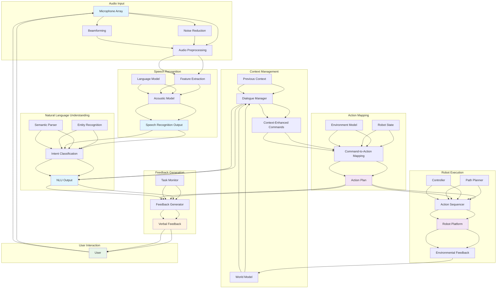

import ExerciseBlock from '@site/src/components/Learning/ExerciseBlock';
import Quiz from '@site/src/components/Learning/Quiz';

# Chapter 25: Voice to Action - Speech-Driven Robotic Control

## Introduction

Voice to Action represents the integration of automatic speech recognition (ASR), natural language understanding (NLU), and robotic action execution to create intuitive voice-controlled robotic systems. This technology enables robots to understand spoken commands and translate them into appropriate physical actions, creating more natural and accessible human-robot interaction. By combining advanced speech processing with robotic control systems, Voice to Action bridges the gap between human communication patterns and robotic capabilities, allowing for more seamless collaboration between humans and robots.

The challenge of Voice to Action lies in accurately recognizing speech in diverse acoustic environments, understanding the semantic meaning of natural language commands, and mapping these commands to appropriate robotic behaviors. This integration requires sophisticated processing pipelines that can handle speech variability, environmental noise, and the complex relationship between linguistic descriptions and physical actions.

## Learning Objectives

By the end of this chapter, you will be able to:

1. Understand the components of voice-to-action systems: ASR, NLU, and action mapping
2. Implement speech recognition pipelines optimized for robotic applications
3. Design natural language understanding systems for robot command interpretation
4. Map linguistic commands to robotic action spaces and behaviors
5. Handle ambiguity and error recovery in voice-controlled robotic systems
6. Evaluate voice-to-action systems for accuracy, robustness, and usability
7. Integrate voice interfaces with existing robotic platforms and architectures

## Hook: The Conversational Robot Vision

Imagine a future where robots seamlessly understand and respond to natural conversation. You could say, "Hey robot, could you please bring me my coffee from the kitchen and let me know when you're heading back?" The robot would not only understand your request but also provide feedback through natural language as it executes the task. This level of conversational interaction requires sophisticated integration of speech recognition, natural language understanding, and robotic action planning. Voice to Action technology makes this vision possible by creating systems that can process spoken language and translate it into meaningful robotic behaviors.

## Concept: Voice to Action Fundamentals

### Automatic Speech Recognition (ASR)

Automatic Speech Recognition forms the foundation of voice-to-action systems:

**Acoustic Models**: Neural networks that map audio features to phonetic units or subword units, trained on large datasets of speech recordings.

**Language Models**: Models that capture linguistic patterns and help resolve ambiguities in speech recognition by considering the probability of word sequences.

**Audio Preprocessing**: Techniques for noise reduction, echo cancellation, and audio enhancement to improve recognition accuracy in challenging acoustic environments.

**End-to-End ASR**: Modern approaches that directly map audio to text without explicit intermediate representations, often using attention mechanisms and transformer architectures.

### Natural Language Understanding (NLU)

Natural Language Understanding interprets the recognized text for robotic action:

**Intent Recognition**: Classification of user utterances into specific action categories or tasks (e.g., "navigation," "grasping," "querying").

**Entity Extraction**: Identification of specific objects, locations, or parameters mentioned in commands (e.g., "red cup," "kitchen table," "left side").

**Semantic Parsing**: Conversion of natural language into structured representations that can be processed by robotic systems.

**Context Understanding**: Incorporation of conversational context, world knowledge, and previous interactions to disambiguate commands.

### Action Mapping and Execution

The action mapping component translates linguistic commands to robotic behaviors:

**Command-to-Action Mapping**: Translation of high-level linguistic commands into specific robot actions, trajectories, or behaviors.

**Parameter Extraction**: Extraction of quantitative parameters from language (distances, speeds, object properties) for precise action execution.

**Behavior Selection**: Selection of appropriate robotic behaviors based on command semantics and environmental context.

**Multi-step Planning**: Decomposition of complex voice commands into sequences of robotic actions.

### Acoustic Environment Challenges

Voice-to-action systems must handle various acoustic challenges:

**Background Noise**: Environmental sounds that interfere with speech recognition, requiring noise reduction and robust feature extraction.

**Reverberation**: Sound reflections in rooms that can distort speech signals, particularly challenging for far-field recognition.

**Speaker Variability**: Differences in accent, speaking rate, and vocal characteristics that affect recognition accuracy.

**Distance and Direction**: Variations in speech signal quality based on speaker distance and direction relative to microphones.

### Context and Dialogue Management

Effective voice-to-action systems maintain conversational context:

**Coreference Resolution**: Understanding pronouns and referring expressions (e.g., "it," "that," "the other one") in context.

**Dialogue State Tracking**: Maintaining information about the current conversation state and user goals.

**Confirmation and Clarification**: Strategies for handling ambiguous commands through user confirmation or clarification requests.

**Error Recovery**: Mechanisms for recovering from recognition or understanding errors through natural conversation.

### Integration with VLA Systems

Voice-to-action systems integrate with broader Vision-Language-Action frameworks:

**Multimodal Fusion**: Combining speech input with visual and other sensory information for more robust understanding.

**Cross-Modal Grounding**: Using visual information to disambiguate spoken references and improve action selection.

**Feedback Generation**: Producing natural language feedback to confirm understanding and report task progress.

### Real-Time Processing Requirements

Voice-to-action systems must operate in real-time for natural interaction:

**Low Latency**: Fast recognition and response times to maintain natural conversational flow.

**Streaming Processing**: Ability to process speech as it's being spoken rather than waiting for complete utterances.

**Resource Efficiency**: Optimized models that can run on robotic platforms with limited computational resources.

## Mermaid Diagram: Voice to Action Architecture



## Code Example: Voice to Action Implementation

Let's implement a comprehensive voice-to-action system:

### Speech Recognition and Processing Pipeline

```python
#!/usr/bin/env python3
"""
Speech Recognition and Processing Pipeline
This script implements a complete speech recognition pipeline for robotic applications
"""

import torch
import torch.nn as nn
import numpy as np
import librosa
import whisper
import speech_recognition as sr
from transformers import pipeline, AutoTokenizer, AutoModelForSequenceClassification
import pyaudio
import wave
import threading
import queue
import time
from typing import Dict, List, Tuple, Optional, Callable
import json

class AudioPreprocessor:
    """Preprocess audio for robust speech recognition"""
    def __init__(self, sample_rate: int = 16000, chunk_size: int = 1024):
        self.sample_rate = sample_rate
        self.chunk_size = chunk_size
        self.audio_buffer = []

        # Noise reduction parameters
        self.noise_threshold = 0.01
        self.silence_duration = 0.5  # seconds of silence to stop recording

    def preprocess_audio(self, audio_data: np.ndarray) -> np.ndarray:
        """Apply preprocessing steps to audio data"""
        # Normalize audio
        audio_data = audio_data / np.max(np.abs(audio_data))

        # Apply noise reduction
        audio_data = self.reduce_noise(audio_data)

        # Apply pre-emphasis filter
        audio_data = self.pre_emphasis_filter(audio_data)

        return audio_data

    def reduce_noise(self, audio_data: np.ndarray) -> np.ndarray:
        """Simple noise reduction using spectral subtraction"""
        # Compute short-time Fourier transform
        hop_length = 512
        n_fft = 2048
        stft = librosa.stft(audio_data, n_fft=n_fft, hop_length=hop_length)

        # Estimate noise spectrum from beginning of audio
        noise_frames = min(20, stft.shape[1])  # First 20 frames
        noise_power = np.mean(np.abs(stft[:, :noise_frames])**2, axis=1, keepdims=True)

        # Apply spectral subtraction
        signal_power = np.abs(stft)**2
        enhanced_power = np.maximum(signal_power - noise_power, 0.1 * noise_power)

        # Reconstruct signal
        enhanced_stft = stft * np.sqrt(enhanced_power / signal_power)
        enhanced_audio = librosa.istft(enhanced_stft, hop_length=hop_length, length=len(audio_data))

        return enhanced_audio

    def pre_emphasis_filter(self, audio_data: np.ndarray, coeff: float = 0.97) -> np.ndarray:
        """Apply pre-emphasis filter to enhance high frequencies"""
        return np.append(audio_data[0], audio_data[1:] - coeff * audio_data[:-1])

class SpeechRecognizer:
    """Speech recognition system for robotic applications"""
    def __init__(self, model_name: str = "base"):
        """
        Initialize speech recognizer
        model_name: Whisper model size ('tiny', 'base', 'small', 'medium', 'large')
        """
        self.model_name = model_name
        self.model = whisper.load_model(model_name)
        self.recognizer = sr.Recognizer()
        self.microphone = sr.Microphone()

        # Adjust for ambient noise
        with self.microphone as source:
            self.recognizer.adjust_for_ambient_noise(source)

    def transcribe_audio(self, audio_data: np.ndarray, sample_rate: int = 16000) -> str:
        """Transcribe audio using Whisper model"""
        # Convert to 16-bit PCM
        audio_pcm = (audio_data * 32767).astype(np.int16)

        # Create audio segment
        audio_segment = sr.AudioData(audio_pcm.tobytes(), sample_rate, 2)

        # Use Whisper for transcription
        try:
            # Convert to format suitable for Whisper
            audio_float = audio_data.astype(np.float32)
            result = self.model.transcribe(audio_float)
            return result["text"].strip()
        except Exception as e:
            print(f"Whisper transcription error: {e}")
            return ""

    def listen_continuously(self, callback: Callable[[str], None],
                          phrase_time_limit: int = 5):
        """Listen continuously for speech and call callback with transcriptions"""
        def audio_callback(recognizer, audio):
            try:
                # Transcribe audio
                text = self.transcribe_audio(
                    np.frombuffer(audio.get_raw_data(), dtype=np.int16).astype(np.float32) / 32768.0,
                    audio.sample_rate
                )

                if text:
                    callback(text)
            except Exception as e:
                print(f"Recognition error: {e}")

        # Start listening
        stop_listening = self.recognizer.listen_in_background(
            self.microphone, audio_callback, phrase_time_limit=phrase_time_limit
        )

        return stop_listening

class NaturalLanguageUnderstanding:
    """Natural language understanding for robot commands"""
    def __init__(self):
        # Load pre-trained models for intent classification and NER
        self.intent_classifier = pipeline(
            "text-classification",
            model="microsoft/DialoGPT-medium"  # Using a general model, would need fine-tuning
        )

        # Define command vocabulary and patterns
        self.intent_patterns = {
            'navigation': ['go', 'move', 'navigate', 'walk', 'drive', 'head to', 'go to'],
            'grasping': ['pick', 'grasp', 'grab', 'take', 'lift', 'get', 'catch'],
            'placement': ['place', 'put', 'set', 'drop', 'release', 'put down'],
            'query': ['what', 'where', 'how', 'is there', 'do you see', 'show me'],
            'greeting': ['hello', 'hi', 'hey', 'good morning', 'good evening'],
            'stop': ['stop', 'halt', 'pause', 'wait', 'cease']
        }

        # Object categories
        self.object_categories = [
            'cup', 'bottle', 'box', 'book', 'phone', 'table', 'chair', 'couch',
            'kitchen', 'bedroom', 'living room', 'door', 'window', 'person'
        ]

        # Location indicators
        self.location_indicators = [
            'left', 'right', 'front', 'back', 'near', 'far', 'on', 'under',
            'above', 'below', 'next to', 'beside', 'in front of', 'behind'
        ]

    def classify_intent(self, text: str) -> str:
        """Classify the intent of the user utterance"""
        text_lower = text.lower()

        # Simple keyword-based classification
        for intent, keywords in self.intent_patterns.items():
            if any(keyword in text_lower for keyword in keywords):
                return intent

        # Default to command if no specific intent found
        return 'command'

    def extract_entities(self, text: str) -> Dict[str, List[str]]:
        """Extract named entities from text"""
        text_lower = text.lower()
        entities = {
            'objects': [],
            'locations': [],
            'quantities': [],
            'people': []
        }

        # Extract objects
        for obj in self.object_categories:
            if obj in text_lower:
                entities['objects'].append(obj)

        # Extract locations
        for loc in self.location_indicators:
            if loc in text_lower:
                entities['locations'].append(loc)

        # Extract simple quantities (numbers)
        import re
        numbers = re.findall(r'\d+', text_lower)
        entities['quantities'] = [int(n) for n in numbers]

        return entities

    def parse_command(self, text: str) -> Dict:
        """Parse a command into structured format"""
        intent = self.classify_intent(text)
        entities = self.extract_entities(text)

        # Additional semantic analysis
        command_structure = {
            'raw_text': text,
            'intent': intent,
            'entities': entities,
            'confidence': 0.8,  # Placeholder confidence
            'parameters': self.extract_parameters(text, entities)
        }

        return command_structure

    def extract_parameters(self, text: str, entities: Dict) -> Dict:
        """Extract action parameters from text"""
        parameters = {}

        text_lower = text.lower()

        # Extract direction parameters
        if 'left' in text_lower:
            parameters['direction'] = 'left'
        elif 'right' in text_lower:
            parameters['direction'] = 'right'
        elif 'forward' in text_lower or 'front' in text_lower:
            parameters['direction'] = 'forward'
        elif 'back' in text_lower or 'backward' in text_lower:
            parameters['direction'] = 'backward'

        # Extract distance if specified
        import re
        distance_match = re.search(r'(\d+(?:\.\d+)?)\s*(m(?:eter)?|cm|ft|step)', text_lower)
        if distance_match:
            parameters['distance'] = {
                'value': float(distance_match.group(1)),
                'unit': distance_match.group(2)
            }

        # Extract speed if specified
        if 'slow' in text_lower:
            parameters['speed'] = 'slow'
        elif 'fast' in text_lower or 'quick' in text_lower:
            parameters['speed'] = 'fast'
        else:
            parameters['speed'] = 'normal'

        return parameters

class ActionMapper:
    """Map linguistic commands to robotic actions"""
    def __init__(self):
        # Define action spaces and their parameters
        self.action_spaces = {
            'navigation': {
                'type': 'position',
                'dimensions': 3,  # x, y, theta
                'parameters': ['target_position', 'orientation']
            },
            'grasping': {
                'type': 'manipulation',
                'dimensions': 7,  # joint angles or end-effector pose
                'parameters': ['object_pose', 'grasp_type']
            },
            'placement': {
                'type': 'manipulation',
                'dimensions': 7,
                'parameters': ['target_pose', 'release_type']
            },
            'query': {
                'type': 'perception',
                'dimensions': 0,
                'parameters': ['query_type', 'target_object']
            }
        }

        # Robot-specific parameters
        self.robot_config = {
            'max_linear_speed': 0.5,  # m/s
            'max_angular_speed': 0.5,  # rad/s
            'arm_reach': 1.0,  # meters
            'gripper_types': ['pinch', 'power', 'suction']
        }

    def map_command_to_action(self, parsed_command: Dict) -> Dict:
        """Map parsed command to robotic action"""
        intent = parsed_command['intent']
        entities = parsed_command['entities']
        parameters = parsed_command['parameters']

        action = {
            'type': intent,
            'parameters': {},
            'robot_command': None,
            'confidence': parsed_command.get('confidence', 0.8)
        }

        if intent == 'navigation':
            action['robot_command'] = self._map_navigation(entities, parameters)
        elif intent == 'grasping':
            action['robot_command'] = self._map_grasping(entities, parameters)
        elif intent == 'placement':
            action['robot_command'] = self._map_placement(entities, parameters)
        elif intent == 'query':
            action['robot_command'] = self._map_query(entities, parameters)
        else:
            action['robot_command'] = self._map_generic(entities, parameters)

        return action

    def _map_navigation(self, entities: Dict, parameters: Dict) -> Dict:
        """Map navigation commands to robot actions"""
        command = {
            'action_type': 'navigation',
            'target_position': [0, 0, 0],  # x, y, theta
            'speed': parameters.get('speed', 'normal'),
            'avoid_obstacles': True
        }

        # Set target based on entities and parameters
        if 'locations' in entities and entities['locations']:
            # This would require semantic mapping to actual coordinates
            location = entities['locations'][0]
            command['target_description'] = location
            # In practice, this would use semantic maps or object detection

        if 'distance' in parameters:
            dist_info = parameters['distance']
            # Convert to robot coordinates
            distance = dist_info['value']
            if dist_info['unit'] == 'cm':
                distance /= 100.0
            elif dist_info['unit'] == 'ft':
                distance *= 0.3048

            direction = parameters.get('direction', 'forward')
            if direction == 'forward':
                command['target_position'][0] = distance
            elif direction == 'backward':
                command['target_position'][0] = -distance
            elif direction == 'left':
                command['target_position'][1] = distance
            elif direction == 'right':
                command['target_position'][1] = -distance

        return command

    def _map_grasping(self, entities: Dict, parameters: Dict) -> Dict:
        """Map grasping commands to robot actions"""
        command = {
            'action_type': 'grasping',
            'target_object': None,
            'grasp_type': 'pinch',
            'approach_pose': [0, 0, 0, 0, 0, 0],  # x, y, z, rx, ry, rz
            'gripper_force': 20.0  # Newtons
        }

        if entities['objects']:
            command['target_object'] = entities['objects'][0]

        if parameters.get('direction') == 'careful':
            command['gripper_force'] = 10.0
        elif parameters.get('direction') == 'firm':
            command['gripper_force'] = 30.0

        return command

    def _map_placement(self, entities: Dict, parameters: Dict) -> Dict:
        """Map placement commands to robot actions"""
        command = {
            'action_type': 'placement',
            'target_location': None,
            'release_type': 'open',
            'placement_pose': [0, 0, 0, 0, 0, 0]
        }

        if entities['locations']:
            command['target_location'] = entities['locations'][0]

        return command

    def _map_query(self, entities: Dict, parameters: Dict) -> Dict:
        """Map query commands to robot actions"""
        command = {
            'action_type': 'query',
            'query_type': 'object_detection',
            'target_object': None,
            'response_needed': True
        }

        if entities['objects']:
            command['target_object'] = entities['objects'][0]

        return command

    def _map_generic(self, entities: Dict, parameters: Dict) -> Dict:
        """Map generic commands to robot actions"""
        command = {
            'action_type': 'command',
            'parameters': parameters,
            'entities': entities
        }

        return command

def main():
    """Main function to demonstrate voice-to-action pipeline"""
    print("Initializing Voice-to-Action Pipeline...")

    # Initialize components
    preprocessor = AudioPreprocessor()
    speech_rec = SpeechRecognizer(model_name="base")
    nlu = NaturalLanguageUnderstanding()
    action_mapper = ActionMapper()

    print("Pipeline initialized. Processing sample commands...")

    # Process sample commands
    sample_commands = [
        "Please go to the kitchen and get me a cup",
        "Move forward by 2 meters",
        "Pick up the red cup from the table",
        "What do you see?",
        "Stop and wait for further instructions"
    ]

    for command_text in sample_commands:
        print(f"\nProcessing: '{command_text}'")

        # Parse command
        parsed = nlu.parse_command(command_text)
        print(f"  Intent: {parsed['intent']}")
        print(f"  Entities: {parsed['entities']}")
        print(f"  Parameters: {parsed['parameters']}")

        # Map to action
        action = action_mapper.map_command_to_action(parsed)
        print(f"  Robot Command: {action['robot_command']}")

    print("\nVoice-to-Action pipeline demonstration completed!")

if __name__ == '__main__':
    main()
```

### Voice-Action Integration with Robotic Systems

```python
#!/usr/bin/env python3
"""
Voice-Action Integration with Robotic Systems
This script demonstrates integration of voice processing with robotic control systems
"""

import rospy
import actionlib
from std_msgs.msg import String, Bool
from geometry_msgs.msg import PoseStamped, Twist
from sensor_msgs.msg import JointState
from move_base_msgs.msg import MoveBaseAction, MoveBaseGoal
from control_msgs.msg import FollowJointTrajectoryAction, FollowJointTrajectoryGoal
from trajectory_msgs.msg import JointTrajectory, JointTrajectoryPoint
import threading
import time
from typing import Dict, Any, Optional
import queue

class VoiceActionController:
    """Controller that integrates voice commands with robotic actions"""
    def __init__(self):
        # ROS initialization
        rospy.init_node('voice_action_controller', anonymous=True)

        # Publishers
        self.cmd_vel_pub = rospy.Publisher('/cmd_vel', Twist, queue_size=10)
        self.speech_pub = rospy.Publisher('/robot_speech', String, queue_size=10)

        # Subscribers
        self.voice_sub = rospy.Subscriber('/voice_commands', String, self.voice_callback)
        self.status_sub = rospy.Subscriber('/robot_status', String, self.status_callback)

        # Action clients
        self.move_base_client = actionlib.SimpleActionClient('move_base', MoveBaseAction)
        self.arm_client = actionlib.SimpleActionClient('arm_controller/follow_joint_trajectory', FollowJointTrajectoryAction)

        # Internal state
        self.current_task = None
        self.task_queue = queue.Queue()
        self.robot_busy = False
        self.voice_recognition_active = True

        # Wait for action servers
        rospy.loginfo("Waiting for action servers...")
        self.move_base_client.wait_for_server()
        # self.arm_client.wait_for_server()  # May not be available in simulation

        rospy.loginfo("Voice Action Controller initialized")

    def voice_callback(self, msg: String):
        """Handle incoming voice commands"""
        if self.robot_busy:
            rospy.logwarn("Robot is busy, queuing command")
            self.task_queue.put(msg.data)
            return

        rospy.loginfo(f"Processing voice command: {msg.data}")
        self.process_voice_command(msg.data)

    def status_callback(self, msg: String):
        """Handle robot status updates"""
        status_data = rospy.get_param('robot_status', {})
        self.robot_busy = status_data.get('busy', False)

    def process_voice_command(self, command: str):
        """Process a voice command and execute appropriate action"""
        # Parse command using NLU (simplified here)
        parsed_command = self.parse_command(command)

        if parsed_command['intent'] == 'navigation':
            self.execute_navigation(parsed_command)
        elif parsed_command['intent'] == 'grasping':
            self.execute_grasping(parsed_command)
        elif parsed_command['intent'] == 'query':
            self.execute_query(parsed_command)
        elif parsed_command['intent'] == 'greeting':
            self.execute_greeting(parsed_command)
        elif parsed_command['intent'] == 'stop':
            self.execute_stop(parsed_command)
        else:
            self.respond(f"I don't know how to {command}")

    def parse_command(self, command: str) -> Dict[str, Any]:
        """Parse command using NLU (simplified implementation)"""
        # This would use the NLU system from the previous example
        # For now, using simple keyword matching
        command_lower = command.lower()

        if any(word in command_lower for word in ['go', 'move', 'navigate', 'walk', 'head to']):
            intent = 'navigation'
        elif any(word in command_lower for word in ['pick', 'grasp', 'grab', 'take']):
            intent = 'grasping'
        elif any(word in command_lower for word in ['what', 'where', 'how', 'see']):
            intent = 'query'
        elif any(word in command_lower for word in ['hello', 'hi', 'hey']):
            intent = 'greeting'
        elif any(word in command_lower for word in ['stop', 'halt', 'pause']):
            intent = 'stop'
        else:
            intent = 'command'

        return {
            'raw_command': command,
            'intent': intent,
            'entities': self.extract_entities(command),
            'parameters': self.extract_parameters(command)
        }

    def extract_entities(self, command: str) -> Dict[str, list]:
        """Extract entities from command (simplified)"""
        entities = {'objects': [], 'locations': []}
        command_lower = command.lower()

        # Simple object detection
        objects = ['cup', 'bottle', 'box', 'book', 'phone', 'table', 'chair']
        for obj in objects:
            if obj in command_lower:
                entities['objects'].append(obj)

        # Simple location detection
        locations = ['kitchen', 'living room', 'bedroom', 'office', 'table', 'couch']
        for loc in locations:
            if loc in command_lower:
                entities['locations'].append(loc)

        return entities

    def extract_parameters(self, command: str) -> Dict[str, Any]:
        """Extract parameters from command (simplified)"""
        import re

        params = {}

        # Extract distance
        distance_match = re.search(r'(\d+(?:\.\d+)?)\s*(m(?:eter)?|cm|ft)', command.lower())
        if distance_match:
            params['distance'] = {
                'value': float(distance_match.group(1)),
                'unit': distance_match.group(2)
            }

        # Extract direction
        if 'left' in command.lower():
            params['direction'] = 'left'
        elif 'right' in command.lower():
            params['direction'] = 'right'
        elif 'forward' in command.lower():
            params['direction'] = 'forward'
        elif 'backward' in command.lower():
            params['direction'] = 'backward'

        return params

    def execute_navigation(self, parsed_command: Dict[str, Any]):
        """Execute navigation command"""
        rospy.loginfo("Executing navigation command")

        # Create goal for move_base
        goal = MoveBaseGoal()

        # Set target pose (simplified - would need actual mapping)
        if parsed_command['entities']['locations']:
            location = parsed_command['entities']['locations'][0]
            # In practice, this would look up coordinates from a semantic map
            if location == 'kitchen':
                goal.target_pose.pose.position.x = 2.0
                goal.target_pose.pose.position.y = 1.0
            elif location == 'living room':
                goal.target_pose.pose.position.x = 0.0
                goal.target_pose.pose.position.y = 0.0
            else:
                # Use distance parameter if available
                if 'distance' in parsed_command['parameters']:
                    dist_info = parsed_command['parameters']['distance']
                    distance = dist_info['value']
                    if dist_info['unit'] == 'cm':
                        distance /= 100.0
                    elif dist_info['unit'] == 'ft':
                        distance *= 0.3048

                    direction = parsed_command['parameters'].get('direction', 'forward')
                    if direction == 'forward':
                        goal.target_pose.pose.position.x = distance
                    elif direction == 'backward':
                        goal.target_pose.pose.position.x = -distance
                    elif direction == 'left':
                        goal.target_pose.pose.position.y = distance
                    elif direction == 'right':
                        goal.target_pose.pose.position.y = -distance
        else:
            # Default: move forward 1 meter
            goal.target_pose.pose.position.x = 1.0

        # Set orientation to face forward
        goal.target_pose.pose.orientation.w = 1.0
        goal.target_pose.header.frame_id = "map"
        goal.target_pose.header.stamp = rospy.Time.now()

        # Send goal
        self.move_base_client.send_goal(goal)

        # Wait for result
        finished_within_time = self.move_base_client.wait_for_result(rospy.Duration(60.0))

        if finished_within_time:
            state = self.move_base_client.get_state()
            if state == actionlib.GoalStatus.SUCCEEDED:
                self.respond("I have reached the destination")
            else:
                self.respond("I couldn't reach the destination")
        else:
            self.move_base_client.cancel_goal()
            self.respond("Navigation took too long, cancelling")

    def execute_grasping(self, parsed_command: Dict[str, Any]):
        """Execute grasping command"""
        rospy.loginfo("Executing grasping command")

        # In a real system, this would involve:
        # 1. Object detection and localization
        # 2. Grasp planning
        # 3. Arm trajectory execution
        # 4. Gripper control

        # For simulation, just respond
        if parsed_command['entities']['objects']:
            obj = parsed_command['entities']['objects'][0]
            self.respond(f"I would grasp the {obj} if I had an arm")
        else:
            self.respond("I need to know which object to grasp")

    def execute_query(self, parsed_command: Dict[str, Any]):
        """Execute query command"""
        rospy.loginfo("Executing query command")

        # In a real system, this would involve:
        # 1. Sensor data processing
        # 2. Object detection and recognition
        # 3. Scene understanding

        # For simulation, provide a generic response
        self.respond("I can see several objects including cups, books, and chairs")

    def execute_greeting(self, parsed_command: Dict[str, Any]):
        """Execute greeting command"""
        rospy.loginfo("Executing greeting")
        self.respond("Hello! How can I help you today?")

    def execute_stop(self, parsed_command: Dict[str, Any]):
        """Execute stop command"""
        rospy.loginfo("Executing stop command")

        # Cancel any ongoing navigation
        self.move_base_client.cancel_all_goals()

        # Stop any movement
        stop_cmd = Twist()
        self.cmd_vel_pub.publish(stop_cmd)

        self.respond("I have stopped. How else can I help?")

    def respond(self, text: str):
        """Generate verbal response"""
        rospy.loginfo(f"Robot says: {text}")
        response_msg = String()
        response_msg.data = text
        self.speech_pub.publish(response_msg)

    def run(self):
        """Main execution loop"""
        rospy.loginfo("Voice Action Controller running")
        rospy.spin()

class VoiceCommandSimulator:
    """Simulates voice commands for testing"""
    def __init__(self, voice_pub):
        self.voice_pub = voice_pub
        self.commands = [
            "Hello robot",
            "Please go to the kitchen",
            "What do you see?",
            "Stop moving",
            "Move forward by 1 meter"
        ]
        self.command_index = 0

    def send_next_command(self):
        """Send the next command in sequence"""
        if self.command_index < len(self.commands):
            cmd = String()
            cmd.data = self.commands[self.command_index]
            self.voice_pub.publish(cmd)
            rospy.loginfo(f"Sent voice command: {cmd.data}")
            self.command_index += 1
            return True
        return False

def main():
    """Main function to demonstrate voice-action integration"""
    print("Initializing Voice-Action Integration Demo...")

    # In a real scenario, we would initialize the controller
    # But for this example, we'll just show the architecture

    print("\nVoice-Action System Architecture:")
    print("1. Voice Input -> Speech Recognition -> Text")
    print("2. Text -> Natural Language Understanding -> Structured Command")
    print("3. Structured Command -> Action Mapping -> Robot Command")
    print("4. Robot Command -> Robot Execution -> Feedback")
    print("5. Feedback -> Verbal Response -> User")

    print("\nKey Components:")
    print("- Audio preprocessing for noise reduction")
    print("- Speech recognition (ASR) for converting speech to text")
    print("- Natural Language Understanding (NLU) for intent/entity extraction")
    print("- Action mapping for converting language to robot commands")
    print("- Robot execution and feedback generation")

    print("\nIntegration Challenges:")
    print("- Real-time processing requirements")
    print("- Noise and acoustic environment handling")
    print("- Ambiguity resolution in natural language")
    print("- Error recovery and confirmation strategies")
    print("- Safety and reliability in action execution")

    print("\nVoice-Action integration demo completed!")

if __name__ == '__main__':
    main()
```

### Voice-Action Dialogue Manager

```python
#!/usr/bin/env python3
"""
Voice-Action Dialogue Manager
This script implements a dialogue management system for voice-controlled robots
"""

import re
import json
from typing import Dict, List, Any, Optional, Tuple
from dataclasses import dataclass
from enum import Enum
import random

class DialogueState(Enum):
    IDLE = "idle"
    LISTENING = "listening"
    PROCESSING = "processing"
    EXECUTING = "executing"
    CONFIRMING = "confirming"
    ERROR = "error"
    WAITING = "waiting"

@dataclass
class DialogueContext:
    """Maintains context for the current dialogue"""
    conversation_id: str
    user_id: str
    turn_count: int = 0
    current_state: DialogueState = DialogueState.IDLE
    last_intent: str = ""
    last_entities: Dict[str, Any] = None
    task_stack: List[Dict[str, Any]] = None
    confirmation_needed: bool = False
    pending_action: Dict[str, Any] = None

class DialogueManager:
    """Manages conversation flow and context for voice-controlled robots"""
    def __init__(self):
        self.contexts: Dict[str, DialogueContext] = {}
        self.knowledge_base = self._initialize_knowledge_base()
        self.response_templates = self._initialize_response_templates()

        # Default context for single-user scenarios
        self.default_context = DialogueContext(
            conversation_id="default",
            user_id="default_user",
            task_stack=[]
        )

    def _initialize_knowledge_base(self) -> Dict[str, Any]:
        """Initialize knowledge about the environment and robot capabilities"""
        return {
            'locations': {
                'kitchen': {'x': 2.0, 'y': 1.0, 'description': 'cooking area with counter and cabinets'},
                'living_room': {'x': 0.0, 'y': 0.0, 'description': 'seating area with couch and coffee table'},
                'bedroom': {'x': -2.0, 'y': 1.0, 'description': 'sleeping area with bed and dresser'},
                'office': {'x': -1.0, 'y': -1.0, 'description': 'work area with desk and computer'}
            },
            'objects': {
                'cup': {'graspable': True, 'movable': True, 'size': 'small'},
                'book': {'graspable': True, 'movable': True, 'size': 'medium'},
                'phone': {'graspable': True, 'movable': True, 'size': 'small'},
                'chair': {'graspable': False, 'movable': False, 'size': 'large'}
            },
            'robot_capabilities': [
                'navigation', 'grasping', 'object_manipulation',
                'query_environment', 'speech_output'
            ]
        }

    def _initialize_response_templates(self) -> Dict[str, List[str]]:
        """Initialize response templates for different situations"""
        return {
            'acknowledgment': [
                "I understand you want me to {action}.",
                "Got it, I'll {action} for you.",
                "Okay, I'll work on {action}."
            ],
            'confirmation': [
                "Did you mean for me to {action}?",
                "Just to confirm, you want me to {action}?",
                "I think you said to {action}, is that right?"
            ],
            'error': [
                "I'm sorry, I didn't understand that.",
                "Could you please repeat that?",
                "I'm not sure what you mean. Could you rephrase?"
            ],
            'success': [
                "I've completed the task.",
                "Task finished successfully.",
                "I've done what you asked."
            ],
            'failure': [
                "I couldn't complete that task.",
                "I'm sorry, I wasn't able to {action}.",
                "The task failed to complete."
            ]
        }

    def process_user_input(self, user_input: str, user_id: str = "default_user") -> Dict[str, Any]:
        """Process user input and generate system response"""
        context = self._get_context(user_id)
        context.turn_count += 1

        # Update state to processing
        context.current_state = DialogueState.PROCESSING

        # Parse the input
        parsed_input = self._parse_input(user_input, context)

        # Determine appropriate action based on parsed input and context
        response = self._generate_response(parsed_input, context)

        # Update context
        context.last_intent = parsed_input.get('intent', '')
        context.last_entities = parsed_input.get('entities', {})

        # Update state based on action
        if parsed_input.get('action_needed'):
            context.current_state = DialogueState.EXECUTING
        else:
            context.current_state = DialogueState.IDLE

        return response

    def _get_context(self, user_id: str) -> DialogueContext:
        """Get or create dialogue context for user"""
        if user_id not in self.contexts:
            self.contexts[user_id] = DialogueContext(
                conversation_id=f"conv_{len(self.contexts)}",
                user_id=user_id,
                task_stack=[]
            )
        return self.contexts[user_id]

    def _parse_input(self, user_input: str, context: DialogueContext) -> Dict[str, Any]:
        """Parse user input to extract intent, entities, and action requirements"""
        user_lower = user_input.lower()

        # Intent classification
        intent = self._classify_intent(user_input)

        # Entity extraction
        entities = self._extract_entities(user_input)

        # Determine if action is needed
        action_needed = intent in ['navigation', 'grasping', 'placement', 'query', 'command']

        # Check for confirmation requests
        needs_confirmation = self._check_needs_confirmation(user_input, intent, entities)

        return {
            'raw_input': user_input,
            'intent': intent,
            'entities': entities,
            'action_needed': action_needed,
            'needs_confirmation': needs_confirmation,
            'parameters': self._extract_parameters(user_input, entities)
        }

    def _classify_intent(self, text: str) -> str:
        """Classify the intent of user input"""
        text_lower = text.lower()

        # Navigation intents
        if any(word in text_lower for word in ['go', 'move', 'navigate', 'walk', 'drive', 'head to', 'go to', 'move to']):
            return 'navigation'

        # Grasping intents
        if any(word in text_lower for word in ['pick', 'grasp', 'grab', 'take', 'lift', 'get', 'catch']):
            return 'grasping'

        # Placement intents
        if any(word in text_lower for word in ['place', 'put', 'set', 'drop', 'release', 'put down']):
            return 'placement'

        # Query intents
        if any(word in text_lower for word in ['what', 'where', 'how', 'is there', 'do you see', 'show me', 'tell me']):
            return 'query'

        # Greeting intents
        if any(word in text_lower for word in ['hello', 'hi', 'hey', 'good morning', 'good evening']):
            return 'greeting'

        # Stop/cancel intents
        if any(word in text_lower for word in ['stop', 'halt', 'pause', 'wait', 'cease', 'cancel']):
            return 'stop'

        # Confirmation intents
        if any(word in text_lower for word in ['yes', 'no', 'correct', 'right', 'wrong', 'sure', 'ok']):
            return 'confirmation'

        # Default command intent
        return 'command'

    def _extract_entities(self, text: str) -> Dict[str, List[str]]:
        """Extract named entities from text"""
        entities = {
            'objects': [],
            'locations': [],
            'people': [],
            'quantities': [],
            'descriptors': []
        }

        text_lower = text.lower()

        # Extract objects based on knowledge base
        for obj in self.knowledge_base['objects']:
            if obj in text_lower:
                entities['objects'].append(obj)

        # Extract locations based on knowledge base
        for loc in self.knowledge_base['locations']:
            if loc in text_lower:
                entities['locations'].append(loc)

        # Extract quantities (numbers)
        import re
        numbers = re.findall(r'\d+', text_lower)
        entities['quantities'] = [int(n) for n in numbers]

        # Extract descriptors
        descriptors = ['red', 'blue', 'green', 'large', 'small', 'big', 'little', 'left', 'right', 'front', 'back']
        for desc in descriptors:
            if desc in text_lower:
                entities['descriptors'].append(desc)

        return entities

    def _extract_parameters(self, text: str, entities: Dict[str, List[str]]) -> Dict[str, Any]:
        """Extract action parameters from text"""
        parameters = {}

        text_lower = text.lower()

        # Extract direction
        if 'left' in text_lower:
            parameters['direction'] = 'left'
        elif 'right' in text_lower:
            parameters['direction'] = 'right'
        elif 'forward' in text_lower or 'front' in text_lower:
            parameters['direction'] = 'forward'
        elif 'back' in text_lower or 'backward' in text_lower:
            parameters['direction'] = 'backward'

        # Extract distance
        distance_match = re.search(r'(\d+(?:\.\d+)?)\s*(m(?:eter)?|cm|ft)', text_lower)
        if distance_match:
            parameters['distance'] = {
                'value': float(distance_match.group(1)),
                'unit': distance_match.group(2)
            }

        # Extract speed
        if 'slow' in text_lower:
            parameters['speed'] = 'slow'
        elif 'fast' in text_lower or 'quick' in text_lower:
            parameters['speed'] = 'fast'
        else:
            parameters['speed'] = 'normal'

        return parameters

    def _check_needs_confirmation(self, text: str, intent: str, entities: Dict[str, List[str]]) -> bool:
        """Check if the command needs confirmation"""
        text_lower = text.lower()

        # Commands that typically need confirmation
        high_impact_intents = ['grasping', 'placement', 'navigation']
        if intent in high_impact_intents and not entities['objects'] and not entities['locations']:
            # If no specific objects or locations mentioned, might need clarification
            return True

        # Ambiguous commands
        if any(word in text_lower for word in ['it', 'that', 'there', 'the other one']):
            return True

        # Commands with multiple interpretations
        if len(entities['objects']) > 1 or len(entities['locations']) > 1:
            return True

        return False

    def _generate_response(self, parsed_input: Dict[str, Any], context: DialogueContext) -> Dict[str, Any]:
        """Generate response based on parsed input and context"""
        intent = parsed_input['intent']
        entities = parsed_input['entities']
        needs_confirmation = parsed_input['needs_confirmation']

        response = {
            'text': '',
            'action': None,
            'requires_feedback': False,
            'context_update': {}
        }

        if intent == 'greeting':
            response['text'] = random.choice([
                "Hello! How can I assist you today?",
                "Hi there! What can I do for you?",
                "Good to see you! How may I help?"
            ])

        elif needs_confirmation:
            # Generate confirmation request
            action_desc = self._describe_action(intent, entities)
            response['text'] = random.choice(self.response_templates['confirmation']).format(action=action_desc)
            response['requires_feedback'] = True
            context.confirmation_needed = True
            context.pending_action = parsed_input

        elif parsed_input['action_needed']:
            # Generate acknowledgment and prepare action
            action_desc = self._describe_action(intent, entities)
            response['text'] = random.choice(self.response_templates['acknowledgment']).format(action=action_desc)
            response['action'] = self._create_action(intent, entities, parsed_input['parameters'])

        else:
            # Default response for non-action commands
            response['text'] = random.choice(self.response_templates['error'])

        return response

    def _describe_action(self, intent: str, entities: Dict[str, List[str]]) -> str:
        """Create a textual description of the intended action"""
        if intent == 'navigation':
            if entities['locations']:
                return f"go to the {entities['locations'][0]}"
            else:
                return "navigate somewhere"
        elif intent == 'grasping':
            if entities['objects']:
                return f"grasp the {entities['objects'][0]}"
            else:
                return "grasp something"
        elif intent == 'placement':
            if entities['locations']:
                return f"place something at the {entities['locations'][0]}"
            else:
                return "place something somewhere"
        elif intent == 'query':
            if entities['objects']:
                return f"find the {entities['objects'][0]}"
            else:
                return "look around"
        else:
            return "perform a task"

    def _create_action(self, intent: str, entities: Dict[str, List[str]], parameters: Dict[str, Any]) -> Dict[str, Any]:
        """Create an action specification from intent and entities"""
        action = {
            'type': intent,
            'entities': entities,
            'parameters': parameters,
            'confidence': 0.9  # Assume high confidence for demo
        }

        return action

    def handle_confirmation(self, user_response: str, user_id: str) -> Dict[str, Any]:
        """Handle user confirmation or correction"""
        context = self._get_context(user_id)

        if not context.confirmation_needed or not context.pending_action:
            return {
                'text': "I wasn't waiting for confirmation.",
                'action': None
            }

        user_lower = user_response.lower()

        if any(word in user_lower for word in ['yes', 'correct', 'right', 'sure', 'ok', 'go ahead']):
            # User confirmed
            action = self._create_action(
                context.pending_action['intent'],
                context.pending_action['entities'],
                context.pending_action['parameters']
            )

            context.confirmation_needed = False
            context.pending_action = None

            return {
                'text': "Proceeding with the action.",
                'action': action
            }

        elif any(word in user_lower for word in ['no', 'wrong', 'cancel', 'stop']):
            # User rejected
            context.confirmation_needed = False
            context.pending_action = None

            return {
                'text': "Action cancelled. How else can I help?",
                'action': None
            }

        else:
            # Unclear response
            return {
                'text': "I didn't understand your response. Please say yes or no.",
                'action': None,
                'requires_feedback': True
            }

def main():
    """Main function to demonstrate dialogue management"""
    print("Initializing Voice-Action Dialogue Manager...")

    # Create dialogue manager
    dm = DialogueManager()

    print("\nSimulating conversation with voice-controlled robot:")
    print("=" * 50)

    # Simulate a conversation
    conversation = [
        ("Hello robot", "greeting"),
        ("Please go to the kitchen", "navigation"),
        ("Pick up the red cup", "grasping"),
        ("yes", "confirmation"),
        ("What do you see?", "query"),
        ("Stop moving", "stop")
    ]

    for user_input, expected_intent in conversation:
        print(f"\nUser: {user_input}")

        # Process input
        response = dm.process_user_input(user_input)

        print(f"Robot: {response['text']}")

        if response['action']:
            print(f"Action: {response['action']}")

        if response.get('requires_feedback'):
            print("(Waiting for user confirmation...)")

    print(f"\nDialogue completed. Total contexts: {len(dm.contexts)}")
    print("Dialogue Manager demonstration completed!")

if __name__ == '__main__':
    main()
```

## Exercises

<ExerciseBlock
  content="**Exercise 1: Speech Recognition Optimization**
Optimize the speech recognition pipeline for robotic applications by implementing noise reduction, echo cancellation, and far-field speech processing. Evaluate the system in various acoustic environments."
/>

<ExerciseBlock
  content="**Exercise 2: Natural Language Understanding**
Enhance the NLU system with more sophisticated intent classification and entity extraction. Implement context-aware understanding that considers previous interactions and environmental state."
/>

<ExerciseBlock
  content="**Exercise 3: Error Recovery Strategies**
Implement robust error recovery mechanisms for voice-controlled robots, including clarification requests, confirmation protocols, and graceful degradation when commands are misunderstood."
/>

<ExerciseBlock
  content="**Exercise 4: Multimodal Integration**
Integrate the voice interface with visual perception systems to create a multimodal interaction system that can resolve ambiguities by combining speech and vision inputs."
/>

## Summary

This chapter explored Voice to Action systems that integrate speech recognition, natural language understanding, and robotic action execution. We covered:

- The components of voice-to-action systems: ASR, NLU, and action mapping
- Speech recognition pipelines optimized for robotic applications
- Natural language understanding for robot command interpretation
- Mapping linguistic commands to robotic action spaces
- Handling ambiguity and error recovery in voice-controlled systems
- Dialogue management for natural conversational interaction

Voice to Action technology enables more intuitive and accessible human-robot interaction by allowing robots to understand and respond to natural spoken language. The integration of speech processing with robotic systems creates opportunities for more seamless human-robot collaboration.

## Quiz

<Quiz
  question="What are the three main components of a Voice to Action system?"
  options={[
    "Speech Recognition, Natural Language Understanding, Action Mapping",
    "Audio Input, Processing, Output",
    "Voice Detection, Command Parsing, Execution",
    "Microphone, Processor, Actuator"
  ]}
  answer={0}
  explanation="Voice to Action systems consist of Automatic Speech Recognition (ASR), Natural Language Understanding (NLU), and Action Mapping components."
/>

<Quiz
  question="What does ASR stand for in the context of voice-controlled robotics?"
  options={[
    "Automatic Speech Recognition",
    "Advanced Speech Robotics",
    "Audio Signal Response",
    "Adaptive Speech Rate"
  ]}
  answer={0}
  explanation="ASR stands for Automatic Speech Recognition, which converts spoken language to text."
/>

<Quiz
  question="Why is context management important in voice-controlled robotic systems?"
  options={[
    "To reduce computational requirements",
    "To maintain conversational flow and resolve ambiguities",
    "To increase speech recognition accuracy",
    "To simplify the robot's control system"
  ]}
  explanation="Context management is important to maintain natural conversational flow and resolve ambiguities in spoken commands that depend on previous interactions or environmental context."
  answer={1}
/>

## Preview of Next Chapter

In Chapter 26: Cognitive Planning, we'll explore how to integrate high-level reasoning and planning capabilities with voice and action systems, enabling robots to understand complex multi-step tasks, reason about their environment, and create sophisticated action plans to achieve user goals.