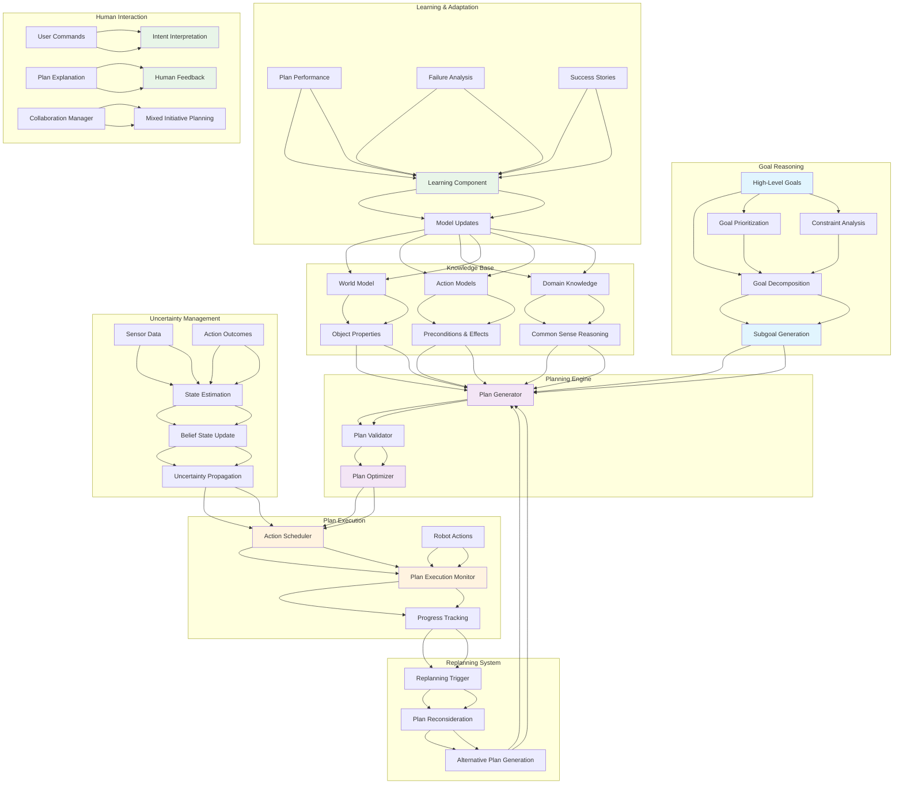

import ExerciseBlock from '@site/src/components/Learning/ExerciseBlock';
import Quiz from '@site/src/components/Learning/Quiz';

# Chapter 26: Cognitive Planning - High-Level Reasoning for Complex Tasks

## Introduction

Cognitive planning represents the highest level of robotic intelligence, enabling robots to understand complex multi-step tasks, reason about their environment, and generate sophisticated action plans to achieve user goals. Unlike simple reactive systems or basic path planning, cognitive planning involves higher-level reasoning that considers context, intent, and the complex relationships between actions and outcomes. This chapter explores the architecture and implementation of cognitive planning systems that allow robots to perform complex tasks requiring understanding of goals, constraints, and the consequences of actions.

The challenge of cognitive planning lies in bridging the gap between high-level task descriptions and low-level robotic actions. This requires sophisticated reasoning systems that can decompose complex goals into manageable subtasks, consider multiple possible approaches, account for uncertainty and changing conditions, and adapt plans dynamically as circumstances change. Cognitive planning systems must also incorporate learning from experience to improve their performance over time.

## Learning Objectives

By the end of this chapter, you will be able to:

1. Understand the architecture of cognitive planning systems for robotics
2. Implement task decomposition and hierarchical planning algorithms
3. Design goal reasoning and constraint satisfaction mechanisms
4. Create plan representation and execution frameworks
5. Integrate learning mechanisms to improve planning performance
6. Handle uncertainty and dynamic replanning in cognitive systems
7. Evaluate cognitive planning systems for effectiveness and efficiency

## Hook: The Reasoning Robot Challenge

Imagine asking a robot: "I need to prepare for a meeting in 30 minutes. Please find my presentation slides, charge my laptop, and set up the conference room with proper lighting and temperature." A simple robot might struggle with this request, not knowing where to find slides, how to charge a laptop, or how to control room systems. But a cognitively planned robot would understand the temporal constraint, decompose the task into logical subtasks, reason about where to find the needed items, and execute a coordinated plan to achieve all objectives. This level of reasoning and planning requires sophisticated cognitive systems that can understand intent, consider multiple factors, and coordinate complex sequences of actions. This chapter reveals how to build such intelligent planning capabilities.

## Concept: Cognitive Planning Fundamentals

### Hierarchical Task Networks (HTNs)

Hierarchical Task Networks provide a framework for representing and executing complex tasks:

**Task Decomposition**: Breaking down high-level goals into sequences of lower-level subtasks that can be executed by the robot.

**Method Representation**: Defining methods for achieving tasks, including preconditions, effects, and subtask structures.

**Task Ordering**: Determining the appropriate sequence and timing for executing subtasks based on dependencies and constraints.

**Flexibility**: Supporting multiple ways to achieve the same goal through alternative methods and task structures.

### Symbolic Planning and Knowledge Representation

Cognitive planning relies on symbolic representations of the world:

**State Representation**: Formal representation of the current state of the world, including objects, their properties, and relationships.

**Action Models**: Representation of available actions, their preconditions, effects, and costs.

**Goal Specification**: Formal representation of desired states or conditions to be achieved.

**Knowledge Base**: Structured representation of domain knowledge that guides planning decisions.

### Planning Algorithms and Approaches

**Classical Planning**: Algorithms like STRIPS, ADL, and PDDL for generating plans in deterministic environments.

**Contingent Planning**: Planning under uncertainty, where actions may have probabilistic outcomes.

**Temporal Planning**: Planning that considers timing constraints and concurrent actions.

**Replanning**: Dynamic plan adjustment when conditions change or new information becomes available.

### Goal Reasoning and Inference

Cognitive planning systems must understand and reason about goals:

**Goal Decomposition**: Breaking complex goals into simpler, achievable subgoals.

**Goal Prioritization**: Determining the relative importance and urgency of different goals.

**Goal Conflicts**: Identifying and resolving conflicts between competing goals.

**Goal Achievement Criteria**: Defining what constitutes successful goal achievement.

### Uncertainty and Probabilistic Reasoning

Real-world planning must account for uncertainty:

**State Uncertainty**: Uncertainty about the current state of the world due to sensor limitations.

**Action Uncertainty**: Uncertainty about the effects of actions due to environmental factors.

**Temporal Uncertainty**: Uncertainty about the timing of actions and events.

**Belief States**: Representation of the robot's beliefs about uncertain aspects of the world.

### Learning and Adaptation

Cognitive planning systems can improve through experience:

**Plan Learning**: Learning from successful and unsuccessful plans to improve future planning.

**Action Model Learning**: Improving understanding of action effects through experience.

**Heuristic Learning**: Learning better heuristics for guiding planning search.

**Failure Recovery**: Learning from failures to avoid similar mistakes in the future.

### Human-Robot Collaboration

Cognitive planning enables sophisticated human-robot interaction:

**Intent Inference**: Understanding human intentions from observed behavior and communication.

**Plan Explanation**: Explaining the robot's plans and reasoning to humans.

**Plan Coordination**: Coordinating robot plans with human activities and preferences.

**Mixed Initiative**: Sharing planning responsibilities between humans and robots.

### Temporal and Resource Constraints

Realistic planning must consider limitations:

**Temporal Constraints**: Deadlines, scheduling requirements, and timing dependencies.

**Resource Constraints**: Limited computational resources, energy, or physical capabilities.

**Concurrency Management**: Coordinating multiple simultaneous activities.

**Priority Management**: Balancing competing demands and resource allocation.

## Mermaid Diagram: Cognitive Planning Architecture



## Code Example: Cognitive Planning Implementation

Let's implement a comprehensive cognitive planning system:

### Task Decomposition and Planning Framework

```python
#!/usr/bin/env python3
"""
Cognitive Planning Framework
This script implements a hierarchical task network planner for robotic systems
"""

import heapq
from typing import Dict, List, Tuple, Set, Optional, Any, Callable
from dataclasses import dataclass, field
from enum import Enum
import json
from abc import ABC, abstractmethod
import copy

class TaskStatus(Enum):
    PENDING = "pending"
    IN_PROGRESS = "in_progress"
    COMPLETED = "completed"
    FAILED = "failed"

class ActionStatus(Enum):
    READY = "ready"
    EXECUTING = "executing"
    SUCCESS = "success"
    FAILURE = "failure"

@dataclass
class StateVariable:
    """Represents a state variable in the planning domain"""
    name: str
    value: Any
    type: str = "bool"  # bool, int, float, str, etc.

@dataclass
class Condition:
    """Represents a condition in planning"""
    variable: str
    value: Any
    operator: str = "=="  # ==, !=, <, >, <=, >=

    def evaluate(self, state: Dict[str, StateVariable]) -> bool:
        """Evaluate the condition against a state"""
        if self.variable not in state:
            return False

        actual_value = state[self.variable].value

        if self.operator == "==":
            return actual_value == self.value
        elif self.operator == "!=":
            return actual_value != self.value
        elif self.operator == "<":
            return actual_value < self.value
        elif self.operator == ">":
            return actual_value > self.value
        elif self.operator == "<=":
            return actual_value <= self.value
        elif self.operator == ">=":
            return actual_value >= self.value
        else:
            raise ValueError(f"Unknown operator: {self.operator}")

@dataclass
class Action:
    """Represents an action in the planning domain"""
    name: str
    preconditions: List[Condition]
    effects: List[Condition]
    cost: float = 1.0
    duration: float = 1.0
    executable: Optional[Callable] = None  # Function to execute the action

    def is_applicable(self, state: Dict[str, StateVariable]) -> bool:
        """Check if action is applicable in the given state"""
        return all(pre.evaluate(state) for pre in self.preconditions)

    def apply_effects(self, state: Dict[str, StateVariable]) -> Dict[str, StateVariable]:
        """Apply action effects to the state"""
        new_state = copy.deepcopy(state)

        for effect in self.effects:
            new_state[effect.variable] = StateVariable(
                name=effect.variable,
                value=effect.value,
                type=type(effect.value).__name__
            )

        return new_state

@dataclass
class Task:
    """Represents a task in hierarchical planning"""
    name: str
    subtasks: List['Task'] = field(default_factory=list)
    action: Optional[Action] = None
    conditions: List[Condition] = field(default_factory=list)
    status: TaskStatus = TaskStatus.PENDING
    priority: int = 0  # Lower number = higher priority

    def is_primitive(self) -> bool:
        """Check if this is a primitive task (has an action)"""
        return self.action is not None

    def is_compound(self) -> bool:
        """Check if this is a compound task (has subtasks)"""
        return len(self.subtasks) > 0

@dataclass
class Plan:
    """Represents a sequence of actions"""
    actions: List[Action]
    cost: float = 0.0
    duration: float = 0.0

class PlanningDomain:
    """Represents a planning domain with actions and predicates"""
    def __init__(self):
        self.actions: Dict[str, Action] = {}
        self.predicates: Set[str] = set()
        self.types: Set[str] = set()

    def add_action(self, action: Action):
        """Add an action to the domain"""
        self.actions[action.name] = action
        # Extract predicates from conditions and effects
        for pre in action.preconditions:
            self.predicates.add(pre.variable)
        for eff in action.effects:
            self.predicates.add(eff.variable)

class HTNPlanner:
    """Hierarchical Task Network Planner"""
    def __init__(self, domain: PlanningDomain):
        self.domain = domain
        self.method_library = {}  # Maps compound tasks to methods

    def add_method(self, task_name: str, method: Callable):
        """Add a method for decomposing a compound task"""
        if task_name not in self.method_library:
            self.method_library[task_name] = []
        self.method_library[task_name].append(method)

    def plan(self, initial_state: Dict[str, StateVariable],
             goal_task: Task) -> Optional[Plan]:
        """Generate a plan to achieve the goal task"""
        return self._htn_search(initial_state, [goal_task], [])

    def _htn_search(self, state: Dict[str, StateVariable],
                    tasks: List[Task],
                    current_plan: List[Action]) -> Optional[Plan]:
        """Recursive HTN search algorithm"""
        if not tasks:
            # All tasks completed, return plan
            total_cost = sum(action.cost for action in current_plan)
            total_duration = sum(action.duration for action in current_plan)
            return Plan(actions=current_plan, cost=total_cost, duration=total_duration)

        # Get first task to work on
        current_task = tasks[0]
        remaining_tasks = tasks[1:]

        if current_task.is_primitive():
            # Execute primitive task (action)
            if current_task.action.is_applicable(state):
                new_state = current_task.action.apply_effects(state)
                new_plan = current_plan + [current_task.action]

                # Continue with remaining tasks
                return self._htn_search(new_state, remaining_tasks, new_plan)
            else:
                # Action not applicable, plan to make it applicable
                subplan = self._make_action_applicable(current_task.action, state)
                if subplan:
                    # Execute subplan, then original action, then remaining tasks
                    intermediate_state = state
                    for action in subplan.actions:
                        intermediate_state = action.apply_effects(intermediate_state)

                    final_state = current_task.action.apply_effects(intermediate_state)
                    complete_plan = subplan.actions + [current_task.action]

                    return self._htn_search(final_state, remaining_tasks, complete_plan)
                else:
                    return None  # Cannot make action applicable

        elif current_task.is_compound():
            # Decompose compound task using available methods
            if current_task.name in self.method_library:
                for method in self.method_library[current_task.name]:
                    subtasks = method(current_task, state)
                    if subtasks is not None:
                        # Insert subtasks at the beginning, then continue with remaining tasks
                        new_task_list = subtasks + remaining_tasks
                        result = self._htn_search(state, new_task_list, current_plan)
                        if result:
                            return result
            return None  # No applicable method found

        else:
            # Task has neither subtasks nor action - this shouldn't happen
            return None

    def _make_action_applicable(self, action: Action,
                               state: Dict[str, StateVariable]) -> Optional[Plan]:
        """Find a plan to make the given action applicable in the current state"""
        # This is a simplified implementation - in practice, this would use
        # classical planning algorithms like A* or forward search
        # For this example, we'll use a greedy approach

        plan_actions = []
        current_state = copy.deepcopy(state)

        for precondition in action.preconditions:
            if not precondition.evaluate(current_state):
                # Find an action that achieves this precondition
                achieving_action = self._find_action_for_condition(precondition, current_state)
                if achieving_action:
                    plan_actions.append(achieving_action)
                    current_state = achieving_action.apply_effects(current_state)
                else:
                    return None  # Cannot achieve this precondition

        if all(pre.evaluate(current_state) for pre in action.preconditions):
            return Plan(actions=plan_actions)
        else:
            return None

    def _find_action_for_condition(self, condition: Condition,
                                  state: Dict[str, StateVariable]) -> Optional[Action]:
        """Find an action that can achieve the given condition"""
        for action_name, action in self.domain.actions.items():
            for effect in action.effects:
                if (effect.variable == condition.variable and
                    effect.value == condition.value):
                    # Check if this action is eventually applicable
                    if self._can_make_applicable(action, state, visited=set()):
                        return action
        return None

    def _can_make_applicable(self, action: Action, state: Dict[str, StateVariable],
                           visited: Set[str], depth: int = 0) -> bool:
        """Check if an action can eventually be made applicable"""
        if depth > 5:  # Prevent infinite recursion
            return False

        if action.is_applicable(state):
            return True

        for precondition in action.preconditions:
            if not precondition.evaluate(state):
                # Try to find an action that achieves this precondition
                achieving_action = self._find_action_for_condition(precondition, state)
                if achieving_action and achieving_action.name not in visited:
                    new_visited = visited | {achieving_action.name}
                    new_state = achieving_action.apply_effects(state)
                    if self._can_make_applicable(action, new_state, new_visited, depth + 1):
                        return True

        return False

class GoalReasoner:
    """Component for reasoning about goals and their relationships"""
    def __init__(self):
        self.goals = {}
        self.goal_dependencies = {}  # Maps goal to goals it depends on
        self.conflict_graph = {}     # Maps goal to conflicting goals

    def add_goal(self, goal_name: str, conditions: List[Condition],
                 priority: int = 0, deadline: Optional[float] = None):
        """Add a goal to the reasoner"""
        self.goals[goal_name] = {
            'conditions': conditions,
            'priority': priority,
            'deadline': deadline,
            'dependencies': [],
            'conflicts': []
        }

    def add_dependency(self, goal: str, depends_on: str):
        """Add a dependency relationship between goals"""
        if goal in self.goals and depends_on in self.goals:
            if 'dependencies' not in self.goals[goal]:
                self.goals[goal]['dependencies'] = []
            self.goals[goal]['dependencies'].append(depends_on)

    def add_conflict(self, goal1: str, goal2: str):
        """Add a conflict relationship between goals"""
        if goal1 in self.goals and goal2 in self.goals:
            if 'conflicts' not in self.goals[goal1]:
                self.goals[goal1]['conflicts'] = []
            if 'conflicts' not in self.goals[goal2]:
                self.goals[goal2]['conflicts'] = []

            if goal2 not in self.goals[goal1]['conflicts']:
                self.goals[goal1]['conflicts'].append(goal2)
            if goal1 not in self.goals[goal2]['conflicts']:
                self.goals[goal2]['conflicts'].append(goal1)

    def prioritize_goals(self) -> List[str]:
        """Return goals in priority order considering dependencies and conflicts"""
        # Simple topological sort considering priorities
        sorted_goals = []
        visited = set()

        def visit(goal):
            if goal in visited:
                return
            visited.add(goal)

            # Visit dependencies first
            for dep in self.goals[goal].get('dependencies', []):
                visit(dep)

            sorted_goals.append(goal)

        # Sort goals by priority (lower number = higher priority)
        priority_sorted = sorted(self.goals.keys(),
                               key=lambda g: self.goals[g]['priority'])

        for goal in priority_sorted:
            visit(goal)

        return sorted_goals

    def check_goal_satisfiability(self, state: Dict[str, StateVariable],
                                 goal_name: str) -> bool:
        """Check if a goal can be satisfied in the current state"""
        if goal_name not in self.goals:
            return False

        conditions = self.goals[goal_name]['conditions']
        return all(cond.evaluate(state) for cond in conditions)

def main():
    """Main function to demonstrate cognitive planning"""
    print("Initializing Cognitive Planning System...")

    # Create planning domain
    domain = PlanningDomain()

    # Define actions for the domain
    navigate_action = Action(
        name="navigate",
        preconditions=[Condition("robot_at", "start_location")],
        effects=[Condition("robot_at", "destination")],
        cost=2.0,
        duration=5.0
    )

    pick_up_action = Action(
        name="pick_up",
        preconditions=[
            Condition("robot_at", "object_location"),
            Condition("object_present", True),
            Condition("gripper_empty", True)
        ],
        effects=[
            Condition("object_held", True),
            Condition("gripper_empty", False),
            Condition("object_present", False)
        ],
        cost=1.5,
        duration=3.0
    )

    place_action = Action(
        name="place",
        preconditions=[
            Condition("object_held", True),
            Condition("robot_at", "target_location")
        ],
        effects=[
            Condition("object_held", False),
            Condition("gripper_empty", True),
            Condition("object_present", True)
        ],
        cost=1.5,
        duration=3.0
    )

    charge_action = Action(
        name="charge",
        preconditions=[
            Condition("robot_at", "charging_station"),
            Condition("battery_low", True)
        ],
        effects=[Condition("battery_low", False)],
        cost=1.0,
        duration=10.0
    )

    # Add actions to domain
    domain.add_action(navigate_action)
    domain.add_action(pick_up_action)
    domain.add_action(place_action)
    domain.add_action(charge_action)

    # Create planner
    planner = HTNPlanner(domain)

    # Define methods for compound tasks
    def transport_method(task: Task, state: Dict[str, StateVariable]) -> List[Task]:
        """Method to decompose transport task into navigate-pick-navigate-place"""
        if task.name == "transport":
            return [
                Task(name="navigate_to_object", action=navigate_action),
                Task(name="pick_up_object", action=pick_up_action),
                Task(name="navigate_to_target", action=navigate_action),
                Task(name="place_object", action=place_action)
            ]
        return None

    def prepare_meeting_method(task: Task, state: Dict[str, StateVariable]) -> List[Task]:
        """Method to decompose meeting preparation task"""
        if task.name == "prepare_meeting":
            subtasks = []

            # Check if laptop needs charging
            if state.get("battery_low", StateVariable("battery_low", False)).value:
                subtasks.append(Task(name="charge_laptop", action=charge_action))

            # Add navigation and transport tasks
            subtasks.extend([
                Task(name="navigate_to_office", action=navigate_action),
                Task(name="transport_presentation", action=Task(name="transport"))
            ])

            return subtasks
        return None

    # Register methods
    planner.add_method("transport", transport_method)
    planner.add_method("prepare_meeting", prepare_meeting_method)

    # Create initial state
    initial_state = {
        "robot_at": StateVariable("robot_at", "start_location"),
        "object_present": StateVariable("object_present", True),
        "gripper_empty": StateVariable("gripper_empty", True),
        "object_held": StateVariable("object_held", False),
        "battery_low": StateVariable("battery_low", True)
    }

    # Define goal
    goal_task = Task(name="prepare_meeting")

    # Generate plan
    plan = planner.plan(initial_state, goal_task)

    if plan:
        print(f"Generated plan with {len(plan.actions)} actions:")
        for i, action in enumerate(plan.actions):
            print(f"  {i+1}. {action.name} (cost: {action.cost}, duration: {action.duration})")
        print(f"Total plan cost: {plan.cost}, duration: {plan.duration}")
    else:
        print("Failed to generate plan for the goal.")

    # Demonstrate goal reasoning
    print("\nGoal Reasoning Example:")
    goal_reasoner = GoalReasoner()

    # Add goals
    goal_reasoner.add_goal("charge_battery", [Condition("battery_low", False)], priority=1)
    goal_reasoner.add_goal("transport_object", [Condition("object_at_target", True)], priority=2)
    goal_reasoner.add_goal("navigate_to_location", [Condition("robot_at", "target")], priority=3)

    # Add dependencies
    goal_reasoner.add_dependency("transport_object", "navigate_to_location")

    # Get prioritized goals
    prioritized = goal_reasoner.prioritize_goals()
    print(f"Prioritized goals: {prioritized}")

    print("\nCognitive Planning System demonstration completed!")

if __name__ == '__main__':
    main()
```

### Cognitive Planning with Learning and Adaptation

```python
#!/usr/bin/env python3
"""
Cognitive Planning with Learning and Adaptation
This script implements learning mechanisms to improve cognitive planning performance
"""

import numpy as np
from typing import Dict, List, Tuple, Optional, Any
from collections import defaultdict, deque
import pickle
import os
from datetime import datetime
import random

class PlanExecutionMonitor:
    """Monitor plan execution and collect performance data"""
    def __init__(self):
        self.execution_logs = []
        self.success_count = 0
        self.failure_count = 0
        self.total_executions = 0

    def log_execution(self, plan: Any, outcome: str, metrics: Dict[str, float]):
        """Log plan execution results"""
        log_entry = {
            'timestamp': datetime.now(),
            'plan': plan,
            'outcome': outcome,
            'metrics': metrics,
            'execution_id': self.total_executions
        }

        self.execution_logs.append(log_entry)
        self.total_executions += 1

        if outcome == 'success':
            self.success_count += 1
        else:
            self.failure_count += 1

    def get_success_rate(self) -> float:
        """Get overall success rate"""
        if self.total_executions == 0:
            return 0.0
        return self.success_count / self.total_executions

    def analyze_execution_patterns(self) -> Dict[str, Any]:
        """Analyze patterns in execution results"""
        if not self.execution_logs:
            return {}

        # Calculate average metrics
        metrics_keys = set()
        for log in self.execution_logs:
            metrics_keys.update(log['metrics'].keys())

        averages = {}
        for key in metrics_keys:
            values = [log['metrics'].get(key, 0) for log in self.execution_logs]
            averages[f'avg_{key}'] = sum(values) / len(values) if values else 0

        return {
            'success_rate': self.get_success_rate(),
            'total_executions': self.total_executions,
            'success_count': self.success_count,
            'failure_count': self.failure_count,
            'averages': averages
        }

class ExperienceReplayBuffer:
    """Store and replay planning experiences for learning"""
    def __init__(self, max_size: int = 1000):
        self.buffer = deque(maxlen=max_size)
        self.max_size = max_size

    def add_experience(self, state: Dict[str, Any], action: Any,
                      next_state: Dict[str, Any], reward: float,
                      done: bool):
        """Add experience tuple to buffer"""
        experience = {
            'state': state,
            'action': action,
            'next_state': next_state,
            'reward': reward,
            'done': done
        }
        self.buffer.append(experience)

    def sample_batch(self, batch_size: int) -> List[Dict]:
        """Sample random batch from buffer"""
        if len(self.buffer) < batch_size:
            return list(self.buffer)

        indices = random.sample(range(len(self.buffer)), batch_size)
        return [self.buffer[i] for i in indices]

    def get_size(self) -> int:
        """Get current buffer size"""
        return len(self.buffer)

class HeuristicLearner:
    """Learn better heuristics for planning"""
    def __init__(self):
        self.heuristic_weights = defaultdict(float)
        self.learning_rate = 0.1
        self.experience_buffer = ExperienceReplayBuffer()

    def update_heuristic(self, state_features: Dict[str, float],
                        actual_cost: float, predicted_cost: float):
        """Update heuristic weights based on prediction error"""
        error = actual_cost - predicted_cost

        for feature, value in state_features.items():
            self.heuristic_weights[feature] += self.learning_rate * error * value

    def predict_cost(self, state_features: Dict[str, float]) -> float:
        """Predict cost using learned heuristic"""
        predicted_cost = 0.0
        for feature, value in state_features.items():
            predicted_cost += self.heuristic_weights[feature] * value
        return max(0.0, predicted_cost)  # Ensure non-negative

    def extract_features(self, state: Dict[str, Any]) -> Dict[str, float]:
        """Extract features from state for heuristic learning"""
        features = {}

        # Count positive literals
        pos_count = sum(1 for var in state.values() if var.value is True)
        features['positive_literals'] = float(pos_count)

        # Count negative literals
        neg_count = sum(1 for var in state.values() if var.value is False)
        features['negative_literals'] = float(neg_count)

        # Count numeric variables
        num_count = sum(1 for var in state.values()
                       if isinstance(var.value, (int, float)))
        features['numeric_variables'] = float(num_count)

        # Specific domain features
        if 'robot_at' in state:
            features['robot_at_start'] = 1.0 if state['robot_at'].value == 'start_location' else 0.0
            features['robot_at_target'] = 1.0 if state['robot_at'].value == 'target_location' else 0.0

        if 'battery_low' in state:
            features['battery_low'] = 1.0 if state['battery_low'].value else 0.0

        if 'object_held' in state:
            features['object_held'] = 1.0 if state['object_held'].value else 0.0

        return features

class AdaptivePlanner:
    """Planner that adapts based on experience"""
    def __init__(self, base_planner: Any):
        self.base_planner = base_planner
        self.execution_monitor = PlanExecutionMonitor()
        self.heuristic_learner = HeuristicLearner()
        self.action_model_learner = ActionModelLearner()
        self.failure_recovery = FailureRecoveryManager()

    def execute_plan_with_learning(self, initial_state: Dict[str, Any],
                                 goal: Any) -> Tuple[Any, Dict[str, float]]:
        """Execute plan and learn from the experience"""
        # Generate plan using base planner
        plan = self.base_planner.plan(initial_state, goal)

        if not plan:
            # Log failure
            metrics = {'planning_time': 0.0, 'plan_length': 0, 'success': False}
            self.execution_monitor.log_execution(None, 'failure', metrics)
            return None, metrics

        # Execute plan (simulated here)
        success, execution_metrics = self._simulate_execution(plan, initial_state)

        # Extract features for learning
        state_features = self.heuristic_learner.extract_features(initial_state)
        actual_cost = execution_metrics.get('actual_cost', plan.cost)

        # Learn from execution
        self._learn_from_execution(
            plan, initial_state, success, execution_metrics,
            state_features, actual_cost
        )

        outcome = 'success' if success else 'failure'
        self.execution_monitor.log_execution(plan, outcome, execution_metrics)

        return plan, execution_metrics

    def _simulate_execution(self, plan: Any, initial_state: Dict[str, Any]) -> Tuple[bool, Dict[str, float]]:
        """Simulate plan execution to collect metrics"""
        # In a real implementation, this would execute the plan on a robot
        # For simulation, we'll randomly determine success and generate metrics

        success_probability = 0.85  # Base success rate
        success = random.random() < success_probability

        # Generate realistic metrics
        metrics = {
            'planning_time': random.uniform(0.1, 2.0),
            'plan_length': len(plan.actions) if plan else 0,
            'execution_time': random.uniform(5.0, 30.0),
            'energy_consumption': random.uniform(10.0, 50.0),
            'success': success,
            'actual_cost': plan.cost if plan else float('inf')
        }

        return success, metrics

    def _learn_from_execution(self, plan: Any, initial_state: Dict[str, Any],
                            success: bool, metrics: Dict[str, float],
                            state_features: Dict[str, float],
                            actual_cost: float):
        """Learn from plan execution experience"""
        # Update heuristic if planning was successful
        if plan and success:
            predicted_cost = self.heuristic_learner.predict_cost(state_features)
            self.heuristic_learner.update_heuristic(state_features, actual_cost, predicted_cost)

        # Add to experience buffer
        next_state = self._predict_next_state(initial_state, plan)
        reward = 1.0 if success else -1.0
        done = not success  # Episode ends on failure

        self.heuristic_learner.experience_buffer.add_experience(
            initial_state, plan, next_state, reward, done
        )

        # Learn action model improvements
        self.action_model_learner.update_from_experience(
            initial_state, plan, next_state, success, metrics
        )

    def _predict_next_state(self, initial_state: Dict[str, Any],
                          plan: Any) -> Dict[str, Any]:
        """Predict final state after plan execution"""
        if not plan:
            return initial_state

        final_state = initial_state.copy()
        for action in plan.actions:
            final_state = action.apply_effects(final_state)
        return final_state

class ActionModelLearner:
    """Learn and improve action models based on experience"""
    def __init__(self):
        self.action_success_rates = defaultdict(lambda: 0.9)  # Default success rate
        self.action_costs = defaultdict(lambda: 1.0)  # Default cost
        self.action_durations = defaultdict(lambda: 1.0)  # Default duration
        self.action_outcomes = defaultdict(list)  # List of observed outcomes

    def update_from_experience(self, initial_state: Dict[str, Any],
                             plan: Any, final_state: Dict[str, Any],
                             success: bool, metrics: Dict[str, float]):
        """Update action models based on execution experience"""
        if not plan:
            return

        for action in plan.actions:
            action_name = action.name

            # Update success rate
            current_success_rate = self.action_success_rates[action_name]
            self.action_success_rates[action_name] = current_success_rate * 0.9 + (1.0 if success else 0.0) * 0.1

            # Update cost based on actual execution time
            if 'execution_time' in metrics:
                execution_per_action = metrics['execution_time'] / len(plan.actions)
                current_cost = self.action_costs[action_name]
                self.action_costs[action_name] = current_cost * 0.8 + execution_per_action * 0.2

            # Store outcomes for probabilistic modeling
            outcome = {
                'state_change': self._compare_states(initial_state, final_state),
                'success': success,
                'metrics': metrics
            }
            self.action_outcomes[action_name].append(outcome)

            # Keep only recent experiences
            if len(self.action_outcomes[action_name]) > 100:
                self.action_outcomes[action_name] = self.action_outcomes[action_name][-50:]

    def _compare_states(self, state1: Dict[str, Any], state2: Dict[str, Any]) -> Dict[str, Any]:
        """Compare two states and return differences"""
        differences = {}
        for key in set(state1.keys()) | set(state2.keys()):
            val1 = state1.get(key)
            val2 = state2.get(key)
            if val1 != val2:
                differences[key] = {'from': val1, 'to': val2}
        return differences

    def get_updated_action(self, original_action: Action) -> Action:
        """Get action with updated parameters based on learned models"""
        updated_action = copy.deepcopy(original_action)

        action_name = original_action.name

        # Update success probability
        success_rate = self.action_success_rates[action_name]
        updated_action.success_probability = success_rate

        # Update cost
        updated_action.cost = self.action_costs[action_name]

        # Update duration
        updated_action.duration = self.action_durations[action_name]

        return updated_action

class FailureRecoveryManager:
    """Manage recovery from planning and execution failures"""
    def __init__(self):
        self.failure_patterns = defaultdict(list)
        self.recovery_strategies = {}

    def record_failure(self, failure_type: str, context: Dict[str, Any],
                      attempted_solution: Any):
        """Record a failure and the attempted solution"""
        failure_record = {
            'timestamp': datetime.now(),
            'context': context,
            'attempted_solution': attempted_solution,
            'recovery_successful': False
        }

        self.failure_patterns[failure_type].append(failure_record)

    def suggest_recovery(self, failure_type: str, context: Dict[str, Any]) -> List[str]:
        """Suggest recovery strategies based on past experience"""
        if failure_type in self.recovery_strategies:
            return self.recovery_strategies[failure_type]

        # Default strategies based on failure type
        default_strategies = {
            'action_failure': [
                'retry_with_different_parameters',
                'use_alternative_action',
                'request_human_assistance'
            ],
            'planning_failure': [
                'relax_constraints',
                'decompose_problem_differently',
                'use_fallback_behavior'
            ],
            'execution_failure': [
                'abort_and_replan',
                'switch_to_safe_behavior',
                'continue_with_partial_success'
            ]
        }

        return default_strategies.get(failure_type, ['use_fallback_behavior'])

def main():
    """Main function to demonstrate adaptive cognitive planning"""
    print("Initializing Adaptive Cognitive Planning System...")

    # This would normally be connected to the HTN planner from the previous example
    # For this demonstration, we'll simulate the integration

    print("\nAdaptive Planning Components:")
    print("1. Plan Execution Monitor - Tracks success/failure rates")
    print("2. Experience Replay Buffer - Stores planning experiences")
    print("3. Heuristic Learner - Improves planning heuristics")
    print("4. Action Model Learner - Updates action parameters")
    print("5. Failure Recovery Manager - Handles failures gracefully")

    # Simulate learning process
    print("\nSimulating Learning Process...")

    monitor = PlanExecutionMonitor()
    learner = HeuristicLearner()

    # Simulate multiple planning-execution cycles
    for episode in range(10):
        # Simulate state
        state = {
            'robot_at': StateVariable('robot_at', f'location_{episode % 3}'),
            'object_present': StateVariable('object_present', episode % 2 == 0),
            'gripper_empty': StateVariable('gripper_empty', episode % 2 == 1),
            'battery_low': StateVariable('battery_low', episode % 4 == 0)
        }

        # Simulate plan execution
        success = random.random() > 0.2  # 80% success rate
        metrics = {
            'planning_time': random.uniform(0.1, 1.0),
            'execution_time': random.uniform(5.0, 20.0),
            'energy': random.uniform(10.0, 30.0),
            'success': success
        }

        # Log execution
        monitor.log_execution(f"plan_{episode}", 'success' if success else 'failure', metrics)

        # Extract features and learn
        features = learner.extract_features(state)
        actual_cost = metrics['execution_time']
        predicted_cost = learner.predict_cost(features)

        learner.update_heuristic(features, actual_cost, predicted_cost)

        print(f"Episode {episode + 1}: Success = {success}, Cost Error = {abs(actual_cost - predicted_cost):.2f}")

    # Show results
    print(f"\nLearning Results:")
    print(f"Overall Success Rate: {monitor.get_success_rate():.2%}")
    print(f"Total Executions: {monitor.total_executions}")

    analysis = monitor.analyze_execution_patterns()
    print(f"Average Execution Time: {analysis['averages'].get('avg_execution_time', 0):.2f}s")
    print(f"Average Energy Consumption: {analysis['averages'].get('avg_energy', 0):.2f}")

    print("\nAdaptive Cognitive Planning demonstration completed!")

if __name__ == '__main__':
    main()
```

### Cognitive Planning with Uncertainty and Replanning

```python
#!/usr/bin/env python3
"""
Cognitive Planning with Uncertainty and Replanning
This script implements planning under uncertainty and dynamic replanning capabilities
"""

import numpy as np
from typing import Dict, List, Tuple, Optional, Any
from dataclasses import dataclass
from enum import Enum
import random
from scipy.stats import beta
import copy

class UncertaintyType(Enum):
    STATE = "state_uncertainty"
    ACTION = "action_uncertainty"
    TEMPORAL = "temporal_uncertainty"
    SENSORY = "sensory_uncertainty"

@dataclass
class BeliefState:
    """Represents the robot's belief about uncertain aspects of the world"""
    state_probabilities: Dict[str, float]  # Probability of each possible state
    action_outcomes: Dict[str, Dict[str, float]]  # Action -> {outcome: probability}
    temporal_uncertainties: Dict[str, Tuple[float, float]]  # Action -> (min_time, max_time)
    sensor_reliabilities: Dict[str, float]  # Sensor -> reliability (0-1)

class UncertainAction(Action):
    """Action with probabilistic outcomes"""
    def __init__(self, name: str, preconditions: List[Condition],
                 effects: List[Condition], cost: float = 1.0,
                 duration: float = 1.0, success_probability: float = 0.9,
                 alternative_effects: Optional[List[Condition]] = None):
        super().__init__(name, preconditions, effects, cost, duration)
        self.success_probability = success_probability
        self.alternative_effects = alternative_effects or []  # Effects on failure

    def sample_outcome(self, state: Dict[str, StateVariable]) -> Dict[str, StateVariable]:
        """Sample the actual outcome of the action"""
        if random.random() < self.success_probability:
            # Success - apply normal effects
            return self.apply_effects(state)
        else:
            # Failure - apply alternative effects
            new_state = copy.deepcopy(state)
            for effect in self.alternative_effects:
                new_state[effect.variable] = StateVariable(
                    name=effect.variable,
                    value=effect.value,
                    type=type(effect.value).__name__
                )
            return new_state

class UncertaintyPropagationEngine:
    """Engine for propagating uncertainty through plan execution"""
    def __init__(self):
        self.belief_update_functions = {
            UncertaintyType.STATE: self._update_state_uncertainty,
            UncertaintyType.ACTION: self._update_action_uncertainty,
            UncertaintyType.TEMPORAL: self._update_temporal_uncertainty,
            UncertaintyType.SENSORY: self._update_sensory_uncertainty
        }

    def propagate_uncertainty(self, belief_state: BeliefState,
                            action: UncertainAction,
                            observation: Optional[Dict[str, Any]] = None) -> BeliefState:
        """Propagate uncertainty forward given an action and observation"""
        new_belief = copy.deepcopy(belief_state)

        # Update based on action
        self._update_after_action(new_belief, action)

        # Update based on observation
        if observation:
            self._update_after_observation(new_belief, observation)

        return new_belief

    def _update_after_action(self, belief_state: BeliefState, action: UncertainAction):
        """Update beliefs after action execution"""
        # Update action outcome probabilities
        action_name = action.name
        success_prob = action.success_probability

        if action_name not in belief_state.action_outcomes:
            belief_state.action_outcomes[action_name] = {}

        # Update with Bayes' rule if we have outcome information
        # This is a simplified version - full implementation would be more complex
        belief_state.action_outcomes[action_name] = {
            'success': success_prob,
            'failure': 1.0 - success_prob
        }

    def _update_after_observation(self, belief_state: BeliefState,
                                observation: Dict[str, Any]):
        """Update beliefs after receiving an observation"""
        for var_name, observed_value in observation.items():
            if var_name in belief_state.state_probabilities:
                # Update state probability based on sensor reliability
                sensor_rel = belief_state.sensor_reliabilities.get(var_name, 0.8)

                # Simple Bayes update (simplified)
                if random.random() < sensor_rel:
                    # Sensor is reliable, update belief
                    belief_state.state_probabilities[var_name] = 1.0 if observed_value else 0.0
                else:
                    # Sensor unreliable, don't change belief significantly
                    current_prob = belief_state.state_probabilities[var_name]
                    # Small adjustment toward observed value
                    adjustment = 0.1 * (1.0 if observed_value else 0.0 - current_prob)
                    belief_state.state_probabilities[var_name] = max(0.0, min(1.0, current_prob + adjustment))

    def _update_state_uncertainty(self, belief_state: BeliefState,
                                action: UncertainAction, state: Dict[str, StateVariable]):
        """Update state uncertainty"""
        # This would involve more complex belief state propagation
        pass

    def _update_action_uncertainty(self, belief_state: BeliefState,
                                 action: UncertainAction, state: Dict[str, StateVariable]):
        """Update action uncertainty"""
        # Update action success probability based on historical data
        pass

    def _update_temporal_uncertainty(self, belief_state: BeliefState,
                                   action: UncertainAction, state: Dict[str, StateVariable]):
        """Update temporal uncertainty"""
        # Update expected action duration based on historical performance
        pass

    def _update_sensory_uncertainty(self, belief_state: BeliefState,
                                  action: UncertainAction, state: Dict[str, StateVariable]):
        """Update sensory uncertainty"""
        # Update sensor reliability based on consistency of observations
        pass

class ContingentPlanner:
    """Planner that handles uncertainty through contingent planning"""
    def __init__(self, domain: PlanningDomain):
        self.domain = domain
        self.uncertainty_engine = UncertaintyPropagationEngine()

    def generate_contingent_plan(self, initial_belief: BeliefState,
                               goal_conditions: List[Condition]) -> Optional[Any]:
        """Generate a contingent plan that handles uncertainty"""
        # This is a simplified implementation
        # A full contingent planner would generate a policy tree

        # For now, we'll generate a basic plan with monitoring points
        plan = self._basic_uncertainty_aware_plan(initial_belief, goal_conditions)
        return plan

    def _basic_uncertainty_aware_plan(self, initial_belief: BeliefState,
                                    goal_conditions: List[Condition]) -> Any:
        """Generate a basic plan aware of uncertainty"""
        # This would involve more sophisticated planning algorithms
        # like Conformant FF, MBP, or other contingent planning approaches

        # For this example, we'll create a plan with monitoring steps
        plan_steps = []

        for condition in goal_conditions:
            # Find action that affects this condition
            relevant_actions = self._find_relevant_actions(condition)

            if relevant_actions:
                action = relevant_actions[0]  # Choose first available action
                plan_steps.append({
                    'action': action,
                    'monitor_condition': condition,
                    'recovery_options': self._get_recovery_options(action)
                })

        return {
            'steps': plan_steps,
            'monitoring_points': [step['monitor_condition'] for step in plan_steps],
            'recovery_paths': {i: step['recovery_options'] for i, step in enumerate(plan_steps)}
        }

    def _find_relevant_actions(self, condition: Condition) -> List[UncertainAction]:
        """Find actions that affect the given condition"""
        relevant = []

        for action_name, action in self.domain.actions.items():
            # Check if action affects the condition variable
            for effect in action.effects:
                if effect.variable == condition.variable:
                    # Convert to UncertainAction if needed
                    if not isinstance(action, UncertainAction):
                        uncertain_action = UncertainAction(
                            name=action.name,
                            preconditions=action.preconditions,
                            effects=action.effects,
                            cost=action.cost,
                            duration=action.duration
                        )
                        relevant.append(uncertain_action)
                    else:
                        relevant.append(action)
                    break

        return relevant

    def _get_recovery_options(self, action: UncertainAction) -> List[str]:
        """Get possible recovery options for an action"""
        # This would be populated based on action type and domain knowledge
        return [
            f"retry_{action.name}",
            f"use_alternative_{action.name}",
            "request_assistance",
            "skip_and_continue"
        ]

class ReplanningSystem:
    """System for dynamic replanning when conditions change"""
    def __init__(self, base_planner: Any):
        self.base_planner = base_planner
        self.replanning_triggers = {
            'execution_failure': self._handle_execution_failure,
            'goal_change': self._handle_goal_change,
            'environment_change': self._handle_environment_change,
            'resource_depletion': self._handle_resource_issue
        }

    def should_replan(self, current_state: Dict[str, StateVariable],
                     plan_in_execution: Any, trigger: str) -> bool:
        """Determine if replanning is needed"""
        if trigger == 'execution_failure':
            return True  # Always replan on failure
        elif trigger == 'goal_change':
            return True  # Replan when goal changes
        elif trigger == 'environment_change':
            # Replan if environment change affects current plan
            return self._plan_affected_by_environment_change(plan_in_execution, current_state)
        elif trigger == 'resource_depletion':
            # Replan if critical resources are low
            return self._critical_resource_depleted(current_state)
        else:
            return False

    def _handle_execution_failure(self, failure_info: Dict[str, Any]) -> Any:
        """Handle plan execution failure"""
        print(f"Handling execution failure: {failure_info}")

        # Get recovery options
        action = failure_info.get('failed_action')
        if action:
            recovery_options = self._get_recovery_options_for_action(action)
            print(f"Available recovery options: {recovery_options}")

            # For now, return a simple recovery plan
            return self._create_recovery_plan(action, recovery_options)

    def _handle_goal_change(self, old_goal: Any, new_goal: Any) -> Any:
        """Handle change in goals"""
        print(f"Goal changed from {old_goal} to {new_goal}")

        # Generate new plan for new goal
        return self.base_planner.plan(self._get_current_state(), new_goal)

    def _handle_environment_change(self, change_info: Dict[str, Any]) -> Any:
        """Handle environmental changes"""
        print(f"Environment changed: {change_info}")

        # Check if current plan is still viable
        current_plan = self._get_current_plan()
        if self._plan_is_viable(current_plan, change_info):
            return current_plan  # Continue with current plan
        else:
            # Replan with new environmental information
            return self.base_planner.plan(self._get_current_state(), self._get_current_goal())

    def _handle_resource_issue(self, resource_info: Dict[str, Any]) -> Any:
        """Handle resource depletion or availability issues"""
        print(f"Resource issue detected: {resource_info}")

        # Modify plan to account for resource constraints
        current_plan = self._get_current_plan()
        return self._adapt_plan_for_resources(current_plan, resource_info)

    def _plan_affected_by_environment_change(self, plan: Any, state: Dict[str, StateVariable]) -> bool:
        """Check if plan is affected by environmental changes"""
        # This would check if plan actions are still applicable given new state
        return True  # Simplified - assume changes affect plan

    def _critical_resource_depleted(self, state: Dict[str, StateVariable]) -> bool:
        """Check if critical resources are depleted"""
        # Check for critical resource depletion
        battery_low = state.get('battery_low', StateVariable('battery_low', False)).value
        return battery_low

    def _get_recovery_options_for_action(self, action: Any) -> List[str]:
        """Get recovery options for a failed action"""
        return [
            "retry_with_modified_parameters",
            "use_alternative_action",
            "request_human_intervention",
            "skip_action_if_optional",
            "revert_to_safe_state"
        ]

    def _create_recovery_plan(self, failed_action: Any, options: List[str]) -> Any:
        """Create a recovery plan"""
        # This would create a specific recovery plan
        # For now, return a simple recovery indication
        return {
            'type': 'recovery_plan',
            'failed_action': failed_action,
            'selected_option': options[0] if options else 'no_option',
            'status': 'recovery_in_progress'
        }

    def _get_current_state(self) -> Dict[str, StateVariable]:
        """Get the current state (in a real system, this would interface with sensors)"""
        # Simulated current state
        return {
            'robot_at': StateVariable('robot_at', 'current_location'),
            'battery_low': StateVariable('battery_low', False),
            'object_held': StateVariable('object_held', False)
        }

    def _get_current_plan(self) -> Any:
        """Get the currently executing plan"""
        return None  # Would interface with plan execution system

    def _get_current_goal(self) -> Any:
        """Get the current goal"""
        return None  # Would interface with goal management system

    def _plan_is_viable(self, plan: Any, change_info: Dict[str, Any]) -> bool:
        """Check if plan is still viable given changes"""
        return False  # Simplified - assume plan needs updating

    def _adapt_plan_for_resources(self, plan: Any, resource_info: Dict[str, Any]) -> Any:
        """Adapt plan for resource constraints"""
        return plan  # Simplified implementation

def main():
    """Main function to demonstrate uncertainty handling and replanning"""
    print("Initializing Uncertainty and Replanning System...")

    # Create domain with uncertain actions
    domain = PlanningDomain()

    # Create uncertain versions of basic actions
    uncertain_navigate = UncertainAction(
        name="navigate_uncertain",
        preconditions=[Condition("robot_at", "start_location")],
        effects=[Condition("robot_at", "destination")],
        cost=2.0,
        duration=5.0,
        success_probability=0.85,
        alternative_effects=[Condition("robot_at", "start_location")]  # Stay put on failure
    )

    uncertain_pick = UncertainAction(
        name="pick_uncertain",
        preconditions=[
            Condition("robot_at", "object_location"),
            Condition("object_present", True),
            Condition("gripper_empty", True)
        ],
        effects=[
            Condition("object_held", True),
            Condition("gripper_empty", False),
            Condition("object_present", False)
        ],
        cost=1.5,
        duration=3.0,
        success_probability=0.9,
        alternative_effects=[Condition("gripper_empty", True)]  # Drop object on failure
    )

    domain.add_action(uncertain_navigate)
    domain.add_action(uncertain_pick)

    # Create uncertainty-aware planner
    contingent_planner = ContingentPlanner(domain)

    # Create initial belief state
    initial_belief = BeliefState(
        state_probabilities={
            'robot_at_destination': 0.1,
            'object_held': 0.0,
            'battery_low': 0.3
        },
        action_outcomes={},
        temporal_uncertainties={},
        sensor_reliabilities={
            'robot_at': 0.9,
            'object_held': 0.85,
            'battery_low': 0.95
        }
    )

    # Define goal conditions
    goal_conditions = [
        Condition("robot_at", "meeting_room"),
        Condition("object_held", True)
    ]

    # Generate contingent plan
    contingent_plan = contingent_planner.generate_contingent_plan(
        initial_belief, goal_conditions
    )

    print(f"\nGenerated Contingent Plan with {len(contingent_plan['steps'])} steps")
    print(f"Monitoring Points: {contingent_plan['monitoring_points']}")
    print(f"Recovery Paths: {list(contingent_plan['recovery_paths'].keys())}")

    # Demonstrate replanning system
    print("\nReplanning System Demo:")
    replanning_system = ReplanningSystem(None)  # Base planner would be passed in real implementation

    # Simulate different triggers
    triggers = ['execution_failure', 'goal_change', 'environment_change', 'resource_depletion']

    for trigger in triggers:
        should_replan = replanning_system.should_replan({}, {}, trigger)
        print(f"Trigger: {trigger}, Should Replan: {should_replan}")

    print("\nUncertainty and Replanning System demonstration completed!")

if __name__ == '__main__':
    main()
```

## Exercises

<ExerciseBlock
  content="**Exercise 1: Hierarchical Task Network Implementation**
Implement a complete HTN planner with multiple methods for task decomposition. Create a domain with complex tasks and evaluate the planner's ability to generate efficient plans."
/>

<ExerciseBlock
  content="**Exercise 2: Uncertainty Modeling**
Extend the planning system to handle different types of uncertainty (state, action, temporal). Implement belief state propagation and evaluate planning performance under various uncertainty conditions."
/>

<ExerciseBlock
  content="**Exercise 3: Learning from Experience**
Implement a complete learning system that updates planning models based on execution experience. Compare planning performance before and after learning."
/>

<ExerciseBlock
  content="**Exercise 4: Multi-Agent Planning**
Extend the cognitive planning system to coordinate multiple robots working together on complex tasks. Implement mechanisms for plan coordination and conflict resolution."
/>

## Summary

This chapter explored cognitive planning systems that enable robots to reason about complex multi-step tasks, understand user intentions, and generate sophisticated action plans. We covered:

- Hierarchical Task Networks for decomposing complex tasks
- Symbolic planning and knowledge representation
- Planning algorithms for deterministic and uncertain environments
- Goal reasoning and constraint satisfaction mechanisms
- Uncertainty management and probabilistic reasoning
- Learning and adaptation in planning systems
- Dynamic replanning for handling changes and failures

Cognitive planning represents the highest level of robotic intelligence, enabling robots to understand complex goals, reason about their environment, and generate sophisticated action plans. The integration of learning mechanisms allows these systems to improve their performance over time.

## Quiz

<Quiz
  question="What does HTN stand for in cognitive planning?"
  options={[
    "Hierarchical Task Network",
    "High-Level Task Navigator",
    "Human-Task Network",
    "Hierarchical Task Node"
  ]}
  answer={0}
  explanation="HTN stands for Hierarchical Task Network, a planning formalism that decomposes complex tasks into simpler subtasks."
/>

<Quiz
  question="What is the primary purpose of belief states in planning under uncertainty?"
  options={[
    "To reduce computational requirements",
    "To represent the robot's knowledge about uncertain aspects of the world",
    "To increase planning speed",
    "To simplify action models"
  ]}
  answer={1}
  explanation="Belief states represent the robot's knowledge and uncertainty about the state of the world, enabling planning under uncertainty."
/>

<Quiz
  question="Which of the following is NOT a component of cognitive planning?"
  options={[
    "Task decomposition",
    "Goal reasoning",
    "Low-level motor control",
    "Plan execution monitoring"
  ]}
  explanation="Low-level motor control is not a component of cognitive planning, which operates at a higher level of abstraction than motor control systems."
  answer={2}
/>

## Preview of Next Chapter

In Chapter 27: Capstone Project, we'll integrate all the concepts learned throughout the VLA Capstone section into a comprehensive project that demonstrates the full pipeline from voice input to cognitive planning to robotic action execution, creating a complete intelligent robotic system.