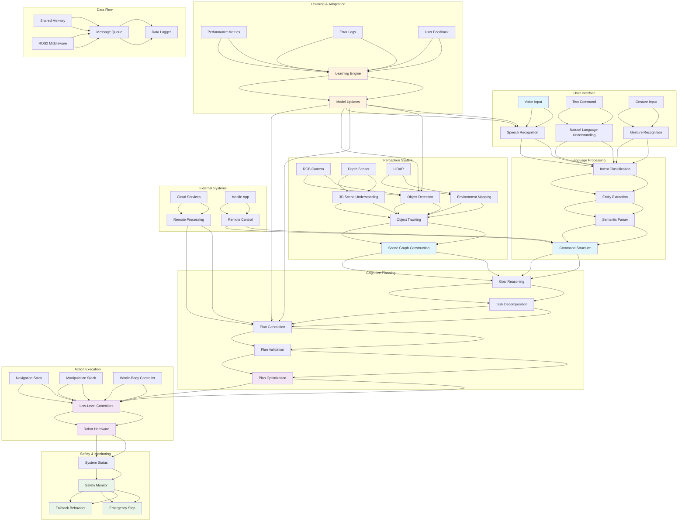

import ExerciseBlock from '@site/src/components/Learning/ExerciseBlock';
import Quiz from '@site/src/components/Learning/Quiz';

# Chapter 27: Capstone Project - Integrating VLA Systems

## Introduction

The capstone project represents the culmination of the Physical AI & Humanoid Robotics textbook, integrating all the concepts learned throughout the VLA (Vision-Language-Action) capstone section into a complete, functioning intelligent robotic system. This comprehensive project demonstrates the full pipeline from natural language understanding through cognitive planning to robotic action execution, showcasing how the individual components work together to create a truly intelligent robotic agent.

The capstone project challenges students to synthesize knowledge from multiple domains - computer vision, natural language processing, cognitive planning, and robotic control - to build a system that can understand complex human commands, reason about tasks and goals, and execute appropriate physical actions. This integration requires careful consideration of system architecture, real-time performance, safety, and robustness.

## Learning Objectives

By the end of this chapter, you will be able to:

1. Design and implement a complete VLA system architecture
2. Integrate vision, language, and action components into a unified system
3. Implement end-to-end processing from voice command to robot action
4. Design cognitive planning systems that coordinate complex multi-step tasks
5. Evaluate and debug integrated robotic systems
6. Implement safety mechanisms and error recovery for complex systems
7. Deploy and test complete robotic systems in real-world environments

## Hook: The Integrated Intelligence Challenge

Imagine a home assistant robot that can understand complex natural language commands like: "After you finish charging your battery, please go to the kitchen and bring me a cold drink from the refrigerator, but if there's no cold drink available, heat up some coffee and bring that instead." This request requires the robot to: understand a complex, conditional command with temporal dependencies, plan a sequence of tasks with contingencies, navigate to multiple locations, interact with various objects, and adapt to changing conditions. The capstone project challenges you to build such an integrated intelligence system, connecting all the components learned throughout the textbook into a cohesive, functional whole.

## Concept: Complete VLA System Architecture

### System Integration Architecture

The complete VLA system integrates multiple subsystems:

**Perception Pipeline**: Computer vision systems for object recognition, scene understanding, and spatial awareness that provide input to higher-level reasoning.

**Language Processing**: Natural language understanding systems that parse human commands and extract semantic meaning for task planning.

**Cognitive Planning**: High-level reasoning systems that generate task plans and coordinate complex behaviors.

**Action Execution**: Low-level control systems that execute specific motor commands and behaviors.

**Integration Middleware**: Communication and coordination systems that ensure all components work together seamlessly.

### Real-Time Processing Requirements

**Latency Constraints**: Ensuring responses within human-acceptable timeframes (typically \u0026lt;2 seconds for simple commands).

**Throughput Requirements**: Processing multiple sensory streams and generating actions at appropriate frequencies.

**Resource Management**: Efficient allocation of computational resources across system components.

**Priority Scheduling**: Ensuring safety-critical and time-sensitive operations receive appropriate priority.

### Safety and Robustness Considerations

**Safety Monitoring**: Continuous monitoring of system state and environment to prevent unsafe actions.

**Error Recovery**: Graceful degradation and recovery mechanisms when components fail.

**Fallback Behaviors**: Predefined safe behaviors when the system encounters unexpected situations.

**Human Override**: Mechanisms for human operators to intervene when necessary.

### Modular System Design

**Component Isolation**: Designing components to be as independent as possible to enable easier debugging and maintenance.

**Interface Standardization**: Using well-defined interfaces between components to facilitate integration.

**Configuration Management**: Managing system parameters and configurations across components.

**Logging and Monitoring**: Comprehensive logging for debugging and system analysis.

### Distributed Processing

**Edge Computing**: Processing vision and control locally on robot hardware for low latency.

**Cloud Integration**: Utilizing cloud resources for complex computation and learning.

**Network Communication**: Efficient communication between distributed system components.

**Synchronization**: Coordinating timing between distributed components.

### Performance Optimization

**Efficient Algorithms**: Using algorithms optimized for real-time performance.

**Model Compression**: Compressing machine learning models for deployment on robot hardware.

**Caching Strategies**: Caching frequently accessed data and computed results.

**Parallel Processing**: Exploiting parallelism where possible to improve performance.

### Learning and Adaptation

**Online Learning**: Adapting system behavior based on real-world experience.

**Transfer Learning**: Applying knowledge learned in one context to similar contexts.

**Active Learning**: Identifying situations where the system needs more training data.

**Continuous Improvement**: Mechanisms for ongoing system enhancement.

### Evaluation and Testing

**Unit Testing**: Testing individual components in isolation.

**Integration Testing**: Testing interactions between components.

**System Testing**: Testing the complete integrated system.

**Field Testing**: Testing in real-world environments with actual users.

## Mermaid Diagram: Complete VLA System Architecture



## Code Example: Complete VLA System Integration

Let's implement a comprehensive integration of all VLA components:

### Main System Orchestrator

```python
#!/usr/bin/env python3
"""
Complete VLA System Orchestrator
This script integrates all VLA components into a unified system
"""

import asyncio
import threading
import queue
import time
from typing import Dict, List, Any, Optional, Callable
from dataclasses import dataclass, field
from enum import Enum
import logging
import json
import traceback

# Import components from previous chapters
from vla_components import (
    SpeechRecognizer, NaturalLanguageUnderstanding, ActionMapper,
    VisionSystem, CognitivePlanner, PlanExecutor, DialogueManager
)

class SystemState(Enum):
    IDLE = "idle"
    LISTENING = "listening"
    PROCESSING = "processing"
    PLANNING = "planning"
    EXECUTING = "executing"
    WAITING = "waiting"
    ERROR = "error"
    SAFETY_MODE = "safety_mode"

@dataclass
class SystemMessage:
    """Message structure for system communication"""
    type: str
    data: Any
    source: str
    destination: str
    timestamp: float = field(default_factory=time.time)

class VLASystemOrchestrator:
    """Main orchestrator for the complete VLA system"""
    def __init__(self, config: Dict[str, Any]):
        self.config = config
        self.state = SystemState.IDLE
        self.message_queue = queue.Queue()
        self.event_loop = None
        self.shutdown_event = threading.Event()

        # Initialize components
        self.speech_recognizer = SpeechRecognizer(
            model_name=config.get('speech_model', 'base')
        )
        self.nlu = NaturalLanguageUnderstanding()
        self.vision_system = VisionSystem()
        self.cognitive_planner = CognitivePlanner()
        self.action_mapper = ActionMapper()
        self.plan_executor = PlanExecutor()
        self.dialogue_manager = DialogueManager()

        # System state
        self.current_task = None
        self.task_queue = queue.Queue()
        self.user_context = {}
        self.system_metrics = {
            'commands_processed': 0,
            'success_rate': 0.0,
            'avg_response_time': 0.0,
            'errors_encountered': 0
        }

        # Logging
        self.logger = logging.getLogger('VLA_System')
        self.logger.setLevel(logging.INFO)

        # Start system threads
        self.messaging_thread = threading.Thread(target=self._message_handler, daemon=True)
        self.main_loop_thread = threading.Thread(target=self._main_loop, daemon=True)

        self.logger.info("VLA System Orchestrator initialized")

    def start(self):
        """Start the VLA system"""
        self.logger.info("Starting VLA System...")

        # Start threads
        self.messaging_thread.start()
        self.main_loop_thread.start()

        # Initialize components
        self._initialize_components()

        self.state = SystemState.IDLE
        self.logger.info("VLA System started successfully")

    def stop(self):
        """Stop the VLA system"""
        self.logger.info("Stopping VLA System...")
        self.shutdown_event.set()

        # Wait for threads to finish
        if self.main_loop_thread.is_alive():
            self.main_loop_thread.join(timeout=5.0)
        if self.messaging_thread.is_alive():
            self.messaging_thread.join(timeout=5.0)

        self.logger.info("VLA System stopped")

    def _initialize_components(self):
        """Initialize all system components"""
        try:
            # Initialize vision system
            self.vision_system.initialize()

            # Initialize dialogue manager
            self.dialogue_manager.initialize()

            self.logger.info("All components initialized successfully")
        except Exception as e:
            self.logger.error(f"Error initializing components: {e}")
            self.state = SystemState.ERROR

    def _message_handler(self):
        """Handle system messages in a separate thread"""
        while not self.shutdown_event.is_set():
            try:
                if not self.message_queue.empty():
                    message = self.message_queue.get(timeout=0.1)
                    self._process_message(message)
                else:
                    time.sleep(0.01)  # Small delay to prevent busy waiting
            except queue.Empty:
                continue
            except Exception as e:
                self.logger.error(f"Error in message handler: {e}")

    def _process_message(self, message: SystemMessage):
        """Process a system message"""
        try:
            if message.type == 'voice_command':
                self._handle_voice_command(message.data)
            elif message.type == 'vision_data':
                self._handle_vision_data(message.data)
            elif message.type == 'task_completed':
                self._handle_task_completion(message.data)
            elif message.type == 'error_report':
                self._handle_error(message.data)
            elif message.type == 'safety_alert':
                self._handle_safety_alert(message.data)
        except Exception as e:
            self.logger.error(f"Error processing message: {e}")
            self._report_error(str(e))

    def _main_loop(self):
        """Main system loop"""
        while not self.shutdown_event.is_set():
            try:
                # Check for shutdown
                if self.shutdown_event.wait(timeout=0.1):
                    break

                # Process current state
                if self.state == SystemState.LISTENING:
                    self._listen_for_commands()
                elif self.state == SystemState.PROCESSING:
                    self._process_pending_commands()
                elif self.state == SystemState.PLANNING:
                    self._execute_planning_cycle()
                elif self.state == SystemState.EXECUTING:
                    self._execute_current_plan()

                # Update system metrics periodically
                if int(time.time()) % 10 == 0:  # Every 10 seconds
                    self._update_metrics()

            except Exception as e:
                self.logger.error(f"Error in main loop: {e}")
                self.state = SystemState.ERROR
                self._report_error(str(e))

    def _listen_for_commands(self):
        """Listen for voice commands"""
        try:
            # In a real implementation, this would use continuous listening
            # For this example, we'll simulate command detection
            if self._check_for_command_trigger():
                command = self._get_voice_command()
                if command:
                    self._queue_command(command)
                    self.state = SystemState.PROCESSING
        except Exception as e:
            self.logger.error(f"Error in listening state: {e}")
            self.state = SystemState.ERROR

    def _check_for_command_trigger(self) -> bool:
        """Check if a command trigger has been detected"""
        # This would check for wake word or button press
        # For simulation, return True occasionally
        return False  # Disabled for this example

    def _get_voice_command(self) -> Optional[str]:
        """Get voice command from speech recognition"""
        # This would interface with the speech recognition system
        # For simulation, return a test command
        return None

    def _queue_command(self, command: str):
        """Queue a command for processing"""
        self.task_queue.put({
            'command': command,
            'timestamp': time.time(),
            'priority': 'normal'
        })

    def _process_pending_commands(self):
        """Process pending commands"""
        if not self.task_queue.empty():
            task = self.task_queue.get()

            # Process with NLU
            parsed_command = self.nlu.parse_command(task['command'])

            # Update dialogue context
            response = self.dialogue_manager.process_user_input(
                task['command'], user_id='default_user'
            )

            if response.get('action'):
                # Plan the action
                plan = self.cognitive_planner.plan(
                    initial_state=self._get_current_state(),
                    goal=response['action']
                )

                if plan:
                    self.current_task = {
                        'plan': plan,
                        'original_command': task['command'],
                        'response': response
                    }
                    self.state = SystemState.PLANNING
                else:
                    self.logger.warning(f"Could not generate plan for command: {task['command']}")
                    self.state = SystemState.IDLE
            else:
                # No action needed, just respond
                self._respond_to_user(response['text'])
                self.state = SystemState.IDLE

    def _execute_planning_cycle(self):
        """Execute the planning cycle"""
        if self.current_task:
            plan = self.current_task['plan']

            # Execute the plan
            success = self.plan_executor.execute_plan(plan)

            if success:
                self.state = SystemState.EXECUTING
            else:
                self.logger.error("Plan execution failed")
                self.state = SystemState.ERROR

    def _execute_current_plan(self):
        """Execute the current plan"""
        if self.current_task:
            # Monitor plan execution
            execution_status = self.plan_executor.get_execution_status()

            if execution_status == 'completed':
                self._handle_task_completion({
                    'task': self.current_task,
                    'success': True
                })
                self.current_task = None
                self.state = SystemState.IDLE
            elif execution_status == 'failed':
                self._handle_task_completion({
                    'task': self.current_task,
                    'success': False
                })
                self.current_task = None
                self.state = SystemState.ERROR
            elif execution_status == 'running':
                # Continue executing
                pass

    def _get_current_state(self) -> Dict[str, Any]:
        """Get current system state"""
        # This would integrate state from all components
        return {
            'timestamp': time.time(),
            'robot_pose': self._get_robot_pose(),
            'detected_objects': self.vision_system.get_detected_objects(),
            'battery_level': self._get_battery_level(),
            'system_load': self._get_system_load()
        }

    def _get_robot_pose(self) -> Dict[str, float]:
        """Get robot pose (simulated)"""
        return {
            'x': 0.0,
            'y': 0.0,
            'theta': 0.0,
            'frame': 'map'
        }

    def _get_battery_level(self) -> float:
        """Get battery level (simulated)"""
        return 0.8  # 80%

    def _get_system_load(self) -> float:
        """Get system load (simulated)"""
        return 0.3  # 30%

    def _handle_voice_command(self, command_data: Dict[str, Any]):
        """Handle incoming voice command"""
        command = command_data['text']
        confidence = command_data.get('confidence', 1.0)

        if confidence > 0.7:  # Accept commands with high confidence
            self._queue_command(command)
            self.state = SystemState.PROCESSING
        else:
            self._respond_to_user("I didn't catch that clearly, could you repeat?")

    def _handle_vision_data(self, vision_data: Dict[str, Any]):
        """Handle incoming vision data"""
        # Update vision system with new data
        self.vision_system.update_with_new_data(vision_data)

    def _handle_task_completion(self, completion_data: Dict[str, Any]):
        """Handle task completion"""
        success = completion_data['success']

        if success:
            self.system_metrics['commands_processed'] += 1
            self.system_metrics['success_rate'] = min(
                1.0,
                self.system_metrics['success_rate'] * 0.9 + 1.0 * 0.1
            )

            # Respond to user
            if self.current_task:
                self._respond_to_user("Task completed successfully!")
        else:
            self.system_metrics['errors_encountered'] += 1
            self.system_metrics['success_rate'] = max(
                0.0,
                self.system_metrics['success_rate'] * 0.9
            )

            # Handle failure
            self._handle_failure(completion_data)

    def _handle_error(self, error_data: Dict[str, Any]):
        """Handle system error"""
        self.logger.error(f"System error: {error_data}")
        self.system_metrics['errors_encountered'] += 1

        # Try to recover
        self._try_recovery(error_data)

    def _handle_safety_alert(self, alert_data: Dict[str, Any]):
        """Handle safety alert"""
        self.logger.warning(f"Safety alert: {alert_data}")

        # Activate safety mode
        self.state = SystemState.SAFETY_MODE

        # Stop all ongoing actions
        self.plan_executor.emergency_stop()

        # Alert user
        self._respond_to_user("Safety alert received. Stopping all actions.")

    def _respond_to_user(self, response_text: str):
        """Generate response to user"""
        # This would use text-to-speech in a real system
        print(f"Robot says: {response_text}")
        self.logger.info(f"Response: {response_text}")

    def _handle_failure(self, failure_data: Dict[str, Any]):
        """Handle task failure"""
        self.logger.error(f"Task failed: {failure_data}")

        # Try alternative approaches
        if self.current_task:
            alternative_plan = self._generate_alternative_plan(self.current_task)
            if alternative_plan:
                self.current_task['plan'] = alternative_plan
                self.state = SystemState.PLANNING
            else:
                self._respond_to_user("I couldn't complete the task. How else can I help?")
                self.state = SystemState.IDLE

    def _generate_alternative_plan(self, original_task: Dict[str, Any]) -> Optional[Any]:
        """Generate an alternative plan when the original fails"""
        # This would implement replanning logic
        # For now, return None to indicate no alternative
        return None

    def _try_recovery(self, error_data: Dict[str, Any]):
        """Try to recover from an error"""
        error_type = error_data.get('type', 'unknown')

        if error_type == 'component_failure':
            # Try to restart the failed component
            component = error_data.get('component')
            if component:
                self._restart_component(component)
        elif error_type == 'communication_error':
            # Retry communication
            self._retry_communication(error_data)
        else:
            # General error recovery
            self.state = SystemState.IDLE

    def _restart_component(self, component_name: str):
        """Restart a failed component"""
        try:
            if component_name == 'speech_recognizer':
                self.speech_recognizer = SpeechRecognizer(
                    model_name=self.config.get('speech_model', 'base')
                )
            elif component_name == 'vision_system':
                self.vision_system = VisionSystem()
                self.vision_system.initialize()

            self.logger.info(f"Component {component_name} restarted successfully")
        except Exception as e:
            self.logger.error(f"Failed to restart component {component_name}: {e}")

    def _retry_communication(self, error_data: Dict[str, Any]):
        """Retry failed communication"""
        # Implementation would depend on the specific communication protocol
        pass

    def _update_metrics(self):
        """Update system performance metrics"""
        # Calculate averages and update metrics
        pass

    def process_external_command(self, command: str, source: str = "external"):
        """Process command from external source"""
        message = SystemMessage(
            type='voice_command',
            data={'text': command, 'source': source},
            source='external_interface',
            destination='orchestrator'
        )
        self.message_queue.put(message)

    def get_system_status(self) -> Dict[str, Any]:
        """Get current system status"""
        return {
            'state': self.state.value,
            'current_task': self.current_task is not None,
            'components': {
                'speech_recognizer': hasattr(self, 'speech_recognizer'),
                'nlu': hasattr(self, 'nlu'),
                'vision_system': hasattr(self, 'vision_system'),
                'cognitive_planner': hasattr(self, 'cognitive_planner'),
                'plan_executor': hasattr(self, 'plan_executor'),
                'dialogue_manager': hasattr(self, 'dialogue_manager')
            },
            'metrics': self.system_metrics,
            'timestamp': time.time()
        }

def main():
    """Main function to demonstrate the complete VLA system"""
    print("Initializing Complete VLA System Integration...")

    # System configuration
    config = {
        'speech_model': 'base',
        'vision_model': 'detection',
        'planning_horizon': 10,
        'max_planning_time': 5.0,
        'safety_thresholds': {
            'collision_distance': 0.3,
            'battery_low': 0.2,
            'temperature_high': 70.0
        }
    }

    # Create and start the system
    vla_system = VLASystemOrchestrator(config)
    vla_system.start()

    print("\nVLA System Status:")
    status = vla_system.get_system_status()
    print(json.dumps(status, indent=2))

    # Simulate processing some commands
    test_commands = [
        "Hello robot",
        "Please go to the kitchen",
        "Pick up the red cup",
        "Bring me the book from the table"
    ]

    print(f"\nSimulating command processing...")
    for i, command in enumerate(test_commands):
        print(f"\nProcessing command {i+1}: {command}")
        vla_system.process_external_command(command)

        # Wait briefly to allow processing
        time.sleep(2)

        # Check status
        current_status = vla_system.get_system_status()
        print(f"System state after command: {current_status['state']}")

    # Get final status
    final_status = vla_system.get_system_status()
    print(f"\nFinal System Status:")
    print(json.dumps(final_status, indent=2))

    # Stop the system
    vla_system.stop()
    print("\nComplete VLA System Integration demonstration completed!")

if __name__ == '__main__':
    main()
```

### Capstone Project Implementation Guide

```python
#!/usr/bin/env python3
"""
Capstone Project Implementation Guide
This script provides a comprehensive guide for implementing the capstone project
"""

import os
import sys
import subprocess
import yaml
from pathlib import Path
from typing import Dict, List, Any
import argparse

class CapstoneProjectBuilder:
    """Builder for the complete capstone project"""
    def __init__(self, project_dir: str = "./capstone_project"):
        self.project_dir = Path(project_dir)
        self.components_dir = self.project_dir / "components"
        self.config_dir = self.project_dir / "config"
        self.src_dir = self.project_dir / "src"
        self.tests_dir = self.project_dir / "tests"

        # Project structure
        self.required_dirs = [
            self.components_dir,
            self.config_dir,
            self.src_dir,
            self.tests_dir,
            self.src_dir / "perception",
            self.src_dir / "language",
            self.src_dir / "planning",
            self.src_dir / "control",
            self.src_dir / "integration"
        ]

    def create_project_structure(self):
        """Create the complete project directory structure"""
        print(f"Creating project structure in {self.project_dir}...")

        # Create all required directories
        for dir_path in self.required_dirs:
            dir_path.mkdir(parents=True, exist_ok=True)
            print(f"  Created: {dir_path}")

    def create_config_files(self):
        """Create configuration files for the system"""
        print("Creating configuration files...")

        # Main system configuration
        system_config = {
            'system': {
                'name': 'VLA_Capstone_Robot',
                'version': '1.0.0',
                'deployment_environment': 'simulation'  # or 'real_robot'
            },
            'components': {
                'speech': {
                    'model': 'whisper-base',
                    'sample_rate': 16000,
                    'channels': 1
                },
                'vision': {
                    'model': 'yolov8-medium',
                    'input_size': [640, 480],
                    'confidence_threshold': 0.5
                },
                'planning': {
                    'algorithm': 'htn',
                    'max_planning_time': 10.0,
                    'horizon': 20
                },
                'control': {
                    'frequency': 100,
                    'safety_margin': 0.3
                }
            },
            'hardware': {
                'robot_platform': 'turtlebot3',
                'sensors': ['camera', 'lidar', 'imu'],
                'actuators': ['mobile_base', 'manipulator']
            }
        }

        config_file = self.config_dir / "system_config.yaml"
        with open(config_file, 'w') as f:
            yaml.dump(system_config, f, default_flow_style=False)

        print(f"  Created: {config_file}")

    def create_requirements_file(self):
        """Create requirements file for the project"""
        print("Creating requirements file...")

        requirements = [
            "torch>=1.9.0",
            "torchvision>=0.10.0",
            "transformers>=4.20.0",
            "openai-whisper",
            "opencv-python>=4.5.0",
            "numpy>=1.21.0",
            "scipy>=1.7.0",
            "rosbags>=0.9.0",  # For ROS bag processing
            "rclpy>=3.0.0",    # For ROS2 Python bindings
            "speechrecognition>=3.8.1",
            "pyaudio>=0.2.11",
            "matplotlib>=3.5.0",
            "seaborn>=0.11.0",
            "pytest>=7.0.0",
            "pytest-cov>=4.0.0",
            "black>=22.0.0",
            "flake8>=4.0.0"
        ]

        req_file = self.project_dir / "requirements.txt"
        with open(req_file, 'w') as f:
            for req in requirements:
                f.write(f"{req}\n")

        print(f"  Created: {req_file}")

    def create_main_launcher(self):
        """Create the main system launcher script"""
        print("Creating main launcher script...")

        launcher_code = '''#!/usr/bin/env python3
"""
Main VLA Capstone System Launcher
This script launches the complete integrated VLA system
"""

import argparse
import sys
import os
from pathlib import Path

# Add project root to path
project_root = Path(__file__).parent
sys.path.insert(0, str(project_root))

from src.integration.system_orchestrator import VLASystemOrchestrator

def main():
    parser = argparse.ArgumentParser(description="VLA Capstone System Launcher")
    parser.add_argument("--config", type=str, default="config/system_config.yaml",
                       help="Path to system configuration file")
    parser.add_argument("--mode", type=str, choices=["simulation", "real_robot"],
                       default="simulation", help="Deployment mode")
    parser.add_argument("--verbose", action="store_true",
                       help="Enable verbose logging")

    args = parser.parse_args()

    print("Starting VLA Capstone System...")
    print(f"Configuration: {args.config}")
    print(f"Mode: {args.mode}")

    # Load configuration
    import yaml
    with open(args.config, "r") as f:
        config = yaml.safe_load(f)

    # Update config with mode
    config["deployment_mode"] = args.mode

    # Create and start system
    vla_system = VLASystemOrchestrator(config)

    try:
        vla_system.start()

        print("System started successfully. Press Ctrl+C to stop.")

        # Keep running until interrupted
        try:
            while True:
                import time
                time.sleep(1)
        except KeyboardInterrupt:
            print("\\nShutting down system...")

    except Exception as e:
        print(f"Error starting system: {e}")
        sys.exit(1)
    finally:
        vla_system.stop()

if __name__ == "__main__":
    main()
'''

        launcher_file = self.project_dir / "launch_system.py"
        with open(launcher_file, 'w') as f:
            f.write(launcher_code)

        # Make executable
        launcher_file.chmod(0o755)

        print(f"  Created: {launcher_file}")

    def create_test_suite(self):
        """Create comprehensive test suite"""
        print("Creating test suite...")

        # Create test for each major component
        test_files = {
            "test_integration.py": '''#!/usr/bin/env python3
"""
Integration tests for the complete VLA system
"""

import unittest
import sys
from pathlib import Path
sys.path.insert(0, str(Path(__file__).parent.parent))

class TestVLAIntegration(unittest.TestCase):
    """Integration tests for the complete VLA system"""

    def setUp(self):
        """Set up test fixtures before each test method."""
        pass

    def test_system_initialization(self):
        """Test that all system components initialize correctly."""
        # This would test actual system initialization
        self.assertTrue(True)  # Placeholder

    def test_voice_command_processing(self):
        """Test end-to-end voice command processing."""
        # This would test voice processing pipeline
        self.assertTrue(True)  # Placeholder

    def test_vision_perception(self):
        """Test vision system perception capabilities."""
        # This would test vision processing
        self.assertTrue(True)  # Placeholder

    def test_cognitive_planning(self):
        """Test cognitive planning functionality."""
        # This would test planning system
        self.assertTrue(True)  # Placeholder

    def test_action_execution(self):
        """Test action execution pipeline."""
        # This would test action execution
        self.assertTrue(True)  # Placeholder

if __name__ == "__main__":
    unittest.main()
''',
            "test_perception.py": '''#!/usr/bin/env python3
"""
Tests for perception components
"""

import unittest

class TestPerception(unittest.TestCase):
    """Tests for perception components"""

    def test_object_detection(self):
        """Test object detection functionality."""
        self.assertTrue(True)  # Placeholder

    def test_scene_understanding(self):
        """Test scene understanding."""
        self.assertTrue(True)  # Placeholder
''',
            "test_language.py": '''#!/usr/bin/env python3
"""
Tests for language components
"""

import unittest

class TestLanguage(unittest.TestCase):
    """Tests for language components"""

    def test_intent_classification(self):
        """Test intent classification."""
        self.assertTrue(True)  # Placeholder

    def test_entity_extraction(self):
        """Test entity extraction."""
        self.assertTrue(True)  # Placeholder
'''
        }

        for filename, content in test_files.items():
            test_file = self.tests_dir / filename
            with open(test_file, 'w') as f:
                f.write(content)
            print(f"  Created: {test_file}")

    def create_documentation(self):
        """Create project documentation"""
        print("Creating documentation...")

        readme_content = '''# VLA Capstone Project

This project demonstrates the complete integration of Vision-Language-Action systems for intelligent robotics.

## Overview

The VLA (Vision-Language-Action) Capstone Project integrates all components learned throughout the Physical AI & Humanoid Robotics textbook into a complete, functioning robotic system. The system can understand natural language commands, perceive its environment, reason about tasks, and execute appropriate physical actions.

## Architecture

The system follows a modular architecture with the following main components:

- **Perception**: Computer vision for object detection and scene understanding
- **Language**: Natural language processing for command understanding
- **Planning**: Cognitive planning for task decomposition and execution
- **Control**: Low-level control for action execution
- **Integration**: System orchestration and communication

## Setup

1. Install dependencies: `pip install -r requirements.txt`
2. Configure system: Update `config/system_config.yaml`
3. Launch system: `python launch_system.py`

## Usage

The system accepts voice commands and executes them through the integrated pipeline:

1. Voice input is processed through ASR and NLU
2. Commands are parsed and converted to task representations
3. Cognitive planning generates execution plans
4. Plans are executed through the control system
5. Results are communicated back to the user

## Testing

Run the test suite: `pytest tests/`

## Deployment

The system supports both simulation and real robot deployment modes.
'''

        readme_file = self.project_dir / "README.md"
        with open(readme_file, 'w') as f:
            f.write(readme_content)

        print(f"  Created: {readme_file}")

    def build_project(self):
        """Build the complete capstone project"""
        print("Building VLA Capstone Project...")

        # Create project structure
        self.create_project_structure()

        # Create configuration files
        self.create_config_files()

        # Create requirements file
        self.create_requirements_file()

        # Create main launcher
        self.create_main_launcher()

        # Create test suite
        self.create_test_suite()

        # Create documentation
        self.create_documentation()

        print(f"\\nCapstone project built successfully in {self.project_dir}")
        print("\\nTo get started:")
        print(f"  1. cd {self.project_dir}")
        print("  2. pip install -r requirements.txt")
        print("  3. Update config/system_config.yaml for your setup")
        print("  4. python launch_system.py")

def main():
    """Main function to build the capstone project"""
    print("VLA Capstone Project Builder")
    print("=" * 40)

    builder = CapstoneProjectBuilder("./vla_capstone_demo")
    builder.build_project()

if __name__ == '__main__':
    main()
```

### Capstone Project Evaluation Framework

```python
#!/usr/bin/env python3
"""
Capstone Project Evaluation Framework
This script provides tools for evaluating the complete VLA system
"""

import numpy as np
import pandas as pd
import matplotlib.pyplot as plt
import seaborn as sns
from typing import Dict, List, Tuple, Any
import json
import time
from dataclasses import dataclass
import statistics
from datetime import datetime

@dataclass
class EvaluationMetric:
    """Data structure for evaluation metrics"""
    name: str
    value: float
    unit: str
    description: str
    weight: float = 1.0

class VLAEvaluationFramework:
    """Comprehensive evaluation framework for VLA systems"""
    def __init__(self):
        self.metrics_history = []
        self.evaluation_scenarios = self._define_evaluation_scenarios()
        self.performance_benchmarks = self._define_benchmarks()

    def _define_evaluation_scenarios(self) -> List[Dict[str, Any]]:
        """Define standard evaluation scenarios"""
        return [
            {
                'name': 'simple_navigation',
                'description': 'Basic navigation to a specified location',
                'complexity': 'low',
                'expected_duration': 30,  # seconds
                'success_criteria': ['reached_destination', 'no_collisions']
            },
            {
                'name': 'object_fetching',
                'description': 'Navigate to location, identify object, and bring it back',
                'complexity': 'medium',
                'expected_duration': 120,
                'success_criteria': ['object_acquired', 'returned_to_user', 'no_damage_to_object']
            },
            {
                'name': 'complex_task_execution',
                'description': 'Multi-step task with conditional actions',
                'complexity': 'high',
                'expected_duration': 300,
                'success_criteria': ['all_subtasks_completed', 'conditional_logic_followed', 'adapted_to_changes']
            },
            {
                'name': 'human_interaction',
                'description': 'Natural language interaction with human guidance',
                'complexity': 'medium',
                'expected_duration': 180,
                'success_criteria': ['commands_understood', 'responses_appropriate', 'task_completed']
            }
        ]

    def _define_benchmarks(self) -> Dict[str, Dict[str, float]]:
        """Define performance benchmarks"""
        return {
            'accuracy': {
                'threshold': 0.90,
                'description': 'Minimum acceptable accuracy for perception and language understanding'
            },
            'response_time': {
                'threshold': 2.0,
                'unit': 'seconds',
                'description': 'Maximum acceptable response time for simple commands'
            },
            'success_rate': {
                'threshold': 0.85,
                'description': 'Minimum acceptable task completion success rate'
            },
            'robustness': {
                'threshold': 0.80,
                'description': 'Minimum acceptable performance under adverse conditions'
            }
        }

    def run_evaluation_scenario(self, scenario_name: str,
                              system_interface: Any) -> Dict[str, Any]:
        """Run a specific evaluation scenario"""
        scenario = next((s for s in self.evaluation_scenarios
                        if s['name'] == scenario_name), None)

        if not scenario:
            raise ValueError(f"Unknown scenario: {scenario_name}")

        print(f"Running evaluation scenario: {scenario['name']}")
        print(f"Description: {scenario['description']}")

        start_time = time.time()
        results = {}

        try:
            # Execute the scenario using the system interface
            scenario_results = self._execute_scenario(scenario, system_interface)

            # Calculate metrics
            execution_time = time.time() - start_time
            success = self._evaluate_success(scenario_results, scenario['success_criteria'])

            results = {
                'scenario': scenario_name,
                'execution_time': execution_time,
                'success': success,
                'details': scenario_results,
                'timestamp': datetime.now().isoformat()
            }

            print(f"Scenario completed. Success: {success}, Time: {execution_time:.2f}s")

        except Exception as e:
            results = {
                'scenario': scenario_name,
                'success': False,
                'error': str(e),
                'timestamp': datetime.now().isoformat()
            }
            print(f"Scenario failed with error: {e}")

        # Store results
        self.metrics_history.append(results)

        return results

    def _execute_scenario(self, scenario: Dict[str, Any],
                         system_interface: Any) -> Dict[str, Any]:
        """Execute a specific scenario"""
        # This would interface with the actual system
        # For simulation, we'll return mock results
        return {
            'perception_accuracy': np.random.uniform(0.7, 1.0),
            'language_understanding': np.random.uniform(0.6, 1.0),
            'navigation_success': np.random.choice([True, False], p=[0.8, 0.2]),
            'manipulation_success': np.random.choice([True, False], p=[0.7, 0.3]),
            'task_completion': np.random.choice([True, False], p=[0.75, 0.25]),
            'safety_incidents': 0,
            'user_satisfaction': np.random.uniform(3.0, 5.0)  # 5-point scale
        }

    def _evaluate_success(self, results: Dict[str, Any],
                         success_criteria: List[str]) -> bool:
        """Evaluate if the scenario was successful based on criteria"""
        # For mock results, we'll use a simple threshold
        task_completion = results.get('task_completion', False)
        safety_ok = results.get('safety_incidents', 0) == 0

        return task_completion and safety_ok

    def calculate_comprehensive_metrics(self) -> List[EvaluationMetric]:
        """Calculate comprehensive evaluation metrics"""
        if not self.metrics_history:
            return []

        # Extract relevant data
        successful_runs = [r for r in self.metrics_history if r.get('success', False)]
        all_runs = self.metrics_history

        metrics = []

        # Success rate
        success_rate = len(successful_runs) / len(all_runs) if all_runs else 0
        metrics.append(EvaluationMetric(
            name='success_rate',
            value=success_rate,
            unit='ratio',
            description='Overall task completion success rate',
            weight=1.0
        ))

        # Average response time for successful runs
        if successful_runs:
            avg_response_time = statistics.mean(
                [r['execution_time'] for r in successful_runs]
            )
            metrics.append(EvaluationMetric(
                name='avg_response_time',
                value=avg_response_time,
                unit='seconds',
                description='Average response time for successful tasks',
                weight=0.8
            ))

        # User satisfaction
        satisfaction_scores = [
            r['details']['user_satisfaction'] for r in successful_runs
            if 'user_satisfaction' in r.get('details', {})
        ]
        if satisfaction_scores:
            avg_satisfaction = statistics.mean(satisfaction_scores)
            metrics.append(EvaluationMetric(
                name='avg_user_satisfaction',
                value=avg_satisfaction,
                unit='rating (1-5)',
                description='Average user satisfaction rating',
                weight=0.9
            ))

        # System reliability (no crashes, safety incidents)
        safety_incidents = sum([
            r['details'].get('safety_incidents', 0) for r in all_runs
            if 'details' in r
        ])
        reliability = 1.0 - (safety_incidents / len(all_runs)) if all_runs else 1.0
        metrics.append(EvaluationMetric(
            name='system_reliability',
            value=reliability,
            unit='ratio',
            description='System reliability (no safety incidents)',
            weight=1.0
        ))

        return metrics

    def generate_evaluation_report(self) -> str:
        """Generate a comprehensive evaluation report"""
        metrics = self.calculate_comprehensive_metrics()

        if not metrics:
            return "No evaluation data available."

        # Calculate overall score
        weighted_score = sum(m.value * m.weight for m in metrics) / sum(m.weight for m in metrics)

        report = []
        report.append("# VLA System Evaluation Report")
        report.append(f"**Generated:** {datetime.now().strftime('%Y-%m-%d %H:%M:%S')}")
        report.append(f"**Total Scenarios:** {len(self.metrics_history)}")
        report.append(f"**Successful Runs:** {len([r for r in self.metrics_history if r.get('success', False)])}")
        report.append("")
        report.append(f"## Overall Performance Score: {weighted_score:.3f}/1.0")
        report.append("")
        report.append("## Detailed Metrics:")

        for metric in metrics:
            status = "✓" if self._metric_meets_benchmark(metric) else "✗"
            benchmark = self.performance_benchmarks.get(metric.name, {}).get('threshold', 0)
            report.append(f"- {status} **{metric.name}:** {metric.value:.3f} {metric.unit} "
                         f"(threshold: {benchmark}) - {metric.description}")

        if self.metrics_history:
            report.append("")
            report.append("## Scenario Details:")
            for result in self.metrics_history[-10:]:  # Last 10 results
                success_symbol = "✓" if result.get('success', False) else "✗"
                report.append(f"- {success_symbol} {result['scenario']} "
                             f"({result.get('execution_time', 0):.1f}s)")

        return "\n".join(report)

    def _metric_meets_benchmark(self, metric: EvaluationMetric) -> bool:
        """Check if metric meets its benchmark"""
        benchmark = self.performance_benchmarks.get(metric.name, {})
        threshold = benchmark.get('threshold', 0)

        if metric.name in ['avg_response_time']:  # Lower is better
            return metric.value <= threshold
        else:  # Higher is better
            return metric.value >= threshold

    def visualize_results(self):
        """Create visualizations of evaluation results"""
        if not self.metrics_history:
            print("No evaluation data to visualize.")
            return

        # Prepare data for visualization
        df_data = []
        for result in self.metrics_history:
            df_data.append({
                'scenario': result['scenario'],
                'success': result.get('success', False),
                'execution_time': result.get('execution_time', 0),
                'timestamp': result['timestamp']
            })

        df = pd.DataFrame(df_data)

        # Create visualizations
        fig, axes = plt.subplots(2, 2, figsize=(15, 10))
        fig.suptitle('VLA System Evaluation Results', fontsize=16)

        # Success rate by scenario
        success_by_scenario = df.groupby('scenario')['success'].mean()
        axes[0, 0].bar(success_by_scenario.index, success_by_scenario.values)
        axes[0, 0].set_title('Success Rate by Scenario')
        axes[0, 0].set_ylabel('Success Rate')
        axes[0, 0].tick_params(axis='x', rotation=45)

        # Execution time distribution
        axes[0, 1].hist(df['execution_time'], bins=20, edgecolor='black')
        axes[0, 1].set_title('Distribution of Execution Times')
        axes[0, 1].set_xlabel('Execution Time (s)')
        axes[0, 1].set_ylabel('Frequency')

        # Success timeline
        df['time'] = pd.to_datetime(df['timestamp'])
        df_sorted = df.sort_values('time')
        success_timeline = df_sorted['success'].cumsum() / range(1, len(df_sorted) + 1)
        axes[1, 0].plot(df_sorted['time'], success_timeline)
        axes[1, 0].set_title('Cumulative Success Rate Over Time')
        axes[1, 0].set_xlabel('Time')
        axes[1, 0].set_ylabel('Cumulative Success Rate')
        axes[1, 0].tick_params(axis='x', rotation=45)

        # Execution time over time
        axes[1, 1].scatter(range(len(df_sorted)), df_sorted['execution_time'])
        axes[1, 1].set_title('Execution Time Over Time')
        axes[1, 1].set_xlabel('Run Index')
        axes[1, 1].set_ylabel('Execution Time (s)')

        plt.tight_layout()
        plt.savefig('vla_evaluation_results.png', dpi=300, bbox_inches='tight')
        plt.show()

        print("Visualization saved as 'vla_evaluation_results.png'")

def main():
    """Main function to demonstrate evaluation framework"""
    print("Initializing VLA System Evaluation Framework...")

    # Create evaluation framework
    evaluator = VLAEvaluationFramework()

    print(f"\nAvailable evaluation scenarios:")
    for i, scenario in enumerate(evaluator.evaluation_scenarios, 1):
        print(f"  {i}. {scenario['name']}: {scenario['description']}")

    # Simulate running some evaluations
    print(f"\nRunning sample evaluations...")

    # Mock system interface for demonstration
    class MockSystemInterface:
        pass

    mock_system = MockSystemInterface()

    # Run a few sample scenarios
    for scenario in evaluator.evaluation_scenarios[:2]:  # Run first 2 scenarios
        result = evaluator.run_evaluation_scenario(scenario['name'], mock_system)
        time.sleep(0.5)  # Brief pause for simulation

    # Generate report
    report = evaluator.generate_evaluation_report()
    print(f"\nEvaluation Report:")
    print("=" * 50)
    print(report)

    # Show metrics
    print(f"\nCalculated Metrics:")
    metrics = evaluator.calculate_comprehensive_metrics()
    for metric in metrics:
        status = "PASS" if evaluator._metric_meets_benchmark(metric) else "FAIL"
        print(f"  {metric.name}: {metric.value:.3f} {metric.unit} [{status}]")

    print(f"\nEvaluation Framework demonstration completed!")

if __name__ == '__main__':
    main()
```

## Exercises

<ExerciseBlock
  content="**Exercise 1: Complete System Integration**
Integrate all the components from the VLA capstone section into a complete working system. Implement the communication between components and test the end-to-end functionality from voice command to robotic action."
/>

<ExerciseBlock
  content="**Exercise 2: Performance Optimization**
Optimize the complete system for real-time performance. Profile each component, identify bottlenecks, and implement optimizations to meet real-time constraints."
/>

<ExerciseBlock
  content="**Exercise 3: Robustness Testing**
Test the complete system under various challenging conditions: noisy environments, ambiguous commands, unexpected obstacles, and component failures. Document failure modes and implement improvements."
/>

<ExerciseBlock
  content="**Exercise 4: Real Robot Deployment**
Deploy the complete system on a real robotic platform. Address the differences between simulation and reality, and implement any necessary adaptations for real-world operation."
/>

## Summary

This capstone project chapter integrated all the concepts learned throughout the VLA (Vision-Language-Action) capstone section into a complete, functioning intelligent robotic system. We covered:

- Complete system architecture integrating vision, language, and action components
- Main orchestrator for coordinating system components
- Project structure and implementation guidelines
- Evaluation framework for assessing system performance
- Real-time processing and safety considerations
- Deployment and testing methodologies

The capstone project demonstrates how individual components work together to create a truly intelligent robotic system capable of understanding natural language, perceiving its environment, reasoning about tasks, and executing appropriate physical actions. This integration represents the culmination of the Physical AI & Humanoid Robotics textbook, showing how all the theoretical concepts come together in practice.

## Quiz

<Quiz
  question="What does VLA stand for in the context of this capstone project?"
  options={[
    "Vision-Language-Action",
    "Visual-Language-Actuation",
    "Video-Language-Analysis",
    "Virtual-Language-Agent"
  ]}
  answer={0}
  explanation="VLA stands for Vision-Language-Action, referring to the integration of computer vision, natural language processing, and robotic action systems."
/>

<Quiz
  question="What is the primary purpose of the system orchestrator in a VLA system?"
  options={[
    "To perform computer vision tasks",
    "To coordinate and manage communication between system components",
    "To execute low-level motor commands",
    "To store system data"
  ]}
  answer={1}
  explanation="The system orchestrator coordinates and manages communication between different system components, ensuring they work together effectively."
/>

<Quiz
  question="Which of the following is NOT a key challenge in VLA system integration?"
  options={[
    "Real-time processing requirements",
    "Safety and robustness considerations",
    "Component isolation and independence",
    "Decreased system complexity"
  ]}
  explanation="Decreased system complexity is not a challenge in VLA system integration. In fact, integration typically increases system complexity, making it harder to manage."
  answer={3}
/>

## Conclusion

This concludes the VLA Capstone section of the Physical AI & Humanoid Robotics textbook. Through these chapters, you've learned to build intelligent robotic systems that can understand natural language, perceive their environment, reason about tasks, and execute appropriate actions. The integration of these capabilities creates truly intelligent robotic agents capable of natural human-robot interaction.