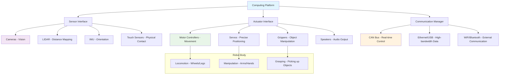

import ExerciseBlock from '@site/src/components/Learning/ExerciseBlock';
import Quiz from '@site/src/components/Learning/Quiz';


## تعارف

پچھلے باب میں، ہم نے فزیکل AI کی دلچسپ دنیا اور یہ دریافت کیا کہ روبوٹ اپنے ماحول کے ساتھ تعامل کے ذریعے کیسے سیکھتے ہیں۔ اب وقت آگیا ہے کہ تصورات سے حقیقت کی طرف بڑھیں اور وہ فزیکل ہارڈویئر ترتیب دیں جو ان خیالات کو زندہ کرتا ہے۔ اس باب کو اپنے "روبوٹک باڈی" کی تعمیر سمجھیں - جیسے انسانوں کے پاس دنیا کے ساتھ تعامل کے لیے آنکھیں، کان، پٹھے اور دماغ ہوتا ہے، ویسے ہی روبوٹوں کو حقیقی معنوں میں embodied بننے کے لیے سینسرز، ایکچویٹرز، کمپیوٹنگ پلیٹ فارمز اور کمیونیکیشن سسٹمز کی ضرورت ہوتی ہے۔

یہ باب آپ کو فزیکل AI سسٹمز کے لیے ضروری ہارڈویئر اجزاء کے بارے میں رہنمائی فراہم کرے گا، سینسرز اور ایکچویٹرز سے لے کر کمپیوٹنگ پلیٹ فارمز تک۔ چاہے آپ فزیکل روبوٹ، سمیلیشن ماحول، یا ہائبرڈ سیٹ اپ کے ساتھ کام کر رہے ہوں، مناسب ہارڈویئر کنفیگریشن کامیاب فزیکل AI نفاذ کے لیے اہم ہے۔ ہم تصورات کو واضح اور قابل فہم بنانے کے لیے حقیقی دنیا کی مثالوں اور تشبیہات کے ساتھ ہر جزو کو دریافت کریں گے۔

## سیکھنے کے مقاصد

اس باب کو مکمل کرنے کے بعد، آپ قابل ہوں گے:
- فزیکل AI سسٹمز کے لیے ضروری ہارڈویئر اجزاء کی شناخت کریں
- روبوٹک ہارڈویئر اجزاء کے لیے کنفیگریشن عمل کی وضاحت کریں
- بنیادی روبوٹک ہارڈویئر اجزاء کو ترتیب دیں اور تصدیق کریں
- ملٹی موڈل پرسیپشن کے لیے سینسرز کے انضمام کا تجزیہ کریں
- جامع ٹیسٹوں کے ذریعے ہارڈویئر فنکشنلٹی کی توثیق کریں

## ہک

اس پر غور کریں: ایک جدید AI الگورتھم بیکار ہے اگر یہ اپنے ماحول کو محسوس نہیں کر سکتا یا اس پر عمل نہیں کر سکتا۔ جیسے ایک شاندار دماغ کو دنیا کے ساتھ تعامل کے لیے حواس اور اعضاء کی ضرورت ہوتی ہے، ویسے ہی ایک AI سسٹم کو حقیقی معنوں میں embodied بننے کے لیے ہارڈویئر کی ضرورت ہوتی ہے۔ اسے ایسے سمجھیں جیسے دنیا کا سب سے جدید GPS نیویگیشن سسٹم ہو لیکن چلانے کے لیے کوئی کار نہ ہو - ذہانت تو موجود ہے، لیکن اس پر عمل کرنے کے فزیکل ذرائع کے بغیر، یہ بے اثر ہے۔ 2023 میں، MIT کے محققین نے اس اصول کا مظاہرہ کیا جب ان کے روبوٹ نے فزیکل تعامل کے ذریعے نئے کنٹینرز کھولنا سیکھا - ایسی چیز جو کسی بھی مقدار کی ڈیجیٹل ٹریننگ سے حاصل نہیں ہو سکتی تھی۔ اس باب میں آپ جو ہارڈویئر سیٹ اپ سیکھیں گے، وہ بنیاد ہے جو ایسی قابل ذکر کامیابیوں کو ممکن بناتی ہے۔

<div className="key-takeaway">
### اس سے پہلے کہ آپ یہ سیکھیں...
- فزیکل AI سسٹمز کو ایک ساتھ کام کرنے والے متعدد ہارڈویئر اجزاء کی ضرورت ہوتی ہے
- مختلف کمپیوٹنگ پلیٹ فارمز سسٹم میں مختلف کردار ادا کرتے ہیں
- مؤثر پرسیپشن کے لیے سینسر فیوژن اہم ہے
- حفاظتی تحفظات کو ہارڈویئر ڈیزائن میں شامل کرنا ضروری ہے
- ہارڈویئر انتخاب آپ کی مخصوص ایپلیکیشن اور بجٹ پر منحصر ہے
</div>

<div className="common-misconception">
### عام غلط فہمی...
**افسانہ**: زیادہ مہنگا ہارڈویئر ہمیشہ بہتر روبوٹ کارکردگی کی طرف لے جاتا ہے۔
**حقیقت**: سستے، اچھی طرح مربوط اجزاء کا صحیح امتزاج اکثر مہنگے اکیلے اجزاء سے بہتر کارکردگی دکھاتا ہے جو ایک ساتھ اچھی طرح کام نہیں کرتے۔ یہ سب سے مہنگے حصوں کے بارے میں نہیں، بلکہ ایسے حصوں کے بارے میں ہے جو ایک سسٹم کے طور پر ہم آہنگی سے کام کرتے ہیں۔
</div>

## تصور

فزیکل AI سسٹمز کو کئی اہم ہارڈویئر اجزاء کی ضرورت ہوتی ہے جو embodied intelligence کے لیے ضروری perception-action loop بنانے کے لیے مل کر کام کرتے ہیں۔ روبوٹ بنانے کو انسانی جسم بنانے کے مانند سمجھیں - ہر جزو کی ایک مخصوص تقریب ہوتی ہے، لیکن ان سب کو بغیر کسی رکاوٹ کے مل کر کام کرنے کی ضرورت ہے۔

### کمپیوٹنگ پلیٹ فارم: روبوٹ کا دماغ

کمپیوٹنگ پلیٹ فارم روبوٹ کے "دماغ" کے طور پر کام کرتا ہے، عام طور پر edge computing کے لیے embedded systems (جیسے NVIDIA Jetson) سے لے کر پیچیدہ پروسیسنگ کے لیے زیادہ طاقتور workstations تک۔ جیسے انسانوں میں پروسیسنگ کی مختلف سطحیں ہوتی ہیں - spinal cord سے منظم reflexive responses، brainstem سے فوری فیصلے، اور cortex سے پیچیدہ استدلال - ویسے ہی روبوٹ مختلف کاموں کے لیے مختلف کمپیوٹنگ پلیٹ فارمز استعمال کرتے ہیں۔

**NVIDIA Jetson Series**: یہ روبوٹ کے "cortex" کی طرح ہیں - computer vision اور فیصلہ سازی جیسے پیچیدہ AI کاموں کے لیے کافی طاقتور، لیکن خود روبوٹ پر فٹ ہونے کے لیے کافی چھوٹے۔ Jetson Nano طالب علم کے دماغ کی طرح ہے - سیکھنے کے کاموں کے لیے قابل اور موثر، جبکہ Jetson Orin پروفیسر کے دماغ کی طرح ہے - پیچیدہ تحقیق کے لیے زیادہ طاقتور۔

**Raspberry Pi**: اسے روبوٹ کے "reflex system" کے طور پر سمجھیں - سادہ، موثر، اور بنیادی کنٹرول کاموں اور سینسر ریڈنگ کے لیے بہترین۔ یہ سادہ، تکراری کاموں کے لیے ایک وقف شدہ سسٹم رکھنے کے مانند ہے۔

**Desktop Workstations**: یہ پیچیدہ کاموں کے لیے "سپر کمپیوٹر" کے طور پر کام کرتے ہیں جن کو real-time میں کرنے کی ضرورت نہیں، جیسے AI ماڈلز کی تربیت یا بڑے ڈیٹاسیٹس کی پروسیسنگ۔

### سینسرز: روبوٹ کے حواس

جیسے انسانوں کے پانچ حواس ہوتے ہیں، ویسے ہی روبوٹوں کو اپنے ماحول کو محسوس کرنے کے لیے متعدد سینسرز کی ضرورت ہوتی ہے۔ ہر سینسر مختلف معلومات فراہم کرتا ہے، اور مل کر ایک مکمل تصویر بناتے ہیں۔

**کیمرے**: بصری پرسیپشن کے لیے روبوٹ کی "آنکھیں"۔ انسانی آنکھوں کی طرح، وہ اشیاء، رنگ، حرکت اور بہت کچھ کا پتہ لگا سکتے ہیں۔ جدید روبوٹ اکثر depth perception کے لیے متعدد کیمرے استعمال کرتے ہیں، جیسے انسان 3D میں دیکھنے کے لیے دو آنکھیں استعمال کرتے ہیں۔

**LIDAR (Light Detection and Ranging)**: چمگادڑ کی echolocation یا ڈولفن کے sonar کی طرح، LIDAR لیزر روشنی کی واپسی کا وقت ناپ کر فاصلے ماپتا ہے۔ یہ درست نقشے بنانے اور رکاوٹوں کا پتہ لگانے کے لیے بہترین ہے، یہاں تک کہ اندھیرے میں بھی۔

**IMU (Inertial Measurement Unit)**: یہ روبوٹ کے اندرونی کان کی طرح ہے - یہ orientation، acceleration، اور angular velocity کو محسوس کرتا ہے۔ یہ روبوٹ کو یہ جاننے میں مدد کرتا ہے کہ کونسا راستہ اوپر ہے اور یہ خلا میں کیسے حرکت کر رہا ہے۔

**Touch/Force Sensors**: انسانی جلد اور پٹھوں کی طرح جو دباؤ اور قوت محسوس کرتے ہیں، یہ روبوٹوں کو اشیاء کے ساتھ محفوظ طریقے سے تعامل کرنے اور یہ سمجھنے میں مدد کرتے ہیں کہ وہ کسی چیز کو چھو رہے ہیں۔

**Microphones**: آڈیو ان پٹ کے لیے روبوٹ کے "کان"، جو اسے voice commands کا جواب دینے یا ماحول میں آوازوں کا پتہ لگانے کی اجازت دیتے ہیں۔

### ایکچویٹرز: روبوٹ کے پٹھے

ایکچویٹرز وہ اجزاء ہیں جو روبوٹ کو اپنے ماحول پر عمل کرنے کی اجازت دیتے ہیں - وہ روبوٹ کے "پٹھے" ہیں۔

**Motors**: حرکت (پہیے، ٹانگیں) اور manipulation (بازو کی حرکت) کے لیے۔ انسانی پٹھوں کی طرح، وہ بھاری کاموں کے لیے طاقتور یا نازک کارروائیوں کے لیے درست ہو سکتے ہیں۔

**Servos**: یہ درست پٹھوں کی حرکات کی طرح ہیں - وہ درست پوزیشنوں میں منتقل ہو سکتے ہیں، انہیں robotic arms یا درست کنٹرول سسٹمز کے لیے بہترین بناتے ہیں۔

**Grippers**: اشیاء کو پکڑنے کے لیے خصوصی "ہاتھ"، سادہ pincers سے لے کر پیچیدہ کثیر انگلیوں والے ہاتھوں تک۔

**Speakers**: آڈیو آؤٹ پٹ کے لیے، روبوٹ کو انسانوں یا دیگر روبوٹوں کے ساتھ بات چیت کرنے کی اجازت دیتے ہیں۔

### کمیونیکیشن سسٹمز: روبوٹ کا اعصابی نظام

جیسے انسانی اعصابی نظام دماغ کو جسم سے جوڑتا ہے، ویسے ہی کمیونیکیشن سسٹمز تمام روبوٹ اجزاء کو جوڑتے ہیں۔ مختلف سسٹمز مختلف مقاصد کی خدمت کرتے ہیں:

**CAN Bus**: اہم، real-time signals کے لیے spinal cord کی طرح - موٹر کنٹرول اور حفاظت کے اہم سسٹمز کے لیے تیز اور قابل اعتماد۔

**Ethernet/USB**: high-bandwidth data کے لیے بڑے اعصاب کی طرح - سینسر ڈیٹا کے لیے بہترین جو اجزاء کے درمیان تیزی سے منتقل ہونا ضروری ہے۔

**WiFi/Bluetooth**: وائرلیس کمیونیکیشن کی طرح - بیرونی مواصلات اور اپ ڈیٹس کے لیے بہترین، اگرچہ حفاظت کے اہم فنکشنز کے لیے اتنا قابل اعتماد نہیں۔

### پاور سسٹمز: روبوٹ کا توانائی کا ذریعہ

روبوٹوں کو کام کرنے کے لیے بجلی کی ضرورت ہوتی ہے، جیسے انسانوں کو توانائی کے لیے خوراک کی ضرورت ہوتی ہے۔ بیٹری مینجمنٹ اور تقسیم اس بات کو یقینی بناتی ہے کہ تمام اجزاء کو ضرورت کی بجلی ملے جبکہ محفوظ آپریشن برقرار رہے۔

### حقیقی دنیا کی مثالیں اور تشبیہات

Tesla کے Autopilot سسٹم کے بارے میں سوچیں: یہ سڑک کی مکمل تصویر بنانے کے لیے متعدد کیمرے (انسانی آنکھوں کی طرح)، ultrasonic sensors (قربت محسوس کرنے کی طرح)، اور radar (طویل فاصلے کا پتہ لگانے کی طرح) استعمال کرتا ہے۔ onboard computer (دماغ کی طرح) اس تمام معلومات کو real-time میں پروسیس کرتا ہے تاکہ ڈرائیونگ کے فیصلے کر سکے۔

یا Boston Dynamics کے روبوٹوں پر غور کریں: وہ توازن کے لیے IMUs، نیویگیشن کے لیے کیمرے، رکاوٹ کا پتہ لگانے کے لیے LIDAR، اور حرکت کے لیے طاقتور موٹرز کو یکجا کرتے ہیں - سب کچھ قابل ذکر mobility حاصل کرنے کے لیے جدید کمپیوٹنگ پلیٹ فارمز کے ذریعے مربوط۔

## Mermaid ڈایاگرام

<div className="diagram-container" tabIndex={0}>

<figcaption className="mermaid-diagram figcaption">
فلو چارٹ فزیکل AI سسٹم کی ہارڈویئر آرکیٹیکچر دکھا رہا ہے: کمپیوٹنگ پلیٹ فارم سینسرز، ایکچویٹرز، اور کمیونیکیشن سسٹمز کے ساتھ انٹرفیس کرتا ہے، جو مختلف خصوصی ہارڈویئر اجزاء سے جڑتا ہے جو روبوٹ کو اپنے ماحول کو محسوس کرنے اور تعامل کرنے کے قابل بناتے ہیں۔
</figcaption>
</div>

## کوڈ کی مثال

آئیے دیکھتے ہیں کہ Python اور ROS 2 استعمال کرتے ہوئے بنیادی ہارڈویئر اجزاء کو کیسے ترتیب دیا اور تصدیق کی جائے، جو حقیقی روبوٹ پر سینسرز اور ایکچویٹرز کی جانچ سے ملتی جلتی ہے:

```python
#!/usr/bin/env python3
"""
Hardware Setup and Verification Node - Tier A Example

Tier A: CPU-only simulation example that works with Gazebo, no hardware required
Purpose: Learn hardware setup concepts without physical robot

Learning Objectives:
- Understand how to interface with robot sensors and actuators
- Learn about hardware status monitoring and verification
- See how different hardware components communicate
- Practice safe robot operation principles

Prerequisites:
- Chapter 1 concepts (sensors, actuators, computing platform)
- Basic Python and ROS 2 knowledge

Expected Output:
- Hardware status reports showing which components are operational
- Safe motor commands with velocity limits
- Real-time monitoring of hardware status
"""

import rclpy
from rclpy.node import Node
from sensor_msgs.msg import Image, LaserScan, Imu, JointState
from geometry_msgs.msg import Twist
from std_msgs.msg import String, Bool
import cv2
import numpy as np
from typing import Dict, List, Optional
import time

class HardwareSetupNode(Node):
    """
    A ROS 2 node that demonstrates hardware setup and verification.
    This simulates how you would interface with real robot hardware,
    checking status and ensuring all components are working properly.

    Think of this like a robot's "health checkup" - we're making sure
    all the "organs" (sensors, actuators) are functioning before we
    let the robot start operating.
    """

    def __init__(self):
        super().__init__('hardware_setup_node')

        # Initialize hardware status tracking - like a doctor checking vital signs
        self.hardware_status = {
            'camera': False,
            'lidar': False,
            'imu': False,
            'motors': False,
            'communication': True  # Assuming communication is working if we're running
        }

        # Create subscribers for sensor data - like the robot's "nervous system"
        self.camera_subscription = self.create_subscription(
            Image,
            'camera/image_raw',
            self.camera_callback,
            10
        )

        self.lidar_subscription = self.create_subscription(
            LaserScan,
            'scan',
            self.lidar_callback,
            10
        )

        self.imu_subscription = self.create_subscription(
            Imu,
            'imu/data',
            self.imu_callback,
            10
        )

        self.joint_subscription = self.create_subscription(
            JointState,
            'joint_states',
            self.joint_callback,
            10
        )

        # Create publisher for motor commands - like the robot's "muscles"
        self.cmd_vel_publisher = self.create_publisher(Twist, 'cmd_vel', 10)

        # Timer for periodic hardware checks - like regular health monitoring
        self.status_timer = self.create_timer(1.0, self.check_hardware_status)

        # Safety timer for emergency monitoring
        self.safety_timer = self.create_timer(0.1, self.safety_check)  # 10Hz for safety

        self.get_logger().info('Hardware Setup Node initialized')
        self.get_logger().info('Starting hardware verification process...')

    def camera_callback(self, msg):
        """Process camera data and verify camera functionality"""
        try:
            # In a real robot, you'd convert ROS Image to OpenCV format using cv_bridge
            # Here we just check if we're receiving data
            if msg.height > 0 and msg.width > 0:
                self.hardware_status['camera'] = True
                self.get_logger().info('✅ Camera data received - Camera OK')
            else:
                self.hardware_status['camera'] = False
        except Exception as e:
            self.get_logger().error(f'❌ Camera error: {e}')
            self.hardware_status['camera'] = False

    def lidar_callback(self, msg):
        """Process LIDAR data and verify LIDAR functionality"""
        try:
            # Check if we're receiving valid distance data
            if len(msg.ranges) > 0 and min(msg.ranges) > 0 and max(msg.ranges) > 0:
                self.hardware_status['lidar'] = True
                self.get_logger().info('✅ LIDAR data received - LIDAR OK')
            else:
                self.hardware_status['lidar'] = False
        except Exception as e:
            self.get_logger().error(f'❌ LIDAR error: {e}')
            self.hardware_status['lidar'] = False

    def imu_callback(self, msg):
        """Process IMU data and verify IMU functionality"""
        try:
            # Check if IMU data is reasonable (not all zeros)
            # IMU measures orientation, acceleration, and angular velocity
            linear_accel = abs(msg.linear_acceleration.x) + abs(msg.linear_acceleration.y) + abs(msg.linear_acceleration.z)
            angular_vel = abs(msg.angular_velocity.x) + abs(msg.angular_velocity.y) + abs(msg.angular_velocity.z)

            if linear_accel > 0.1 or angular_vel > 0.1:  # Some movement detected
                self.hardware_status['imu'] = True
                self.get_logger().info('✅ IMU data received - IMU OK')
            else:
                self.hardware_status['imu'] = False
        except Exception as e:
            self.get_logger().error(f'❌ IMU error: {e}')
            self.hardware_status['imu'] = False

    def joint_callback(self, msg):
        """Process joint state data and verify motor functionality"""
        try:
            if len(msg.position) > 0 and len(msg.velocity) > 0:
                self.hardware_status['motors'] = True
                self.get_logger().info('✅ Joint data received - Motors OK')
            else:
                self.hardware_status['motors'] = False
        except Exception as e:
            self.get_logger().error(f'❌ Motor error: {e}')
            self.hardware_status['motors'] = False

    def check_hardware_status(self):
        """Periodically check and report hardware status"""
        all_working = all(self.hardware_status.values())

        self.get_logger().info(f"\n🔍 Hardware Status Check:")
        for component, status in self.hardware_status.items():
            status_str = '✅ OK' if status else '❌ NOT READY'
            self.get_logger().info(f'  {component.upper()}: {status_str}')

        if all_working:
            self.get_logger().info('🎉 ALL HARDWARE COMPONENTS OPERATIONAL')
        else:
            self.get_logger().info('⚠️  Some hardware components need attention')

    def safety_check(self):
        """Real-time safety monitoring - like a safety reflex"""
        # This runs at 10Hz to continuously monitor for safety issues
        # In a real robot, this would check for emergency stops, collisions, etc.

        # Example: Check if we're getting too close to obstacles
        if self.hardware_status['lidar']:
            # This would check LIDAR data for close obstacles
            # For now, just a placeholder for safety logic
            pass

    def send_motor_command(self, linear_x: float = 0.0, angular_z: float = 0.0):
        """
        Send velocity command to robot motors with safety limits
        This is like telling the robot's legs or wheels how fast to move
        """
        # Apply safety limits - like having a speed limit for safety
        max_linear = 0.5  # m/s - safe speed limit
        max_angular = 1.0  # rad/s - safe turning limit

        # Clamp the values to safe limits
        safe_linear = max(min(linear_x, max_linear), -max_linear)
        safe_angular = max(min(angular_z, max_angular), -max_angular)

        cmd = Twist()
        cmd.linear.x = safe_linear
        cmd.angular.z = safe_angular

        self.cmd_vel_publisher.publish(cmd)
        self.get_logger().info(f'🚀 Sent motor command: linear={safe_linear:.2f}, angular={safe_angular:.2f}')

    def run_hardware_verification(self):
        """Run comprehensive hardware verification tests"""
        self.get_logger().info('🧪 Starting comprehensive hardware verification...')

        # Test motors briefly - like testing if the robot's "legs" work
        self.get_logger().info('Testing motor functionality...')
        self.send_motor_command(linear_x=0.1)  # Move forward slowly
        time.sleep(2)
        self.send_motor_command()  # Stop
        time.sleep(1)

        # Test rotation - like testing if the robot can turn
        self.get_logger().info('Testing rotation functionality...')
        self.send_motor_command(angular_z=0.2)  # Rotate slowly
        time.sleep(2)
        self.send_motor_command()  # Stop
        time.sleep(1)

        self.get_logger().info('✅ Hardware verification complete')

def main(args=None):
    """
    Main function to demonstrate hardware setup and verification
    This simulates the process of checking all robot hardware components
    """
    rclpy.init(args=args)

    hardware_node = HardwareSetupNode()

    # Run initial hardware verification
    hardware_node.run_hardware_verification()

    # Start the ROS 2 spinning to keep processing callbacks
    # This keeps the robot "awake" and monitoring its sensors
    try:
        rclpy.spin(hardware_node)
    except KeyboardInterrupt:
        hardware_node.get_logger().info('🛑 Shutting down hardware setup node')
    finally:
        hardware_node.destroy_node()
        rclpy.shutdown()

if __name__ == '__main__':
    main()
```

## مشقیں

1. **ہارڈویئر کی شناخت**: فزیکل AI سسٹم میں استعمال ہونے والے کم از کم 5 مختلف قسم کے سینسرز کی فہرست بنائیں اور وضاحت کریں کہ ہر ایک کیا ناپتا ہے۔ صرف ایک قسم کے سینسر استعمال کرنے کے مقابلے میں multi-sensor integration کیوں اہم ہے؟

2. **کمپیوٹنگ پلیٹ فارم کا انتخاب**: فزیکل AI کے لیے موزوں تین مختلف کمپیوٹنگ پلیٹ فارمز (مثلاً NVIDIA Jetson، Raspberry Pi، Intel NUC) کی تحقیق اور موازنہ کریں۔ processing power، power consumption، اور cost کے لحاظ سے ہر ایک کے trade-offs کیا ہیں؟ آپ ہر ایک کو کب منتخب کریں گے؟

3. **کمیونیکیشن پروٹوکولز**: روبوٹک سسٹمز میں CAN bus، Ethernet، اور WiFi کمیونیکیشن کے درمیان فرق کی وضاحت کریں۔ آپ ہر پروٹوکول کو کب استعمال کریں گے، اور ہر ایک کے فوائد اور نقصانات کیا ہیں؟

4. **ہارڈویئر ٹربل شوٹنگ**: اگر آپ کا کیمرا ڈیٹا شائع نہیں کر رہا، تو 5 ممکنہ وجوہات اور ہر ایک کی تشخیص کا طریقہ فہرست بنائیں۔ آپ مسئلے کو troubleshoot کرنے کے لیے کونسا منظم طریقہ استعمال کریں گے؟

5. **حفاظتی تحفظات**: فزیکل روبوٹ پر موٹر commands کی جانچ کرتے وقت کون سے حفاظتی اقدامات نافذ کیے جانے چاہئیں؟ آپ software safety limits کیسے نافذ کریں گے، اور وہ کیوں اہم ہیں؟

<details>
<summary>مشق کے حل</summary>

1. **ہارڈویئر شناخت کا حل**:
   - کیمرے: بصری معلومات، object recognition، رنگ کا پتہ لگانا
   - LIDAR: فاصلے کی پیمائش، 3D mapping، رکاوٹ کا پتہ لگانا
   - IMU: Orientation، acceleration، angular velocity، توازن
   - Force/Torque sensors: فزیکل تعامل کی قوتیں، گرفت کی طاقت
   - Microphones: آڈیو ان پٹ، آواز کا مقام، voice commands
   Multi-sensor integration اہم ہے کیونکہ یہ redundancy فراہم کرتا ہے (اگر ایک سینسر ناکام ہو جائے، دوسرے اب بھی کام کر سکتے ہیں)، complementary information (مختلف سینسرز ماحول کے مختلف پہلو دیکھتے ہیں)، اور سینسر کی ناکامیوں سے مضبوطی۔ یہ انسانوں کے بیک وقت متعدد حواس استعمال کرنے کی طرح ہے - ہم اپنے ماحول کو صرف ایک حس کے مقابلے میں بہتر سمجھنے کے لیے دیکھتے، سنتے اور محسوس کرتے ہیں۔

2. **کمپیوٹنگ پلیٹ فارم انتخاب کا حل**:
   - NVIDIA Jetson: AI اور computer vision کے لیے high GPU performance، moderate power consumption، زیادہ لاگت - پیچیدہ vision/AI کاموں کے لیے اچھا جو خود روبوٹ پر چلنے کی ضرورت ہے
   - Raspberry Pi: کم لاگت، بہت کم بجلی، محدود کارکردگی - سادہ کنٹرول کاموں، سینسر ریڈنگ، اور بنیادی مواصلات کے لیے اچھا
   - Intel NUC: high performance، زیادہ power consumption، زیادہ لاگت - پیچیدہ پروسیسنگ کے لیے اچھا جو خود روبوٹ پر ہونے کی ضرورت نہیں
   Trade-offs میں بجلی کی پابندیوں کے ساتھ کارکردگی کی ضروریات کو متوازن کرنا، heat management، اور بجٹ شامل ہے۔ انتخاب اس بات پر منحصر ہے کہ آیا آپ کو روبوٹ پر real-time processing کی ضرورت ہے یا بیرونی کمپیوٹرز میں offload کر سکتے ہیں۔

3. **کمیونیکیشن پروٹوکولز کا حل**:
   - CAN bus: Real-time، بہت مضبوط، اہم سسٹمز کے لیے ڈیزائن کیا گیا، کم bandwidth - موٹر کنٹرول اور حفاظت کے اہم سسٹمز کے لیے استعمال جہاں وشوسنییتا اہم ہے
   - Ethernet: High bandwidth، deterministic timing، سینسر ڈیٹا کے لیے اچھا - کیمروں اور LIDAR جیسے high-data-rate sensors کے لیے استعمال
   - WiFi: وائرلیس، لچکدار، متغیر وشوسنییتا - بیرونی مواصلات، اپ ڈیٹس، اور غیر اہم ڈیٹا کے لیے استعمال
   Real-time control کے لیے CAN استعمال کریں جہاں timing اہم ہو، high-bandwidth sensor data کے لیے Ethernet، اور غیر اہم مواصلات اور اپ ڈیٹس کے لیے WiFi۔

4. **ہارڈویئر ٹربل شوٹنگ کا حل**:
   - فزیکل کنکشن چیک کریں: تصدیق کریں کہ کیبلز محفوظ اور خراب نہیں ہیں
   - بجلی کی فراہمی چیک کریں: یقینی بنائیں کہ کیمرے کو مناسب voltage اور current مل رہی ہے
   - ڈرائیورز چیک کریں: تصدیق کریں کہ مناسب ڈرائیورز نصب اور loaded ہیں
   - اجازتیں چیک کریں: یقینی بنائیں کہ software کو کیمرہ device تک رسائی ہے
   - ROS configuration چیک کریں: صحیح topic names، اجازتیں، اور node connections کی تصدیق کریں
   منظم طریقہ: فزیکل معائنے سے شروع کریں، پھر software configuration، پھر ROS setup۔ پیچیدہ software مسائل کی طرف بڑھنے سے پہلے سب سے سادہ چیزوں کو چیک کریں (بجلی، کنکشنز)۔

5. **حفاظتی تحفظات کا حل**:
   - خطرناک حرکات کو روکنے کے لیے software میں velocity/position limits نافذ کریں
   - حفاظتی stop mechanisms استعمال کریں جو فوری طور پر تمام حرکت کو روک سکیں
   - روبوٹ کو اشیاء یا لوگوں سے ٹکرانے سے روکنے کے لیے collision detection شامل کریں
   - ایمرجنسی stop functionality شامل کریں جو تمام دیگر commands کو override کرے
   - مکمل آپریشن کی اجازت دینے سے پہلے پہلے controlled environment میں ٹیسٹ کریں
   Software safety limits command values کو cap کر کے اور خطرناک states کی نگرانی کر کے نافذ کیے جا سکتے ہیں۔ یہ اہم ہیں کیونکہ روبوٹ نقصان یا چوٹ کا سبب بن سکتے ہیں اگر وہ بہت تیز، بہت دور، یا غیر متوقع طریقوں سے حرکت کریں۔

</details>

## خلاصہ

اس باب نے فزیکل AI سسٹمز کے لیے ضروری ہارڈویئر اجزاء پر روشنی ڈالی:

1. **کمپیوٹنگ پلیٹ فارم**: مرکزی پروسیسنگ یونٹ جو AI algorithms چلاتی ہے اور اجزاء کو مربوط کرتی ہے۔ مختلف پلیٹ فارمز مختلف کردار ادا کرتے ہیں - real-time control کے لیے embedded systems سے لے کر پیچیدہ پروسیسنگ کے لیے طاقتور workstations تک۔

2. **سینسرز**: متعدد قسم کے سینسرز embodied intelligence کے لیے ضروری perception capabilities فراہم کرتے ہیں۔ ہر سینسر مختلف معلومات فراہم کرتا ہے، اور مل کر ماحول کی مکمل تصویر بناتے ہیں۔

3. **ایکچویٹرز**: موٹرز، servos، اور دیگر ڈیوائسز روبوٹ کو اپنے ماحول کے ساتھ تعامل کے قابل بناتی ہیں۔ یہ روبوٹ کے "پٹھے" ہیں جو اسے اپنی perceptions پر عمل کرنے کی اجازت دیتے ہیں۔

4. **کمیونیکیشن سسٹمز**: پروٹوکولز جو تمام اجزاء کے درمیان بغیر کسی رکاوٹ کے coordination کی اجازت دیتے ہیں۔ مختلف پروٹوکولز bandwidth، وشوسنییتا، اور timing requirements کی بنیاد پر مختلف مقاصد کی خدمت کرتے ہیں۔

5. **پاور سسٹمز**: آپریشن برقرار رکھنے کے لیے قابل اعتماد بجلی کی تقسیم۔ تمام اجزاء کے صحیح طریقے سے کام کرنے کے لیے مناسب power management ضروری ہے۔

6. **انضمام**: ہارڈویئر آرکیٹیکچر کو فزیکل AI کے لیے بنیادی action-perception loop کی حمایت کرنی چاہیے۔ تمام اجزاء کو ایک مربوط سسٹم کے طور پر مل کر کام کرنا چاہیے۔

مناسب ہارڈویئر سیٹ اپ فزیکل AI سسٹمز کے لیے اہم ہے، کیونکہ دنیا سے مناسب فزیکل انٹرفیس کے بغیر سب سے جدید AI algorithms بھی بیکار ہیں۔ کلید صرف اجزاء رکھنا نہیں، بلکہ انہیں ایک مربوط سسٹم کے طور پر مل کر کام کرنا ہے۔

## حصہ 1 کوئز

<Quiz
  id="chapter-2-quiz"
  chapterReference="Chapter 2: Hardware Setup"
  questions={[
    {
      id: "ch2-q1",
      question: "فزیکل AI سسٹم کے لیے ضروری ہارڈویئر اجزاء کیا ہیں؟",
      type: "multiple-choice",
      options: [
        "صرف ایک کمپیوٹر اور کچھ سینسرز",
        "صرف موٹرز اور پہیے",
        "کیمرہ اور مائیکروفون",
        "کمپیوٹنگ پلیٹ فارم، سینسرز، ایکچویٹرز، کمیونیکیشن سسٹمز"
      ],
      correctAnswer: 3,
      hint: "باب 2، 'تصور' سیکشن دیکھیں - روبوٹ کا دماغ، حواس، اور پٹھے",
      explanation: "فزیکل AI سسٹمز کو مل کر کام کرنے والے متعدد اجزاء کی ضرورت ہوتی ہے: پروسیسنگ کے لیے کمپیوٹنگ پلیٹ فارم، perception کے لیے سینسرز، action کے لیے ایکچویٹرز، اور coordination کے لیے کمیونیکیشن سسٹمز۔"
    },
    {
      id: "ch2-q2",
      question: "multi-sensor integration کیوں اہم ہے؟",
      type: "multiple-choice",
      options: [
        "یہ single sensors سے سستا ہے",
        "یہ مکمل تصویر کے لیے متعدد قسم کی معلومات فراہم کرتا ہے",
        "یہ کم بجلی استعمال کرتا ہے",
        "اس کی programming آسان ہے"
      ],
      correctAnswer: 1,
      hint: "باب 2، 'تصور' سیکشن دیکھیں - سینسرز: روبوٹ کے حواس",
      explanation: "Multi-sensor integration redundancy، complementary information، اور مضبوطی فراہم کرتا ہے، مختلف sensor types کو یکجا کر کے ماحول کی مکمل سمجھ بناتا ہے۔"
    },
    {
      id: "ch2-q3",
      question: "on-robot AI processing کے لیے کون سا کمپیوٹنگ پلیٹ فارم بہترین ہے؟",
      type: "multiple-choice",
      options: [
        "تمام کاموں کے لیے Raspberry Pi",
        "صرف ڈیسک ٹاپ کمپیوٹر",
        "AI processing کے لیے NVIDIA Jetson",
        "کوئی بھی کمپیوٹر یکساں کام کرتا ہے"
      ],
      correctAnswer: 2,
      hint: "باب 2، 'تصور' سیکشن دیکھیں - کمپیوٹنگ پلیٹ فارم: روبوٹ کا دماغ",
      explanation: "NVIDIA Jetson پلیٹ فارمز پیچیدہ AI کاموں کی on-robot processing کے لیے ضروری AI processing power اور compact form factor کا صحیح توازن فراہم کرتے ہیں۔"
    },
    {
      id: "ch2-q4",
      question: "safety-critical motor control کے لیے کون سا کمیونیکیشن پروٹوکول بہترین ہے؟",
      type: "multiple-choice",
      options: [
        "سہولت کے لیے WiFi",
        "رفتار کے لیے Ethernet",
        "وائرلیس کے لیے Bluetooth",
        "CAN bus"
      ],
      correctAnswer: 3,
      hint: "باب 2، 'تصور' سیکشن دیکھیں - کمیونیکیشن سسٹمز: روبوٹ کا اعصابی نظام",
      explanation: "CAN bus real-time، safety-critical systems کے لیے guaranteed delivery اور high reliability کے ساتھ ڈیزائن کیا گیا ہے، اسے موٹر کنٹرول اور حفاظتی فنکشنز کے لیے مثالی بناتا ہے۔"
    },
    {
      id: "ch2-q5",
      question: "'multi-sensor integration' کی اصطلاح کا کیا مطلب ہے؟",
      type: "multiple-choice",
      options: [
        "ایک ہی قسم کے بہت سے سینسرز استعمال کرنا",
        "مختلف قسم کے سینسرز کو ایک ساتھ استعمال کرنا",
        "سینسرز کو متعدد کمپیوٹرز سے جوڑنا",
        "صرف بیک اپ سینسرز رکھنا"
      ],
      correctAnswer: 1,
      hint: "باب 2، 'تصور' سیکشن دیکھیں - سینسرز: روبوٹ کے حواس",
      explanation: "Multi-sensor integration میں complementary information استعمال کرتے ہوئے ماحول کی مکمل تصویر بنانے کے لیے مختلف قسم کے سینسرز (کیمرے، LIDAR، IMU، وغیرہ) کو یکجا کرنا شامل ہے۔"
    }
  ]}
/>

## اگلے باب کا پیش نظر

باب 3: فزیکل AI آرکیٹیکچر میں، ہم software architecture کو دریافت کریں گے جو ان ہارڈویئر اجزاء کو باندھتی ہے جنہیں آپ نے ترتیب دینا سیکھا ہے۔ آپ تین درجے کی آرکیٹیکچر (Workstation/Edge/Robot) کو دریافت کریں گے جو موثر فزیکل AI سسٹمز کو ممکن بناتی ہے، نیٹ ورک کنفیگریشنز کے بارے میں سیکھیں گے، اور سمجھیں گے کہ مختلف کمپیوٹنگ پلیٹ فارمز پر بہترین کارکردگی کے لیے اپنے کوڈ کو کیسے ترتیب دیا جائے۔ یہ تعمیراتی علم آپ کو مضبوط فزیکل AI ایپلیکیشنز بنانے کے لیے تیار کرے گا جو سنگل روبوٹس سے پیچیدہ multi-robot systems تک scale ہوتی ہیں۔
