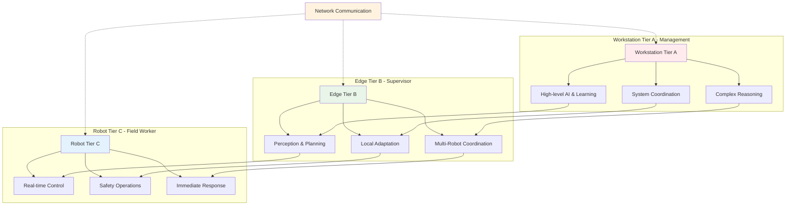

import ExerciseBlock from '@site/src/components/Learning/ExerciseBlock';
import Quiz from '@site/src/components/Learning/Quiz';

## تعارف

پچھلے ابواب میں، ہم نے فزیکل AI کی نظریاتی بنیادوں کو دریافت کیا اور ضروری ہارڈویئر اجزاء کو ترتیب دینا سیکھا۔ اب، ہم ان architectural patterns میں غوطہ لگائیں گے جو فزیکل AI سسٹمز کو scalable، موثر، اور مضبوط بناتے ہیں۔ اس باب کو ایک پیچیدہ ٹیم کو منظم کرنے کے سیکھنے کے طور پر سمجھیں - جیسے ایک کمپنی میں مختلف departments ہوتے ہیں جو مختلف ذمہ داریاں سنبھالتے ہیں (استقبالیہ، انتظام، آپریشنز)، ویسے ہی فزیکل AI سسٹمز کارکردگی کو بہتر بنانے کے لیے کام کو تین tiers میں تقسیم کرتے ہیں۔

تین درجے کی آرکیٹیکچر - Workstation، Edge، اور Robot - جدید فزیکل AI deployments کی ریڑھ کی ہڈی بناتی ہے، پیچیدہ robotic systems کو مختلف computing environments میں مؤثر طریقے سے کام کرنے کے قابل بناتی ہے۔ یہ باب آپ کو دکھائے گا کہ اپنی فزیکل AI ایپلیکیشنز کو کیسے structure کیا جائے تاکہ ہر tier کی طاقتوں کا فائدہ اٹھایا جا سکے جبکہ ان کے درمیان بغیر کسی رکاوٹ کے communication برقرار رہے، حقیقی دنیا کی analogies اور مثالوں کا استعمال کرتے ہوئے تصورات کو واضح اور قابل فہم بنانے کے لیے۔

## سیکھنے کے مقاصد

اس باب کو مکمل کرنے کے بعد، آپ قابل ہوں گے:
- فزیکل AI سسٹمز کے لیے تین درجے کی آرکیٹیکچر (Workstation/Edge/Robot) کی وضاحت کریں
- multi-tier فزیکل AI deployments کے لیے ڈیزائن اصولوں کی تشریح کریں
- مختلف tiers کے درمیان کمیونیکیشن پروٹوکولز نافذ کریں
- centralized اور distributed architectures کے درمیان کارکردگی کے trade-offs کا تجزیہ کریں
- تین درجے کی infrastructure میں فزیکل AI ایپلیکیشنز کا اندازہ لگائیں

## ہک

غور کریں کہ ایک dynamic environment میں کام کرنے والے humanoid robot کو split-second decisions لینے ہوں گے جبکہ تجربے سے سیکھنا اور دیگر systems کے ساتھ coordinate کرنا بھی ہو۔ اس کے لیے ایک sophisticated architecture کی ضرورت ہے جو real-time responsiveness کو complex computation کے ساتھ متوازن کرے - جیسے ایک ٹیم ہو جہاں field worker فوری فیصلے کرتا ہے، supervisor پیچیدہ planning سنبھالتا ہے، اور manager طویل مدتی حکمت عملی فراہم کرتا ہے۔ تین درجے کی آرکیٹیکچر کام کو مناسب طریقے سے تقسیم کر کے اس چیلنج کو حل کرتی ہے: robot فوری reactions سنبھالتا ہے (field worker کی طرح)، edge devices پیچیدہ perception اور planning manage کرتے ہیں (supervisor کی طرح)، جبکہ workstations high-level reasoning اور learning فراہم کرتے ہیں (manager کی طرح)۔ یہ آرکیٹیکچر robots کو reactive اور intelligent دونوں بننے کے قابل بناتی ہے، جیسے انسان reflexive responses اور سوچے سمجھے فیصلے کرنے میں توازن رکھتے ہیں۔

<div className="key-takeaway">
### اس سے پہلے کہ آپ یہ سیکھیں...
- فزیکل AI سسٹمز کو real-time performance اور complex computation میں توازن رکھنا ہوتا ہے
- مختلف computational tasks کی مختلف latency requirements ہوتی ہیں
- tiers کے درمیان communication قابل اعتماد اور موثر ہونا چاہیے
- سسٹم آرکیٹیکچر performance اور maintainability دونوں کو متاثر کرتی ہے
- تین درجے کا طریقہ computing platforms میں resource utilization کو optimize کرتا ہے
</div>

<div className="common-misconception">
### عام غلط فہمی...
**افسانہ**: Centralized architectures ہمیشہ بہتر ہیں کیونکہ وہ unified control فراہم کرتی ہیں۔
**حقیقت**: Distributed architectures اکثر real-time operations کے لیے بہتر fault tolerance اور کم latency فراہم کرتی ہیں، جبکہ centralized systems high-level coordination کے لیے بہتر ہیں۔ تین درجے کا طریقہ دونوں دنیاؤں کا بہترین امتزاج کرتا ہے۔
</div>

## تصور

فزیکل AI سسٹمز کے لیے تین درجے کی آرکیٹیکچر computational tasks کی تقسیم کو latency، processing power، اور real-time performance کی ان کی requirements کی بنیاد پر optimize کرنے کے لیے design کی گئی ہے۔ اسے ایک اچھی طرح منظم کمپنی کی طرح سمجھیں جہاں مختلف departments ایسے کام سنبھالتے ہیں جو ان کی صلاحیتوں کے لیے سب سے موزوں ہیں۔

### Robot Tier (Tier C): Field Worker

Robot Tier field worker کی طرح ہے جسے حالات کے پیش آنے پر فوری جواب دینا ہوتا ہے۔ یہ tier سنبھالتا ہے:

**Real-time control اور safety-critical operations**: reflex action کی طرح، robot tier کو حادثات کو روکنے یا فوری خطرات سے نمٹنے کے لیے فوری جواب دینا ہوگا۔ جب robot رکاوٹ کا پتہ لگاتا ہے، اسے فوری رکنا ہوگا - supervisor سے پوچھنے کا وقت نہیں۔

**Low-latency sensor processing اور actuator commands**: robot مقامی طور پر sensor data کو process کرتا ہے تاکہ split-second decisions لے سکے۔ اسے driver کے reflexes کی طرح سمجھیں - جب آپ آگے رکاوٹ دیکھتے ہیں، آپ سوچے بغیر فوری brake کرتے ہیں۔

**Immediate obstacle avoidance اور basic navigation**: robot بنیادی navigation tasks سنبھالتا ہے جن کو فوری response کی ضرورت ہے، جیسے اس کے سامنے کچھ آنے پر رکنا۔

**Minimal computational overhead**: یہ tier robot کے onboard computer پر چلتا ہے، عام طور پر محدود processing power کے ساتھ لیکن رفتار اور reliability کے لیے optimized۔

**Typical platforms**: NVIDIA Jetson series، Raspberry Pi، یا دیگر embedded systems جو خود robot پر fit ہونے کے لیے design کیے گئے ہیں۔

### Edge Tier (Tier B): Supervisor

Edge Tier supervisor کی طرح کام کرتا ہے جو زیادہ پیچیدہ کام سنبھالتا ہے جن کو analysis کی ضرورت ہے لیکن پھر بھی نسبتاً تیز responses کی ضرورت ہے۔ یہ tier manage کرتا ہے:

**پیچیدہ perception tasks**: supervisor کی reports کا تجزیہ کرنے کی طرح، Edge tier پیچیدہ sensor data کو process کرتا ہے جیسے computer vision، sensor fusion، اور pattern recognition جو robot کے پاس موجود processing power سے زیادہ ضرورت ہے۔

**Path planning اور higher-level decision making**: Edge tier routes plan کرتا ہے اور ایسے فیصلے کرتا ہے جو فوری نہیں ہونے چاہیے لیکن پھر بھی timely responses کی ضرورت ہے۔

**Local learning اور adaptation**: supervisor کی طرح جو مقامی conditions سے سیکھتا ہے، Edge tier مقامی environments کے مطابق ڈھلتا ہے اور central management سے contact کیے بغیر حالیہ تجربات سے سیکھتا ہے۔

**متعدد robots کے ساتھ communication**: Edge tier ایک ہی علاقے میں متعدد robots کو coordinate کر سکتا ہے، supervisor کی طرح جو ٹیم manage کرتا ہے۔

**Typical platforms**: زیادہ طاقتور Jetson variants، edge servers، یا دیگر computing devices جو low-latency communication کے لیے robots کے قریب واقع ہوں۔

### Workstation Tier (Tier A): Manager

Workstation Tier central management کی طرح کام کرتا ہے، strategic decisions اور long-term planning سنبھالتے ہوئے:

**High-level reasoning اور complex AI models**: CEO کی strategic decisions کی طرح، یہ tier پیچیدہ AI models چلاتا ہے جو significant computational resources کی ضرورت ہے اور زیادہ وقت لے سکتا ہے۔

**Long-term learning اور model training**: Workstation tier متعدد robots کے data استعمال کرتے ہوئے AI models کو train کرتا ہے، overall system performance کو وقت کے ساتھ بہتر بناتے ہوئے۔

**System-wide coordination اور optimization**: management کی company-wide processes کو optimize کرنے کی طرح، یہ tier مختلف locations میں متعدد robots کو coordinate کرتا ہے اور overall system performance کو optimize کرتا ہے۔

**Human-robot interaction interfaces**: یہ tier اکثر انسانوں کے ساتھ پیچیدہ interactions سنبھالتا ہے، جیسے natural language processing یا high-level task management۔

**Typical platforms**: طاقتور workstations، cloud computing، یا data center servers significant processing power کے ساتھ۔

### Tiers کے درمیان Communication: Communication Network

جیسے کمپنی میں مختلف departments کو مؤثر طریقے سے communicate کرنے کی ضرورت ہے، ویسے ہی tiers اپنی ضروریات کے لیے optimized مختلف communication protocols استعمال کرتے ہیں:

**Robot ↔ Edge**: Real-time protocols جیسے DDS (Data Distribution Service) یا ROS 2 Quality of Service (QoS) settings کے ساتھ۔ یہ field workers اور ان کے فوری supervisor کے درمیان direct communication کی طرح ہے - تیز، قابل اعتماد، اور فوری ضروریات کے لیے optimized۔

**Edge ↔ Workstation**: معیاری networking protocols جیسے HTTP/gRPC، WebSocket، یا MQTT۔ یہ supervisors اور management کے درمیان communication کی طرح ہے - زیادہ formal، بڑے data transfers سنبھال سکتا ہے، اور فوری ہونے کی ضرورت نہیں۔

**Robot ↔ Workstation**: جب direct communication کی ضرورت ہو، عام طور پر high-level commands یا status updates کے لیے استعمال ہوتا ہے۔

### حقیقی دنیا کی مثالیں اور Analogies

Tesla کے autonomous driving system کے بارے میں سوچیں: کار (Robot Tier) فوری driving decisions لیتی ہے جیسے braking اور steering۔ Tesla data center (Workstation Tier) ہزاروں کاروں کے data کو process کرتا ہے تاکہ driving algorithms بہتر بنائے جائیں۔ Tesla شاید charging stations یا شہروں میں edge computing بھی استعمال کرتی ہے (Edge Tier) مقامی map updates اور traffic analysis کے لیے۔

یا Amazon کے warehouse robots پر غور کریں: انفرادی robots (Robot Tier) فوری کام سنبھالتے ہیں جیسے packages اٹھانا۔ warehouse میں Edge computers (Edge Tier) متعدد robots کو coordinate کرتے ہیں اور مقامی operations کو optimize کرتے ہیں۔ Amazon کے central systems (Workstation Tier) تمام warehouses میں inventory manage کرتے ہیں اور global logistics کو optimize کرتے ہیں۔

## Mermaid ڈایاگرام

<div className="diagram-container" tabIndex={0}>

<figcaption className="mermaid-diagram figcaption">
فلو چارٹ فزیکل AI سسٹمز کی تین درجے کی آرکیٹیکچر دکھا رہا ہے: Workstation Tier A high-level AI اور reasoning سنبھالتا ہے (management کی طرح)، Edge Tier B perception اور planning manage کرتا ہے (supervisor کی طرح)، اور Robot Tier C real-time control اور safety operations execute کرتا ہے (field worker کی طرح)، network communication تمام tiers کو جوڑتی ہے۔
</figcaption>
</div>

## Physical AI Closed Loop

```mermaid
graph TD
    subgraph "Physical AI Closed Loop System"
        A[Environment] --> B[Sensors]
        B --> C[AI Processing]
        C --> D[Actuators]
        D --> A
        E[Learning & Memory] --> C
        F[Human Interaction] --> C
    end

    style A fill:#2d3748
    style B fill:#2d3748
    style C fill:#2d3748
    style D fill:#2d3748
    style E fill:#2d3748
    style F fill:#2d3748
```

<div className="diagram-container" tabIndex={0}>

<figcaption className="mermaid-diagram figcaption">
فلو چارٹ فزیکل AI کا closed loop دکھا رہا ہے: environment sensors کو input فراہم کرتا ہے، AI معلومات process کرتا ہے، actuators environment کو متاثر کرتے ہیں، learning اور memory context فراہم کرتے ہیں اور human interaction رہنمائی فراہم کرتا ہے۔
</figcaption>
</div>

## کوڈ کی مثال

آئیے دیکھتے ہیں کہ ROS 2 اور network communication استعمال کرتے ہوئے تین درجے کی آرکیٹیکچر pattern کو کیسے implement کیا جائے، جو حقیقی distributed system کی طرح کام کرے گا:

```python
#!/usr/bin/env python3
"""
Three-Tier Architecture Implementation - Tier A Example

Tier A: CPU-only simulation example that works with Gazebo, no hardware required
Purpose: Learn three-tier architecture concepts without physical robot

Learning Objectives:
- Understand how to distribute computational tasks across three tiers
- Learn about communication protocols between different tiers
- See how each tier handles different types of processing
- Practice implementing distributed robotic systems

Prerequisites:
- Chapter 1 concepts (Physical AI fundamentals)
- Chapter 2 concepts (hardware and communication)
- Basic Python and ROS 2 knowledge

Expected Output:
- Three nodes running in different tiers
- Communication between tiers with appropriate protocols
- Demonstration of distributed processing
"""

import rclpy
from rclpy.node import Node
from sensor_msgs.msg import Image, LaserScan
from geometry_msgs.msg import Twist, PoseStamped
from std_msgs.msg import String, Float32
from nav_msgs.msg import Path
import numpy as np
import requests
import threading
import time
from typing import Dict, Any, Optional

class RobotTierNode(Node):
    """
    Robot Tier (Tier C): Handles real-time control and safety-critical operations.
    This is like the field worker who must respond immediately to situations.
    The robot tier focuses on immediate tasks that require sub-second response times.
    """

    def __init__(self):
        super().__init__('robot_tier_node')

        # Real-time control publishers/subscribers - like immediate reflexes
        self.cmd_vel_publisher = self.create_publisher(Twist, 'cmd_vel', 10)
        self.sensor_subscription = self.create_subscription(
            LaserScan, 'scan', self.sensor_callback, 10)

        # Edge communication - like talking to the supervisor
        self.edge_command_subscription = self.create_subscription(
            Twist, 'edge/cmd_vel', self.edge_command_callback, 10)

        # Safety monitoring - like having a safety reflex
        self.safety_timer = self.create_timer(0.1, self.safety_check)  # 10Hz for safety

        # Robot state tracking - like the robot's immediate awareness
        self.current_velocity = Twist()
        self.safety_engaged = False
        self.edge_command = None

        self.get_logger().info('🤖 Robot Tier Node initialized (Field Worker)')
        self.get_logger().info('Handling immediate tasks with sub-second response times')

    def sensor_callback(self, msg):
        """Process sensor data for immediate safety checks"""
        # Check for immediate obstacles - like a reflex action
        min_distance = min(msg.ranges) if msg.ranges else float('inf')

        if min_distance < 0.5:  # Safety distance threshold
            self.emergency_stop()
            self.get_logger().warn('⚠️  EMERGENCY OBSTACLE DETECTED - STOPPING')
        else:
            self.safety_engaged = False

    def edge_command_callback(self, msg):
        """Receive commands from Edge tier (supervisor)"""
        self.edge_command = msg

    def safety_check(self):
        """Real-time safety monitoring - like constant vigilance"""
        if self.safety_engaged:
            self.emergency_stop()
        elif self.edge_command and not self.safety_engaged:
            # Apply edge command with safety limits - like following safe instructions
            limited_cmd = self.apply_safety_limits(self.edge_command)
            self.cmd_vel_publisher.publish(limited_cmd)

    def apply_safety_limits(self, cmd: Twist) -> Twist:
        """Apply safety limits to velocity commands"""
        limited = Twist()

        # Limit velocities for safety - like having speed limits
        max_linear = 0.5  # m/s - safe speed limit
        max_angular = 1.0  # rad/s - safe turning limit

        # Apply limits to prevent dangerous movements
        limited.linear.x = max(min(cmd.linear.x, max_linear), -max_linear)
        limited.angular.z = max(min(cmd.angular.z, max_angular), -max_angular)

        return limited

    def emergency_stop(self):
        """Immediate safety stop - like an emergency brake"""
        stop_cmd = Twist()
        self.cmd_vel_publisher.publish(stop_cmd)
        self.safety_engaged = True
        self.get_logger().warn('🚨 EMERGENCY STOP ACTIVATED')

class EdgeTierNode(Node):
    """
    Edge Tier (Tier B): Handles perception, planning, and local adaptation.
    This is like the supervisor who handles complex analysis but still needs timely responses.
    The edge tier processes complex data that requires more power than the robot has.
    """

    def __init__(self):
        super().__init__('edge_tier_node')

        # Robot communication - like supervising field workers
        self.robot_cmd_publisher = self.create_publisher(Twist, 'edge/cmd_vel', 10)
        self.robot_pose_subscription = self.create_subscription(
            PoseStamped, 'robot/pose', self.pose_callback, 10)

        # Sensor processing - like analyzing complex reports
        self.camera_subscription = self.create_subscription(
            Image, 'camera/image_raw', self.camera_callback, 10)
        self.lidar_subscription = self.create_subscription(
            LaserScan, 'scan', self.lidar_callback, 10)

        # Workstation communication - like reporting to management
        self.workstation_publisher = self.create_publisher(String, 'workstation/updates', 10)
        self.workstation_subscription = self.create_subscription(
            String, 'workstation/commands', self.workstation_callback, 10)

        # Planning and perception timers - like scheduled analysis tasks
        self.planning_timer = self.create_timer(0.5, self.planning_cycle)  # 2Hz planning
        self.perception_timer = self.create_timer(1.0, self.perception_cycle)  # 1Hz perception

        # State tracking - like keeping track of local operations
        self.current_pose = None
        self.goal_pose = None
        self.perception_data = {}

        self.get_logger().info('🏢 Edge Tier Node initialized (Supervisor)')
        self.get_logger().info('Handling complex analysis with moderate response times')

    def pose_callback(self, msg):
        """Update robot pose - like tracking field worker location"""
        self.current_pose = msg.pose

    def camera_callback(self, msg):
        """Process camera data for perception - like analyzing visual reports"""
        # In a real system, this would run computer vision algorithms
        # For simulation, we'll just record that we received data
        self.perception_data['camera'] = time.time()
        self.get_logger().info('📷 Camera data processed for local analysis')

    def lidar_callback(self, msg):
        """Process LIDAR data for mapping and obstacle detection"""
        # Process LIDAR data for local planning - like analyzing local conditions
        self.perception_data['lidar'] = {
            'timestamp': time.time(),
            'ranges': list(msg.ranges),
            'min_distance': min(msg.ranges) if msg.ranges else float('inf')
        }

    def planning_cycle(self):
        """Run planning algorithms - like creating daily work plans"""
        if self.current_pose and self.goal_pose:
            # Generate path to goal - like planning a route for a task
            cmd = self.calculate_navigation_command()
            self.robot_cmd_publisher.publish(cmd)

    def perception_cycle(self):
        """Run perception algorithms - like analyzing local conditions"""
        # Process perception data and make local decisions
        if 'lidar' in self.perception_data:
            lidar_data = self.perception_data['lidar']
            if lidar_data['min_distance'] < 2.0:  # Plan around obstacles
                self.adjust_navigation()

    def calculate_navigation_command(self) -> Twist:
        """Simple navigation algorithm - like creating basic movement instructions"""
        cmd = Twist()
        # Simplified navigation - in reality, this would use path planning
        cmd.linear.x = 0.3  # Move forward at safe speed
        cmd.angular.z = 0.0  # No rotation for now
        return cmd

    def adjust_navigation(self):
        """Adjust navigation based on obstacles - like adapting to local conditions"""
        cmd = Twist()
        cmd.linear.x = 0.1  # Slow down near obstacles
        cmd.angular.z = 0.2  # Gentle turn to avoid obstacles
        self.robot_cmd_publisher.publish(cmd)

    def workstation_callback(self, msg):
        """Process commands from Workstation tier (management)"""
        try:
            # In practice, use proper serialization instead of eval
            command_data = eval(msg.data)  # NOTE: Only for educational example
            if 'goal' in command_data:
                self.goal_pose = command_data['goal']
                self.get_logger().info(f'🎯 New goal received from management: {command_data["goal"]}')
        except Exception as e:
            self.get_logger().error(f'❌ Error processing workstation command: {e}')

class WorkstationTierNode(Node):
    """
    Workstation Tier (Tier A): Handles high-level reasoning and learning.
    This is like management that handles strategic decisions and long-term planning.
    The workstation tier runs complex algorithms that can take more time.
    """

    def __init__(self):
        super().__init__('workstation_tier_node')

        # Edge communication - like communicating with supervisors
        self.edge_subscription = self.create_subscription(
            String, 'workstation/updates', self.edge_update_callback, 10)
        self.edge_command_publisher = self.create_publisher(
            String, 'workstation/commands', 10)

        # High-level planning timer - like strategic planning meetings
        self.high_level_timer = self.create_timer(5.0, self.high_level_planning)  # 0.2Hz

        # Learning and adaptation timer - like continuous improvement
        self.learning_timer = self.create_timer(10.0, self.learning_cycle)  # 0.1Hz

        # System state tracking - like company-wide tracking
        self.robot_states = {}
        self.system_goals = []

        self.get_logger().info('🏛️  Workstation Tier Node initialized (Management)')
        self.get_logger().info('Handling strategic decisions and long-term planning')

    def edge_update_callback(self, msg):
        """Process updates from Edge tier (supervisor reports)"""
        try:
            # In practice, use proper serialization instead of eval
            update_data = eval(msg.data)  # NOTE: Only for educational example
            self.robot_states.update(update_data)
        except Exception as e:
            self.get_logger().error(f'❌ Error processing edge update: {e}')

    def high_level_planning(self):
        """Run high-level system planning - like strategic planning"""
        # Determine system-wide goals and priorities - like company strategy
        if not self.system_goals:
            self.set_system_goals()

        # Coordinate multiple robots if available - like managing multiple teams
        self.coordinate_robots()

    def learning_cycle(self):
        """Run learning and adaptation algorithms - like continuous improvement"""
        # Analyze system performance and adapt strategies
        self.update_system_models()

        # Send adaptation commands to Edge tier - like sending improvement guidelines
        adaptation_cmd = {
            'type': 'adaptation',
            'models': self.get_updated_models()
        }
        cmd_msg = String()
        cmd_msg.data = str(adaptation_cmd)
        self.edge_command_publisher.publish(cmd_msg)
        self.get_logger().info('📈 Learning improvements sent to supervisors')

    def set_system_goals(self):
        """Define system-wide goals - like company objectives"""
        self.system_goals = [
            {'location': (5.0, 5.0), 'task': 'exploration'},
            {'location': (10.0, 0.0), 'task': 'monitoring'}
        ]
        self.get_logger().info(f'🎯 System goals set: {self.system_goals}')

    def coordinate_robots(self):
        """Coordinate multiple robots (simulated) - like managing teams"""
        # Send goals to appropriate robots - like assigning tasks to teams
        if self.system_goals:
            goal = self.system_goals[0]  # Use first available goal
            command = {
                'goal': goal['location'],
                'task': goal['task']
            }
            cmd_msg = String()
            cmd_msg.data = str(command)
            self.edge_command_publisher.publish(cmd_msg)
            self.get_logger().info(f'📋 Task assigned: {command}')

    def update_system_models(self):
        """Update system models based on experience - like improving processes"""
        # In a real system, this would update ML models using data from all robots
        # For simulation, we'll just log the update
        self.get_logger().info('🔄 System models updated with new learning')

    def get_updated_models(self):
        """Get updated models for distribution"""
        return {'model_version': '1.0', 'timestamp': time.time()}

def main(args=None):
    """
    Main function to demonstrate the three-tier architecture
    This simulates how a distributed Physical AI system would operate
    """
    rclpy.init(args=args)

    # Create nodes for each tier - like setting up different departments
    robot_node = RobotTierNode()
    edge_node = EdgeTierNode()
    workstation_node = WorkstationTierNode()

    # Run nodes in separate threads to simulate distributed system
    # Like having different departments operating simultaneously
    def run_robot():
        rclpy.spin(robot_node)

    def run_edge():
        rclpy.spin(edge_node)

    def run_workstation():
        rclpy.spin(workstation_node)

    # Start nodes in threads - like starting operations in each department
    robot_thread = threading.Thread(target=run_robot)
    edge_thread = threading.Thread(target=run_edge)
    workstation_thread = threading.Thread(target=run_workstation)

    robot_thread.start()
    edge_thread.start()
    workstation_thread.start()

    try:
        # Keep main thread alive - like keeping the system running
        print('🚀 Three-tier system operational')
        while True:
            time.sleep(1)
    except KeyboardInterrupt:
        robot_node.get_logger().info('🛑 Shutting down three-tier system')
    finally:
        rclpy.shutdown()
        robot_thread.join()
        edge_thread.join()
        workstation_thread.join()

if __name__ == '__main__':
    main()
```

## مشقیں

1. **آرکیٹیکچر کا تجزیہ**: فزیکل AI سسٹمز کے لیے centralized بمقابلہ distributed architectures کے فوائد اور نقصانات کا موازنہ کریں۔ آپ ہر approach کو کب منتخب کریں گے، اور کلیدی trade-offs کیا ہیں؟

2. **نیٹ ورک Communication**: 3 robots کے ساتھ multi-robot system کے لیے network configuration design کریں، ہر ایک کا اپنا Edge tier ہو۔ آپ کون سے communication protocols استعمال کریں گے اور کیوں؟ آپ قابل اعتماد communication کو کیسے یقینی بنائیں گے؟

3. **Latency Requirements**: ہر tier کے لیے، ان operations کی شناخت کریں جن کو سب سے کم latency کی ضرورت ہے اور وضاحت کریں کہ انہیں اس مخصوص tier پر کیوں ہونا ضروری ہے۔ اگر latency requirements پوری نہ ہوں تو کیا ہوتا ہے؟

4. **Scalability Planning**: آپ تین درجے کی آرکیٹیکچر کو کیسے modify کریں گے تاکہ ایک ہی environment میں 100 robots کو support کر سکیں؟ کون سے challenges پیدا ہوں گے اور آپ انہیں کیسے address کریں گے؟

5. **Failure Handling**: جب tiers کے درمیان communication ضائع ہو جائے تو fail-safe mechanism design کریں۔ ہر tier آزادانہ طور پر کیسے کام جاری رکھے گا، اور آپ کون سی fallback strategies نافذ کریں گے؟

<details>
<summary>مشق کے حل</summary>

1. **آرکیٹیکچر تجزیہ کا حل**:
   - Centralized: فوائد - unified control، global optimization، آسان coordination، consistent state؛ نقصانات - single point of failure، communication bottlenecks، high latency، محدود scalability
   - Distributed: فوائد - fault tolerance، کم communication load، مقامی کاموں کے لیے کم latency، بہتر scalability؛ نقصانات - coordination کی پیچیدگی، ممکنہ conflicts، inconsistent state، مشکل debugging
   - چھوٹے، مربوط systems کے لیے centralized منتخب کریں جہاں consistency اہم ہو؛ بڑے، خودمختار systems کے لیے distributed جہاں resilience اور کم latency اہم ہو۔

2. **نیٹ ورک Communication کا حل**:
   - Robot ↔ Edge: فوری data exchange کے لیے high QoS settings کے ساتھ DDS/ROS 2 جیسے Real-time protocols
   - Edge ↔ Edge: مختلف علاقوں کے درمیان coordination کے لیے معیاری TCP/IP
   - Edge ↔ Workstation: high-level commands اور data synchronization کے لیے HTTP/gRPC
   - reliability کو یقینی بنانے کے لیے redundant communication paths، مناسب error handling، اور network monitoring استعمال کریں۔ robot-to-robot communication کے لیے mesh networking پر غور کریں۔

3. **Latency Requirements کا حل**:
   - Robot Tier: Safety operations، فوری sensor processing، emergency stops (sub-millisecond سے 10ms) - حادثات کو روکنے کے لیے فوری response کی ضرورت
   - Edge Tier: Perception processing، path planning، obstacle avoidance (10-100ms) - تیز response کی ضرورت لیکن معمولی delays برداشت کر سکتے ہیں
   - Workstation Tier: Long-term planning، learning، system coordination (100ms+ سے seconds) - زیادہ processing time کے لیے انتظار کر سکتے ہیں
   - اگر latency requirements پوری نہ ہوں، robots ٹکرا سکتے ہیں، اہم واقعات miss کر سکتے ہیں، یا emergencies کا جواب دینے میں ناکام ہو سکتے ہیں۔

4. **Scalability Planning کا حل**:
   - Robot groups manage کرنے کے لیے regional coordinators کے ساتھ Hierarchical Edge architecture
   - Processing تقسیم کرنے کے لیے متعدد workstation tiers میں Load balancing
   - بڑی مقدار میں data سنبھالنے کے لیے state sharing کے لیے Distributed databases
   - بہتر resource management اور fault isolation کے لیے Microservice architecture
   - Challenges: network کی پیچیدگی بڑھتی ہے، data consistency مشکل ہو جاتی ہے، coordination overhead بڑھتا ہے، اور resource contention ہو سکتا ہے

5. **Failure Handling کا حل**:
   - Robot Tier: Pre-programmed safe behaviors، basic obstacle avoidance، safe location پر واپسی - حفاظت کے لیے آزادانہ طور پر کام کرنا ضروری
   - Edge Tier: workstation دستیاب نہ ہونے پر مقامی goals اور plans، cached instructions کے ساتھ جاری رہیں - مقامی operations برقرار رکھیں
   - Workstation Tier: بعد میں delivery کے لیے commands کو queue کریں، graceful degradation نافذ کریں - ضروری functions جاری رکھیں
   - Heartbeat monitoring، automatic failover procedures، اور fallback communication methods نافذ کریں تاکہ جزوی failures کے دوران system operation برقرار رہے۔

</details>

## خلاصہ

تین درجے کی آرکیٹیکچر مؤثر فزیکل AI سسٹمز کے لیے بنیادی ہے:

1. **Robot Tier (C)**: کم سے کم latency کے ساتھ real-time control اور safety-critical operations سنبھالتا ہے۔ field workers کی طرح، یہ tier فوری action کی ضرورت والے حالات کا فوری جواب دیتا ہے۔

2. **Edge Tier (B)**: moderate latency tolerance کے ساتھ پیچیدہ perception، planning، اور local adaptation manage کرتا ہے۔ supervisors کی طرح، یہ tier پیچیدہ تجزیہ سنبھالتا ہے جو robot سے زیادہ processing power کی ضرورت ہے۔

3. **Workstation Tier (A)**: زیادہ latency tolerance کے ساتھ high-level reasoning، learning، اور system-wide coordination انجام دیتا ہے۔ management کی طرح، یہ tier strategic decisions اور long-term planning سنبھالتا ہے۔

4. **Communication**: ہر tier latency اور reliability requirements کی بنیاد پر مناسب protocols استعمال کرتا ہے، پورے system میں موثر information flow کو یقینی بناتے ہوئے۔

5. **تقسیم**: کام computational needs اور real-time constraints کی بنیاد پر تقسیم کیا جاتا ہے، تمام tiers میں resource utilization کو optimize کرتے ہوئے۔

6. **Scalability**: آرکیٹیکچر متعدد robots کو support کرتی ہے اور performance برقرار رکھتے ہوئے پیچیدہ multi-robot systems تک scale کر سکتی ہے۔

یہ architectural pattern فزیکل AI سسٹمز کو responsive اور intelligent دونوں بننے کے قابل بناتا ہے، real-time performance کو complex computation کے ساتھ متوازن کرتے ہوئے۔ تین درجے کا approach centralized اور distributed systems دونوں کے فوائد کو یکجا کرتا ہے، robotic applications کے لیے دونوں دنیاؤں کا بہترین امتزاج فراہم کرتے ہوئے۔

## حصہ 1 کوئز

<Quiz
  id="chapter-3-quiz"
  chapterReference="Chapter 3: Physical AI Architecture"
  questions={[
    {
      id: "ch3-q1",
      question: "emergency stops جیسے فوری safety responses کے لیے کون سا tier ذمہ دار ہے؟",
      type: "multiple-choice",
      options: [
        "Workstation Tier A",
        "Edge Tier B",
        "Robot Tier C (Field Worker)",
        "تمام tiers برابر"
      ],
      correctAnswer: 2,
      hint: "باب 3، 'تصور' سیکشن دیکھیں - Robot Tier (Tier C): Field Worker",
      explanation: "Robot Tier کم سے کم latency کے ساتھ real-time control اور safety-critical operations سنبھالتا ہے، emergency stops جیسے safety concerns کا فوری جواب دیتے ہوئے۔"
    },
    {
      id: "ch3-q2",
      question: "Robot Tier (Tier C) کا بنیادی کردار کیا ہے؟",
      type: "multiple-choice",
      options: [
        "طویل مدتی learning اور model training",
        "پیچیدہ perception اور planning",
        "فوری safety responses اور real-time control",
        "System-wide coordination"
      ],
      correctAnswer: 2,
      hint: "باب 3، 'تصور' سیکشن دیکھیں - Robot Tier (Tier C): Field Worker",
      explanation: "Robot Tier کم سے کم latency کے ساتھ real-time control اور safety-critical operations سنبھالتا ہے، field workers کی طرح جو حالات کا فوری جواب دینا ضروری ہے۔"
    },
    {
      id: "ch3-q3",
      question: "Edge Tier (Tier B) بنیادی طور پر کیا سنبھالتا ہے؟",
      type: "multiple-choice",
      options: [
        "صرف emergency responses",
        "پیچیدہ sensor processing اور local planning",
        "اسٹریٹجک management decisions",
        "صرف بنیادی communication"
      ],
      correctAnswer: 1,
      hint: "باب 3، 'تصور' سیکشن دیکھیں - Edge Tier (Tier B): Supervisor",
      explanation: "Edge Tier پیچیدہ perception tasks process کرتا ہے جیسے computer vision اور sensor fusion، اور path planning اور local adaptation سنبھالتا ہے۔"
    },
    {
      id: "ch3-q4",
      question: "Workstation Tier (Tier A) کی بنیادی تقریب کیا ہے؟",
      type: "multiple-choice",
      options: [
        "Real-time control",
        "مقامی navigation",
        "High-level reasoning اور strategic decisions",
        "فوری obstacle detection"
      ],
      correctAnswer: 2,
      hint: "باب 3، 'تصور' سیکشن دیکھیں - Workstation Tier (Tier A): Manager",
      explanation: "Workstation Tier high-level reasoning، پیچیدہ AI models، long-term learning، اور system-wide coordination سنبھالتا ہے جیسے management strategic decisions لیتی ہے۔"
    },
    {
      id: "ch3-q5",
      question: "تین درجے کی آرکیٹیکچر فزیکل AI سسٹمز کو کیسے فائدہ پہنچاتی ہے؟",
      type: "multiple-choice",
      options: [
        "یہ centralized اور distributed systems دونوں کے فوائد کو یکجا کرتی ہے",
        "یہ communication کی ضرورت کو ختم کرتی ہے",
        "یہ computational requirements کو کم کرتی ہے",
        "یہ hardware requirements کو آسان بناتی ہے"
      ],
      correctAnswer: 0,
      hint: "باب 3، 'خلاصہ' سیکشن دیکھیں",
      explanation: "تین درجے کی آرکیٹیکچر centralized اور distributed systems دونوں کے فوائد کو یکجا کرتی ہے، resource utilization کو optimize کرتے ہوئے اور performance کو متوازن کرتے ہوئے robotic applications کے لیے دونوں دنیاؤں کا بہترین امتزاج فراہم کرتی ہے۔"
    }
  ]}
/>

## اگلے باب کا پیش نظر

حصہ 2: Robotic Nervous System میں، ہم فزیکل AI کے لیے neural-inspired approaches دریافت کریں گے۔ آپ bio-inspired control systems، perception اور action کے لیے neural networks، اور learning algorithms کو implement کرنا سیکھیں گے جو biological processes کی نقل کرتے ہیں۔ یہ آپ کو زیادہ sophisticated اور adaptive فزیکل AI systems بنانے کے لیے تیار کرے گا جو تجربے سے سیکھ سکتے ہیں اور وقت کے ساتھ بہتر ہو سکتے ہیں، architectural foundations کو لے کر اور حقیقی معنوں میں intelligent robotic systems بنانے کے لیے ان کا اطلاق کرتے ہوئے۔
