import ExerciseBlock from '@site/src/components/Learning/ExerciseBlock';
import Quiz from '@site/src/components/Learning/Quiz';

## تعارف

پچھلے ابواب میں، ہم نے فزیکل AI کے بنیادی تصورات دریافت کیے اور ضروری ہارڈویئر اور architectural patterns کو ترتیب دینا سیکھا۔ اب، ہم communication backbone میں غوطہ لگائیں گے جو فزیکل AI systems کو ممکن بناتی ہے: ROS2 (Robot Operating System 2)۔ ROS2 کو robot کے اعصابی نظام کے طور پر سمجھیں - جیسے آپ کا اعصابی نظام آپ کے دماغ سے آپ کے پٹھوں تک اور واپس signals لے جاتا ہے، ویسے ہی ROS2 robot کے مختلف حصوں کے درمیان معلومات لے جاتا ہے، انہیں بغیر کسی رکاوٹ کے مل کر کام کرنے کے قابل بناتے ہوئے۔

ROS2 distributed robotics کے لیے infrastructure فراہم کرتا ہے، robot کے مختلف components (sensors، processors، actuators) کو ایک دوسرے کے ساتھ مؤثر طریقے سے communicate کرنے کے قابل بناتے ہوئے۔ یہ باب آپ کو دکھائے گا کہ ROS2 کی آرکیٹیکچر کیسے پیچیدہ robotic systems کو اپنے actions coordinate کرنے کے قابل بناتی ہے، حقیقی دنیا کی analogies اور مثالوں کا استعمال کرتے ہوئے تصورات کو واضح اور قابل فہم بنانے کے لیے۔ جیسے اعصابی نظام آپ کے جسم کے مختلف حصوں کو مل کر کام کرنے دیتا ہے، ویسے ہی ROS2 robot کے software components کو مؤثر طریقے سے collaborate کرنے دیتا ہے۔

## سیکھنے کے مقاصد

اس باب کو مکمل کرنے کے بعد، آپ قابل ہوں گے:
- ROS2 میں DDS middleware اور publish-subscribe communication pattern کی وضاحت کریں
- ROS1 بمقابلہ ROS2 architectures کا موازنہ کریں اور وضاحت کریں کہ ROS2 فزیکل AI کے لیے کیوں ضروری ہے
- فزیکل AI applications کے لیے ROS2 میں nodes، topics، services، اور actions implement کریں
- multi-robot systems کے لیے ROS2 کی distributed architecture کے فوائد کا تجزیہ کریں
- safety-critical robotic applications کے لیے ROS2 کی real-time capabilities کا اندازہ لگائیں

## ہک

غور کریں کہ متعدد sensors، processors، اور actuators والے humanoid robot کو چلنے، دیکھنے، اور دنیا کے ساتھ interact کرنے کے لیے اپنے تمام components کو کیسے coordinate کرنا ہوگا۔ ہر component کو دوسروں کے ساتھ معلومات share کرنے کی ضرورت ہے: cameras perception nodes کو visual data بھیجتے ہیں، perception nodes navigation nodes کو obstacle information بھیجتے ہیں، navigation nodes actuator controllers کو movement commands بھیجتے ہیں۔ اس پیچیدہ communication کے لیے ایک sophisticated "اعصابی نظام" کی ضرورت ہے - ROS2 بالکل یہی فراہم کرتا ہے۔ جیسے آپ کے دماغ کو ہر پٹھے کو براہ راست control کرنے کی ضرورت نہیں بلکہ اعصابی نظام کے ذریعے messages بھیجتا ہے، ویسے ہی ROS2 high-level planning nodes کو low-level control nodes کے ساتھ direct coupling کے بغیر coordinate کرنے دیتا ہے۔ یہ آرکیٹیکچر robots کو modular (خصوصی اعضاء رکھنے کی طرح) اور integrated (coordinated جسمانی systems رکھنے کی طرح) دونوں بننے کے قابل بناتی ہے، پیچیدہ robotic behaviors کو ممکن بناتے ہوئے۔

<div className="key-takeaway">
### اس سے پہلے کہ آپ یہ سیکھیں...
- ROS2 اپنے communication middleware کے طور پر DDS (Data Distribution Service) استعمال کرتا ہے
- Nodes topics (publish-subscribe)، services (request-reply)، اور actions (goal-feedback-result) کے ذریعے communicate کرتے ہیں
- ROS2 میں مختلف reliability requirements کے لیے built-in Quality of Service (QoS) settings ہیں
- آرکیٹیکچر متعدد machines میں distributed systems کو support کرتی ہے
- ROS2 ROS1 سے بہتر real-time capabilities اور security فراہم کرتا ہے
</div>

<div className="common-misconception">
### عام غلط فہمی...
**افسانہ**: ROS2 صرف ROS1 کا updated version ہے جس میں basic architecture یکساں ہے۔
**حقیقت**: ROS2 DDS middleware، real-time support، security features، اور true distributed computing capabilities کے ساتھ مکمل architectural redesign کی نمائندگی کرتا ہے۔ یہ ROS1 کی master-based architecture سے بنیادی طور پر مختلف ہے۔
</div>

## تصور

ROS2 آرکیٹیکچر فزیکل AI systems کے اعصابی نظام کے طور پر کام کرتی ہے، ایک distributed communication framework فراہم کرتے ہوئے جو مختلف components کو بغیر کسی رکاوٹ کے مل کر کام کرنے دیتا ہے۔ اسے انسانی اعصابی نظام کی طرح سمجھیں جہاں جسم کے مختلف حصے neural pathways کے ذریعے communicate کرتے ہیں۔

### DDS Middleware: Neural Network

DDS (Data Distribution Service) ROS2 کی communication architecture کی بنیاد ہے۔ جیسے آپ کا اعصابی نظام آپ کے جسم کے مختلف حصوں کے درمیان signals لے جاتا ہے، ویسے ہی DDS robot میں مختلف software components (nodes) کے درمیان communication کو ممکن بناتا ہے۔ DDS فراہم کرتا ہے:

**Data-Centric Architecture**: روایتی message-passing systems کے برعکس جو مخصوص endpoints کے درمیان messages بھیجنے پر focus کرتے ہیں، DDS خود data پر focus کرتا ہے۔ Nodes declare کرتے ہیں کہ وہ کس data میں دلچسپی رکھتے ہیں (topics)، اور DDS خودکار طور پر distribution سنبھالتا ہے۔ اسے ایک shared whiteboard کی طرح سمجھیں جہاں nodes معلومات post کر سکتے ہیں اور دوسرے جو چاہیں پڑھ سکتے ہیں۔

**Quality of Service (QoS) Settings**: مختلف قسم کی معلومات کی مختلف requirements ہوتی ہیں۔ جیسے کچھ neural signals (جیسے درد) کو فوری attention کی ضرورت ہے جبکہ دوسرے (جیسے ہاضمہ) انتظار کر سکتے ہیں، ویسے ہی DDS QoS settings فراہم کرتا ہے تاکہ مختلف data streams کے لیے reliability، durability، اور latency requirements specify کی جا سکیں۔

**Built-in Discovery**: Nodes خودکار طور پر network پر ایک دوسرے کو discover کرتے ہیں بغیر central master کی ضرورت کے۔ یہ ایسا ہے جیسے آپ کے اعصابی نظام کے مختلف حصے ہر message کے لیے آپ کے دماغ سے گزرے بغیر communicate کر سکتے ہیں۔

### Communication Patterns: Neural Signals کی اقسام

ROS2 تین بنیادی communication patterns فراہم کرتا ہے، ہر ایک مختلف قسم کے interactions کے لیے design کیا گیا:

**Topics (Publish-Subscribe)**: sensory neurons کی طرح جو معلومات (جیسے visual input) دماغ کے متعدد حصوں میں broadcast کرتے ہیں، topics nodes کو data publish کرنے دیتے ہیں جسے متعدد دوسرے nodes subscribe کر سکتے ہیں۔ یہ sensor data کے لیے بہترین ہے جیسے camera images یا LIDAR scans جو متعدد nodes کو process کرنے کی ضرورت ہے۔

**Services (Request-Reply)**: جیسے آپ کوئی مخصوص سوال پوچھتے ہیں اور جواب کا انتظار کرتے ہیں، services synchronous request-reply communication فراہم کرتی ہیں۔ یہ ان operations کے لیے مثالی ہے جن کو فوری responses کی ضرورت ہے، جیسے موجودہ robot position پوچھنا یا کوئی مخصوص computation request کرنا۔

**Actions (Goal-Feedback-Result)**: پیچیدہ motor tasks کی طرح جن کو ongoing communication کی ضرورت ہے (جیسے کسی مخصوص location پر چلنا جبکہ progress کے بارے میں feedback ملتا رہے)، actions long-running operations کو continuous feedback کے ساتھ فراہم کرتے ہیں۔ یہ navigation tasks، manipulation sequences، یا کسی بھی operation کے لیے بہترین ہے جو وقت لیتا ہے اور monitoring کی ضرورت ہے۔

### ROS1 بمقابلہ ROS2: اعصابی نظام کا ارتقاء

ROS2 ROS1 کے مقابلے میں مکمل architectural redesign کی نمائندگی کرتا ہے، حقیقی دنیا کی robotics کے لیے اہم limitations کو address کرتے ہوئے:

**Master بمقابلہ Masterless Architecture**: ROS1 کو central master node کی ضرورت تھی جو single point of failure بن سکتا تھا۔ ROS2 peer-to-peer discovery mechanism استعمال کرتا ہے، system کو زیادہ مضبوط بناتے ہوئے - ایک command center پر انحصار کرنے کی بجائے redundant communication pathways رکھنے کی طرح۔

**Real-time Support**: ROS2 میں safety-critical robotics کے لیے ضروری real-time capabilities شامل ہیں، جبکہ ROS1 real-time requirements کے ساتھ design نہیں کیا گیا تھا۔ یہ conscious اور reflexive responses دونوں رکھنے کی طرح ہے - کچھ robot operations کو guaranteed timing کی ضرورت ہے۔

**Security**: ROS2 میں built-in security features شامل ہیں (authentication، encryption، access control) جو deployed robotic systems کے لیے ضروری ہیں۔ یہ خطرات سے بچاؤ کے لیے immune system رکھنے کی طرح ہے۔

**Multi-platform Support**: ROS2 مختلف operating systems اور embedded platforms کے لیے بہتر support فراہم کرتا ہے، جو باب 3 میں بیان کی گئی تین درجے کی آرکیٹیکچر کے لیے اہم ہے۔

### Core Components: اعصابی نظام کے بلڈنگ بلاکس

**Nodes**: بنیادی processing units، آپ کے اعصابی نظام میں neurons کی طرح۔ ہر node ایک مخصوص function انجام دیتا ہے (sensor processing، control، planning) اور middleware کے ذریعے دوسرے nodes کے ساتھ communicate کرتا ہے۔

**Topics**: data transmission کے لیے named buses، مختلف قسم کے neural pathways کی طرح۔ متعدد nodes ایک ہی topic میں publish اور subscribe کر سکتے ہیں، لچکدار communication patterns کو ممکن بناتے ہوئے۔

**Services**: Request-reply communication channels، مخصوص queries کے فوری responses کے لیے direct neural connections کی طرح۔

**Actions**: Feedback کے ساتھ long-running operations، پیچیدہ motor patterns کی طرح جن کو continuous monitoring اور adjustment کی ضرورت ہے۔

### حقیقی دنیا کی مثالیں اور Analogies

ROS2 کو ایک جدید smart factory کی طرح سمجھیں جہاں مختلف machines کو coordinate کرنے کی ضرورت ہے: sensors environment کے بارے میں data publish کرتے ہیں (topics کی طرح)، quality control systems مخصوص requests کا جواب دیتے ہیں (services کی طرح)، اور پیچیدہ manufacturing processes اپنی progress کے بارے میں continuous feedback فراہم کرتے ہیں (actions کی طرح)۔ DDS middleware یہ یقینی بناتا ہے کہ یہ تمام communications قابل اعتماد اور مؤثر طریقے سے ہوں۔

یا ایک جدید شہر کے traffic management system پر غور کریں: traffic sensors real-time data publish کرتے ہیں، traffic lights مخصوص requests کا جواب دیتی ہیں، اور long-term traffic optimization processes continuous feedback فراہم کرتے ہیں - سب کچھ ایک مضبوط communication infrastructure کے ذریعے coordinated۔

## Mermaid ڈایاگرام

```mermaid
graph TB
    subgraph "ROS2 Architecture - The Nervous System"
        A[Node A: Sensor Processing] -->|Topic: /camera/image_raw| B[Node B: Perception]
        C[Node C: Navigation] -->|Service: /get_robot_pose| D[Node D: State Estimation]
        E[Node E: Controller] -->|Action: /move_base| F[Node F: Navigation Server]
        B -->|Topic: /obstacles| C
        D -->|Topic: /robot/pose| C
        F -->|Feedback| C
        G[DDS Middleware] -.-> A
        G -.-> B
        G -.-> C
        G -.-> D
        G -.-> E
        G -.-> F
    end

    style A fill:#2d3748
    style B fill:#2d3748
    style C fill:#2d3748
    style D fill:#2d3748
    style E fill:#2d3748
    style F fill:#2d3748
    style G fill:#2d3748
```

<div className="diagram-container" tabIndex={0}>

<figcaption className="mermaid-diagram figcaption">
فلو چارٹ DDS middleware کے ذریعے nodes کے communicate کرنے کے ساتھ ROS2 architecture دکھا رہا ہے: Sensor Processing node topic کے ذریعے Perception node کو camera data publish کرتا ہے، Navigation node service کے ذریعے State Estimation سے robot pose request کرتا ہے، Controller feedback کے ساتھ action کے ذریعے Navigation Server کو navigation goals بھیجتا ہے، سب کچھ DDS middleware کے ذریعے coordinated۔
</figcaption>
</div>

## کوڈ کی مثال

آئیے دیکھتے ہیں کہ بنیادی ROS2 communication patterns کو کیسے implement کیا جائے، جو حقیقی robotic اعصابی نظام کی طرح کام کرے گا:

```python
#!/usr/bin/env python3
"""
ROS2 Architecture Implementation - Basic Communication Patterns
ROS2, rclpy, and standard libraries only - no hardware required
Purpose: Learn ROS2 communication patterns without physical robot

Learning Objectives:
- Understand ROS2 node structure and lifecycle
- Learn how to create publishers and subscribers
- Practice service and action implementations
- See how different communication patterns work

Prerequisites:
- Chapter 1 concepts (Physical AI fundamentals)
- Chapter 2 concepts (basic Python knowledge)
- Chapter 3 concepts (three-tier architecture)
- Basic Python and ROS 2 knowledge

Expected Output:
- Multiple nodes communicating via different patterns
- Demonstration of publish-subscribe, service, and action usage
- Understanding of ROS2's distributed architecture
"""

import rclpy
from rclpy.node import Node
from rclpy.qos import QoSProfile, ReliabilityPolicy, DurabilityPolicy
from std_msgs.msg import String
from example_interfaces.srv import AddTwoInts
from example_interfaces.action import Fibonacci
import threading
import time
from typing import Optional

class SensorNode(Node):
    """
    Sensor Node: Publishes sensor data to the system.
    This is like a sensory neuron that broadcasts information to the nervous system.
    The sensor node continuously publishes data that other nodes can use.
    """

    def __init__(self):
        super().__init__('sensor_node')

        # Create a publisher for sensor data with specific QoS settings
        # Like a sensory neuron with specific reliability requirements
        qos_profile = QoSProfile(
            depth=10,
            reliability=ReliabilityPolicy.BEST_EFFORT,  # For sensor data, some loss is acceptable
            durability=DurabilityPolicy.VOLATILE
        )
        self.sensor_publisher = self.create_publisher(String, 'sensor_data', qos_profile)

        # Timer for publishing sensor data - like continuous sensory input
        self.sensor_timer = self.create_timer(0.5, self.publish_sensor_data)  # 2Hz

        # Counter for sensor readings
        self.sensor_counter = 0

        self.get_logger().info('📡 Sensor Node initialized (Sensory Neuron)')
        self.get_logger().info('Publishing sensor data at 2Hz')

    def publish_sensor_data(self):
        """Publish simulated sensor data"""
        msg = String()
        msg.data = f"Sensor reading {self.sensor_counter}: Environment data at {time.time()}"
        self.sensor_publisher.publish(msg)
        self.sensor_counter += 1
        self.get_logger().info(f'📡 Published: {msg.data}', throttle_duration_sec=1)

class ProcessingNode(Node):
    """
    Processing Node: Subscribes to sensor data and processes it.
    This is like a processing center in the nervous system that interprets sensory input.
    The processing node receives data and performs computations on it.
    """

    def __init__(self):
        super().__init__('processing_node')

        # Create subscription to sensor data
        # Like a processing center receiving sensory input
        qos_profile = QoSProfile(
            depth=10,
            reliability=ReliabilityPolicy.BEST_EFFORT,
            durability=DurabilityPolicy.VOLATILE
        )
        self.subscription = self.create_subscription(
            String, 'sensor_data', self.sensor_callback, qos_profile)

        # Publisher for processed data
        self.processed_publisher = self.create_publisher(String, 'processed_data', 10)

        self.get_logger().info('🧠 Processing Node initialized (Sensory Processing Center)')
        self.get_logger().info('Subscribed to sensor data, processing and forwarding')

    def sensor_callback(self, msg):
        """Process incoming sensor data"""
        # Simulate processing of sensor data
        processed_data = f"Processed: {msg.data} - Analysis complete"

        # Publish processed data
        processed_msg = String()
        processed_msg.data = processed_data
        self.processed_publisher.publish(processed_msg)

        self.get_logger().info(f'🧠 Processed: {processed_data}', throttle_duration_sec=2)

class CalculatorNode(Node):
    """
    Calculator Node: Provides a service for mathematical operations.
    This is like a specialized processing center that responds to specific requests.
    The calculator node provides synchronous responses to specific queries.
    """

    def __init__(self):
        super().__init__('calculator_node')

        # Create a service server for adding two integers
        # Like a specialized center that responds to specific calculation requests
        self.service = self.create_service(
            AddTwoInts, 'add_two_ints', self.add_two_ints_callback)

        self.get_logger().info('🧮 Calculator Node initialized (Specialized Processing Center)')
        self.get_logger().info('Ready to respond to calculation requests')

    def add_two_ints_callback(self, request, response):
        """Handle addition requests"""
        result = request.a + request.b
        response.sum = result
        self.get_logger().info(f'🧮 Calculated {request.a} + {request.b} = {result}')
        return response

class NavigationNode(Node):
    """
    Navigation Node: Implements an action for complex navigation tasks.
    This is like a complex motor pattern that requires ongoing feedback and monitoring.
    The navigation node handles long-running operations with continuous feedback.
    """

    def __init__(self):
        super().__init__('navigation_node')

        # Create an action server for Fibonacci sequence calculation
        # Like a complex motor task that provides continuous feedback
        self._action_server = None  # Will be created in main thread

        self.get_logger().info('🧭 Navigation Node initialized (Complex Task Handler)')
        self.get_logger().info('Ready to handle long-running navigation tasks')

    def execute_callback(self, goal_handle):
        """Execute the Fibonacci action"""
        self.get_logger().info('🧭 Executing navigation task...')

        # Simulate a long-running task with feedback
        feedback_msg = Fibonacci.Feedback()
        feedback_msg.sequence = [0, 1]

        for i in range(1, goal_handle.request.order):
            if goal_handle.is_cancel_requested:
                goal_handle.canceled()
                self.get_logger().info('🧭 Navigation task canceled')
                return Fibonacci.Result()

            feedback_msg.sequence.append(feedback_msg.sequence[i] + feedback_msg.sequence[i-1])
            self.get_logger().info(f'🧭 Navigation progress: {i}/{goal_handle.request.order}')

            # Publish feedback
            goal_handle.publish_feedback(feedback_msg)
            time.sleep(0.5)  # Simulate processing time

        goal_handle.succeed()
        result = Fibonacci.Result()
        result.sequence = feedback_msg.sequence
        self.get_logger().info(f'🧭 Navigation task completed: {result.sequence}')
        return result

def main(args=None):
    """
    Main function to demonstrate ROS2 communication patterns
    This simulates how different communication patterns work in a distributed system
    """
    rclpy.init(args=args)

    # Create nodes for different communication patterns
    sensor_node = SensorNode()
    processing_node = ProcessingNode()
    calculator_node = CalculatorNode()
    navigation_node = NavigationNode()

    # Create action server in navigation node
    from rclpy.action import ActionServer
    navigation_node._action_server = ActionServer(
        navigation_node,
        Fibonacci,
        'fibonacci',
        navigation_node.execute_callback
    )

    # Run nodes in separate threads to simulate distributed system
    # Like having different parts of the nervous system operating simultaneously
    def run_sensor():
        rclpy.spin(sensor_node)

    def run_processing():
        rclpy.spin(processing_node)

    def run_calculator():
        rclpy.spin(calculator_node)

    def run_navigation():
        rclpy.spin(navigation_node)

    # Start nodes in threads - like starting operations in different nervous system parts
    sensor_thread = threading.Thread(target=run_sensor)
    processing_thread = threading.Thread(target=run_processing)
    calculator_thread = threading.Thread(target=run_calculator)
    navigation_thread = threading.Thread(target=run_navigation)

    sensor_thread.start()
    processing_thread.start()
    calculator_thread.start()
    navigation_thread.start()

    try:
        # Keep main thread alive - like keeping the system running
        sensor_node.get_logger().info('🚀 ROS2 nervous system operational')
        sensor_node.get_logger().info('Communication patterns active: Topics, Services, Actions')

        # Wait for a while to see the communication in action
        time.sleep(10)

        # Demonstrate service call
        sensor_node.get_logger().info('📞 Testing service communication...')
        # In a real system, we would create a client to call the service
        # For this example, we'll just log the concept

    except KeyboardInterrupt:
        sensor_node.get_logger().info('🛑 Shutting down ROS2 nervous system')
    finally:
        rclpy.shutdown()
        sensor_thread.join()
        processing_thread.join()
        calculator_thread.join()
        navigation_thread.join()

if __name__ == '__main__':
    main()
```

## مشقیں

1. **Communication Pattern کا تجزیہ**: ROS2 میں topics، services، اور actions کے فوائد اور نقصانات کا موازنہ کریں۔ آپ ہر pattern کو کب منتخب کریں گے، اور کلیدی trade-offs کیا ہیں؟

2. **QoS Configuration**: مختلف قسم کے robot data کے لیے QoS settings design کریں: camera images، LIDAR scans، joint states، اور emergency stop commands۔ reliability، durability، اور history settings کے لیے اپنے انتخاب کی وضاحت کریں۔

3. **Node Architecture**: camera، LIDAR، اور motor controllers والے mobile robot کے لیے node architecture design کریں۔ آپ کون سے nodes بنائیں گے، وہ کون سے topics استعمال کریں گے، اور کیسے communicate کریں گے؟

4. **Distributed System Design**: آپ ROS2 architecture کو کیسے modify کریں گے تاکہ ایک ہی environment میں کام کرنے والے متعدد robots کو support کر سکیں؟ کون سے challenges پیدا ہوں گے اور آپ انہیں کیسے address کریں گے؟

5. **Real-time Requirements**: emergency stops جیسے safety-critical operations کے لیے، آپ قابل اعتماد اور بروقت communication یقینی بنانے کے لیے کون سی مخصوص ROS2 features استعمال کریں گے؟ configuration کی وضاحت کریں۔

<details>
<summary>مشق کے حل</summary>

1. **Communication Pattern تجزیہ کا حل**:
   - Topics (Publish-Subscribe): فوائد - decoupled communication، متعدد subscribers، مسلسل data flow؛ نقصانات - guaranteed delivery نہیں، response confirmation نہیں؛ sensor data، state broadcasts کے لیے استعمال
   - Services (Request-Reply): فوائد - synchronous، guaranteed response، error handling؛ نقصانات - blocking calls، single requestor؛ computations، state queries، configuration changes کے لیے استعمال
   - Actions (Goal-Feedback-Result): فوائد - long-running operations، continuous feedback، cancelation support؛ نقصانات - زیادہ پیچیدہ، overhead؛ navigation، manipulation، complex tasks کے لیے استعمال

2. **QoS Configuration کا حل**:
   - Camera images: Reliability.BEST_EFFORT (کچھ frame loss قابل قبول)، History.KEEP_LAST (حالیہ frames)، Depth 5
   - LIDAR scans: Reliability.RELIABLE (data loss نہیں)، History.KEEP_LAST (تازہ ترین scan)، Depth 1
   - Joint states: Reliability.RELIABLE (safety کے لیے اہم)، History.KEEP_LAST (موجودہ state)، Depth 1
   - Emergency stops: Reliability.RELIABLE (ضرور deliver ہونا چاہیے)، Durability.TRANSIENT_LOCAL (late-joining nodes کے لیے دستیاب)، History.KEEP_ALL

3. **Node Architecture کا حل**:
   - Camera Driver Node: `/camera/image_raw` میں publishes
   - LIDAR Driver Node: `/scan` میں publishes
   - Motor Controller Node: `/cmd_vel` کو subscribes، `/joint_states` میں publishes
   - Perception Node: camera اور LIDAR data کو subscribes، processed information publishes
   - Navigation Node: navigation goals کے لیے action server فراہم کرتا ہے، sensor data کو subscribes
   - State Estimation Node: robot state estimate کرنے کے لیے sensor data fuse کرتا ہے

4. **Distributed System Design کا حل**:
   - topic conflicts سے بچنے کے لیے ہر robot کے لیے unique namespaces استعمال کریں
   - coordination کے لیے robot-to-robot communication implement کریں
   - shared configuration کے لیے distributed parameter servers استعمال کریں
   - Multi-robot planning اور coordination nodes implement کریں
   - Inter-robot communication کے لیے مناسب QoS settings استعمال کریں
   - Network bandwidth limitations پر غور کریں اور data reduction strategies implement کریں

5. **Real-time Requirements کا حل**:
   - Critical commands کے لیے RELIABLE reliability policy استعمال کریں
   - Messages کے لیے مناسب deadlines اور lifespan set کریں
   - Real-time capable DDS implementations استعمال کریں (جیسے RTI Connext)
   - Deterministic behavior کے لیے مناسب QoS settings configure کریں
   - Communication failures detect کرنے کے لیے watchdog mechanisms implement کریں
   - Safety-critical data کے لیے dedicated network channels استعمال کریں

</details>

## خلاصہ

ROS2 آرکیٹیکچر فزیکل AI systems کے اعصابی نظام کے طور پر کام کرتی ہے:

1. **DDS Middleware**: Quality of Service settings کے ساتھ data-centric communication فراہم کرتا ہے، nodes کے درمیان قابل اعتماد distributed communication کو ممکن بناتے ہوئے۔

2. **Communication Patterns**: مسلسل data کے لیے Topics (publish-subscribe)، synchronous operations کے لیے services (request-reply)، اور long-running tasks کے لیے actions (goal-feedback-result)۔

3. **Architecture Evolution**: ROS2 کی masterless design ROS1 کی master-based architecture کے مقابلے میں بہتر robustness، real-time capabilities، اور security فراہم کرتی ہے۔

4. **Core Components**: Processing units کے طور پر Nodes، data buses کے لیے topics، requests کے لیے services، اور feedback کے ساتھ complex operations کے لیے actions۔

5. **Distributed Computing**: فزیکل AI applications کے لیے ضروری multi-robot systems اور cross-platform deployment کو support کرتا ہے۔

6. **Real-time Capabilities**: Safety-critical operations کے لیے deterministic communication patterns کے ساتھ built-in support۔

یہ آرکیٹیکچر فزیکل AI systems کو modular اور integrated دونوں بننے کے قابل بناتی ہے، coordinated communication کے ذریعے پیچیدہ robotic behaviors کی اجازت دیتے ہوئے۔ ROS2 کے design principles باب 3 میں بیان کی گئی تین درجے کی آرکیٹیکچر کو support کرتے ہیں، distributed فزیکل AI systems کے لیے ضروری communication infrastructure فراہم کرتے ہوئے۔

## حصہ 2 کوئز

<Quiz
  id="chapter-4-quiz"
  chapterReference="Chapter 4: ROS2 Architecture"
  questions={[
    {
      id: "ch4-q1",
      question: "ROS2 میں بنیادی communication middleware کیا ہے؟",
      type: "multiple-choice",
      options: [
        "ROS Master",
        "DDS (Data Distribution Service)",
        "TCP/IP",
        "ZeroMQ"
      ],
      correctAnswer: 1,
      hint: "باب 4، 'تصور' سیکشن دیکھیں - DDS Middleware: Neural Network",
      explanation: "ROS2 اپنے communication middleware کے طور پر DDS (Data Distribution Service) استعمال کرتا ہے، جو Quality of Service settings کے ساتھ data-centric communication فراہم کرتا ہے۔"
    },
    {
      id: "ch4-q2",
      question: "images publish کرنے والے camera کے لیے کون سا communication pattern سب سے مناسب ہوگا؟",
      type: "multiple-choice",
      options: [
        "Service (Request-Reply)",
        "Action (Goal-Feedback-Result)",
        "Topic (Publish-Subscribe)",
        "Parameter Server"
      ],
      correctAnswer: 2,
      hint: "باب 4، 'تصور' سیکشن دیکھیں - Communication Patterns: Neural Signals کی اقسام",
      explanation: "Topics (publish-subscribe) مسلسل data streams جیسے camera images کے لیے مثالی ہیں جہاں متعدد nodes کو ایک ہی data کی ضرورت ہو سکتی ہے۔"
    },
    {
      id: "ch4-q3",
      question: "ROS1 اور ROS2 architecture میں کلیدی فرق کیا ہے؟",
      type: "multiple-choice",
      options: [
        "ROS2 میں central master node ہے",
        "ROS2 masterless، peer-to-peer architecture استعمال کرتا ہے",
        "ROS2 صرف Linux پر کام کرتا ہے",
        "ROS2 میں real-time support خراب ہے"
      ],
      correctAnswer: 1,
      hint: "باب 4، 'تصور' سیکشن دیکھیں - ROS1 بمقابلہ ROS2: اعصابی نظام کا ارتقاء",
      explanation: "ROS2 ROS1 کے central master node کے برعکس masterless، peer-to-peer discovery mechanism استعمال کرتا ہے، اسے زیادہ مضبوط اور distributed بناتے ہوئے۔"
    },
    {
      id: "ch4-q4",
      question: "کون سا ROS2 communication pattern long-running operations کے دوران continuous feedback فراہم کرتا ہے؟",
      type: "multiple-choice",
      options: [
        "Topics",
        "Services",
        "Actions",
        "Parameters"
      ],
      correctAnswer: 2,
      hint: "باب 4، 'تصور' سیکشن دیکھیں - Communication Patterns: Neural Signals کی اقسام",
      explanation: "Actions goal-feedback-result communication patterns فراہم کرتے ہیں جو long-running operations کے لیے مثالی ہیں جن کو continuous monitoring کی ضرورت ہے۔"
    },
    {
      id: "ch4-q5",
      question: "ROS2 میں QoS کا مطلب کیا ہے؟",
      type: "multiple-choice",
      options: [
        "Quality of Service",
        "Quick Operating System",
        "Query and Operate System",
        "Quantum Operating System"
      ],
      correctAnswer: 0,
      hint: "باب 4، 'تصور' سیکشن دیکھیں - DDS Middleware: Neural Network",
      explanation: "QoS کا مطلب Quality of Service ہے، جو reliability، durability، اور دیگر communication requirements کے لیے settings فراہم کرتا ہے۔"
    }
  ]}
/>

## اگلے باب کا پیش نظر

باب 5: Nodes، Topics، اور Services میں، ہم ROS2 communication کے بنیادی building blocks میں گہرائی سے جائیں گے۔ آپ custom message types بنانا، پیچیدہ node interactions implement کرنا، اور فزیکل AI applications کے لیے مضبوط communication patterns design کرنا سیکھیں گے۔ یہ آپ کو اچھی طرح سے architected components کے درمیان communication کے ساتھ زیادہ sophisticated robotic systems بنانے کے لیے تیار کرے گا، ROS2 architecture کی بنیادی سمجھ کو لے کر اور اسے عملی implementations میں لاگو کرتے ہوئے۔
