import ExerciseBlock from '@site/src/components/Learning/ExerciseBlock';
import Quiz from '@site/src/components/Learning/Quiz';

## تعارف

پچھلے باب میں، ہم نے ROS2 کی مجموعی آرکیٹیکچر کو دریافت کیا اور سیکھا کہ یہ کیسے فزیکل AI systems کے لیے اعصابی نظام کے طور پر کام کرتی ہے۔ اب، ہم ان بنیادی building blocks میں گہرائی سے جائیں گے جو اس اعصابی نظام کو بناتے ہیں: nodes، topics، services، اور actions۔ ان components کو اپنے اعصابی نظام میں بنیادی cell types کے طور پر سمجھیں - neurons، synapses، اور neural pathways جو سادہ interactions کے ذریعے پیچیدہ behaviors کو ممکن بناتے ہیں۔

Nodes بنیادی processing units ہیں جو مخصوص functions انجام دیتے ہیں، topics انہیں مسلسل معلومات share کرنے دیتے ہیں، services synchronous request-response interactions فراہم کرتی ہیں، اور actions feedback کے ساتھ long-running operations سنبھالتے ہیں۔ یہ باب آپ کو دکھائے گا کہ ان building blocks کو مؤثر طریقے سے کیسے بنایا اور جوڑا جائے، حقیقی دنیا کی analogies اور مثالوں کا استعمال کرتے ہوئے تصورات کو واضح اور قابل فہم بنانے کے لیے۔ جیسے biological systems سادہ components استعمال کر کے پیچیدہ behaviors بناتے ہیں، ویسے ہی ROS2 ان بنیادی building blocks کو استعمال کر کے sophisticated robotic systems بناتا ہے۔

## سیکھنے کے مقاصد

اس باب کو مکمل کرنے کے بعد، آپ قابل ہوں گے:
- ROS2 nodes کی structure اور lifecycle اور فزیکل AI systems میں ان کے کردار کی وضاحت کریں
- topics کے لیے publish-subscribe pattern اور مختلف QoS profiles کے استعمال کی تشریح کریں
- فزیکل AI applications کے لیے topics، services، اور actions کے ذریعے communicate کرنے والے nodes implement کریں
- robotic systems میں مختلف communication patterns کے درمیان trade-offs کا تجزیہ کریں
- مخصوص robotic tasks اور requirements کے لیے مناسب communication patterns کا اندازہ لگائیں

## ہک

غور کریں کہ robot کا perception system کیسے camera images process کرتا ہے، objects کی شناخت کرتا ہے، اور اس معلومات کو navigation اور manipulation systems کے ساتھ share کرتا ہے۔ Camera driver node images کو ایک topic میں publish کرتا ہے، perception node ان images کو subscribe اور process کرتا ہے، پھر object detections کو دوسرے topic میں publish کرتا ہے جسے متعدد دوسرے nodes استعمال کر سکتے ہیں۔ جب navigation system کو robot کی موجودہ position جاننے کی ضرورت ہو، یہ localization system کو service call کرتا ہے۔ جب robot کو کسی مخصوص location پر navigate کرنے کی ضرورت ہو، یہ navigation system کو action goal بھیجتا ہے اور progress کے بارے میں continuous feedback وصول کرتا ہے۔ یہ پیچیدہ orchestration nodes، topics، services، اور actions کے بنیادی building blocks کے ذریعے ہوتا ہے جو biological system میں specialized cells کی طرح مل کر کام کرتے ہیں۔ ان building blocks کو مناسب طریقے سے design اور connect کرنا سمجھنا مضبوط اور maintainable robotic systems بنانے کے لیے ضروری ہے۔

<div className="key-takeaway">
### اس سے پہلے کہ آپ یہ سیکھیں...
- Nodes ROS2 میں بنیادی processing units ہیں جو مخصوص functions انجام دیتے ہیں
- Topics مسلسل data sharing کے لیے publish-subscribe pattern استعمال کرتے ہیں
- Services synchronous operations کے لیے request-response communication فراہم کرتی ہیں
- Actions feedback اور goal management کے ساتھ long-running operations سنبھالتے ہیں
- QoS profiles reliability، durability، اور دیگر communication characteristics کو control کرتے ہیں
</div>

<div className="common-misconception">
### عام غلط فہمی...
**افسانہ**: تمام ROS2 communication کو topics استعمال کرنا چاہیے کیونکہ وہ سب سے عام pattern ہیں۔
**حقیقت**: مختلف communication patterns (topics، services، actions) timing requirements، data flow، اور interaction patterns کی بنیاد پر مختلف use cases کے لیے مناسب ہیں۔
</div>

## تصور

Nodes، topics، services، اور actions ROS2 communication کے بنیادی building blocks بناتے ہیں، ہر ایک robotic systems میں مخصوص interaction patterns کے لیے design کیا گیا۔ انہیں biological system میں specialized components کی طرح سمجھیں جہاں مختلف cell types مختلف functions انجام دیتی ہیں۔

### Nodes: Processing Units

Nodes ROS2 میں بنیادی processing units ہیں، biological اعصابی نظام میں neurons کی طرح۔ ہر node ایک مخصوص function انجام دیتا ہے اور ROS2 middleware کے ذریعے دوسرے nodes کے ساتھ communicate کرتا ہے۔ Nodes کی کلیدی خصوصیات میں شامل ہیں:

**Single Responsibility**: آپ کے جسم میں specialized cells کی طرح، ہر node کا ایک واحد، اچھی طرح متعین مقصد ہونا چاہیے۔ Camera driver node صرف camera data سنبھالتا ہے، localization node صرف position estimation سنبھالتا ہے، وغیرہ۔

**Lifecycle Management**: Nodes کی ایک lifecycle ہے جس میں initialization، running، اور cleanup phases شامل ہیں۔ Initialization کے دوران، nodes publishers، subscribers، services، اور actions بناتے ہیں۔ Running phase کے دوران، وہ data process کرتے ہیں اور دوسرے nodes کے ساتھ communicate کرتے ہیں۔ Cleanup کے دوران، وہ resources کو مناسب طریقے سے release کرتے ہیں۔

**Resource Management**: Nodes اپنے resources manage کرتے ہیں بشمول timers، callbacks، اور communication endpoints۔ انہیں memory leaks کو روکنے اور system stability یقینی بنانے کے لیے ان resources کو مناسب طریقے سے initialize اور clean up کرنا ضروری ہے۔

### Topics: مسلسل Data Sharing (Publish-Subscribe)

Topics publish-subscribe communication pattern implement کرتے ہیں، مسلسل data streams کے لیے مثالی جہاں متعدد nodes کو ایک ہی معلومات کی ضرورت ہو۔ یہ sensory neurons کی طرح ہے جو معلومات کو آپ کے دماغ میں متعدد processing centers میں broadcast کرتے ہیں۔

**Publishers اور Subscribers**: Publishers data کو topics میں بھیجتے ہیں، اور subscribers topics سے data وصول کرتے ہیں۔ متعدد publishers ایک ہی topic میں بھیج سکتے ہیں (اگرچہ یہ کم عام ہے)، اور متعدد subscribers ایک ہی topic سے وصول کر سکتے ہیں (بہت عام)۔

**Asynchronous Communication**: Topic communication asynchronous ہے - publishers subscribers سے responses کا انتظار نہیں کرتے، اور subscribers کو یہ جاننے کی ضرورت نہیں کہ data کس نے publish کیا۔ یہ nodes کے درمیان loose coupling کو ممکن بناتا ہے۔

**Message Types**: ہر topic کی ایک مخصوص message type ہے جو data کی structure کی وضاحت کرتی ہے جو بھیجی جا سکتی ہے۔ یہ nodes کے درمیان type safety اور predictable communication یقینی بناتا ہے۔

**Quality of Service (QoS) Settings**: Topics میں مختلف QoS profiles ہو سکتے ہیں جو reliability، durability، history، اور دیگر خصوصیات کو control کرتے ہیں۔ مثال کے طور پر، sensor data best-effort reliability استعمال کر سکتا ہے جبکہ critical safety data reliable delivery استعمال کر سکتا ہے۔

### Services: Synchronous Request-Response

Services synchronous request-response communication فراہم کرتی ہیں، ان operations کے لیے مثالی جن کو فوری responses کی ضرورت ہے۔ یہ کوئی مخصوص سوال پوچھنے اور جواب کا انتظار کرنے کی طرح ہے، فوری responses کے لیے direct neural pathway کی طرح۔

**Client-Server Model**: Service clients servers کو requests بھیجتے ہیں، جو requests process کرتے ہیں اور responses واپس کرتے ہیں۔ Client response کا انتظار کرتا ہے پہلے جاری رہے، اسے blocking operation بناتے ہوئے۔

**Synchronous Processing**: Service calls synchronous ہیں - client server کے request process کرنے اور response واپس کرنے کا انتظار کرتا ہے۔ یہ ان operations کے لیے مناسب ہے جن کو جاری رہنے سے پہلے guaranteed completion کی ضرورت ہے۔

**Error Handling**: Services میں built-in error handling mechanisms شامل ہیں، servers کو operations ناکام ہونے پر error codes اور messages واپس کرنے دیتے ہیں۔

### Actions: Feedback کے ساتھ Long-Running Operations

Actions long-running operations سنبھالتے ہیں جن کو ongoing feedback اور goal management کی ضرورت ہے۔ یہ پیچیدہ motor patterns کی طرح ہے جن کو continuous monitoring اور adjustment کی ضرورت ہے، جیسے کسی مخصوص location پر چلنا۔

**Goal-Feedback-Result Pattern**: Actions تین حصوں کے pattern کی پیروی کرتے ہیں: clients servers کو goals بھیجتے ہیں، servers execution کے دوران continuous feedback فراہم کرتے ہیں، اور servers مکمل ہونے پر final results واپس کرتے ہیں۔

**Non-blocking Operations**: Services کے برعکس، action clients completion کا انتظار کرتے ہوئے block نہیں کرتے۔ وہ operation کی progress کے بارے میں feedback وصول کرتے ہوئے processing جاری رکھ سکتے ہیں۔

**Cancelation Support**: Actions goal cancelation کو support کرتے ہیں، clients کو ضرورت پڑنے پر long-running operations روکنے دیتے ہیں۔

**Goal Status Tracking**: Actions goals کے بارے میں status information فراہم کرتے ہیں، clients کو یہ جاننے دیتے ہیں کہ goals pending، executing، succeeded، یا failed ہیں۔

### Communication Pattern کا انتخاب: کب کیا استعمال کریں

مؤثر robotic system design کے لیے صحیح communication pattern کا انتخاب اہم ہے:

**Topics استعمال کریں جب**:
- متعدد nodes کو ایک ہی data کی ضرورت ہو (sensor streams، state information)
- Data مسلسل generate اور consume ہو رہا ہو
- Asynchronous communication قابل قبول ہو
- Nodes کے درمیان loose coupling مطلوب ہو

**Services استعمال کریں جب**:
- Synchronous request-response کی ضرورت ہو
- Operations نسبتاً تیز ہوں (چند seconds کے اندر)
- Error handling اہم ہو
- One-to-one communication کی ضرورت ہو

**Actions استعمال کریں جب**:
- Operations مکمل ہونے میں لمبا وقت لیں
- Execution کے دوران continuous feedback کی ضرورت ہو
- Goal cancelation کی ضرورت پڑ سکتی ہو
- Operation کی واضح start اور end state ہو

### Quality of Service (QoS) Profiles

QoS profiles topic communication کے behavior کو control کرتے ہیں، آپ کو اپنی application کی requirements کی بنیاد پر reliability، durability، اور دیگر characteristics specify کرنے دیتے ہیں:

**Reliability**: کنٹرول کرتا ہے کہ آیا messages کی delivery guaranteed ہے (RELIABLE) یا کچھ loss قابل قبول ہے (BEST_EFFORT)۔ Critical safety data کو RELIABLE استعمال کرنا چاہیے، جبکہ sensor data BEST_EFFORT استعمال کر سکتا ہے۔

**Durability**: کنٹرول کرتا ہے کہ آیا late-joining nodes پہلے published messages وصول کرتے ہیں (TRANSIENT_LOCAL) یا صرف نئے messages (VOLATILE)۔ Parameter information TRANSIENT_LOCAL استعمال کر سکتی ہے تاکہ نئے nodes موجودہ settings حاصل کریں۔

**History**: کنٹرول کرتا ہے کہ delivery کے لیے کتنے messages stored ہیں (KEEP_ALL یا مخصوص depth کے ساتھ KEEP_LAST)۔ High-frequency sensor data memory usage محدود کرنے کے لیے چھوٹی depth کے ساتھ KEEP_LAST استعمال کر سکتا ہے۔

### حقیقی دنیا کی مثالیں اور Analogies

ROS2 communication patterns کو hospital میں مختلف قسم کی communication کی طرح سمجھیں: patient monitors مسلسل vital signs broadcast کرتے ہیں (topics)، doctors مخصوص lab results request کرتے ہیں (services)، اور پیچیدہ procedures جیسے surgery surgical team کو continuous updates فراہم کرتے ہیں (actions)۔ ہر pattern ایک مخصوص مقصد کی خدمت کرتا ہے اور مختلف قسم کے information flow کے لیے optimized ہے۔

یا smart home پر غور کریں: sensors مسلسل environmental data publish کرتے ہیں (topics)، آپ مخصوص actions request کرتے ہیں جیسے lights آن کرنا (services)، اور پیچیدہ operations جیسے security monitoring ongoing status updates فراہم کرتے ہیں (actions)۔

## Mermaid ڈایاگرام

```mermaid
graph TB
    subgraph "ROS2 Building Blocks - Communication Patterns"
        A[Node: Camera Driver] -->|Topic: /camera/image_raw| B[Node: Image Processing]
        A -->|Topic: /camera/image_raw| C[Node: Object Detection]
        D[Node: Navigation Client] -->|Service: /get_path| E[Node: Path Planner]
        F[Node: Motion Client] -->|Action: /move_to_pose| G[Node: Navigation Server]
        E -->|Response| D
        G -->|Feedback/Result| F
        H[QoS Profiles] -.-> A
        H -.-> B
        H -.-> C
    end

    style A fill:#2d3748
    style B fill:#2d3748
    style C fill:#2d3748
    style D fill:#2d3748
    style E fill:#2d3748
    style F fill:#2d3748
    style G fill:#2d3748
    style H fill:#2d3748
```

<div className="diagram-container" tabIndex={0}>

<figcaption className="mermaid-diagram figcaption">
فلو چارٹ مختلف communication patterns کے ساتھ ROS2 building blocks دکھا رہا ہے: Camera Driver node Image Processing اور Object Detection nodes دونوں کو topics کے ذریعے images publish کرتا ہے (publish-subscribe)، Navigation Client service کے ذریعے Path Planner سے path request کرتا ہے (request-response)، Motion Client feedback کے ساتھ action کے ذریعے Navigation Server کو navigation goals بھیجتا ہے، سب کچھ communication characteristics کو control کرنے والے QoS profiles کے ساتھ۔
</figcaption>
</div>

## کوڈ کی مثال

آئیے دیکھتے ہیں کہ مختلف communication patterns کے ساتھ nodes کو کیسے implement کیا جائے، جو حقیقی robotic system کی طرح structured ہوں:

```python
#!/usr/bin/env python3
"""
ROS2 Building Blocks Implementation - Nodes, Topics, Services, Actions
ROS2, rclpy, and standard libraries only - no hardware required
Purpose: Learn ROS2 communication patterns without physical robot

Learning Objectives:
- Understand how to create nodes with different communication patterns
- Learn to implement publishers, subscribers, services, and actions
- Practice proper resource management in ROS2 nodes
- See how QoS profiles affect communication

Prerequisites:
- Chapter 1 concepts (Physical AI fundamentals)
- Chapter 2 concepts (basic Python knowledge)
- Chapter 3 concepts (three-tier architecture)
- Chapter 4 concepts (ROS2 architecture)
- Basic Python and ROS 2 knowledge

Expected Output:
- Multiple nodes demonstrating different communication patterns
- Proper QoS configuration for different use cases
- Understanding of resource management in ROS2
"""

import rclpy
from rclpy.node import Node
from rclpy.qos import QoSProfile, ReliabilityPolicy, DurabilityPolicy, HistoryPolicy
from std_msgs.msg import String, Float32
from sensor_msgs.msg import LaserScan
from geometry_msgs.msg import Twist
from example_interfaces.srv import SetBool
from example_interfaces.action import Fibonacci
from rclpy.action import ActionServer, ActionClient
from rclpy.callback_groups import MutuallyExclusiveCallbackGroup
from rclpy.executors import MultiThreadedExecutor
import threading
import time
import math
from typing import Optional

class SensorNode(Node):
    """
    Sensor Node: Demonstrates topic publishing with different QoS profiles.
    This node simulates various sensor types with appropriate QoS settings.
    """

    def __init__(self):
        super().__init__('sensor_node')

        # Create different publishers for different sensor types with appropriate QoS

        # High-frequency sensor data (camera, IMU) - BEST_EFFORT, KEEP_LAST
        qos_sensor = QoSProfile(
            depth=5,
            reliability=ReliabilityPolicy.BEST_EFFORT,
            durability=DurabilityPolicy.VOLATILE,
            history=HistoryPolicy.KEEP_LAST
        )
        self.camera_publisher = self.create_publisher(String, 'camera/data', qos_sensor)

        # Critical safety data - RELIABLE, KEEP_ALL
        qos_critical = QoSProfile(
            depth=10,
            reliability=ReliabilityPolicy.RELIABLE,
            durability=DurabilityPolicy.VOLATILE,
            history=HistoryPolicy.KEEP_ALL
        )
        self.emergency_publisher = self.create_publisher(String, 'emergency/stop', qos_critical)

        # Environmental data - RELIABLE, KEEP_LAST
        qos_env = QoSProfile(
            depth=10,
            reliability=ReliabilityPolicy.RELIABLE,
            durability=DurabilityPolicy.VOLATILE,
            history=HistoryPolicy.KEEP_LAST
        )
        self.environment_publisher = self.create_publisher(String, 'environment/data', qos_env)

        # Timers for different data types
        self.camera_timer = self.create_timer(0.1, self.publish_camera_data)  # 10Hz
        self.emergency_timer = self.create_timer(1.0, self.publish_emergency_data)  # 1Hz
        self.environment_timer = self.create_timer(2.0, self.publish_environment_data)  # 0.5Hz

        self.get_logger().info('📡 Sensor Node initialized with multiple QoS profiles')
        self.get_logger().info('Publishing camera data at 10Hz, emergency at 1Hz, environment at 0.5Hz')

    def publish_camera_data(self):
        """Publish high-frequency camera simulation data"""
        msg = String()
        msg.data = f"Camera frame {int(time.time() * 10)} - RGB-D data"
        self.camera_publisher.publish(msg)
        self.get_logger().debug(f'📸 Camera: {msg.data}')

    def publish_emergency_data(self):
        """Publish critical safety data"""
        msg = String()
        msg.data = f"Emergency status: OK - {time.time()}"
        self.emergency_publisher.publish(msg)
        self.get_logger().info(f'🚨 Emergency: {msg.data}')

    def publish_environment_data(self):
        """Publish environmental data"""
        msg = String()
        msg.data = f"Environment: Temperature 22°C, Humidity 45% - {time.time()}"
        self.environment_publisher.publish(msg)
        self.get_logger().info(f'🌡️  Environment: {msg.data}')

class ProcessingNode(Node):
    """
    Processing Node: Demonstrates multiple subscribers with appropriate QoS matching publishers.
    This node processes data from multiple sources and demonstrates proper resource management.
    """

    def __init__(self):
        super().__init__('processing_node')

        # Create subscribers that match publisher QoS profiles
        qos_sensor = QoSProfile(
            depth=5,
            reliability=ReliabilityPolicy.BEST_EFFORT,
            durability=DurabilityPolicy.VOLATILE
        )
        self.camera_subscriber = self.create_subscription(
            String, 'camera/data', self.camera_callback, qos_sensor)

        qos_critical = QoSProfile(
            depth=10,
            reliability=ReliabilityPolicy.RELIABLE,
            durability=DurabilityPolicy.VOLATILE
        )
        self.emergency_subscriber = self.create_subscription(
            String, 'emergency/stop', self.emergency_callback, qos_critical)

        self.environment_subscriber = self.create_subscription(
            String, 'environment/data', self.environment_callback, qos_sensor)

        # Publisher for processed data
        self.processed_publisher = self.create_publisher(String, 'processed/data', 10)

        self.get_logger().info('🧠 Processing Node initialized with multiple subscribers')

    def camera_callback(self, msg):
        """Process high-frequency camera data"""
        # Simulate image processing
        processed_msg = String()
        processed_msg.data = f"Processed: {msg.data} - Objects detected"
        self.processed_publisher.publish(processed_msg)
        self.get_logger().debug(f'🧠 Processed camera: {processed_msg.data}')

    def emergency_callback(self, msg):
        """Process critical safety data immediately"""
        self.get_logger().warn(f'🚨 CRITICAL: {msg.data}')
        # In a real system, this might trigger immediate safety responses

    def environment_callback(self, msg):
        """Process environmental data"""
        self.get_logger().info(f'🌡️  Environmental: {msg.data}')

class ServiceNode(Node):
    """
    Service Node: Demonstrates service server implementation.
    This node provides synchronous operations that require immediate responses.
    """

    def __init__(self):
        super().__init__('service_node')

        # Create service servers
        self.get_robot_state_service = self.create_service(
            SetBool, 'get_robot_state', self.get_robot_state_callback)

        self.set_parameter_service = self.create_service(
            SetBool, 'set_robot_mode', self.set_robot_mode_callback)

        self.get_logger().info('⚙️  Service Node initialized with service servers')

    def get_robot_state_callback(self, request, response):
        """Handle robot state requests"""
        # Simulate checking robot state
        response.success = True
        response.message = f"Robot is operational - Mode: {request.data}"
        self.get_logger().info(f'⚙️  Robot state requested: {response.message}')
        return response

    def set_robot_mode_callback(self, request, response):
        """Handle robot mode setting"""
        mode = "ACTIVE" if request.data else "STANDBY"
        response.success = True
        response.message = f"Robot mode set to: {mode}"
        self.get_logger().info(f'⚙️  Robot mode changed: {mode}')
        return response

class ActionNode(Node):
    """
    Action Node: Demonstrates action server implementation.
    This node handles long-running operations with feedback and result reporting.
    """

    def __init__(self):
        super().__init__('action_node')

        # Create action server
        self._action_server = ActionServer(
            self,
            Fibonacci,
            'fibonacci_sequence',
            self.execute_fibonacci_callback
        )

        self.get_logger().info('🧩 Action Node initialized with action server')

    def execute_fibonacci_callback(self, goal_handle):
        """Execute the Fibonacci action with feedback"""
        self.get_logger().info(f'🧩 Executing Fibonacci sequence - order: {goal_handle.request.order}')

        # Initialize feedback and result
        feedback_msg = Fibonacci.Feedback()
        result_msg = Fibonacci.Result()

        # Start with first two numbers
        feedback_msg.sequence = [0, 1]

        # Check if goal is small
        if goal_handle.request.order <= 1:
            if goal_handle.request.order == 0:
                feedback_msg.sequence = [0]
            else:
                feedback_msg.sequence = [0, 1]
            goal_handle.succeed()
            result_msg.sequence = feedback_msg.sequence
            return result_msg

        # Calculate Fibonacci sequence with feedback
        for i in range(1, goal_handle.request.order):
            # Check for cancelation
            if goal_handle.is_cancel_requested:
                goal_handle.canceled()
                result_msg.sequence = feedback_msg.sequence
                self.get_logger().info('🧩 Fibonacci action canceled')
                return result_msg

            # Calculate next number in sequence
            next_num = feedback_msg.sequence[i] + feedback_msg.sequence[i-1]
            feedback_msg.sequence.append(next_num)

            # Publish feedback
            self.get_logger().info(f'🧩 Fibonacci progress: {i}/{goal_handle.request.order}')
            goal_handle.publish_feedback(feedback_msg)

            # Simulate processing time
            time.sleep(0.5)

        # Complete successfully
        goal_handle.succeed()
        result_msg.sequence = feedback_msg.sequence
        self.get_logger().info(f'🧩 Fibonacci completed: {result_msg.sequence}')
        return result_msg

class ClientNode(Node):
    """
    Client Node: Demonstrates service and action clients.
    This node demonstrates how to interact with services and actions as a client.
    """

    def __init__(self):
        super().__init__('client_node')

        # Create service client
        self.robot_state_client = self.create_client(SetBool, 'get_robot_state')

        # Create action client
        self.action_client = ActionClient(self, Fibonacci, 'fibonacci_sequence')

        # Timer to periodically make requests
        self.client_timer = self.create_timer(5.0, self.make_requests)

        # Wait for services and actions to be available
        while not self.robot_state_client.wait_for_service(timeout_sec=1.0):
            self.get_logger().info('🤖 Waiting for robot state service...')

        self.get_logger().info('🤖 Client Node initialized with service and action clients')

    def make_requests(self):
        """Make service and action requests periodically"""
        self.get_logger().info('🤖 Making service request...')

        # Make service request
        request = SetBool.Request()
        request.data = True
        future = self.robot_state_client.call_async(request)
        future.add_done_callback(self.service_response_callback)

        # Make action request
        self.send_action_goal()

    def service_response_callback(self, future):
        """Handle service response"""
        try:
            response = future.result()
            self.get_logger().info(f'🤖 Service response: {response.message}')
        except Exception as e:
            self.get_logger().error(f'🤖 Service call failed: {e}')

    def send_action_goal(self):
        """Send action goal"""
        goal_msg = Fibonacci.Goal()
        goal_msg.order = 5  # Calculate first 5 Fibonacci numbers

        self.get_logger().info('🤖 Sending action goal...')
        self.action_client.wait_for_server()
        send_goal_future = self.action_client.send_goal_async(
            goal_msg,
            feedback_callback=self.action_feedback_callback
        )
        send_goal_future.add_done_callback(self.action_response_callback)

    def action_feedback_callback(self, feedback_msg):
        """Handle action feedback"""
        self.get_logger().info(f'🤖 Action feedback: {feedback_msg.feedback.sequence}')

    def action_response_callback(self, future):
        """Handle action response"""
        goal_handle = future.result()
        if not goal_handle.accepted:
            self.get_logger().info('🤖 Action goal rejected')
            return

        self.get_logger().info('🤖 Action goal accepted, getting result...')
        get_result_future = goal_handle.get_result_async()
        get_result_future.add_done_callback(self.action_result_callback)

    def action_result_callback(self, future):
        """Handle action result"""
        result = future.result().result
        self.get_logger().info(f'🤖 Action result: {result.sequence}')

def main(args=None):
    """
    Main function to demonstrate ROS2 building blocks
    This simulates how different communication patterns work together
    """
    rclpy.init(args=args)

    # Create nodes for different communication patterns
    sensor_node = SensorNode()
    processing_node = ProcessingNode()
    service_node = ServiceNode()
    action_node = ActionNode()
    client_node = ClientNode()

    # Use MultiThreadedExecutor to run all nodes simultaneously
    executor = MultiThreadedExecutor(num_threads=5)
    executor.add_node(sensor_node)
    executor.add_node(processing_node)
    executor.add_node(service_node)
    executor.add_node(action_node)
    executor.add_node(client_node)

    try:
        sensor_node.get_logger().info('🏗️  ROS2 building blocks operational')
        sensor_node.get_logger().info('All communication patterns active: Topics, Services, Actions')

        # Spin the executor
        executor.spin()

    except KeyboardInterrupt:
        sensor_node.get_logger().info('🛑 Shutting down ROS2 building blocks system')
    finally:
        executor.shutdown()
        rclpy.shutdown()

if __name__ == '__main__':
    main()
```

## مشقیں

1. **QoS Profile Design**: camera، LIDAR، IMU، اور emergency stop button والے mobile robot کے لیے، ہر sensor type کے لیے مناسب QoS profiles design کریں۔ reliability، durability، اور history settings کے لیے اپنے انتخاب کی وضاحت کریں۔

2. **Node Architecture Design**: robot کے لیے node architecture design کریں جسے رکاوٹوں سے بچتے ہوئے waypoints پر navigate کرنے کی ضرورت ہے۔ آپ کون سے nodes بنائیں گے، وہ کون سے communication patterns استعمال کریں گے، اور کیسے interact کریں گے۔

3. **Communication Pattern Selection**: مندرجہ ذیل scenarios میں سے ہر ایک کے لیے، سب سے مناسب communication pattern منتخب کریں (topic، service، یا action) اور اپنی reasoning کی وضاحت کریں:
   - Robot کی موجودہ position request کرنا
   - Camera images publish کرنا
   - مخصوص location پر navigation goal بھیجنا
   - Robot parameters update کرنا
   - Battery level broadcast کرنا

4. **Resource Management**: ROS2 nodes میں resources کو مناسب طریقے سے manage کرنے کا طریقہ بیان کریں۔ Initialization، runtime، اور cleanup phases کے دوران کیا کرنا چاہیے؟

5. **Error Handling**: آپ safety-critical robotic system میں services اور actions کے لیے error handling کیسے implement کریں گے؟ آپ کون سی strategies استعمال کریں گے؟

<details>
<summary>مشق کے حل</summary>

1. **QoS Profile Design کا حل**:
   - Camera: BEST_EFFORT، VOLATILE، KEEP_LAST(depth=5) - real-time performance کے لیے کچھ frame loss قابل قبول
   - LIDAR: RELIABLE، VOLATILE، KEEP_LAST(depth=1) - navigation کے لیے data loss نہیں، صرف تازہ ترین scan کی ضرورت
   - IMU: RELIABLE، VOLATILE، KEEP_LAST(depth=10) - control کے لیے critical، processing کے لیے چھوٹا buffer
   - Emergency stop: RELIABLE، VOLATILE، KEEP_ALL - ضرور deliver ہونا چاہیے، تمام events محفوظ

2. **Node Architecture Design کا حل**:
   - Navigation Node: Navigation goals کے لیے action server، sensor data کو subscribes
   - Obstacle Detection Node: LIDAR/camera کو subscribes، obstacle information publishes
   - Path Planner Node: Path planning کے لیے service، map اور goal کو subscribes
   - Controller Node: Navigation commands کو subscribes، motors کو publishes
   - Sensor Drivers: Sensor data کو topics کے طور پر publish کرتے ہیں
   - State Estimation: Sensors کو subscribes، robot pose publishes

3. **Communication Pattern Selection کا حل**:
   - Robot position request کرنا: Service (synchronous request-response کی ضرورت)
   - Camera images publish کرنا: Topic (مسلسل data stream، متعدد subscribers)
   - Navigation goal: Action (feedback کے ساتھ long-running operation)
   - Parameters update کرنا: Service (synchronous confirmation کی ضرورت)
   - Battery broadcast کرنا: Topic (مسلسل monitoring، متعدد subscribers)

4. **Resource Management کا حل**:
   - Initialization: Publishers، subscribers، services، actions بنائیں؛ internal state initialize کریں
   - Runtime: Callbacks process کریں، timers manage کریں، data flow سنبھالیں
   - Cleanup: Publishers/subscribers کو مناسب طریقے سے destroy کریں، resources release کریں، shutdown کو gracefully سنبھالیں

5. **Error Handling کا حل**:
   - Services: Error codes/messages واپس کریں، timeouts implement کریں، retry mechanisms
   - Actions: Goal cancelation سنبھالیں، error feedback فراہم کریں، timeouts implement کریں
   - عمومی: Try-catch blocks استعمال کریں، errors کو مناسب طریقے سے log کریں، fallback behaviors implement کریں

</details>

## خلاصہ

ROS2 building blocks فزیکل AI systems کے لیے بنیادی communication patterns فراہم کرتے ہیں:

1. **Nodes**: مخصوص functions انجام دینے والے بنیادی processing units مناسب lifecycle management اور resource handling کے ساتھ۔

2. **Topics**: Configurable Quality of Service settings کے ساتھ مسلسل data sharing کے لیے Publish-subscribe pattern۔

3. **Services**: فوری responses کی ضرورت والے operations کے لیے Synchronous request-response communication۔

4. **Actions**: مسلسل monitoring کے ساتھ long-running operations کے لیے Goal-feedback-result pattern۔

5. **QoS Profiles**: Reliability، durability، اور history settings سمیت configurable communication characteristics۔

6. **Pattern Selection**: ہر communication pattern timing، data flow، اور interaction requirements کی بنیاد پر مخصوص use cases کے لیے مناسب ہے۔

یہ building blocks سادہ، اچھی طرح متعین interactions کے ذریعے پیچیدہ robotic systems کی تخلیق کو ممکن بناتے ہیں۔ مناسب QoS settings کے ساتھ ان components کا صحیح استعمال مضبوط، maintainable، اور موثر robotic applications یقینی بناتا ہے جو single robots سے multi-robot systems تک scale ہوتی ہیں۔

## حصہ 2 کوئز

<Quiz
  id="chapter-5-quiz"
  chapterReference="Chapter 5: Nodes, Topics, Services"
  questions={[
    {
      id: "ch5-q1",
      question: "ROS2 میں QoS (Quality of Service) profiles کا بنیادی مقصد کیا ہے؟",
      type: "multiple-choice",
      options: [
        "ROS2 communications encrypt کرنا",
        "Reliability اور durability جیسی communication characteristics control کرنا",
        "Nodes کی تعداد محدود کرنا",
        "Message data compress کرنا"
      ],
      correctAnswer: 1,
      hint: "باب 5، 'تصور' سیکشن دیکھیں - Quality of Service (QoS) Profiles",
      explanation: "QoS profiles application requirements کی بنیاد پر reliability، durability، اور history settings جیسی communication characteristics control کرتے ہیں۔"
    },
    {
      id: "ch5-q2",
      question: "Camera images publish کرنے کے لیے کون سا communication pattern سب سے مناسب ہے؟",
      type: "multiple-choice",
      options: [
        "Service",
        "Action",
        "Topic",
        "Parameter"
      ],
      correctAnswer: 2,
      hint: "باب 5، 'تصور' سیکشن دیکھیں - Communication Pattern Selection",
      explanation: "Topics مسلسل data streams جیسے camera images کے لیے مثالی ہیں جہاں متعدد nodes کو ایک ہی data کی ضرورت ہو سکتی ہے۔"
    },
    {
      id: "ch5-q3",
      question: "ROS2 میں 'RELIABLE' reliability policy کیا guarantee کرتی ہے؟",
      type: "multiple-choice",
      options: [
        "Messages ترتیب میں deliver ہوں گے",
        "Messages کم از کم ایک بار deliver ہوں گے",
        "Messages بالکل ایک بار deliver ہوں گے",
        "Messages ایک مخصوص rate پر deliver ہوں گے"
      ],
      correctAnswer: 1,
      hint: "باب 5، 'تصور' سیکشن دیکھیں - Quality of Service (QoS) Profiles",
      explanation: "RELIABLE policy guarantee کرتی ہے کہ messages کم از کم ایک بار deliver ہوں گے، اگرچہ duplicates ہو سکتے ہیں۔"
    },
    {
      id: "ch5-q4",
      question: "Feedback فراہم کرنے والے long-running navigation task کے لیے کون سا communication pattern بہترین ہے؟",
      type: "multiple-choice",
      options: [
        "Topic",
        "Service",
        "Action",
        "Parameter"
      ],
      correctAnswer: 2,
      hint: "باب 5، 'تصور' سیکشن دیکھیں - Communication Pattern Selection",
      explanation: "Actions long-running operations کے لیے design کیے گئے ہیں جن کو continuous feedback اور goal management کی ضرورت ہے۔"
    },
    {
      id: "ch5-q5",
      question: "ROS2 میں services اور actions کے درمیان بنیادی فرق کیا ہے؟",
      type: "multiple-choice",
      options: [
        "Services actions سے تیز ہیں",
        "Services synchronous ہیں جبکہ actions feedback کے ساتھ asynchronous ہیں",
        "Services ایک ساتھ متعدد requests سنبھال سکتی ہیں",
        "Actions کم network bandwidth استعمال کرتے ہیں"
      ],
      correctAnswer: 1,
      hint: "باب 5، 'تصور' سیکشن دیکھیں - Services بمقابلہ Actions",
      explanation: "Services synchronous request-response operations ہیں جبکہ actions continuous feedback کے ساتھ asynchronous ہیں۔"
    }
  ]}
/>

## اگلے باب کا پیش نظر

باب 6: Python rclpy میں، ہم ROS2 کے لیے Python client library کو تفصیل سے دریافت کریں گے۔ آپ Python استعمال کر کے sophisticated ROS2 nodes بنانا، parameters اور timers جیسی advanced features implement کرنا، اور حقیقی hardware components کے ساتھ integrate کرنا سیکھیں گے۔ یہ آپ کو اس باب میں سیکھے گئے building blocks استعمال کر کے production-ready robotic applications بنانے کے لیے تیار کرے گا، آپ کی ROS2 skills کو theoretical understanding سے practical implementation تک لے جاتے ہوئے۔
