import ExerciseBlock from '@site/src/components/Learning/ExerciseBlock';
import Quiz from '@site/src/components/Learning/Quiz';

## تعارف

پچھلے ابواب میں، ہم نے ROS2 کے بنیادی تعمیراتی بلاکس کو دریافت کیا اور سیکھا کہ نوڈز، ٹاپکس، سروسز، اور ایکشنز کیسے مل کر تقسیم شدہ روبوٹک سسٹمز بناتے ہیں۔ اب، ہم Python client library (rclpy) میں گہرائی سے جائیں گے جو آپ کو Python استعمال کرتے ہوئے یہ اجزاء بنانے کی اجازت دیتی ہے۔ rclpy کو ROS2 عصبی نظام کے Python مترجم کے طور پر سوچیں - یہ آپ کے Python کوڈ کو ROS2 فعالیت میں ترجمہ کرتی ہے، جو آپ کو سب سے زیادہ قابل رسائی پروگرامنگ زبانوں میں سے ایک استعمال کرتے ہوئے نفیس روبوٹک ایپلیکیشنز بنانے کے قابل بناتی ہے۔

Python بہت سی روبوٹکس ایپلیکیشنز کے لیے پسندیدہ زبان بن گئی ہے کیونکہ اس کی سادگی، وسیع لائبریریاں، اور مضبوط کمیونٹی سپورٹ ہے۔ یہ باب آپ کو دکھائے گا کہ rclpy کے ساتھ Python کی طاقت کو کیسے استعمال کیا جائے تاکہ مضبوط ROS2 نوڈز بنائے جا سکیں، حقیقی دنیا کی تشبیہات اور مثالوں کا استعمال کرتے ہوئے تصورات کو واضح اور قابل فہم بنایا جا سکے۔ جس طرح Python پیچیدہ کاموں کو ابتدائیوں کے لیے قابل رسائی بناتی ہے، rclpy ROS2 ڈیولپمنٹ کو قابل رسائی بناتی ہے جبکہ اعلیٰ درجے کی روبوٹکس ایپلیکیشنز کے لیے درکار طاقت برقرار رکھتی ہے۔

## سیکھنے کے مقاصد

اس باب کو مکمل کرنے کے بعد، آپ قابل ہوں گے:
- Python rclpy استعمال کرتے ہوئے ROS2 نوڈز کی ساخت اور لائف سائیکل کی وضاحت کریں
- Python استعمال کرتے ہوئے publishers، subscribers، services، اور actions بنانے کا طریقہ بیان کریں
- Python میں timers، parameters، اور callbacks کے ساتھ پیچیدہ ROS2 نوڈز تیار کریں
- Python پر مبنی ROS2 نوڈز کی کارکردگی کی خصوصیات کا تجزیہ کریں
- ROS2 سسٹمز میں Python بمقابلہ دیگر زبانوں کے مناسب استعمال کا جائزہ لیں

## ہک

غور کریں کہ کس طرح روبوٹ کے ادراک کے نظام کو کیمرہ امیجز پروسیس کرنے، اشیاء کا پتہ لگانے، اور اس معلومات کو نیویگیشن اور manipulation سسٹمز کے ساتھ شیئر کرنے کی ضرورت ہے۔ ایک Python ڈویلپر ایک perception نوڈ بنا سکتا ہے جو کیمرہ ڈیٹا کو subscribe کرتا ہے، OpenCV استعمال کرتے ہوئے امیجز پروسیس کرتا ہے، اور object detections publish کرتا ہے - یہ سب مختصر، پڑھنے کے قابل Python کوڈ کے ساتھ۔ rclpy لائبریری پیچیدہ ROS2 مواصلات کی تفصیلات کو سنبھالتی ہے، جو ڈویلپر کو perception الگورتھمز پر توجہ مرکوز کرنے کی اجازت دیتی ہے۔ Python کی سادگی کا ROS2 کی طاقت کے ساتھ یہ امتزاج نفیس روبوٹک ایپلیکیشنز کی تیز رفتار ترقی اور prototyping کو قابل بناتا ہے، بالکل جیسے Python نے data science اور machine learning میں انقلاب برپا کیا ہے پیچیدہ الگورتھمز کو قابل رسائی بنا کر۔

<div className="key-takeaway">
### اس سے پہلے کہ آپ یہ سیکھیں...
- rclpy ROS2 کے لیے Python client library ہے جو ROS2 client library کو Python bindings فراہم کرتی ہے
- Python نوڈز دوسری زبانوں میں نوڈز کی طرح ہی لائف سائیکل اور ساخت رکھتے ہیں
- rclpy publishers، subscribers، services، actions، timers، اور parameters بنانے کے لیے classes فراہم کرتی ہے
- Python کا Global Interpreter Lock (GIL) ROS2 نوڈز میں multi-threading کی کارکردگی کو متاثر کرتا ہے
- rclpy Python کے وسیع ecosystem کی لائبریریوں کے ساتھ بغیر رکاوٹ مربوط ہوتی ہے
</div>

<div className="common-misconception">
### عام غلط فہمی...
**افسانہ**: Python حقیقی وقت کی روبوٹکس ایپلیکیشنز کے لیے بہت سست ہے۔
**حقیقت**: Python بہت سے روبوٹکس کاموں کے لیے مناسب ہے بشمول perception، planning، اور اعلیٰ سطح کے کنٹرول۔ حقیقی وقت کے اہم آپریشنز کے لیے، Python C++ نوڈز کے ساتھ interface کر سکتی ہے یا optimized لائبریریاں استعمال کر سکتی ہے۔
</div>

## تصور

Python rclpy ROS2 کو Python interface فراہم کرتی ہے، جو آپ کو Python کی سادگی اور وسیع ecosystem استعمال کرتے ہوئے نفیس روبوٹک ایپلیکیشنز بنانے کی اجازت دیتی ہے۔ rclpy کو Python کی قابل رسائی اور ROS2 کی distributed computing طاقت کے درمیان ایک پل کے طور پر سوچیں۔

### Python میں نوڈ کی ساخت

Python میں ROS2 نوڈز ایک مخصوص ساخت کی پیروی کرتے ہیں جو rclpy کی Node class پر مبنی ہے۔ بنیادی pattern میں شامل ہیں:

**Import اور Inheritance**: rclpy import کریں اور ایک class بنائیں جو Node سے inherit کرے۔ یہ آپ کو تمام ROS2 فعالیت تک رسائی دیتا ہے۔

**Initialization**: `__init__` method parent Node constructor کو node name کے ساتھ کال کرتا ہے، پھر publishers، subscribers، services، اور دیگر ROS2 entities بناتا ہے۔

**Resource Management**: node کی initialization اور cleanup کے دوران ROS2 entities بناتے اور تباہ کرتے ہوئے resources کو صحیح طریقے سے منظم کریں۔

**مثال کی ساخت**:
```python
import rclpy
from rclpy.node import Node

class MyNode(Node):
    def __init__(self):
        super().__init__('my_node_name')
        # یہاں ROS2 entities بنائیں
        # self.publisher = self.create_publisher(...)
        # self.subscriber = self.create_subscription(...)

    # یہاں callback methods define کریں
    # def callback(self, msg):
    #     # پیغام پروسیس کریں
```

### Python میں Publishers اور Subscribers

Python میں rclpy کے ساتھ publishers اور subscribers بنانا سیدھا ہے:

**Publishers**: ایک مخصوص message type، topic name، اور QoS profile کے ساتھ publisher بنانے کے لیے `create_publisher()` استعمال کریں۔

**Subscribers**: ایک subscriber بنانے کے لیے `create_subscription()` استعمال کریں جو topic کو سنتا ہے اور جب پیغامات آتے ہیں تو callback function کو کال کرتا ہے۔

**Message Handling**: Python کی dynamic typing message کی تخلیق اور handling کو intuitive بناتی ہے، لیکن آپ کو صحیح message types import کرنی چاہیئیں۔

### Python میں Services اور Actions

**Services**: service servers بنانے کے لیے `create_service()` اور service clients کے لیے `create_client()` استعمال کریں۔ Service callbacks request objects وصول کرتے ہیں اور response objects واپس کرتے ہیں۔

**Actions**: action پر مبنی مواصلات کے لیے ActionServer اور ActionClient classes استعمال کریں۔ Actions طویل المدت operations کے لیے goal، feedback، اور result فعالیت فراہم کرتے ہیں۔

### Timers اور Callbacks

**Timers**: مخصوص وقفوں پر execute ہونے والے periodic callbacks بنانے کے لیے `create_timer()` استعمال کریں۔ یہ control loops، sensor polling، اور periodic کاموں کے لیے ضروری ہے۔

**Callback Groups**: callbacks کی execution کو control کرنے کے لیے callback groups استعمال کریں، خاص طور پر multi-threaded نوڈز کے لیے اہم۔

**Threading**: سمجھیں کہ Python کا Global Interpreter Lock (GIL) callback execution کو کیسے متاثر کرتا ہے اور کب multi-threaded executors استعمال کریں۔

### Python میں Parameters

**Parameter Declaration**: default values اور type constraints کے ساتھ parameters declare کرنے کے لیے `declare_parameter()` استعمال کریں۔

**Parameter Access**: parameter values تک رسائی کے لیے `get_parameter()` استعمال کریں، جو value attributes کے ساتھ Parameter objects واپس کرتے ہیں۔

**Parameter Callbacks**: runtime پر parameter تبدیلیوں کا جواب دینے کے لیے `add_on_set_parameters_callback()` استعمال کریں۔

**Dynamic Reconfiguration**: Parameters نوڈز کو دوبارہ شروع کیے بغیر runtime configuration تبدیلیوں کو قابل بناتے ہیں۔

### کارکردگی کی تحفظات

**Python Overhead**: Python میں C++ سے زیادہ overhead ہے لیکن اکثر بہت سے روبوٹکس کاموں کے لیے کافی ہے۔

**Memory Management**: Python کی garbage collection timing کی تبدیلیاں پیدا کر سکتی ہے، جو حقیقی وقت کی ایپلیکیشنز کے لیے اہم ہے۔

**Optimization Strategies**: عددی computations کے لیے NumPy استعمال کریں، کارکردگی کے اہم sections کے لیے Cython، یا حقیقی وقت کے کاموں کے لیے C++ نوڈز کے ساتھ interface کریں۔

### Python Ecosystem کے ساتھ Integration

**Scientific Libraries**: NumPy، SciPy، OpenCV، اور دیگر scientific computing لائبریریوں کے ساتھ بغیر رکاوٹ مربوط ہوں۔

**Machine Learning**: AI اور machine learning ایپلیکیشنز کے لیے TensorFlow، PyTorch، اور scikit-learn کا فائدہ اٹھائیں۔

**Visualization**: ڈیٹا کے تجزیہ اور debugging کے لیے Matplotlib، Plotly، یا دیگر visualization لائبریریاں استعمال کریں۔

### حقیقی دنیا کی مثالیں اور تشبیہات

rclpy کو ایک universal adapter کی طرح سوچیں جو Python ایپلیکیشنز کو ROS2 protocol بولنے کی اجازت دیتا ہے۔ جس طرح ایک USB-C adapter مختلف ڈیوائسز کو ایک ہی port سے connect کرنے کی اجازت دیتا ہے، rclpy Python ایپلیکیشنز کو ROS2 ecosystem میں حصہ لینے کی اجازت دیتی ہے۔ ایک computer vision ایپلیکیشن امیجز پروسیس کرنے کے لیے OpenCV استعمال کر سکتی ہے اور نتائج کو دوسرے ROS2 نوڈز کے ساتھ شیئر کرنے کے لیے rclpy، دونوں دنیاؤں کا بہترین امتزاج۔

یا ایک data scientist کو روبوٹ کا perception سسٹم بناتے ہوئے سوچیں: وہ تصویر کی پروسیسنگ کے لیے واقف Python لائبریریاں استعمال کر سکتے ہیں جبکہ روبوٹ کے navigation اور control سسٹمز کے ساتھ مربوط ہونے کے لیے rclpy استعمال کرتے ہیں، نئی پروگرامنگ زبان سیکھے بغیر۔

## Mermaid ڈایاگرام

```mermaid
graph TB
    subgraph "Python rclpy فن تعمیر"
        A[Python Application] --> B[rclpy Library]
        B --> C[ROS2 Middleware]
        D[OpenCV/NumPy] --> A
        E[Machine Learning Libraries] --> A
        F[دیگر زبانوں میں ROS2 نوڈز] --> C
        C --> G[DDS Communication]
    end

    style A fill:#2d3748
    style B fill:#2d3748
    style C fill:#2d3748
    style D fill:#2d3748
    style E fill:#2d3748
    style F fill:#2d3748
    style G fill:#2d3748
```

<div className="diagram-container" tabIndex={0}>

<figcaption className="mermaid-diagram figcaption">
فلو چارٹ Python rclpy فن تعمیر دکھاتا ہے: Python Application rclpy Library استعمال کرتی ہے ROS2 Middleware کے ساتھ بات چیت کرنے کے لیے، OpenCV/NumPy اور Machine Learning Libraries کے ساتھ مربوط ہوتے ہوئے، DDS Communication کے ذریعے دیگر ROS2 نوڈز سے جڑتی ہے۔
</figcaption>
</div>

## کوڈ کی مثال

آئیے دیکھتے ہیں کہ Python rclpy استعمال کرتے ہوئے جامع ROS2 نوڈز کیسے تیار کریں، تمام اہم خصوصیات کا مظاہرہ کرتے ہوئے:

```python
#!/usr/bin/env python3
"""
Python rclpy Implementation - جامع نوڈ خصوصیات
ROS2، rclpy، اور معیاری لائبریریاں صرف - کوئی ہارڈویئر درکار نہیں
مقصد: جسمانی روبوٹ کے بغیر Python rclpy خصوصیات سیکھیں

سیکھنے کے مقاصد:
- publishers، subscribers، services، اور actions کے ساتھ نوڈز بنانا سمجھیں
- timers، parameters، اور callback groups تیار کرنا سیکھیں
- Python ROS2 نوڈز میں صحیح resource management کی مشق کریں
- Python ecosystem لائبریریوں کے ساتھ integration دیکھیں

پیشگی ضروریات:
- باب 1 تصورات (Physical AI بنیادیں)
- باب 2 تصورات (بنیادی Python علم)
- باب 3 تصورات (تین درجاتی فن تعمیر)
- باب 4 تصورات (ROS2 فن تعمیر)
- باب 5 تصورات (نوڈز، ٹاپکس، سروسز)
- بنیادی Python اور ROS 2 علم

متوقع آؤٹ پٹ:
- تمام rclpy خصوصیات کا مظاہرہ کرنے والا نوڈ
- Python لائبریریوں کے ساتھ integration
- صحیح parameter اور timer کا استعمال
"""

import rclpy
from rclpy.node import Node
from rclpy.qos import QoSProfile, ReliabilityPolicy
from rclpy.timer import Timer
from rclpy.parameter import Parameter
from rclpy.executors import MultiThreadedExecutor
from rclpy.callback_groups import MutuallyExclusiveCallbackGroup, ReentrantCallbackGroup

from std_msgs.msg import String, Float32
from sensor_msgs.msg import LaserScan
from geometry_msgs.msg import Twist
from example_interfaces.srv import SetBool
from example_interfaces.action import Fibonacci
from rclpy.action import ActionServer, ActionClient

import threading
import time
import math
import random
from typing import List, Optional, Dict, Any
import json


class AdvancedPythonNode(Node):
    """
    Advanced Python Node: جامع rclpy خصوصیات کا مظاہرہ کرتا ہے۔
    یہ نوڈ publishers، subscribers، services، actions، timers، اور parameters دکھاتا ہے۔
    """

    def __init__(self):
        super().__init__('advanced_python_node')

        # داخلی حالت شروع کریں
        self.node_state = {
            'initialized': False,
            'active': False,
            'last_sensor_reading': 0.0,
            'processing_count': 0
        }

        # 1. PARAMETER استعمال کا مظاہرہ کریں
        self.declare_parameters(
            namespace='',
            parameters=[
                ('sensor_frequency', 10),  # Hz
                ('processing_threshold', 1.5),  # threshold value
                ('debug_mode', False),
                ('robot_name', 'default_robot'),
                ('safety_limits.linear_max', 1.0),
                ('safety_limits.angular_max', 1.0),
            ]
        )

        # Parameters تک رسائی حاصل کریں
        self.sensor_frequency = self.get_parameter('sensor_frequency').value
        self.processing_threshold = self.get_parameter('processing_threshold').value
        self.debug_mode = self.get_parameter('debug_mode').value
        self.robot_name = self.get_parameter('robot_name').value
        self.linear_max = self.get_parameter('safety_limits.linear_max').value
        self.angular_max = self.get_parameter('safety_limits.angular_max').value

        self.get_logger().info(f'⚙️  Parameters لوڈ ہوئے: {self.robot_name}, freq={self.sensor_frequency}Hz')

        # 2. CALLBACK GROUPS کا مظاہرہ کریں
        # مختلف قسم کے callbacks کے لیے مختلف callback groups بنائیں
        self.sensor_callback_group = MutuallyExclusiveCallbackGroup()
        self.service_callback_group = MutuallyExclusiveCallbackGroup()
        self.timer_callback_group = MutuallyExclusiveCallbackGroup()

        # 3. PUBLISHERS بنائیں
        qos_profile = QoSProfile(depth=10, reliability=ReliabilityPolicy.RELIABLE)

        self.status_publisher = self.create_publisher(String, 'node/status', qos_profile)
        self.sensor_publisher = self.create_publisher(Float32, 'sensor/processed', qos_profile)
        self.debug_publisher = self.create_publisher(String, 'node/debug', qos_profile)

        # 4. SUBSCRIBERS بنائیں
        self.sensor_subscriber = self.create_subscription(
            Float32,
            'sensor/raw',
            self.sensor_callback,
            qos_profile,
            callback_group=self.sensor_callback_group
        )

        # 5. SERVICES بنائیں
        self.control_service = self.create_service(
            SetBool,
            'node/control',
            self.control_service_callback,
            callback_group=self.service_callback_group
        )

        self.config_service = self.create_service(
            SetBool,
            'node/configure',
            self.config_service_callback,
            callback_group=self.service_callback_group
        )

        # 6. ACTION SERVER بنائیں
        self.action_server = ActionServer(
            self,
            Fibonacci,
            'node/fibonacci_action',
            self.execute_fibonacci_action,
            callback_group=self.service_callback_group
        )

        # 7. TIMERS بنائیں
        self.main_timer = self.create_timer(
            1.0 / self.sensor_frequency,  # frequency سے period calculate کریں
            self.main_processing_loop,
            callback_group=self.timer_callback_group
        )

        self.status_timer = self.create_timer(
            2.0,  # ہر 2 سیکنڈ
            self.publish_status,
            callback_group=self.timer_callback_group
        )

        # 8. PARAMETER CALLBACK - Parameter تبدیلیوں کا جواب دیں
        self.add_on_set_parameters_callback(self.parameter_callback)

        # نوڈ state شروع کریں
        self.node_state['initialized'] = True
        self.node_state['active'] = True

        self.get_logger().info(f'🐍 Advanced Python Node rclpy کے ساتھ شروع ہوا')
        self.get_logger().info(f'روبوٹ: {self.robot_name}, فریکوئنسی: {self.sensor_frequency}Hz')
        self.get_logger().info(f'خصوصیات: Publishers، Subscribers، Services، Actions، Timers، Parameters')

    def sensor_callback(self, msg: Float32):
        """آنے والے sensor ڈیٹا کو پروسیس کریں"""
        self.node_state['last_sensor_reading'] = msg.data
        self.node_state['processing_count'] += 1

        # Python لائبریریوں کے ساتھ پروسیسنگ simulate کریں (جیسے NumPy operations)
        processed_value = self.process_sensor_data(msg.data)

        # پروسیس شدہ ڈیٹا publish کریں
        processed_msg = Float32()
        processed_msg.data = processed_value
        self.sensor_publisher.publish(processed_msg)

        if self.debug_mode:
            debug_msg = String()
            debug_msg.data = f"سینسر پروسیس ہوا: {msg.data} -> {processed_value}"
            self.debug_publisher.publish(debug_msg)

        self.get_logger().debug(f'📡 سینسر: {msg.data} -> {processed_value}')

    def process_sensor_data(self, raw_data: float) -> float:
        """Python لائبریریوں کے ساتھ پروسیسنگ simulate کریں"""
        # Python کو عددی پروسیسنگ کے لیے استعمال کرنے کی مثال
        # حقیقی ایپلیکیشنز میں، یہ NumPy، OpenCV وغیرہ استعمال کر سکتی ہے
        processed = raw_data * 1.1  # سادہ پروسیسنگ

        # حقیقی سینسر کے رویے کو simulate کرنے کے لیے کچھ random noise شامل کریں
        noise = random.uniform(-0.05, 0.05)
        processed += noise

        return processed

    def main_processing_loop(self):
        """سینسر فریکوئنسی پر execute ہونے والی بنیادی پروسیسنگ"""
        if not self.node_state['active']:
            return

        # بنیادی پروسیسنگ loop simulate کریں
        current_time = time.time()

        # Python ecosystem integration کی مثال
        # حقیقی ایپلیکیشنز میں، یہ NumPy، OpenCV وغیرہ کے ساتھ sensor ڈیٹا پروسیس کر سکتی ہے
        sensor_avg = self.node_state['last_sensor_reading'] * 0.95  # Simulated average

        # thresholds چیک کریں اور action لیں
        if sensor_avg > self.processing_threshold:
            self.get_logger().warn(f'⚠️  Threshold تجاوز کر گیا: {sensor_avg} > {self.processing_threshold}')
            # یہاں safety mechanisms trigger کر سکتے ہیں

        # status updates publish کریں
        status_msg = String()
        status_msg.data = f"فعال - پروسیس شدہ: {self.node_state['processing_count']}, وقت: {current_time:.2f}"
        self.status_publisher.publish(status_msg)

        if self.debug_mode and self.node_state['processing_count'] % 10 == 0:
            self.get_logger().info(f'🔄 پروسیسنگ loop - تعداد: {self.node_state['processing_count']}')

    def publish_status(self):
        """وقفوی status updates publish کریں"""
        status_msg = String()
        status_data = {
            'node_name': self.get_name(),
            'robot_name': self.robot_name,
            'active': self.node_state['active'],
            'sensor_frequency': self.sensor_frequency,
            'processing_count': self.node_state['processing_count'],
            'last_reading': self.node_state['last_sensor_reading'],
            'timestamp': time.time()
        }
        status_msg.data = json.dumps(status_data)
        self.status_publisher.publish(status_msg)

        if self.debug_mode:
            self.get_logger().info(f'📊 حیثیت: {status_data}')

    def control_service_callback(self, request, response):
        """کنٹرول سروس requests کو handle کریں"""
        if request.data:
            self.node_state['active'] = True
            response.success = True
            response.message = f"نوڈ {self.robot_name} کے ذریعے فعال ہوا"
            self.get_logger().info(f'✅ نوڈ فعال ہوا')
        else:
            self.node_state['active'] = False
            response.success = True
            response.message = f"نوڈ {self.robot_name} کے ذریعے غیر فعال ہوا"
            self.get_logger().info(f'🛑 نوڈ غیر فعال ہوا')

        return response

    def config_service_callback(self, request, response):
        """configuration سروس requests کو handle کریں"""
        try:
            # configuration تبدیلی simulate کریں
            new_freq = 5 if request.data else self.sensor_frequency
            self.set_parameters([Parameter('sensor_frequency', Parameter.Type.INTEGER, new_freq)])

            response.success = True
            response.message = f"Configuration اپ ڈیٹ ہوئی: freq={new_freq}Hz"
            self.get_logger().info(f'⚙️  Configuration: {response.message}')
        except Exception as e:
            response.success = False
            response.message = f"Configuration ناکام: {str(e)}"
            self.get_logger().error(f'❌ Config خرابی: {e}')

        return response

    def execute_fibonacci_action(self, goal_handle):
        """Fibonacci action کو feedback کے ساتھ execute کریں"""
        self.get_logger().info(f'🧩 Fibonacci action execute ہو رہا ہے - order: {goal_handle.request.order}')

        feedback_msg = Fibonacci.Feedback()
        result_msg = Fibonacci.Result()

        # sequence شروع کریں
        feedback_msg.sequence = [0, 1] if goal_handle.request.order > 0 else [0]

        # feedback کے ساتھ Fibonacci sequence calculate کریں
        for i in range(1, goal_handle.request.order):
            if goal_handle.is_cancel_requested:
                goal_handle.canceled()
                result_msg.sequence = feedback_msg.sequence
                self.get_logger().info('🧩 Fibonacci action منسوخ ہوا')
                return result_msg

            next_val = feedback_msg.sequence[i] + feedback_msg.sequence[i-1]
            feedback_msg.sequence.append(next_val)

            # feedback publish کریں
            self.get_logger().info(f'🧩 Fibonacci پیش رفت: {i}/{goal_handle.request.order}')
            goal_handle.publish_feedback(feedback_msg)

            # پروسیسنگ وقت simulate کریں
            time.sleep(0.2)

        goal_handle.succeed()
        result_msg.sequence = feedback_msg.sequence
        self.get_logger().info(f'🧩 Fibonacci مکمل ہوا: {result_msg.sequence}')
        return result_msg

    def parameter_callback(self, params):
        """parameter تبدیلیوں کو handle کریں"""
        for param in params:
            if param.name == 'sensor_frequency':
                self.sensor_frequency = param.value
                # نئی frequency سے match کرنے کے لیے timer period adjust کریں
                new_period = 1.0 / self.sensor_frequency
                self.main_timer.timer_period_ns = int(new_period * 1e9)
                self.get_logger().info(f'🔄 فریکوئنسی اپ ڈیٹ ہوئی: {self.sensor_frequency}Hz (مدت: {new_period}s)')
            elif param.name == 'processing_threshold':
                self.processing_threshold = param.value
                self.get_logger().info(f'🔄 Threshold اپ ڈیٹ ہوا: {self.processing_threshold}')
            elif param.name == 'debug_mode':
                self.debug_mode = param.value
                status = "فعال" if self.debug_mode else "غیر فعال"
                self.get_logger().info(f'🐛 Debug mode {status}')

        return SetBool.Response(success=True, message="Parameters اپ ڈیٹ ہوئے")


class PythonIntegrationNode(Node):
    """
    Python Integration Node: Python ecosystem کے ساتھ integration کا مظاہرہ کرتا ہے۔
    یہ نوڈ ROS2 نوڈز کے اندر NumPy جیسی Python لائبریریاں کیسے استعمال کریں دکھاتا ہے۔
    """

    def __init__(self):
        super().__init__('python_integration_node')

        # Publishers اور subscribers
        self.data_publisher = self.create_publisher(Float32, 'python/processed_data', 10)
        self.subscriber = self.create_subscription(Float32, 'sensor/raw', self.data_callback, 10)

        # وقفوی پروسیسنگ کے لیے timer
        self.processing_timer = self.create_timer(0.5, self.periodic_processing)

        self.get_logger().info('🐍 Python Integration Node شروع ہوا')
        self.get_logger().info('Python ecosystem integration کا مظاہرہ کر رہا ہے')

    def data_callback(self, msg: Float32):
        """Python لائبریریوں کا استعمال کرتے ہوئے ڈیٹا پروسیس کریں"""
        try:
            # Python کو ڈیٹا پروسیسنگ کے لیے استعمال کرنے کی مثال
            # حقیقی ایپلیکیشنز میں، یہ NumPy، SciPy، OpenCV وغیرہ استعمال کر سکتی ہے
            processed_value = self.numpy_style_processing(msg.data)

            result_msg = Float32()
            result_msg.data = processed_value
            self.data_publisher.publish(result_msg)

            self.get_logger().info(f'🧮 پروسیس شدہ: {msg.data} -> {processed_value}')
        except Exception as e:
            self.get_logger().error(f'❌ پروسیسنگ خرابی: {e}')

    def numpy_style_processing(self, value: float) -> float:
        """NumPy طرز کی پروسیسنگ simulate کریں"""
        # حقیقی ایپلیکیشن میں، آپ NumPy import اور استعمال کریں گے:
        # import numpy as np
        # arr = np.array([value, value*2, value*3])
        # return float(np.mean(arr))

        # پروسیسنگ simulate کر رہے ہیں
        import math
        result = math.sqrt(abs(value)) * 2.0  # ریاضیاتی operation کی مثال
        return result

    def periodic_processing(self):
        """Python لائبریریوں کا استعمال کرتے ہوئے وقفوی پروسیسنگ"""
        # وقفوی کاموں کی مثال جو Python لائبریریاں استعمال کر سکتے ہیں
        # تجزیہ، logging، یا دیگر operations کے لیے
        self.get_logger().debug('🔄 Python لائبریریوں کے ساتھ وقفوی پروسیسنگ')


def main(args=None):
    """
    Python rclpy خصوصیات کا مظاہرہ کرنے کے لیے main function
    یہ مختلف خصوصیات کے ساتھ Python ROS2 نوڈز کیسے بنائیں اور چلائیں دکھاتا ہے
    """
    rclpy.init(args=args)

    # نوڈز بنائیں
    advanced_node = AdvancedPythonNode()
    integration_node = PythonIntegrationNode()

    # متعدد نوڈز اور callbacks کو handle کرنے کے لیے MultiThreadedExecutor استعمال کریں
    executor = MultiThreadedExecutor(num_threads=4)
    executor.add_node(advanced_node)
    executor.add_node(integration_node)

    try:
        advanced_node.get_logger().info('🐍 Python rclpy مظاہرہ شروع ہوا')
        advanced_node.get_logger().info('اعلیٰ خصوصیات اور Python integration فعال')

        # executor کو spin کریں
        executor.spin()

    except KeyboardInterrupt:
        advanced_node.get_logger().info('🛑 Python rclpy مظاہرہ بند ہو رہا ہے')
    finally:
        executor.shutdown()
        rclpy.shutdown()


if __name__ == '__main__':
    main()
```

## مشقیں

1. **Parameter System**: ایک Python ROS2 نوڈ بنائیں جو روبوٹ کنٹرول کی حدود (linear velocity، angular velocity، acceleration) کے لیے parameters declare کرے۔ ایک parameter callback تیار کریں جو محفوظ حدود کے اندر نئی values کی توثیق کرے۔

2. **Timer Synchronization**: ایک Python نوڈ ڈیزائن کریں جو مختلف فریکوئنسیز (10Hz، 1Hz، 0.1Hz) پر چلنے والے متعدد timers استعمال کرے تاکہ مختلف قسم کی پروسیسنگ کو handle کیا جا سکے۔ آپ کیسے یقینی بنائیں گے کہ وہ ایک دوسرے میں مداخلت نہ کریں؟

3. **Callback Groups**: مختلف callback groups استعمال کرنے والے متعدد subscribers اور services کے ساتھ ایک نوڈ بنائیں۔ وضاحت کریں کہ آپ کب MutuallyExclusiveCallbackGroup بمقابلہ ReentrantCallbackGroup استعمال کریں گے۔

4. **Python Integration**: ایک perception نوڈ ڈیزائن کریں جو کیمرہ امیجز پروسیس کرنے کے لیے OpenCV (simulated) استعمال کرے اور ROS2 ٹاپکس کے ذریعے نتائج publish کرے۔ آپ کارکردگی کی تحفظات کو کیسے handle کریں گے؟

5. **Error Handling**: Python ROS2 نوڈز میں صحیح error handling تیار کریں۔ callbacks، parameter تبدیلیوں، اور resource management میں exceptions handle کرنے کے لیے آپ کون سی حکمت عملی استعمال کریں گے؟

<details>
<summary>مشقوں کے حل</summary>

1. **Parameter System کا حل**:
   ```python
   # نوڈ __init__ میں:
   self.declare_parameter('limits.linear_max', 1.0)
   self.declare_parameter('limits.angular_max', 1.0)
   self.declare_parameter('limits.acceleration_max', 2.0)

   # Parameter callback:
   def parameter_callback(self, params):
       for param in params:
           if param.name == 'limits.linear_max' and param.value > 5.0:
               return SetParametersResult(successful=False, reason="Linear limit بہت زیادہ")
       return SetParametersResult(successful=True)
   ```

2. **Timer Synchronization کا حل**:
   timers کے لیے مختلف callback groups استعمال کریں جو ایک دوسرے میں مداخلت کر سکتے ہیں۔ high-frequency timers (10Hz) کے لیے، یقینی بنائیں کہ وہ lightweight ہیں۔ low-frequency timers (0.1Hz) کے لیے، زیادہ پیچیدہ پروسیسنگ قابل قبول ہے۔ متعدد timers کو صحیح طریقے سے handle کرنے کے لیے executor threading استعمال کریں۔

3. **Callback Groups کا حل**:
   - MutuallyExclusiveCallbackGroup: اس وقت استعمال کریں جب callbacks مشترکہ resources میں تبدیلی کریں اور exclusive رسائی کی ضرورت ہو
   - ReentrantCallbackGroup: اس وقت استعمال کریں جب callbacks resource conflicts کے بغیر بیک وقت چل سکیں
   - parameter updates کے لیے MutuallyExclusive استعمال کریں، آزاد sensor پروسیسنگ کے لیے Reentrant

4. **Python Integration کا حل**:
   array operations کے لیے NumPy استعمال کریں، بھاری پروسیسنگ کے لیے الگ threads استعمال کرنے پر غور کریں، image ٹاپکس کے لیے صحیح QoS profiles تیار کریں، اور ROS2 message types میں اور سے مؤثر طریقے سے convert کرنے پر غور کریں۔

5. **Error Handling کا حل**:
   - callbacks کو try-catch blocks میں wrap کریں
   - error reporting کے لیے logging استعمال کریں
   - تدریجی تنزلی تیار کریں
   - callbacks میں parameter validation handle کریں
   - finally blocks میں صحیح resource cleanup استعمال کریں

</details>

## خلاصہ

Python rclpy ROS2 ڈیولپمنٹ کے لیے طاقتور صلاحیتیں فراہم کرتی ہے:

1. **نوڈ کی ساخت**: Python نوڈز صحیح initialization، resource management، اور lifecycle کے ساتھ دوسری زبانوں کی طرح ہی patterns کی پیروی کرتے ہیں۔

2. **مواصلات**: تمام ROS2 مواصلاتی patterns (publishers، subscribers، services، actions) Python میں دستیاب ہیں۔

3. **Parameters**: validation اور callback سپورٹ کے ساتھ dynamic configuration۔

4. **Timers**: control loops اور باقاعدہ کاموں کے لیے وقفوی execution۔

5. **Callback Groups**: thread safety اور کارکردگی کے لیے callbacks کی execution کو control کریں۔

6. **Python Integration**: Python کی وسیع لائبریریوں کے ecosystem کے ساتھ بغیر رکاوٹ integration۔

7. **کارکردگی**: اگرچہ Python میں overhead ہے، یہ بہت سے روبوٹکس کاموں کے لیے موزوں ہے اور کارکردگی کے اہم operations کے لیے C++ کے ساتھ interface کر سکتی ہے۔

Python rclpy تیز رفتار ترقی اور prototyping کو قابل بناتی ہے جبکہ ROS2 کی مکمل صلاحیتوں تک رسائی برقرار رکھتی ہے۔ Python کی سادگی کا ROS2 کی distributed computing طاقت کے ساتھ امتزاج اسے روبوٹکس میں perception، planning، اور اعلیٰ سطح کے کنٹرول ایپلیکیشنز کے لیے مثالی بناتا ہے۔

## حصہ 2 کوئز

<Quiz
  id="chapter-6-quiz"
  chapterReference="باب 6: Python rclpy"
  questions={[
    {
      id: "ch6-q1",
      question: "rclpy میں callback groups کا بنیادی مقصد کیا ہے؟",
      type: "multiple-choice",
      options: [
        "ROS2 مواصلات کو خفیہ کرنا",
        "thread safety کے لیے callbacks کی execution کو control کرنا",
        "پیغام کے ڈیٹا کو compress کرنا",
        "ٹاپکس کی تعداد محدود کرنا"
      ],
      correctAnswer: 1,
      hint: "باب 6 دیکھیں، 'تصور' سیکشن - Callback Groups",
      explanation: "Callback groups یہ control کرتے ہیں کہ callbacks کیسے execute ہوں، خاص طور پر thread safety اور resource conflicts کو روکنے کے لیے۔"
    },
    {
      id: "ch6-q2",
      question: "Python ROS2 نوڈ میں parameters کیسے declare کرتے ہیں؟",
      type: "multiple-choice",
      options: [
        "self.add_parameter()",
        "self.declare_parameter()",
        "self.create_parameter()",
        "self.define_parameter()"
      ],
      correctAnswer: 1,
      hint: "باب 6 دیکھیں، 'تصور' سیکشن - Python میں Parameters",
      explanation: "Parameters کو self.declare_parameter() یا متعدد parameters کے لیے self.declare_parameters() استعمال کرتے ہوئے declare کیا جاتا ہے۔"
    },
    {
      id: "ch6-q3",
      question: "Python میں Global Interpreter Lock (GIL) کیا ہے؟",
      type: "multiple-choice",
      options: [
        "ROS2 کے لیے سیکیورٹی فیچر",
        "Python کی خصوصیت جو multi-threading کی کارکردگی محدود کرتی ہے",
        "ROS2 مواصلاتی protocol",
        "Parameter validation سسٹم"
      ],
      correctAnswer: 1,
      hint: "باب 6 دیکھیں، 'تصور' سیکشن - کارکردگی کی تحفظات",
      explanation: "Python کا GIL multi-threading کی کارکردگی کو متاثر کرتا ہے اور multi-threaded ROS2 نوڈز ڈیزائن کرتے وقت اہم ہے۔"
    },
    {
      id: "ch6-q4",
      question: "جب callbacks مشترکہ resources میں تبدیلی کریں تو کون سا callback group استعمال کرنا چاہیے؟",
      type: "multiple-choice",
      options: [
        "ReentrantCallbackGroup",
        "MutuallyExclusiveCallbackGroup",
        "SequentialCallbackGroup",
        "ParallelCallbackGroup"
      ],
      correctAnswer: 1,
      hint: "باب 6 دیکھیں، 'تصور' سیکشن - Callback Groups",
      explanation: "MutuallyExclusiveCallbackGroup یقینی بناتا ہے کہ callbacks جو مشترکہ resources میں تبدیلی کرتے ہیں exclusively چلیں تاکہ conflicts سے بچا جا سکے۔"
    },
    {
      id: "ch6-q5",
      question: "ROS2 ڈیولپمنٹ کے لیے Python استعمال کرنے کا ایک اہم فائدہ کیا ہے؟",
      type: "multiple-choice",
      options: [
        "C++ سے تیز execution",
        "آسان syntax اور وسیع ecosystem لائبریریاں",
        "بہتر حقیقی وقت کی کارکردگی",
        "کم memory کا استعمال"
      ],
      correctAnswer: 1,
      hint: "باب 6 دیکھیں، 'تعارف' سیکشن",
      explanation: "Python آسان syntax اور وسیع ecosystem لائبریریاں جیسے NumPy، OpenCV، اور machine learning frameworks پیش کرتی ہے۔"
    }
  ]}
/>

## اگلے باب کی جھلک

باب 7: URDF Humanoids میں، ہم Unified Robot Description Format (URDF) کو دریافت کریں گے اور سیکھیں گے کہ پیچیدہ joint structures کے ساتھ humanoid روبوٹس کو کیسے بیان کیا جائے۔ آپ سیکھیں گے کہ صحیح kinematic chains، inertial properties، اور visualization عناصر کے ساتھ درست روبوٹ ماڈلز کیسے بنائے جائیں۔ یہ آپ کو پیچیدہ humanoid روبوٹس کو simulate اور control کرنے کے لیے تیار کرے گا، abstract روبوٹ تصورات اور ٹھوس مکینیکل implementations کے درمیان خلا کو پر کرتے ہوئے۔
