import ExerciseBlock from '@site/src/components/Learning/ExerciseBlock';
import Quiz from '@site/src/components/Learning/Quiz';

## تعارف

پچھلے ابواب میں، ہم نے Python استعمال کرتے ہوئے ROS2 نوڈز بنانے کا طریقہ دریافت کیا اور مواصلاتی patterns کے بارے میں سیکھا جو تقسیم شدہ روبوٹک سسٹمز کو قابل بناتے ہیں۔ اب، ہم سیکھیں گے کہ URDF (Unified Robot Description Format) استعمال کرتے ہوئے ROS2 میں روبوٹس کی تفصیل کیسے کی جاتی ہے۔ URDF کو روبوٹ کے DNA کے طور پر سوچیں - اس میں روبوٹ کی جسمانی ساخت کے بارے میں تمام معلومات موجود ہیں، ہر جسمانی حصے کی شکل اور سائز سے لے کر یہ کہ وہ کیسے جڑے ہوئے ہیں اور ایکساتھ کیسے حرکت کرتے ہیں۔

URDF روبوٹس کو simulate کرنے، RViz میں visualize کرنے، اور ان کی حرکات کی منصوبہ بندی کرنے کے لیے ضروری ہے۔ یہ باب آپ کو URDF استعمال کرتے ہوئے درست روبوٹ descriptions بنانے کا طریقہ دکھائے گا، خاص طور پر humanoid روبوٹس پر توجہ مرکوز کرتے ہوئے جن میں پیچیدہ joint structures ہوتے ہیں۔ ہم حقیقی دنیا کی تشبیہات اور مثالوں کا استعمال کریں گے تاکہ تصورات کو واضح اور قابل فہم بنایا جا سکے، آپ کو سادہ پہیے والے روبوٹس سے لے کر درجنوں joints والے پیچیدہ انسان نما روبوٹس کی تفصیل کرنے کا طریقہ دکھاتے ہوئے۔

## سیکھنے کے مقاصد

اس باب کو مکمل کرنے کے بعد، آپ قابل ہوں گے:
- humanoid روبوٹس کے لیے URDF فائلوں کی ساخت اور اجزاء کی وضاحت کریں
- links، joints، اور materials روبوٹ kinematics کی تعریف کیسے کرتے ہیں بیان کریں
- صحیح kinematics کے ساتھ پیچیدہ humanoid روبوٹ ماڈلز کے لیے URDF فائلیں تیار کریں
- URDF ماڈلز اور روبوٹ kinematics کے درمیان تعلق کا تجزیہ کریں
- مختلف humanoid روبوٹ configurations کے لیے URDF ڈیزائن کے انتخاب کا جائزہ لیں

## ہک

غور کریں کہ Atlas یا Pepper جیسے humanoid روبوٹ کو کمپیوٹر سسٹم کو کیسے درست طریقے سے بیان کرنے کی ضرورت ہے تاکہ اسے simulate، visualize، اور control کیا جا سکے۔ روبوٹ کے جسم کو حصوں (links) میں تقسیم کرنا ہوگا جو joints کے ذریعے جڑے ہوں جو مخصوص طریقوں سے حرکت کر سکتے ہیں۔ ہر حصے کو dimensions، mass، اور visual properties کی ضرورت ہے۔ URDF یہ description language فراہم کرتی ہے، جو ایک ہی روبوٹ ماڈل کو simulation، visualization، اور motion planning کے لیے استعمال کرنے کی اجازت دیتی ہے۔ درست URDF descriptions کے بغیر، روبوٹس بغیر جسمانی منصوبہ والی مخلوقات کی طرح ہوں گے - جسمانی دنیا کے ساتھ صحیح طریقے سے تعامل کرنے یا اپنی ساخت کو سمجھنے میں ناکام۔

<div className="key-takeaway">
### اس سے پہلے کہ آپ یہ سیکھیں...
- URDF links (سخت اجسام) کا استعمال کرتے ہوئے روبوٹ کی ساخت بیان کرتی ہے جو joints (متحرک روابط) کے ذریعے جڑے ہوتے ہیں
- Links جسمانی properties جیسے geometry، mass، اور inertia کی تعریف کرتے ہیں
- Joints یہ define کرتے ہیں کہ links ایک دوسرے کے مقابلے میں کیسے حرکت کرتے ہیں مخصوص degrees of freedom کے ساتھ
- URDF فائلیں XML پر مبنی ہیں اور visual اور collision properties شامل کر سکتی ہیں
- Xacro ایک macro language ہے جو URDF کو دوبارہ قابل استعمال اجزاء اور calculations کے ساتھ بڑھاتی ہے
</div>

<div className="common-misconception">
### عام غلط فہمی...
**افسانہ**: URDF صرف visualization کے لیے ہے اور روبوٹ کے رویے کو متاثر نہیں کرتی۔
**حقیقت**: URDF ماڈلز motion planning، collision detection، inverse kinematics، اور simulation کی درستگی کو براہ راست متاثر کرتے ہیں۔
</div>

## تصور

URDF (Unified Robot Description Format) ROS میں روبوٹ ماڈلز بیان کرنے کا معیاری طریقہ ہے، خاص طور پر پیچیدہ kinematic structures والے humanoid روبوٹس کے لیے اہم ہے۔ URDF کو ایک blueprint کے طور پر سوچیں جو روبوٹ کی جسمانی خصوصیات اور حرکت کی صلاحیتوں کو مکمل طور پر define کرتا ہے۔

### URDF کی ساخت: روبوٹ کا نقشہ

URDF فائلیں XML documents ہیں جو links اور joints کی tree نما hierarchy استعمال کرتے ہوئے روبوٹ کی ساخت کی تعریف کرتی ہیں۔ ساخت ہمیشہ ایک root link سے شروع ہوتی ہے اور end effectors تک پھیلتی ہے۔

**Root Link**: ہر URDF ماڈل میں بالکل ایک root link ہوتا ہے جو kinematic tree کی بنیاد کے طور پر کام کرتا ہے۔ Humanoid روبوٹس کے لیے، یہ اکثر pelvis یا base torso ہوتا ہے۔

**Links**: جسمانی خصوصیات والے سخت اجسام کی نمائندگی کرتے ہیں۔ ہر link میں ہے:
- Visual properties (visualization کے لیے شکل، رنگ، texture)
- Collision properties (collision detection کے لیے شکل)
- Inertial properties (mass، center of mass، inertia tensor)

**Joints**: یہ define کرتے ہیں کہ links کیسے جڑتے ہیں اور ایک دوسرے کے مقابلے میں کیسے حرکت کرتے ہیں۔ ہر joint میں ہے:
- Type (fixed، revolute، continuous، prismatic، وغیرہ)
- Axis of motion
- Limits (revolute joints کے لیے)
- Origin (parent link کے مقابلے میں position اور orientation)

### Link کے اجزاء: روبوٹ کے جسم کے حصے

**Visual Elements**: یہ define کرتے ہیں کہ link visualization tools جیسے RViz اور Gazebo میں کیسے نظر آتا ہے۔ ان میں شامل ہو سکتے ہیں:
- Geometry (box، cylinder، sphere، یا mesh)
- Material properties (رنگ، texture)
- Origin (link frame کے اندر position اور orientation)

**Collision Elements**: simulation میں collision detection کے لیے استعمال ہونے والی shapes کی تعریف کرتے ہیں۔ یہ اکثر کارکردگی کے لیے visual elements کے سادہ ورژن ہوتے ہیں۔

**Inertial Elements**: dynamics simulation کے لیے link کی جسمانی properties کی تعریف کرتے ہیں:
- Mass: کلوگرام میں link کا mass
- Origin: center of mass کا مقام
- Inertia: 3x3 inertia tensor جو mass کی تقسیم بیان کرتا ہے

### Joint کی اقسام: روبوٹ کے روابط

**Fixed Joints**: links کو سختی سے جوڑتے ہیں بغیر کسی حرکت کی اجازت کے۔ sensors منسلک کرنے یا حصوں کو ملانے کے لیے استعمال ہوتے ہیں۔

**Revolute Joints**: متعین حدود کے ساتھ ایک axis کے گرد گردش کی اجازت دیتے ہیں۔ زیادہ تر روبوٹ joints جیسے کہنیاں اور گھٹنوں کے لیے استعمال ہوتے ہیں۔

**Continuous Joints**: Revolute joints کی طرح لیکن لامحدود گردش کے ساتھ (کوئی joint limits نہیں)۔ پہیوں یا گھومنے والے sensors کے لیے استعمال ہوتے ہیں۔

**Prismatic Joints**: ایک axis کے ساتھ linear sliding motion کی اجازت دیتے ہیں۔ Humanoid روبوٹس میں کم عام ہیں۔

**Floating Joints**: تمام 6 degrees of freedom میں حرکت کی اجازت دیتے ہیں۔ شاذ و نادر استعمال ہوتے ہیں۔

### Humanoid روبوٹ Kinematics

Humanoid روبوٹس میں پیچیدہ kinematic structures ہوتے ہیں جنہیں احتیاط سے model کرنا ضروری ہے:

**Kinematic Chains**: joints کے ذریعے جڑے links کی سیریز جو اعضاء (بازو، ٹانگیں) یا ریڑھ کی ہڈی بناتے ہیں۔

**Degrees of Freedom**: ہر joint روبوٹ کے کل DOF میں حصہ ڈالتا ہے۔ Humanoid روبوٹس میں عام طور پر 30+ DOF ہوتے ہیں۔

**Forward Kinematics**: joint angles سے end effector کی position کا حساب لگانا۔

**Inverse Kinematics**: مطلوبہ end effector کی position حاصل کرنے کے لیے درکار joint angles کا حساب لگانا۔

### URDF کے بہترین طریقے

**Consistent Naming**: ماڈلز کو قابل مطالعہ اور قابل دیکھ بھال بنانے کے لیے links اور joints کے لیے واضح، مستقل نام استعمال کریں۔

**Proper Scaling**: یقینی بنائیں کہ تمام dimensions میٹرز میں ہیں اور masses درست simulation کے لیے حقیقی ہیں۔

**Joint Limits**: self-collision کو روکنے اور جسمانی پابندیوں کی عکاسی کرنے کے لیے مناسب limits مقرر کریں۔

**Mass Distribution**: مستحکم simulation کے لیے حقیقی masses اور inertias تفویض کریں۔

### Xacro: URDF کی طاقتور توسیع

Xacro (XML Macros) URDF کو بڑھاتا ہے:
- تکراری structures کے لیے دوبارہ قابل استعمال macros
- ریاضیاتی expressions
- شرطی statements
- فائل شامل کرنے کی صلاحیتیں

یہ خاص طور پر humanoid روبوٹس کے لیے قیمتی ہے جن میں انگلیوں یا انگلیوں کی طرح بہت سے ملتے جلتے joints ہوتے ہیں۔

### حقیقی دنیا کی مثالیں اور تشبیہات

URDF کو عمارت کے تعمیراتی blueprints کی طرح سوچیں۔ جس طرح blueprints ہر structural element کا سائز، شکل، اور رابطہ بیان کرتے ہیں، URDF ہر روبوٹ کے حصے کی جسمانی properties اور connections بیان کرتی ہے۔ Humanoid روبوٹ کی URDF ایک تفصیلی anatomical diagram کی طرح ہے جو ہڈیوں (links) کو joints (joints) کے ذریعے جڑے ہوئے دکھاتا ہے جن میں مخصوص مقامات پر عضلات اور sensors منسلک ہیں۔

یا غور کریں کہ کیسے کار کا 3D ماڈل پہیوں کو chassis سے جڑے ہوئے دکھاتا ہے - URDF وہی structural معلومات فراہم کرتی ہے لیکن robotics ایپلیکیشنز کے لیے درکار اضافی جسمانی properties کے ساتھ۔

## Mermaid ڈایاگرام

```mermaid
graph TD
    subgraph "Humanoid روبوٹ URDF ساخت"
        A[Root Link: Pelvis] --> B[Joint: Torso]
        A --> C[Joint: Hip Left]
        A --> D[Joint: Hip Right]
        B --> E[Link: Torso]
        C --> F[Link: Left Thigh]
        D --> G[Link: Right Thigh]
        E --> H[Joint: Neck]
        F --> I[Joint: Knee Left]
        G --> J[Joint: Knee Right]
        H --> K[Link: Head]
        I --> L[Link: Left Shin]
        J --> M[Link: Right Shin]
    end

    style A fill:#2d3748
    style B fill:#2d3748
    style C fill:#2d3748
    style D fill:#2d3748
    style E fill:#2d3748
    style F fill:#2d3748
    style G fill:#2d3748
    style H fill:#2d3748
    style I fill:#2d3748
    style J fill:#2d3748
    style K fill:#2d3748
    style L fill:#2d3748
    style M fill:#2d3748
```

<div className="diagram-container" tabIndex={0}>

<figcaption className="mermaid-diagram figcaption">
فلو چارٹ humanoid روبوٹ URDF ساخت دکھاتا ہے جس میں Root Link (Pelvis) joints (Torso، Hip Left، Hip Right) سے جڑا ہوتا ہے، جسم اور ٹانگوں کے لیے kinematic chains بناتے ہوئے صحیح link اور joint تعلقات کے ساتھ۔
</figcaption>
</div>

## کوڈ کی مثال

آئیے دیکھتے ہیں کہ humanoid روبوٹس کے لیے URDF فائلیں کیسے بنائیں، ایک سادہ مثال سے شروع کرتے ہوئے اور زیادہ پیچیدہ ماڈل کی طرف بڑھتے ہوئے:

```xml
<?xml version="1.0"?>
<!-- Simple Humanoid Robot URDF Example -->
<!-- This demonstrates basic URDF structure for a humanoid robot -->

<robot name="simple_humanoid" xmlns:xacro="http://www.ros.org/wiki/xacro">

  <!-- MATERIALS -->
  <material name="blue">
    <color rgba="0.0 0.0 1.0 1.0"/>
  </material>
  <material name="red">
    <color rgba="1.0 0.0 0.0 1.0"/>
  </material>
  <material name="white">
    <color rgba="1.0 1.0 1.0 1.0"/>
  </material>
  <material name="black">
    <color rgba="0.0 0.0 0.0 1.0"/>
  </material>

  <!-- ROOT LINK: Pelvis -->
  <link name="base_link">
    <visual>
      <geometry>
        <box size="0.2 0.1 0.15"/>
      </geometry>
      <material name="white"/>
      <origin xyz="0 0 0"/>
    </visual>
    <collision>
      <geometry>
        <box size="0.2 0.1 0.15"/>
      </geometry>
      <origin xyz="0 0 0"/>
    </collision>
    <inertial>
      <mass value="2.0"/>
      <origin xyz="0 0 0"/>
      <inertia ixx="0.01" ixy="0.0" ixz="0.0" iyy="0.01" iyz="0.0" izz="0.01"/>
    </inertial>
  </link>

  <!-- TORSO -->
  <link name="torso">
    <visual>
      <geometry>
        <box size="0.15 0.1 0.3"/>
      </geometry>
      <material name="white"/>
      <origin xyz="0 0 0.2"/>
    </visual>
    <collision>
      <geometry>
        <box size="0.15 0.1 0.3"/>
      </geometry>
      <origin xyz="0 0 0.2"/>
    </collision>
    <inertial>
      <mass value="3.0"/>
      <origin xyz="0 0 0.15"/>
      <inertia ixx="0.02" ixy="0.0" ixz="0.0" iyy="0.02" iyz="0.0" izz="0.01"/>
    </inertial>
  </link>

  <joint name="torso_joint" type="fixed">
    <parent link="base_link"/>
    <child link="torso"/>
    <origin xyz="0 0 0.075"/>
  </joint>

  <!-- HEAD -->
  <link name="head">
    <visual>
      <geometry>
        <sphere radius="0.07"/>
      </geometry>
      <material name="white"/>
      <origin xyz="0 0 0"/>
    </visual>
    <collision>
      <geometry>
        <sphere radius="0.07"/>
      </geometry>
      <origin xyz="0 0 0"/>
    </collision>
    <inertial>
      <mass value="0.8"/>
      <origin xyz="0 0 0"/>
      <inertia ixx="0.001" ixy="0.0" ixz="0.0" iyy="0.001" iyz="0.0" izz="0.001"/>
    </inertial>
  </link>

  <joint name="neck_joint" type="revolute">
    <parent link="torso"/>
    <child link="head"/>
    <origin xyz="0 0 0.3"/>
    <axis xyz="0 1 0"/>
    <limit lower="-0.5" upper="0.5" effort="10.0" velocity="1.0"/>
  </joint>

  <!-- LEFT ARM -->
  <link name="left_shoulder">
    <visual>
      <geometry>
        <box size="0.1 0.08 0.08"/>
      </geometry>
      <material name="white"/>
      <origin xyz="0 0 0"/>
    </visual>
    <collision>
      <geometry>
        <box size="0.1 0.08 0.08"/>
      </geometry>
      <origin xyz="0 0 0"/>
    </collision>
    <inertial>
      <mass value="0.5"/>
      <origin xyz="0 0 0"/>
      <inertia ixx="0.0005" ixy="0.0" ixz="0.0" iyy="0.0005" iyz="0.0" izz="0.0005"/>
    </inertial>
  </link>

  <joint name="left_shoulder_joint" type="revolute">
    <parent link="torso"/>
    <child link="left_shoulder"/>
    <origin xyz="0.075 0.05 0.15"/>
    <axis xyz="0 1 0"/>
    <limit lower="-1.57" upper="1.57" effort="10.0" velocity="1.0"/>
  </joint>

  <link name="left_upper_arm">
    <visual>
      <geometry>
        <cylinder length="0.2" radius="0.04"/>
      </geometry>
      <material name="white"/>
      <origin xyz="0 0 -0.1" rpy="1.57 0 0"/>
    </visual>
    <collision>
      <geometry>
        <cylinder length="0.2" radius="0.04"/>
      </geometry>
      <origin xyz="0 0 -0.1" rpy="1.57 0 0"/>
    </collision>
    <inertial>
      <mass value="0.8"/>
      <origin xyz="0 0 -0.1"/>
      <inertia ixx="0.002" ixy="0.0" ixz="0.0" iyy="0.002" iyz="0.0" izz="0.0005"/>
    </inertial>
  </link>

  <joint name="left_elbow_joint" type="revolute">
    <parent link="left_shoulder"/>
    <child link="left_upper_arm"/>
    <origin xyz="0 0 -0.08"/>
    <axis xyz="0 0 1"/>
    <limit lower="-1.57" upper="1.57" effort="10.0" velocity="1.0"/>
  </joint>

  <link name="left_lower_arm">
    <visual>
      <geometry>
        <cylinder length="0.18" radius="0.035"/>
      </geometry>
      <material name="white"/>
      <origin xyz="0 0 -0.09" rpy="1.57 0 0"/>
    </visual>
    <collision>
      <geometry>
        <cylinder length="0.18" radius="0.035"/>
      </geometry>
      <origin xyz="0 0 -0.09" rpy="1.57 0 0"/>
    </collision>
    <inertial>
      <mass value="0.6"/>
      <origin xyz="0 0 -0.09"/>
      <inertia ixx="0.0015" ixy="0.0" ixz="0.0" iyy="0.0015" iyz="0.0" izz="0.0004"/>
    </inertial>
  </link>

  <joint name="left_wrist_joint" type="revolute">
    <parent link="left_upper_arm"/>
    <child link="left_lower_arm"/>
    <origin xyz="0 0 -0.2"/>
    <axis xyz="0 1 0"/>
    <limit lower="-1.57" upper="1.57" effort="5.0" velocity="1.0"/>
  </joint>

  <!-- RIGHT ARM (symmetric to left) -->
  <link name="right_shoulder">
    <visual>
      <geometry>
        <box size="0.1 0.08 0.08"/>
      </geometry>
      <material name="white"/>
      <origin xyz="0 0 0"/>
    </visual>
    <collision>
      <geometry>
        <box size="0.1 0.08 0.08"/>
      </geometry>
      <origin xyz="0 0 0"/>
    </collision>
    <inertial>
      <mass value="0.5"/>
      <origin xyz="0 0 0"/>
      <inertia ixx="0.0005" ixy="0.0" ixz="0.0" iyy="0.0005" iyz="0.0" izz="0.0005"/>
    </inertial>
  </link>

  <joint name="right_shoulder_joint" type="revolute">
    <parent link="torso"/>
    <child link="right_shoulder"/>
    <origin xyz="0.075 -0.05 0.15"/>
    <axis xyz="0 1 0"/>
    <limit lower="-1.57" upper="1.57" effort="10.0" velocity="1.0"/>
  </joint>

  <link name="right_upper_arm">
    <visual>
      <geometry>
        <cylinder length="0.2" radius="0.04"/>
      </geometry>
      <material name="white"/>
      <origin xyz="0 0 -0.1" rpy="1.57 0 0"/>
    </visual>
    <collision>
      <geometry>
        <cylinder length="0.2" radius="0.04"/>
      </geometry>
      <origin xyz="0 0 -0.1" rpy="1.57 0 0"/>
    </collision>
    <inertial>
      <mass value="0.8"/>
      <origin xyz="0 0 -0.1"/>
      <inertia ixx="0.002" ixy="0.0" ixz="0.0" iyy="0.002" iyz="0.0" izz="0.0005"/>
    </inertial>
  </link>

  <joint name="right_elbow_joint" type="revolute">
    <parent link="right_shoulder"/>
    <child link="right_upper_arm"/>
    <origin xyz="0 0 -0.08"/>
    <axis xyz="0 0 1"/>
    <limit lower="-1.57" upper="1.57" effort="10.0" velocity="1.0"/>
  </joint>

  <link name="right_lower_arm">
    <visual>
      <geometry>
        <cylinder length="0.18" radius="0.035"/>
      </geometry>
      <material name="white"/>
      <origin xyz="0 0 -0.09" rpy="1.57 0 0"/>
    </visual>
    <collision>
      <geometry>
        <cylinder length="0.18" radius="0.035"/>
      </geometry>
      <origin xyz="0 0 -0.09" rpy="1.57 0 0"/>
    </collision>
    <inertial>
      <mass value="0.6"/>
      <origin xyz="0 0 -0.09"/>
      <inertia ixx="0.0015" ixy="0.0" ixz="0.0" iyy="0.0015" iyz="0.0" izz="0.0004"/>
    </inertial>
  </link>

  <joint name="right_wrist_joint" type="revolute">
    <parent link="right_upper_arm"/>
    <child link="right_lower_arm"/>
    <origin xyz="0 0 -0.2"/>
    <axis xyz="0 1 0"/>
    <limit lower="-1.57" upper="1.57" effort="5.0" velocity="1.0"/>
  </joint>

  <!-- LEFT LEG -->
  <link name="left_thigh">
    <visual>
      <geometry>
        <cylinder length="0.3" radius="0.05"/>
      </geometry>
      <material name="white"/>
      <origin xyz="0 0 -0.15" rpy="1.57 0 0"/>
    </visual>
    <collision>
      <geometry>
        <cylinder length="0.3" radius="0.05"/>
      </geometry>
      <origin xyz="0 0 -0.15" rpy="1.57 0 0"/>
    </collision>
    <inertial>
      <mass value="1.2"/>
      <origin xyz="0 0 -0.15"/>
      <inertia ixx="0.004" ixy="0.0" ixz="0.0" iyy="0.004" iyz="0.0" izz="0.001"/>
    </inertial>
  </link>

  <joint name="left_hip_joint" type="revolute">
    <parent link="base_link"/>
    <child link="left_thigh"/>
    <origin xyz="0.05 0.05 -0.075"/>
    <axis xyz="0 0 1"/>
    <limit lower="-0.785" upper="0.785" effort="20.0" velocity="1.0"/>
  </joint>

  <link name="left_shin">
    <visual>
      <geometry>
        <cylinder length="0.3" radius="0.045"/>
      </geometry>
      <material name="white"/>
      <origin xyz="0 0 -0.15" rpy="1.57 0 0"/>
    </visual>
    <collision>
      <geometry>
        <cylinder length="0.3" radius="0.045"/>
      </geometry>
      <origin xyz="0 0 -0.15" rpy="1.57 0 0"/>
    </collision>
    <inertial>
      <mass value="1.0"/>
      <origin xyz="0 0 -0.15"/>
      <inertia ixx="0.003" ixy="0.0" ixz="0.0" iyy="0.003" iyz="0.0" izz="0.0008"/>
    </inertial>
  </link>

  <joint name="left_knee_joint" type="revolute">
    <parent link="left_thigh"/>
    <child link="left_shin"/>
    <origin xyz="0 0 -0.3"/>
    <axis xyz="0 0 1"/>
    <limit lower="0" upper="1.57" effort="20.0" velocity="1.0"/>
  </joint>

  <link name="left_foot">
    <visual>
      <geometry>
        <box size="0.15 0.08 0.06"/>
      </geometry>
      <material name="black"/>
      <origin xyz="0 0 0"/>
    </visual>
    <collision>
      <geometry>
        <box size="0.15 0.08 0.06"/>
      </geometry>
      <origin xyz="0 0 0"/>
    </collision>
    <inertial>
      <mass value="0.5"/>
      <origin xyz="0 0 0"/>
      <inertia ixx="0.0005" ixy="0.0" ixz="0.0" iyy="0.0008" iyz="0.0" izz="0.0005"/>
    </inertial>
  </link>

  <joint name="left_ankle_joint" type="revolute">
    <parent link="left_shin"/>
    <child link="left_foot"/>
    <origin xyz="0 0 -0.3"/>
    <axis xyz="0 1 0"/>
    <limit lower="-0.5" upper="0.5" effort="10.0" velocity="1.0"/>
  </joint>

  <!-- RIGHT LEG (symmetric to left) -->
  <link name="right_thigh">
    <visual>
      <geometry>
        <cylinder length="0.3" radius="0.05"/>
      </geometry>
      <material name="white"/>
      <origin xyz="0 0 -0.15" rpy="1.57 0 0"/>
    </visual>
    <collision>
      <geometry>
        <cylinder length="0.3" radius="0.05"/>
      </geometry>
      <origin xyz="0 0 -0.15" rpy="1.57 0 0"/>
    </collision>
    <inertial>
      <mass value="1.2"/>
      <origin xyz="0 0 -0.15"/>
      <inertia ixx="0.004" ixy="0.0" ixz="0.0" iyy="0.004" iyz="0.0" izz="0.001"/>
    </inertial>
  </link>

  <joint name="right_hip_joint" type="revolute">
    <parent link="base_link"/>
    <child link="right_thigh"/>
    <origin xyz="0.05 -0.05 -0.075"/>
    <axis xyz="0 0 1"/>
    <limit lower="-0.785" upper="0.785" effort="20.0" velocity="1.0"/>
  </joint>

  <link name="right_shin">
    <visual>
      <geometry>
        <cylinder length="0.3" radius="0.045"/>
      </geometry>
      <material name="white"/>
      <origin xyz="0 0 -0.15" rpy="1.57 0 0"/>
    </visual>
    <collision>
      <geometry>
        <cylinder length="0.3" radius="0.045"/>
      </geometry>
      <origin xyz="0 0 -0.15" rpy="1.57 0 0"/>
    </collision>
    <inertial>
      <mass value="1.0"/>
      <origin xyz="0 0 -0.15"/>
      <inertia ixx="0.003" ixy="0.0" ixz="0.0" iyy="0.003" iyz="0.0" izz="0.0008"/>
    </inertial>
  </link>

  <joint name="right_knee_joint" type="revolute">
    <parent link="right_thigh"/>
    <child link="right_shin"/>
    <origin xyz="0 0 -0.3"/>
    <axis xyz="0 0 1"/>
    <limit lower="0" upper="1.57" effort="20.0" velocity="1.0"/>
  </joint>

  <link name="right_foot">
    <visual>
      <geometry>
        <box size="0.15 0.08 0.06"/>
      </geometry>
      <material name="black"/>
      <origin xyz="0 0 0"/>
    </visual>
    <collision>
      <geometry>
        <box size="0.15 0.08 0.06"/>
      </geometry>
      <origin xyz="0 0 0"/>
    </collision>
    <inertial>
      <mass value="0.5"/>
      <origin xyz="0 0 0"/>
      <inertia ixx="0.0005" ixy="0.0" ixz="0.0" iyy="0.0008" iyz="0.0" izz="0.0005"/>
    </inertial>
  </link>

  <joint name="right_ankle_joint" type="revolute">
    <parent link="right_shin"/>
    <child link="right_foot"/>
    <origin xyz="0 0 -0.3"/>
    <axis xyz="0 1 0"/>
    <limit lower="-0.5" upper="0.5" effort="10.0" velocity="1.0"/>
  </joint>

</robot>
```

## مشقیں

1. **URDF کی ساخت**: مستطیل جسم اور چار پہیوں والے سادہ پہیے دار روبوٹ کے لیے URDF فائل بنائیں۔ ہر link کے لیے صحیح visual، collision، اور inertial properties شامل کریں۔

2. **Joint Configuration**: 7-DOF robotic بازو کے لیے joint limits اور types ڈیزائن کریں۔ وضاحت کریں کہ آپ نے مخصوص joint types کیوں منتخب کیں اور ہر joint کی حرکت کی حد کیا ہونی چاہیے۔

3. **Xacro Implementation**: اوپر دیئے گئے سادہ humanoid URDF کو Xacro macros استعمال کرنے کے لیے تبدیل کریں بازوؤں اور ٹانگوں کے لیے، یہ ظاہر کرتے ہوئے کہ کوڈ کی نقل کو کیسے کم کریں۔

4. **Kinematic Analysis**: Humanoid ماڈل کے لیے، بائیں بازو اور دائیں ٹانگ کے لیے kinematic chains کی شناخت کریں۔ ہر chain کے لیے degrees of freedom کیا ہیں؟

5. **Simulation Considerations**: physics simulation میں استعمال کے لیے URDF ماڈلز ڈیزائن کرتے وقت آپ کن عوامل پر غور کریں گے؟ Visual اور collision properties میں کیا فرق ہے؟

<details>
<summary>مشقوں کے حل</summary>

1. **URDF ساخت کا حل**:
```xml
<robot name="simple_wheeled_robot">
  <link name="base_link">
    <visual>
      <geometry><box size="0.5 0.3 0.1"/></geometry>
    </visual>
    <collision>
      <geometry><box size="0.5 0.3 0.1"/></geometry>
    </collision>
    <inertial>
      <mass value="5.0"/>
      <inertia ixx="0.1" iyy="0.1" izz="0.1" ixy="0" ixz="0" iyz="0"/>
    </inertial>
  </link>

  <link name="wheel_fl">
    <visual>
      <geometry><cylinder radius="0.1" length="0.05"/></geometry>
    </visual>
    <collision>
      <geometry><cylinder radius="0.1" length="0.05"/></geometry>
    </collision>
    <inertial>
      <mass value="0.5"/>
      <inertia ixx="0.001" iyy="0.001" izz="0.002" ixy="0" ixz="0" iyz="0"/>
    </inertial>
  </link>

  <joint name="wheel_fl_joint" type="continuous">
    <parent link="base_link"/>
    <child link="wheel_fl"/>
    <origin xyz="0.15 0.15 0" rpy="-1.57 0 0"/>
    <axis xyz="0 0 1"/>
  </joint>
  <!-- باقی 3 پہیوں کے لیے ملتا جلتا -->
</robot>
```

2. **Joint Configuration کا حل**:
- Shoulder pan: Revolute، ±90° (Y-axis)
- Shoulder lift: Revolute، -90° سے +90° (Z-axis)
- Shoulder roll: Revolute، ±180° (X-axis)
- Elbow: Revolute، 0° سے +170° (Z-axis)
- Wrist pitch: Revolute، ±90° (Y-axis)
- Wrist roll: Revolute، ±180° (X-axis)
- Wrist yaw: Revolute، ±90° (Z-axis)

3. **Xacro Implementation کا حل**:
```xml
<xacro:macro name="arm" params="side reflect">
  <link name="${side}_shoulder">
    <visual><geometry><box size="0.1 0.08 0.08"/></geometry></visual>
    <inertial>
      <mass value="0.5"/>
      <inertia ixx="0.0005" ixy="0" ixz="0" iyy="0.0005" iyz="0" izz="0.0005"/>
    </inertial>
  </link>
  <!-- اضافی بازو کے links اور joints -->
</xacro:macro>

<xacro:arm side="left" reflect="1"/>
<xacro:arm side="right" reflect="-1"/>
```

4. **Kinematic Analysis کا حل**:
- بائیں بازو کی chain: base_link → torso → left_shoulder → left_upper_arm → left_lower_arm (3 DOF)
- دائیں ٹانگ کی chain: base_link → right_thigh → right_shin → right_foot (3 DOF)

5. **Simulation Considerations کا حل**:
- Collision geometry کارکردگی کے لیے visual سے سادہ ہونی چاہیے
- Mass اور inertia مستحکم physics کے لیے حقیقی ہونے چاہیئیں
- Joint limits جسمانی پابندیوں کی عکاسی کرنی چاہیئیں
- Center of mass استحکام کو متاثر کرتا ہے
- Collision meshes کے لیے convex shapes استعمال کریں

</details>

## خلاصہ

URDF ROS میں روبوٹس کی تفصیل کے لیے بنیاد فراہم کرتی ہے:

1. **ساخت**: Links اور joints root link سے شروع ہونے والی tree نما kinematic structures بناتے ہیں۔

2. **اجزاء**: ہر link میں visual، collision، اور inertial properties ہوتی ہیں جو اس کی appearance اور physics کی تعریف کرتی ہیں۔

3. **Joints**: یہ define کرتے ہیں کہ links کیسے جڑتے ہیں اور مخصوص types اور limits کے ساتھ ایک دوسرے کے مقابلے میں کیسے حرکت کرتے ہیں۔

4. **Humanoid Kinematics**: پیچیدہ joint structures انسان جیسی حرکت کے patterns کو قابل بناتے ہیں۔

5. **Xacro**: پیچیدہ ماڈلز کے لیے macros، calculations، اور قابل استعمال کے ساتھ URDF کو بڑھاتی ہے۔

6. **بہترین طریقے**: صحیح naming، scaling، joint limits، اور mass properties درست simulation کو یقینی بناتے ہیں۔

URDF ماڈلز simulation، visualization، motion planning، اور control کے لیے ضروری ہیں۔ اچھی طرح ڈیزائن کردہ URDF فائلیں روبوٹس کو اپنے ماحول کے ساتھ صحیح طریقے سے تعامل کرنے اور اپنی ساخت کو سمجھنے کے قابل بناتی ہیں۔

## حصہ 2 کوئز

<Quiz
  id="chapter-7-quiz"
  chapterReference="باب 7: URDF Humanoids"
  questions={[
    {
      id: "ch7-q1",
      question: "ROS میں URDF کا بنیادی مقصد کیا ہے؟",
      type: "multiple-choice",
      options: [
        "روبوٹ موٹرز کو کنٹرول کرنا",
        "روبوٹ کی ساخت اور kinematics بیان کرنا",
        "sensors کے ساتھ بات چیت کرنا",
        "ROS packages منظم کرنا"
      ],
      correctAnswer: 1,
      hint: "باب 7 دیکھیں، 'تعارف' سیکشن",
      explanation: "URDF (Unified Robot Description Format) kinematics کی تعریف کے لیے links اور joints استعمال کرتے ہوئے روبوٹ کی ساخت بیان کرتی ہے۔"
    },
    {
      id: "ch7-q2",
      question: "کون سی joint type ایک axis کے گرد لامحدود گردش کی اجازت دیتی ہے؟",
      type: "multiple-choice",
      options: [
        "Fixed",
        "Revolute",
        "Continuous",
        "Prismatic"
      ],
      correctAnswer: 2,
      hint: "باب 7 دیکھیں، 'تصور' سیکشن - Joint کی اقسام",
      explanation: "Continuous joints ایک axis کے گرد لامحدود گردش کی اجازت دیتے ہیں، عام طور پر پہیوں کے لیے استعمال ہوتے ہیں۔"
    },
    {
      id: "ch7-q3",
      question: "URDF link میں 'inertial' element کیا define کرتا ہے؟",
      type: "multiple-choice",
      options: [
        "بصری ظہور",
        "ٹکراؤ کی شکل",
        "simulation کے لیے جسمانی properties",
        "Joint کی حدود"
      ],
      correctAnswer: 2,
      hint: "باب 7 دیکھیں، 'تصور' سیکشن - Link کے اجزاء",
      explanation: "Inertial element physics simulation کے لیے mass، center of mass، اور inertia tensor کی تعریف کرتا ہے۔"
    },
    {
      id: "ch7-q4",
      question: "ایک صحیح URDF ماڈل میں کتنے root links ہو سکتے ہیں؟",
      type: "multiple-choice",
      options: [
        "صفر",
        "ایک",
        "دو",
        "متعدد"
      ],
      correctAnswer: 1,
      hint: "باب 7 دیکھیں، 'تصور' سیکشن - URDF کی ساخت",
      explanation: "ہر URDF ماڈل میں بالکل ایک root link ہونا ضروری ہے جو kinematic tree کی بنیاد کے طور پر کام کرے۔"
    },
    {
      id: "ch7-q5",
      question: "URDF کے حوالے سے Xacro کیا ہے؟",
      type: "multiple-choice",
      options: [
        "ایک simulation ٹول",
        "ایک visualization ٹول",
        "ایک توسیع جو URDF میں macros اور calculations شامل کرتی ہے",
        "ایک پروگرامنگ زبان"
      ],
      correctAnswer: 2,
      hint: "باب 7 دیکھیں، 'تصور' سیکشن - Xacro",
      explanation: "Xacro macros، ریاضیاتی expressions، اور قابل استعمال خصوصیات کے ساتھ URDF کو بڑھاتی ہے۔"
    }
  ]}
/>

## اگلے باب کی جھلک

باب 8: Launch Parameters میں، ہم سیکھیں گے کہ launch files اور parameters استعمال کرتے ہوئے پیچیدہ ROS2 سسٹمز کو کیسے configure اور شروع کیا جائے۔ آپ سیکھیں گے کہ نفیس launch configurations کیسے بنائیں جو مخصوص parameters کے ساتھ متعدد نوڈز شروع کر سکتے ہیں، جو آپ کو ایک ہی کمانڈ کے ساتھ پوری روبوٹک سسٹمز deploy اور configure کرنے کے قابل بناتے ہیں۔ یہ آپ کو حقیقی دنیا کے منظرناموں میں پیچیدہ multi-node روبوٹک ایپلیکیشنز کا انتظام کرنے کے لیے تیار کرے گا۔
