import ExerciseBlock from '@site/src/components/Learning/ExerciseBlock';
import Quiz from '@site/src/components/Learning/Quiz';

## تعارف

پچھلے ابواب میں، ہم نے انفرادی ROS2 نوڈز بنانے اور URDF استعمال کرتے ہوئے روبوٹس کی تفصیل کرنے کا طریقہ دریافت کیا۔ اب، ہم سیکھیں گے کہ launch files اور parameters استعمال کرتے ہوئے متعدد نوڈز کو مربوط سسٹمز میں کیسے لایا جائے۔ Launch files کو ایک آرکسٹرا کے conductor کی طرح سوچیں - وہ متعدد نوڈز (موسیقاروں) کو ہم آہنگی سے ایک ساتھ کام کرنے میں ہم آہنگ کرتے ہیں، ہر ایک اپنی مخصوص configuration (sheet music) کے ساتھ۔

Launch files اور parameters حقیقی روبوٹک سسٹمز کو deploy کرنے کے لیے ضروری ہیں کیونکہ وہ آپ کو ایک ہی کمانڈ کے ساتھ پیچیدہ multi-node ایپلیکیشنز شروع کرنے، مختلف ماحول کے لیے نوڈز کو configure کرنے، اور سسٹم بھر کی ترتیبات کا انتظام کرنے کی اجازت دیتے ہیں۔ یہ باب آپ کو Python launch files اور YAML parameter files استعمال کرتے ہوئے نفیس launch configurations بنانے کا طریقہ دکھائے گا، حقیقی دنیا کی تشبیہات اور مثالوں کے ساتھ تصورات کو واضح اور قابل فہم بنانے کے لیے۔

## سیکھنے کے مقاصد

اس باب کو مکمل کرنے کے بعد، آپ قابل ہوں گے:
- ROS2 launch files کی ساخت اور اجزاء کی وضاحت کریں
- launch files استعمال کرتے ہوئے parameters کے ساتھ نوڈز کو configure کرنے کا طریقہ بیان کریں
- متعدد نوڈز اور parameter files کے ساتھ پیچیدہ launch configurations تیار کریں
- launch files بمقابلہ دستی node launching کے فوائد کا تجزیہ کریں
- مختلف deployment scenarios کے لیے مناسب launch حکمت عملیوں کا جائزہ لیں

## ہک

غور کریں کہ کس طرح مختلف ماحول (لیب، فیکٹری، گھر) میں کام کرنے والے روبوٹ کو اپنے رویے اور configuration کو اسی کے مطابق ایڈجسٹ کرنے کی ضرورت ہے۔ ایک ہی روبوٹ کو مختلف sensor processing parameters، navigation settings، یا safety limits کی ضرورت ہو سکتی ہے اس بات پر منحصر کہ یہ کہاں deploy کیا گیا ہے۔ Launch files اور parameters حل فراہم کرتے ہیں: آپ ہر ماحول کے لیے مختلف launch configurations بنا سکتے ہیں، خود بخود صحیح نوڈز کو صحیح parameters کے ساتھ شروع کرتے ہوئے۔ یہ مختلف مواقع کے لیے مختلف playlists رکھنے کی طرح ہے - ایک ہی میوزک سسٹم (روبوٹ) کو ایک ہی کمانڈ کے ساتھ مختلف مقاصد کے لیے configure کیا جا سکتا ہے۔

<div className="key-takeaway">
### اس سے پہلے کہ آپ یہ سیکھیں...
- Launch files متعدد ROS2 نوڈز کو configure اور شروع کرنے کے لیے Python کوڈ استعمال کرتی ہیں
- Parameters کو launch time پر، YAML files سے، یا dynamically سیٹ کیا جا سکتا ہے
- Launch files conditional logic، remapping، اور پیچیدہ configurations کو سپورٹ کرتی ہیں
- YAML parameter files نوڈز کے لیے منظم configuration فراہم کرتی ہیں
- Launch files قابل دہرائی اور قابل دیکھ بھال سسٹم deployments کو قابل بناتی ہیں
</div>

<div className="common-misconception">
### عام غلط فہمی...
**افسانہ**: Launch files صرف سہولت کے ٹولز ہیں اور production سسٹمز کے لیے اہم نہیں ہیں۔
**حقیقت**: Launch files production deployments کے لیے اہم ہیں، مختلف ماحول میں مستقل، قابل دہرائی سسٹم configurations کو قابل بناتے ہوئے۔
</div>

## تصور

Launch files اور parameters ROS2 کا configuration management سسٹم بناتے ہیں، جو آپ کو مستقل، قابل دہرائی configurations کے ساتھ پیچیدہ multi-node سسٹمز deploy کرنے کی اجازت دیتے ہیں۔ انہیں deployment scripts کے طور پر سوچیں جو انفرادی اجزاء کو مربوط سسٹمز میں تبدیل کرتے ہیں۔

### Launch File کی ساخت: سسٹم کا Conductor

ROS2 launch files Python scripts ہیں جو یہ define کرتی ہیں کہ نوڈز کے سسٹم کو کیسے شروع اور configure کیا جائے۔ ساخت میں عام طور پر شامل ہیں:

**LaunchDescription**: مرکزی container جو تمام launch actions رکھتا ہے، پورے سسٹم کے لیے master plan کی طرح۔

**Node Actions**: یہ define کرتے ہیں کہ کون سے نوڈز launch کریں، ان کے executables، package names، اور namespaces کے ساتھ۔

**Parameter Files**: نوڈز کے لیے parameter configurations پر مشتمل YAML files بیان کریں۔

**Remappings**: نوڈز کو صحیح طریقے سے جوڑنے کے لیے topic remappings define کریں۔

**Conditional Logic**: شرائط یا arguments کی بنیاد پر مختلف configurations launch کرنے کے لیے if/else logic کی سپورٹ۔

### Python Launch Files: جدید طریقہ

Python launch files پرانے XML approach پر کئی فوائد پیش کرتی ہیں:

**Flexibility**: loops، conditionals، اور پیچیدہ logic سمیت مکمل Python صلاحیتیں۔

**Debugging**: معیاری Python debugging ٹولز استعمال کیے جا سکتے ہیں۔

**Readability**: پیچیدہ configurations کے لیے XML سے زیادہ intuitive۔

**Integration**: دوسرے Python ٹولز اور لائبریریوں کے ساتھ آسانی سے مربوط۔

**مثال کی ساخت**:
```python
from launch import LaunchDescription
from launch_ros.actions import Node
from launch.actions import DeclareLaunchArgument
from launch.substitutions import LaunchConfiguration

def generate_launch_description():
    # Launch arguments define کریں
    # Node definitions بنائیں
    # LaunchDescription واپس کریں
```

### Parameter Management: Configuration کنٹرول

**Launch-Time Parameters**: Launch files میں براہ راست بیان کردہ parameters، ایسی values کے لیے مفید جو launches کے درمیان تبدیل ہو سکتی ہیں۔

**YAML Parameter Files**: منظم configuration files جو version-controlled اور مختلف launch files کے درمیان شیئر کی جا سکتی ہیں۔

**Node-Specific Parameters**: YAML files میں node name کے ذریعے منظم parameters واضح تنظیم کے لیے۔

**Global Parameters**: Parameters جو متعدد نوڈز یا پورے سسٹم پر لاگو ہوتے ہیں۔

### Launch Arguments: Dynamic Configuration

**DeclareLaunchArgument**: Arguments کی تعریف کرتا ہے جو command line سے launch files کو pass کیے جا سکتے ہیں۔

**LaunchConfiguration**: Substitutions جو arguments کو node definitions میں استعمال کرنے کی اجازت دیتی ہیں۔

**Default Values**: Arguments کی default values ہو سکتی ہیں جو بیان نہ ہونے پر استعمال ہوتی ہیں۔

**مثال**:
```python
# Argument declare کریں
sim_mode = LaunchConfiguration('sim_mode', default='false')

# نوڈ میں استعمال کریں
Node(
    package='my_package',
    executable='my_node',
    parameters=[{'simulation_mode': sim_mode}]
)
```

### Remapping اور Namespacing

**Topic Remapping**: topic names کو remap کرکے نوڈز کو جوڑیں، لچکدار سسٹم integration کی اجازت دیتے ہوئے۔

**Node Namespacing**: multi-robot سسٹمز یا modular designs کے لیے نوڈز کو namespaces میں منظم کریں۔

**Conditional Remapping**: Remappings جو launch arguments یا conditions کی بنیاد پر تبدیل ہوتے ہیں۔

### اعلیٰ Launch خصوصیات

**Event Handlers**: Node lifecycle events (startup، shutdown، failure) کا جواب دیں۔

**Timed Actions**: مخصوص delays کے بعد یا مخصوص اوقات پر actions execute کریں۔

**Conditional Launching**: conditions یا arguments کی بنیاد پر مختلف نوڈز launch کریں۔

**Composition**: کارکردگی کے لیے composed nodes (ایک ہی process میں متعدد نوڈز) launch کریں۔

### Parameter File کی ساخت: YAML Configuration

YAML parameter files منظم configuration فراہم کرتی ہیں:

**Node-Specific Sections**: وضاحت کے لیے node name کے ذریعے منظم parameters۔

**Nested Parameters**: پیچیدہ configurations کے لیے hierarchical parameter تنظیم۔

**Parameter Types**: تمام ROS2 parameter types کی سپورٹ (int، float، string، bool، arrays)۔

**مثال کی ساخت**:
```yaml
robot_controller:
  ros__parameters:
    linear_velocity_limit: 1.0
    angular_velocity_limit: 1.0
    safety_timeout: 5.0
```

### Launch سسٹمز کے لیے بہترین طریقے

**Modularity**: پیچیدہ سسٹمز کو چھوٹی، دوبارہ قابل استعمال launch files میں تقسیم کریں۔

**Documentation**: configuration کے انتخاب کی وضاحت کرنے والے تبصرے شامل کریں۔

**Validation**: runtime errors کو روکنے کے لیے parameter values کی توثیق کریں۔

**Environment Adaptation**: مختلف deployment ماحول کے مطابق ڈھالنے کے لیے arguments استعمال کریں۔

**Error Handling**: مضبوط سسٹم startup کے لیے صحیح error handling تیار کریں۔

### حقیقی دنیا کی مثالیں اور تشبیہات

Launch files کو ایک recipe کی طرح سوچیں جو مکمل کھانا (روبوٹک سسٹم) تیار کرنے کے لیے متعدد باورچی خانے کے آلات (نوڈز) کو ہم آہنگ کرتی ہے۔ جس طرح ایک recipe بیان کرتی ہے کہ کون سے آلات کو آن کریں، انہیں کب شروع کریں، اور کون سی settings استعمال کریں، launch files مخصوص parameters اور timing کے ساتھ نوڈز کو ہم آہنگ کرتی ہیں۔

یا فلم کی پروڈکشن کو سوچیں: launch files director کی call sheet کی طرح ہیں جو ہر department (نوڈز) کو بتاتی ہے کہ کب اور کیسے اپنا کردار ادا کریں، parameters کے ساتھ script کی طرح کام کرتے ہوئے جو ہر scene کے لیے مخصوص تفصیلات فراہم کرتے ہیں۔

## Mermaid ڈایاگرام

```mermaid
graph TD
    subgraph "Launch سسٹم فن تعمیر"
        A[Launch File] --> B[LaunchDescription]
        B --> C[Node 1: Perception]
        B --> D[Node 2: Navigation]
        B --> E[Node 3: Control]
        C --> F[YAML Parameters 1]
        D --> G[YAML Parameters 2]
        E --> H[YAML Parameters 3]
        I[Launch Arguments] --> A
        J[Parameter Server] --> C
        J --> D
        J --> E
    end

    style A fill:#2d3748
    style B fill:#2d3748
    style C fill:#2d3748
    style D fill:#2d3748
    style E fill:#2d3748
    style F fill:#2d3748
    style G fill:#2d3748
    style H fill:#2d3748
    style I fill:#2d3748
    style J fill:#2d3748
```

<div className="diagram-container" tabIndex={0}>

<figcaption className="mermaid-diagram figcaption">
فلو چارٹ launch سسٹم فن تعمیر دکھاتا ہے جس میں Launch File LaunchDescription پر مشتمل ہے جو متعدد نوڈز (Perception، Navigation، Control) شروع کرتا ہے، ہر ایک YAML Parameters کے ساتھ configure ہوتا ہے، مرکزی configuration کے لیے Launch Arguments اور Parameter Server استعمال کرتے ہوئے۔
</figcaption>
</div>

## کوڈ کی مثال

آئیے دیکھتے ہیں کہ متعدد نوڈز اور parameter files کے ساتھ نفیس launch configurations کیسے بنائیں:

```python
#!/usr/bin/env python3
"""
ROS2 Launch اور Parameters Implementation - Multi-Node سسٹم Configuration
Python launch files اور YAML parameters کے ساتھ ROS2 launch سسٹم
مقصد: جسمانی روبوٹ کے بغیر launch configuration سیکھیں

سیکھنے کے مقاصد:
- multi-node سسٹمز کے لیے Python launch files بنانا سمجھیں
- YAML parameter files کے ساتھ نوڈز کو configure کرنا سیکھیں
- parameter management اور remapping کی مشق کریں
- launch arguments اور conditional logic دیکھیں

پیشگی ضروریات:
- باب 1 تصورات (Physical AI بنیادیں)
- باب 2 تصورات (بنیادی Python علم)
- باب 3 تصورات (تین درجاتی فن تعمیر)
- باب 4 تصورات (ROS2 فن تعمیر)
- باب 5 تصورات (نوڈز، ٹاپکس، سروسز)
- باب 6 تصورات (Python rclpy)
- باب 7 تصورات (URDF ماڈلز)
- بنیادی Python اور ROS 2 علم

متوقع آؤٹ پٹ:
- متعدد ہم آہنگ نوڈز شروع کرنے والی launch file
- Parameter configuration سسٹم
- سسٹم deployment patterns کی سمجھ
"""

from launch import LaunchDescription
from launch.actions import (
    DeclareLaunchArgument,
    IncludeLaunchDescription,
    LogInfo,
    RegisterEventHandler,
    TimerAction
)
from launch.conditions import IfCondition, UnlessCondition
from launch.launch_description_sources import PythonLaunchDescriptionSource
from launch.substitutions import LaunchConfiguration, PythonExpression
from launch_ros.actions import Node, ComposableNodeContainer, LoadComposableNodes
from launch_ros.descriptions import ComposableNode
from launch.event_handlers import OnProcessStart, OnProcessExit
import os
from ament_index_python.packages import get_package_share_directory


def generate_launch_description():
    """
    multi-node روبوٹ سسٹم کے لیے launch description بنائیں
    یہ اعلیٰ launch configuration patterns کا مظاہرہ کرتا ہے
    """

    # Launch arguments declare کریں جو command line سے pass کیے جا سکتے ہیں
    # یہ ایک ہی launch file کو مختلف configurations کے لیے استعمال کرنے کی اجازت دیتے ہیں
    sim_mode_arg = DeclareLaunchArgument(
        'sim_mode',
        default_value='false',
        description='Gazebo کے ساتھ simulation mode فعال کریں'
    )

    robot_name_arg = DeclareLaunchArgument(
        'robot_name',
        default_value='my_robot',
        description='namespacing کے لیے روبوٹ کا نام'
    )

    config_file_arg = DeclareLaunchArgument(
        'config_file',
        default_value='default_config.yaml',
        description='configuration YAML file کا path'
    )

    # Launch configurations حاصل کریں (values جو runtime پر دستیاب ہوں گی)
    sim_mode = LaunchConfiguration('sim_mode')
    robot_name = LaunchConfiguration('robot_name')
    config_file = LaunchConfiguration('config_file')

    # مثال: parameters کے ساتھ perception نوڈ بنائیں
    perception_node = Node(
        package='my_robot_perception',
        executable='perception_node',
        name='perception_node',
        namespace=robot_name,
        parameters=[
            # YAML file سے parameters لوڈ کریں
            os.path.join(
                get_package_share_directory('my_robot_perception'),
                'config',
                config_file
            ),
            # مخصوص parameters کو override کریں
            {'simulation_mode': sim_mode},
            {'robot_name': robot_name}
        ],
        # صحیح سسٹم integration کے لیے topics کو remap کریں
        remappings=[
            ('/input_camera', '/camera/image_raw'),
            ('/output_objects', '/detected_objects')
        ],
        # صرف simulation mode میں نہ ہونے پر چلائیں
        condition=UnlessCondition(sim_mode),
        # اضافی configuration
        output='screen',
        respawn=True,
        respawn_delay=2.0
    )

    # مثال: مختلف parameters کے ساتھ navigation نوڈ بنائیں
    navigation_node = Node(
        package='my_robot_navigation',
        executable='navigation_node',
        name='navigation_node',
        namespace=robot_name,
        parameters=[
            os.path.join(
                get_package_share_directory('my_robot_navigation'),
                'config',
                'nav_params.yaml'
            ),
            {'use_sim_time': sim_mode},  # simulation میں sim time استعمال کریں
            {'robot_name': robot_name}
        ],
        remappings=[
            ('/cmd_vel', '/navigation/cmd_vel'),
            ('/map', '/static_map'),
            ('/scan', '/laser_scan')
        ],
        output='screen',
        respawn=True
    )

    # مثال: Simulation کے لیے مخصوص نوڈز
    gazebo_simulation = IncludeLaunchDescription(
        PythonLaunchDescriptionSource([
            os.path.join(
                get_package_share_directory('gazebo_ros'),
                'launch',
                'gazebo.launch.py'
            )
        ]),
        condition=IfCondition(sim_mode)
    )

    # مثال: URDF کے لیے Robot state publisher
    robot_state_publisher = Node(
        package='robot_state_publisher',
        executable='robot_state_publisher',
        name='robot_state_publisher',
        namespace=robot_name,
        parameters=[
            {'use_sim_time': sim_mode},
            {'robot_description':
                # یہ عام طور پر URDF file سے لوڈ ہوگا
                # اس مثال کے لیے، ہم placeholder استعمال کریں گے
                '<robot name="placeholder"><link name="base_link"/></robot>'
            }
        ],
        output='screen'
    )

    # مثال: Controller manager
    controller_manager = Node(
        package='controller_manager',
        executable='ros2_control_node',
        name='controller_manager',
        namespace=robot_name,
        parameters=[
            os.path.join(
                get_package_share_directory('my_robot_control'),
                'config',
                'controllers.yaml'
            ),
            {'use_sim_time': sim_mode}
        ],
        output='screen'
    )

    # مثال: Static transform publisher (sensor mounting کے لیے)
    camera_transform = Node(
        package='tf2_ros',
        executable='static_transform_publisher',
        name='camera_transform',
        namespace=robot_name,
        arguments=['0.1', '0.0', '0.2', '0.0', '0.0', '0.0', 'base_link', 'camera_link'],
        condition=UnlessCondition(sim_mode),
        output='screen'
    )

    # مثال: composed nodes کے لیے container launch کریں (کارکردگی کے لیے)
    perception_container = ComposableNodeContainer(
        name='perception_container',
        namespace=robot_name,
        package='rclcpp_components',
        executable='component_container_mt',  # Multi-threaded container
        composable_node_descriptions=[
            ComposableNode(
                package='my_robot_perception',
                plugin='my_robot_perception::ImageProcessor',
                name='image_processor',
                parameters=[
                    {'simulation_mode': sim_mode},
                    {'robot_name': robot_name}
                ],
                remappings=[
                    ('input', 'camera/image_raw'),
                    ('output', 'processed_image')
                ]
            ),
            ComposableNode(
                package='my_robot_perception',
                plugin='my_robot_perception::ObjectDetector',
                name='object_detector',
                parameters=[
                    {'confidence_threshold': 0.7}
                ],
                remappings=[
                    ('input', 'processed_image'),
                    ('output', 'detected_objects')
                ]
            )
        ],
        output='screen'
    )

    # مثال: نوڈز شروع ہونے پر logging کے لیے event handler
    log_on_start = RegisterEventHandler(
        OnProcessStart(
            target_action=perception_node,
            on_start=[
                LogInfo(msg=['روبوٹ کے لیے Perception نوڈ شروع ہوا: ', robot_name])
            ]
        )
    )

    # مثال: صحیح initialization order کے لیے delay کے ساتھ launch کریں
    delayed_navigation = TimerAction(
        period=5.0,  # شروع کرنے سے پہلے 5 سیکنڈ انتظار کریں
        actions=[navigation_node]
    )

    # مکمل launch description واپس کریں
    return LaunchDescription([
        # Launch arguments
        sim_mode_arg,
        robot_name_arg,
        config_file_arg,

        # Launch actions
        gazebo_simulation,
        robot_state_publisher,
        controller_manager,
        camera_transform,
        perception_container,
        delayed_navigation,

        # Event handlers
        log_on_start,

        # Startup پیغام log کریں
        LogInfo(msg=['روبوٹ کے لیے multi-node سسٹم شروع ہو رہا ہے: ', robot_name]),
        LogInfo(msg=['Simulation mode: ', sim_mode])
    ])


# مثال YAML parameter file content (documentation کے لیے string کے طور پر)
YAML_CONFIG_EXAMPLE = """
# مثال YAML parameter file: config/robot_params.yaml

# Robot controller parameters
robot_controller:
  ros__parameters:
    # Velocity limits
    linear_velocity_limit: 1.0
    angular_velocity_limit: 1.0

    # Acceleration limits
    linear_acceleration_limit: 2.0
    angular_acceleration_limit: 2.0

    # Safety parameters
    collision_threshold: 0.5
    emergency_stop_distance: 0.2

    # Control loop parameters
    control_frequency: 50
    use_sim_time: false

# Perception node parameters
perception_node:
  ros__parameters:
    # Camera parameters
    camera_topic: "/camera/image_raw"
    image_processing_rate: 10.0

    # Detection parameters
    detection_threshold: 0.7
    max_detection_range: 10.0

    # Processing parameters
    enable_visualization: true
    debug_mode: false

# Navigation parameters
navigation_node:
  ros__parameters:
    # Planner parameters
    planner_frequency: 5.0
    max_planning_retries: 5

    # Costmap parameters
    footprint: [0.5, 0.3, 0.5, -0.3, -0.5, -0.3, -0.5, 0.3]
    inflation_radius: 0.55

    # Controller parameters
    controller_frequency: 20.0
    max_linear_speed: 0.5
    max_angular_speed: 1.0

# Sensor parameters
sensor_fusion_node:
  ros__parameters:
    # IMU parameters
    imu_topic: "/imu/data"
    imu_calibration_timeout: 30.0

    # LIDAR parameters
    lidar_topic: "/scan"
    lidar_min_range: 0.1
    lidar_max_range: 30.0
"""

def create_example_launch_script():
    """
    programmatically launch script بنانے کا طریقہ ظاہر کرنے کے لیے function
    یہ Python launch files کی لچک دکھاتا ہے
    """
    import textwrap

    launch_script = textwrap.dedent("""
    #!/usr/bin/env python3
    from launch import LaunchDescription
    from launch_ros.actions import Node
    from launch.actions import DeclareLaunchArgument
    from launch.substitutions import LaunchConfiguration
    import os
    from ament_index_python.packages import get_package_share_directory

    def generate_launch_description():
        # Arguments declare کریں
        config_arg = DeclareLaunchArgument(
            'config_path',
            default_value=os.path.join(
                get_package_share_directory('my_robot'),
                'config',
                'default.yaml'
            ),
            description='Configuration file کا path'
        )

        config_path = LaunchConfiguration('config_path')

        # نوڈز بنائیں
        my_node = Node(
            package='my_robot_package',
            executable='my_robot_node',
            parameters=[config_path],
            output='screen'
        )

        return LaunchDescription([
            config_arg,
            my_node
        ])
    """)

    return launch_script


def main():
    """
    launch configuration تصورات کا مظاہرہ کرنے کے لیے main function
    یہ launch سسٹم کے رویے کو simulate کرتا ہے
    """
    print("🚀 Launch اور Parameters مثال")
    print("=" * 40)
    print("یہ مثال مظاہرہ کرتی ہے:")
    print("1. Python launch file ساخت")
    print("2. YAML files کے ساتھ parameter management")
    print("3. لچکدار configuration کے لیے launch arguments")
    print("4. Node remapping اور namespacing")
    print("5. Arguments کی بنیاد پر conditional launching")
    print()
    print("مثال YAML parameter file content:")
    print(YAML_CONFIG_EXAMPLE)
    print()
    print("مثال launch script:")
    print(create_example_launch_script())


if __name__ == '__main__':
    main()
```

## مشقیں

1. **Launch File ساخت**: ایک Python launch file بنائیں جو تین نوڈز (camera، perception، اور navigation) کو صحیح parameter configuration اور topic remapping کے ساتھ شروع کرے۔

2. **Parameter تنظیم**: ایک موبائل روبوٹ کے لیے YAML parameter file ساخت ڈیزائن کریں جس میں ہر بڑے subsystem (navigation، perception، control، sensors) کے لیے الگ sections ہوں۔

3. **Conditional Launching**: ایک launch file بنائیں جو "simulation_mode" argument کی بنیاد پر مختلف نوڈز کو conditionally launch کرے۔

4. **Namespacing حکمت عملی**: topic conflicts سے بچنے کے لیے صحیح namespacing کے ساتھ multi-robot سسٹم کے لیے launch configuration ڈیزائن کریں۔

5. **Error Handling**: ایک launch file میں صحیح error handling تیار کریں، بشمول fallback configurations اور تدریجی تنزلی۔

<details>
<summary>مشقوں کے حل</summary>

1. **Launch File ساخت کا حل**:
```python
from launch import LaunchDescription
from launch_ros.actions import Node
from launch.actions import DeclareLaunchArgument
from launch.substitutions import LaunchConfiguration
import os
from ament_index_python.packages import get_package_share_directory

def generate_launch_description():
    config_file_arg = DeclareLaunchArgument(
        'config_file',
        default_value='robot_config.yaml'
    )
    config_file = LaunchConfiguration('config_file')

    camera_node = Node(
        package='image_publisher',
        executable='image_publisher_node',
        parameters=[config_file],
        remappings=[('image_raw', 'camera/image_raw')]
    )

    perception_node = Node(
        package='object_detection',
        executable='detection_node',
        parameters=[config_file],
        remappings=[('image_input', 'camera/image_raw')]
    )

    navigation_node = Node(
        package='nav2_bringup',
        executable='nav2',
        parameters=[config_file]
    )

    return LaunchDescription([
        config_file_arg,
        camera_node,
        perception_node,
        navigation_node
    ])
```

2. **Parameter تنظیم کا حل**:
```yaml
# Robot configuration file: robot_config.yaml
camera_driver:
  ros__parameters:
    camera_name: "front_camera"
    image_width: 640
    image_height: 480
    frame_rate: 30.0

perception_node:
  ros__parameters:
    detection_model: "yolov5"
    confidence_threshold: 0.7
    max_objects: 10

navigation_node:
  ros__parameters:
    planner_frequency: 5.0
    controller_frequency: 20.0
    recovery_enabled: true

controller_node:
  ros__parameters:
    max_linear_velocity: 1.0
    max_angular_velocity: 1.0
    acceleration_limit: 2.0
```

3. **Conditional Launching کا حل**:
```python
from launch import LaunchDescription
from launch.actions import DeclareLaunchArgument
from launch.substitutions import LaunchConfiguration
from launch.conditions import IfCondition, UnlessCondition
from launch_ros.actions import Node

def generate_launch_description():
    sim_mode_arg = DeclareLaunchArgument(
        'sim_mode',
        default_value='false'
    )
    sim_mode = LaunchConfiguration('sim_mode')

    # حقیقی روبوٹ نوڈز
    real_camera = Node(
        package='real_camera_driver',
        executable='driver',
        condition=UnlessCondition(sim_mode)
    )

    # Simulation نوڈز
    sim_camera = Node(
        package='gazebo_ros',
        executable='camera',
        condition=IfCondition(sim_mode)
    )

    return LaunchDescription([
        sim_mode_arg,
        real_camera,
        sim_camera
    ])
```

4. **Namespacing حکمت عملی کا حل**:
```python
from launch import LaunchDescription
from launch_ros.actions import Node

def generate_launch_description():
    # Robot 1 نوڈز
    robot1_camera = Node(
        package='image_publisher',
        executable='image_publisher_node',
        namespace='robot1',
        name='camera_driver'
    )

    robot1_nav = Node(
        package='nav2_bringup',
        executable='nav2',
        namespace='robot1',
        name='navigator',
        remappings=[
            ('/cmd_vel', '/robot1/cmd_vel'),
            ('/map', '/robot1/map')
        ]
    )

    # Robot 2 نوڈز
    robot2_camera = Node(
        package='image_publisher',
        executable='image_publisher_node',
        namespace='robot2',
        name='camera_driver'
    )

    robot2_nav = Node(
        package='nav2_bringup',
        executable='nav2',
        namespace='robot2',
        name='navigator',
        remappings=[
            ('/cmd_vel', '/robot2/cmd_vel'),
            ('/map', '/robot2/map')
        ]
    )

    return LaunchDescription([
        robot1_camera,
        robot1_nav,
        robot2_camera,
        robot2_nav
    ])
```

5. **Error Handling کا حل**:
```python
from launch import LaunchDescription
from launch.actions import RegisterEventHandler
from launch.event_handlers import OnProcessExit, OnProcessStart
from launch_ros.actions import Node
from launch.actions import LogInfo

def generate_launch_description():
    critical_node = Node(
        package='critical_package',
        executable='critical_node',
        name='critical_node'
    )

    # نوڈ کامیابی سے شروع ہونے پر log کریں
    start_handler = RegisterEventHandler(
        OnProcessStart(
            target_action=critical_node,
            on_start=[LogInfo(msg="Critical نوڈ کامیابی سے شروع ہوا")]
        )
    )

    # نوڈ crashes کو handle کریں
    crash_handler = RegisterEventHandler(
        OnProcessExit(
            target_action=critical_node,
            on_exit=[LogInfo(msg="Critical نوڈ crash ہوا، ہنگامی اقدام لے رہے ہیں")]
        )
    )

    return LaunchDescription([
        critical_node,
        start_handler,
        crash_handler
    ])
```

</details>

## خلاصہ

Launch files اور parameters ROS2 کے لیے configuration management سسٹم فراہم کرتے ہیں:

1. **Launch ساخت**: Python launch files LaunchDescription اور Node actions استعمال کرتے ہوئے سسٹم بھر کی configurations define کرتی ہیں۔

2. **Parameter Management**: YAML files اور launch-time parameters مختلف ماحول کے لیے node behavior کو configure کرتے ہیں۔

3. **Flexibility**: Launch arguments ایک ہی launch file کو مختلف configurations کے لیے استعمال کرنے کی اجازت دیتے ہیں۔

4. **Remapping**: Topic remapping لچکدار سسٹم integration اور modular design کو قابل بناتی ہے۔

5. **Namespacing**: صحیح namespacing multi-robot یا multi-system deployments میں conflicts کو روکتی ہے۔

6. **بہترین طریقے**: Modular design، صحیح documentation، اور error handling مضبوط deployments کو یقینی بناتے ہیں۔

Launch files اور parameters production روبوٹک سسٹمز کے لیے ضروری ہیں، مختلف ماحول اور استعمال کی صورتوں میں مستقل، قابل دہرائی deployments کو قابل بناتے ہوئے۔

## حصہ 2 کوئز

<Quiz
  id="chapter-8-quiz"
  chapterReference="باب 8: Launch Parameters"
  questions={[
    {
      id: "ch8-q1",
      question: "XML launch files پر Python launch files کا بنیادی فائدہ کیا ہے؟",
      type: "multiple-choice",
      options: [
        "وہ تیزی سے execute ہوتی ہیں",
        "وہ logic اور debugging سمیت مکمل Python صلاحیتیں پیش کرتی ہیں",
        "وہ کم memory استعمال کرتی ہیں",
        "وہ پڑھنے میں آسان ہیں"
      ],
      correctAnswer: 1,
      hint: "باب 8 دیکھیں، 'تصور' سیکشن - Python Launch Files",
      explanation: "Python launch files loops، conditionals، debugging ٹولز، اور پیچیدہ logic سمیت مکمل Python صلاحیتیں پیش کرتی ہیں۔"
    },
    {
      id: "ch8-q2",
      question: "Python launch file میں launch argument کیسے declare کرتے ہیں؟",
      type: "multiple-choice",
      options: [
        "LaunchArgument()",
        "DeclareLaunchArgument()",
        "Argument()",
        "LaunchConfig()"
      ],
      correctAnswer: 1,
      hint: "باب 8 دیکھیں، 'کوڈ کی مثال' سیکشن",
      explanation: "Launch arguments کو launch.actions سے DeclareLaunchArgument() استعمال کرتے ہوئے declare کیا جاتا ہے۔"
    },
    {
      id: "ch8-q3",
      question: "launch files میں remapping کا مقصد کیا ہے؟",
      type: "multiple-choice",
      options: [
        "topic مواصلات کو encrypt کرنا",
        "topic names تبدیل کرکے نوڈز کو جوڑنا",
        "پیغام کے ڈیٹا کو compress کرنا",
        "ٹاپکس کی تعداد محدود کرنا"
      ],
      correctAnswer: 1,
      hint: "باب 8 دیکھیں، 'تصور' سیکشن - Remapping اور Namespacing",
      explanation: "Remapping topic names تبدیل کرکے نوڈز کو جوڑتی ہے، لچکدار سسٹم integration کی اجازت دیتے ہوئے۔"
    },
    {
      id: "ch8-q4",
      question: "صرف simulation mode میں نوڈ launch کرنے کے لیے آپ کون سی condition استعمال کریں گے؟",
      type: "multiple-choice",
      options: [
        "UnlessCondition(sim_mode)",
        "IfCondition(sim_mode)",
        "WhenCondition(sim_mode)",
        "OnlyCondition(sim_mode)"
      ],
      correctAnswer: 1,
      hint: "باب 8 دیکھیں، 'کوڈ کی مثال' سیکشن",
      explanation: "IfCondition(sim_mode) نوڈ کو صرف اس وقت launch کرتا ہے جب sim_mode argument true ہو۔"
    },
    {
      id: "ch8-q5",
      question: "YAML parameter files استعمال کرنے کا بنیادی فائدہ کیا ہے؟",
      type: "multiple-choice",
      options: [
        "تیز execution",
        "منظم configuration جو version-controlled ہو سکتی ہے",
        "کم memory کا استعمال",
        "آسان syntax"
      ],
      correctAnswer: 1,
      hint: "باب 8 دیکھیں، 'تصور' سیکشن - Parameter File ساخت",
      explanation: "YAML parameter files منظم configuration فراہم کرتی ہیں جو version-controlled اور launch files کے درمیان شیئر کی جا سکتی ہے۔"
    }
  ]}
/>

## اگلے باب کی جھلک

باب 9: First ROS2 Package میں، ہم سیکھیں گے کہ صحیح ساخت، dependencies، اور build configurations کے ساتھ مکمل ROS2 packages کیسے بنائیں۔ آپ سیکھیں گے کہ اپنے کوڈ کو دوبارہ قابل استعمال packages میں کیسے منظم کریں جو مختلف سسٹمز میں شیئر اور deploy کیے جا سکتے ہیں۔ یہ آپ کو production کے لیے تیار ROS2 ایپلیکیشنز تیار کرنے کے لیے تیار کرے گا جو کوڈ کی تنظیم اور تقسیم کے لیے بہترین طریقوں کی پیروی کرتے ہیں۔
