import ExerciseBlock from '@site/src/components/Learning/ExerciseBlock';
import Quiz from '@site/src/components/Learning/Quiz';

## تعارف

پچھلے ابواب میں، ہم نے انفرادی نوڈز بنانے، انہیں launch files کے ساتھ configure کرنے، اور URDF استعمال کرتے ہوئے روبوٹس کی تفصیل کرنے کا طریقہ دریافت کیا۔ اب، ہم سیکھیں گے کہ ان تمام اجزاء کو مناسب ROS2 packages میں کیسے منظم کیا جائے جو build، شیئر، اور deploy کیے جا سکتے ہیں۔ ROS2 package کو ایک مکمل ایپلیکیشن bundle کے طور پر سوچیں جس میں مخصوص functionality کے لیے درکار ہر چیز موجود ہے - جیسے ایک موبائل ایپ جس میں اپنا تمام کوڈ، وسائل، اور configuration ایک قابل تقسیم یونٹ میں شامل ہوتے ہیں۔

ROS2 packages ROS2 ecosystem کے بنیادی تعمیراتی بلاکس ہیں۔ وہ کوڈ کو منظم کرنے، dependencies کا انتظام کرنے، اور مختلف پروجیکٹس کے درمیان functionality شیئر کرنے کا معیاری طریقہ فراہم کرتے ہیں۔ یہ باب آپ کو بہترین طریقوں کی پیروی کرتے ہوئے مکمل ROS2 packages بنانے کا طریقہ دکھائے گا، حقیقی دنیا کی تشبیہات اور مثالوں کے ساتھ تصورات کو واضح اور قابل فہم بنانے کے لیے۔

## سیکھنے کے مقاصد

اس باب کو مکمل کرنے کے بعد، آپ قابل ہوں گے:
- ROS2 package کی ساخت اور اجزاء کی وضاحت کریں
- صحیح dependencies کے لیے package.xml اور setup files بنانے کا طریقہ بیان کریں
- نوڈز، پیغامات، اور launch files کے ساتھ مکمل ROS2 package تیار کریں
- ROS2 packages میں build system اور dependency management کا تجزیہ کریں
- ROS2 packages کو منظم اور تقسیم کرنے کے بہترین طریقوں کا جائزہ لیں

## ہک

غور کریں کہ روبوٹ کے perception سسٹم کو کیسے package کرنے کی ضرورت ہے تاکہ اسے آسانی سے install، configure، اور دوسرے developers استعمال کر سکیں۔ Perception package میں تمام ضروری نوڈز، configuration files، launch files، اور dependencies ایک واحد، اچھی طرح منظم یونٹ میں شامل ہونی چاہیئیں۔ بالکل یہی ROS2 packages فراہم کرتے ہیں - متعلقہ functionality کو bundle کرنے کا معیاری طریقہ جو شیئر، version، اور آزادانہ طور پر maintain کیا جا سکتا ہے۔ جس طرح آپ ایپ اسٹور سے موبائل ایپس انسٹال کر سکتے ہیں، ROS2 packages کو مختلف روبوٹک سسٹمز میں تقسیم اور انسٹال کیا جا سکتا ہے، جو ترقی اور deployment کو بہت زیادہ مؤثر بناتا ہے۔

<div className="key-takeaway">
### اس سے پہلے کہ آپ یہ سیکھیں...
- ROS2 packages کوڈ کو دوبارہ قابل استعمال، قابل تقسیم یونٹس میں منظم کرتے ہیں
- package.xml package metadata، dependencies، اور build tools کی تعریف کرتی ہے
- setup.py یا setup.cfg Python packages کو installation کے لیے configure کرتی ہے
- colcon build tool ہے جو ROS2 packages کو compile اور install کرتا ہے
- معیاری ڈائرکٹری ساخت مستقل package تنظیم کو قابل بناتی ہے
- Ament ROS2 کے لیے package management سسٹم ہے
</div>

<div className="common-misconception">
### عام غلط فہمی...
**افسانہ**: ROS2 packages صرف کوڈ والے folders ہیں جنہیں خاص ساخت کی ضرورت نہیں۔
**حقیقت**: ROS2 packages کو package.xml، ڈائرکٹری ساخت، اور build configuration کے لیے مخصوص ضروریات ہیں تاکہ ROS2 ecosystem میں صحیح طریقے سے کام کر سکیں۔
</div>

## تصور

ROS2 packages ROS2 ecosystem میں تنظیم اور تقسیم کی بنیادی یونٹ فراہم کرتے ہیں۔ وہ متعلقہ functionality کو دوبارہ قابل استعمال، versioned یونٹس میں bundle کرتے ہیں جو پروجیکٹس میں شیئر کیے جا سکتے ہیں۔ Packages کو software libraries یا تمام ضروری metadata اور dependencies کے ساتھ ایپلیکیشنز کے مساوی سمجھیں۔

### Package کی ساخت: معیاری تنظیم

ROS2 packages معیاری ڈائرکٹری ساخت کی پیروی کرتے ہیں:

**package.xml**: Package manifest جو metadata، dependencies، اور build tools کی تعریف کرتا ہے۔ یہ سب سے اہم فائل ہے جو ایک ڈائرکٹری کو ROS2 package بناتی ہے۔

**CMakeLists.txt**: C++ packages کے لیے build configuration، یہ define کرتا ہے کہ کوڈ کو کیسے compile اور libraries کو کیسے link کریں۔

**setup.py**: Python package configuration جو installation اور distribution کو قابل بناتی ہے۔

**src/**: Package کے لیے source code files (C++ اور Python دونوں کے لیے)۔

**launch/**: Launch files جو package کے نوڈز کو صحیح configuration کے ساتھ شروع کرتی ہیں۔

**config/**: Configuration files بشمول YAML parameter files۔

**msg/**: Inter-node communication کے لیے custom message definitions۔

**srv/**: Custom service definitions۔

**action/**: Custom action definitions۔

**test/**: Package کے لیے unit اور integration tests۔

**scripts/**: Standalone executable scripts (Python کے لیے)۔

### package.xml: Package Manifest

package.xml فائل کسی بھی ROS2 package کا دل ہے، جس میں شامل ہیں:

**Metadata**: Package name، version، description، maintainer، license، اور URLs۔

**Dependencies**: Build time، run time، اور test time پر درکار packages کی فہرست۔

**Export Tags**: Tools اور systems کے لیے اضافی معلومات جو package استعمال کرتے ہیں۔

**Build Tool**: یہ بیان کرتا ہے کہ کون سا build tool استعمال کریں (ament_cmake، ament_python، وغیرہ)۔

**مثال package.xml**:
```xml
<?xml version="1.0"?>
<?xml-model href="http://download.ros.org/schema/package_format3.xsd" schematypens="http://www.w3.org/2001/XMLSchema"?>
<package format="3">
  <name>my_robot_package</name>
  <version>1.0.0</version>
  <description>My robot functionality package</description>
  <maintainer email="developer@example.com">Developer Name</maintainer>
  <license>Apache-2.0</license>

  <depend>rclpy</depend>
  <depend>std_msgs</depend>
  <depend>sensor_msgs</depend>

  <exec_depend>launch</exec_depend>
  <exec_depend>launch_ros</exec_depend>

  <test_depend>ament_copyright</test_depend>
  <test_depend>ament_flake8</test_depend>
  <test_depend>ament_pep257</test_depend>
  <test_depend>python3-pytest</test_depend>

  <export>
    <build_type>ament_python</build_type>
  </export>
</package>
```

### Build System: Colcon اور Ament

**Colcon**: ROS2 کے لیے build tool جو ایک workspace میں متعدد build systems کو handle کر سکتا ہے۔

**Ament**: Package management سسٹم جو packages کو build، test، اور install کرنے کے لیے ٹولز فراہم کرتا ہے۔

**Build Process**: Colcon package manifests اور build files پڑھتا ہے تاکہ dependencies کی بنیاد پر صحیح ترتیب میں packages کو compile اور install کیا جا سکے۔

### Python Package Configuration

Python packages کے لیے، setup.py فائل configure کرتی ہے:

**Entry Points**: Executable scripts جو سسٹم بھر میں install کی جا سکتی ہیں۔

**Package Data**: Non-code files جو installation میں شامل ہونی چاہیئیں۔

**Dependencies**: Python package dependencies جو install ہونی چاہیئیں۔

**مثال setup.py**:
```python
from setuptools import setup
import os
from glob import glob

package_name = 'my_robot_package'

setup(
    name=package_name,
    version='1.0.0',
    packages=[package_name],
    data_files=[
        ('share/ament_index/resource_index/packages',
            ['resource/' + package_name]),
        ('share/' + package_name, ['package.xml']),
        # Launch files شامل کریں
        (os.path.join('share', package_name, 'launch'), glob('launch/*.py')),
        # Config files شامل کریں
        (os.path.join('share', package_name, 'config'), glob('config/*.yaml')),
    ],
    install_requires=['setuptools'],
    zip_safe=True,
    maintainer='Developer Name',
    maintainer_email='developer@example.com',
    description='My robot functionality package',
    license='Apache-2.0',
    tests_require=['pytest'],
    entry_points={
        'console_scripts': [
            'my_node = my_robot_package.my_node:main',
        ],
    },
)
```

### Custom Message Types

ROS2 آپ کو msg/ ڈائرکٹری میں custom message types define کرنے کی اجازت دیتا ہے:

**Message Definition**: field definitions کے ساتھ سادہ text files (مثلاً، `float64 x`، `string name`)۔

**Build Process**: Build process کے دوران پیغامات خود بخود زبان کے مخصوص کوڈ میں compile ہوتے ہیں۔

**Usage**: Custom messages کو معیاری ROS2 messages کی طرح import اور استعمال کیا جا سکتا ہے۔

### Dependency Management

**Build Dependencies**: Compilation کے دوران درکار (مثلاً، header files، build tools)۔

**Execution Dependencies**: Runtime کے دوران درکار (مثلاً، دوسرے ROS2 packages، system libraries)۔

**Test Dependencies**: Tests چلانے کے لیے درکار (مثلاً، testing frameworks، linters)۔

### Package کے بہترین طریقے

**Naming**: چھوٹے حروف، underscore سے الگ کردہ نام استعمال کریں جو package کی function کو واضح طور پر بیان کریں۔

**Documentation**: README files، API documentation، اور usage مثالیں شامل کریں۔

**Testing**: Unit tests، integration tests، اور continuous integration configurations شامل کریں۔

**Versioning**: API compatibility ظاہر کرنے کے لیے semantic versioning (MAJOR.MINOR.PATCH) استعمال کریں۔

**Licensing**: مناسب license files اور copyright notices شامل کریں۔

### حقیقی دنیا کی مثالیں اور تشبیہات

ROS2 packages کو smartphone apps کی طرح سوچیں - ہر ایپ (package) میں مخصوص functions انجام دینے کے لیے درکار تمام کوڈ، وسائل، اور metadata موجود ہے۔ جس طرح ایپ اسٹورز ایپس کو تقسیم اور انسٹال کرنے کا مرکزی طریقہ فراہم کرتے ہیں، ROS2 package repositories آپ کو روبوٹ functionality شیئر اور انسٹال کرنے کی اجازت دیتے ہیں۔

یا غور کریں کہ software library کیسے تقسیم کی جاتی ہے - اس میں source code، documentation، مثالیں، اور configuration files سب معیاری طریقے سے منظم ہوتے ہیں۔ ROS2 packages اسی اصول کی پیروی کرتے ہیں لیکن اضافی robotics کے مخصوص conventions اور ٹولز کے ساتھ۔

## Mermaid ڈایاگرام

```mermaid
graph TD
    subgraph "ROS2 Package ساخت"
        A[package.xml] --> B[Package Metadata]
        A --> C[Dependencies]
        D[setup.py] --> E[Installation Config]
        D --> F[Entry Points]
        G[CMakeLists.txt] --> H[Build Config]
        G --> I[Compile Rules]
        J[src/] --> K[Source Code]
        L[launch/] --> M[Launch Files]
        N[config/] --> O[Parameter Files]
        P[msg/] --> Q[Custom Messages]
        R[test/] --> S[Unit Tests]
        T[Console Scripts] --> U[Entry Points]
    end

    style A fill:#2d3748
    style B fill:#2d3748
    style C fill:#2d3748
    style D fill:#2d3748
    style E fill:#2d3748
    style F fill:#2d3748
    style G fill:#2d3748
    style H fill:#2d3748
    style I fill:#2d3748
    style J fill:#2d3748
    style K fill:#2d3748
    style L fill:#2d3748
    style M fill:#2d3748
    style N fill:#2d3748
    style O fill:#2d3748
    style P fill:#2d3748
    style Q fill:#2d3748
    style R fill:#2d3748
    style S fill:#2d3748
    style T fill:#2d3748
    style U fill:#2d3748
```

<div className="diagram-container" tabIndex={0}>

<figcaption className="mermaid-diagram figcaption">
فلو چارٹ ROS2 package ساخت دکھاتا ہے جس میں package.xml Package Metadata اور Dependencies پر مشتمل ہے، setup.py Installation Config اور Entry Points کے ساتھ، CMakeLists.txt Build Config اور Compile Rules کے ساتھ، اور Source Code، Launch Files، Parameter Files، Custom Messages، Unit Tests، اور Entry Points کے لیے مختلف ڈائرکٹریاں۔
</figcaption>
</div>

## کوڈ کی مثال

آئیے تمام ضروری اجزاء کے ساتھ مکمل ROS2 package کی مثال دیکھتے ہیں:

### package.xml
```xml
<?xml version="1.0"?>
<?xml-model href="http://download.ros.org/schema/package_format3.xsd" schematypens="http://www.w3.org/2001/XMLSchema"?>
<package format="3">
  <name>my_robot_examples</name>
  <version>1.0.0</version>
  <description>Physical AI نصابی کتاب کے لیے مثال ROS2 package</description>
  <maintainer email="author@physical-ai.com">Physical AI Author</maintainer>
  <license>Apache-2.0</license>

  <depend>rclpy</depend>
  <depend>std_msgs</depend>
  <depend>sensor_msgs</depend>
  <depend>geometry_msgs</depend>
  <depend>message_filters</depend>

  <exec_depend>launch</exec_depend>
  <exec_depend>launch_ros</exec_depend>

  <test_depend>ament_copyright</test_depend>
  <test_depend>ament_flake8</test_depend>
  <test_depend>ament_pep257</test_depend>
  <test_depend>python3-pytest</test_depend>

  <export>
    <build_type>ament_python</build_type>
  </export>
</package>
```

### setup.py
```python
from setuptools import setup
import os
from glob import glob

package_name = 'my_robot_examples'

setup(
    name=package_name,
    version='1.0.0',
    packages=[package_name],
    data_files=[
        ('share/ament_index/resource_index/packages',
            ['resource/' + package_name]),
        ('share/' + package_name, ['package.xml']),
        # Launch files شامل کریں
        (os.path.join('share', package_name, 'launch'), glob('launch/*.py')),
        # Config files شامل کریں
        (os.path.join('share', package_name, 'config'), glob('config/*.yaml')),
    ],
    install_requires=['setuptools'],
    zip_safe=True,
    maintainer='Physical AI Author',
    maintainer_email='author@physical-ai.com',
    description='Physical AI نصابی کتاب کے لیے مثال ROS2 package',
    license='Apache-2.0',
    tests_require=['pytest'],
    entry_points={
        'console_scripts': [
            'simple_talker = my_robot_examples.simple_talker:main',
            'simple_listener = my_robot_examples.simple_listener:main',
            'sensor_processor = my_robot_examples.sensor_processor:main',
            'robot_controller = my_robot_examples.robot_controller:main',
        ],
    },
)
```

### my_robot_examples/__init__.py
```python
"""Physical AI نصابی کتاب کے لیے مثال ROS2 package."""
```

### my_robot_examples/simple_talker.py
```python
#!/usr/bin/env python3

"""
سادہ talker نوڈ جو topic پر پیغامات publish کرتا ہے
یہ package میں بنیادی publisher functionality کا مظاہرہ کرتا ہے
"""

import rclpy
from rclpy.node import Node
from std_msgs.msg import String


class SimpleTalker(Node):
    """سادہ publisher نوڈ جو پیغامات بھیجتا ہے۔"""

    def __init__(self):
        super().__init__('simple_talker')

        # Publisher بنائیں
        self.publisher_ = self.create_publisher(String, 'chatter', 10)

        # پیغامات وقفوی طور پر بھیجنے کے لیے timer بنائیں
        timer_period = 0.5  # سیکنڈز
        self.timer = self.create_timer(timer_period, self.timer_callback)

        # پیغامات کے لیے counter
        self.i = 0

        self.get_logger().info('سادہ talker نوڈ شروع ہوا')

    def timer_callback(self):
        """Callback function جو پیغامات publish کرتا ہے۔"""
        msg = String()
        msg.data = f'Hello World: {self.i}'
        self.publisher_.publish(msg)
        self.get_logger().info(f'Publish کر رہا ہے: "{msg.data}"')
        self.i += 1


def main(args=None):
    """سادہ talker نوڈ کے لیے main function۔"""
    rclpy.init(args=args)

    simple_talker = SimpleTalker()

    try:
        rclpy.spin(simple_talker)
    except KeyboardInterrupt:
        pass
    finally:
        simple_talker.destroy_node()
        rclpy.shutdown()


if __name__ == '__main__':
    main()
```

### my_robot_examples/simple_listener.py
```python
#!/usr/bin/env python3

"""
سادہ listener نوڈ جو پیغامات subscribe کرتا ہے
یہ package میں بنیادی subscriber functionality کا مظاہرہ کرتا ہے
"""

import rclpy
from rclpy.node import Node
from std_msgs.msg import String


class SimpleListener(Node):
    """سادہ subscriber نوڈ جو پیغامات وصول کرتا ہے۔"""

    def __init__(self):
        super().__init__('simple_listener')

        # Subscriber بنائیں
        self.subscription = self.create_subscription(
            String,
            'chatter',
            self.listener_callback,
            10)
        self.subscription  # استعمال نہ شدہ variable warning روکنے کے لیے

        self.get_logger().info('سادہ listener نوڈ شروع ہوا')

    def listener_callback(self, msg):
        """Callback function جو پیغامات وصول کرتا ہے۔"""
        self.get_logger().info(f'میں نے سنا: "{msg.data}"')


def main(args=None):
    """سادہ listener نوڈ کے لیے main function۔"""
    rclpy.init(args=args)

    simple_listener = SimpleListener()

    try:
        rclpy.spin(simple_listener)
    except KeyboardInterrupt:
        pass
    finally:
        simple_listener.destroy_node()
        rclpy.shutdown()


if __name__ == '__main__':
    main()
```

### my_robot_examples/sensor_processor.py
```python
#!/usr/bin/env python3

"""
سینسر پروسیسنگ نوڈ جو message filtering کا مظاہرہ کرتا ہے
یہ package کے اندر زیادہ پیچیدہ پروسیسنگ دکھاتا ہے
"""

import rclpy
from rclpy.node import Node
from sensor_msgs.msg import LaserScan
from std_msgs.msg import Float32


class SensorProcessor(Node):
    """نوڈ جو سینسر ڈیٹا پروسیس کرتا ہے اور پروسیس شدہ نتائج publish کرتا ہے۔"""

    def __init__(self):
        super().__init__('sensor_processor')

        # لیزر سکین ڈیٹا کے لیے subscriber بنائیں
        self.subscription = self.create_subscription(
            LaserScan,
            'scan',
            self.scan_callback,
            10)

        # پروسیس شدہ ڈیٹا کے لیے publisher بنائیں
        self.publisher = self.create_publisher(Float32, 'min_distance', 10)

        # Parameters
        self.declare_parameter('distance_threshold', 1.0)
        self.threshold = self.get_parameter('distance_threshold').value

        self.get_logger().info('سینسر processor نوڈ شروع ہوا')

    def scan_callback(self, msg):
        """لیزر سکین ڈیٹا پروسیس کریں اور کم سے کم فاصلہ publish کریں۔"""
        if len(msg.ranges) > 0:
            # سکین میں کم سے کم فاصلہ تلاش کریں
            min_distance = min([r for r in msg.ranges if r > 0 and r < float('inf')], default=float('inf'))

            # threshold سے کم ہونے پر کم سے کم فاصلہ publish کریں (ممکنہ رکاوٹ)
            if min_distance < self.threshold:
                distance_msg = Float32()
                distance_msg.data = min_distance
                self.publisher.publish(distance_msg)

                self.get_logger().warn(f'{min_distance:.2f}m پر رکاوٹ کا پتہ چلا!')


def main(args=None):
    """سینسر processor نوڈ کے لیے main function۔"""
    rclpy.init(args=args)

    sensor_processor = SensorProcessor()

    try:
        rclpy.spin(sensor_processor)
    except KeyboardInterrupt:
        pass
    finally:
        sensor_processor.destroy_node()
        rclpy.shutdown()


if __name__ == '__main__':
    main()
```

### launch/example_launch.py
```python
"""
مثال نوڈز کے لیے launch file
یہ ظاہر کرتا ہے کہ package کے اندر launch files کیسے بنائیں
"""

from launch import LaunchDescription
from launch.actions import DeclareLaunchArgument
from launch.substitutions import LaunchConfiguration
from launch_ros.actions import Node


def generate_launch_description():
    """مثال نوڈز کے لیے launch description بنائیں۔"""

    # Launch arguments declare کریں
    use_sim_time = DeclareLaunchArgument(
        'use_sim_time',
        default_value='false',
        description='true ہونے پر simulation clock استعمال کریں'
    )

    # Launch configurations حاصل کریں
    sim_time = LaunchConfiguration('use_sim_time')

    # Talker نوڈ بنائیں
    talker_node = Node(
        package='my_robot_examples',
        executable='simple_talker',
        name='talker',
        parameters=[
            {'use_sim_time': sim_time}
        ],
        output='screen'
    )

    # Listener نوڈ بنائیں
    listener_node = Node(
        package='my_robot_examples',
        executable='simple_listener',
        name='listener',
        parameters=[
            {'use_sim_time': sim_time}
        ],
        output='screen'
    )

    # Sensor processor نوڈ بنائیں
    sensor_node = Node(
        package='my_robot_examples',
        executable='sensor_processor',
        name='sensor_processor',
        parameters=[
            {'use_sim_time': sim_time},
            {'distance_threshold': 2.0}
        ],
        output='screen'
    )

    return LaunchDescription([
        use_sim_time,
        talker_node,
        listener_node,
        sensor_node
    ])
```

### config/default_params.yaml
```yaml
# my_robot_examples package کے لیے default parameters
simple_talker:
  ros__parameters:
    use_sim_time: false

simple_listener:
  ros__parameters:
    use_sim_time: false

sensor_processor:
  ros__parameters:
    use_sim_time: false
    distance_threshold: 1.0
```

## مشقیں

1. **Package ساخت**: سادہ navigation سسٹم کے لیے صحیح ڈائرکٹری ساخت، package.xml، اور setup.py کے ساتھ مکمل ROS2 package بنائیں۔

2. **Custom Messages**: روبوٹ status کے لیے custom message type define کریں جس میں battery level، current task، اور error status شامل ہو، پھر اسے نوڈ میں استعمال کریں۔

3. **Build System**: Colcon build process کی وضاحت کریں اور یہ کہ workspace میں packages کے درمیان dependencies کو کیسے handle کرتا ہے۔

4. **Entry Points**: متعدد executable entry points کے ساتھ package بنائیں اور ظاہر کریں کہ انہیں کیسے install اور چلائیں۔

5. **Dependency Management**: ایک package ڈیزائن کریں جو external libraries (صرف ROS2 packages نہیں) پر منحصر ہو اور وضاحت کریں کہ ان dependencies کو کیسے handle کریں۔

<details>
<summary>مشقوں کے حل</summary>

1. **Package ساخت کا حل**:
```
my_robot_nav/
├── package.xml
├── setup.py
├── CMakeLists.txt (اگر C++ اجزاء ہیں)
├── my_robot_nav/
│   ├── __init__.py
│   ├── nav_node.py
│   └── path_planner.py
├── launch/
│   └── navigation_launch.py
├── config/
│   └── nav_params.yaml
├── msg/
│   └── RobotPath.msg
├── srv/
│   └── SetGoal.srv
└── test/
    └── test_nav_node.py
```

package.xml:
```xml
<?xml version="1.0"?>
<?xml-model href="http://download.ros.org/schema/package_format3.xsd" schematypens="http://www.w3.org/2001/XMLSchema"?>
<package format="3">
  <name>my_robot_nav</name>
  <version>1.0.0</version>
  <description>میرے روبوٹ کے لیے navigation package</description>
  <maintainer email="dev@robot.com">Developer</maintainer>
  <license>Apache-2.0</license>

  <depend>rclpy</depend>
  <depend>nav_msgs</depend>
  <depend>geometry_msgs</depend>
  <depend>tf2_ros</depend>

  <exec_depend>launch</exec_depend>
  <exec_depend>launch_ros</exec_depend>

  <test_depend>ament_copyright</test_depend>
  <test_depend>ament_flake8</test_depend>
  <test_depend>python3-pytest</test_depend>

  <export>
    <build_type>ament_python</build_type>
  </export>
</package>
```

2. **Custom Messages کا حل**:
msg/RobotStatus.msg:
```
float32 battery_level
string current_task
bool error_status
string error_message
int32 robot_id
```

نوڈ میں استعمال کرنے کے لیے:
```python
from my_robot_package.msg import RobotStatus

# Custom message بنائیں اور publish کریں
status_msg = RobotStatus()
status_msg.battery_level = 0.85
status_msg.current_task = "navigation"
status_msg.error_status = False
status_msg.error_message = ""
status_msg.robot_id = 1
publisher.publish(status_msg)
```

3. **Build System کا حل**:
- `colcon build`: workspace میں تمام packages کو dependency order میں build کرتا ہے
- `colcon build --packages-select <pkg>`: صرف بیان کردہ package build کرتا ہے
- `colcon build --symlink-install`: فائلوں کی نقل کے بجائے symlinks بناتا ہے (development کے لیے)
- Colcon dependencies اور build order تعین کرنے کے لیے package.xml پڑھتا ہے
- Build artifacts `build/` میں جاتے ہیں، install `install/` میں، logs `log/` میں

4. **Entry Points کا حل**:
setup.py entry_points section:
```python
entry_points={
    'console_scripts': [
        'nav_node = my_robot_nav.nav_node:main',
        'path_planner = my_robot_nav.path_planner:main',
        'nav_cli = my_robot_nav.nav_cli:main',
    ],
},
```

Install اور چلائیں:
```bash
colcon build --packages-select my_robot_nav
source install/setup.bash
ros2 run my_robot_nav nav_node
# یا براہ راست:
nav_node  # setup files source کرنے کے بعد PATH میں ہونے پر
```

5. **Dependency Management کا حل**:
External Python libraries کے لیے، setup.py میں شامل کریں:
```python
setup(
    # ... دیگر parameters ...
    install_requires=[
        'setuptools',
        'numpy',      # External Python library
        'scipy',      # دوسری external library
        'opencv-python'  # Computer vision library
    ],
)
```

System dependencies کے لیے، README میں document کریں:
```markdown
## Dependencies
- Python 3.8+
- OpenCV: `sudo apt install python3-opencv`
- NumPy: `pip3 install numpy`
```

</details>

## خلاصہ

ROS2 packages بنیادی تنظیم اور تقسیم کا سسٹم فراہم کرتے ہیں:

1. **ساخت**: package.xml، setup files، اور منظم کوڈ کے ساتھ معیاری ڈائرکٹری layout۔

2. **Metadata**: Package manifest dependencies، version، اور درکار build tools کی تعریف کرتا ہے۔

3. **Build System**: Colcon اور Ament workspaces میں dependencies اور build processes کا انتظام کرتے ہیں۔

4. **تقسیم**: Packages کو مختلف سسٹمز میں شیئر، version، اور install کیا جا سکتا ہے۔

5. **Entry Points**: Console scripts package functionality کی آسان execution کو قابل بناتے ہیں۔

6. **بہترین طریقے**: صحیح naming، documentation، testing، اور licensing معیاری packages کو یقینی بناتے ہیں۔

ROS2 packages معیاری تنظیم اور تقسیم کے طریقے فراہم کرکے modular، دوبارہ قابل استعمال، اور قابل دیکھ بھال روبوٹ سافٹ ویئر ڈیولپمنٹ کو قابل بناتے ہیں۔

## حصہ 2 کوئز

<Quiz
  id="chapter-9-quiz"
  chapterReference="باب 9: First ROS2 Package"
  questions={[
    {
      id: "ch9-q1",
      question: "ROS2 package میں package.xml کا بنیادی مقصد کیا ہے؟",
      type: "multiple-choice",
      options: [
        "configuration parameters محفوظ کرنا",
        "package metadata، dependencies، اور build tools کی تعریف کرنا",
        "مرکزی executable کوڈ رکھنا",
        "custom message definitions محفوظ کرنا"
      ],
      correctAnswer: 1,
      hint: "باب 9 دیکھیں، 'تصور' سیکشن - package.xml: Package Manifest",
      explanation: "package.xml package metadata، dependencies، اور package کے لیے درکار build tools کی تعریف کرتا ہے۔"
    },
    {
      id: "ch9-q2",
      question: "ROS2 packages build کرنے کے لیے کون سا ٹول استعمال ہوتا ہے؟",
      type: "multiple-choice",
      options: [
        "catkin",
        "colcon",
        "cmake",
        "make"
      ],
      correctAnswer: 1,
      hint: "باب 9 دیکھیں، 'تصور' سیکشن - Build System",
      explanation: "colcon ROS2 کے لیے build tool ہے جو ایک workspace میں متعدد build systems کو handle کر سکتا ہے۔"
    },
    {
      id: "ch9-q3",
      question: "ROS2 package میں executable Python scripts کہاں register ہونی چاہیئیں؟",
      type: "multiple-choice",
      options: [
        "package.xml میں",
        "CMakeLists.txt میں",
        "setup.py console_scripts entry points میں",
        "src/ ڈائرکٹری میں"
      ],
      correctAnswer: 2,
      hint: "باب 9 دیکھیں، 'کوڈ کی مثال' سیکشن - setup.py",
      explanation: "Executable Python scripts کو setup.py میں console_scripts entry points کے تحت register کیا جاتا ہے۔"
    },
    {
      id: "ch9-q4",
      question: "custom message definitions کے لیے معیاری ڈائرکٹری کون سی ہے؟",
      type: "multiple-choice",
      options: [
        "srv/",
        "msg/",
        "action/",
        "messages/"
      ],
      correctAnswer: 1,
      hint: "باب 9 دیکھیں، 'تصور' سیکشن - Package ساخت",
      explanation: "Custom message definitions ROS2 package کی msg/ ڈائرکٹری میں جاتے ہیں۔"
    },
    {
      id: "ch9-q5",
      question: "package.xml میں 'ament_python' build type کیا بیان کرتا ہے؟",
      type: "multiple-choice",
      options: [
        "package C++ کوڈ استعمال کرتا ہے",
        "package Python کوڈ استعمال کرتا ہے",
        "package صرف simulation کے لیے ہے",
        "package کی کوئی dependencies نہیں ہیں"
      ],
      correctAnswer: 1,
      hint: "باب 9 دیکھیں، 'کوڈ کی مثال' سیکشن - package.xml export tag",
      explanation: "'ament_python' build type بیان کرتا ہے کہ package Python کوڈ استعمال کرتا ہے اور Python build system کے ساتھ build ہونا چاہیے۔"
    }
  ]}
/>

## اگلے باب کی جھلک

حصہ 3: Digital Twin میں، ہم robotics کے لیے physics simulation اور digital twin ٹیکنالوجیز کو دریافت کریں گے۔ آپ Gazebo simulation، URDF integration، sensor simulation، اور robot testing اور development کے لیے حقیقی ورچوئل ماحول بنانے کے بارے میں سیکھیں گے۔ یہ آپ کو simulation اور حقیقی دنیا کی robotics ایپلیکیشنز کے درمیان خلا کو پر کرنے کے لیے تیار کرے گا۔
