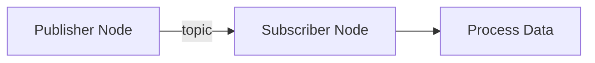

# Feature Specification: Book Architecture and Structure

**Feature Branch**: `001-book-architecture`
**Created**: 2025-11-28
**Status**: Draft
**Input**: User description: "Design the overall book architecture and structure for the Physical AI & Humanoid Robotics textbook.

**Requirements:**
- Define 4 modules with clear themes and learning progression
- Create chapter titles for each module (3-4 chapters covering Module 1 minimum)
- Establish prerequisites and dependencies between chapters
- Define learning objectives hierarchy
- Create Docusaurus sidebar configuration structure

**Deliverables:**
- Module breakdown with themes
- Chapter titles and descriptions
- Prerequisites map
- Docusaurus sidebar structure (sidebars.ts)

**Success Criteria:**
- 4 modules defined
- Module 1 has 3-4 chapter titles
- Each chapter builds logically on previous
- Prerequisites explicitly stated
- Sidebar structure ready for implementation"

## User Scenarios & Testing *(mandatory)*

### User Story 1 - Navigate Sequential Learning Path (Priority: P1)

As a robotics beginner, I want to follow a structured learning path from basic Physical AI concepts through ROS 2 fundamentals to advanced topics, so that I can build knowledge systematically without getting overwhelmed.

**Why this priority**: The core value of the textbook is its structured curriculum. Without a clear learning path, the platform becomes a disorganized collection of articles rather than an educational tool.

**Independent Test**: Can be fully tested by navigating through the Docusaurus sidebar and verifying that chapters appear in logical order with clear progression from foundational to advanced topics. Delivers value by allowing students to understand the "big picture" and know what to learn next.

**Acceptance Scenarios**:

1. **Given** a student opens the textbook homepage, **When** they view the sidebar, **Then** they see 4 clearly labeled modules with descriptive names
2. **Given** a student selects Module 1, **When** they expand it in the sidebar, **Then** they see 3-4 chapters listed in sequential order
3. **Given** a student completes Chapter 1, **When** they click "Next" at the bottom of the page, **Then** they navigate to Chapter 2 which builds on Chapter 1 concepts
4. **Given** a student is viewing any chapter, **When** they check the chapter introduction, **Then** they see a "Prerequisites" section listing required prior knowledge

---

### User Story 2 - Understand Module Themes and Scope (Priority: P2)

As an educator planning a robotics course, I want to understand what each module covers and how modules relate to each other, so that I can decide which modules to include in my curriculum or recommend to students.

**Why this priority**: Educators and self-directed learners need to understand the scope of each module to make informed decisions about their learning path. This is secondary to P1 because it enhances discoverability but doesn't affect the core learning experience.

**Independent Test**: Can be tested by reading module landing pages and verifying each module has a clear theme statement, learning objectives, and estimated time commitment. Delivers value by helping users make informed decisions about what to study.

**Acceptance Scenarios**:

1. **Given** an educator views Module 1, **When** they read the module introduction, **Then** they see a clear theme statement (e.g., "Foundations of Physical AI and ROS 2")
2. **Given** a student explores the module structure, **When** they review all 4 modules, **Then** they see how modules progress from basic to advanced (foundational concepts → perception → motion → simulation)
3. **Given** a user views any module, **When** they check the module overview, **Then** they see high-level learning objectives for the entire module
4. **Given** a student is planning their study schedule, **When** they review module descriptions, **Then** they understand which modules require prior knowledge from other modules

---

### User Story 3 - Locate Specific Topics Quickly (Priority: P3)

As a student working on a project, I want to quickly find chapters covering specific topics (e.g., "sensor fusion", "path planning"), so that I can reference relevant material without reading the entire textbook sequentially.

**Why this priority**: While the textbook is designed for sequential learning, students will also use it as a reference. This is P3 because it's a convenience feature that enhances usability but isn't essential to the core learning experience.

**Independent Test**: Can be tested by searching the sidebar for keywords and verifying that chapter titles are descriptive enough to identify relevant content. Delivers value by reducing time spent hunting for information.

**Acceptance Scenarios**:

1. **Given** a student needs information about ROS 2 topics, **When** they scan the sidebar chapter titles, **Then** they can identify which chapter covers ROS 2 communication patterns
2. **Given** a user is looking for perception content, **When** they view Module 2, **Then** the module title clearly indicates it covers perception and sensors
3. **Given** a student wants to learn about simulation, **When** they check the sidebar, **Then** they see Module 4 is dedicated to simulation topics
4. **Given** a user expands a module in the sidebar, **When** they read chapter titles, **Then** the titles use clear, searchable terminology (e.g., "Sensor Fusion with ROS 2" rather than vague titles like "Chapter 5: Advanced Topics")

---

### Edge Cases

- What happens when a student skips ahead to an advanced chapter without completing prerequisites?
  - **Solution**: Each chapter's introduction includes a "Prerequisites" section listing required prior knowledge. Students can self-assess readiness.

- How does the system handle chapters that reference multiple prerequisite chapters?
  - **Solution**: Prerequisites are listed explicitly with chapter links. Dependency map shows these relationships visually.

- What if a user wants to learn only one specific module (e.g., only simulation)?
  - **Solution**: Each module's introduction states its prerequisites from other modules. Users can skip irrelevant modules if they already have prerequisite knowledge.

- How do we ensure chapter numbering remains maintainable if chapters are added/removed later?
  - **Solution**: Use semantic chapter IDs in Docusaurus (e.g., `intro-to-physical-ai`) rather than hardcoded numbers. Sidebar order is controlled by `sidebars.ts` configuration.

## Requirements *(mandatory)*

### Functional Requirements

**Module Structure**:
- **FR-001**: System MUST define exactly 4 modules in `frontend/sidebars.ts` using TypeScript `category` type objects with labels: "Module 1: Foundations of Physical AI & ROS 2", "Module 2: Perception & Sensors", "Module 3: Motion Planning & Control", "Module 4: Simulation & Testing"
- **FR-002**: Module 1 MUST contain exactly 6 chapters (intro-physical-ai, ros2-installation, ros2-fundamentals, nodes-topics, services-actions, launch-files) stored as MDX files in `frontend/docs/module-1/`
- **FR-003**: Each module MUST have an `index.mdx` landing page with frontmatter including: title, description, and a "Prerequisites" section stating which prior modules must be completed
- **FR-004**: Module progression MUST follow strict dependency order: Module 2 requires Module 1, Module 3 requires Modules 1-2, Module 4 requires Modules 1-3 (stated explicitly in each module's index.mdx)

**Chapter Requirements**:
- **FR-005**: Each chapter MDX file MUST include YAML frontmatter with mandatory fields: `id` (kebab-case slug), `title`, `description` (max 160 chars), `sidebar_position` (integer), `keywords` (array of strings)
- **FR-006**: Each chapter MUST contain required sections in this order: Learning Objectives, Prerequisites, Introduction, [Main Content Sections], Practical Exercises, Summary, Further Reading, Troubleshooting
- **FR-007**: Chapter IDs MUST use semantic slugs (e.g., `intro-physical-ai`, `ros2-installation`) not numeric IDs, enabling chapters to be reordered in `sidebars.ts` without breaking URLs
- **FR-008**: Chapter titles MUST include domain-specific terminology for searchability (e.g., "ROS 2 Node Communication" not "Communication Basics")

**Navigation & Configuration**:
- **FR-009**: `frontend/sidebars.ts` MUST export a `SidebarsConfig` object with exactly one sidebar (`tutorialSidebar`) containing 4 category objects (one per module)
- **FR-010**: Each sidebar category MUST set `collapsible: true`, with Module 1 set to `collapsed: false` (expanded by default) and Modules 2-4 set to `collapsed: true`
- **FR-011**: Docusaurus MUST be configured with Mermaid plugin (`@docusaurus/theme-mermaid`) enabled via `themes` array and `markdown.mermaid: true` in `docusaurus.config.ts`
- **FR-012**: Prism syntax highlighting MUST support languages: `python`, `cpp`, `bash`, `yaml`, `xml` (configured in `themeConfig.prism.additionalLanguages`)

**Content Standards**:
- **FR-013**: All code examples MUST be complete and runnable with all imports included (no placeholder comments like `// ... rest of code`)
- **FR-014**: Each chapter MUST contain 2-3 complete code examples with accompanying "Expected Output" sections showing exact command-line output
- **FR-015**: Chapters covering complex concepts MUST include at least 1 Mermaid diagram using ` ```mermaid ` code blocks
- **FR-016**: Total word count per chapter (excluding code blocks) MUST be 800-1000 words as per Constitution

**Technical Standards**:
- **FR-017**: All chapter file paths MUST use `.mdx` extension (not `.md`) to support JSX syntax and React components
- **FR-018**: Chapter slugs in `sidebars.ts` MUST match file paths without extension (e.g., `'module-1/intro-physical-ai'` → `docs/module-1/intro-physical-ai.mdx`)
- **FR-019**: Module index pages MUST use `link: {type: 'doc', id: 'module-{n}/index'}` syntax to make category labels clickable
- **FR-020**: The structure MUST support future chapter insertion by using `sidebar_position` values with gaps (e.g., 1, 2, 3, 5, 7) allowing new chapters to be inserted at positions 4, 6 without renumbering

### Key Entities

- **Module**: A thematic grouping of 3-5 related chapters. Contains: module ID, theme statement, learning objectives, prerequisite modules (if any), estimated time commitment, and ordered list of chapters.

- **Chapter**: A single instructional unit (800-1000 words). Contains: chapter ID, title, prerequisites (list of chapter IDs), learning objectives, content, code examples, exercises, summary.

- **Prerequisite**: A dependency relationship indicating that one chapter requires knowledge from another. Contains: source chapter ID, target chapter ID (what must be completed first), and reason (brief explanation of why prerequisite is required).

- **Sidebar Configuration**: Docusaurus navigation structure defining how modules and chapters appear in the sidebar. Contains: module groupings, chapter ordering, collapsible sections, and navigation hierarchy.

## Technology Stack *(mandatory)*

### Core Technologies

- **Docusaurus**: 3.6.3 (Static site generator)
- **React**: 18.3.1 (Bundled with Docusaurus)
- **TypeScript**: 5.x (for configuration files)
- **Node.js**: 18.x or higher

### Docusaurus Plugins & Dependencies

- **@docusaurus/plugin-content-docs**: 3.6.3 (Documentation plugin)
- **@docusaurus/theme-classic**: 3.6.3 (Default theme)
- **@docusaurus/theme-mermaid**: 3.6.3 (Diagram support)
- **prism-react-renderer**: 2.x (Code syntax highlighting)

### Educational Content Technologies

- **ROS 2 Version**: Humble Hawksbill (LTS - Long Term Support until May 2027)
- **Simulation**: Gazebo Harmonic (gz-sim8) - successor to Gazebo Classic
- **Visualization**: RViz 2 (bundled with ROS 2 Humble)
- **Programming Languages in Examples**: Python 3.10+, C++ 17

### Deployment

- **Platform**: GitHub Pages
- **Build Process**: GitHub Actions
- **Base URL**: `https://<username>.github.io/physical-ai-and-humanoid-robotics/`

## Technical Implementation *(mandatory)*

### Docusaurus Configuration

**Directory Structure**:
```
frontend/
├── docs/                          # All educational content
│   ├── module-1/                  # Foundations of Physical AI & ROS 2
│   │   ├── index.mdx              # Module 1 landing page
│   │   ├── intro-physical-ai.mdx
│   │   ├── ros2-installation.mdx
│   │   ├── ros2-fundamentals.mdx
│   │   ├── nodes-topics.mdx
│   │   ├── services-actions.mdx
│   │   └── launch-files.mdx
│   ├── module-2/                  # Perception & Sensors
│   │   ├── index.mdx
│   │   ├── sensor-overview.mdx
│   │   ├── camera-integration.mdx
│   │   ├── lidar-processing.mdx
│   │   ├── sensor-fusion.mdx
│   │   └── perception-pipeline.mdx
│   ├── module-3/                  # Motion Planning & Control
│   │   ├── index.mdx
│   │   ├── kinematics-basics.mdx
│   │   ├── path-planning.mdx
│   │   ├── navigation-stack.mdx
│   │   └── control-theory.mdx
│   └── module-4/                  # Simulation & Testing
│       ├── index.mdx
│       ├── gazebo-basics.mdx
│       ├── urdf-modeling.mdx
│       └── integration-testing.mdx
├── src/
│   └── css/
│       └── custom.css
├── static/
│   └── img/
├── docusaurus.config.ts
├── sidebars.ts
└── package.json
```

**Sidebar Configuration** (`frontend/sidebars.ts`):
```typescript
import type {SidebarsConfig} from '@docusaurus/plugin-content-docs';

const sidebars: SidebarsConfig = {
  tutorialSidebar: [
    {
      type: 'category',
      label: 'Module 1: Foundations of Physical AI & ROS 2',
      link: {
        type: 'doc',
        id: 'module-1/index',
      },
      collapsible: true,
      collapsed: false,
      items: [
        'module-1/intro-physical-ai',
        'module-1/ros2-installation',
        'module-1/ros2-fundamentals',
        'module-1/nodes-topics',
        'module-1/services-actions',
        'module-1/launch-files',
      ],
    },
    {
      type: 'category',
      label: 'Module 2: Perception & Sensors',
      link: {
        type: 'doc',
        id: 'module-2/index',
      },
      collapsible: true,
      collapsed: true,
      items: [
        'module-2/sensor-overview',
        'module-2/camera-integration',
        'module-2/lidar-processing',
        'module-2/sensor-fusion',
        'module-2/perception-pipeline',
      ],
    },
    {
      type: 'category',
      label: 'Module 3: Motion Planning & Control',
      link: {
        type: 'doc',
        id: 'module-3/index',
      },
      collapsible: true,
      collapsed: true,
      items: [
        'module-3/kinematics-basics',
        'module-3/path-planning',
        'module-3/navigation-stack',
        'module-3/control-theory',
      ],
    },
    {
      type: 'category',
      label: 'Module 4: Simulation & Testing',
      link: {
        type: 'doc',
        id: 'module-4/index',
      },
      collapsible: true,
      collapsed: true,
      items: [
        'module-4/gazebo-basics',
        'module-4/urdf-modeling',
        'module-4/integration-testing',
      ],
    },
  ],
};

export default sidebars;
```

**Navigation Configuration** (`docusaurus.config.ts` excerpt):
```typescript
const config: Config = {
  title: 'Physical AI & Humanoid Robotics',
  tagline: 'Interactive Learning for ROS 2 and Robotics',
  favicon: 'img/favicon.ico',

  url: 'https://<username>.github.io',
  baseUrl: '/physical-ai-and-humanoid-robotics/',
  organizationName: '<github-username>',
  projectName: 'physical-ai-and-humanoid-robotics',

  themeConfig: {
    navbar: {
      title: 'Physical AI & Humanoid Robotics',
      items: [
        {
          type: 'docSidebar',
          sidebarId: 'tutorialSidebar',
          position: 'left',
          label: 'Textbook',
        },
      ],
    },
    prism: {
      theme: prismThemes.github,
      darkTheme: prismThemes.dracula,
      additionalLanguages: ['python', 'cpp', 'bash', 'yaml', 'xml'],
    },
  },

  markdown: {
    mermaid: true,
  },
  themes: ['@docusaurus/theme-mermaid'],
};
```

**URL Structure**:
- Base: `/docs/`
- Modules: `/docs/module-{1-4}/`
- Chapters: `/docs/module-{1-4}/{chapter-slug}`
- Examples:
  - Module 1 Index: `/docs/module-1/`
  - Chapter 1: `/docs/module-1/intro-physical-ai`
  - Chapter 4: `/docs/module-1/nodes-topics`

## Chapter Template Specification *(mandatory)*

Each chapter MDX file MUST follow this structure:

**Frontmatter Schema**:
```yaml
---
id: chapter-slug                    # Unique identifier (kebab-case)
title: "Chapter Title"              # Display title
description: "Brief summary"        # SEO description (max 160 chars)
sidebar_label: "Short Label"        # Sidebar text (optional, defaults to title)
sidebar_position: 1                 # Order within module
keywords:
  - "ROS 2"
  - "Physical AI"
  - "specific-topic"
---
```

**Required Content Sections**:

```markdown
# Chapter Title

## Learning Objectives

By the end of this chapter, you will be able to:
- [Measurable objective 1, e.g., "Install ROS 2 Humble on Ubuntu 22.04"]
- [Measurable objective 2, e.g., "Create a basic ROS 2 publisher node"]
- [Measurable objective 3, e.g., "Launch multiple nodes using launch files"]

## Prerequisites

**Required Knowledge**:
- [Prerequisite 1 with link, e.g., "[Introduction to Physical AI](./intro-physical-ai)"]
- [Prerequisite 2, e.g., "Basic command-line proficiency"]

**System Requirements** (if applicable):
- Ubuntu 22.04 LTS
- 4GB RAM minimum
- 10GB disk space

## Introduction

[2-3 paragraphs introducing the chapter topic, explaining why it matters,
and how it fits into the broader curriculum. ~150-200 words]

## [Section 1: Main Content]

[Explanatory content with subsections as needed. ~200-300 words per major section]

### Code Example

```python
# Complete, runnable example with ALL imports
import rclpy
from rclpy.node import Node
from std_msgs.msg import String

class MinimalPublisher(Node):
    def __init__(self):
        super().__init__('minimal_publisher')
        self.publisher_ = self.create_publisher(String, 'topic', 10)
        self.timer = self.create_timer(0.5, self.timer_callback)
        self.i = 0

    def timer_callback(self):
        msg = String()
        msg.data = f'Hello World: {self.i}'
        self.publisher_.publish(msg)
        self.get_logger().info(f'Publishing: "{msg.data}"')
        self.i += 1

def main(args=None):
    rclpy.init(args=args)
    minimal_publisher = MinimalPublisher()
    rclpy.spin(minimal_publisher)
    minimal_publisher.destroy_node()
    rclpy.shutdown()

if __name__ == '__main__':
    main()
```

**Expected Output**:
```
[INFO] [minimal_publisher]: Publishing: "Hello World: 0"
[INFO] [minimal_publisher]: Publishing: "Hello World: 1"
...
```

### Architecture Diagram (when applicable)



## [Section 2: Additional Content]

[Continue with 2-3 more major sections following same pattern]

## Practical Exercises

### Exercise 1: [Task Name]
**Objective**: [What student will accomplish]

**Instructions**:
1. Step 1
2. Step 2
3. Step 3

**Success Criteria**: [How to verify completion]

**Solution**: Available in [solutions/module-1/exercise-1.md](../../solutions/module-1/exercise-1.md)

### Exercise 2: [Task Name]
[Follow same pattern]

## Summary

**Key Takeaways**:
- [Concept 1 learned]
- [Concept 2 learned]
- [Concept 3 learned]

**What's Next**: In the next chapter, we'll explore [preview of next topic].

## Further Reading

- [Official ROS 2 Documentation](https://docs.ros.org/en/humble/)
- [Related research paper or article]
- [Community tutorial or blog post]

## Troubleshooting

**Common Issue 1**: [Problem description]
- **Solution**: [How to fix]

**Common Issue 2**: [Problem description]
- **Solution**: [How to fix]
```

**Content Requirements**:
- Total word count: 800-1000 words (excluding code blocks)
- Code examples: 2-3 complete, runnable examples with all imports
- Exercises: 2-4 practical exercises with solutions
- Diagrams: At least 1 Mermaid diagram for complex concepts
- All technical terms defined on first use
- All ROS 2 commands tested in ROS 2 Humble environment

## Success Criteria *(mandatory)*

### Measurable Outcomes

**Module Structure**:
- **SC-001**: Exactly 4 modules created with sidebar categories in `sidebars.ts`
- **SC-002**: Module 1 contains 6 chapters, Module 2 contains 5 chapters, Module 3 contains 4 chapters, Module 4 contains 3 chapters (total: 18 chapters)
- **SC-003**: Each module has a dedicated `index.mdx` landing page (4 index pages total)
- **SC-004**: All 18 chapter MDX files exist in correct directory structure (`frontend/docs/module-{1-4}/`)

**Navigation Functionality**:
- **SC-005**: All 18 chapters accessible via sidebar when running `npm start` (manual verification)
- **SC-006**: 100% of chapters have working prev/next navigation (18/18 chapters tested)
- **SC-007**: Sidebar renders correctly at 375px viewport width (mobile responsive test passes)
- **SC-008**: Zero navigation dead-ends (all pages link to next chapter or module index)

**Build & Deployment Validation**:
- **SC-009**: `npm run build` completes with 0 errors and 0 warnings
- **SC-010**: All internal chapter links resolve with no 404 errors (automated link checker passes)
- **SC-011**: `npm run lint` passes with 0 TypeScript errors in `docusaurus.config.ts` and `sidebars.ts`
- **SC-012**: Production build deploys successfully to GitHub Pages (staging branch)

**Content Scaffolding**:
- **SC-013**: 100% of chapter MDX files include complete frontmatter (id, title, description, sidebar_position, keywords)
- **SC-014**: All 18 chapters contain placeholder sections: Learning Objectives, Prerequisites, Introduction, Summary (4 sections × 18 chapters = 72 required sections present)
- **SC-015**: Zero Markdown syntax errors when running `npx markdownlint "frontend/docs/**/*.mdx"` (linter passes)

**Educational Quality**:
- **SC-016**: Each module index page states prerequisites from other modules (4 module indexes checked)
- **SC-017**: Chapter titles use consistent domain terminology (e.g., all ROS 2 chapters include "ROS 2" in title - verified across 12 relevant chapters)
- **SC-018**: Module progression follows logical dependency: Module 1 (no prerequisites) → Module 2 (requires Module 1) → Module 3 (requires Modules 1-2) → Module 4 (requires Modules 1-3)

**Technical Compliance**:
- **SC-019**: `sidebars.ts` matches specification structure exactly (4 category objects with correct labels and items arrays)
- **SC-020**: All chapter slugs follow kebab-case naming convention (e.g., `intro-physical-ai`, not `introPhysicalAI`)
- **SC-021**: Technology stack versions match specification (Docusaurus 3.6.3, React 18.3.1, verified in `package.json`)
- **SC-022**: Mermaid plugin installed and configured in `docusaurus.config.ts` for diagram support

## Verification & Testing *(mandatory)*

### Automated Verification Checklist

Run these commands in sequence to verify implementation:

**1. Dependency Installation & Build**:
```bash
cd frontend
npm install
npm run build
```
- ✅ **Pass Criteria**: Build completes with exit code 0, zero errors, zero warnings

**2. TypeScript Linting**:
```bash
npm run lint
```
- ✅ **Pass Criteria**: No TypeScript errors in `docusaurus.config.ts` or `sidebars.ts`

**3. Markdown Syntax Validation**:
```bash
npx markdownlint "docs/**/*.mdx" --config .markdownlint.json
```
- ✅ **Pass Criteria**: Zero Markdown linting errors across all 18 chapter files

**4. Broken Link Detection**:
```bash
# Start local server in background
npm start &
SERVER_PID=$!

# Wait for server to be ready
sleep 10

# Run link checker
npx broken-link-checker http://localhost:3000 --recursive --ordered --exclude-external

# Stop server
kill $SERVER_PID
```
- ✅ **Pass Criteria**: Zero broken internal links (404 errors)

**5. File Structure Validation**:
```bash
# Verify all required files exist
test -f docs/module-1/index.mdx && \
test -f docs/module-1/intro-physical-ai.mdx && \
test -f docs/module-1/ros2-installation.mdx && \
test -f docs/module-1/ros2-fundamentals.mdx && \
test -f docs/module-1/nodes-topics.mdx && \
test -f docs/module-1/services-actions.mdx && \
test -f docs/module-1/launch-files.mdx && \
test -f docs/module-2/index.mdx && \
test -f docs/module-3/index.mdx && \
test -f docs/module-4/index.mdx && \
echo "✅ All required files exist" || echo "❌ Missing files"
```
- ✅ **Pass Criteria**: All 22 required MDX files (18 chapters + 4 module indexes) exist

### Manual Verification Checklist

**Navigation Testing** (5 minutes):
1. Run `npm start` and open http://localhost:3000
2. ✅ Verify sidebar displays all 4 modules with correct labels
3. ✅ Expand Module 1 → Verify 6 chapters listed in order
4. ✅ Click each chapter → Verify prev/next buttons work
5. ✅ Navigate from first chapter to last chapter of Module 1 using only "Next" button
6. ✅ Verify breadcrumbs display: Home → Module → Chapter

**Mobile Responsiveness** (3 minutes):
1. Open browser DevTools (F12)
2. Switch to Responsive Design Mode
3. ✅ Set viewport to 375px width (iPhone SE)
4. ✅ Verify sidebar toggles open/closed via hamburger menu
5. ✅ Verify chapter content is readable (no horizontal scroll for text)
6. ✅ Verify code blocks have horizontal scroll (not cut off)

**Content Structure** (10 minutes):
1. Open 3 random chapter MDX files in VS Code
2. ✅ Verify frontmatter includes: id, title, description, sidebar_position, keywords
3. ✅ Verify chapters contain: Learning Objectives, Prerequisites, Introduction, Summary sections
4. ✅ Verify placeholder text exists (not empty sections)

**Sidebar Configuration** (5 minutes):
1. Open `frontend/sidebars.ts`
2. ✅ Verify 4 category objects exist (one per module)
3. ✅ Verify Module 1 category has 6 items in array
4. ✅ Verify Module 2-4 categories have correct item counts (5, 4, 3)
5. ✅ Verify all item IDs match file slugs (e.g., `'module-1/intro-physical-ai'` → `docs/module-1/intro-physical-ai.mdx`)

**GitHub Pages Deployment** (5 minutes):
1. Push to `staging` branch
2. ✅ GitHub Actions workflow completes successfully
3. ✅ Visit `https://<username>.github.io/physical-ai-and-humanoid-robotics/`
4. ✅ Verify sidebar navigation works in production
5. ✅ Verify CSS and assets load correctly (no CORS errors)

### Acceptance Gate

**All automated checks must pass** before proceeding to content creation phase. If any automated check fails:
1. Document the failure (screenshot + error message)
2. Fix the underlying issue in configuration or file structure
3. Re-run all automated checks until 100% pass

**Manual checks are advisory** but should be addressed before considering architecture "complete". Manual check failures indicate usability issues that will affect students.
