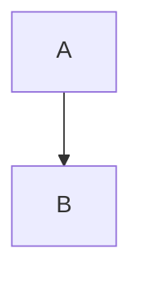

# Component Usage Contract

This document defines the "interface" for the writers using the Docusaurus components in this chapter.

## 1. Admonitions

**Usage**:
```mdx
:::type Title
Content
:::
```

**Types**:
- `danger`: MUST be used for Hardware Requirements (Workstation/Jetson) and Safety (Emergency Stop).
- `warning`: Used for common pitfalls (e.g., "Don't run Sim on Jetson").
- `tip`: Used for productivity hacks.

## 2. Mermaid Diagrams

**Usage**:


**Constraints**:
- Must use accessible color schemes (default Docusaurus theme handles this, do not hardcode colors unless necessary for semantic meaning).
- Keep labels concise.

## 3. Code Blocks

**Usage**:
```python title="filename.py"
# code
```

**Constraints**:
- **Language**: `python` or `bash`.
- **Title**: Mandatory for all multi-line code blocks.
- **Type Hints**: Mandatory for Python.
