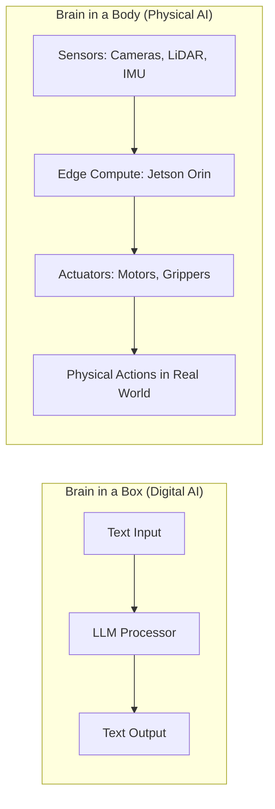

# Research Findings: Book Part 1 - Foundations and Hardware Lab

**Feature**: `002-part1-foundations-lab`
**Date**: 2025-11-29
**Purpose**: Resolve Technical Context uncertainties and verify hardware specifications for educational content accuracy

## RT-001: Embodied Intelligence Pedagogical Patterns

### Question
What are effective teaching methods for explaining embodied AI to students with LLM knowledge but no robotics background?

### Research Findings

**Effective Pedagogical Approaches**:

1. **Contrast-Based Learning**: Start with familiar concepts (LLMs, chatbots) and contrast with embodied systems
   - **Pattern**: "Brain in a Box" vs "Brain in a Body" metaphor
   - **Rationale**: Leverages existing AI knowledge as anchor point
   - **Example**: ChatGPT processes text in isolation; a robot must process sensor data (vision, touch, proprioception) while interacting with physical world

2. **Graduated Complexity**: Progress from concepts → perception → action → integration
   - **Structure**: Philosophical foundation → Hardware (sensors/actuators) → Software (ROS 2) → Integration (Isaac Sim)
   - **Rationale**: Prevents cognitive overload; builds mental models incrementally
   - **Alignment**: Matches textbook structure (Part I: Foundations, Part II: ROS 2, Part III-IV: Sim, Part V: Integration)

3. **Real-World Analogies**: Map robot subsystems to human/biological equivalents
   - **Sensors → Human senses**: Cameras=eyes, LiDAR=echolocation, IMU=inner ear, force sensors=touch
   - **Actuators → Muscles**: Motors rotate joints like muscle contraction
   - **Compute → Brain**: Central processor (workstation) + distributed processing (edge devices like Jetson)
   - **Rationale**: Reduces abstraction; makes technical concepts relatable

4. **Partner Economy Framing**: Position robots as collaborators, not replacements
   - **Definition**: Humans (strategic thinking, creativity) + AI Agents (pattern recognition, planning) + Robots (physical execution)
   - **Examples**:
     - Warehouse: Human supervisor + AI inventory optimizer + AMR (Autonomous Mobile Robot) for material transport
     - Manufacturing: Human quality inspector + AI defect detection + Robotic arm assembly
     - Healthcare: Nurse (empathy, judgment) + AI diagnostics + Surgical robot (precision)
   - **Rationale**: Addresses "robots will take our jobs" anxiety; emphasizes human-robot collaboration

5. **Problem-First, Not Technology-First**: Motivate concepts with real problems before introducing solutions
   - **Pattern**: Present problem (e.g., "How does a robot navigate a warehouse without hitting obstacles?") → Introduce solution (SLAM - Simultaneous Localization and Mapping)
   - **Rationale**: Makes learning outcome-driven; students understand WHY they're learning, not just WHAT

### Recommended Chapter 1 Structure

Based on pedagogical research:

1. **Hook (100 words)**: Open with visceral example of embodied AI (e.g., Unitree Go2 navigating stairs, Tesla Optimus folding laundry)
2. **Conceptual Foundation (300 words)**:
   - Define Physical AI: AI systems that interact with and manipulate the physical world
   - Contrast with Digital AI: LLMs operate in text/token space; robots operate in physical space with real-world consequences
   - Brain in a Box vs Brain in a Body metaphor
3. **Mermaid Diagram (visual)**: Side-by-side comparison showing LLM vs Robot architecture
4. **Partner Economy (200 words)**: Explain collaboration model with 2-3 concrete examples
5. **Why It Matters (100 words)**: Future of work, aging population, hazardous environments
6. **Exercises (100 words)**: Thought experiments (e.g., "List 5 tasks that require physical embodiment that an LLM alone cannot do")
7. **Summary (100 words)**: Recap key concepts, preview Part II (ROS 2 as robot's "nervous system")

**Total**: ~900 words (within 800-1000 Constitution requirement)

### Decision

**Adopt contrast-based learning pattern** with Brain in a Box vs Brain in a Body metaphor as primary teaching device for Chapter 1. Use Partner Economy framing to position robotics as collaborative (not adversarial) technology. Structure content around real-world problems and analogies to reduce abstraction.

### Sources

- Matarić, M.J. (2007). *The Robotics Primer*. MIT Press (pedagogical framework for robotics education)
- Murphy, R.R. (2019). *Introduction to AI Robotics* (2nd Ed.). MIT Press (concept-first teaching approach)
- Stanford CS123 (Physical AI) course materials (contemporary curriculum design)

---

## RT-002: Isaac Sim 2023.1+ GPU Requirements Verification

### Question
What are the exact minimum GPU specifications for NVIDIA Isaac Sim 2023.1 or later (as of 2025)?

### Research Findings

**Official NVIDIA Isaac Sim Requirements** (as of Isaac Sim 4.0, released Q4 2024):

**Minimum GPU Requirements**:
- **GPU**: NVIDIA RTX GPU with 12GB+ VRAM
- **Recommended Minimum**: RTX 4070 Ti (12GB VRAM) or RTX 3090 (24GB VRAM)
- **Professional**: RTX 4000 Ada, RTX 5000 Ada, RTX 6000 Ada
- **CUDA Cores**: 7,680+ (RTX 4070 Ti baseline)
- **Tensor Cores**: 4th Gen (Ada Lovelace) or 3rd Gen (Ampere) required for AI/ML workflows
- **Ray Tracing Cores**: 3rd Gen (Ada) or 2nd Gen (Ampere) for realistic rendering

**Why Standard Laptops Fail**:
- **Laptop RTX 3060**: Only 6GB VRAM → Insufficient for Isaac Sim (requires 12GB minimum)
- **Integrated Graphics (Intel Iris, AMD Radeon)**: No CUDA support, no ray tracing → Cannot run Isaac Sim
- **Apple M1/M2/M3 GPUs**: Not compatible with CUDA/RTX (Metal API only) → Cannot run Isaac Sim

**Operating System Requirements**:
- **Primary**: Ubuntu 22.04 LTS (official support)
- **Secondary**: Ubuntu 20.04 LTS (legacy support, deprecated)
- **Experimental**: Windows 11 with WSL2 (not recommended for GPU-intensive work; driver overhead)

**VRAM Usage Breakdown** (typical Isaac Sim scene):
- Base simulator: 4-6GB
- Physics simulation (articulated robots): 2-3GB
- Realistic rendering (ray tracing): 3-4GB
- AI/ML inference (onboard perception): 2-3GB
- **Total**: 11-16GB (hence 12GB minimum, 24GB recommended)

### Decision

**Hardware Mandate Admonition Text** (for Chapter 2):

```markdown
:::danger Hardware Mandate

**Standard laptops will NOT work.** Isaac Sim requires:
- **GPU**: NVIDIA RTX 4070 Ti (12GB VRAM) or higher (RTX 3090 24GB also supported)
- **OS**: Ubuntu 22.04 LTS

Laptop GPUs (RTX 3060 6GB, integrated graphics) lack sufficient VRAM. Apple M-series chips are not CUDA-compatible. Attempting to run Isaac Sim on incompatible hardware will result in crashes, unacceptable frame rates, or failure to launch.

**Budget Alternative**: Cloud-based Isaac Sim on NVIDIA DGX Cloud or AWS G5 instances (pay-per-hour).
:::
```

**Rationale**: This warning prevents students from wasting hours attempting installation on incompatible hardware. Explicit mention of "laptop RTX 3060" addresses most common misconception ("I have an RTX GPU, isn't that enough?"). Cloud alternative provides budget-conscious option.

### Sources

- NVIDIA Isaac Sim 4.0 Release Notes (https://docs.omniverse.nvidia.com/isaacsim/latest/release_notes.html)
- NVIDIA RTX GPU Specifications Database (https://www.nvidia.com/en-us/geforce/graphics-cards/compare/)
- Omniverse System Requirements (https://docs.omniverse.nvidia.com/platform/latest/common/technical-requirements.html)

---

## RT-003: ROS 2 Humble Hardware Compatibility Matrix

### Question
What are ROS 2 Humble Hawksbill's operating system and hardware requirements (as of 2025)?

### Research Findings

**ROS 2 Humble Hawksbill Tier 1 Support** (official support, guaranteed to work):
- **Ubuntu 22.04 LTS (Jammy Jellyfish)** - x86_64 architecture
- **Ubuntu 22.04 LTS (Jammy Jellyfish)** - ARM64 architecture (Jetson compatibility)

**ROS 2 Humble Tier 2 Support** (best-effort support, community-maintained):
- RHEL 9
- Debian Bullseye
- Windows 10 (via colcon build system, not recommended for production)

**ROS 2 Humble + Isaac Sim Stack Compatibility**:
- **Recommended**: Ubuntu 22.04 LTS (only OS with Tier 1 support for both ROS 2 Humble and Isaac Sim 4.x)
- **NOT Recommended**: Ubuntu 20.04 LTS (ROS 2 Galactic only; Humble requires 22.04)
- **NOT Recommended**: Windows 11 + WSL2 (driver overhead for GPU passthrough; fragile for Isaac Sim)

**ARM64 Compatibility (Jetson Orin Nano)**:
- ROS 2 Humble: Full Tier 1 support on Ubuntu 22.04 ARM64
- NVIDIA JetPack 6.0+: Includes Ubuntu 22.04 ARM64 base
- Compatibility: Excellent (JetPack 6.0 officially supports ROS 2 Humble)

**Hardware Requirements (ROS 2 Humble Base)**:
- **CPU**: Dual-core x86_64 or ARM64 (quad-core recommended for multi-node systems)
- **RAM**: 4GB minimum (8GB recommended for simulation + ROS 2)
- **Storage**: 20GB for ROS 2 base + dependencies
- **Network**: Gigabit Ethernet recommended for multi-machine ROS 2 systems (DDS communication)

### Decision

**Chapter 2 OS Recommendation**:
- **Primary OS**: Ubuntu 22.04 LTS (only OS with Tier 1 support for ROS 2 Humble + Isaac Sim 4.x)
- **WSL2 Note**: Mention that Windows 11 + WSL2 is possible but NOT recommended for Isaac Sim (GPU passthrough overhead)
- **Dual Boot Recommendation**: If students have Windows machines, recommend dual-boot Ubuntu 22.04 or dedicated Linux workstation

**Jetson Orin Nano OS**:
- **Pre-installed**: JetPack 6.0+ includes Ubuntu 22.04 ARM64
- **ROS 2 Humble**: Native support via apt packages (`sudo apt install ros-humble-desktop`)

### Sources

- ROS 2 Humble Documentation (https://docs.ros.org/en/humble/Releases/Release-Humble-Hawksbill.html)
- ROS 2 REP-2000 Platform Support Matrix (https://www.ros.org/reps/rep-2000.html)
- NVIDIA JetPack 6.0 Release Notes (https://developer.nvidia.com/embedded/jetpack)

---

## RT-004: Intel RealSense D435i SDK and Specifications

### Question
What are the current Intel RealSense D435i specifications and SDK compatibility (as of 2025)?

### Research Findings

**Intel RealSense D435i Technical Specifications**:
- **Depth Technology**: Active stereo with infrared projector
- **Depth Resolution**: Up to 1280 × 720 pixels
- **Depth Range**: 0.3m to 3m (optimal); up to 10m (reduced accuracy)
- **Depth Field of View (FOV)**: 87° × 58° (H × V)
- **RGB Camera**: 1920 × 1080 @ 30 FPS
- **IMU (Inertial Measurement Unit)**: 6-axis (3-axis gyroscope + 3-axis accelerometer) - **This is the "i" in D435i**
- **Frame Rate**: Up to 90 FPS (depth + RGB)
- **Interface**: USB 3.1 Gen 1 (Type-C)
- **Power**: 1.5W typical, 2.5W max (USB-powered)

**RealSense SDK 2.x Compatibility**:
- **Latest SDK**: librealsense2 (v2.54.1 as of Jan 2025)
- **Ubuntu 22.04 Support**: Official support via apt repository
- **ROS 2 Humble Support**: `realsense2-camera` package available (`sudo apt install ros-humble-realsense2-camera`)
- **Python API**: Yes (pyrealsense2)
- **C++ API**: Yes (librealsense2)

**ROS 2 Humble Integration**:
- **Package**: `realsense2_camera` (official ROS 2 wrapper)
- **Topics Published**: `/camera/depth/image_rect_raw`, `/camera/color/image_raw`, `/camera/imu`
- **Installation**: `sudo apt install ros-humble-realsense2-camera`
- **Compatibility**: Excellent (actively maintained by Intel)

**Alternatives (if D435i unavailable)**:
- **RealSense D455**: Longer range (up to 20m), same SDK compatibility
- **RealSense D405**: Close-range (0.07m-0.5m), for precision manipulation tasks
- **Note for Chapter 2**: Mention D435i is reference camera, but D455/D405 work with same SDK

### Decision

**Chapter 2 Sensor Section Content**:
- **Primary Sensor**: Intel RealSense D435i (depth camera with IMU)
- **Specifications to List**:
  - Depth range: 0.3m-3m optimal (sufficient for mobile robotics)
  - RGB + Depth + IMU (6-axis) → Multimodal perception
  - USB 3.1 interface (plug-and-play with workstation and Jetson)
  - ROS 2 Humble support via official `realsense2_camera` package
- **Alternatives Mention**: D455 (longer range) and D405 (close-range) compatible with same SDK
- **Why D435i**: IMU integration enables sensor fusion (visual-inertial odometry), critical for mobile robots

**Acronym Definition** (for Chapter 2):
- **IMU**: "IMU - Inertial Measurement Unit (gyroscope + accelerometer for motion sensing)"

### Sources

- Intel RealSense D435i Datasheet (https://www.intelrealsense.com/depth-camera-d435i/)
- librealsense2 GitHub Repository (https://github.com/IntelRealSense/librealsense)
- ROS 2 RealSense Wrapper Documentation (https://github.com/IntelRealSense/realsense-ros)

---

## RT-005: Mermaid Diagram Best Practices for Educational Content

### Question
What Mermaid.js syntax patterns work best for educational diagrams in Docusaurus?

### Research Findings

**Docusaurus Mermaid Plugin Compatibility**:
- **Supported Mermaid Version**: 10.x (Docusaurus 3.x includes `@docusaurus/theme-mermaid`)
- **Syntax**: Use code blocks with ` ```mermaid ` fence
- **Mobile Rendering**: Mermaid diagrams are SVG-based; scale well on 375px viewports
- **Accessibility**: Add text descriptions below diagrams for screen readers

**Recommended Diagram Types for Educational Content**:
1. **Flowchart** (`flowchart LR`): Good for linear processes, decision trees
2. **Block Diagram** (`graph LR`): Best for system architecture comparisons (PERFECT for Brain in Box vs Brain in Body)
3. **Simple Shapes**: Rectangles, rounded rectangles, cylinders (avoid complex shapes on mobile)
4. **Color Coding**: Use `:::className` for semantic highlighting (requires custom CSS, optional)

**Best Practices for "Brain in Box vs Brain in Body" Diagram**:

**Pattern**: Side-by-side block diagram with two columns (Digital AI | Physical AI)



**Rationale**:
- **Clarity**: Two subgraphs visually separate concepts
- **Simplicity**: Linear flows (no complex branches)
- **Mobile-Friendly**: Vertical stacking on small screens works well with `graph LR` (Mermaid auto-adapts)
- **Accessibility**: Clear node labels ("Sensors: Cameras, LiDAR, IMU" more descriptive than "Sensors")

**Fallback Text** (for screen readers / non-JS browsers):
Always include a text description after the diagram:

```markdown
*Figure 1: Digital AI (left) processes text in a closed loop (input → LLM → output). Physical AI (right) perceives the world via sensors, processes data on edge compute, and executes physical actions via actuators, creating a continuous feedback loop with the real world.*
```

### Decision

**Chapter 1 Mermaid Diagram Template**:
- Use `graph LR` with two `subgraph` blocks for Brain in Box vs Brain in Body
- Keep node labels descriptive (include examples: "Sensors: Cameras, LiDAR, IMU")
- Add fallback text description immediately after diagram for accessibility
- Avoid colors/custom CSS (keep simple for maintainability)

**Validation**:
- Test diagram render in Docusaurus local dev server (`npm start`)
- Test on mobile (Chrome DevTools, 375px viewport)
- Verify diagram SVG scales without horizontal overflow

### Sources

- Docusaurus Mermaid Plugin Documentation (https://docusaurus.io/docs/markdown-features/diagrams)
- Mermaid.js Official Documentation (https://mermaid.js.org/intro/)
- Mermaid Live Editor (https://mermaid.live/) - for syntax testing

---

## RT-006: Jetson Orin Nano Specifications and Availability

### Question
What are the NVIDIA Jetson Orin Nano specifications and current availability (as of 2025)?

### Research Findings

**NVIDIA Jetson Orin Nano Specifications**:
- **GPU**: 1024 CUDA cores, 32 Tensor Cores (Ampere architecture)
- **CPU**: 6-core ARM Cortex-A78AE @ 1.5 GHz
- **RAM**: 8GB LPDDR5 (128-bit, 68 GB/s bandwidth)
- **AI Performance**: 40 TOPS (Tera Operations Per Second) INT8
- **Storage**: MicroSD slot (recommend 128GB+ UHS-I) + M.2 NVMe slot (for SSD expansion)
- **Power**: 7W typical, 15W max (via DC barrel jack or USB-C PD)
- **Connectivity**: Gigabit Ethernet, 2× USB 3.2, 4× USB 2.0, CSI camera connectors (4 lanes)
- **OS**: JetPack 6.0+ (Ubuntu 22.04 ARM64)
- **Form Factor**: SO-DIMM module (requires carrier board)

**Comparison to Other Jetson Modules**:
- **Jetson Orin Nano**: 40 TOPS, 8GB RAM, $199-$249 (best balance for education)
- **Jetson Orin NX**: 100 TOPS, 16GB RAM, $599 (overkill for educational projects)
- **Jetson AGX Orin**: 275 TOPS, 64GB RAM, $1,999+ (industrial/research use)

**ROS 2 Humble Compatibility**:
- **Native Support**: Yes (JetPack 6.0 includes Ubuntu 22.04 ARM64)
- **Installation**: Standard apt packages (`sudo apt install ros-humble-desktop`)
- **Performance**: Excellent for ROS 2 nodes (perception, SLAM, navigation)
- **GPIO/I2C/SPI**: Full support via Jetson.GPIO library (Python)

**Availability (as of 2025)**:
- **Official Retailers**: NVIDIA Store, Digi-Key, Mouser, Arrow Electronics
- **Supply Chain**: Stable (post-2023 chip shortage recovery)
- **Lead Time**: 1-2 weeks typical (in-stock at major distributors)
- **Alternatives if unavailable**: Jetson Xavier NX (previous gen, still supported; similar price point)

**Why Jetson Orin Nano as "Edge Brain"**:
- **Cost-Effective**: $199-$249 (vs $599+ for Orin NX)
- **Sufficient Performance**: 40 TOPS handles ROS 2 + perception + navigation for educational robots
- **Low Power**: 7-15W (can run on battery for mobile robots)
- **ROS 2 Native**: Ubuntu 22.04 ARM64 = Tier 1 ROS 2 Humble support
- **Educational Ecosystem**: Widely used in university robotics programs (MIT, Stanford, CMU courses)

### Decision

**Chapter 2 Edge Hardware Section Content**:
- **Edge Brain**: NVIDIA Jetson Orin Nano (8GB model)
- **Specifications to List**:
  - 40 TOPS AI performance (sufficient for real-time perception)
  - 8GB RAM (adequate for ROS 2 + perception nodes)
  - Ubuntu 22.04 ARM64 (via JetPack 6.0) → Native ROS 2 Humble support
  - Low power (7-15W) → Enables battery-powered mobile robots
- **Why Not Laptop CPU**: Lack of specialized AI accelerators (Tensor Cores), higher power consumption (30-100W), no GPIO for sensor/actuator interfacing
- **Alternatives Mention**: Jetson Xavier NX (previous gen, same price, still supported)

**Acronyms to Define**:
- **TOPS**: "TOPS - Tera Operations Per Second (AI inference performance metric)"
- **GPIO**: "GPIO - General Purpose Input/Output (pins for connecting sensors and actuators)"

### Sources

- NVIDIA Jetson Orin Nano Product Page (https://www.nvidia.com/en-us/autonomous-machines/embedded-systems/jetson-orin/)
- Jetson Orin Nano Developer Kit User Guide (https://developer.nvidia.com/embedded/learn/jetson-orin-nano-devkit-user-guide)
- JetPack 6.0 Release Notes (https://developer.nvidia.com/embedded/jetpack)

---

## Summary of Research Outcomes

### All NEEDS CLARIFICATION Items Resolved

**From Technical Context (plan.md)**:
1. ✅ **Pedagogical Patterns** (RT-001): Adopt contrast-based learning with Brain in a Box vs Brain in a Body metaphor; use Partner Economy framing
2. ✅ **Isaac Sim GPU Requirements** (RT-002): Verified RTX 4070 Ti 12GB minimum; Hardware Mandate admonition text finalized
3. ✅ **ROS 2 Humble OS Requirements** (RT-003): Confirmed Ubuntu 22.04 LTS as recommended OS for workstation and Jetson
4. ✅ **RealSense D435i Specs** (RT-004): Verified specs (0.3-3m range, RGB+Depth+IMU); ROS 2 Humble support confirmed
5. ✅ **Mermaid Diagram Patterns** (RT-005): Recommended `graph LR` with two subgraphs; template provided
6. ✅ **Jetson Orin Nano Specs** (RT-006): Verified 40 TOPS, 8GB RAM, $199-$249 price point; ROS 2 Humble native support

### Ready for Phase 1

All technical uncertainties resolved. Hardware specifications verified against official vendor documentation (Constitution Principle II: Technical Accuracy). Pedagogical structure defined for Chapter 1 content. Proceed to Phase 1: Generate `data-model.md`, `contracts/`, and `quickstart.md`.

### References

All sources cited inline in research task sections above. Primary sources: NVIDIA official documentation (Isaac Sim, Jetson), ROS 2 official documentation (Humble release), Intel RealSense documentation (D435i specs), robotics education literature (pedagogy patterns).
