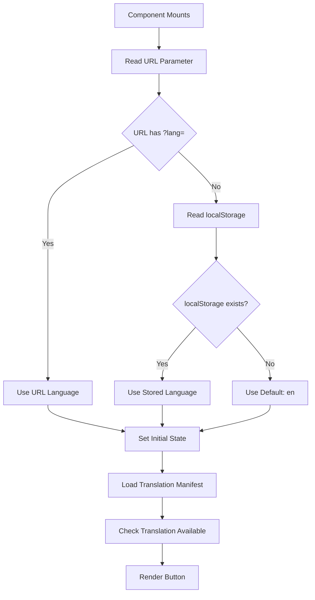
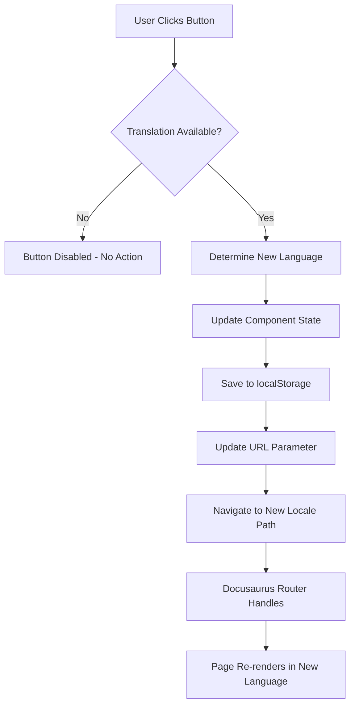
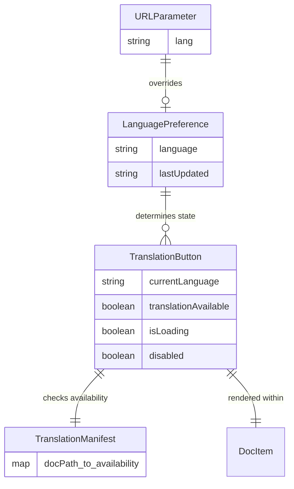

# Data Model: Interactive Urdu Translation Button

**Date**: 2025-12-18
**Feature**: 002-urdu-translation
**Phase**: 1 (Design & Contracts)

## Overview

This document defines the data structures, state management, and entities for the Interactive Urdu Translation Button feature. Since this is a client-side-only feature, the "data model" consists of TypeScript interfaces, React state, and browser storage schemas.

---

## Entity Definitions

### 1. Language Preference

**Description**: User's selected language choice (English or Urdu), persisted across browser sessions.

**Storage Location**: Browser `localStorage`

**TypeScript Interface**:
```typescript
/**
 * Supported language codes following ISO 639-1 standard
 */
type LanguageCode = 'en' | 'ur';

/**
 * Language preference stored in localStorage
 * Key: 'preferredLanguage'
 * Value: LanguageCode ('en' or 'ur')
 */
interface LanguagePreference {
  /** Currently selected language */
  language: LanguageCode;

  /** Timestamp when preference was last updated (ISO 8601 string) */
  lastUpdated: string;
}
```

**localStorage Schema**:
```json
{
  "key": "preferredLanguage",
  "value": "ur",  // or "en"
  "type": "string"
}
```

**Validation Rules**:
- Value MUST be either `'en'` or `'ur'`
- Invalid values fallback to default `'en'`
- Missing key treated as first-time user → default `'en'`

**State Transitions**:
```
[Initial State: undefined]
    ↓
[Load from localStorage or URL parameter]
    ↓
[Current State: 'en' | 'ur']
    ↓
[User clicks toggle button]
    ↓
[New State: opposite of current]
    ↓
[Persist to localStorage + Update URL]
```

---

### 2. Translation Button State

**Description**: UI state of the LanguageSwitcher component, including current language, loading status, and availability.

**Storage Location**: React component state

**TypeScript Interface**:
```typescript
interface TranslationButtonState {
  /** Current language being displayed */
  currentLanguage: LanguageCode;

  /** Whether translation is available for current chapter */
  translationAvailable: boolean;

  /** Loading state during language switch navigation */
  isLoading: boolean;

  /** Button disabled state (true if no translation available) */
  disabled: boolean;

  /** Tooltip/label text to display */
  label: string;
}
```

**Derived Properties**:
```typescript
interface DerivedButtonProps {
  /** Button text based on current language */
  buttonText: string;  // "Translate to Urdu" or "Translate to English"

  /** Icon to display (language flag or text) */
  icon: 'EN' | 'UR' | React.ReactNode;

  /** ARIA label for accessibility */
  ariaLabel: string;  // "Switch to Urdu" or "Switch to English"

  /** Disabled reason (if applicable) */
  disabledReason?: string;  // "Urdu translation coming soon"
}
```

**State Computation Logic**:
```typescript
function computeButtonState(
  currentLanguage: LanguageCode,
  translationManifest: TranslationManifest,
  currentDocPath: string
): TranslationButtonState {
  const translationAvailable = translationManifest[currentDocPath] === true;

  return {
    currentLanguage,
    translationAvailable,
    isLoading: false,
    disabled: !translationAvailable && currentLanguage === 'en',
    label: currentLanguage === 'en' ? 'Translate to Urdu' : 'Translate to English',
  };
}
```

---

### 3. Translation Manifest

**Description**: Build-time generated mapping of English chapter paths to Urdu translation availability.

**Storage Location**: Static JSON file (`src/translation-manifest.json`), imported at build time

**TypeScript Interface**:
```typescript
/**
 * Manifest mapping English doc paths to translation availability
 * Generated at build time by scripts/generate-translation-manifest.js
 */
interface TranslationManifest {
  [docPath: string]: boolean;
}

/**
 * Example manifest structure:
 * {
 *   "chapter-01-foundations/lesson-01-intro.md": true,
 *   "chapter-01-foundations/lesson-02-hardware.md": true,
 *   "chapter-02-ros2/lesson-01-nodes.md": false,
 *   // ... etc
 * }
 */
```

**JSON Schema**:
```json
{
  "$schema": "http://json-schema.org/draft-07/schema#",
  "type": "object",
  "patternProperties": {
    "^[a-z0-9-/]+\\.mdx?$": {
      "type": "boolean"
    }
  },
  "additionalProperties": false
}
```

**Generation Logic** (pseudo-code):
```typescript
for each .md file in frontend/docs/:
  relativePath = file path relative to docs/
  urduPath = frontend/i18n/ur/docusaurus-plugin-content-docs/current/{relativePath}

  if urduPath exists:
    manifest[relativePath] = true
  else:
    manifest[relativePath] = false

write manifest to src/translation-manifest.json
```

---

### 4. URL Parameter State

**Description**: Language code passed via query string (`?lang=ur`) for sharing language-specific links.

**Storage Location**: Browser URL query parameters (read-only from component perspective)

**TypeScript Interface**:
```typescript
interface URLLanguageParams {
  /** Language code from URL query parameter */
  lang?: LanguageCode;
}

/**
 * Parse language from URL query string
 * @returns Language code if valid, null otherwise
 */
function getLanguageFromURL(): LanguageCode | null {
  const params = new URLSearchParams(window.location.search);
  const lang = params.get('lang');

  if (lang === 'en' || lang === 'ur') {
    return lang;
  }

  return null;
}
```

**URL Format Examples**:
```
https://example.com/docs/chapter-01?lang=ur   ← Urdu
https://example.com/docs/chapter-01?lang=en   ← English
https://example.com/docs/chapter-01           ← No parameter (use localStorage/default)
```

**URL Update Logic**:
```typescript
function updateURLParameter(newLang: LanguageCode): void {
  const url = new URL(window.location.href);
  url.searchParams.set('lang', newLang);

  // Update URL without page reload (pushState)
  window.history.pushState({}, '', url.toString());
}
```

---

## State Management Flow

### Initialization Sequence



### Language Switch Flow



---

## Data Validation & Constraints

### Language Code Validation

```typescript
/**
 * Type guard to validate language code at runtime
 */
function isValidLanguageCode(value: unknown): value is LanguageCode {
  return value === 'en' || value === 'ur';
}

/**
 * Safely parse language code with fallback
 */
function parseLanguageCode(value: unknown, fallback: LanguageCode = 'en'): LanguageCode {
  return isValidLanguageCode(value) ? value : fallback;
}
```

### localStorage Safety

```typescript
/**
 * Safe localStorage access with error handling
 */
function safeLocalStorageGet(key: string): string | null {
  try {
    return localStorage.getItem(key);
  } catch (error) {
    // localStorage unavailable (privacy mode, full storage)
    console.warn(`localStorage.getItem failed for key "${key}":`, error);
    return null;
  }
}

function safeLocalStorageSet(key: string, value: string): boolean {
  try {
    localStorage.setItem(key, value);
    return true;
  } catch (error) {
    console.warn(`localStorage.setItem failed for key "${key}":`, error);
    return false;
  }
}
```

---

## Relationships & Dependencies



---

## Performance Considerations

### State Update Frequency
- **Language toggle**: Low frequency (user action, ~1-5 times per session)
- **localStorage read**: Once per page load
- **URL parameter read**: Once per page load
- **Manifest lookup**: Once per page load

### Memory Footprint
- **Translation manifest**: ~1-5 KB JSON (50-100 chapters)
- **Component state**: Negligible (<1 KB)
- **localStorage**: 2 bytes (single character 'en' or 'ur')

**Total**: <10 KB additional memory

### Optimization Strategies
1. **Lazy load manifest**: Import only when component mounts (code splitting)
2. **Memoization**: Use `useMemo` for derived button properties
3. **Debounce**: Not needed (single button click, immediate action)

---

## Testing Strategy

### Unit Tests
```typescript
describe('LanguagePreference', () => {
  test('parses valid language codes', () => {
    expect(parseLanguageCode('en')).toBe('en');
    expect(parseLanguageCode('ur')).toBe('ur');
  });

  test('falls back to default for invalid codes', () => {
    expect(parseLanguageCode('fr')).toBe('en');
    expect(parseLanguageCode(null)).toBe('en');
  });
});

describe('TranslationManifest', () => {
  test('correctly identifies available translations', () => {
    const manifest = { 'chapter-01/intro.md': true, 'chapter-02/advanced.md': false };
    expect(manifest['chapter-01/intro.md']).toBe(true);
    expect(manifest['chapter-02/advanced.md']).toBe(false);
  });
});
```

### Integration Tests
```typescript
describe('useLanguagePreference Hook', () => {
  test('reads from URL parameter first', () => {
    // Mock URL with ?lang=ur
    // Verify hook returns 'ur' regardless of localStorage
  });

  test('falls back to localStorage when no URL parameter', () => {
    // Mock localStorage with 'ur'
    // Verify hook returns 'ur'
  });

  test('persists language change to localStorage', () => {
    // Call switchLanguage('ur')
    // Verify localStorage.setItem called with correct value
  });
});
```

---

**Summary**: All data entities defined with TypeScript interfaces, validation rules, and state transition logic. Ready for component implementation.
